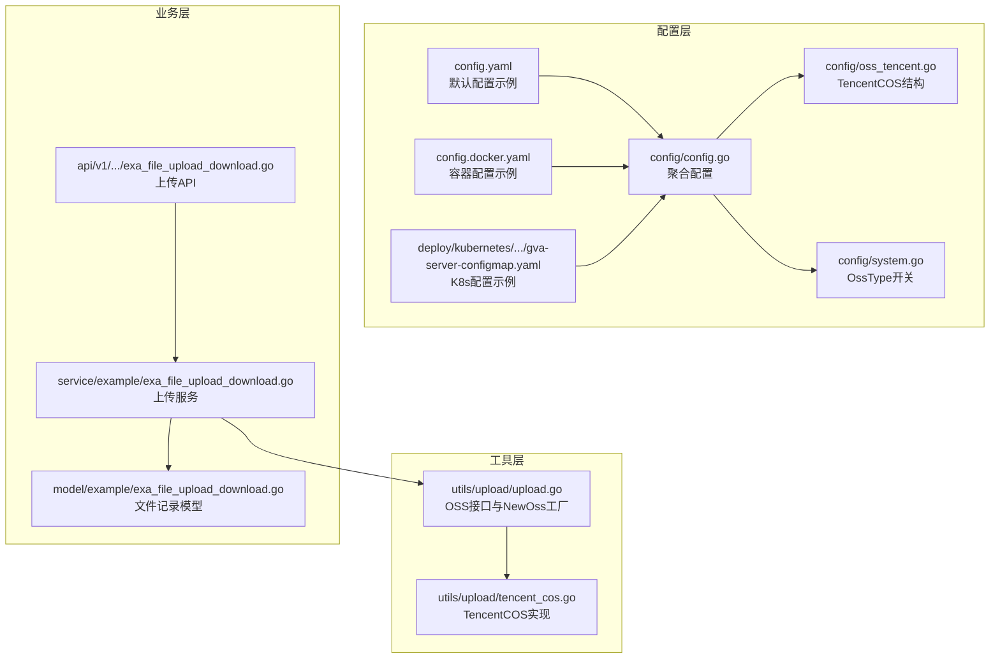
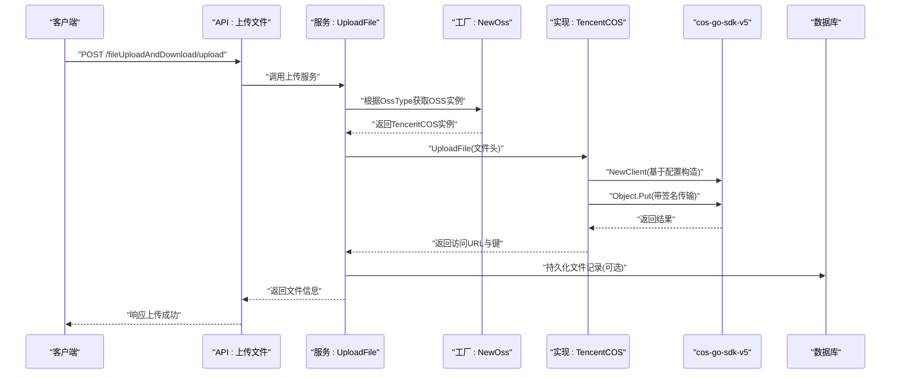
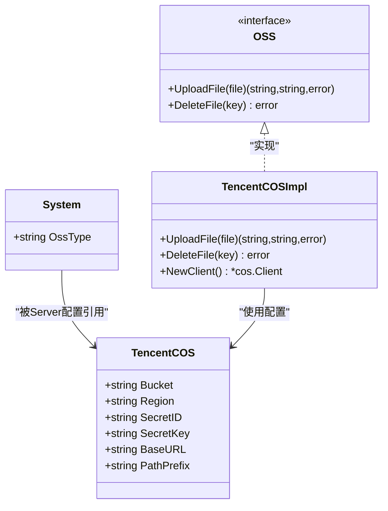
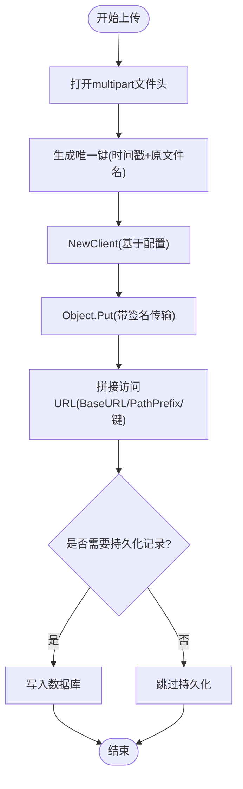
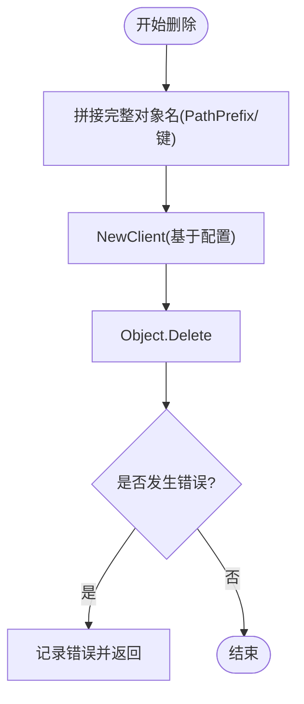
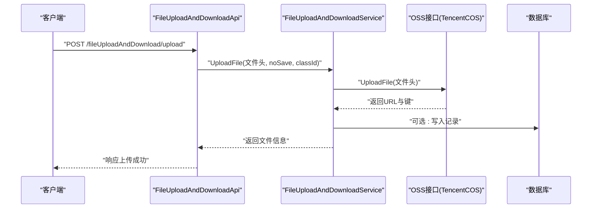
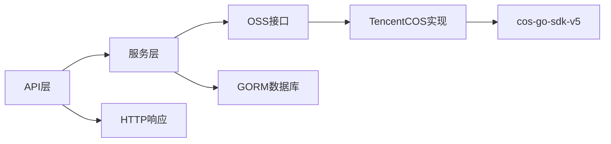

# 腾讯云 COS 集成

<cite>
**本文引用的文件**
- [server/config/oss_tencent.go](file://server/config/oss_tencent.go)
- [server/config/config.go](file://server/config/config.go)
- [server/config/system.go](file://server/config/system.go)
- [server/config.yaml](file://server/config.yaml)
- [server/config/docker.yaml](file://server/config/docker.yaml)
- [server/utils/upload/tencent_cos.go](file://server/utils/upload/tencent_cos.go)
- [server/utils/upload/upload.go](file://server/utils/upload/upload.go)
- [server/api/v1/example/exa_file_upload_download.go](file://server/api/v1/example/exa_file_upload_download.go)
- [server/service/example/exa_file_upload_download.go](file://server/service/example/exa_file_upload_download.go)
- [server/model/example/exa_file_upload_download.go](file://server/model/example/exa_file_upload_download.go)
- [deploy/kubernetes/server/gva-server-configmap.yaml](file://deploy/kubernetes/server/gva-server-configmap.yaml)
- [server/config/cors.go](file://server/config/cors.go)
- [server/go.mod](file://server/go.mod)
- [server/go.sum](file://server/go.sum)
</cite>

## 目录
1. [简介](#简介)
2. [项目结构](#项目结构)
3. [核心组件](#核心组件)
4. [架构总览](#架构总览)
5. [详细组件分析](#详细组件分析)
6. [依赖分析](#依赖分析)
7. [性能考虑](#性能考虑)
8. [故障排查指南](#故障排查指南)
9. [结论](#结论)
10. [附录](#附录)

## 简介
本文件面向在系统中集成腾讯云对象存储（COS）的开发者与运维人员，基于仓库中的现有实现，系统性说明COS的配置方式、上传机制、删除流程以及可扩展的特性（如对象标签、版本控制、跨域配置等）。同时提供使用示例与配置指南，帮助快速完成从配置到上线的全流程。

## 项目结构
围绕COS的关键文件分布如下：
- 配置层：定义COS配置结构、系统OSS类型开关、默认配置样例
- 工具层：抽象OSS接口与具体实现（TencentCOS），封装客户端初始化与上传/删除逻辑
- 业务层：示例文件上传下载API与服务，调用OSS接口完成文件持久化
- 模型层：文件记录模型，包含文件名、URL、标签、键等字段
- 部署层：Kubernetes ConfigMap中提供COS配置示例

**图表来源**
- [server/config/config.go:1-41](file://server/config/config.go#L1-L41)
- [server/config/oss_tencent.go:1-11](file://server/config/oss_tencent.go#L1-L11)
- [server/config/system.go:1-16](file://server/config/system.go#L1-L16)
- [server/config.yaml:218-226](file://server/config.yaml#L218-L226)
- [server/config.docker.yaml:216-224](file://server/config.docker.yaml#L216-L224)
- [deploy/kubernetes/server/gva-server-configmap.yaml:122-129](file://deploy/kubernetes/server/gva-server-configmap.yaml#L122-L129)
- [server/utils/upload/upload.go:17-46](file://server/utils/upload/upload.go#L17-L46)
- [server/utils/upload/tencent_cos.go:18-62](file://server/utils/upload/tencent_cos.go#L18-L62)
- [server/api/v1/example/exa_file_upload_download.go:25-42](file://server/api/v1/example/exa_file_upload_download.go#L25-L42)
- [server/service/example/exa_file_upload_download.go:96-120](file://server/service/example/exa_file_upload_download.go#L96-L120)
- [server/model/example/exa_file_upload_download.go:7-19](file://server/model/example/exa_file_upload_download.go#L7-L19)

**章节来源**
- [server/config/config.go:1-41](file://server/config/config.go#L1-L41)
- [server/config/oss_tencent.go:1-11](file://server/config/oss_tencent.go#L1-L11)
- [server/config/system.go:1-16](file://server/config/system.go#L1-L16)
- [server/config.yaml:218-226](file://server/config.yaml#L218-L226)
- [server/config.docker.yaml:216-224](file://server/config.docker.yaml#L216-L224)
- [deploy/kubernetes/server/gva-server-configmap.yaml:122-129](file://deploy/kubernetes/server/gva-server-configmap.yaml#L122-L129)

## 核心组件
- 配置结构：TencentCOS包含存储桶、地域、SecretID、SecretKey、对外访问域名、路径前缀等关键字段，用于构造COS客户端与生成访问URL。
- OSS接口与工厂：通过统一接口抽象不同厂商存储；根据系统配置的OssType选择具体实现（此处为tencent-cos）。
- TencentCOS实现：封装上传、删除操作，内部使用cos-go-sdk-v5进行签名传输与对象写入。
- 示例API与服务：提供文件上传接口，服务层调用OSS接口完成上传，并将文件信息持久化至数据库。
- 文件记录模型：包含文件名、分类ID、URL、标签、键等字段，便于前端展示与后续检索。

**章节来源**
- [server/config/oss_tencent.go:3-10](file://server/config/oss_tencent.go#L3-L10)
- [server/utils/upload/upload.go:12-15](file://server/utils/upload/upload.go#L12-L15)
- [server/utils/upload/upload.go:20-27](file://server/utils/upload/upload.go#L20-L27)
- [server/utils/upload/tencent_cos.go:20-36](file://server/utils/upload/tencent_cos.go#L20-L36)
- [server/utils/upload/tencent_cos.go:38-48](file://server/utils/upload/tencent_cos.go#L38-L48)
- [server/api/v1/example/exa_file_upload_download.go:25-42](file://server/api/v1/example/exa_file_upload_download.go#L25-L42)
- [server/service/example/exa_file_upload_download.go:96-120](file://server/service/example/exa_file_upload_download.go#L96-L120)
- [server/model/example/exa_file_upload_download.go:7-19](file://server/model/example/exa_file_upload_download.go#L7-L19)

## 架构总览
下图展示了从API到服务再到OSS实现的整体调用链路，以及配置如何驱动客户端初始化与URL拼接。

**图表来源**
- [server/api/v1/example/exa_file_upload_download.go:25-42](file://server/api/v1/example/exa_file_upload_download.go#L25-L42)
- [server/service/example/exa_file_upload_download.go:96-120](file://server/service/example/exa_file_upload_download.go#L96-L120)
- [server/utils/upload/upload.go:20-27](file://server/utils/upload/upload.go#L20-L27)
- [server/utils/upload/tencent_cos.go:20-36](file://server/utils/upload/tencent_cos.go#L20-L36)
- [server/utils/upload/tencent_cos.go:51-61](file://server/utils/upload/tencent_cos.go#L51-L61)

## 详细组件分析

### 配置与初始化
- 配置结构：TencentCOS包含存储桶、地域、SecretID、SecretKey、对外访问域名、路径前缀等字段，用于构造COS客户端与生成访问URL。
- 初始化客户端：根据配置构造基础URL与授权传输器，形成cos.Client实例。
- 系统开关：System结构中的OssType决定使用哪种OSS实现；当OssType为tencent-cos时，NewOss返回TencentCOS实例。
- 默认配置：config.yaml与config.docker.yaml提供示例配置；Kubernetes ConfigMap同样给出示例键值。

**图表来源**
- [server/config/system.go:5](file://server/config/system.go#L5)
- [server/config/oss_tencent.go:3-10](file://server/config/oss_tencent.go#L3-L10)
- [server/utils/upload/upload.go:12-15](file://server/utils/upload/upload.go#L12-L15)
- [server/utils/upload/upload.go:20-27](file://server/utils/upload/upload.go#L20-L27)
- [server/utils/upload/tencent_cos.go:18](file://server/utils/upload/tencent_cos.go#L18)

**章节来源**
- [server/config/oss_tencent.go:3-10](file://server/config/oss_tencent.go#L3-L10)
- [server/config/system.go:5](file://server/config/system.go#L5)
- [server/utils/upload/tencent_cos.go:51-61](file://server/utils/upload/tencent_cos.go#L51-L61)
- [server/utils/upload/upload.go:20-27](file://server/utils/upload/upload.go#L20-L27)
- [server/config.yaml:218-226](file://server/config.yaml#L218-L226)
- [server/config.docker.yaml:216-224](file://server/config.docker.yaml#L216-L224)
- [deploy/kubernetes/server/gva-server-configmap.yaml:122-129](file://deploy/kubernetes/server/gva-server-configmap.yaml#L122-L129)

### 上传机制
- 文件打开与键生成：上传时对multipart文件头进行打开，生成唯一键（时间戳+原文件名）。
- 客户端构造与签名：NewClient根据配置构造基础URL与AuthorizationTransport，实现签名传输。
- 对象写入：通过Object.Put将文件流写入指定路径（路径前缀+键）。
- URL拼接：返回访问URL由BaseURL、PathPrefix与键拼接而成。
- 服务层集成：服务层调用OSS接口完成上传，并按需持久化记录。

**图表来源**
- [server/utils/upload/tencent_cos.go:21-36](file://server/utils/upload/tencent_cos.go#L21-L36)
- [server/utils/upload/tencent_cos.go:51-61](file://server/utils/upload/tencent_cos.go#L51-L61)
- [server/service/example/exa_file_upload_download.go:96-120](file://server/service/example/exa_file_upload_download.go#L96-L120)

**章节来源**
- [server/utils/upload/tencent_cos.go:21-36](file://server/utils/upload/tencent_cos.go#L21-L36)
- [server/utils/upload/tencent_cos.go:51-61](file://server/utils/upload/tencent_cos.go#L51-L61)
- [server/service/example/exa_file_upload_download.go:96-120](file://server/service/example/exa_file_upload_download.go#L96-L120)

### 删除机制
- 键拼接：删除时将PathPrefix与键拼接为完整对象名。
- 客户端调用：使用cos-go-sdk-v5的Object.Delete执行删除。
- 错误处理：捕获错误并记录日志，向上抛出。

**图表来源**
- [server/utils/upload/tencent_cos.go:38-48](file://server/utils/upload/tencent_cos.go#L38-L48)
- [server/utils/upload/tencent_cos.go:51-61](file://server/utils/upload/tencent_cos.go#L51-L61)

**章节来源**
- [server/utils/upload/tencent_cos.go:38-48](file://server/utils/upload/tencent_cos.go#L38-L48)

### API与服务集成
- API层：提供上传接口，接收multipart文件，调用服务层处理。
- 服务层：根据配置选择OSS实现，调用上传接口，生成文件记录（名称、URL、标签、键），可选持久化。
- 模型层：ExaFileUploadAndDownload包含文件名、分类ID、URL、标签、键等字段，映射到数据库表。

**图表来源**
- [server/api/v1/example/exa_file_upload_download.go:25-42](file://server/api/v1/example/exa_file_upload_download.go#L25-L42)
- [server/service/example/exa_file_upload_download.go:96-120](file://server/service/example/exa_file_upload_download.go#L96-L120)
- [server/utils/upload/upload.go:20-27](file://server/utils/upload/upload.go#L20-L27)
- [server/model/example/exa_file_upload_download.go:7-19](file://server/model/example/exa_file_upload_download.go#L7-L19)

**章节来源**
- [server/api/v1/example/exa_file_upload_download.go:25-42](file://server/api/v1/example/exa_file_upload_download.go#L25-L42)
- [server/service/example/exa_file_upload_download.go:96-120](file://server/service/example/exa_file_upload_download.go#L96-L120)
- [server/model/example/exa_file_upload_download.go:7-19](file://server/model/example/exa_file_upload_download.go#L7-L19)

### 特色功能说明
- 对象标签：当前实现未直接使用对象标签字段；可在上传时扩展标签赋值逻辑，结合模型Tag字段进行持久化。
- 版本控制：当前实现未启用版本控制；如需启用，可在NewClient时配置相应选项，并在上传/删除流程中处理版本元数据。
- 跨域配置：系统提供CORS配置项，需配合路由中间件启用；可在此基础上针对COS域名进行放行策略配置。

**章节来源**
- [server/model/example/exa_file_upload_download.go:12](file://server/model/example/exa_file_upload_download.go#L12)
- [server/config/config.go:35-37](file://server/config/config.go#L35-L37)

## 依赖分析
- 组件耦合：服务层通过OSS接口解耦具体实现；API层仅依赖服务层，降低对底层存储的耦合度。
- 外部依赖：cos-go-sdk-v5负责签名与对象操作；Zap用于日志记录；GORM用于数据库持久化。
- 配置驱动：OssType决定实现类型；TencentCOS配置决定客户端初始化参数与URL生成规则。

**图表来源**
- [server/utils/upload/upload.go:20-27](file://server/utils/upload/upload.go#L20-L27)
- [server/utils/upload/tencent_cos.go:18](file://server/utils/upload/tencent_cos.go#L18)
- [server/service/example/exa_file_upload_download.go:96-120](file://server/service/example/exa_file_upload_download.go#L96-L120)

**章节来源**
- [server/utils/upload/upload.go:20-27](file://server/utils/upload/upload.go#L20-L27)
- [server/utils/upload/tencent_cos.go:18](file://server/utils/upload/tencent_cos.go#L18)
- [server/service/example/exa_file_upload_download.go:96-120](file://server/service/example/exa_file_upload_download.go#L96-L120)

## 性能考虑
- 并发上传：当前实现逐个文件上传；对于高并发场景，建议引入连接池与限速策略，避免SDK与网络成为瓶颈。
- URL生成：BaseURL与PathPrefix组合简单高效；确保BaseURL与实际CDN/域名一致，减少重定向。
- 日志与错误：错误路径会记录日志并返回；建议在生产环境增加重试与熔断策略，提升稳定性。

## 故障排查指南
- 无法连接COS：检查SecretID/SecretKey、Bucket、Region与BaseURL是否正确；确认网络可达与DNS解析正常。
- 上传失败：查看Open文件与Put操作的日志输出；核对路径前缀与键是否符合预期。
- 删除失败：确认键值拼接是否包含路径前缀；检查权限与对象是否存在。
- CORS问题：若出现跨域错误，检查CORS配置与中间件启用情况。

**章节来源**
- [server/utils/upload/tencent_cos.go:24-27](file://server/utils/upload/tencent_cos.go#L24-L27)
- [server/utils/upload/tencent_cos.go:43-46](file://server/utils/upload/tencent_cos.go#L43-L46)
- [server/config/config.go:35-37](file://server/config/config.go#L35-L37)

## 结论
本项目已完整实现基于cos-go-sdk-v5的腾讯云COS上传与删除能力，通过统一接口与配置驱动，具备良好的可扩展性。当前实现侧重于基础上传与URL生成，对象标签、版本控制与跨域策略可按需增强。结合默认配置与部署示例，可快速完成从开发到生产的落地。

## 附录

### 配置项说明
- 存储桶（bucket）：COS存储桶名称
- 地域（region）：COS所在地域
- SecretID/SecretKey：访问凭证
- 对外访问域名（base-url）：用于拼接公开访问URL
- 路径前缀（path-prefix）：对象键的前缀路径

**章节来源**
- [server/config/oss_tencent.go:3-10](file://server/config/oss_tencent.go#L3-L10)
- [server/config.yaml:218-226](file://server/config.yaml#L218-L226)
- [server/config.docker.yaml:216-224](file://server/config.docker.yaml#L216-L224)
- [deploy/kubernetes/server/gva-server-configmap.yaml:122-129](file://deploy/kubernetes/server/gva-server-configmap.yaml#L122-L129)

### 使用示例与配置指南
- 启用COS：在系统配置中将OssType设置为tencent-cos；在对应配置段填写bucket、region、secret-id、secret-key、base-url、path-prefix。
- 上传文件：调用上传接口，提交multipart文件，服务层将返回URL与键。
- 删除文件：调用删除接口，传入文件键，服务层将删除对应对象。
- 跨域配置：在CORS配置中添加允许的源与头部，配合路由中间件启用。
- CDN加速：将base-url指向CDN域名，确保对象可通过CDN访问。

**章节来源**
- [server/utils/upload/upload.go:20-27](file://server/utils/upload/upload.go#L20-L27)
- [server/api/v1/example/exa_file_upload_download.go:25-42](file://server/api/v1/example/exa_file_upload_download.go#L25-L42)
- [server/service/example/exa_file_upload_download.go:96-120](file://server/service/example/exa_file_upload_download.go#L96-L120)
- [server/config/config.go:35-37](file://server/config/config.go#L35-L37)

### SDK 依赖信息
- cos-go-sdk-v5：腾讯云官方Go SDK，提供COS客户端初始化、签名传输与对象操作能力。

**章节来源**
- [server/go.mod](file://server/go.mod)
- [server/go.sum](file://server/go.sum)