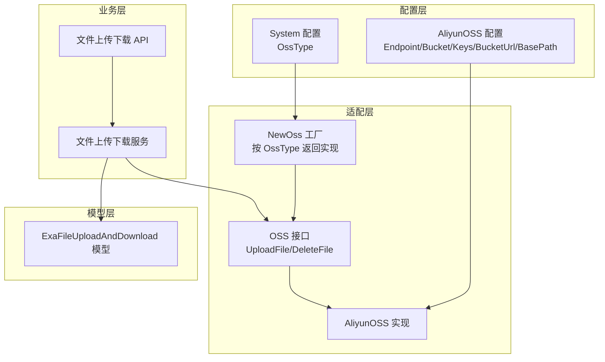
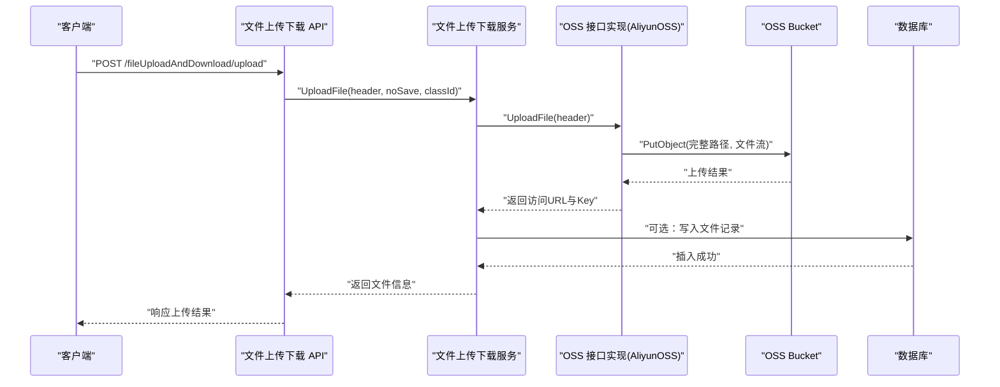
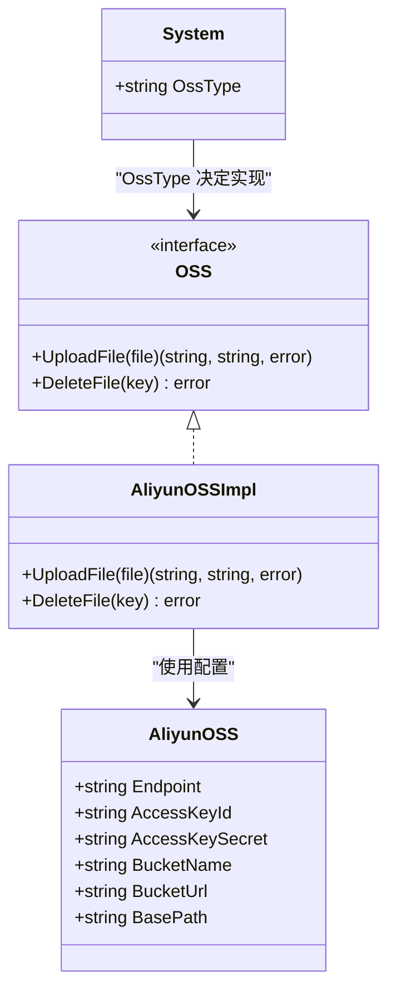
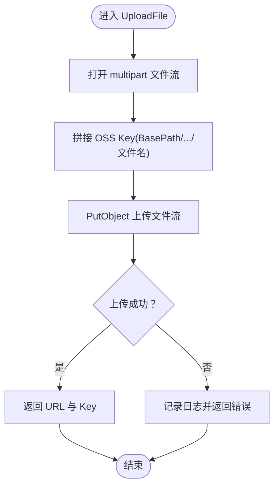
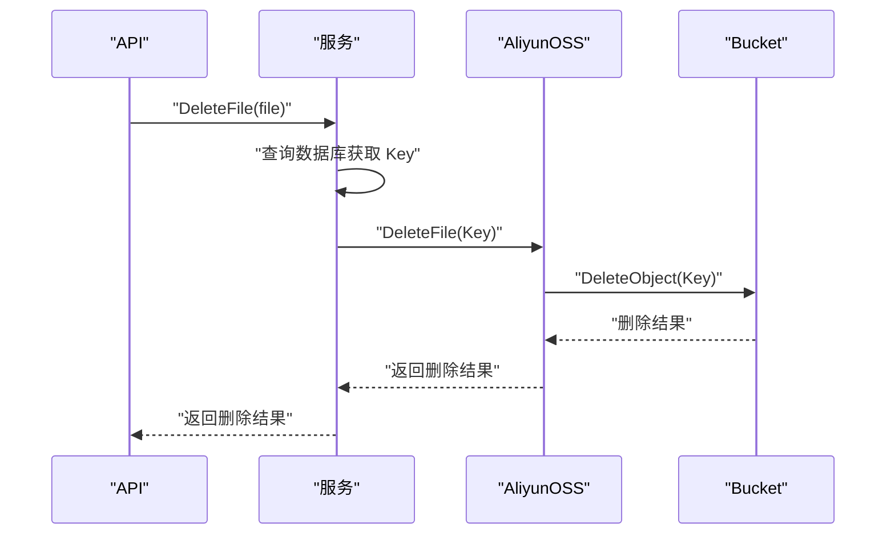
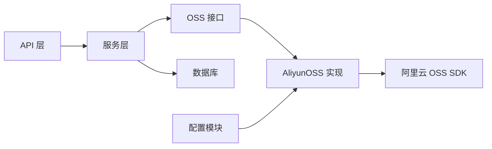

# 阿里云 OSS 集成

<cite>
**本文引用的文件**
- [oss_aliyun.go](file://server/config/oss_aliyun.go)
- [aliyun_oss.go](file://server/utils/upload/aliyun_oss.go)
- [upload.go](file://server/utils/upload/upload.go)
- [config.go](file://server/config/config.go)
- [system.go](file://server/config/system.go)
- [exa_file_upload_download.go](file://server/api/v1/example/exa_file_upload_download.go)
- [exa_file_upload_download_service.go](file://server/service/example/exa_file_upload_download.go)
- [exa_file_upload_download_model.go](file://server/model/example/exa_file_upload_download.go)
- [breakpoint_continue.go](file://server/utils/breakpoint_continue.go)
- [exa_breakpoint_continue_model.go](file://server/model/example/exa_breakpoint_continue.go)
</cite>

## 目录
1. [简介](#简介)
2. [项目结构](#项目结构)
3. [核心组件](#核心组件)
4. [架构总览](#架构总览)
5. [详细组件分析](#详细组件分析)
6. [依赖分析](#依赖分析)
7. [性能考虑](#性能考虑)
8. [故障排查指南](#故障排查指南)
9. [结论](#结论)
10. [附录](#附录)

## 简介
本文件面向在 Gin-Vue-Admin 项目中集成阿里云 OSS 存储服务的开发者，系统性阐述 OSS SDK 的集成实现，包括客户端配置、认证机制、连接池管理现状与建议；覆盖文件上传（直传）、删除、获取访问 URL、列举对象等常用操作；解释关键配置项（Endpoint、Bucket、AccessKeyId、AccessKeySecret、BucketUrl、BasePath）；并提供错误处理策略、重试机制、性能优化建议与安全配置指南。

## 项目结构
围绕 OSS 的集成涉及以下层次：
- 配置层：系统配置与 OSS 参数定义
- 适配层：OSS 接口抽象与具体实现（阿里云 OSS）
- 业务层：文件上传下载 API 与服务
- 模型层：文件元数据持久化
- 辅助能力：断点续传（本地实现，非 OSS 分片）

**图表来源**
- [system.go:3-15](file://server/config/system.go#L3-L15)
- [oss_aliyun.go:3-10](file://server/config/oss_aliyun.go#L3-L10)
- [upload.go:12-46](file://server/utils/upload/upload.go#L12-L46)
- [aliyun_oss.go:13-75](file://server/utils/upload/aliyun_oss.go#L13-L75)
- [exa_file_upload_download.go:14-136](file://server/api/v1/example/exa_file_upload_download.go#L14-L136)
- [exa_file_upload_download_service.go:96-120](file://server/service/example/exa_file_upload_download.go#L96-L120)
- [exa_file_upload_download_model.go:7-18](file://server/model/example/exa_file_upload_download.go#L7-L18)

**章节来源**
- [config.go:21-30](file://server/config/config.go#L21-L30)
- [system.go:3-15](file://server/config/system.go#L3-L15)
- [oss_aliyun.go:3-10](file://server/config/oss_aliyun.go#L3-L10)
- [upload.go:12-46](file://server/utils/upload/upload.go#L12-L46)
- [aliyun_oss.go:13-75](file://server/utils/upload/aliyun_oss.go#L13-L75)
- [exa_file_upload_download.go:14-136](file://server/api/v1/example/exa_file_upload_download.go#L14-L136)
- [exa_file_upload_download_service.go:96-120](file://server/service/example/exa_file_upload_download.go#L96-L120)
- [exa_file_upload_download_model.go:7-18](file://server/model/example/exa_file_upload_download.go#L7-L18)

## 核心组件
- OSS 接口与工厂
  - 接口定义了统一的上传与删除能力，便于切换不同云厂商实现。
  - 工厂根据系统配置中的 OssType 返回对应实现（如 aliyun-oss）。
- 阿里云 OSS 实现
  - 基于官方 SDK 进行封装，提供直传与删除能力。
  - 通过 NewBucket 构造 OSSClient 并获取 Bucket。
- 业务 API 与服务
  - API 层负责请求解析与响应封装。
  - 服务层协调 OSS 实现与数据库持久化。
- 配置
  - System.OssType 控制 OSS 类型选择。
  - AliyunOSS 结构体承载 Endpoint、AccessKeyId、AccessKeySecret、BucketName、BucketUrl、BasePath 等参数。

**章节来源**
- [upload.go:12-46](file://server/utils/upload/upload.go#L12-L46)
- [aliyun_oss.go:13-75](file://server/utils/upload/aliyun_oss.go#L13-L75)
- [exa_file_upload_download.go:14-136](file://server/api/v1/example/exa_file_upload_download.go#L14-L136)
- [exa_file_upload_download_service.go:96-120](file://server/service/example/exa_file_upload_download.go#L96-L120)
- [system.go:3-15](file://server/config/system.go#L3-L15)
- [oss_aliyun.go:3-10](file://server/config/oss_aliyun.go#L3-L10)

## 架构总览
下图展示从 API 请求到 OSS 的调用链路，以及与数据库的协作：

**图表来源**
- [exa_file_upload_download.go:25-42](file://server/api/v1/example/exa_file_upload_download.go#L25-L42)
- [exa_file_upload_download_service.go:96-120](file://server/service/example/exa_file_upload_download.go#L96-L120)
- [aliyun_oss.go:15-41](file://server/utils/upload/aliyun_oss.go#L15-L41)
- [exa_file_upload_download_model.go:7-18](file://server/model/example/exa_file_upload_download.go#L7-L18)

## 详细组件分析

### 配置与认证
- 系统配置
  - OssType：决定 OSS 实现类型，当值为 aliyun-oss 时，工厂返回阿里云 OSS 实现。
- 阿里云 OSS 配置
  - Endpoint：OSS 服务入口。
  - AccessKeyId / AccessKeySecret：鉴权凭据。
  - BucketName：目标存储空间。
  - BucketUrl：对外访问域名（用于拼接公开访问 URL）。
  - BasePath：OSS 上的根目录前缀，用于组织文件路径。
- 认证机制
  - 通过 Endpoint、AccessKeyId、AccessKeySecret 初始化 OSSClient。
  - Bucket 初始化后进行 PutObject/DeleteObject 操作。

**图表来源**
- [system.go:3-15](file://server/config/system.go#L3-L15)
- [oss_aliyun.go:3-10](file://server/config/oss_aliyun.go#L3-L10)
- [upload.go:12-46](file://server/utils/upload/upload.go#L12-L46)
- [aliyun_oss.go:13-75](file://server/utils/upload/aliyun_oss.go#L13-L75)

**章节来源**
- [system.go:3-15](file://server/config/system.go#L3-L15)
- [oss_aliyun.go:3-10](file://server/config/oss_aliyun.go#L3-L10)
- [config.go:21-30](file://server/config/config.go#L21-L30)

### 文件上传（直传）
- 调用链
  - API 解析 multipart/form-data，提取文件头。
  - 服务层调用 OSS.UploadFile，内部打开文件流并上传至 OSS。
  - 上传成功后返回访问 URL 与 OSS Key（用于后续删除）。
- 路径组织
  - OSS Key 由 BasePath + 固定目录 + 日期 + 原始文件名组成，确保唯一性与可维护性。
- 返回值
  - 访问 URL：BucketUrl + Key，可用于公开访问。
  - Key：OSS 对象键，用于删除与后续管理。

**图表来源**
- [aliyun_oss.go:15-41](file://server/utils/upload/aliyun_oss.go#L15-L41)

**章节来源**
- [exa_file_upload_download.go:25-42](file://server/api/v1/example/exa_file_upload_download.go#L25-L42)
- [exa_file_upload_download_service.go:96-120](file://server/service/example/exa_file_upload_download.go#L96-L120)
- [aliyun_oss.go:15-41](file://server/utils/upload/aliyun_oss.go#L15-L41)

### 文件删除
- 调用链
  - API 接收文件记录 ID，服务层查询数据库获取 Key。
  - 服务层调用 OSS.DeleteFile(key) 执行删除。
  - 删除成功后清理数据库记录。
- 注意
  - 若 Bucket 未开启删除权限或 Key 不正确，会返回错误。

**图表来源**
- [exa_file_upload_download.go:69-82](file://server/api/v1/example/exa_file_upload_download.go#L69-L82)
- [exa_file_upload_download_service.go:43-55](file://server/service/example/exa_file_upload_download.go#L43-L55)
- [aliyun_oss.go:43-59](file://server/utils/upload/aliyun_oss.go#L43-L59)

**章节来源**
- [exa_file_upload_download.go:69-82](file://server/api/v1/example/exa_file_upload_download.go#L69-L82)
- [exa_file_upload_download_service.go:43-55](file://server/service/example/exa_file_upload_download.go#L43-L55)
- [aliyun_oss.go:43-59](file://server/utils/upload/aliyun_oss.go#L43-L59)

### 获取访问 URL 与列举对象
- 获取访问 URL
  - 上传成功后返回的 URL 即为公开访问地址，由 BucketUrl 与 Key 拼接而成。
- 列举对象
  - 当前实现未提供列举对象的 API。若需列举，可在服务层扩展，基于 OSS SDK 的 ListObjects/ ListObjectsV2 能力实现分页列举，并结合数据库记录进行筛选。

**章节来源**
- [aliyun_oss.go:40](file://server/utils/upload/aliyun_oss.go#L40)
- [exa_file_upload_download_service.go:69-88](file://server/service/example/exa_file_upload_download.go#L69-L88)

### 断点续传与分片上传
- 断点续传（本地）
  - 项目提供了本地断点续传工具，将分片写入本地临时目录，最终合并生成完整文件。
  - 该能力与 OSS 无直接关联，适合本地缓存场景。
- 分片上传（OSS）
  - 当前实现采用直传 PutObject，未使用 OSS SDK 的分片上传能力。
  - 若需实现分片上传，可在 AliyunOSS 实现中引入 SDK 的 InitiateMultipartUpload、UploadPart、CompleteMultipartUpload 等接口，并结合断点续传的本地缓存策略，实现更稳健的大文件传输。

**章节来源**
- [breakpoint_continue.go:26-107](file://server/utils/breakpoint_continue.go#L26-L107)
- [exa_breakpoint_continue_model.go:7-24](file://server/model/example/exa_breakpoint_continue.go#L7-L24)

### 图片处理、视频转码、CDN 加速
- 当前代码未实现图片处理、视频转码、CDN 加速等功能。
- 若需使用阿里云提供的图片处理与视频转码能力，可在服务层对接相应 API（如图片服务的样式处理、视频点播的转码任务），并将处理后的 URL 返回给前端。

## 依赖分析
- 组件耦合
  - API 与服务层通过接口解耦，服务层通过工厂选择 OSS 实现，降低对具体云厂商的耦合。
  - OSS 实现依赖配置模块提供的参数，避免硬编码。
- 外部依赖
  - 阿里云 OSS SDK：用于构建 Client 与 Bucket 并执行上传/删除。
  - 日志与配置：统一的日志记录与配置加载机制贯穿各层。

**图表来源**
- [upload.go:12-46](file://server/utils/upload/upload.go#L12-L46)
- [aliyun_oss.go:61-75](file://server/utils/upload/aliyun_oss.go#L61-L75)
- [exa_file_upload_download_service.go:96-120](file://server/service/example/exa_file_upload_download.go#L96-L120)

**章节来源**
- [upload.go:12-46](file://server/utils/upload/upload.go#L12-L46)
- [aliyun_oss.go:61-75](file://server/utils/upload/aliyun_oss.go#L61-L75)
- [exa_file_upload_download_service.go:96-120](file://server/service/example/exa_file_upload_download.go#L96-L120)

## 性能考虑
- 连接池管理
  - 当前实现每次操作均新建 OSSClient 与 Bucket，未复用连接。
  - 建议：在高并发场景下，对 OSSClient/Bucket 进行缓存与复用，减少初始化开销。
- 上传策略
  - 小文件：直传 PutObject 即可。
  - 大文件：建议实现分片上传，结合断点续传，提升稳定性与速度。
- 路径组织
  - 使用 BasePath + 日期 + 原始文件名，有助于后续清理与统计。
- CDN 与加速
  - 若启用 CDN，建议将 BucketUrl 指向 CDN 域名，减少回源压力。

## 故障排查指南
- 常见错误与定位
  - 新建 Bucket 失败：检查 Endpoint、AccessKeyId、AccessKeySecret、BucketName 是否正确。
  - 上传失败：检查文件流打开、Key 拼接、网络连通性。
  - 删除失败：确认 Key 正确、权限足够。
- 日志与告警
  - 代码中使用统一日志记录，遇到错误会输出详细信息，便于定位问题。
- 重试机制
  - 当前未实现自动重试，建议在网络抖动或临时错误时增加指数退避重试。

**章节来源**
- [aliyun_oss.go:15-41](file://server/utils/upload/aliyun_oss.go#L15-L41)
- [aliyun_oss.go:43-59](file://server/utils/upload/aliyun_oss.go#L43-L59)

## 结论
本项目已实现阿里云 OSS 的基础直传与删除能力，并通过接口抽象与工厂模式实现了云厂商无关的扩展性。建议在生产环境中完善连接池复用、分片上传与断点续传、CDN 加速、重试与监控等能力，以进一步提升稳定性与性能。

## 附录

### 配置项说明
- System.OssType
  - 作用：选择 OSS 实现类型。
  - 取值：aliyun-oss 等。
- AliyunOSS
  - Endpoint：OSS 服务入口。
  - AccessKeyId / AccessKeySecret：访问密钥。
  - BucketName：存储空间名称。
  - BucketUrl：对外访问域名。
  - BasePath：OSS 根目录前缀。

**章节来源**
- [system.go:3-15](file://server/config/system.go#L3-L15)
- [oss_aliyun.go:3-10](file://server/config/oss_aliyun.go#L3-L10)