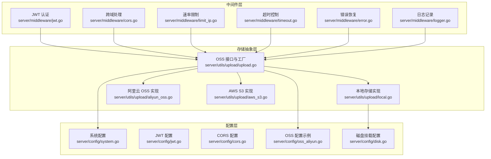
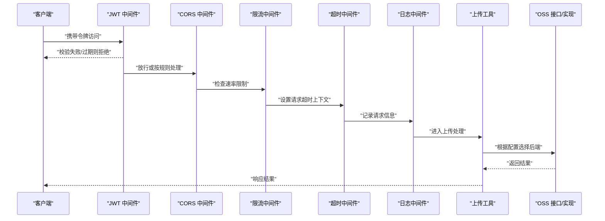
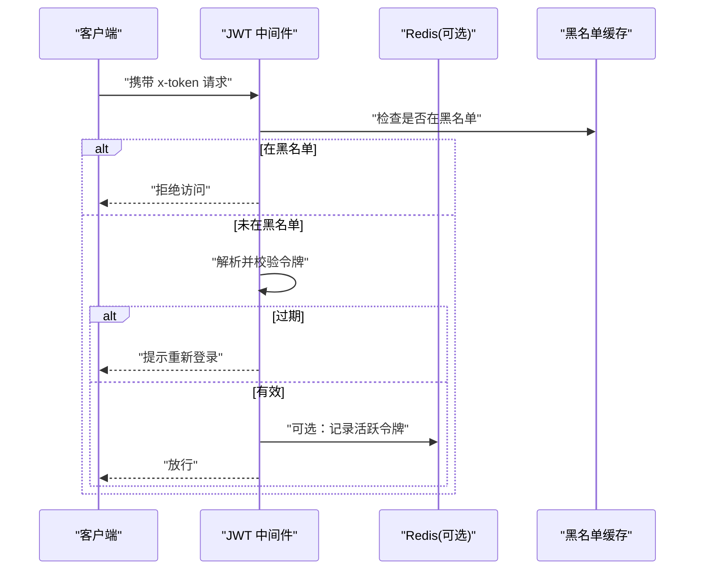
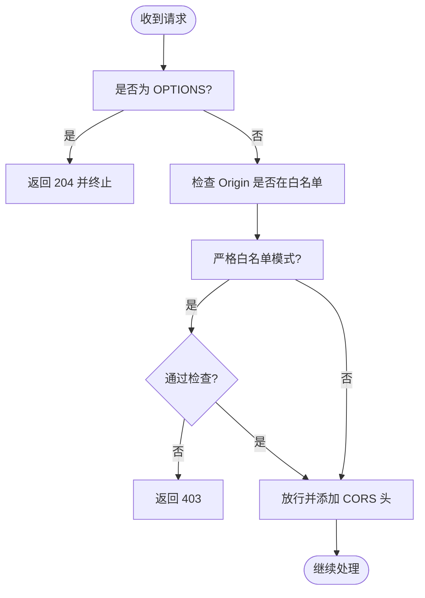
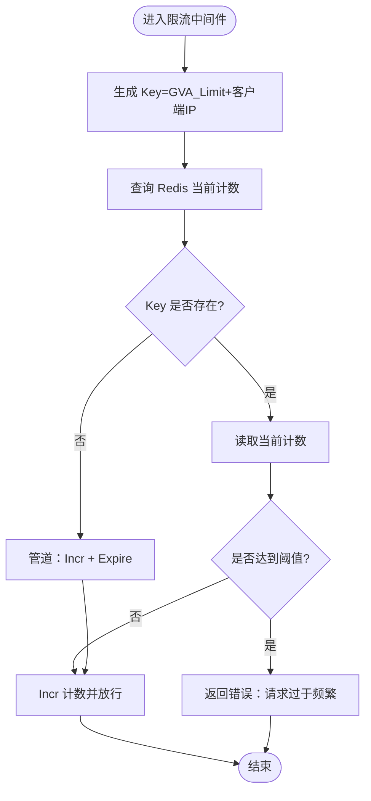
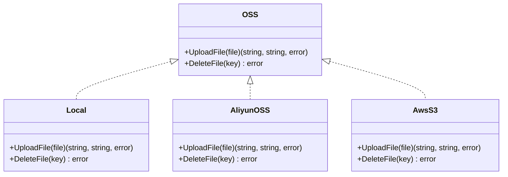
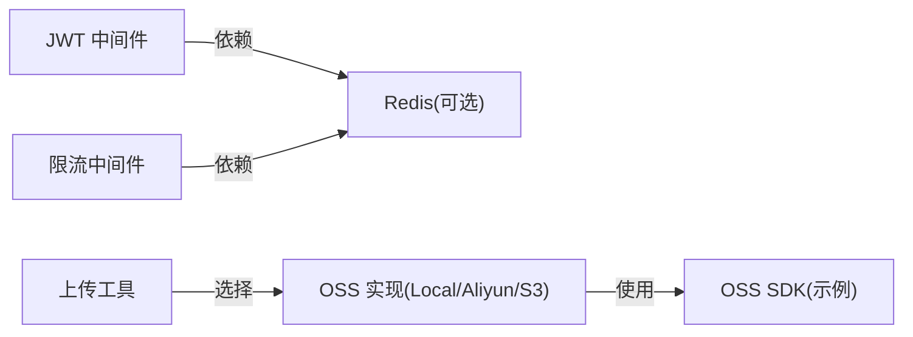

# 存储安全管理

<cite>
**本文引用的文件**
- [server/middleware/jwt.go](file://server/middleware/jwt.go)
- [server/middleware/cors.go](file://server/middleware/cors.go)
- [server/middleware/limit_ip.go](file://server/middleware/limit_ip.go)
- [server/middleware/logger.go](file://server/middleware/logger.go)
- [server/middleware/error.go](file://server/middleware/error.go)
- [server/middleware/timeout.go](file://server/middleware/timeout.go)
- [server/utils/upload/upload.go](file://server/utils/upload/upload.go)
- [server/utils/upload/local.go](file://server/utils/upload/local.go)
- [server/utils/upload/aliyun_oss.go](file://server/utils/upload/aliyun_oss.go)
- [server/utils/upload/aws_s3.go](file://server/utils/upload/aws_s3.go)
- [server/config/disk.go](file://server/config/disk.go)
- [server/config/oss_aliyun.go](file://server/config/oss_aliyun.go)
- [server/config/jwt.go](file://server/config/jwt.go)
- [server/config/cors.go](file://server/config/cors.go)
- [server/config/system.go](file://server/config/system.go)
</cite>

## 目录
1. [引言](#引言)
2. [项目结构](#项目结构)
3. [核心组件](#核心组件)
4. [架构总览](#架构总览)
5. [详细组件分析](#详细组件分析)
6. [依赖分析](#依赖分析)
7. [性能考量](#性能考量)
8. [故障排查指南](#故障排查指南)
9. [结论](#结论)
10. [附录](#附录)

## 引言
本文件面向存储安全管理，围绕后端服务的存储安全架构进行系统化技术说明。内容涵盖访问控制与权限验证、认证与会话管理、存储后端接入与安全配置、文件访问控制策略、加密与密钥管理、合规与审计、威胁防护与监控告警等方面。文档基于仓库现有实现进行归纳总结，帮助读者快速理解并安全地部署与运维该存储安全体系。

## 项目结构
后端采用 Go + Gin 的分层架构，存储安全相关能力主要分布在以下模块：
- 中间件层：JWT 认证、跨域处理、速率限制、超时控制、错误恢复、日志记录
- 存储抽象层：统一的 OSS 接口与多种云存储实现（本地、阿里云 OSS、AWS S3 等）
- 配置层：系统参数、JWT、CORS、OSS 等配置项
- 工具与服务：上传工具、鉴权工具、日志工具等

图表来源
- [server/middleware/jwt.go:1-90](file://server/middleware/jwt.go#L1-L90)
- [server/middleware/cors.go:1-74](file://server/middleware/cors.go#L1-L74)
- [server/middleware/limit_ip.go:1-93](file://server/middleware/limit_ip.go#L1-L93)
- [server/middleware/timeout.go:1-56](file://server/middleware/timeout.go#L1-L56)
- [server/middleware/error.go:1-81](file://server/middleware/error.go#L1-L81)
- [server/middleware/logger.go:1-90](file://server/middleware/logger.go#L1-L90)
- [server/utils/upload/upload.go:1-47](file://server/utils/upload/upload.go#L1-L47)
- [server/utils/upload/local.go:1-110](file://server/utils/upload/local.go#L1-L110)
- [server/utils/upload/aliyun_oss.go:1-76](file://server/utils/upload/aliyun_oss.go#L1-L76)
- [server/utils/upload/aws_s3.go:1-115](file://server/utils/upload/aws_s3.go#L1-L115)
- [server/config/system.go:1-16](file://server/config/system.go#L1-L16)
- [server/config/jwt.go:1-9](file://server/config/jwt.go#L1-L9)
- [server/config/cors.go:1-15](file://server/config/cors.go#L1-L15)
- [server/config/oss_aliyun.go:1-11](file://server/config/oss_aliyun.go#L1-L11)
- [server/config/disk.go:1-10](file://server/config/disk.go#L1-L10)

章节来源
- [server/middleware/jwt.go:1-90](file://server/middleware/jwt.go#L1-L90)
- [server/middleware/cors.go:1-74](file://server/middleware/cors.go#L1-L74)
- [server/middleware/limit_ip.go:1-93](file://server/middleware/limit_ip.go#L1-L93)
- [server/middleware/timeout.go:1-56](file://server/middleware/timeout.go#L1-L56)
- [server/middleware/error.go:1-81](file://server/middleware/error.go#L1-L81)
- [server/middleware/logger.go:1-90](file://server/middleware/logger.go#L1-L90)
- [server/utils/upload/upload.go:1-47](file://server/utils/upload/upload.go#L1-L47)
- [server/utils/upload/local.go:1-110](file://server/utils/upload/local.go#L1-L110)
- [server/utils/upload/aliyun_oss.go:1-76](file://server/utils/upload/aliyun_oss.go#L1-L76)
- [server/utils/upload/aws_s3.go:1-115](file://server/utils/upload/aws_s3.go#L1-L115)
- [server/config/system.go:1-16](file://server/config/system.go#L1-L16)
- [server/config/jwt.go:1-9](file://server/config/jwt.go#L1-L9)
- [server/config/cors.go:1-15](file://server/config/cors.go#L1-L15)
- [server/config/oss_aliyun.go:1-11](file://server/config/oss_aliyun.go#L1-L11)
- [server/config/disk.go:1-10](file://server/config/disk.go#L1-L10)

## 核心组件
- 认证与会话管理：基于 JWT 的认证中间件，支持令牌黑名单、过期刷新、多端登录拦截等
- 访问控制与权限：结合 RBAC/菜单/按钮级权限，配合路由与中间件实现细粒度访问控制
- 存储抽象与后端：统一的 OSS 接口，支持本地、阿里云 OSS、AWS S3 等多种后端；提供上传与删除操作
- 安全中间件：跨域、速率限制、超时、错误恢复、日志记录等
- 配置管理：集中管理 JWT、CORS、系统行为、OSS 等配置项

章节来源
- [server/middleware/jwt.go:16-78](file://server/middleware/jwt.go#L16-L78)
- [server/middleware/cors.go:10-63](file://server/middleware/cors.go#L10-L63)
- [server/middleware/limit_ip.go:27-62](file://server/middleware/limit_ip.go#L27-L62)
- [server/middleware/timeout.go:10-56](file://server/middleware/timeout.go#L10-L56)
- [server/middleware/error.go:20-81](file://server/middleware/error.go#L20-L81)
- [server/middleware/logger.go:41-90](file://server/middleware/logger.go#L41-L90)
- [server/utils/upload/upload.go:17-47](file://server/utils/upload/upload.go#L17-L47)
- [server/config/system.go:3-16](file://server/config/system.go#L3-L16)
- [server/config/jwt.go:3-9](file://server/config/jwt.go#L3-L9)
- [server/config/cors.go:3-15](file://server/config/cors.go#L3-L15)

## 架构总览
下图展示了从客户端到存储后端的整体安全流程：请求经由中间件进行认证、跨域、限流、超时与日志处理，随后进入存储抽象层，依据配置选择具体存储后端完成上传或删除操作。

图表来源
- [server/middleware/jwt.go:16-78](file://server/middleware/jwt.go#L16-L78)
- [server/middleware/cors.go:10-63](file://server/middleware/cors.go#L10-L63)
- [server/middleware/limit_ip.go:27-62](file://server/middleware/limit_ip.go#L27-L62)
- [server/middleware/timeout.go:10-56](file://server/middleware/timeout.go#L10-L56)
- [server/middleware/logger.go:41-90](file://server/middleware/logger.go#L41-L90)
- [server/utils/upload/upload.go:17-47](file://server/utils/upload/upload.go#L17-L47)

## 详细组件分析

### 认证与会话管理（JWT）
- 令牌获取与校验：从请求头提取令牌，解析并校验过期；支持过期前自动刷新并更新响应头
- 黑名单与异地登录：维护令牌黑名单，检测到黑名单即强制登出
- 多端登录拦截：可选启用 Redis 记录活跃令牌，实现多端互斥
- 与存储的关系：上传/删除等敏感操作通常依赖 JWT 中间件前置校验

图表来源
- [server/middleware/jwt.go:16-78](file://server/middleware/jwt.go#L16-L78)

章节来源
- [server/middleware/jwt.go:16-78](file://server/middleware/jwt.go#L16-L78)
- [server/config/jwt.go:3-9](file://server/config/jwt.go#L3-L9)
- [server/config/system.go:10-11](file://server/config/system.go#L10-L11)

### 跨域与传输安全（CORS）
- 全放行与白名单模式：支持“允许全部”和“严格白名单”，严格模式下未通过检查的来源会被拒绝
- 动态暴露头：支持动态暴露新令牌与过期时间等响应头
- 与存储的关系：上传/下载等跨域场景需正确配置 CORS，避免浏览器阻止

图表来源
- [server/middleware/cors.go:30-63](file://server/middleware/cors.go#L30-L63)

章节来源
- [server/middleware/cors.go:10-63](file://server/middleware/cors.go#L10-L63)
- [server/config/cors.go:3-15](file://server/config/cors.go#L3-L15)

### 速率限制与防护（IP 限流）
- 基于 Redis 的滑动窗口计数：对每个客户端 IP 统一维度进行限流
- 可配置周期与阈值：通过系统配置项控制限流窗口与上限
- 与存储的关系：上传/下载等高流量接口可叠加限流，防止滥用与 DDoS

图表来源
- [server/middleware/limit_ip.go:27-93](file://server/middleware/limit_ip.go#L27-L93)

章节来源
- [server/middleware/limit_ip.go:16-62](file://server/middleware/limit_ip.go#L16-L62)
- [server/config/system.go:8-9](file://server/config/system.go#L8-L9)

### 超时控制与健壮性（Timeout）
- 上下文超时：为每个请求设置超时上下文，避免慢请求占用资源
- 防泄漏：使用缓冲通道避免 goroutine 泄漏
- 与存储的关系：上传/下载等 IO 密集型操作建议设置合理超时，避免阻塞

章节来源
- [server/middleware/timeout.go:10-56](file://server/middleware/timeout.go#L10-L56)

### 错误恢复与可观测性（Recovery + Logger）
- 错误恢复：捕获 panic，区分“断开连接”等可忽略场景，记录请求与堆栈信息
- 结构化日志：记录时间、路径、查询、请求体、IP、UA、耗时、错误等字段
- 与存储的关系：上传/删除等关键路径具备统一的错误恢复与日志输出，便于问题定位

章节来源
- [server/middleware/error.go:20-81](file://server/middleware/error.go#L20-L81)
- [server/middleware/logger.go:14-90](file://server/middleware/logger.go#L14-L90)

### 存储抽象与后端实现
- 统一接口：OSS 接口定义上传与删除能力，工厂方法根据配置选择具体实现
- 多后端支持：本地、阿里云 OSS、AWS S3 等
- 与安全的关系：不同后端的安全策略（如访问控制、加密、密钥管理）通过配置与实现解耦

图表来源
- [server/utils/upload/upload.go:12-15](file://server/utils/upload/upload.go#L12-L15)
- [server/utils/upload/local.go:20](file://server/utils/upload/local.go#L20)
- [server/utils/upload/aliyun_oss.go:13](file://server/utils/upload/aliyun_oss.go#L13)
- [server/utils/upload/aws_s3.go:20](file://server/utils/upload/aws_s3.go#L20)

章节来源
- [server/utils/upload/upload.go:17-47](file://server/utils/upload/upload.go#L17-L47)
- [server/utils/upload/local.go:31-109](file://server/utils/upload/local.go#L31-L109)
- [server/utils/upload/aliyun_oss.go:15-59](file://server/utils/upload/aliyun_oss.go#L15-L59)
- [server/utils/upload/aws_s3.go:29-84](file://server/utils/upload/aws_s3.go#L29-L84)

### 本地存储安全要点
- 文件名混淆：上传时对原始文件名进行哈希处理，降低可预测性
- 路径拼接与安全校验：删除时对 key 进行非法字符与路径穿越检查
- 并发安全：删除操作加锁，避免并发删除导致的竞态

章节来源
- [server/utils/upload/local.go:31-70](file://server/utils/upload/local.go#L31-L70)
- [server/utils/upload/local.go:81-109](file://server/utils/upload/local.go#L81-L109)

### 阿里云 OSS 与 AWS S3 安全要点
- 凭据管理：通过配置项提供访问密钥与端点，建议使用最小权限凭据
- 上传路径：建议使用带日期/随机前缀的路径，避免冲突与覆盖
- 删除确认：S3 实现包含对象存在性等待器，确保删除完成

章节来源
- [server/utils/upload/aliyun_oss.go:15-59](file://server/utils/upload/aliyun_oss.go#L15-L59)
- [server/utils/upload/aws_s3.go:29-84](file://server/utils/upload/aws_s3.go#L29-L84)
- [server/config/oss_aliyun.go:3-10](file://server/config/oss_aliyun.go#L3-L10)

### 配置与安全策略
- 系统配置：包含 OSS 类型、端口、限流阈值、是否使用 Redis/Mongo、是否启用严格认证等
- JWT 配置：签名密钥、过期时间、缓冲时间、签发者
- CORS 配置：模式与白名单条目，支持凭证与暴露头

章节来源
- [server/config/system.go:3-16](file://server/config/system.go#L3-L16)
- [server/config/jwt.go:3-9](file://server/config/jwt.go#L3-L9)
- [server/config/cors.go:3-15](file://server/config/cors.go#L3-L15)

## 依赖分析
- 组件内聚：中间件职责单一，围绕请求生命周期提供横切能力
- 组件耦合：存储抽象通过接口与工厂解耦具体实现；JWT/CORS/限流等中间件独立运行
- 外部依赖：Redis 用于限流与可选的活跃令牌记录；OSS SDK 用于云存储后端

图表来源
- [server/middleware/jwt.go:64-67](file://server/middleware/jwt.go#L64-L67)
- [server/middleware/limit_ip.go:44-53](file://server/middleware/limit_ip.go#L44-L53)
- [server/utils/upload/upload.go:21-42](file://server/utils/upload/upload.go#L21-L42)

章节来源
- [server/middleware/jwt.go:64-67](file://server/middleware/jwt.go#L64-L67)
- [server/middleware/limit_ip.go:44-53](file://server/middleware/limit_ip.go#L44-L53)
- [server/utils/upload/upload.go:21-42](file://server/utils/upload/upload.go#L21-L42)

## 性能考量
- 中间件顺序：建议将轻量、快速的中间件（如 CORS、限流）置于前部，减少对后续处理的影响
- Redis 使用：限流与活跃令牌记录依赖 Redis，需关注其延迟与可用性
- 上传性能：大文件上传建议结合断点续传与分片策略（仓库中存在断点续传相关模型），并设置合理超时
- 日志成本：结构化日志建议在生产环境落盘或集中采集，避免过多标准输出带来的 I/O 压力

## 故障排查指南
- 认证失败/过期：检查 JWT 中间件是否正确设置响应头与刷新逻辑；核对签名密钥与过期时间配置
- 跨域失败：确认 CORS 白名单配置与严格模式设置；检查浏览器开发者工具 Network 面板
- 上传失败：查看上传中间件日志；核对 OSS 凭据、桶权限与路径前缀；检查本地存储目录权限
- 限流触发：确认限流阈值与时间窗口配置；检查 Redis 连通性
- 超时错误：适当增大超时时间；检查网络与下游服务性能
- 异常崩溃：利用错误恢复中间件的日志与堆栈信息定位问题

章节来源
- [server/middleware/jwt.go:16-78](file://server/middleware/jwt.go#L16-L78)
- [server/middleware/cors.go:30-63](file://server/middleware/cors.go#L30-L63)
- [server/middleware/limit_ip.go:44-53](file://server/middleware/limit_ip.go#L44-L53)
- [server/middleware/error.go:20-81](file://server/middleware/error.go#L20-L81)
- [server/middleware/logger.go:41-90](file://server/middleware/logger.go#L41-L90)

## 结论
该存储安全体系通过统一的中间件与存储抽象，实现了认证、跨域、限流、超时、日志与错误恢复等关键安全与运维能力。结合多后端存储实现与集中式配置，既满足灵活性又便于统一治理。建议在生产环境中完善密钥管理、审计日志、合规策略与入侵检测，持续提升整体安全水平。

## 附录
- 存储安全最佳实践（概念性建议）
  - 传输加密：强制 HTTPS/TLS，定期轮换证书
  - 静态加密：对象级加密（SSE-KMS/SSE-OSS/SSE-S3），密钥轮换策略
  - 访问控制：最小权限原则，基于 IAM/ACL 控制；私有对象不暴露直链
  - 密钥管理：使用托管密钥服务，避免硬编码；定期轮换
  - 合规与审计：启用操作日志与访问日志，保留审计轨迹；满足数据主权与跨境传输合规
  - 威胁防护：输入校验与白名单、防路径穿越、防暴力破解、DDoS 防护与 WAF
  - 监控与告警：异常访问检测、安全事件聚合、入侵检测与态势感知