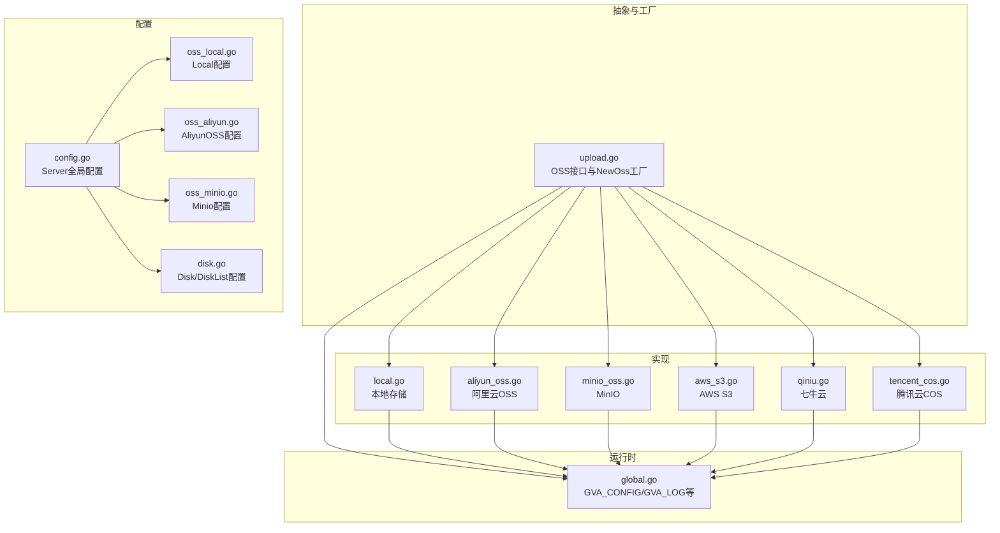
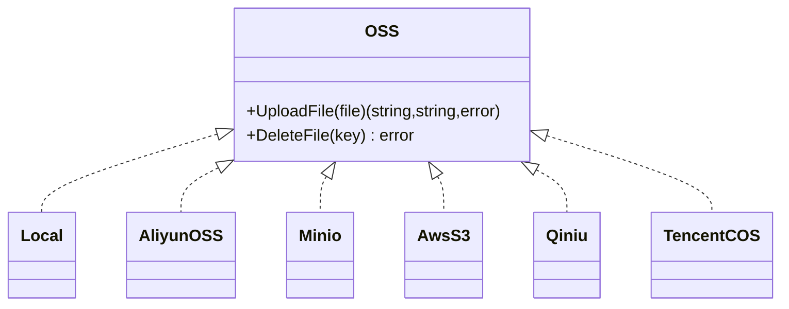
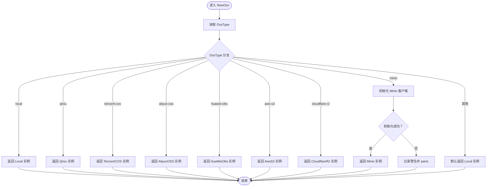
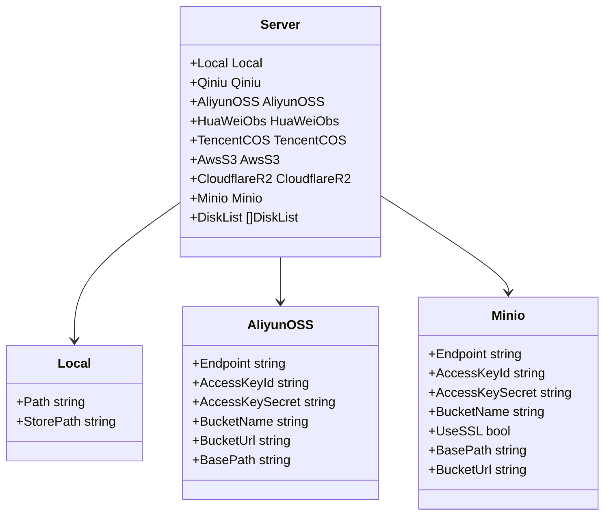
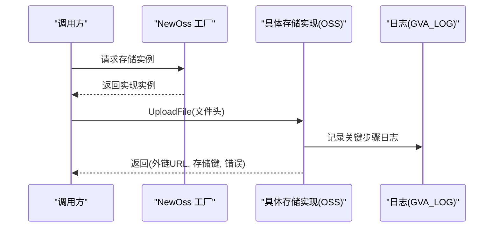

# 存储架构设计

<cite>
**本文引用的文件**
- [server\utils\upload\upload.go](file://server/utils/upload/upload.go)
- [server\utils\upload\local.go](file://server/utils/upload/local.go)
- [server\utils\upload\aliyun_oss.go](file://server/utils/upload/aliyun_oss.go)
- [server\utils\upload\minio_oss.go](file://server/utils/upload/minio_oss.go)
- [server\utils\upload\aws_s3.go](file://server/utils/upload/aws_s3.go)
- [server\utils\upload\qiniu.go](file://server/utils/upload/qiniu.go)
- [server\utils\upload\tencent_cos.go](file://server/utils/upload/tencent_cos.go)
- [server\config\config.go](file://server/config/config.go)
- [server\config\oss_local.go](file://server/config/oss_local.go)
- [server\config\oss_aliyun.go](file://server/config/oss_aliyun.go)
- [server\config\oss_minio.go](file://server/config/oss_minio.go)
- [server\config\disk.go](file://server/config/disk.go)
- [server\global\global.go](file://server/global/global.go)
</cite>

## 目录
1. [简介](#简介)
2. [项目结构](#项目结构)
3. [核心组件](#核心组件)
4. [架构总览](#架构总览)
5. [详细组件分析](#详细组件分析)
6. [依赖分析](#依赖分析)
7. [性能考量](#性能考量)
8. [故障排查指南](#故障排查指南)
9. [结论](#结论)
10. [附录](#附录)

## 简介
本文件系统性阐述存储抽象层的设计理念与实现原理，覆盖以下要点：
- 存储接口的统一抽象与一致性设计
- 存储工厂模式与 NewOss 的工作原理
- 存储类型切换机制与配置驱动的选择策略
- 全局配置结构、存储类型枚举与配置验证机制
- 扩展性设计：新增存储后端的接入方式、接口兼容性与向后兼容策略
- 性能考虑：连接池管理、并发控制、资源回收与超时策略

## 项目结构
存储相关代码主要分布在以下位置：
- 抽象接口与工厂：server/utils/upload/upload.go
- 各存储后端实现：server/utils/upload/*.go
- 配置模型：server/config/*.go
- 全局配置入口：server/global/global.go

图表来源
- [server\utils\upload\upload.go:1-47](file://server/utils/upload/upload.go#L1-L47)
- [server\utils\upload\local.go:1-110](file://server/utils/upload/local.go#L1-L110)
- [server\utils\upload\aliyun_oss.go:1-76](file://server/utils/upload/aliyun_oss.go#L1-L76)
- [server\utils\upload\minio_oss.go:1-107](file://server/utils/upload/minio_oss.go#L1-L107)
- [server\utils\upload\aws_s3.go:1-115](file://server/utils/upload/aws_s3.go#L1-L115)
- [server\utils\upload\qiniu.go:1-97](file://server/utils/upload/qiniu.go#L1-L97)
- [server\utils\upload\tencent_cos.go:1-62](file://server/utils/upload/tencent_cos.go#L1-L62)
- [server\config\config.go:1-41](file://server/config/config.go#L1-L41)
- [server\config\oss_local.go:1-7](file://server/config/oss_local.go#L1-L7)
- [server\config\oss_aliyun.go:1-11](file://server/config/oss_aliyun.go#L1-L11)
- [server\config\oss_minio.go:1-12](file://server/config/oss_minio.go#L1-L12)
- [server\config\disk.go:1-10](file://server/config/disk.go#L1-L10)
- [server\global\global.go:1-69](file://server/global/global.go#L1-L69)

章节来源
- [server\utils\upload\upload.go:1-47](file://server/utils/upload/upload.go#L1-L47)
- [server\config\config.go:1-41](file://server/config/config.go#L1-L41)
- [server\global\global.go:1-69](file://server/global/global.go#L1-L69)

## 核心组件
- 存储接口 OSS：统一 UploadFile 与 DeleteFile 的行为契约，返回值与错误处理保持一致。
- 工厂 NewOss：根据全局配置的 OssType 进行存储类型切换，返回对应实现。
- 各存储实现：本地存储、阿里云OSS、MinIO、AWS S3、七牛云、腾讯云COS。
- 全局配置 Server：集中承载各存储后端的配置项与系统参数。

章节来源
- [server\utils\upload\upload.go:12-15](file://server/utils/upload/upload.go#L12-L15)
- [server\utils\upload\upload.go:20-46](file://server/utils/upload/upload.go#L20-L46)
- [server\config\config.go:3-40](file://server/config/config.go#L3-L40)

## 架构总览
存储抽象层采用“接口 + 工厂 + 配置驱动”的设计，确保：
- 接口一致性：所有后端实现遵循相同的签名与返回约定。
- 切换透明：通过 OssType 即可切换后端，无需修改上层调用代码。
- 配置集中：Server 结构体统一承载所有存储配置，便于维护与扩展。

图表来源
- [server\utils\upload\upload.go:12-15](file://server/utils/upload/upload.go#L12-L15)
- [server\utils\upload\local.go:20-20](file://server/utils/upload/local.go#L20-L20)
- [server\utils\upload\aliyun_oss.go:13-13](file://server/utils/upload/aliyun_oss.go#L13-L13)
- [server\utils\upload\minio_oss.go:23-26](file://server/utils/upload/minio_oss.go#L23-L26)
- [server\utils\upload\aws_s3.go:20-20](file://server/utils/upload/aws_s3.go#L20-L20)
- [server\utils\upload\qiniu.go:16-16](file://server/utils/upload/qiniu.go#L16-L16)
- [server\utils\upload\tencent_cos.go:18-18](file://server/utils/upload/tencent_cos.go#L18-L18)

## 详细组件分析

### 存储接口与一致性设计
- UploadFile 约定：返回外链URL、后端存储键（key），以及错误对象；便于上层统一处理。
- DeleteFile 约定：仅接收后端存储键，返回错误对象；语义清晰、边界明确。
- 错误处理策略：所有实现均在关键步骤记录日志并返回带上下文的错误，便于定位问题。
- 返回值约定：外链URL用于直接访问；key用于后续删除或元数据管理。

章节来源
- [server\utils\upload\upload.go:12-15](file://server/utils/upload/upload.go#L12-L15)

### 工厂模式与 NewOss 实现
- 选择依据：读取全局配置中的 OssType，按字符串枚举进行分支选择。
- 默认回退：当配置不在已知集合中时，默认返回本地存储实现，避免运行时 panic。
- MinIO 特例：若配置启用 MinIO，工厂会尝试初始化客户端；初始化失败会记录警告并触发 panic，以阻止服务在不可用状态下继续运行。
- 可扩展性：新增后端只需在 switch 分支中添加映射，即可被工厂识别。

图表来源
- [server\utils\upload\upload.go:20-46](file://server/utils/upload/upload.go#L20-L46)
- [server\utils\upload\minio_oss.go:28-53](file://server/utils/upload/minio_oss.go#L28-L53)

章节来源
- [server\utils\upload\upload.go:20-46](file://server/utils/upload/upload.go#L20-L46)

### 配置管理架构
- 全局配置结构：Server 聚合各类配置，包含各存储后端的子结构（如 Local、AliyunOSS、Minio 等）。
- 存储类型枚举：通过 OssType 字段的字符串值进行选择（如 "local"、"aliyun-oss"、"minio" 等）。
- 配置验证机制：工厂对未知类型进行兜底；MinIO 初始化失败时主动 panic，避免静默失败。
- 磁盘挂载配置：Disk 与 DiskList 支持多磁盘挂载场景，便于本地存储扩展。

图表来源
- [server\config\config.go:3-40](file://server/config/config.go#L3-L40)
- [server\config\oss_local.go:3-6](file://server/config/oss_local.go#L3-L6)
- [server\config\oss_aliyun.go:3-10](file://server/config/oss_aliyun.go#L3-L10)
- [server\config\oss_minio.go:3-11](file://server/config/oss_minio.go#L3-L11)

章节来源
- [server\config\config.go:3-40](file://server/config/config.go#L3-L40)
- [server\config\oss_local.go:1-7](file://server/config/oss_local.go#L1-L7)
- [server\config\oss_aliyun.go:1-11](file://server/config/oss_aliyun.go#L1-L11)
- [server\config\oss_minio.go:1-12](file://server/config/oss_minio.go#L1-L12)
- [server\config\disk.go:1-10](file://server/config/disk.go#L1-L10)

### 各存储实现要点

#### 本地存储（Local）
- 上传流程：生成加密后的文件名，写入 StorePath，返回 Path 下的可访问路径与存储键。
- 删除流程：校验 key 合法性与存在性，加锁后删除，返回错误或成功。
- 并发控制：使用互斥锁保护删除操作，避免并发删除导致的竞争条件。

章节来源
- [server\utils\upload\local.go:31-70](file://server/utils/upload/local.go#L31-L70)
- [server\utils\upload\local.go:81-109](file://server/utils/upload/local.go#L81-L109)

#### 阿里云OSS（AliyunOSS）
- 上传流程：打开文件流，拼接 BasePath + 日期目录 + 文件名，PutObject 上传，返回 BucketUrl + key。
- 删除流程：通过 Bucket 删除对象。
- 客户端构建：封装 NewBucket，复用 OSS SDK 客户端与存储空间。

章节来源
- [server\utils\upload\aliyun_oss.go:15-41](file://server/utils/upload/aliyun_oss.go#L15-L41)
- [server\utils\upload\aliyun_oss.go:43-59](file://server/utils/upload/aliyun_oss.go#L43-L59)
- [server\utils\upload\aliyun_oss.go:61-75](file://server/utils/upload/aliyun_oss.go#L61-L75)

#### MinIO（Minio）
- 上传流程：读取 multipart 文件内容至内存缓冲，计算扩展名 MIME 类型，使用 PutObject 上传，返回 BucketUrl + key。
- 删除流程：RemoveObject 删除对象。
- 客户端缓存：全局缓存 MinioClient，避免重复初始化；初始化失败直接 panic。
- 超时控制：上传设置 10 分钟超时，删除设置短超时。

章节来源
- [server\utils\upload\minio_oss.go:28-53](file://server/utils/upload/minio_oss.go#L28-L53)
- [server\utils\upload\minio_oss.go:55-97](file://server/utils/upload/minio_oss.go#L55-L97)
- [server\utils\upload\minio_oss.go:99-106](file://server/utils/upload/minio_oss.go#L99-L106)

#### AWS S3（AwsS3）
- 上传流程：使用 v2 SDK 的 Uploader，构造 Key 与 ContentType，上传后返回 BaseURL + key。
- 删除流程：DeleteObject 删除对象，随后等待对象不存在。
- 客户端构建：newS3Client 支持自定义 Endpoint（兼容 MinIO），设置 Region 与凭据。

章节来源
- [server\utils\upload\aws_s3.go:29-54](file://server/utils/upload/aws_s3.go#L29-L54)
- [server\utils\upload\aws_s3.go:63-84](file://server/utils/upload/aws_s3.go#L63-L84)
- [server\utils\upload\aws_s3.go:88-114](file://server/utils/upload/aws_s3.go#L88-L114)

#### 七牛云（Qiniu）
- 上传流程：生成上传令牌，使用表单上传 Put，返回 ImgPath + key。
- 删除流程：通过 BucketManager 删除对象。
- 区域配置：根据 Zone 选择不同机房配置。

章节来源
- [server\utils\upload\qiniu.go:27-50](file://server/utils/upload/qiniu.go#L27-L50)
- [server\utils\upload\qiniu.go:61-70](file://server/utils/upload/qiniu.go#L61-L70)
- [server\utils\upload\qiniu.go:78-96](file://server/utils/upload/qiniu.go#L78-L96)

#### 腾讯云COS（TencentCOS）
- 上传流程：构造 PathPrefix + 时间戳+文件名，PUT 对象上传，返回 BaseURL + key。
- 删除流程：Delete 对象。
- 客户端构建：基于 SecretID/SecretKey 与 Bucket/Region 构造 AuthorizationTransport。

章节来源
- [server\utils\upload\tencent_cos.go:21-36](file://server/utils/upload/tencent_cos.go#L21-L36)
- [server\utils\upload\tencent_cos.go:39-48](file://server/utils/upload/tencent_cos.go#L39-L48)
- [server\utils\upload\tencent_cos.go:51-61](file://server/utils/upload/tencent_cos.go#L51-L61)

### API 调用序列（以上传为例）

图表来源
- [server\utils\upload\upload.go:20-46](file://server/utils/upload/upload.go#L20-L46)
- [server\utils\upload\local.go:31-70](file://server/utils/upload/local.go#L31-L70)
- [server\utils\upload\minio_oss.go:55-97](file://server/utils/upload/minio_oss.go#L55-L97)

## 依赖分析
- 耦合关系：各实现均依赖全局配置（GVA_CONFIG）与日志（GVA_LOG），但不反向依赖上层业务模块。
- 外部依赖：各云厂商 SDK 作为外部集成点，通过统一接口屏蔽差异。
- 循环依赖：未见循环导入；接口与实现分离良好。
- 可能风险：MinIO 初始化失败时 panic，需确保配置正确；本地删除加锁可能成为热点路径的并发瓶颈。

章节来源
- [server\global\global.go:31-34](file://server/global/global.go#L31-L34)
- [server\utils\upload\upload.go:20-46](file://server/utils/upload/upload.go#L20-L46)
- [server\utils\upload\minio_oss.go:37-41](file://server/utils/upload/minio_oss.go#L37-L41)

## 性能考量
- 连接池与客户端复用
  - MinIO：全局缓存 MinioClient，避免重复初始化带来的性能损耗。
  - AWS S3：newS3Client 构建一次客户端，减少重复配置成本。
- 并发控制
  - 本地删除使用互斥锁，避免并发删除冲突；建议在高并发场景下评估锁粒度。
- 资源回收
  - 所有实现均及时关闭文件句柄与流，避免资源泄露。
- 超时与稳定性
  - MinIO 上传设置较长超时，适合大文件；删除设置短超时，快速失败。
  - AWS S3 删除后等待对象不存在，提升一致性感知。
- 可扩展优化建议
  - 引入连接池与重试策略（针对云厂商SDK）。
  - 对上传路径进行分桶/分片策略，降低单对象压力。
  - 在高并发场景下，对本地删除加锁范围进行细化或引入队列化处理。

章节来源
- [server\utils\upload\minio_oss.go:21-26](file://server/utils/upload/minio_oss.go#L21-L26)
- [server\utils\upload\minio_oss.go:87-96](file://server/utils/upload/minio_oss.go#L87-L96)
- [server\utils\upload\aws_s3.go:77-83](file://server/utils/upload/aws_s3.go#L77-L83)
- [server\utils\upload\local.go:18-18](file://server/utils/upload/local.go#L18-L18)

## 故障排查指南
- 无法初始化 MinIO
  - 现象：启动即 panic 或日志警告。
  - 排查：确认 Endpoint、AccessKeyId、AccessKeySecret、BucketName、UseSSL 配置是否正确。
  - 参考：[server\utils\upload\upload.go:37-42](file://server/utils/upload/upload.go#L37-L42)，[server\utils\upload\minio_oss.go:28-53](file://server/utils/upload/minio_oss.go#L28-L53)
- 上传失败或返回错误
  - 现象：UploadFile 返回错误。
  - 排查：查看对应实现的日志记录与错误包装，确认网络、凭证、Bucket 权限、MIME 类型推断等问题。
  - 参考：各实现的 UploadFile 流程与日志记录点
- 删除失败或文件残留
  - 现象：DeleteFile 返回错误或文件未删除。
  - 排查：确认 key 合法性、路径存在性、权限与网络；MinIO 删除后可结合等待器确认。
  - 参考：[server\utils\upload\local.go:81-109](file://server/utils/upload/local.go#L81-L109)，[server\utils\upload\minio_oss.go:99-106](file://server/utils/upload/minio_oss.go#L99-L106)
- 配置未生效或类型不匹配
  - 现象：未按预期切换后端。
  - 排查：核对 OssType 字符串值与工厂分支是否一致；未知类型将回退到本地存储。
  - 参考：[server\utils\upload\upload.go:20-46](file://server/utils/upload/upload.go#L20-L46)

章节来源
- [server\utils\upload\upload.go:37-42](file://server/utils/upload/upload.go#L37-L42)
- [server\utils\upload\minio_oss.go:28-53](file://server/utils/upload/minio_oss.go#L28-L53)
- [server\utils\upload\local.go:81-109](file://server/utils/upload/local.go#L81-L109)

## 结论
该存储抽象层通过统一接口、工厂模式与配置驱动，实现了多存储后端的无缝切换与一致的上层调用体验。各实现遵循相同的错误处理与返回约定，便于统一监控与排障。在性能方面，通过客户端复用与资源及时回收提升了稳定性；在扩展性方面，新增后端仅需实现接口并在工厂中注册即可。建议在生产环境中完善配置校验与可观测性，并针对高并发场景进一步优化锁策略与连接池。

## 附录

### 新增存储后端接入清单
- 实现 OSS 接口：UploadFile 与 DeleteFile
- 提供配置结构体（在 config.go 中聚合）
- 在工厂 NewOss 中增加分支映射
- 在全局配置入口中声明新配置字段
- 编写最小化单元测试与集成测试
- 更新文档与配置示例

章节来源
- [server\utils\upload\upload.go:12-15](file://server/utils/upload/upload.go#L12-L15)
- [server\utils\upload\upload.go:20-46](file://server/utils/upload/upload.go#L20-L46)
- [server\config\config.go:3-40](file://server/config/config.go#L3-L40)