# 文件存储系统

<cite>
**本文引用的文件**
- [upload.go](file://server/utils/upload/upload.go)
- [local.go](file://server/utils/upload/local.go)
- [aws_s3.go](file://server/utils/upload/aws_s3.go)
- [aliyun_oss.go](file://server/utils/upload/aliyun_oss.go)
- [tencent_cos.go](file://server/utils/upload/tencent_cos.go)
- [minio_oss.go](file://server/utils/upload/minio_oss.go)
- [oss_local.go](file://server/config/oss_local.go)
- [oss_aws.go](file://server/config/oss_aws.go)
- [oss_aliyun.go](file://server/config/oss_aliyun.go)
- [oss_tencent.go](file://server/config/oss_tencent.go)
- [oss_minio.go](file://server/config/oss_minio.go)
- [exa_breakpoint_continue.go](file://server/model/example/exa_breakpoint_continue.go)
- [exa_file_upload_download.go](file://server/model/example/exa_file_upload_download.go)
- [exa_breakpoint_continue.go](file://server/api/v1/example/exa_breakpoint_continue.go)
- [exa_file_upload_download.go](file://server/api/v1/example/exa_file_upload_download.go)
- [exa_breakpoint_continue.go](file://server/service/example/exa_breakpoint_continue.go)
- [exa_file_upload_download.go](file://server/service/example/exa_file_upload_download.go)
- [disk.go](file://server/config/disk.go)
</cite>

## 目录
1. [简介](#简介)
2. [项目结构](#项目结构)
3. [核心组件](#核心组件)
4. [架构总览](#架构总览)
5. [详细组件分析](#详细组件分析)
6. [依赖分析](#依赖分析)
7. [性能考量](#性能考量)
8. [故障排查指南](#故障排查指南)
9. [结论](#结论)
10. [附录](#附录)

## 简介
本文件存储系统以“存储抽象层 + 多后端适配”的方式实现统一的文件上传、删除与访问能力，支持本地存储、AWS S3、阿里云 OSS、腾讯云 COS、MinIO 等多种后端。系统同时提供断点续传、分片上传、文件校验、元数据管理、权限控制与访问日志等能力，并通过配置中心集中管理各后端参数，便于在不同环境灵活切换。

## 项目结构
围绕文件存储的关键目录与文件如下：
- 存储抽象与后端实现：server/utils/upload
- 配置模型：server/config
- API 层：server/api/v1/example
- 服务层：server/service/example
- 数据模型：server/model/example
- 磁盘挂载配置：server/config/disk.go

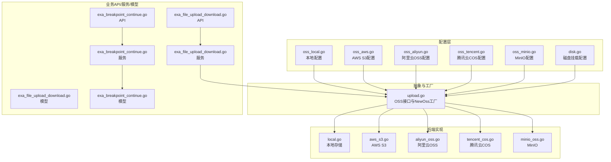

图表来源
- [upload.go:1-47](file://server/utils/upload/upload.go#L1-L47)
- [local.go:1-110](file://server/utils/upload/local.go#L1-L110)
- [aws_s3.go:1-115](file://server/utils/upload/aws_s3.go#L1-L115)
- [aliyun_oss.go:1-76](file://server/utils/upload/aliyun_oss.go#L1-L76)
- [tencent_cos.go:1-62](file://server/utils/upload/tencent_cos.go#L1-L62)
- [minio_oss.go:1-107](file://server/utils/upload/minio_oss.go#L1-L107)
- [oss_local.go:1-7](file://server/config/oss_local.go#L1-L7)
- [oss_aws.go:1-14](file://server/config/oss_aws.go#L1-L14)
- [oss_aliyun.go:1-11](file://server/config/oss_aliyun.go#L1-L11)
- [oss_tencent.go:1-11](file://server/config/oss_tencent.go#L1-L11)
- [oss_minio.go:1-12](file://server/config/oss_minio.go#L1-L12)
- [exa_file_upload_download.go:1-136](file://server/api/v1/example/exa_file_upload_download.go#L1-L136)
- [exa_file_upload_download.go:1-131](file://server/service/example/exa_file_upload_download.go#L1-L131)
- [exa_breakpoint_continue.go:1-157](file://server/api/v1/example/exa_breakpoint_continue.go#L1-L157)
- [exa_breakpoint_continue.go:1-72](file://server/service/example/exa_breakpoint_continue.go#L1-L72)
- [exa_file_upload_download.go:1-19](file://server/model/example/exa_file_upload_download.go#L1-L19)
- [exa_breakpoint_continue.go:1-25](file://server/model/example/exa_breakpoint_continue.go#L1-L25)
- [disk.go:1-10](file://server/config/disk.go#L1-L10)

章节来源
- [upload.go:1-47](file://server/utils/upload/upload.go#L1-L47)
- [oss_local.go:1-7](file://server/config/oss_local.go#L1-L7)
- [oss_aws.go:1-14](file://server/config/oss_aws.go#L1-L14)
- [oss_aliyun.go:1-11](file://server/config/oss_aliyun.go#L1-L11)
- [oss_tencent.go:1-11](file://server/config/oss_tencent.go#L1-L11)
- [oss_minio.go:1-12](file://server/config/oss_minio.go#L1-L12)
- [exa_file_upload_download.go:1-136](file://server/api/v1/example/exa_file_upload_download.go#L1-L136)
- [exa_file_upload_download.go:1-131](file://server/service/example/exa_file_upload_download.go#L1-L131)
- [exa_breakpoint_continue.go:1-157](file://server/api/v1/example/exa_breakpoint_continue.go#L1-L157)
- [exa_breakpoint_continue.go:1-72](file://server/service/example/exa_breakpoint_continue.go#L1-L72)
- [exa_file_upload_download.go:1-19](file://server/model/example/exa_file_upload_download.go#L1-L19)
- [exa_breakpoint_continue.go:1-25](file://server/model/example/exa_breakpoint_continue.go#L1-L25)
- [disk.go:1-10](file://server/config/disk.go#L1-L10)

## 核心组件
- 存储抽象层
  - 接口定义：统一的上传与删除能力，屏蔽后端差异。
  - 工厂方法：根据系统配置选择具体后端实现。
- 多后端适配
  - 本地存储：文件写入本地路径，返回可访问路径与键值。
  - AWS S3：基于 SDK v2 的上传与删除，支持自定义 Endpoint 与 PathStyle。
  - 阿里云 OSS：基于官方 SDK 的上传与删除。
  - 腾讯云 COS：基于官方 SDK 的上传与删除。
  - MinIO：基于 minio-go SDK 的上传与删除，内置客户端复用与分片上传。
- 断点续传与分片
  - API/服务层负责切片接收、校验、落库与合并。
  - 模型层定义文件与切片实体及关联关系。
- 配置管理
  - 通过配置模型集中管理各后端的访问凭据、桶/存储空间、域名前缀、路径前缀等。
- 权限与访问控制
  - 通过后端自身的访问密钥与权限策略控制访问范围；结合业务侧鉴权中间件实现统一鉴权。
- 访问日志
  - 各后端操作均记录日志，便于审计与问题定位。

章节来源
- [upload.go:10-46](file://server/utils/upload/upload.go#L10-L46)
- [local.go:31-70](file://server/utils/upload/local.go#L31-L70)
- [aws_s3.go:29-54](file://server/utils/upload/aws_s3.go#L29-L54)
- [aliyun_oss.go:15-41](file://server/utils/upload/aliyun_oss.go#L15-L41)
- [tencent_cos.go:21-36](file://server/utils/upload/tencent_cos.go#L21-L36)
- [minio_oss.go:55-96](file://server/utils/upload/minio_oss.go#L55-L96)
- [exa_breakpoint_continue.go:29-78](file://server/api/v1/example/exa_breakpoint_continue.go#L29-L78)
- [exa_breakpoint_continue.go:111-121](file://server/api/v1/example/exa_breakpoint_continue.go#L111-L121)
- [exa_breakpoint_continue.go:21-35](file://server/service/example/exa_breakpoint_continue.go#L21-L35)
- [exa_breakpoint_continue.go:43-50](file://server/service/example/exa_breakpoint_continue.go#L43-L50)
- [exa_file_upload_download.go:96-120](file://server/service/example/exa_file_upload_download.go#L96-L120)

## 架构总览
系统采用“配置驱动 + 接口抽象 + 工厂选择 + 服务编排”的架构，API 层只依赖抽象接口，不感知具体后端；服务层负责业务编排与数据持久化；后端实现封装第三方 SDK 或本地文件系统。

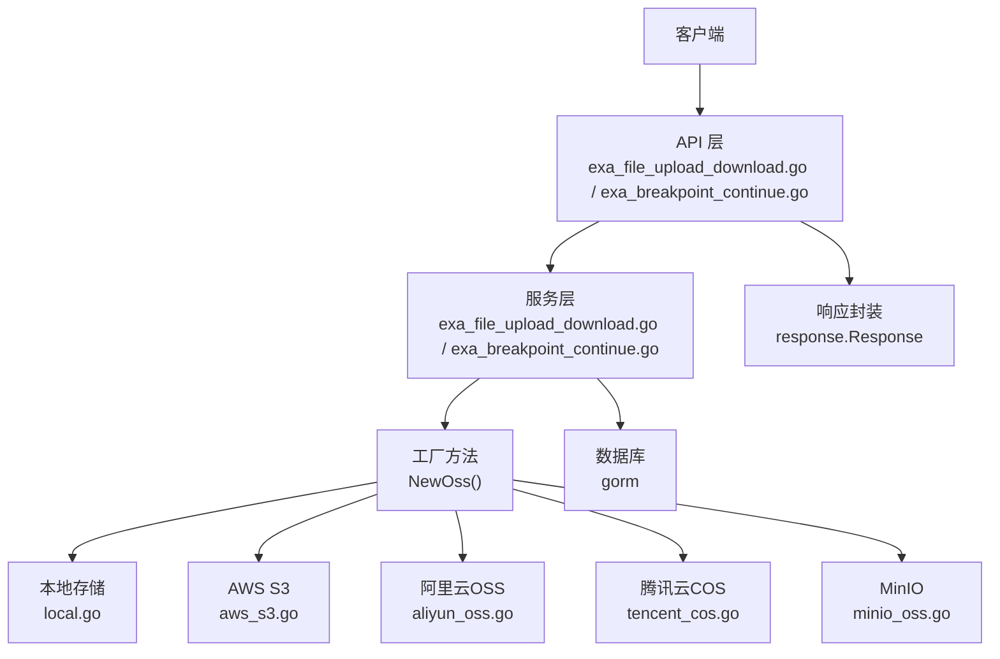

图表来源
- [upload.go:20-46](file://server/utils/upload/upload.go#L20-L46)
- [exa_file_upload_download.go:1-136](file://server/api/v1/example/exa_file_upload_download.go#L1-L136)
- [exa_breakpoint_continue.go:1-157](file://server/api/v1/example/exa_breakpoint_continue.go#L1-L157)
- [exa_file_upload_download.go:1-131](file://server/service/example/exa_file_upload_download.go#L1-L131)
- [exa_breakpoint_continue.go:1-72](file://server/service/example/exa_breakpoint_continue.go#L1-L72)

## 详细组件分析

### 存储抽象与工厂
- 接口定义
  - UploadFile：上传文件，返回访问路径与键值。
  - DeleteFile：按键删除文件。
- 工厂方法
  - 根据系统配置选择后端实现，若未配置或初始化失败，回退至本地存储或抛出错误。

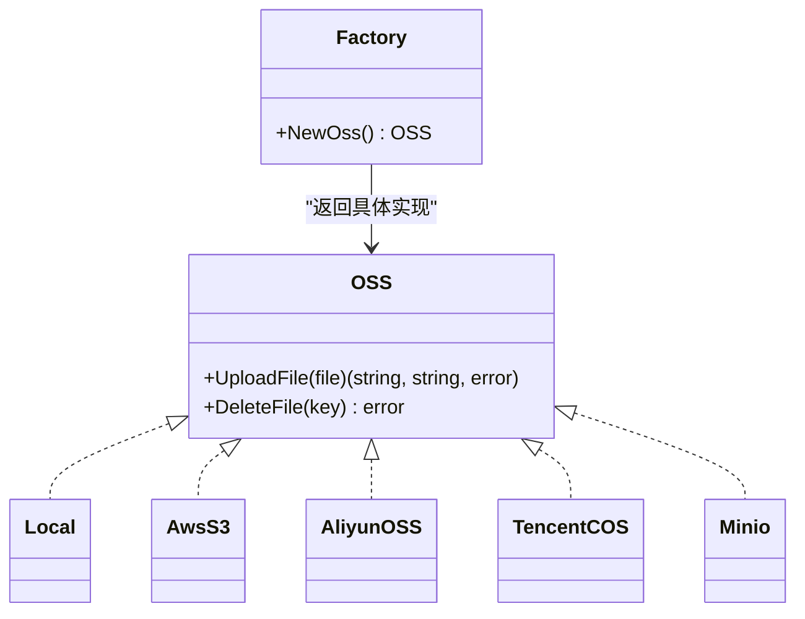

图表来源
- [upload.go:12-15](file://server/utils/upload/upload.go#L12-L15)
- [upload.go:20-46](file://server/utils/upload/upload.go#L20-L46)
- [local.go:20](file://server/utils/upload/local.go#L20)
- [aws_s3.go:20](file://server/utils/upload/aws_s3.go#L20)
- [aliyun_oss.go:13](file://server/utils/upload/aliyun_oss.go#L13)
- [tencent_cos.go:18](file://server/utils/upload/tencent_cos.go#L18)
- [minio_oss.go:23](file://server/utils/upload/minio_oss.go#L23)

章节来源
- [upload.go:12-46](file://server/utils/upload/upload.go#L12-L46)

### 本地存储
- 特性
  - 上传：按文件名 MD5+时间戳生成唯一文件名，写入本地存储路径，返回访问路径与键值。
  - 删除：路径拼接 + 并发锁 + 安全校验（防路径穿越），确保安全删除。
- 安全与健壮性
  - 错误日志记录与返回。
  - 创建目录失败、文件打开/创建失败、拷贝失败均有明确错误处理。

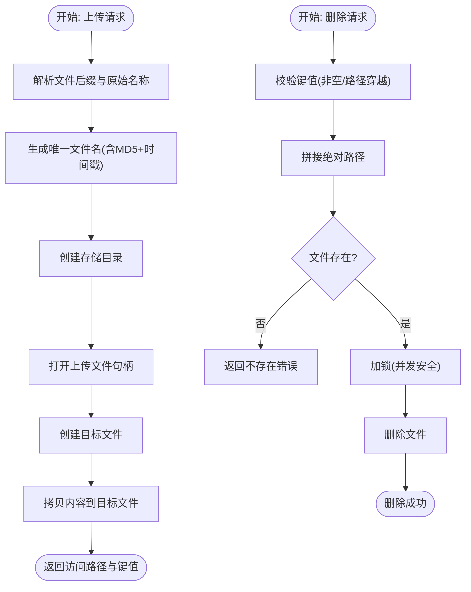

图表来源
- [local.go:31-70](file://server/utils/upload/local.go#L31-L70)
- [local.go:81-109](file://server/utils/upload/local.go#L81-L109)

章节来源
- [local.go:31-109](file://server/utils/upload/local.go#L31-L109)

### AWS S3
- 特性
  - 上传：使用 v2 SDK 的上传器，支持自定义 Endpoint（兼容 MinIO）、Region、凭据、路径前缀与 Content-Type。
  - 删除：删除对象并等待对象不存在。
- 配置
  - 包含桶、区域、凭据、基础 URL、路径前缀、强制 PathStyle、禁用 SSL 等。

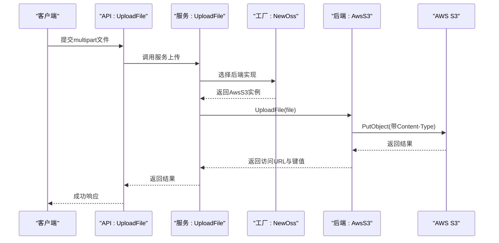

图表来源
- [exa_file_upload_download.go:96-120](file://server/service/example/exa_file_upload_download.go#L96-L120)
- [aws_s3.go:29-54](file://server/utils/upload/aws_s3.go#L29-L54)
- [aws_s3.go:88-114](file://server/utils/upload/aws_s3.go#L88-L114)

章节来源
- [aws_s3.go:29-84](file://server/utils/upload/aws_s3.go#L29-L84)
- [oss_aws.go:3-14](file://server/config/oss_aws.go#L3-L14)

### 阿里云 OSS
- 特性
  - 上传：构造目标路径（BasePath + 日期 + 文件名），上传到指定 Bucket。
  - 删除：删除指定对象。
- 配置
  - Endpoint、AccessKeyId、AccessKeySecret、BucketName、BucketUrl、BasePath。

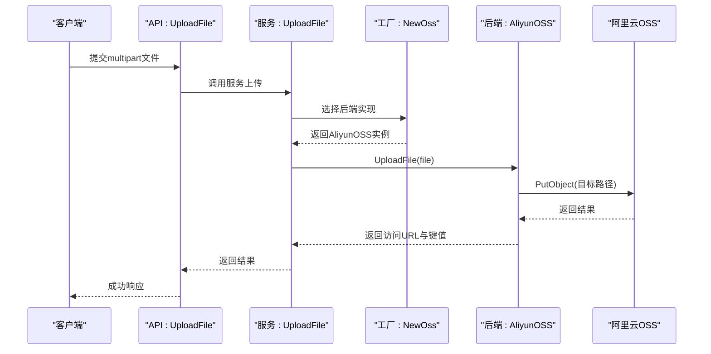

图表来源
- [exa_file_upload_download.go:96-120](file://server/service/example/exa_file_upload_download.go#L96-L120)
- [aliyun_oss.go:15-41](file://server/utils/upload/aliyun_oss.go#L15-L41)
- [oss_aliyun.go:3-11](file://server/config/oss_aliyun.go#L3-L11)

章节来源
- [aliyun_oss.go:15-59](file://server/utils/upload/aliyun_oss.go#L15-L59)
- [oss_aliyun.go:3-11](file://server/config/oss_aliyun.go#L3-L11)

### 腾讯云 COS
- 特性
  - 上传：构造目标路径（PathPrefix + 时间戳 + 文件名），上传到指定 Bucket。
  - 删除：删除指定对象。
- 配置
  - Bucket、Region、SecretID、SecretKey、BaseURL、PathPrefix。

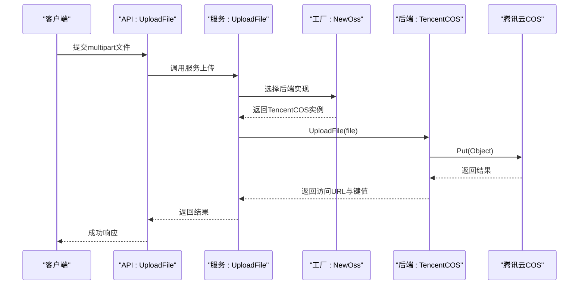

图表来源
- [exa_file_upload_download.go:96-120](file://server/service/example/exa_file_upload_download.go#L96-L120)
- [tencent_cos.go:21-36](file://server/utils/upload/tencent_cos.go#L21-L36)
- [oss_tencent.go:3-11](file://server/config/oss_tencent.go#L3-L11)

章节来源
- [tencent_cos.go:21-48](file://server/utils/upload/tencent_cos.go#L21-L48)
- [oss_tencent.go:3-11](file://server/config/oss_tencent.go#L3-L11)

### MinIO
- 特性
  - 上传：将 multipart 文件读取为字节缓冲，自动分片上传，设置 MIME 类型与超时；返回访问 URL 与键值。
  - 删除：删除指定对象。
  - 客户端复用：全局单例，避免重复初始化。
- 配置
  - Endpoint、AccessKeyId、AccessKeySecret、BucketName、UseSSL、BasePath、BucketUrl。

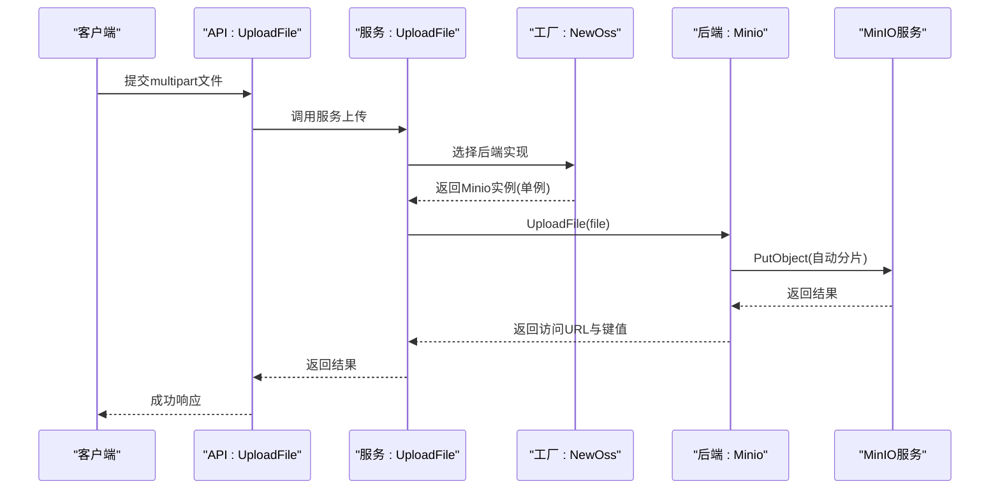

图表来源
- [exa_file_upload_download.go:96-120](file://server/service/example/exa_file_upload_download.go#L96-L120)
- [minio_oss.go:55-96](file://server/utils/upload/minio_oss.go#L55-L96)
- [oss_minio.go:3-12](file://server/config/oss_minio.go#L3-L12)

章节来源
- [minio_oss.go:28-53](file://server/utils/upload/minio_oss.go#L28-L53)
- [minio_oss.go:55-106](file://server/utils/upload/minio_oss.go#L55-L106)
- [oss_minio.go:3-12](file://server/config/oss_minio.go#L3-L12)

### 断点续传与分片上传
- 流程
  - 接收：前端上传每个切片，携带文件 MD5、文件名、切片 MD5、切片序号与总切片数。
  - 校验：服务端计算切片内容 MD5 与传入对比，确保完整性。
  - 归档：查找或创建文件记录，保存切片记录。
  - 合并：当所有切片完成后，触发合并逻辑生成最终文件。
  - 清理：可删除临时切片缓存与对应记录。
- 数据模型
  - 文件实体：包含文件名、MD5、路径、总切片数、是否完成等。
  - 切片实体：包含所属文件 ID、切片序号、切片路径。

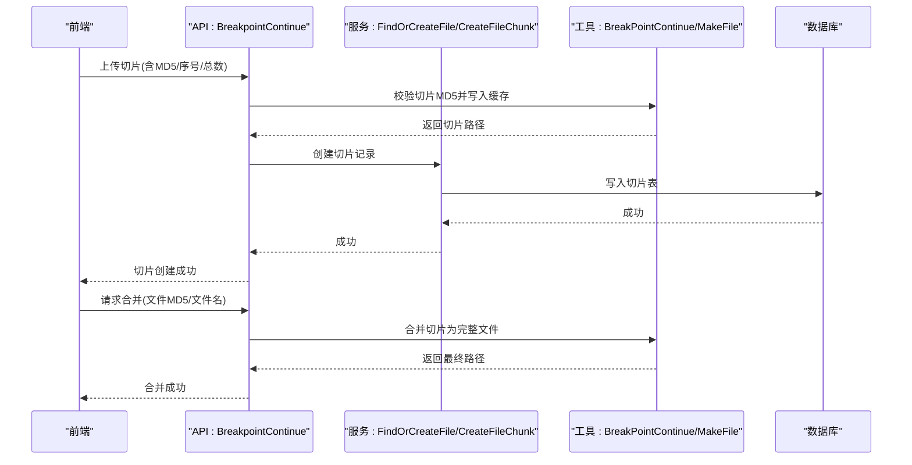

图表来源
- [exa_breakpoint_continue.go:29-78](file://server/api/v1/example/exa_breakpoint_continue.go#L29-L78)
- [exa_breakpoint_continue.go:111-121](file://server/api/v1/example/exa_breakpoint_continue.go#L111-L121)
- [exa_breakpoint_continue.go:21-35](file://server/service/example/exa_breakpoint_continue.go#L21-L35)
- [exa_breakpoint_continue.go:43-50](file://server/service/example/exa_breakpoint_continue.go#L43-L50)
- [exa_breakpoint_continue.go:18-25](file://server/model/example/exa_breakpoint_continue.go#L18-L25)

章节来源
- [exa_breakpoint_continue.go:29-157](file://server/api/v1/example/exa_breakpoint_continue.go#L29-L157)
- [exa_breakpoint_continue.go:21-72](file://server/service/example/exa_breakpoint_continue.go#L21-L72)
- [exa_breakpoint_continue.go:8-25](file://server/model/example/exa_breakpoint_continue.go#L8-L25)

### 文件上传处理流程（普通上传）
- 流程
  - API 接收 multipart 文件。
  - 服务层调用工厂选择后端实现，执行上传。
  - 上传成功后，根据 noSave 参数决定是否入库记录。
- 元数据管理
  - 名称、标签（扩展名）、访问 URL、键值等字段入库。

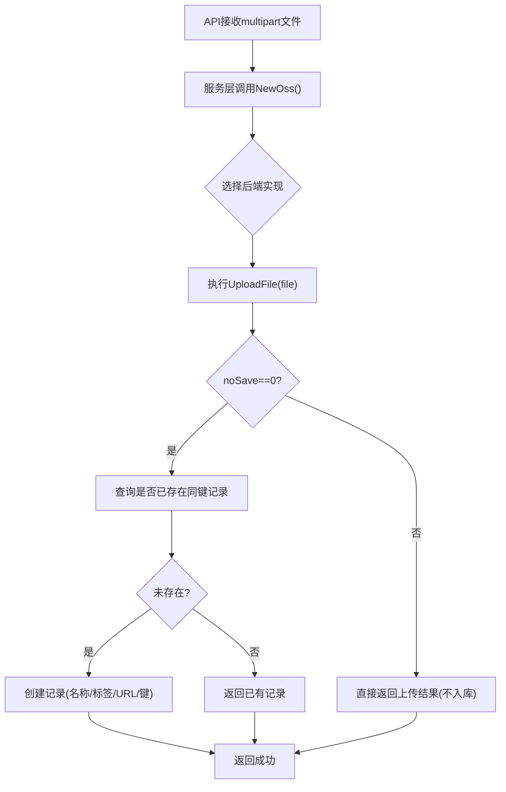

图表来源
- [exa_file_upload_download.go:25-42](file://server/api/v1/example/exa_file_upload_download.go#L25-L42)
- [exa_file_upload_download.go:96-120](file://server/service/example/exa_file_upload_download.go#L96-L120)
- [exa_file_upload_download.go:102-119](file://server/service/example/exa_file_upload_download.go#L102-L119)

章节来源
- [exa_file_upload_download.go:25-42](file://server/api/v1/example/exa_file_upload_download.go#L25-L42)
- [exa_file_upload_download.go:96-120](file://server/service/example/exa_file_upload_download.go#L96-L120)

### 存储配置管理
- 配置模型
  - 本地：访问路径、存储路径。
  - AWS S3：桶、区域、Endpoint、凭据、基础 URL、路径前缀、强制 PathStyle、禁用 SSL。
  - 阿里云 OSS：Endpoint、凭据、桶名、桶 URL、基础路径。
  - 腾讯云 COS：桶、区域、凭据、基础 URL、路径前缀。
  - MinIO：Endpoint、凭据、桶名、是否使用 SSL、基础路径、桶 URL。
  - 磁盘挂载：挂载点。
- 使用方式
  - 工厂方法从全局配置中读取 OssType 与各后端配置，动态选择实现。

章节来源
- [oss_local.go:3-7](file://server/config/oss_local.go#L3-L7)
- [oss_aws.go:3-14](file://server/config/oss_aws.go#L3-L14)
- [oss_aliyun.go:3-11](file://server/config/oss_aliyun.go#L3-L11)
- [oss_tencent.go:3-11](file://server/config/oss_tencent.go#L3-L11)
- [oss_minio.go:3-12](file://server/config/oss_minio.go#L3-L12)
- [disk.go:3-10](file://server/config/disk.go#L3-L10)
- [upload.go:20-46](file://server/utils/upload/upload.go#L20-L46)

### 文件访问权限控制与签名 URL
- 私有文件保护
  - 通过后端的访问密钥与权限策略限制访问范围。
- 签名 URL
  - 可在服务层生成带有效期的签名 URL，用于临时授权访问。
- 访问日志
  - 各后端上传/删除操作均记录日志，便于审计。

章节来源
- [aws_s3.go:42-53](file://server/utils/upload/aws_s3.go#L42-L53)
- [aliyun_oss.go:34-40](file://server/utils/upload/aliyun_oss.go#L34-L40)
- [tencent_cos.go:31-35](file://server/utils/upload/tencent_cos.go#L31-L35)
- [minio_oss.go:90-96](file://server/utils/upload/minio_oss.go#L90-L96)

## 依赖分析
- 组件耦合
  - API 仅依赖服务接口，服务依赖抽象接口，抽象接口依赖工厂方法，工厂方法依赖具体后端实现，形成清晰的依赖方向。
- 外部依赖
  - 各后端 SDK（AWS S3、阿里云 OSS、腾讯云 COS、MinIO）。
  - 数据库 ORM（GORM）。
  - 日志框架（zap）。
- 循环依赖
  - 未发现循环依赖，模块职责清晰。

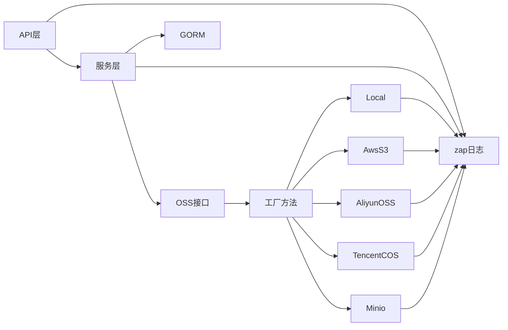

图表来源
- [upload.go:20-46](file://server/utils/upload/upload.go#L20-L46)
- [exa_file_upload_download.go:96-120](file://server/service/example/exa_file_upload_download.go#L96-L120)

章节来源
- [upload.go:20-46](file://server/utils/upload/upload.go#L20-L46)
- [exa_file_upload_download.go:96-120](file://server/service/example/exa_file_upload_download.go#L96-L120)

## 性能考量
- 缓存机制
  - MinIO 后端使用全局单例客户端，减少连接与初始化开销。
- 压缩传输
  - 可在网关或 CDN 层启用压缩（如 gzip/br），降低带宽占用。
- 负载均衡
  - 云厂商提供多地域/多可用区访问，结合 CDN 提升就近访问性能。
- 并发与超时
  - MinIO 上传设置较长超时，适合大文件；其他后端可根据场景调整超时策略。
- 存储成本优化
  - 使用分层存储（低频/归档）与生命周期策略；开启版本控制与跨域复制以提升可靠性。
- 备份策略
  - 定期导出元数据与快照；对关键数据开启跨区域复制或多活架构。

章节来源
- [minio_oss.go:21](file://server/utils/upload/minio_oss.go#L21)
- [minio_oss.go:86-89](file://server/utils/upload/minio_oss.go#L86-L89)

## 故障排查指南
- 上传失败
  - 检查后端凭据、桶/存储空间是否存在、网络连通性。
  - 查看日志中 file.Open()/os.Create()/PutObject 等错误信息。
- 删除失败
  - 确认键值非空且未发生路径穿越；查看文件是否存在。
- 断点续传异常
  - 校验切片 MD5 是否一致；确认切片记录是否正确入库；检查合并阶段的路径与权限。
- MinIO 初始化失败
  - 检查 Endpoint、SSL 配置与桶创建权限；初始化失败会直接 panic，需修复配置。

章节来源
- [local.go:49-68](file://server/utils/upload/local.go#L49-L68)
- [aws_s3.go:35-51](file://server/utils/upload/aws_s3.go#L35-L51)
- [aliyun_oss.go:23-38](file://server/utils/upload/aliyun_oss.go#L23-L38)
- [tencent_cos.go:23-34](file://server/utils/upload/tencent_cos.go#L23-L34)
- [minio_oss.go:32-52](file://server/utils/upload/minio_oss.go#L32-L52)
- [exa_breakpoint_continue.go:54-58](file://server/api/v1/example/exa_breakpoint_continue.go#L54-L58)
- [exa_breakpoint_continue.go:139-143](file://server/api/v1/example/exa_breakpoint_continue.go#L139-L143)

## 结论
本文件存储系统通过统一的抽象接口与工厂方法，实现了对本地与多家云存储后端的无缝接入；配合断点续传、分片上传、文件校验与元数据管理，满足复杂场景下的文件处理需求；通过配置中心集中管理后端参数，便于在不同环境灵活切换。建议在生产环境中结合 CDN、压缩传输与分层存储策略进一步优化性能与成本，并完善签名 URL 与访问日志体系以强化安全与可观测性。

## 附录
- 配置项参考
  - 本地：path、store-path
  - AWS S3：bucket、region、endpoint、secret-id、secret-key、base-url、path-prefix、s3-force-path-style、disable-ssl
  - 阿里云 OSS：endpoint、access-key-id、access-key-secret、bucket-name、bucket-url、base-path
  - 腾讯云 COS：bucket、region、secret-id、secret-key、base-url、path-prefix
  - MinIO：endpoint、access-key-id、access-key-secret、bucket-name、use-ssl、base-path、bucket-url
  - 磁盘挂载：mount-point

章节来源
- [oss_local.go:3-7](file://server/config/oss_local.go#L3-L7)
- [oss_aws.go:3-14](file://server/config/oss_aws.go#L3-L14)
- [oss_aliyun.go:3-11](file://server/config/oss_aliyun.go#L3-L11)
- [oss_tencent.go:3-11](file://server/config/oss_tencent.go#L3-L11)
- [oss_minio.go:3-12](file://server/config/oss_minio.go#L3-L12)
- [disk.go:3-10](file://server/config/disk.go#L3-L10)