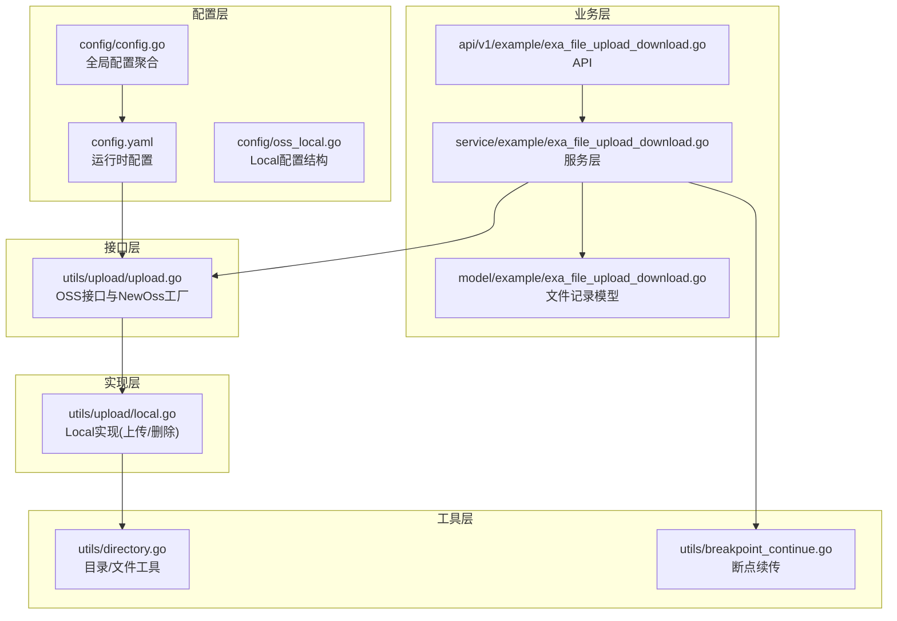
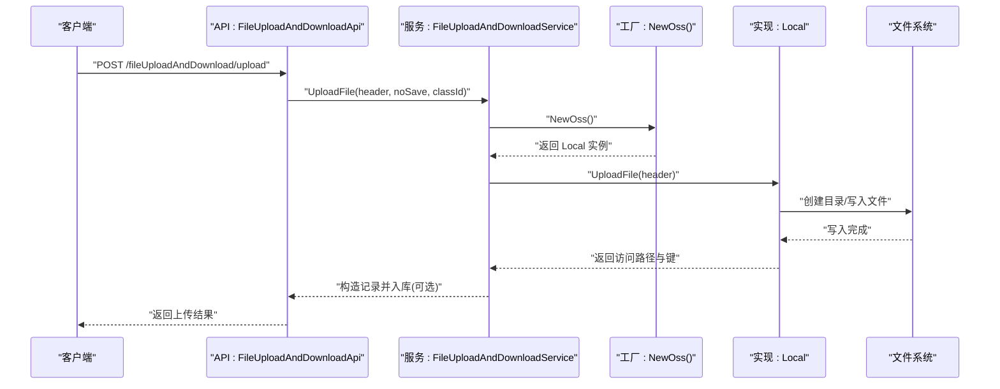
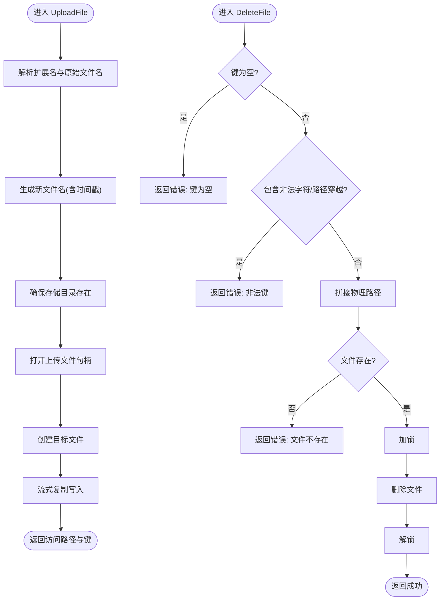
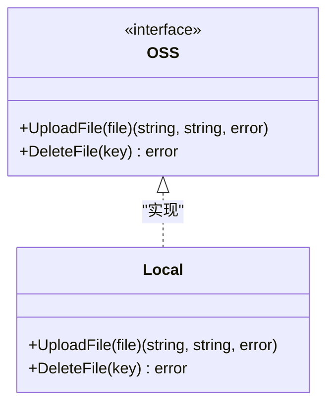
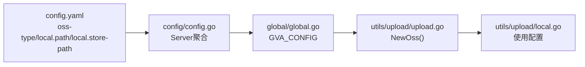
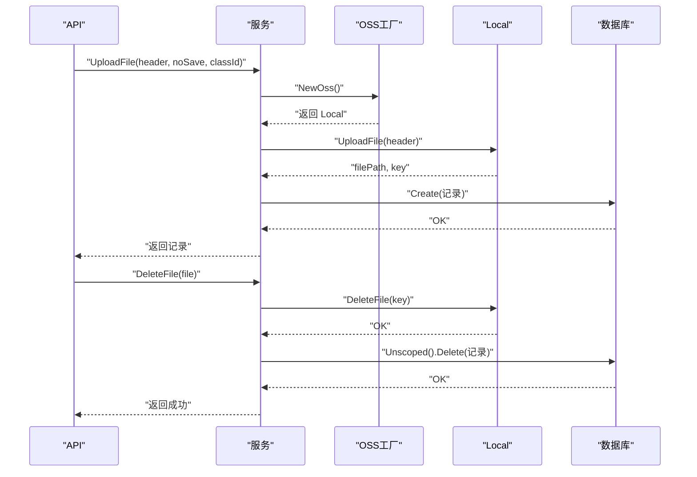
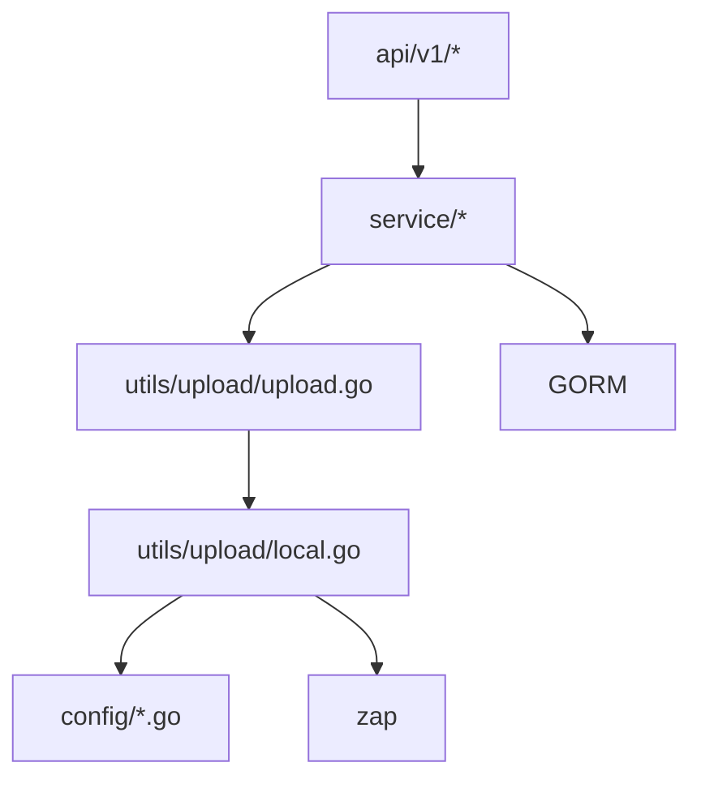

# 本地存储实现

<cite>
**本文引用的文件**
- [server/utils/upload/local.go](file://server/utils/upload/local.go)
- [server/utils/upload/upload.go](file://server/utils/upload/upload.go)
- [server/config/oss_local.go](file://server/config/oss_local.go)
- [server/config/config.go](file://server/config/config.go)
- [server/config.yaml](file://server/config.yaml)
- [server/service/example/exa_file_upload_download.go](file://server/service/example/exa_file_upload_download.go)
- [server/api/v1/example/exa_file_upload_download.go](file://server/api/v1/example/exa_file_upload_download.go)
- [server/utils/directory.go](file://server/utils/directory.go)
- [server/utils/breakpoint_continue.go](file://server/utils/breakpoint_continue.go)
- [server/global/global.go](file://server/global/global.go)
- [server/model/example/exa_file_upload_download.go](file://server/model/example/exa_file_upload_download.go)
</cite>

## 目录
1. [简介](#简介)
2. [项目结构](#项目结构)
3. [核心组件](#核心组件)
4. [架构总览](#架构总览)
5. [详细组件分析](#详细组件分析)
6. [依赖分析](#依赖分析)
7. [性能考量](#性能考量)
8. [故障处理](#故障处理)
9. [结论](#结论)
10. [附录](#附录)

## 简介
本文件面向“本地存储实现”的技术文档，聚焦于基于本地文件系统的对象存储子系统。内容涵盖文件路径管理与目录结构设计、文件命名策略、文件操作实现（上传、目录创建、删除）、安全机制（访问控制、路径遍历防护、恶意文件检测、存储空间限制）、性能优化策略（缓存、异步写入、磁盘监控与清理）、配置管理（根目录、大小限制、类型限制、配额管理），以及故障处理与运维建议。

## 项目结构
本地存储实现围绕“接口抽象 + 具体实现 + 配置驱动 + 业务编排”展开，关键模块如下：
- 接口层：统一的 OSS 接口定义，屏蔽不同后端差异
- 实现层：本地存储 Local 结构体的具体实现
- 配置层：系统配置与本地存储参数，运行时按配置选择实现
- 业务层：文件上传下载 API 与服务层编排，负责记录与删除
- 工具层：目录工具、断点续传工具、通用文件操作

**图表来源**
- [server/config/config.go:3-40](file://server/config/config.go#L3-L40)
- [server/config.yaml:73-180](file://server/config.yaml#L73-L180)
- [server/config/oss_local.go:3-6](file://server/config/oss_local.go#L3-L6)
- [server/utils/upload/upload.go:12-46](file://server/utils/upload/upload.go#L12-L46)
- [server/utils/upload/local.go:20-109](file://server/utils/upload/local.go#L20-L109)
- [server/api/v1/example/exa_file_upload_download.go:14-136](file://server/api/v1/example/exa_file_upload_download.go#L14-L136)
- [server/service/example/exa_file_upload_download.go:1-131](file://server/service/example/exa_file_upload_download.go#L1-L131)
- [server/model/example/exa_file_upload_download.go:7-18](file://server/model/example/exa_file_upload_download.go#L7-L18)
- [server/utils/directory.go:1-125](file://server/utils/directory.go#L1-L125)
- [server/utils/breakpoint_continue.go:1-122](file://server/utils/breakpoint_continue.go#L1-L122)

**章节来源**
- [server/config/config.go:3-40](file://server/config/config.go#L3-L40)
- [server/config.yaml:73-180](file://server/config.yaml#L73-L180)
- [server/utils/upload/upload.go:12-46](file://server/utils/upload/upload.go#L12-L46)
- [server/utils/upload/local.go:20-109](file://server/utils/upload/local.go#L20-L109)
- [server/api/v1/example/exa_file_upload_download.go:14-136](file://server/api/v1/example/exa_file_upload_download.go#L14-L136)
- [server/service/example/exa_file_upload_download.go:1-131](file://server/service/example/exa_file_upload_download.go#L1-L131)
- [server/model/example/exa_file_upload_download.go:7-18](file://server/model/example/exa_file_upload_download.go#L7-L18)
- [server/utils/directory.go:1-125](file://server/utils/directory.go#L1-L125)
- [server/utils/breakpoint_continue.go:1-122](file://server/utils/breakpoint_continue.go#L1-L122)

## 核心组件
- OSS 接口与工厂
  - 定义统一的上传与删除接口，通过工厂方法根据系统配置动态选择具体实现
  - 当 oss-type 为 local 时，返回 Local 实例
- Local 实现
  - 上传：解析扩展名、生成新文件名、确保存储目录存在、写入文件、返回访问路径与键
  - 删除：校验键合法性、定位物理路径、加锁删除、返回结果
- 配置模型
  - Local 结构体包含访问路径与存储路径两个字段
  - 全局配置聚合包含 Local 字段，运行时由 viper 加载
- 业务编排
  - API 层接收文件，服务层调用 OSS 工厂进行上传，记录文件元数据
  - 删除时先调用 OSS 删除物理文件，再删除数据库记录

**章节来源**
- [server/utils/upload/upload.go:12-46](file://server/utils/upload/upload.go#L12-L46)
- [server/utils/upload/local.go:31-70](file://server/utils/upload/local.go#L31-L70)
- [server/utils/upload/local.go:81-109](file://server/utils/upload/local.go#L81-L109)
- [server/config/oss_local.go:3-6](file://server/config/oss_local.go#L3-L6)
- [server/config/config.go:22-22](file://server/config/config.go#L22-L22)
- [server/api/v1/example/exa_file_upload_download.go:25-42](file://server/api/v1/example/exa_file_upload_download.go#L25-L42)
- [server/service/example/exa_file_upload_download.go:96-120](file://server/service/example/exa_file_upload_download.go#L96-L120)

## 架构总览
本地存储的调用链路如下：API 接收文件 → 服务层调用 OSS 工厂 → 选择 Local 实现 → 执行上传/删除 → 记录文件元数据。

**图表来源**
- [server/api/v1/example/exa_file_upload_download.go:25-42](file://server/api/v1/example/exa_file_upload_download.go#L25-L42)
- [server/service/example/exa_file_upload_download.go:96-120](file://server/service/example/exa_file_upload_download.go#L96-L120)
- [server/utils/upload/upload.go:20-24](file://server/utils/upload/upload.go#L20-L24)
- [server/utils/upload/local.go:31-70](file://server/utils/upload/local.go#L31-L70)

## 详细组件分析

### 本地存储实现（Local）
- 文件上传
  - 解析扩展名与原始文件名，对原始文件名做摘要，拼接时间戳，形成新文件名
  - 确保存储根目录存在，创建失败记录日志并返回错误
  - 打开上传文件句柄与目标文件句柄，使用流式复制写入
  - 返回访问路径与键（键即文件名）
- 文件删除
  - 键为空或包含非法字符（如路径穿越片段或 Windows 非法字符）直接报错
  - 使用 Join 拼接物理路径，检查文件是否存在
  - 并发删除使用互斥锁保护
  - 删除失败返回错误，成功返回 nil

**图表来源**
- [server/utils/upload/local.go:31-70](file://server/utils/upload/local.go#L31-L70)
- [server/utils/upload/local.go:81-109](file://server/utils/upload/local.go#L81-L109)

**章节来源**
- [server/utils/upload/local.go:31-70](file://server/utils/upload/local.go#L31-L70)
- [server/utils/upload/local.go:81-109](file://server/utils/upload/local.go#L81-L109)

### OSS 接口与工厂（NewOss）
- 接口定义：统一的上传与删除方法签名
- 工厂选择：依据系统配置的 oss-type 返回对应实现，默认 local
- 本地实现：当 oss-type 为 local 时返回 Local 实例

**图表来源**
- [server/utils/upload/upload.go:12-15](file://server/utils/upload/upload.go#L12-L15)
- [server/utils/upload/upload.go:20-24](file://server/utils/upload/upload.go#L20-L24)
- [server/utils/upload/local.go:20-20](file://server/utils/upload/local.go#L20-L20)

**章节来源**
- [server/utils/upload/upload.go:12-46](file://server/utils/upload/upload.go#L12-L46)
- [server/utils/upload/local.go:20-20](file://server/utils/upload/local.go#L20-L20)

### 配置管理（系统与本地存储）
- 全局配置聚合包含 Local 字段，运行时由 viper 加载
- config.yaml 中提供 oss-type 与 local.path、local.store-path 的默认值
- 业务层通过全局配置读取本地存储根目录与访问路径

**图表来源**
- [server/config.yaml:73-180](file://server/config.yaml#L73-L180)
- [server/config/config.go:3-40](file://server/config/config.go#L3-L40)
- [server/global/global.go:31-31](file://server/global/global.go#L31-L31)
- [server/utils/upload/upload.go:20-24](file://server/utils/upload/upload.go#L20-L24)
- [server/utils/upload/local.go:40-47](file://server/utils/upload/local.go#L40-L47)

**章节来源**
- [server/config.yaml:73-180](file://server/config.yaml#L73-L180)
- [server/config/config.go:3-40](file://server/config/config.go#L3-L40)
- [server/global/global.go:31-31](file://server/global/global.go#L31-L31)
- [server/utils/upload/local.go:40-47](file://server/utils/upload/local.go#L40-L47)

### 业务编排（API/Service/Model）
- API 层接收 multipart 文件，调用服务层上传
- 服务层调用 OSS 工厂，根据配置选择本地实现
- 上传成功后构造记录（名称、URL、标签、键等），可选择入库
- 删除时先调用 OSS 删除物理文件，再删除数据库记录

**图表来源**
- [server/api/v1/example/exa_file_upload_download.go:25-42](file://server/api/v1/example/exa_file_upload_download.go#L25-L42)
- [server/service/example/exa_file_upload_download.go:96-120](file://server/service/example/exa_file_upload_download.go#L96-L120)
- [server/service/example/exa_file_upload_download.go:43-54](file://server/service/example/exa_file_upload_download.go#L43-L54)
- [server/model/example/exa_file_upload_download.go:7-18](file://server/model/example/exa_file_upload_download.go#L7-L18)

**章节来源**
- [server/api/v1/example/exa_file_upload_download.go:25-42](file://server/api/v1/example/exa_file_upload_download.go#L25-L42)
- [server/service/example/exa_file_upload_download.go:96-120](file://server/service/example/exa_file_upload_download.go#L96-L120)
- [server/service/example/exa_file_upload_download.go:43-54](file://server/service/example/exa_file_upload_download.go#L43-L54)
- [server/model/example/exa_file_upload_download.go:7-18](file://server/model/example/exa_file_upload_download.go#L7-L18)

### 目录与文件工具
- 目录工具：提供路径存在性检查、批量创建目录、文件移动、递归删除、去除结构体空格、判断文件存在
- 断点续传：提供分片写入、MD5 校验、合并文件、清理分片等能力

**章节来源**
- [server/utils/directory.go:20-55](file://server/utils/directory.go#L20-L55)
- [server/utils/directory.go:63-94](file://server/utils/directory.go#L63-L94)
- [server/utils/breakpoint_continue.go:26-107](file://server/utils/breakpoint_continue.go#L26-L107)

## 依赖分析
- 组件耦合
  - 服务层依赖 OSS 接口，通过工厂解耦具体实现
  - Local 依赖全局配置与日志库
  - API 层仅负责参数绑定与响应封装
- 外部依赖
  - viper 用于加载配置
  - zap 用于日志
  - GORM 用于数据库操作
- 潜在循环依赖
  - 未发现直接循环依赖；接口与实现分离良好

**图表来源**
- [server/api/v1/example/exa_file_upload_download.go:25-42](file://server/api/v1/example/exa_file_upload_download.go#L25-L42)
- [server/service/example/exa_file_upload_download.go:96-120](file://server/service/example/exa_file_upload_download.go#L96-L120)
- [server/utils/upload/upload.go:20-24](file://server/utils/upload/upload.go#L20-L24)
- [server/utils/upload/local.go:40-47](file://server/utils/upload/local.go#L40-L47)
- [server/config/config.go:3-40](file://server/config/config.go#L3-L40)

**章节来源**
- [server/api/v1/example/exa_file_upload_download.go:25-42](file://server/api/v1/example/exa_file_upload_download.go#L25-L42)
- [server/service/example/exa_file_upload_download.go:96-120](file://server/service/example/exa_file_upload_download.go#L96-L120)
- [server/utils/upload/upload.go:20-24](file://server/utils/upload/upload.go#L20-L24)
- [server/utils/upload/local.go:40-47](file://server/utils/upload/local.go#L40-L47)
- [server/config/config.go:3-40](file://server/config/config.go#L3-L40)

## 性能考量
- 文件缓存
  - 本地实现采用流式复制写入，避免一次性加载至内存
- 异步写入
  - 未见显式的异步写入实现；可通过业务层引入队列或后台任务扩展
- 磁盘空间监控
  - 未见内置的磁盘空间监控与告警；建议在系统层面或业务层增加阈值检查
- 清理策略
  - 未见自动清理策略；建议结合业务生命周期与配额限制制定清理规则
- 目录组织
  - 未见按日期/哈希分层目录；建议按哈希前缀拆分目录，降低单目录文件数

[本节为通用性能讨论，无需特定文件来源]

## 故障处理
- 磁盘空间不足
  - 上传阶段：写入失败时返回错误；建议在写入前检查剩余空间
- 文件系统错误
  - 目录创建失败、文件写入失败、删除失败均会返回错误；应记录日志并上抛
- 权限问题
  - 上传与删除均需要对存储根目录具备读写权限；建议启动时进行权限探测
- 路径遍历与非法键
  - 删除前对键进行严格校验，防止路径穿越与非法字符

**章节来源**
- [server/utils/upload/local.go:40-44](file://server/utils/upload/local.go#L40-L44)
- [server/utils/upload/local.go:56-61](file://server/utils/upload/local.go#L56-L61)
- [server/utils/upload/local.go:88-90](file://server/utils/upload/local.go#L88-L90)
- [server/utils/upload/local.go:95-97](file://server/utils/upload/local.go#L95-L97)

## 结论
本地存储通过清晰的接口抽象与配置驱动，实现了从文件接收、落盘、记录到删除的完整闭环。其采用流式写入与严格的键校验，兼顾了性能与安全。建议在生产环境中结合断点续传、磁盘监控与清理策略，进一步提升可靠性与可维护性。

[本节为总结，无需特定文件来源]

## 附录

### 配置项与默认值
- 系统 OSS 类型：通过系统配置选择对象存储类型，默认 local
- 本地存储路径：本地存储的挂载点与访问路径由配置决定
- 磁盘列表：支持多磁盘挂载点配置，便于扩展存储容量

**章节来源**
- [server/config.yaml:78-78](file://server/config.yaml#L78-L78)
- [server/config.yaml:177-179](file://server/config.yaml#L177-L179)
- [server/config/config.go:33-33](file://server/config/config.go#L33-L33)

### 最佳实践与运维建议
- 路径配置
  - 在配置文件中设置本地存储根目录与访问路径
  - 确保运行账户对该目录具备读写权限
- 安全考虑
  - 上传与删除均进行键合法性校验，防止路径穿越
  - 断点续传对文件名与 MD5 进行校验
- 性能优化
  - 小文件直传；大文件优先断点续传
  - 合理规划目录层级，避免单目录文件过多
  - 使用高性能存储介质
- 监控与清理
  - 建议增加磁盘空间监控与阈值告警
  - 制定定期清理策略，结合业务生命周期与配额限制

**章节来源**
- [server/utils/upload/local.go:88-90](file://server/utils/upload/local.go#L88-L90)
- [server/utils/breakpoint_continue.go:45-52](file://server/utils/breakpoint_continue.go#L45-L52)
- [server/utils/breakpoint_continue.go:84-107](file://server/utils/breakpoint_continue.go#L84-L107)