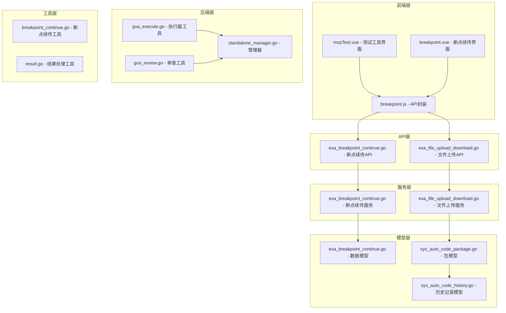
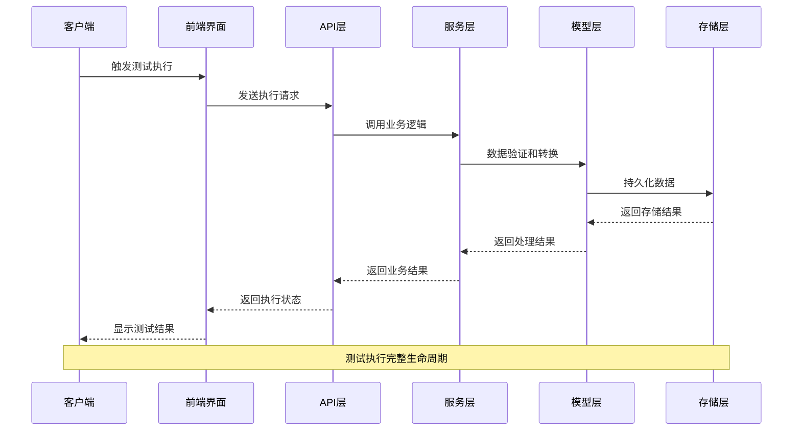
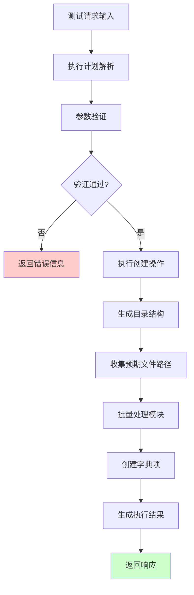
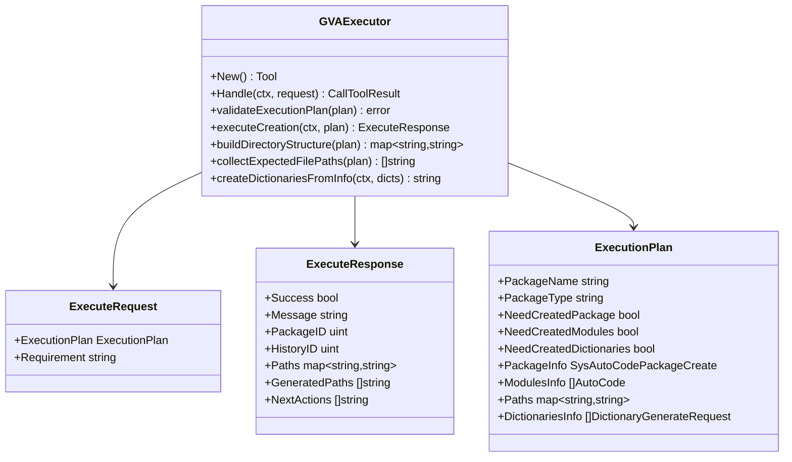
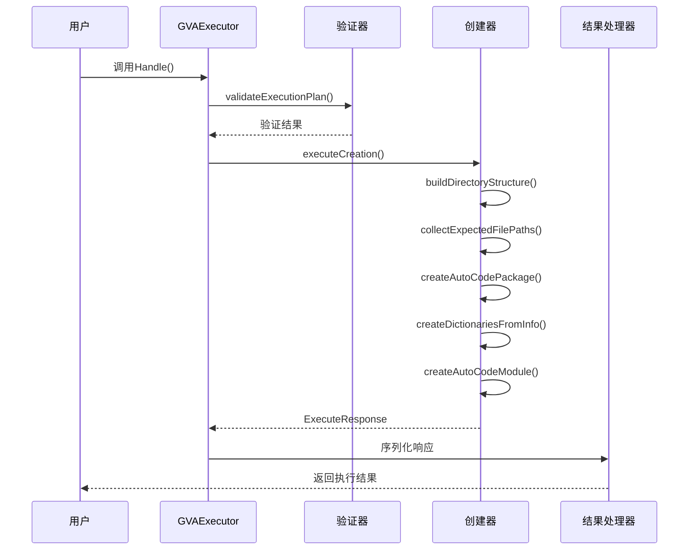
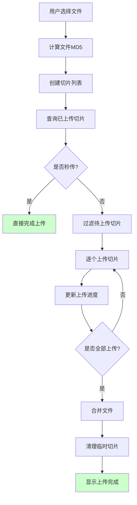
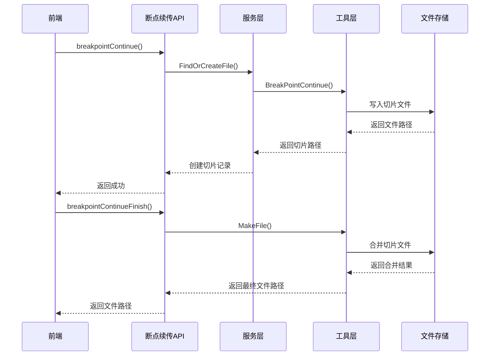
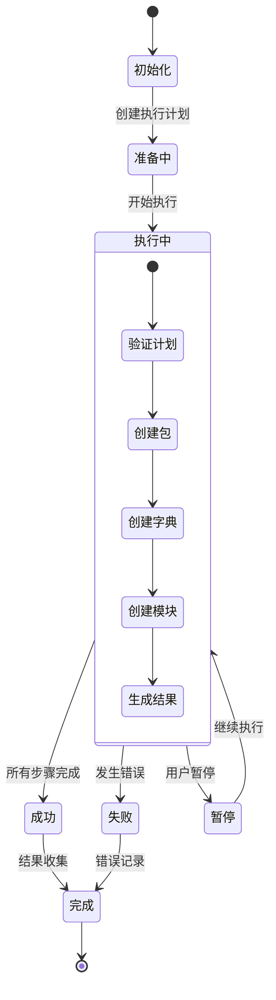
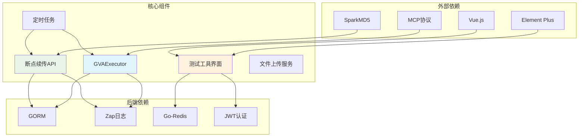
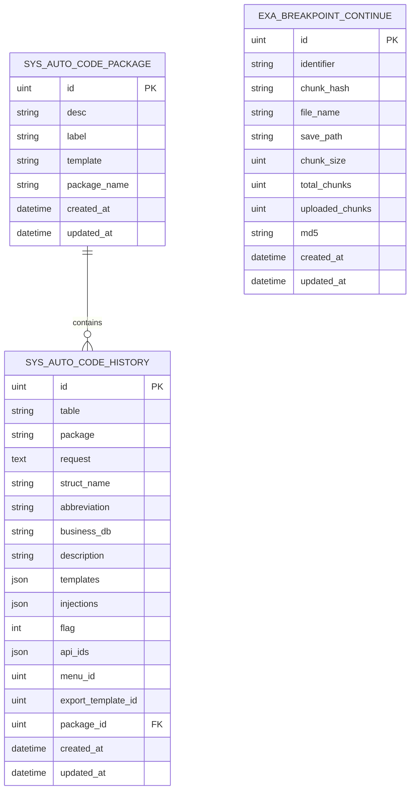

# 测试执行跟踪

<cite>
**本文档引用的文件**
- [测试执行跟踪.md](file://repowiki/zh/content/测试管理功能/测试执行跟踪.md)
- [gva_execute.go](file://server/mcp/gva_execute.go)
- [gva_review.go](file://server/mcp/gva_review.go)
- [standalone_manager.go](file://server/mcp/standalone_manager.go)
- [result.go](file://server/mcp/result.go)
- [client_test.go](file://server/mcp/client/client_test.go)
- [timed_task_test.go](file://server/utils/timer/timed_task_test.go)
- [sys_auto_code_package.go](file://server/model/system/sys_auto_code_package.go)
- [sys_auto_code_history.go](file://server/model/system/sys_auto_code_history.go)
- [exa_breakpoint_continue.go](file://server/api/v1/example/exa_breakpoint_continue.go)
- [exa_file_upload_download.go](file://server/api/v1/example/exa_file_upload_download.go)
- [exa_breakpoint_continue.go](file://server/service/example/exa_breakpoint_continue.go)
- [exa_file_upload_download.go](file://server/service/example/exa_file_upload_download.go)
- [exa_breakpoint_continue.go](file://server/model/example/exa_breakpoint_continue.go)
- [breakpoint_continue.go](file://server/utils/breakpoint_continue.go)
- [breakpoint.vue](file://web/src/view/example/breakpoint/breakpoint.vue)
- [breakpoint.js](file://web/src/api/breakpoint.js)
- [mcpTest.vue](file://web/src/view/systemTools/autoCode/mcpTest.vue)
</cite>

## 目录
1. [简介](#简介)
2. [项目结构](#项目结构)
3. [核心组件](#核心组件)
4. [架构概览](#架构概览)
5. [详细组件分析](#详细组件分析)
6. [依赖关系分析](#依赖关系分析)
7. [性能考虑](#性能考虑)
8. [故障排除指南](#故障排除指南)
9. [结论](#结论)
10. [附录](#附录)

## 简介

测试执行跟踪功能是测试管理平台的核心组成部分，负责支持手动和自动化测试的完整生命周期管理。该功能提供了从测试执行计划制定、测试用例执行监控、测试结果收集到测试状态跟踪的全方位解决方案。

系统采用前后端分离架构，后端基于Go语言实现，前端使用Vue.js框架，通过MCP（Model Context Protocol）协议实现智能测试工具的集成。测试执行跟踪功能涵盖了断点续传、文件上传下载、测试状态管理等多个关键技术领域。

## 项目结构

测试执行跟踪功能在项目中的组织结构如下：

**图表来源**
- [mcpTest.vue:1-300](file://web/src/view/systemTools/autoCode/mcpTest.vue#L1-L300)
- [breakpoint.vue:1-200](file://web/src/view/example/breakpoint/breakpoint.vue#L1-L200)
- [gva_execute.go:1-200](file://server/mcp/gva_execute.go#L1-L200)

**章节来源**
- [mcpTest.vue:1-300](file://web/src/view/systemTools/autoCode/mcpTest.vue#L1-L300)
- [breakpoint.vue:1-200](file://web/src/view/example/breakpoint/breakpoint.vue#L1-L200)
- [gva_execute.go:1-200](file://server/mcp/gva_execute.go#L1-L200)

## 核心组件

### 测试执行器工具

GVAExecutor是测试执行跟踪的核心组件，负责处理测试执行请求并生成相应的执行结果。该工具支持多种执行模式，包括包创建、模块创建、字典创建等。

主要功能特性：
- **执行计划验证**：确保执行计划的完整性和正确性
- **批量模块处理**：支持同时创建多个测试模块
- **字典自动创建**：根据需求自动创建必要的字典项
- **路径信息生成**：提供完整的文件生成路径信息

### 断点续传系统

断点续传功能实现了大文件的安全传输机制，支持网络中断后的续传能力。系统通过MD5校验确保文件完整性，并提供实时的进度跟踪。

核心技术实现：
- **切片上传**：将大文件分割为1MB的切片进行传输
- **MD5校验**：每个切片都进行完整性验证
- **进度跟踪**：实时显示上传进度和剩余时间
- **秒传功能**：通过文件MD5快速识别重复文件

### 测试状态管理

系统提供了完整的测试状态管理机制，包括测试执行状态的实时更新、测试结果的收集和分析、以及测试进度的可视化展示。

**章节来源**
- [gva_execute.go:217-289](file://server/mcp/gva_execute.go#L217-L289)
- [exa_breakpoint_continue.go:20-78](file://server/api/v1/example/exa_breakpoint_continue.go#L20-L78)
- [breakpoint_continue.go:26-76](file://server/utils/breakpoint_continue.go#L26-L76)

## 架构概览

测试执行跟踪系统的整体架构采用分层设计，确保各组件之间的松耦合和高内聚。

**图表来源**
- [gva_execute.go:217-289](file://server/mcp/gva_execute.go#L217-L289)
- [exa_breakpoint_continue.go:20-78](file://server/api/v1/example/exa_breakpoint_continue.go#L20-L78)

### 数据流架构

**图表来源**
- [gva_execute.go:440-515](file://server/mcp/gva_execute.go#L440-L515)

## 详细组件分析

### 测试执行器组件

GVAExecutor组件是测试执行跟踪的核心执行单元，实现了完整的测试执行生命周期管理。

#### 类结构设计

**图表来源**
- [gva_execute.go:21-52](file://server/mcp/gva_execute.go#L21-L52)

#### 执行流程分析

**图表来源**
- [gva_execute.go:217-289](file://server/mcp/gva_execute.go#L217-L289)
- [gva_execute.go:440-515](file://server/mcp/gva_execute.go#L440-L515)

**章节来源**
- [gva_execute.go:217-289](file://server/mcp/gva_execute.go#L217-L289)
- [gva_execute.go:291-438](file://server/mcp/gva_execute.go#L291-L438)

### 断点续传组件

断点续传系统实现了大文件的安全传输机制，是测试执行跟踪的重要基础设施。

#### 前端实现分析

前端通过breakpoint.vue组件实现了完整的断点续传界面，包括文件选择、切片上传、进度跟踪等功能。

**图表来源**
- [breakpoint.vue:77-211](file://web/src/view/example/breakpoint/breakpoint.vue#L77-L211)

#### 后端处理流程

**图表来源**
- [exa_breakpoint_continue.go:20-78](file://server/api/v1/example/exa_breakpoint_continue.go#L20-L78)
- [exa_breakpoint_continue.go:21-35](file://server/service/example/exa_breakpoint_continue.go#L21-L35)
- [breakpoint_continue.go:84-107](file://server/utils/breakpoint_continue.go#L84-L107)

**章节来源**
- [breakpoint.vue:77-211](file://web/src/view/example/breakpoint/breakpoint.vue#L77-L211)
- [exa_breakpoint_continue.go:20-121](file://server/api/v1/example/exa_breakpoint_continue.go#L20-L121)
- [breakpoint_continue.go:26-107](file://server/utils/breakpoint_continue.go#L26-L107)

### 测试状态管理组件

系统提供了完整的测试状态管理机制，支持测试执行过程中的实时状态跟踪和结果收集。

#### 状态跟踪机制

**图表来源**
- [gva_execute.go:440-515](file://server/mcp/gva_execute.go#L440-L515)

#### 前端状态展示

前端通过mcpTest.vue组件实现了测试工具的状态展示和结果反馈功能。

**章节来源**
- [mcpTest.vue:572-615](file://web/src/view/systemTools/autoCode/mcpTest.vue#L572-L615)
- [gva_execute.go:440-515](file://server/mcp/gva_execute.go#L440-L515)

## 依赖关系分析

测试执行跟踪功能的依赖关系体现了清晰的分层架构设计，各组件之间通过明确的接口进行通信。

**图表来源**
- [gva_execute.go:1-20](file://server/mcp/gva_execute.go#L1-L20)
- [breakpoint.vue:52-62](file://web/src/view/example/breakpoint/breakpoint.vue#L52-L62)

### 组件耦合度分析

系统采用了低耦合的设计原则，主要体现在：

1. **接口隔离**：各组件通过明确的接口进行通信，避免直接依赖
2. **依赖注入**：通过构造函数传递依赖，便于测试和维护
3. **分层架构**：前端、后端、数据层职责清晰分离
4. **协议驱动**：MCP协议统一了工具间的通信标准

**章节来源**
- [gva_execute.go:1-20](file://server/mcp/gva_execute.go#L1-L20)
- [exa_breakpoint_continue.go:1-20](file://server/api/v1/example/exa_breakpoint_continue.go#L1-L20)

## 性能考虑

测试执行跟踪功能在设计时充分考虑了性能优化，特别是在大文件传输和并发处理方面。

### 断点续传性能优化

- **切片大小优化**：采用1MB的切片大小，在传输效率和内存占用间取得平衡
- **MD5校验缓存**：避免重复计算文件MD5值
- **异步处理**：切片上传采用异步方式，提高并发处理能力
- **进度批处理**：批量更新进度信息，减少UI刷新频率

### 内存管理策略

- **流式处理**：大文件采用流式读写，避免一次性加载到内存
- **临时文件清理**：及时清理上传过程中的临时文件
- **连接池管理**：数据库连接和HTTP连接采用连接池复用

### 缓存机制

- **文件MD5缓存**：缓存已计算的文件MD5值
- **切片状态缓存**：缓存文件的切片上传状态
- **配置缓存**：缓存常用的配置信息

## 故障排除指南

### 常见问题及解决方案

#### 断点续传失败

**问题现象**：文件上传过程中断，重新上传时无法继续

**可能原因**：
1. 切片MD5校验失败
2. 临时文件损坏
3. 网络连接异常

**解决步骤**：
1. 检查网络连接稳定性
2. 清理临时文件缓存
3. 重新计算文件MD5值
4. 检查磁盘空间和权限

#### 执行计划验证失败

**问题现象**：测试执行被拒绝，返回验证错误

**可能原因**：
1. 执行计划格式不正确
2. 必需字段缺失
3. 数据类型不匹配

**解决步骤**：
1. 检查执行计划的JSON格式
2. 验证所有必需字段的存在性
3. 确认数据类型的正确性
4. 参考工具描述中的结构要求

#### 前端界面无响应

**问题现象**：测试工具界面无法正常显示或操作

**可能原因**：
1. MCP服务未启动
2. API接口调用失败
3. 前端依赖加载问题

**解决步骤**：
1. 检查MCP服务状态
2. 验证API接口可用性
3. 清理浏览器缓存
4. 检查网络代理设置

**章节来源**
- [breakpoint.vue:142-156](file://web/src/view/example/breakpoint/breakpoint.vue#L142-L156)
- [gva_execute.go:291-320](file://server/mcp/gva_execute.go#L291-L320)

## 结论

测试执行跟踪功能通过精心设计的架构和完善的实现，为测试管理平台提供了强大的测试执行支持。系统不仅支持手动测试和自动化测试的无缝集成，还提供了断点续传、状态跟踪、结果收集等关键功能。

### 主要优势

1. **完整的生命周期管理**：从测试计划制定到结果分析的全流程支持
2. **高可靠性的传输机制**：断点续传确保大文件传输的可靠性
3. **灵活的执行模式**：支持多种执行模式和自定义配置
4. **实时的状态跟踪**：提供详细的执行进度和结果反馈
5. **良好的扩展性**：基于MCP协议的模块化设计便于功能扩展

### 技术创新点

- **智能测试工具集成**：通过MCP协议实现测试工具的智能化管理
- **分布式文件处理**：支持大规模文件的分布式处理和存储
- **实时状态同步**：提供实时的测试状态更新和用户反馈
- **安全的文件传输**：通过MD5校验确保文件传输的完整性

该功能为测试管理平台奠定了坚实的技术基础，为后续的功能扩展和性能优化提供了良好的架构支撑。

## 附录

### 数据模型设计

**图表来源**
- [sys_auto_code_package.go:7-14](file://server/model/system/sys_auto_code_package.go#L7-L14)
- [sys_auto_code_history.go:13-30](file://server/model/system/sys_auto_code_history.go#L13-L30)
- [exa_breakpoint_continue.go:1-50](file://server/model/example/exa_breakpoint_continue.go#L1-L50)

### 测试执行最佳实践

#### 执行策略建议
- 使用分批执行策略处理大量测试用例
- 实施重试机制处理临时性失败
- 建立优先级队列管理不同重要性的测试任务
- 实施并发控制避免资源争用

#### 监控告警配置
- 设置执行时间阈值告警
- 监控失败率异常检测
- 实施资源使用率监控
- 建立测试结果趋势分析

#### 性能优化要点
- 优化数据库查询和索引
- 实施结果缓存策略
- 建立异步处理机制
- 实施负载均衡和扩容