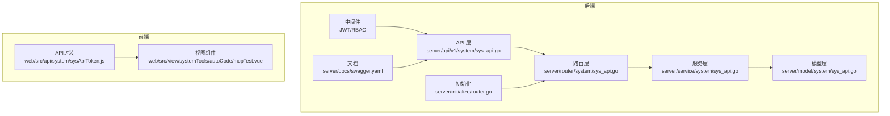
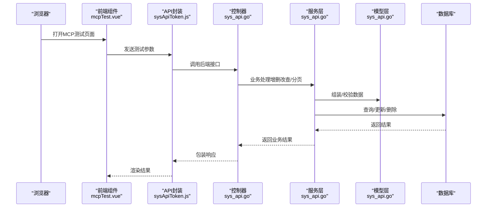
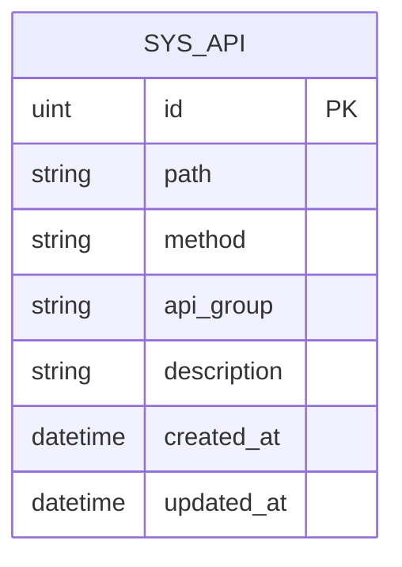
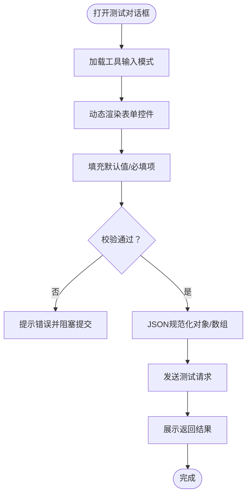
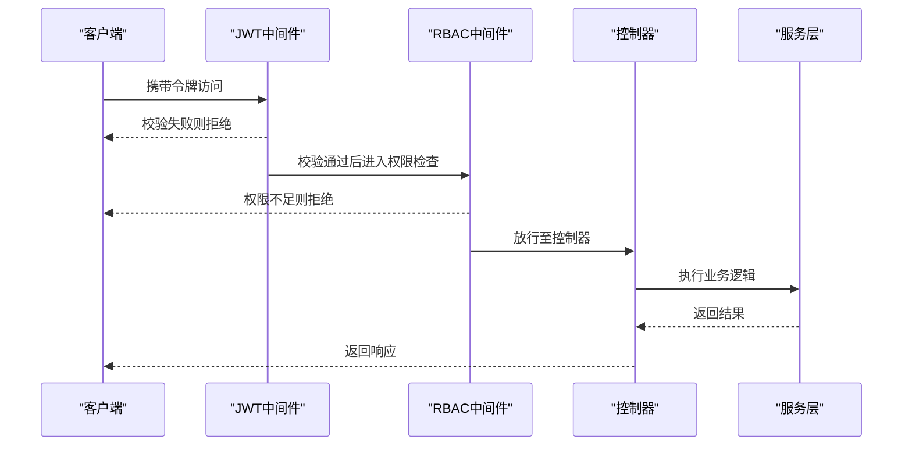
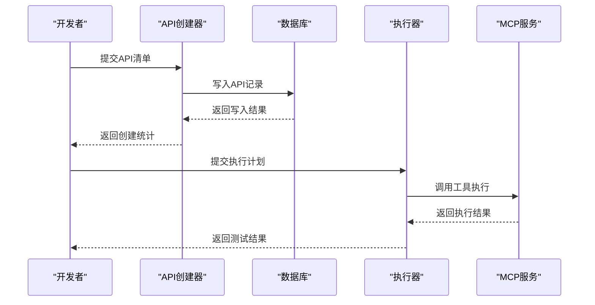
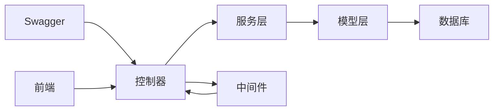

# 测试用例管理

<cite>
**本文引用的文件**
- [server\api\v1\system\sys_api.go](file://server/api/v1/system/sys_api.go)
- [server\router\system\sys_api.go](file://server/router\system\sys_api.go)
- [server\service\system\sys_api.go](file://server/service\system\sys_api.go)
- [server\model\system\sys_api.go](file://server\model\system\sys_api.go)
- [server\initialize\router.go](file://server\initialize\router.go)
- [server\middleware\jwt.go](file://server\middleware\jwt.go)
- [server\middleware\casbin_rbac.go](file://server\middleware\casbin_rbac.go)
- [server\docs\swagger.yaml](file://server\docs\swagger.yaml)
- [web\src\api\system\sysApiToken.js](file://web\src\api\system\sysApiToken.js)
- [web\src\view\systemTools\autoCode\mcpTest.vue](file://web\src\view\systemTools\autoCode\mcpTest.vue)
- [server\mcp\api_creator.go](file://server\mcp\api_creator.go)
- [server\mcp\gva_execute.go](file://server\mcp\gva_execute.go)
- [server\service\system\auto_code_template_test.go](file://server\service\system\auto_code_template_test.go)
- [repowiki\zh\content\测试管理功能\测试用例管理.md](file://repowiki\zh\content\测试管理功能\测试用例管理.md)
- [repowiki\zh\content\数据库设计\测试相关模型\测试用例模型.md](file://repowiki\zh\content\数据库设计\测试相关模型\测试用例模型.md)
- [repowiki\zh\content\测试管理功能\测试管理功能.md](file://repowiki\zh\content\测试管理功能\测试管理功能.md)
- [repowiki\zh\content\后端系统\业务逻辑层\示例业务逻辑\测试用例管理服务.md](file://repowiki\zh\content\后端系统\业务逻辑层\示例业务逻辑\测试用例管理服务.md)
</cite>

## 目录
1. [简介](#简介)
2. [项目结构](#项目结构)
3. [核心组件](#核心组件)
4. [架构总览](#架构总览)
5. [详细组件分析](#详细组件分析)
6. [依赖分析](#依赖分析)
7. [性能考虑](#性能考虑)
8. [故障排查指南](#故障排查指南)
9. [结论](#结论)
10. [附录](#附录)

## 简介
本文件围绕“测试用例管理”能力进行系统化说明，目标是帮助开发者与测试工程师快速理解并使用平台提供的测试用例相关功能。内容涵盖：
- 测试用例的创建、编辑、删除、查询等核心操作流程
- 数据模型设计、字段定义、验证规则与业务约束
- 前端页面实现细节（表单组件、数据绑定、用户交互）
- 完整的API接口说明（请求参数、响应格式、错误处理）
- 测试用例的分类管理、状态跟踪与权限控制机制
- 具体的代码示例路径与最佳实践建议

为避免信息过载，本文采用分层讲解方式：先给出高层架构与流程，再深入到具体组件与实现细节。

## 项目结构
测试用例管理在本项目中主要通过“系统工具”与“MCP（Model Context Protocol）”能力协同实现，后端以系统API为中心，前端提供可视化测试与参数配置界面。关键目录与文件如下：
- 后端
  - API层：系统API的增删改查接口
  - 路由层：系统API路由注册
  - 服务层：系统API业务逻辑
  - 模型层：系统API数据模型
  - 初始化：路由注册入口
  - 中间件：JWT鉴权与RBAC权限控制
  - 文档：Swagger接口文档
- 前端
  - API封装：系统API Token相关接口
  - 视图组件：MCP测试工具参数对话框与测试流程

图表来源
- [server\api\v1\system\sys_api.go](file://server\api\v1\system\sys_api.go)
- [server\router\system\sys_api.go](file://server\router\system\sys_api.go)
- [server\service\system\sys_api.go](file://server\service\system\sys_api.go)
- [server\model\system\sys_api.go](file://server\model\system\sys_api.go)
- [server\initialize\router.go](file://server\initialize\router.go)
- [server\middleware\jwt.go](file://server\middleware\jwt.go)
- [server\middleware\casbin_rbac.go](file://server\middleware\casbin_rbac.go)
- [server\docs\swagger.yaml](file://server\docs\swagger.yaml)
- [web\src\api\system\sysApiToken.js](file://web\src\api\system\sysApiToken.js)
- [web\src\view\systemTools\autoCode\mcpTest.vue](file://web\src\view\systemTools\autoCode\mcpTest.vue)

章节来源
- [server\api\v1\system\sys_api.go](file://server\api\v1\system\sys_api.go)
- [server\router\system\sys_api.go](file://server\router\system\sys_api.go)
- [server\service\system\sys_api.go](file://server\service\system\sys_api.go)
- [server\model\system\sys_api.go](file://server\model\system\sys_api.go)
- [server\initialize\router.go](file://server\initialize\router.go)
- [server\middleware\jwt.go](file://server\middleware\jwt.go)
- [server\middleware\casbin_rbac.go](file://server\middleware\casbin_rbac.go)
- [server\docs\swagger.yaml](file://server\docs\swagger.yaml)
- [web\src\api\system\sysApiToken.js](file://web\src\api\system\sysApiToken.js)
- [web\src\view\systemTools\autoCode\mcpTest.vue](file://web\src\view\systemTools\autoCode\mcpTest.vue)

## 核心组件
- 系统API（SysApi）：承载测试用例相关的接口元数据，包括路径、方法、分组、描述等
- API服务（ApiService）：提供SysApi的增删改查、分页查询、权限清理等能力
- 路由与控制器：将HTTP请求映射到对应的服务方法
- 前端MCP测试工具：提供参数化测试与结果展示的交互界面
- 权限控制：基于JWT与RBAC的访问控制

章节来源
- [server\api\v1\system\sys_api.go](file://server\api\v1\system\sys_api.go)
- [server\service\system\sys_api.go](file://server\service\system\sys_api.go)
- [server\router\system\sys_api.go](file://server\router\system\sys_api.go)
- [web\src\view\systemTools\autoCode\mcpTest.vue](file://web\src\view\systemTools\autoCode\mcpTest.vue)

## 架构总览
下图展示了从浏览器到后端服务再到数据库的整体调用链路，以及权限校验与文档生成的关键节点。

图表来源
- [server\api\v1\system\sys_api.go](file://server\api\v1\system\sys_api.go)
- [server\service\system\sys_api.go](file://server\service\system\sys_api.go)
- [server\model\system\sys_api.go](file://server\model\system\sys_api.go)
- [web\src\view\systemTools\autoCode\mcpTest.vue](file://web\src\view\systemTools\autoCode\mcpTest.vue)
- [web\src\api\system\sysApiToken.js](file://web\src\api\system\sysApiToken.js)

## 详细组件分析

### 数据模型与字段定义
- SysApi（系统API）
  - 字段要点：路径、方法、分组、描述、创建/更新时间等
  - 验证规则：路径与方法组合唯一；方法需为标准HTTP方法；分组与描述支持模糊匹配
  - 业务约束：删除时需清理相关权限策略；分页查询支持按路径、描述、方法、分组过滤

图表来源
- [server\model\system\sys_api.go](file://server\model\system\sys_api.go)

章节来源
- [server\model\system\sys_api.go](file://server\model\system\sys_api.go)
- [server\service\system\sys_api.go](file://server\service\system\sys_api.go)

### API接口说明（以SysApi为例）
以下接口均基于Swagger文档生成，遵循统一的响应结构（code、data、msg）。请求参数与响应格式以接口注释为准。

- 获取API列表
  - 方法与路径：GET /system/sysApi/getApiList
  - 请求参数：分页信息、路径（模糊）、描述（模糊）、方法、分组
  - 响应：分页结果对象，包含列表与总数
  - 错误处理：查询异常时返回错误码与消息

- 创建API
  - 方法与路径：POST /system/sysApi/createApi
  - 请求参数：SysApi对象（路径、方法、分组、描述等）
  - 响应：成功/失败消息
  - 错误处理：重复或非法参数时返回错误

- 更新API
  - 方法与路径：PUT /system/sysApi/updateApi
  - 请求参数：SysApi对象（含主键）
  - 响应：成功/失败消息
  - 错误处理：不存在或冲突时返回错误

- 删除API
  - 方法与路径：DELETE /system/sysApi/deleteApi
  - 请求参数：SysApi主键
  - 响应：成功/失败消息
  - 错误处理：不存在或依赖约束时返回错误

- 批量删除API
  - 方法与路径：DELETE /system/sysApi/deleteApisByIds
  - 请求参数：主键数组
  - 响应：批量结果统计
  - 错误处理：部分失败时返回明细

章节来源
- [server\docs\swagger.yaml](file://server\docs\swagger.yaml)
- [server\api\v1\system\sys_api.go](file://server\api\v1\system\sys_api.go)
- [server\service\system\sys_api.go](file://server\service\system\sys_api.go)

### 前端页面实现细节
- 组件：mcpTest.vue
  - 表单组件：根据工具输入模式动态渲染字符串、数值、布尔、枚举与JSON对象/数组
  - 数据绑定：v-model双向绑定，支持默认值填充与必填校验
  - 用户交互：打开测试对话框、参数校验、发送请求、展示返回结果
  - JSON规范化：对对象/数组类型的参数进行JSON解析，保证后端接收结构化数据

图表来源
- [web\src\view\systemTools\autoCode\mcpTest.vue](file://web\src\view\systemTools\autoCode\mcpTest.vue)

章节来源
- [web\src\view\systemTools\autoCode\mcpTest.vue](file://web\src\view\systemTools\autoCode\mcpTest.vue)

### 权限控制机制
- JWT鉴权：所有受保护接口需携带有效令牌
- RBAC权限：基于Casbin的策略管理，删除API后需清理相关策略，防止越权访问
- 接口安全：Swagger注解标注了接口安全要求与参数约束

图表来源
- [server\middleware\jwt.go](file://server\middleware\jwt.go)
- [server\middleware\casbin_rbac.go](file://server\middleware\casbin_rbac.go)
- [server\api\v1\system\sys_api.go](file://server\api\v1\system\sys_api.go)
- [server\service\system\sys_api.go](file://server\service\system\sys_api.go)

章节来源
- [server\middleware\jwt.go](file://server\middleware\jwt.go)
- [server\middleware\casbin_rbac.go](file://server\middleware\casbin_rbac.go)
- [server\service\system\sys_api.go](file://server\service\system\sys_api.go)

### 测试用例的分类管理与状态跟踪
- 分类管理：SysApi的分组字段可用于区分不同测试场景（如接口测试、集成测试、回归测试等）
- 状态跟踪：可通过描述字段与自定义扩展字段记录测试状态（待执行、执行中、通过、失败、阻塞等），并在前端以标签或徽标形式展示
- 变更审计：利用创建/更新时间字段追踪测试用例生命周期

章节来源
- [server\model\system\sys_api.go](file://server\model\system\sys_api.go)
- [server\service\system\sys_api.go](file://server\service\system\sys_api.go)

### API自动化与MCP集成
- API创建器：根据传入的API清单自动创建系统API记录，并返回创建结果统计
- 执行器：解析执行计划，校验参数完整性，执行测试流程并返回结果

图表来源
- [server\mcp\api_creator.go](file://server\mcp\api_creator.go)
- [server\mcp\gva_execute.go](file://server\mcp\gva_execute.go)

章节来源
- [server\mcp\api_creator.go](file://server\mcp\api_creator.go)
- [server\mcp\gva_execute.go](file://server\mcp\gva_execute.go)

### 最佳实践
- 接口设计
  - 使用清晰的路径与方法组合，避免歧义
  - 对敏感接口启用JWT与RBAC双重保护
- 数据模型
  - 保持字段简洁明确，必要时增加索引优化查询
  - 删除记录时同步清理权限策略
- 前端交互
  - 动态渲染表单，减少手写模板
  - 对复杂参数进行JSON规范化，提升兼容性
- 测试流程
  - 将测试用例与执行计划解耦，便于复用与回放
  - 记录测试状态与结果，形成闭环

## 依赖分析
- 组件耦合
  - 控制器依赖服务层；服务层依赖模型层；模型层依赖数据库
  - 中间件贯穿于请求链路，提供鉴权与权限控制
- 外部依赖
  - Swagger用于接口文档生成与校验
  - 前端通过API封装调用后端接口

图表来源
- [server\api\v1\system\sys_api.go](file://server\api\v1\system\sys_api.go)
- [server\service\system\sys_api.go](file://server\service\system\sys_api.go)
- [server\model\system\sys_api.go](file://server\model\system\sys_api.go)
- [server\middleware\jwt.go](file://server\middleware\jwt.go)
- [server\middleware\casbin_rbac.go](file://server\middleware\casbin_rbac.go)
- [server\docs\swagger.yaml](file://server\docs\swagger.yaml)
- [web\src\api\system\sysApiToken.js](file://web\src\api\system\sysApiToken.js)

章节来源
- [server\api\v1\system\sys_api.go](file://server\api\v1\system\sys_api.go)
- [server\service\system\sys_api.go](file://server\service\system\sys_api.go)
- [server\model\system\sys_api.go](file://server\model\system\sys_api.go)
- [server\middleware\jwt.go](file://server\middleware\jwt.go)
- [server\middleware\casbin_rbac.go](file://server\middleware\casbin_rbac.go)
- [server\docs\swagger.yaml](file://server\docs\swagger.yaml)
- [web\src\api\system\sysApiToken.js](file://web\src\api\system\sysApiToken.js)

## 性能考虑
- 查询优化
  - 对常用过滤字段建立索引，减少LIKE查询成本
  - 分页查询限制每页大小，避免超大数据集一次性返回
- 缓存策略
  - 对不频繁变动的字典类数据进行缓存
- 并发控制
  - 在高并发场景下，对批量删除与权限清理操作加锁或事务化处理
- 日志与监控
  - 记录慢查询与异常请求，辅助定位性能瓶颈

## 故障排查指南
- 接口报错
  - 检查JWT令牌是否过期或无效
  - 确认RBAC策略是否允许当前用户访问该接口
- 删除失败
  - 若存在依赖（如菜单、权限），需先解除依赖再删除
  - 查看服务层返回的具体错误信息
- 前端参数问题
  - 确认输入模式与默认值是否正确
  - 对象/数组类型参数需确保JSON格式合法

章节来源
- [server\middleware\jwt.go](file://server\middleware\jwt.go)
- [server\middleware\casbin_rbac.go](file://server\middleware\casbin_rbac.go)
- [server\service\system\sys_api.go](file://server\service\system\sys_api.go)
- [web\src\view\systemTools\autoCode\mcpTest.vue](file://web\src\view\systemTools\autoCode\mcpTest.vue)

## 结论
本项目通过SysApi模型与配套的API、路由、服务、中间件与前端组件，构建了完整的测试用例管理能力。结合JWT与RBAC实现权限控制，借助Swagger与MCP增强接口文档与自动化测试能力。建议在实际落地时，进一步完善测试状态字段与执行日志，以满足持续集成与质量度量的需求。

## 附录
- 示例测试用例（后端单元测试）
  - 参考路径：[server\service\system\auto_code_template_test.go](file://server\service\system\auto_code_template_test.go)
  - 说明：该文件提供了模板预览与创建的测试样例，可作为编写测试用例管理相关测试的参考

章节来源
- [server\service\system\auto_code_template_test.go](file://server\service\system\auto_code_template_test.go)