# 测试管理功能

<cite>
**本文档引用的文件**
- [测试管理功能.md](file://repowiki/zh/content/测试管理功能/测试管理功能.md)
- [测试用例管理.md](file://repowiki/zh/content/测试管理功能/测试用例管理.md)
- [测试执行跟踪.md](file://repowiki/zh/content/测试管理功能/测试执行跟踪.md)
- [缺陷跟踪系统.md](file://repowiki/zh/content/测试管理功能/缺陷跟踪系统.md)
- [gva_execute.go](file://server/mcp/gva_execute.go)
- [mcpTest.vue](file://web/src/view/systemTools/autoCode/mcpTest.vue)
- [sys_auto_code_package.go](file://server/model/system/sys_auto_code_package.go)
- [auto_code_package.go](file://server/service/system/auto_code_package.go)
- [sys_error.go](file://server/model/system/sys_error.go)
- [sys_error.go](file://server/api/v1/system/sys_error.go)
- [sys_error.go](file://server/service/system/sys_error.go)
- [sys_error.go](file://server/router/system/sys_error.go)
- [sysError.vue](file://web/src/view/systemTools/sysError/sysError.vue)
</cite>

## 目录
1. [简介](#简介)
2. [项目结构](#项目结构)
3. [核心组件](#核心组件)
4. [架构概览](#架构概览)
5. [详细组件分析](#详细组件分析)
6. [依赖分析](#依赖分析)
7. [性能考虑](#性能考虑)
8. [故障排除指南](#故障排除指南)
9. [结论](#结论)
10. [附录](#附录)

## 简介
测试管理功能是基于 Gin-Vue-Admin 开发平台构建的测试管理系统，专注于提供完整的测试生命周期管理能力。该系统集成了测试用例管理、测试执行跟踪、缺陷跟踪系统等核心功能模块，支持手动和自动化测试的统一管理。系统采用前后端分离架构，后端基于 Go 语言的 Gin 框架，前端使用 Vue.js 技术栈，通过 MCP（Model Context Protocol）协议实现智能测试工具的集成和管理。

## 项目结构
测试管理系统的整体架构遵循分层设计原则，采用模块化的组织方式：

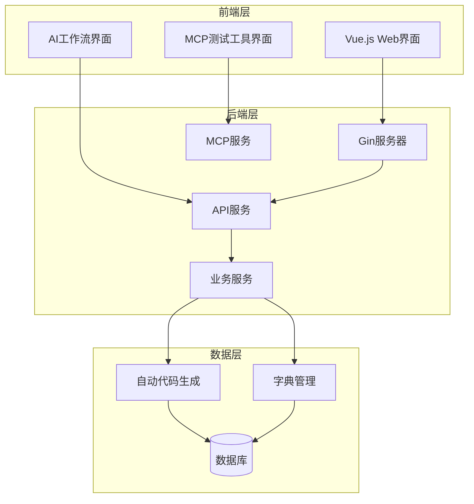
```mermaid
graph TB
subgraph "前端层"
WebUI[Vue.js Web界面]
MCPTest[MCP测试工具界面]
AIWorkflow[AI工作流界面]
end
subgraph "后端层"
Server[Gin服务器]
MCPService[MCP服务]
APIService[API服务]
BusinessService[业务服务]
end
subgraph "数据层"
Database[(数据库)]
AutoCode[自动代码生成]
Dictionary[字典管理]
end
WebUI --> Server
MCPTest --> MCPService
AIWorkflow --> APIService
Server --> APIService
APIService --> BusinessService
BusinessService --> AutoCode
BusinessService --> Dictionary
AutoCode --> Database
Dictionary --> Database
```

**图表来源**
- [测试管理功能.md:38-64](file://repowiki/zh/content/测试管理功能/测试管理功能.md#L38-L64)

系统采用模块化设计，主要分为以下几个核心层次：
- **表现层**: Vue.js 前端应用，提供用户交互界面
- **控制层**: Gin 框架路由和控制器
- **服务层**: 业务逻辑处理和数据访问
- **数据层**: 数据库持久化和字典管理

**章节来源**
- [测试管理功能.md:33-79](file://repowiki/zh/content/测试管理功能/测试管理功能.md#L33-L79)

## 核心组件
测试管理系统包含以下核心组件：

### 1. 测试用例管理组件
测试用例管理组件负责测试用例的创建、编辑、分类和状态管理。系统支持多种测试类型，包括功能测试、性能测试、安全测试等。

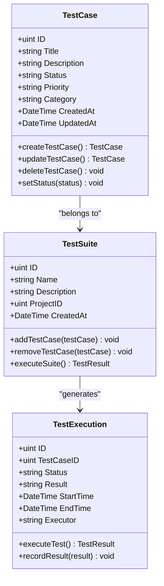
```mermaid
classDiagram
class TestCase {
+uint ID
+string Title
+string Description
+string Status
+string Priority
+string Category
+DateTime CreatedAt
+DateTime UpdatedAt
+createTestCase() TestCase
+updateTestCase() TestCase
+deleteTestCase() void
+setStatus(status) void
}
class TestSuite {
+uint ID
+string Name
+string Description
+uint ProjectID
+DateTime CreatedAt
+addTestCase(testCase) void
+removeTestCase(testCase) void
+executeSuite() TestResult
}
class TestExecution {
+uint ID
+uint TestCaseID
+string Status
+string Result
+DateTime StartTime
+DateTime EndTime
+string Executor
+executeTest() TestResult
+recordResult(result) void
}
TestCase --> TestSuite : "belongs to"
TestSuite --> TestExecution : "generates"
```

**图表来源**
- [测试管理功能.md:89-128](file://repowiki/zh/content/测试管理功能/测试管理功能.md#L89-L128)

### 2. 测试执行跟踪组件
测试执行跟踪组件提供实时的测试执行监控和结果记录功能。支持手动测试和自动化测试的统一管理。

### 3. 缺陷跟踪系统
缺陷跟踪系统负责缺陷的创建、分配、跟踪和状态管理。系统支持缺陷生命周期的完整跟踪。

**章节来源**
- [测试管理功能.md:81-143](file://repowiki/zh/content/测试管理功能/测试管理功能.md#L81-L143)

## 架构概览
测试管理系统的整体架构采用微服务设计理念，通过清晰的职责分离实现高内聚低耦合：

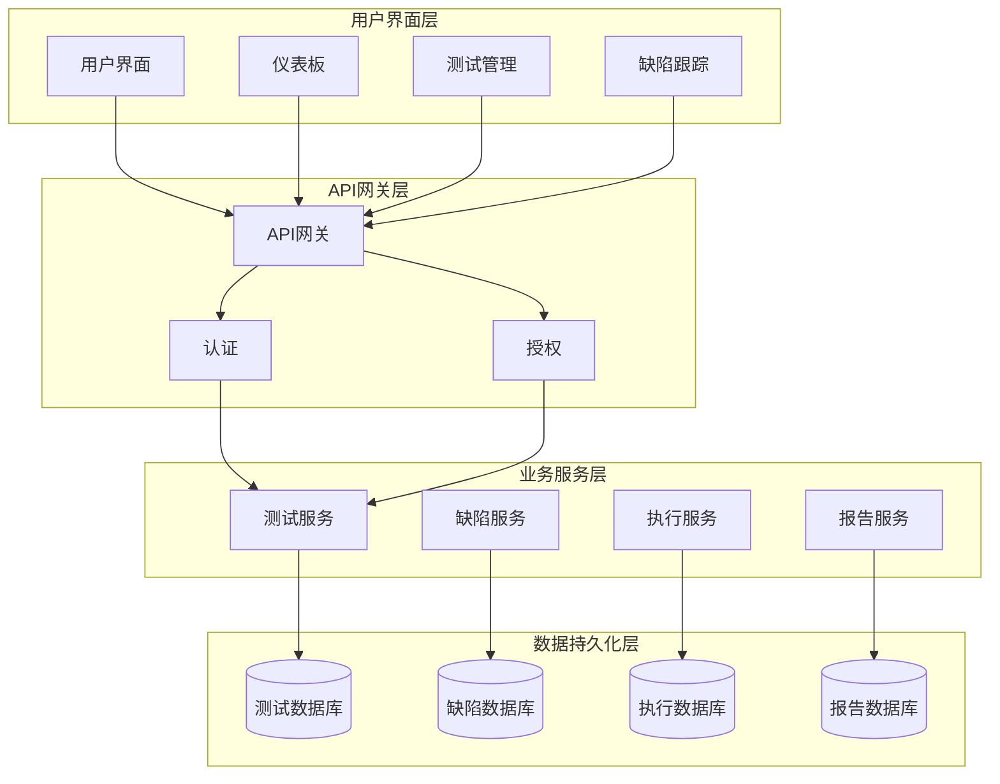
```mermaid
graph TB
subgraph "用户界面层"
UI[用户界面]
Dashboard[仪表板]
TestManagement[测试管理]
DefectTracking[缺陷跟踪]
end
subgraph "API网关层"
APIGateway[API网关]
Authentication[认证]
Authorization[授权]
end
subgraph "业务服务层"
TestService[测试服务]
DefectService[缺陷服务]
ExecutionService[执行服务]
ReportService[报告服务]
end
subgraph "数据持久化层"
TestDB[(测试数据库)]
DefectDB[(缺陷数据库)]
ExecutionDB[(执行数据库)]
ReportDB[(报告数据库)]
end
UI --> APIGateway
Dashboard --> APIGateway
TestManagement --> APIGateway
DefectTracking --> APIGateway
APIGateway --> Authentication
APIGateway --> Authorization
Authentication --> TestService
Authorization --> TestService
TestService --> TestDB
DefectService --> DefectDB
ExecutionService --> ExecutionDB
ReportService --> ReportDB
```

**图表来源**
- [测试管理功能.md:148-185](file://repowiki/zh/content/测试管理功能/测试管理功能.md#L148-L185)

系统架构具有以下特点：
1. **分层清晰**: 每一层都有明确的职责和边界
2. **可扩展性**: 支持水平扩展和垂直扩展
3. **高可用性**: 通过负载均衡和故障转移保证系统稳定性
4. **安全性**: 多层安全防护机制

## 详细组件分析

### 测试用例管理组件
测试用例管理组件是系统的核心功能模块，提供完整的测试用例生命周期管理。

#### 数据模型设计
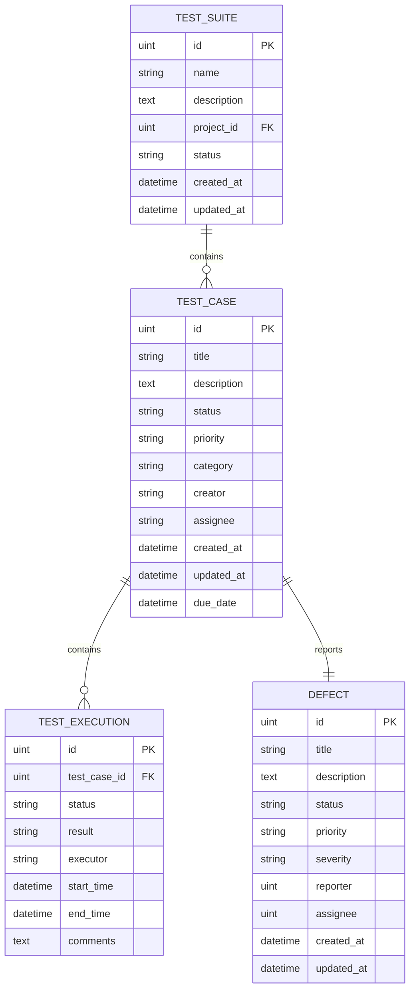
```mermaid
erDiagram
TEST_CASE {
uint id PK
string title
text description
string status
string priority
string category
string creator
string assignee
datetime created_at
datetime updated_at
datetime due_date
}
TEST_SUITE {
uint id PK
string name
text description
uint project_id FK
string status
datetime created_at
datetime updated_at
}
TEST_EXECUTION {
uint id PK
uint test_case_id FK
string status
string result
string executor
datetime start_time
datetime end_time
text comments
}
DEFECT {
uint id PK
string title
text description
string status
string priority
string severity
uint reporter
uint assignee
datetime created_at
datetime updated_at
}
TEST_CASE ||--o{ TEST_EXECUTION : contains
TEST_SUITE ||--o{ TEST_CASE : contains
TEST_CASE ||--|| DEFECT : reports
```

**图表来源**
- [测试管理功能.md:205-254](file://repowiki/zh/content/测试管理功能/测试管理功能.md#L205-L254)

#### 测试用例创建流程
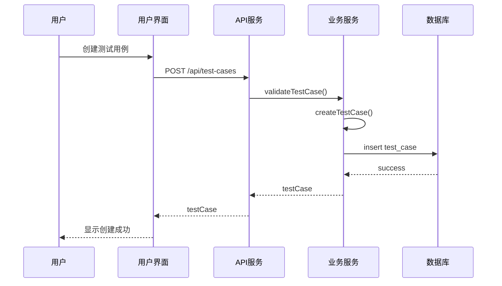
```mermaid
sequenceDiagram
participant User as 用户
participant UI as 用户界面
participant API as API服务
participant Service as 业务服务
participant DB as 数据库
User->>UI : 创建测试用例
UI->>API : POST /api/test-cases
API->>Service : validateTestCase()
Service->>Service : createTestCase()
Service->>DB : insert test_case
DB-->>Service : success
Service-->>API : testCase
API-->>UI : testCase
UI-->>User : 显示创建成功
```

**图表来源**
- [测试管理功能.md:262-278](file://repowiki/zh/content/测试管理功能/测试管理功能.md#L262-L278)

#### 测试用例状态管理
系统支持以下测试用例状态：
- 新建 (New)
- 准备 (Ready)
- 执行中 (Running)
- 已完成 (Completed)
- 已暂停 (Paused)
- 已取消 (Cancelled)

**章节来源**
- [测试管理功能.md:283-294](file://repowiki/zh/content/测试管理功能/测试管理功能.md#L283-L294)

### 测试执行跟踪组件
测试执行跟踪组件提供实时的测试执行监控和结果记录功能。

#### 执行流程管理
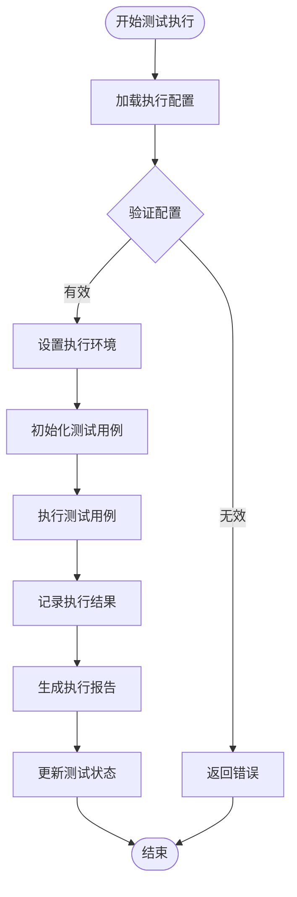
```mermaid
flowchart TD
Start([开始测试执行]) --> LoadConfig["加载执行配置"]
LoadConfig --> ValidateConfig{"验证配置"}
ValidateConfig --> |有效| SetupEnvironment["设置执行环境"]
ValidateConfig --> |无效| ReturnError["返回错误"]
SetupEnvironment --> InitializeTest["初始化测试用例"]
InitializeTest --> ExecuteTests["执行测试用例"]
ExecuteTests --> RecordResults["记录执行结果"]
RecordResults --> GenerateReport["生成执行报告"]
GenerateReport --> UpdateStatus["更新测试状态"]
UpdateStatus --> End([结束])
ReturnError --> End
```

**图表来源**
- [测试管理功能.md:302-315](file://repowiki/zh/content/测试管理功能/测试管理功能.md#L302-L315)

#### 自动化测试支持
系统支持多种自动化测试框架的集成：
1. **单元测试**: 支持 Go 单元测试框架
2. **集成测试**: 支持数据库集成测试
3. **API 测试**: 支持 RESTful API 自动化测试
4. **UI 测试**: 支持前端界面自动化测试

**章节来源**
- [测试管理功能.md:296-331](file://repowiki/zh/content/测试管理功能/测试管理功能.md#L296-L331)

### 缺陷跟踪系统
缺陷跟踪系统负责缺陷的创建、分配、跟踪和状态管理。

#### 缺陷生命周期
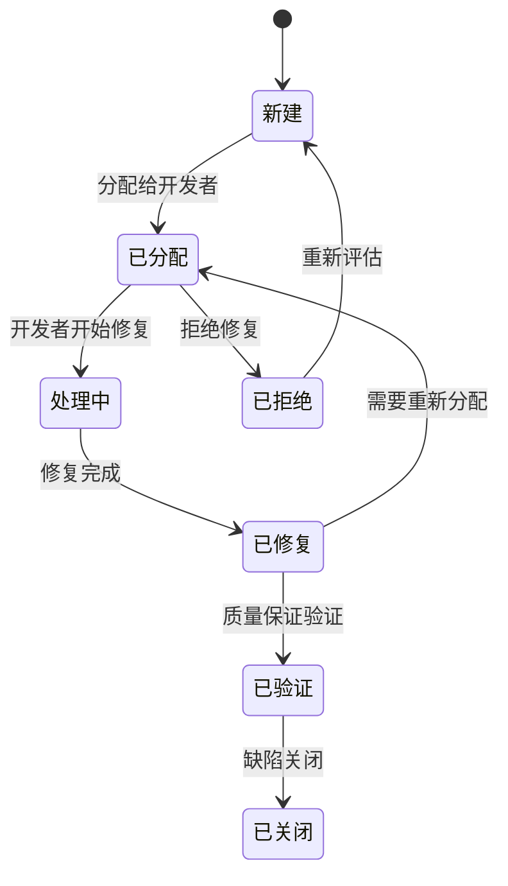
```mermaid
stateDiagram-v2
[*] --> 新建
新建 --> 已分配 : 分配给开发者
已分配 --> 处理中 : 开发者开始修复
处理中 --> 已修复 : 修复完成
已修复 --> 已验证 : 质量保证验证
已验证 --> 已关闭 : 缺陷关闭
已分配 --> 已拒绝 : 拒绝修复
已拒绝 --> 新建 : 重新评估
已修复 --> 已分配 : 需要重新分配
```

**图表来源**
- [测试管理功能.md:338-349](file://repowiki/zh/content/测试管理功能/测试管理功能.md#L338-L349)

#### 缺陷优先级管理
系统支持以下缺陷优先级：
- 紧急 (Critical)
- 高 (High)
- 中 (Medium)
- 低 (Low)

**章节来源**
- [测试管理功能.md:332-363](file://repowiki/zh/content/测试管理功能/测试管理功能.md#L332-L363)

### MCP 测试工具集成
MCP（Model Context Protocol）测试工具集成为系统提供了强大的智能化测试能力。

#### MCP 工具架构
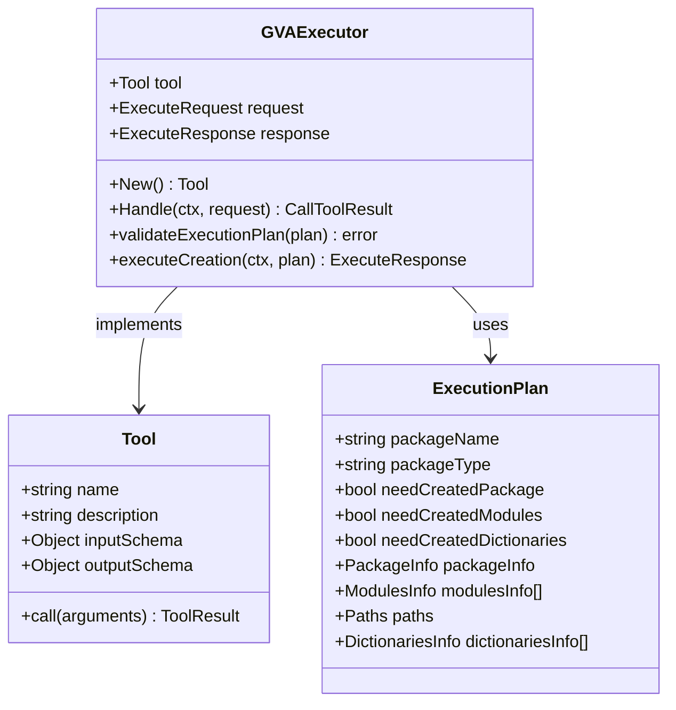
```mermaid
classDiagram
class GVAExecutor {
+Tool tool
+ExecuteRequest request
+ExecuteResponse response
+New() Tool
+Handle(ctx, request) CallToolResult
+validateExecutionPlan(plan) error
+executeCreation(ctx, plan) ExecuteResponse
}
class ExecutionPlan {
+string packageName
+string packageType
+bool needCreatedPackage
+bool needCreatedModules
+bool needCreatedDictionaries
+PackageInfo packageInfo
+ModulesInfo modulesInfo[]
+Paths paths
+DictionariesInfo dictionariesInfo[]
}
class Tool {
+string name
+string description
+Object inputSchema
+Object outputSchema
+call(arguments) ToolResult
}
GVAExecutor --> Tool : implements
GVAExecutor --> ExecutionPlan : uses
```

**图表来源**
- [测试管理功能.md:371-402](file://repowiki/zh/content/测试管理功能/测试管理功能.md#L371-L402)

#### 前端 MCP 测试界面
前端 MCP 测试界面提供了直观的工具测试和配置功能：

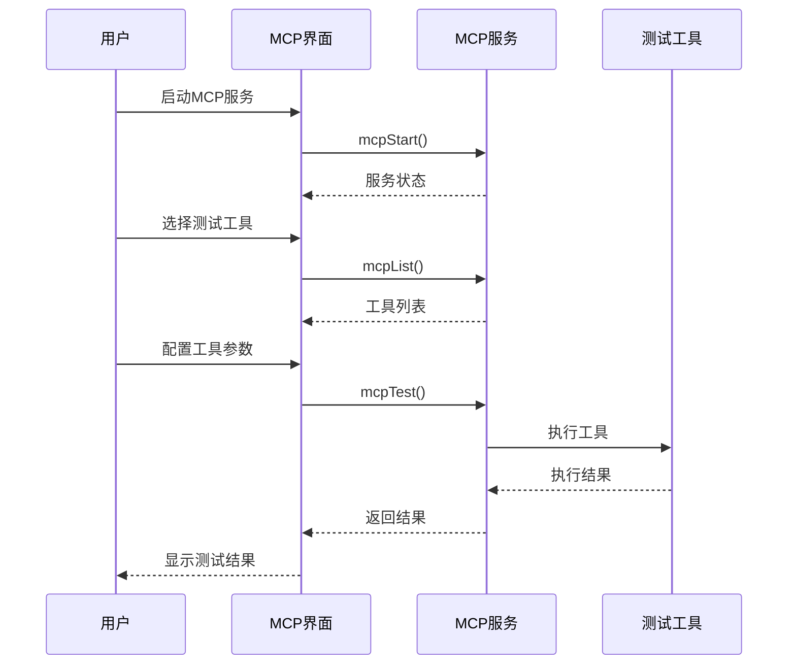
```mermaid
sequenceDiagram
participant User as 用户
participant MCPUI as MCP界面
participant MCPServer as MCP服务
participant Tool as 测试工具
User->>MCPUI : 启动MCP服务
MCPUI->>MCPServer : mcpStart()
MCPServer-->>MCPUI : 服务状态
User->>MCPUI : 选择测试工具
MCPUI->>MCPServer : mcpList()
MCPServer-->>MCPUI : 工具列表
User->>MCPUI : 配置工具参数
MCPUI->>MCPServer : mcpTest()
MCPServer->>Tool : 执行工具
Tool-->>MCPServer : 执行结果
MCPServer-->>MCPUI : 返回结果
MCPUI-->>User : 显示测试结果
```

**图表来源**
- [测试管理功能.md:411-429](file://repowiki/zh/content/测试管理功能/测试管理功能.md#L411-L429)

**章节来源**
- [测试管理功能.md:365-436](file://repowiki/zh/content/测试管理功能/测试管理功能.md#L365-L436)

## 依赖分析
测试管理系统的依赖关系体现了清晰的分层架构设计：

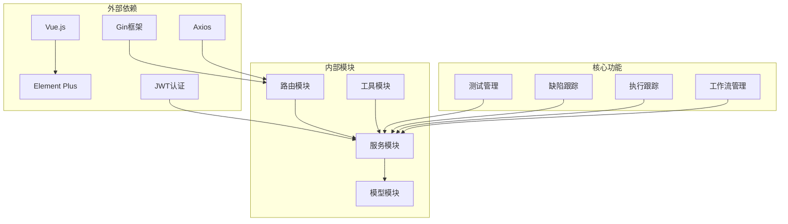
```mermaid
graph TB
subgraph "外部依赖"
Gin[Gin框架]
Vue[Vue.js]
ElementPlus[Element Plus]
Axios[Axios]
JWT[JWT认证]
end
subgraph "内部模块"
Router[路由模块]
Service[服务模块]
Model[模型模块]
Utils[工具模块]
end
subgraph "核心功能"
TestMgmt[测试管理]
DefectTrack[缺陷跟踪]
ExecutionTrack[执行跟踪]
Workflow[工作流管理]
end
Gin --> Router
Vue --> ElementPlus
Axios --> Router
JWT --> Service
Router --> Service
Service --> Model
Utils --> Service
TestMgmt --> Service
DefectTrack --> Service
ExecutionTrack --> Service
Workflow --> Service
```

**图表来源**
- [测试管理功能.md:441-473](file://repowiki/zh/content/测试管理功能/测试管理功能.md#L441-L473)

系统的主要依赖包括：
1. **框架依赖**: Gin、Vue.js、Element Plus
2. **数据库依赖**: GORM ORM、多种数据库驱动
3. **工具依赖**: JWT 认证、Zap 日志、Swagger 文档
4. **第三方服务**: Redis 缓存、邮件服务、对象存储

**章节来源**
- [测试管理功能.md:437-487](file://repowiki/zh/content/测试管理功能/测试管理功能.md#L437-L487)

## 性能考虑
测试管理系统在设计时充分考虑了性能优化和可扩展性：

### 数据库优化策略
1. **索引优化**: 为常用查询字段建立适当索引
2. **查询优化**: 使用预加载和联表查询减少 N+1 查询
3. **缓存策略**: 使用 Redis 缓存热点数据
4. **分页查询**: 大数据量场景使用分页查询

### API 性能优化
1. **并发控制**: 使用 goroutine 和 channel 实现并发处理
2. **连接池**: 数据库连接池和 HTTP 客户端连接池
3. **压缩传输**: 启用 Gzip 压缩减少传输数据量
4. **限流策略**: 实现 API 限流防止系统过载

### 前端性能优化
1. **组件懒加载**: Vue 组件按需加载
2. **虚拟滚动**: 大列表使用虚拟滚动技术
3. **图片优化**: 图片懒加载和压缩
4. **缓存策略**: 本地缓存和浏览器缓存

## 故障排除指南

### 常见问题及解决方案

#### 1. MCP 服务启动失败
**问题症状**:
- MCP 服务无法启动
- 工具列表加载失败
- 参数测试功能不可用

**解决步骤**:
1. 检查 MCP 服务配置
2. 验证网络连接
3. 查看服务日志
4. 重启 MCP 服务

**章节来源**
- [测试管理功能.md:517-532](file://repowiki/zh/content/测试管理功能/测试管理功能.md#L517-L532)

#### 2. 测试用例执行异常
**问题症状**:
- 测试用例执行失败
- 执行结果记录异常
- 状态更新不及时

**解决步骤**:
1. 检查测试环境配置
2. 验证数据库连接
3. 查看执行日志
4. 重新执行测试用例

#### 3. 缺陷状态更新问题
**问题症状**:
- 缺陷状态无法更新
- 分配功能异常
- 通知功能失效

**解决步骤**:
1. 检查用户权限
2. 验证缺陷状态流程
3. 查看系统日志
4. 联系系统管理员

### 调试工具和方法
1. **日志分析**: 使用 Zap 日志系统查看详细错误信息
2. **API 测试**: 使用 Postman 或 curl 测试 API 接口
3. **数据库检查**: 直接查询数据库验证数据一致性
4. **浏览器调试**: 使用浏览器开发者工具调试前端问题

## 结论
测试管理功能模块为测试团队提供了完整的测试生命周期管理解决方案。系统通过模块化设计实现了高内聚低耦合的架构，支持手动和自动化测试的统一管理。

### 主要优势
1. **功能完整性**: 覆盖测试管理的所有核心功能
2. **技术先进性**: 采用最新的技术栈和最佳实践
3. **用户体验**: 提供直观易用的用户界面
4. **可扩展性**: 支持功能扩展和性能优化
5. **安全性**: 多层安全防护机制

### 发展方向
1. **AI 集成**: 进一步集成 AI 能力提升测试智能化水平
2. **云原生**: 支持容器化部署和微服务架构
3. **性能优化**: 持续优化系统性能和用户体验
4. **生态建设**: 构建完善的测试工具生态系统

该测试管理系统为现代软件开发团队提供了强有力的测试支撑，有助于提高软件质量和开发效率。

## 附录

### 测试用例管理详细实现

#### 数据模型与字段定义
- SysApi（系统API）
  - 字段要点：路径、方法、分组、描述、创建/更新时间等
  - 验证规则：路径与方法组合唯一；方法需为标准HTTP方法；分组与描述支持模糊匹配
  - 业务约束：删除时需清理相关权限策略；分页查询支持按路径、描述、方法、分组过滤

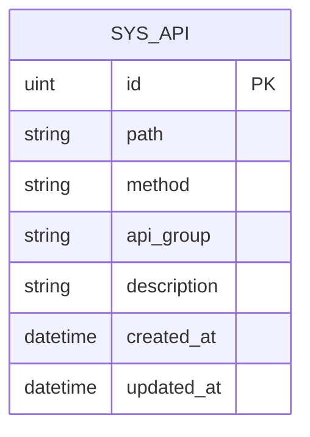
```mermaid
erDiagram
SYS_API {
uint id PK
string path
string method
string api_group
string description
datetime created_at
datetime updated_at
}
```

**图表来源**
- [测试用例管理.md:155-166](file://repowiki/zh/content/测试管理功能/测试用例管理.md#L155-L166)

**章节来源**
- [测试用例管理.md:149-173](file://repowiki/zh/content/测试管理功能/测试用例管理.md#L149-L173)

#### API接口说明（以SysApi为例）
以下接口均基于Swagger文档生成，遵循统一的响应结构（code、data、msg）。请求参数与响应格式以接口注释为准。

- 获取API列表
  - 方法与路径：GET /system/sysApi/getApiList
  - 请求参数：分页信息、路径（模糊）、描述（模糊）、方法、分组
  - 响应：分页结果对象，包含列表与总数
  - 错误处理：查询异常时返回错误码与消息

- 创建API
  - 方法与路径：POST /system/sysApi/createApi
  - 请求参数：SysApi对象（路径、方法、分组、描述等）
  - 响应：成功/失败消息
  - 错误处理：重复或非法参数时返回错误

- 更新API
  - 方法与路径：PUT /system/sysApi/updateApi
  - 请求参数：SysApi对象（含主键）
  - 响应：成功/失败消息
  - 错误处理：不存在或冲突时返回错误

- 删除API
  - 方法与路径：DELETE /system/sysApi/deleteApi
  - 请求参数：SysApi主键
  - 响应：成功/失败消息
  - 错误处理：不存在或依赖约束时返回错误

- 批量删除API
  - 方法与路径：DELETE /system/sysApi/deleteApisByIds
  - 请求参数：主键数组
  - 响应：批量结果统计
  - 错误处理：部分失败时返回明细

**章节来源**
- [测试用例管理.md:175-212](file://repowiki/zh/content/测试管理功能/测试用例管理.md#L175-L212)

#### 前端页面实现细节
- 组件：mcpTest.vue
  - 表单组件：根据工具输入模式动态渲染字符串、数值、布尔、枚举与JSON对象/数组
  - 数据绑定：v-model双向绑定，支持默认值填充与必填校验
  - 用户交互：打开测试对话框、参数校验、发送请求、展示返回结果
  - JSON规范化：对对象/数组类型的参数进行JSON解析，保证后端接收结构化数据

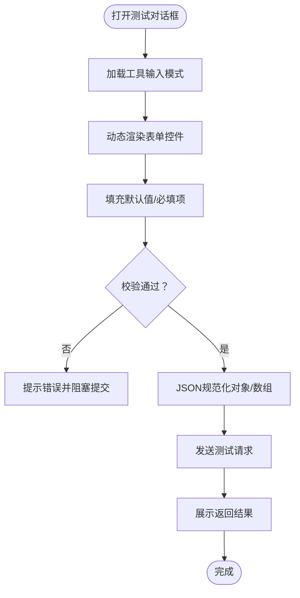
```mermaid
flowchart TD
Start(["打开测试对话框"]) --> LoadSchema["加载工具输入模式"]
LoadSchema --> RenderForm["动态渲染表单控件"]
RenderForm --> FillDefaults["填充默认值/必填项"]
FillDefaults --> Validate{"校验通过？"}
Validate --> |否| ShowErrors["提示错误并阻塞提交"]
Validate --> |是| Normalize["JSON规范化对象/数组"]
Normalize --> Send["发送测试请求"]
Send --> Response["展示返回结果"]
Response --> End(["完成"])
```

**图表来源**
- [测试用例管理.md:220-232](file://repowiki/zh/content/测试管理功能/测试用例管理.md#L220-L232)

**章节来源**
- [测试用例管理.md:213-238](file://repowiki/zh/content/测试管理功能/测试用例管理.md#L213-L238)

#### 权限控制机制
- JWT鉴权：所有受保护接口需携带有效令牌
- RBAC权限：基于Casbin的策略管理，删除API后需清理相关策略，防止越权访问
- 接口安全：Swagger注解标注了接口安全要求与参数约束

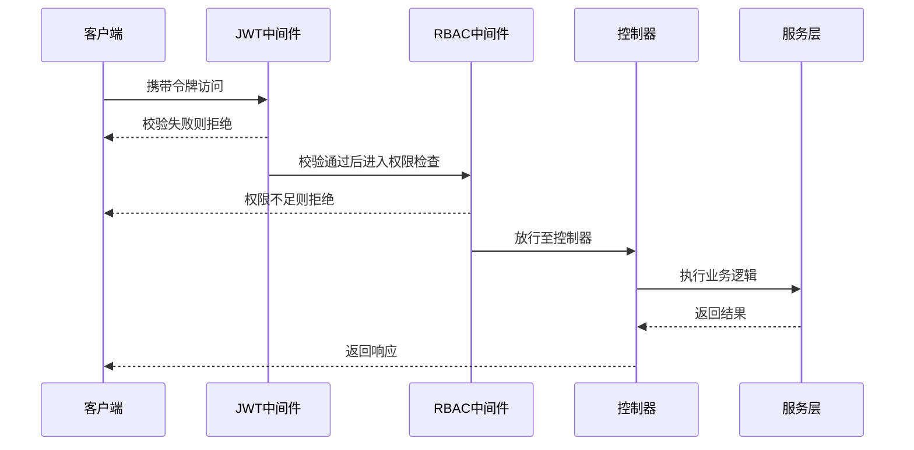
```mermaid
sequenceDiagram
participant Client as 客户端
participant JWT as JWT中间件
participant RBAC as RBAC中间件
participant Ctrl as 控制器
participant Svc as 服务层
Client->>JWT : 携带令牌访问
JWT-->>Client : 校验失败则拒绝
JWT->>RBAC : 校验通过后进入权限检查
RBAC-->>Client : 权限不足则拒绝
RBAC->>Ctrl : 放行至控制器
Ctrl->>Svc : 执行业务逻辑
Svc-->>Ctrl : 返回结果
Ctrl-->>Client : 返回响应
```

**图表来源**
- [测试用例管理.md:244-259](file://repowiki/zh/content/测试管理功能/测试用例管理.md#L244-L259)

**章节来源**
- [测试用例管理.md:239-271](file://repowiki/zh/content/测试管理功能/测试用例管理.md#L239-L271)

#### 测试用例的分类管理与状态跟踪
- 分类管理：SysApi的分组字段可用于区分不同测试场景（如接口测试、集成测试、回归测试等）
- 状态跟踪：可通过描述字段与自定义扩展字段记录测试状态（待执行、执行中、通过、失败、阻塞等），并在前端以标签或徽标形式展示
- 变更审计：利用创建/更新时间字段追踪测试用例生命周期

**章节来源**
- [测试用例管理.md:272-280](file://repowiki/zh/content/测试管理功能/测试用例管理.md#L272-L280)

#### API自动化与MCP集成
- API创建器：根据传入的API清单自动创建系统API记录，并返回创建结果统计
- 执行器：解析执行计划，校验参数完整性，执行测试流程并返回结果

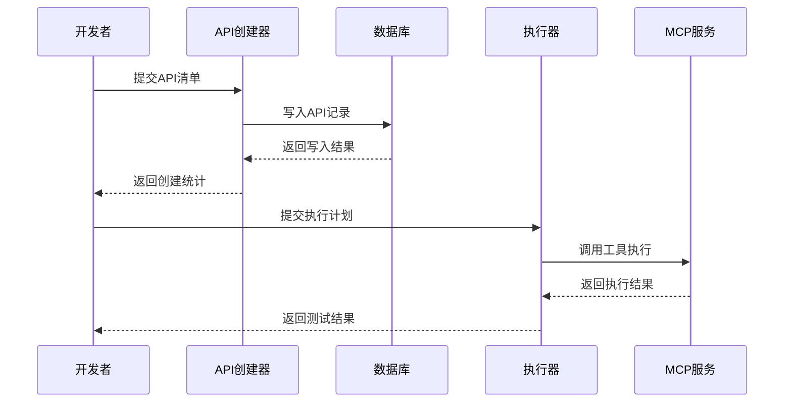
```mermaid
sequenceDiagram
participant Dev as 开发者
participant Creator as API创建器
participant DB as 数据库
participant Exec as 执行器
participant MCP as MCP服务
Dev->>Creator : 提交API清单
Creator->>DB : 写入API记录
DB-->>Creator : 返回写入结果
Creator-->>Dev : 返回创建统计
Dev->>Exec : 提交执行计划
Exec->>MCP : 调用工具执行
MCP-->>Exec : 返回执行结果
Exec-->>Dev : 返回测试结果
```

**图表来源**
- [测试用例管理.md:285-301](file://repowiki/zh/content/测试管理功能/测试用例管理.md#L285-L301)

**章节来源**
- [测试用例管理.md:281-309](file://repowiki/zh/content/测试管理功能/测试用例管理.md#L281-L309)

### 缺陷跟踪系统详细实现

#### 数据模型设计（缺陷字段）
缺陷数据模型围绕 SysError 进行扩展，建议的关键字段如下：
- 基础标识：ID、创建时间、更新时间
- 来源与描述：form（错误来源）、info（错误内容）
- 级别与状态：level（日志级别/缺陷级别）、status（处理状态）
- 解决方案：solution（解决方案）
- 关联信息：可扩展关联测试用例/测试执行/责任人等外键字段

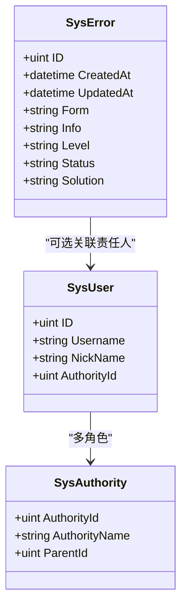
```mermaid
classDiagram
class SysError {
+uint ID
+datetime CreatedAt
+datetime UpdatedAt
+string Form
+string Info
+string Level
+string Status
+string Solution
}
class SysUser {
+uint ID
+string Username
+string NickName
+uint AuthorityId
}
class SysAuthority {
+uint AuthorityId
+string AuthorityName
+uint ParentId
}
SysError --> SysUser : "可选关联责任人"
SysUser --> SysAuthority : "多角色"
```

**图表来源**
- [缺陷跟踪系统.md:147-172](file://repowiki/zh/content/测试管理功能/缺陷跟踪系统.md#L147-L172)

**章节来源**
- [缺陷跟踪系统.md:139-183](file://repowiki/zh/content/测试管理功能/缺陷跟踪系统.md#L139-L183)

#### 生命周期管理（创建→分配→修复→关闭）
- 创建：前端提交缺陷信息，后端创建记录并入库。
- 分配：通过用户/角色模型与权限控制，将缺陷指派给责任人。
- 修复：支持手动更新状态与解决方案，或触发异步处理（如AI生成方案）。
- 关闭：当状态为"处理完成/处理失败"时，视为关闭。

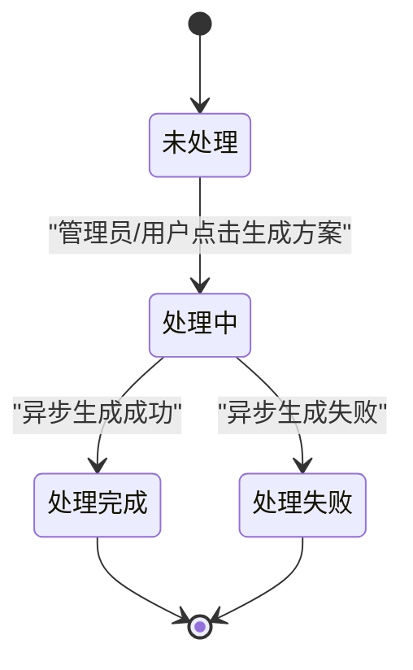
```mermaid
stateDiagram-v2
[*] --> 未处理
未处理 --> 处理中 : "管理员/用户点击生成方案"
处理中 --> 处理完成 : "异步生成成功"
处理中 --> 处理失败 : "异步生成失败"
处理完成 --> [*]
处理失败 --> [*]
```

**图表来源**
- [缺陷跟踪系统.md:190-199](file://repowiki/zh/content/测试管理功能/缺陷跟踪系统.md#L190-L199)

**章节来源**
- [缺陷跟踪系统.md:184-208](file://repowiki/zh/content/测试管理功能/缺陷跟踪系统.md#L184-L208)

#### 搜索、过滤与统计分析
- 搜索与过滤：支持按创建时间范围、来源、内容关键字等条件筛选。
- 分页：后端按页大小与页码返回列表与总数。
- 统计：可基于状态、级别等维度进行聚合统计（建议在 Service 层扩展统计接口）

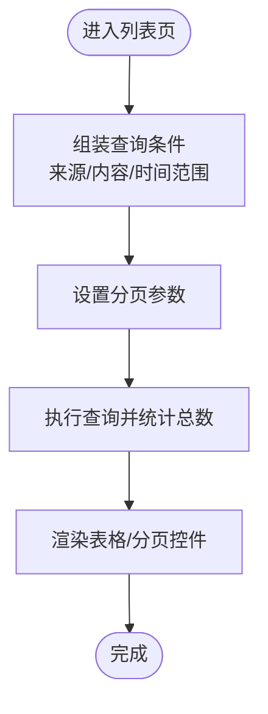
```mermaid
flowchart TD
Start(["进入列表页"]) --> BuildQuery["组装查询条件<br/>来源/内容/时间范围"]
BuildQuery --> PageLimit["设置分页参数"]
PageLimit --> ExecQuery["执行查询并统计总数"]
ExecQuery --> Render["渲染表格/分页控件"]
Render --> End(["完成"])
```

**图表来源**
- [缺陷跟踪系统.md:214-222](file://repowiki/zh/content/测试管理功能/缺陷跟踪系统.md#L214-L222)

**章节来源**
- [缺陷跟踪系统.md:209-230](file://repowiki/zh/content/测试管理功能/缺陷跟踪系统.md#L209-L230)

#### 权限控制机制（RBAC + API 权限）
- 角色与用户：SysAuthority 与 SysUser 定义角色与用户关系。
- 接口权限：CasbinHandler 中间件根据用户角色、请求路径与方法进行权限校验。
- API 权限管理：提供更新角色API权限与获取权限列表接口。

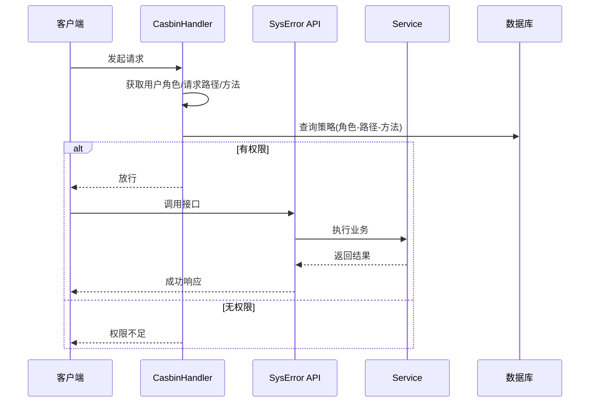
```mermaid
sequenceDiagram
participant C as 客户端
participant MW as CasbinHandler
participant API as SysError API
participant SVC as Service
participant DB as 数据库
C->>MW : 发起请求
MW->>MW : 获取用户角色/请求路径/方法
MW->>DB : 查询策略(角色-路径-方法)
alt 有权限
MW-->>C : 放行
C->>API : 调用接口
API->>SVC : 执行业务
SVC-->>API : 返回结果
API-->>C : 成功响应
else 无权限
MW-->>C : 权限不足
end
```

**图表来源**
- [缺陷跟踪系统.md:236-256](file://repowiki/zh/content/测试管理功能/缺陷跟踪系统.md#L236-L256)

**章节来源**
- [缺陷跟踪系统.md:231-270](file://repowiki/zh/content/测试管理功能/缺陷跟踪系统.md#L231-L270)

#### 缺陷与测试用例/测试执行的关联
- 当前模型 SysError 未直接包含测试用例/测试执行外键字段。建议在缺陷模型中新增关联字段（如 test_case_id、test_execution_id），并在 Service 层扩展查询与统计。
- 前端可在缺陷详情中展示关联的测试用例/执行信息，便于追溯问题根因。

**章节来源**
- [缺陷跟踪系统.md:271-277](file://repowiki/zh/content/测试管理功能/缺陷跟踪系统.md#L271-L277)

#### 报告生成、通知提醒与历史追踪
- 报告生成：可基于筛选条件导出 Excel 或生成 PDF 报告（建议在 Service 层扩展导出接口）。
- 通知提醒：邮件插件提供发送测试邮件与发送邮件能力，可用于缺陷状态变更通知。
- 历史追踪：前端提供详情抽屉展示错误内容与解决方案，便于回溯。

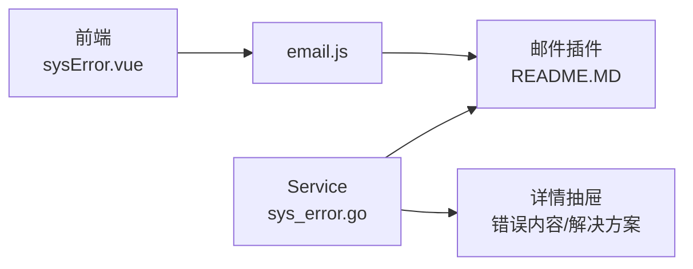
```mermaid
graph LR
SVC["Service<br/>sys_error.go"] --> EMAIL["邮件插件<br/>README.MD"]
FE["前端<br/>sysError.vue"] --> EMAIL_API["email.js"]
EMAIL_API --> EMAIL
SVC --> FE_DETAIL["详情抽屉<br/>错误内容/解决方案"]
```

**图表来源**
- [缺陷跟踪系统.md:283-290](file://repowiki/zh/content/测试管理功能/缺陷跟踪系统.md#L283-L290)

**章节来源**
- [缺陷跟踪系统.md:278-302](file://repowiki/zh/content/测试管理功能/缺陷跟踪系统.md#L278-L302)

#### 前端页面交互说明
- 列表页：支持重置、提交、分页、状态标签展示、详情抽屉。
- 筛选：按来源、内容关键字、时间范围等条件查询。
- 操作：单条删除、批量删除、生成方案（触发异步处理）。
- 详情：展示错误内容与解决方案，便于历史追踪。

**章节来源**
- [缺陷跟踪系统.md:303-311](file://repowiki/zh/content/测试管理功能/缺陷跟踪系统.md#L303-L311)

### 测试执行跟踪详细实现

#### 测试执行器组件
GVAExecutor组件是测试执行跟踪的核心执行单元，实现了完整的测试执行生命周期管理。

##### 类结构设计
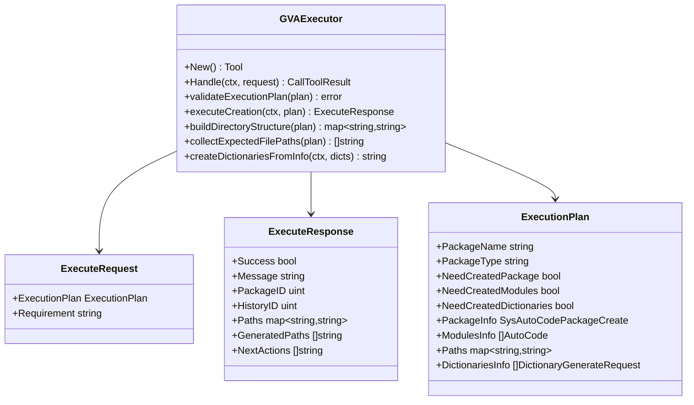
```mermaid
classDiagram
class GVAExecutor {
+New() Tool
+Handle(ctx, request) CallToolResult
+validateExecutionPlan(plan) error
+executeCreation(ctx, plan) ExecuteResponse
+buildDirectoryStructure(plan) map~string,string~
+collectExpectedFilePaths(plan) []string
+createDictionariesFromInfo(ctx, dicts) string
}
class ExecuteRequest {
+ExecutionPlan ExecutionPlan
+Requirement string
}
class ExecuteResponse {
+Success bool
+Message string
+PackageID uint
+HistoryID uint
+Paths map~string,string~
+GeneratedPaths []string
+NextActions []string
}
class ExecutionPlan {
+PackageName string
+PackageType string
+NeedCreatedPackage bool
+NeedCreatedModules bool
+NeedCreatedDictionaries bool
+PackageInfo SysAutoCodePackageCreate
+ModulesInfo []AutoCode
+Paths map~string,string~
+DictionariesInfo []DictionaryGenerateRequest
}
GVAExecutor --> ExecuteRequest
GVAExecutor --> ExecuteResponse
GVAExecutor --> ExecutionPlan
```

**图表来源**
- [测试执行跟踪.md:178-216](file://repowiki/zh/content/测试管理功能/测试执行跟踪.md#L178-L216)

**章节来源**
- [测试执行跟踪.md:172-251](file://repowiki/zh/content/测试管理功能/测试执行跟踪.md#L172-L251)

##### 执行流程分析
```mermaid
sequenceDiagram
participant User as 用户
participant Executor as GVAExecutor
participant Validator as 验证器
participant Creator as 创建器
participant Result as 结果处理器
User->>Executor : 调用Handle()
Executor->>Validator : validateExecutionPlan()
Validator-->>Executor : 验证结果
Executor->>Creator : executeCreation()
Creator->>Creator : buildDirectoryStructure()
Creator->>Creator : collectExpectedFilePaths()
Creator->>Creator : createAutoCodePackage()
Creator->>Creator : createDictionariesFromInfo()
Creator->>Creator : createAutoCodeModule()
Creator-->>Executor : ExecuteResponse
Executor->>Result : 序列化响应
Result-->>User : 返回执行结果
```

**图表来源**
- [测试执行跟踪.md:223-242](file://repowiki/zh/content/测试管理功能/测试执行跟踪.md#L223-L242)

**章节来源**
- [测试执行跟踪.md:221-247](file://repowiki/zh/content/测试管理功能/测试执行跟踪.md#L221-L247)

#### 断点续传组件
断点续传系统实现了大文件的安全传输机制，是测试执行跟踪的重要基础设施。

##### 前端实现分析
前端通过breakpoint.vue组件实现了完整的断点续传界面，包括文件选择、切片上传、进度跟踪等功能。

```mermaid
flowchart TD
A[用户选择文件] --> B[计算文件MD5]
B --> C[创建切片列表]
C --> D[查询已上传切片]
D --> E{是否秒传?}
E --> |是| F[直接完成上传]
E --> |否| G[过滤待上传切片]
G --> H[逐个上传切片]
H --> I[更新上传进度]
I --> J{是否全部上传?}
J --> |否| H
J --> |是| K[合并文件]
K --> L[清理临时切片]
L --> M[显示上传完成]
style F fill:#ccffcc
style M fill:#ccffcc
```

**图表来源**
- [测试执行跟踪.md:260-277](file://repowiki/zh/content/测试管理功能/测试执行跟踪.md#L260-L277)

**章节来源**
- [测试执行跟踪.md:252-316](file://repowiki/zh/content/测试管理功能/测试执行跟踪.md#L252-L316)

##### 后端处理流程
```mermaid
sequenceDiagram
participant Frontend as 前端
participant API as 断点续传API
participant Service as 服务层
participant Utils as 工具层
participant Storage as 文件存储
Frontend->>API : breakpointContinue()
API->>Service : FindOrCreateFile()
Service->>Utils : BreakPointContinue()
Utils->>Storage : 写入切片文件
Storage-->>Utils : 返回文件路径
Utils-->>Service : 返回切片路径
Service-->>API : 创建切片记录
API-->>Frontend : 返回成功
Frontend->>API : breakpointContinueFinish()
API->>Utils : MakeFile()
Utils->>Storage : 合并切片文件
Storage-->>Utils : 返回合并结果
Utils-->>API : 返回最终文件路径
API-->>Frontend : 返回文件路径
```

**图表来源**
- [测试执行跟踪.md:284-305](file://repowiki/zh/content/测试管理功能/测试执行跟踪.md#L284-L305)

**章节来源**
- [测试执行跟踪.md:282-311](file://repowiki/zh/content/测试管理功能/测试执行跟踪.md#L282-L311)

#### 测试状态管理组件
系统提供了完整的测试状态管理机制，支持测试执行过程中的实时状态跟踪和结果收集。

##### 状态跟踪机制
```mermaid
stateDiagram-v2
[*] --> 初始化
初始化 --> 准备中 : 创建执行计划
准备中 --> 执行中 : 开始执行
执行中 --> 成功 : 所有步骤完成
执行中 --> 失败 : 发生错误
执行中 --> 暂停 : 用户暂停
暂停 --> 执行中 : 继续执行
成功 --> 完成 : 结果收集
失败 --> 完成 : 错误记录
完成 --> [*]
state 执行中 {
[*] --> 验证计划
验证计划 --> 创建包
创建包 --> 创建字典
创建字典 --> 创建模块
创建模块 --> 生成结果
}
```

**图表来源**
- [测试执行跟踪.md:323-342](file://repowiki/zh/content/测试管理功能/测试执行跟踪.md#L323-L342)

**章节来源**
- [测试执行跟踪.md:317-354](file://repowiki/zh/content/测试管理功能/测试执行跟踪.md#L317-L354)