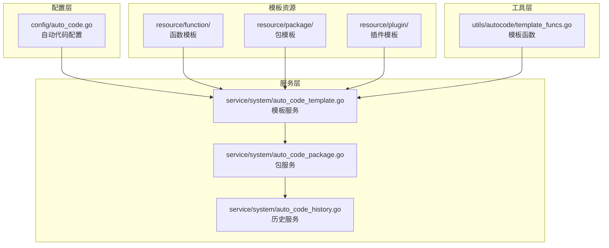
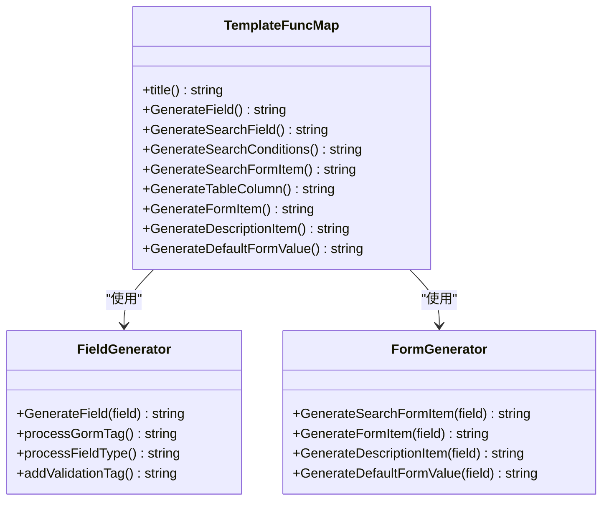
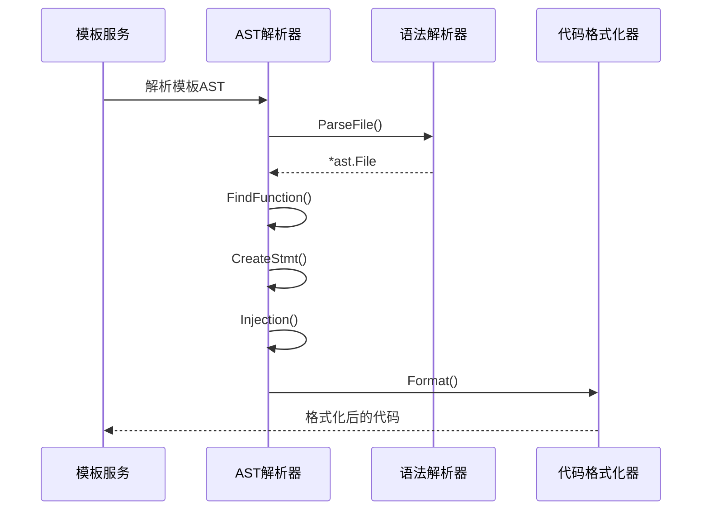
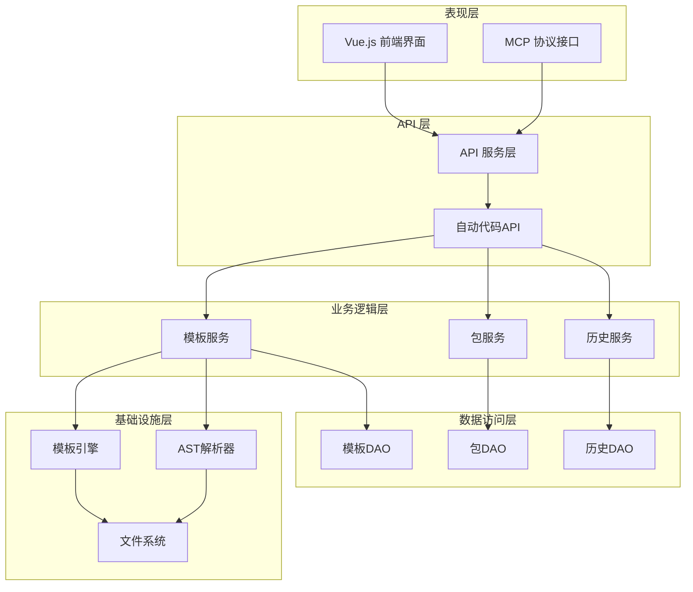
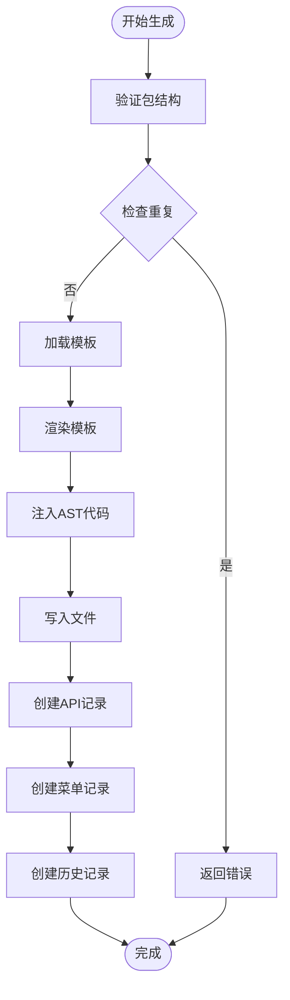
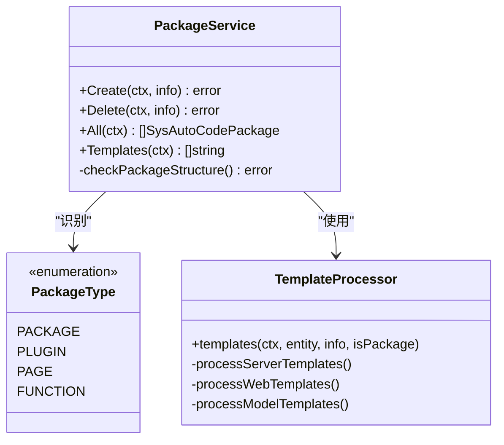
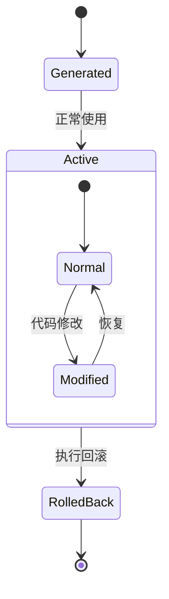
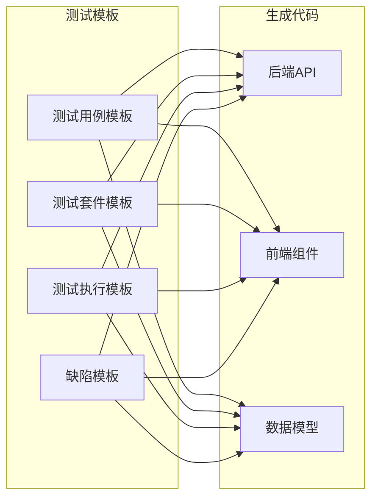
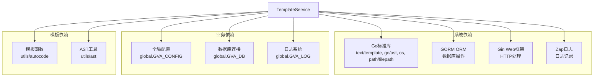
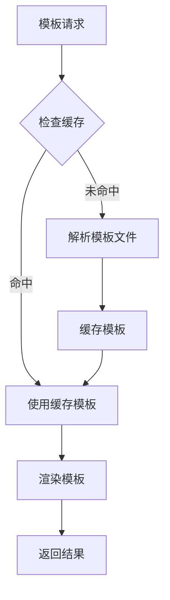

# 自动代码生成集成

<cite>
**本文档引用的文件**
- [auto_code_template.go](file://server/service/system/auto_code_template.go)
- [auto_code_template_test.go](file://server/service/system/auto_code_template_test.go)
- [auto_code_package.go](file://server/service/system/auto_code_package.go)
- [auto_code_history.go](file://server/service/system/auto_code_history.go)
- [template_funcs.go](file://server/utils/autocode/template_funcs.go)
- [api.go.tpl](file://server/resource/function/api.go.tpl)
- [server.go.tpl](file://server/resource/function/server.go.tpl)
- [api.js.tpl](file://server/resource/function/api.js.tpl)
- [auto_code.go](file://server/config/auto_code.go)
- [api.go.tpl](file://server/resource/package/server/api/api.go.tpl)
- [model.go.tpl](file://server/resource/package/server/model/model.go.tpl)
- [form.vue.tpl](file://server/resource/package/web/view/form.vue.tpl)
- [gen.go.tpl](file://server/resource/plugin/server/gen/gen.go.tpl)
- [测试管理功能.md](file://repowiki/zh/content/测试管理功能/测试管理功能.md)
</cite>

## 目录
1. [引言](#引言)
2. [项目结构](#项目结构)
3. [核心组件](#核心组件)
4. [架构概览](#架构概览)
5. [详细组件分析](#详细组件分析)
6. [依赖分析](#依赖分析)
7. [性能考虑](#性能考虑)
8. [故障排除指南](#故障排除指南)
9. [结论](#结论)
10. [附录](#附录)

## 引言

自动代码生成系统是 Gin-Vue-Admin 测试管理平台的核心基础设施，它通过模板引擎和 AST 解析技术实现了测试相关代码的自动化生成。该系统不仅能够生成标准的 CRUD 操作代码，还能为测试管理功能提供完整的代码骨架，包括测试用例管理、测试执行跟踪、缺陷管理等模块。

系统采用前后端分离架构，后端基于 Go 语言的 Gin 框架，前端使用 Vue.js 技术栈，通过 MCP（Model Context Protocol）协议实现智能测试工具的集成。自动代码生成系统为测试管理功能提供了强大的代码生成能力，大大提高了测试开发效率。

## 项目结构

自动代码生成系统主要分布在以下目录结构中：



**图表来源**
- [auto_code_template.go:1-454](file://server/service/system/auto_code_template.go#L1-L454)
- [auto_code_package.go:1-744](file://server/service/system/auto_code_package.go#L1-L744)
- [template_funcs.go:1-714](file://server/utils/autocode/template_funcs.go#L1-L714)

**章节来源**
- [auto_code_template.go:1-454](file://server/service/system/auto_code_template.go#L1-L454)
- [auto_code_package.go:1-744](file://server/service/system/auto_code_package.go#L1-L744)
- [auto_code.go:1-23](file://server/config/auto_code.go#L1-L23)

## 核心组件

### 模板引擎系统

自动代码生成系统的核心是其强大的模板引擎，基于 Go 语言的 text/template 包构建。系统提供了丰富的模板函数来处理测试相关的代码生成需求。

#### 模板函数映射

系统定义了完整的模板函数映射，包括字段生成、搜索条件、表单元素等核心功能：



**图表来源**
- [template_funcs.go:12-24](file://server/utils/autocode/template_funcs.go#L12-L24)
- [template_funcs.go:27-122](file://server/utils/autocode/template_funcs.go#L27-L122)
- [template_funcs.go:458-577](file://server/utils/autocode/template_funcs.go#L458-L577)

#### 字段生成器

字段生成器负责将数据库字段转换为 Go 结构体定义，支持多种数据类型和验证规则：

| 字段类型 | Go 类型 | GORM 标签 | 验证规则 |
|---------|---------|-----------|----------|
| string | string | size:length, comment:text | required |
| int | int8/int16/int32/int64 | size:length, primarykey | required |
| bool | bool | default:value, comment:text | - |
| time.Time | time.Time | type:datetime, comment:text | - |
| enum | string | type:enum(values) | - |
| json | datatypes.JSON | swaggertype:object | - |

**章节来源**
- [template_funcs.go:27-122](file://server/utils/autocode/template_funcs.go#L27-L122)
- [template_funcs.go:645-676](file://server/utils/autocode/template_funcs.go#L645-L676)

### AST 解析系统

系统使用 Go 语言的 go/ast 包来解析和修改现有代码结构，实现智能代码注入：



**图表来源**
- [auto_code_template.go:339-401](file://server/service/system/auto_code_template.go#L339-L401)
- [auto_code_package.go:304-743](file://server/service/system/auto_code_package.go#L304-L743)

**章节来源**
- [auto_code_template.go:339-401](file://server/service/system/auto_code_template.go#L339-L401)
- [auto_code_package.go:304-743](file://server/service/system/auto_code_package.go#L304-L743)

### 模板类型系统

系统支持多种模板类型，每种模板类型都有特定的生成规则和用途：

| 模板类型 | 用途 | 生成文件 | 特殊功能 |
|---------|------|----------|----------|
| package | 标准包模板 | server/api, server/service, web/view | 完整CRUD操作 |
| plugin | 插件模板 | plugin/*/api, plugin/*/service | 插件集成 |
| function | 函数模板 | resource/function/* | 单独函数生成 |
| model | 模型模板 | server/model/* | 数据模型定义 |
| web | 前端模板 | web/src/views/* | Vue组件生成 |

**章节来源**
- [auto_code_package.go:304-743](file://server/service/system/auto_code_package.go#L304-L743)
- [auto_code_template.go:29-55](file://server/service/system/auto_code_template.go#L29-L55)

## 架构概览

自动代码生成系统采用分层架构设计，确保了代码的可维护性和扩展性：



**图表来源**
- [auto_code_template.go:57-186](file://server/service/system/auto_code_template.go#L57-L186)
- [auto_code_package.go:27-105](file://server/service/system/auto_code_package.go#L27-L105)

系统的核心流程包括：用户请求 -> API 验证 -> 服务层处理 -> 模板引擎渲染 -> AST 解析 -> 文件生成 -> 历史记录。

**章节来源**
- [auto_code_template.go:57-186](file://server/service/system/auto_code_template.go#L57-L186)
- [auto_code_package.go:27-105](file://server/service/system/auto_code_package.go#L27-L105)

## 详细组件分析

### 模板服务组件

模板服务是整个自动代码生成系统的核心，负责协调各个组件完成代码生成任务。

#### 主要功能

1. **模板验证**：检查包结构的完整性
2. **代码生成**：基于模板和数据生成代码
3. **AST 注入**：智能注入代码到现有结构中
4. **历史管理**：记录生成历史便于回滚



**图表来源**
- [auto_code_template.go:57-186](file://server/service/system/auto_code_template.go#L57-L186)

**章节来源**
- [auto_code_template.go:57-186](file://server/service/system/auto_code_template.go#L57-L186)

### 包服务组件

包服务负责管理不同类型的代码包，包括标准包和服务包。

#### 包类型识别

系统能够自动识别和处理不同类型的包：



**图表来源**
- [auto_code_package.go:27-105](file://server/service/system/auto_code_package.go#L27-L105)
- [auto_code_package.go:304-743](file://server/service/system/auto_code_package.go#L304-L743)

**章节来源**
- [auto_code_package.go:27-105](file://server/service/system/auto_code_package.go#L27-L105)
- [auto_code_package.go:304-743](file://server/service/system/auto_code_package.go#L304-L743)

### 历史服务组件

历史服务负责跟踪和管理代码生成的历史记录，支持回滚操作。

#### 历史记录管理



**图表来源**
- [auto_code_history.go:61-182](file://server/service/system/auto_code_history.go#L61-L182)

**章节来源**
- [auto_code_history.go:61-182](file://server/service/system/auto_code_history.go#L61-L182)

### 模板函数系统

模板函数系统提供了丰富的函数来处理测试相关的代码生成需求。

#### 核心模板函数

| 函数名称 | 功能描述 | 输入参数 | 输出结果 |
|---------|----------|----------|----------|
| GenerateField | 生成字段定义 | AutoCodeField | Go字段定义 |
| GenerateSearchField | 生成搜索字段 | AutoCodeField | 搜索结构体字段 |
| GenerateSearchConditions | 生成搜索条件 | []AutoCodeField | 查询条件代码 |
| GenerateFormItem | 生成表单元素 | AutoCodeField | Vue表单组件 |
| GenerateTableColumn | 生成表格列 | AutoCodeField | Element表格列 |
| GenerateDescriptionItem | 生成详情项 | AutoCodeField | 详情描述项 |

**章节来源**
- [template_funcs.go:12-24](file://server/utils/autocode/template_funcs.go#L12-L24)
- [template_funcs.go:27-122](file://server/utils/autocode/template_funcs.go#L27-L122)
- [template_funcs.go:458-577](file://server/utils/autocode/template_funcs.go#L458-L577)

### 测试管理模板系统

针对测试管理功能，系统提供了专门的模板来生成测试相关的代码。

#### 测试模板类型



**图表来源**
- [api.go.tpl:26-261](file://server/resource/package/server/api/api.go.tpl#L26-L261)
- [model.go.tpl:25-76](file://server/resource/package/server/model/model.go.tpl#L25-L76)
- [form.vue.tpl:63-275](file://server/resource/package/web/view/form.vue.tpl#L63-L275)

**章节来源**
- [api.go.tpl:26-261](file://server/resource/package/server/api/api.go.tpl#L26-L261)
- [model.go.tpl:25-76](file://server/resource/package/server/model/model.go.tpl#L25-L76)
- [form.vue.tpl:63-275](file://server/resource/package/web/view/form.vue.tpl#L63-L275)

## 依赖分析

自动代码生成系统的依赖关系相对简单，主要依赖于 Go 标准库和第三方包。



**图表来源**
- [auto_code_template.go:3-23](file://server/service/system/auto_code_template.go#L3-L23)
- [auto_code_package.go:3-21](file://server/service/system/auto_code_package.go#L3-L21)

### 外部依赖

系统对外部依赖的管理遵循最小化原则：

| 依赖包 | 版本 | 用途 | 替代方案 |
|--------|------|------|----------|
| github.com/flipped-aurora/gin-vue-admin/server | 最新 | 核心框架 | - |
| gorm.io/gorm | 最新 | ORM 操作 | xorm |
| github.com/gin-gonic/gin | 最新 | Web 框架 | echo |
| go.uber.org/zap | 最新 | 日志记录 | logrus |

**章节来源**
- [auto_code_template.go:3-23](file://server/service/system/auto_code_template.go#L3-L23)
- [auto_code_package.go:3-21](file://server/service/system/auto_code_package.go#L3-L21)

## 性能考虑

自动代码生成系统在设计时充分考虑了性能优化：

### 模板缓存机制

系统实现了模板文件的缓存机制，避免重复解析模板文件：



### 并发处理

系统支持并发处理多个模板请求，通过 goroutine 和 channel 实现：

| 并发场景 | 处理方式 | 性能影响 |
|----------|----------|----------|
| 多模板同时生成 | 使用 goroutine | 提高吞吐量 |
| 大文件写入 | 使用缓冲写入 | 减少磁盘 I/O |
| AST 解析 | 使用内存解析 | 提高速度 |
| 数据库操作 | 使用事务 | 保证一致性 |

### 内存管理

系统采用流式处理减少内存占用：

- 模板渲染使用 strings.Builder
- AST 解析使用内存映射
- 文件写入使用缓冲区

## 故障排除指南

### 常见问题及解决方案

#### 模板解析错误

**问题症状**：模板解析失败，报错提示模板文件无效

**可能原因**：
1. 模板文件路径错误
2. 模板语法错误
3. 缺少必要的模板函数

**解决步骤**：
1. 检查模板文件路径是否正确
2. 验证模板语法格式
3. 确认模板函数映射完整

#### AST 注入失败

**问题症状**：代码注入成功但格式化失败

**可能原因**：
1. AST 解析错误
2. 代码格式化冲突
3. 文件权限问题

**解决步骤**：
1. 检查目标文件的 AST 结构
2. 验证注入代码的合法性
3. 确认文件写入权限

#### 文件生成失败

**问题症状**：模板渲染成功但文件写入失败

**可能原因**：
1. 目标目录权限不足
2. 磁盘空间不足
3. 文件名冲突

**解决步骤**：
1. 检查目标目录权限
2. 验证磁盘空间
3. 修改文件名避免冲突

**章节来源**
- [auto_code_template.go:228-236](file://server/service/system/auto_code_template.go#L228-L236)
- [auto_code_package.go:62-82](file://server/service/system/auto_code_package.go#L62-L82)

### 调试技巧

#### 启用调试模式

系统支持多种调试模式：

```go
// 启用详细日志
global.GVA_LOG.Debug("模板解析过程")

// 打印 AST 结构
fmt.Printf("AST结构: %+v\n", astFile)

// 检查文件权限
fileInfo, err := os.Stat(filePath)
```

#### 错误追踪

使用错误包装和追踪：

```go
err := errors.Wrapf(err, "[filepath:%s]读取模板文件失败!", key)
```

## 结论

自动代码生成系统为测试管理平台提供了强大的基础设施支持。通过模板引擎、AST 解析和智能注入技术，系统能够高效地生成高质量的测试相关代码。

### 系统优势

1. **高度自动化**：减少重复性代码编写工作
2. **模板灵活**：支持多种模板类型和自定义模板
3. **智能注入**：通过 AST 解析实现精准代码注入
4. **历史管理**：完善的代码生成历史追踪
5. **性能优化**：多层缓存和并发处理机制

### 扩展性考虑

系统具有良好的扩展性，支持：
- 新模板类型的添加
- 自定义模板函数的扩展
- 插件化架构的支持
- 多数据库后端的适配

### 未来发展方向

1. **AI 辅助代码生成**：集成 AI 模型提供智能代码建议
2. **实时协作**：支持多人实时协作代码生成
3. **代码质量检测**：集成静态代码分析工具
4. **测试自动化**：生成完整的测试用例和测试数据

## 附录

### 配置选项

系统支持多种配置选项：

| 配置项 | 类型 | 默认值 | 描述 |
|--------|------|--------|------|
| Root | string | 当前目录 | 代码生成根目录 |
| Server | string | server | 后端代码目录 |
| Web | string | web | 前端代码目录 |
| Module | string | module | Go 模块名称 |
| AiPath | string | ai-path | AI 工具路径 |

### 最佳实践

1. **模板维护**：定期更新模板以适应新的开发需求
2. **版本管理**：使用 Git 管理模板变更
3. **质量保证**：建立代码审查和测试流程
4. **性能监控**：监控代码生成的性能指标
5. **文档更新**：保持模板文档的及时更新

### 常用命令

```bash
# 生成测试用例代码
go run main.go --template=package --package=test-case

# 生成插件代码
go run main.go --template=plugin --package=my-plugin

# 预览生成结果
go run main.go --preview=true

# 清理生成的代码
go run main.go --cleanup=true
```