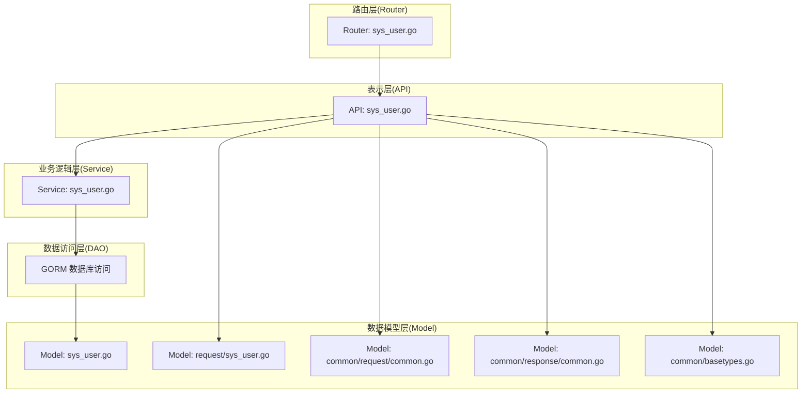
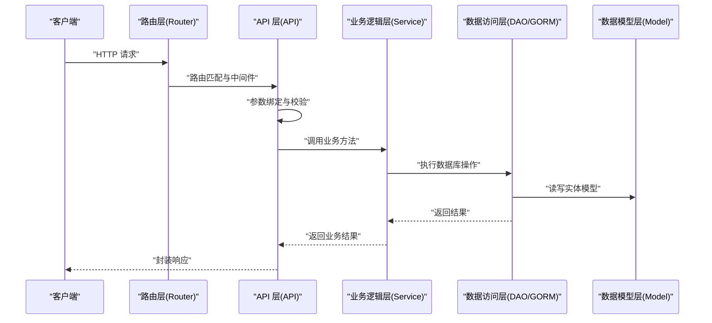
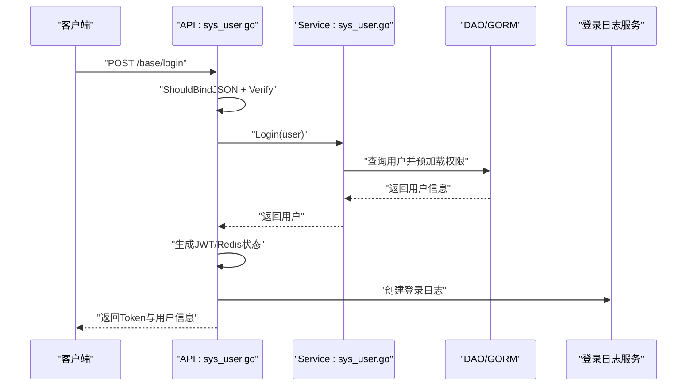
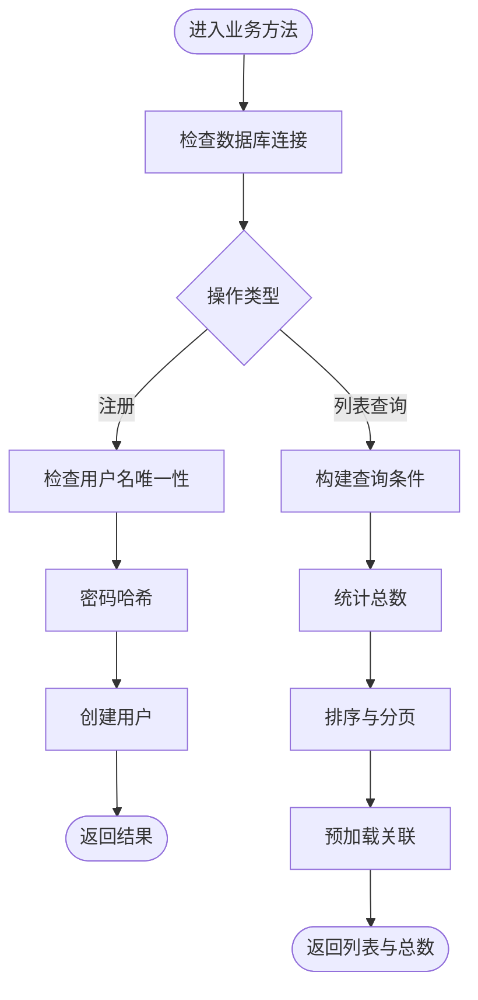
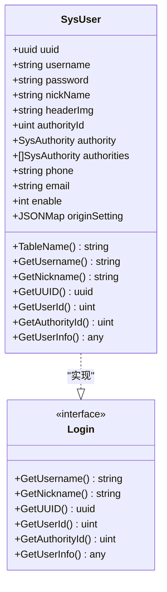
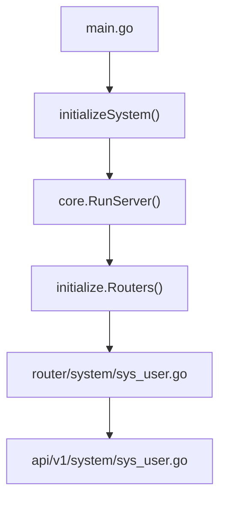
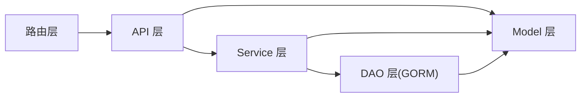

# 分层架构设计

<cite>
**本文引用的文件**
- [server/main.go](file://server/main.go)
- [server/core/server.go](file://server/core/server.go)
- [server/global/global.go](file://server/global/global.go)
- [server/api/v1/enter.go](file://server/api/v1/enter.go)
- [server/router/enter.go](file://server/router/enter.go)
- [server/router/system/sys_user.go](file://server/router/system/sys_user.go)
- [server/api/v1/system/sys_user.go](file://server/api/v1/system/sys_user.go)
- [server/service/enter.go](file://server/service/enter.go)
- [server/service/system/sys_user.go](file://server/service/system/sys_user.go)
- [server/model/system/sys_user.go](file://server/model/system/sys_user.go)
- [server/model/system/request/sys_user.go](file://server/model/system/request/sys_user.go)
- [server/model/common/request/common.go](file://server/model/common/request/common.go)
- [server/model/common/response/common.go](file://server/model/common/response/common.go)
- [server/model/common/basetypes.go](file://server/model/common/basetypes.go)
- [server/initialize/init.go](file://server/initialize/init.go)
</cite>

## 目录
1. [引言](#引言)
2. [项目结构](#项目结构)
3. [核心组件](#核心组件)
4. [架构总览](#架构总览)
5. [详细组件分析](#详细组件分析)
6. [依赖分析](#依赖分析)
7. [性能考量](#性能考量)
8. [故障排查指南](#故障排查指南)
9. [结论](#结论)
10. [附录](#附录)

## 引言
本设计文档围绕 Gin-Vue-Admin 的后端系统，系统化阐述其四层架构模式：表示层（API 层）、业务逻辑层（Service 层）、数据访问层（DAO 层）、数据模型层（Model 层）。文档旨在帮助开发者清晰理解各层职责与边界、层间依赖关系与调用流程，并提供典型请求处理流程图、接口设计规范与最佳实践，以提升代码复用、可测试性与可维护性。

## 项目结构
后端采用 Go 语言实现，遵循“按功能域分层”的组织方式：
- 表示层（API 层）：接收 HTTP 请求，负责参数绑定、校验与响应封装，位于 server/api/v1 下，按模块划分（如 system、example）。
- 路由层（Router 层）：在 server/router 下定义路由分组与路由注册，将 HTTP 请求映射到 API 层方法。
- 业务逻辑层（Service 层）：封装领域业务规则与流程编排，位于 server/service 下，同样按模块划分。
- 数据访问层（DAO 层）：封装数据读写细节，统一通过 GORM 访问数据库，位于 server/service/*/...（例如 server/service/system/sys_user.go）。
- 数据模型层（Model 层）：定义实体结构与字段映射，位于 server/model 下，包含系统模型与通用请求/响应模型。

图表来源
- [server/router/system/sys_user.go:1-29](file://server/router/system/sys_user.go#L1-L29)
- [server/api/v1/system/sys_user.go:1-517](file://server/api/v1/system/sys_user.go#L1-L517)
- [server/service/system/sys_user.go:1-337](file://server/service/system/sys_user.go#L1-L337)
- [server/model/system/sys_user.go:1-63](file://server/model/system/sys_user.go#L1-L63)
- [server/model/system/request/sys_user.go:1-78](file://server/model/system/request/sys_user.go#L1-L78)
- [server/model/common/request/common.go:1-49](file://server/model/common/request/common.go#L1-L49)
- [server/model/common/response/common.go:1-9](file://server/model/common/response/common.go#L1-L9)
- [server/model/common/basetypes.go:1-44](file://server/model/common/basetypes.go#L1-L44)

章节来源
- [server/main.go:30-52](file://server/main.go#L30-L52)
- [server/core/server.go:14-48](file://server/core/server.go#L14-L48)
- [server/global/global.go:25-42](file://server/global/global.go#L25-L42)
- [server/api/v1/enter.go:1-14](file://server/api/v1/enter.go#L1-L14)
- [server/router/enter.go:1-14](file://server/router/enter.go#L1-L14)
- [server/service/enter.go:1-14](file://server/service/enter.go#L1-L14)

## 核心组件
- 入口与初始化
  - main.go：程序入口，负责初始化系统组件并启动服务。
  - core/server.go：根据配置启动服务、加载路由与定时任务。
  - global/global.go：集中存放全局资源（数据库、Redis、Mongo、配置、日志等）。
- API 层
  - api/v1/enter.go：聚合 API 分组，便于路由层统一引用。
  - api/v1/system/sys_user.go：具体业务接口实现，负责参数绑定、校验、调用 Service 并封装响应。
- 路由层
  - router/enter.go：聚合路由分组。
  - router/system/sys_user.go：定义用户相关路由与中间件绑定。
- Service 层
  - service/enter.go：聚合 Service 分组。
  - service/system/sys_user.go：实现用户注册、登录、密码修改、列表查询、权限设置、删除、信息更新等业务逻辑。
- Model 层
  - model/system/sys_user.go：定义用户实体及接口约束。
  - model/system/request/sys_user.go：定义用户相关请求参数结构。
  - model/common/request/common.go：定义分页、ID 查询等通用请求结构。
  - model/common/response/common.go：定义分页响应结构。
  - model/common/basetypes.go：定义 JSONMap 等通用类型。

章节来源
- [server/main.go:30-52](file://server/main.go#L30-L52)
- [server/core/server.go:14-48](file://server/core/server.go#L14-L48)
- [server/global/global.go:25-42](file://server/global/global.go#L25-L42)
- [server/api/v1/system/sys_user.go:20-517](file://server/api/v1/system/sys_user.go#L20-L517)
- [server/router/system/sys_user.go:1-29](file://server/router/system/sys_user.go#L1-L29)
- [server/service/system/sys_user.go:24-337](file://server/service/system/sys_user.go#L24-L337)
- [server/model/system/sys_user.go:20-63](file://server/model/system/sys_user.go#L20-L63)
- [server/model/system/request/sys_user.go:8-78](file://server/model/system/request/sys_user.go#L8-L78)
- [server/model/common/request/common.go:7-49](file://server/model/common/request/common.go#L7-L49)
- [server/model/common/response/common.go:3-9](file://server/model/common/response/common.go#L3-L9)
- [server/model/common/basetypes.go:9-44](file://server/model/common/basetypes.go#L9-L44)

## 架构总览
下图展示了从客户端到数据库的典型请求处理路径，体现四层职责与调用方向：

图表来源
- [server/router/system/sys_user.go:10-28](file://server/router/system/sys_user.go#L10-L28)
- [server/api/v1/system/sys_user.go:27-161](file://server/api/v1/system/sys_user.go#L27-L161)
- [server/service/system/sys_user.go:28-61](file://server/service/system/sys_user.go#L28-L61)
- [server/model/system/sys_user.go:20-38](file://server/model/system/sys_user.go#L20-L38)

## 详细组件分析

### API 层（表示层）
- 职责
  - 接收 HTTP 请求，完成参数绑定与基础校验。
  - 调用 Service 层执行业务逻辑。
  - 统一封装响应，处理错误与日志记录。
- 关键实现
  - 登录流程：参数绑定 → 验证码/安全策略 → 调用 Service.Login → 生成 Token → 记录登录日志 → 返回响应。
  - 用户列表查询：参数绑定与分页校验 → 调用 Service.GetUserInfoList → 组装分页结果 → 返回响应。
- 边界
  - 不直接操作数据库；仅作为“门面”协调 Service 与响应封装。
  - 参数校验与错误处理集中在 API 层，保证对外接口的一致性。

图表来源
- [server/api/v1/system/sys_user.go:27-99](file://server/api/v1/system/sys_user.go#L27-L99)
- [server/service/system/sys_user.go:47-61](file://server/service/system/sys_user.go#L47-L61)

章节来源
- [server/api/v1/system/sys_user.go:20-517](file://server/api/v1/system/sys_user.go#L20-L517)

### 业务逻辑层（Service 层）
- 职责
  - 实现领域业务规则与流程编排。
  - 统一事务控制与跨模型协作。
  - 为 API 层提供稳定的业务能力。
- 关键实现
  - 用户注册：检查用户名唯一性 → 密码哈希 → 创建用户。
  - 登录：查询用户并预加载权限 → 校验密码 → 默认路由设置。
  - 列表查询：动态拼接条件 → 分页与排序 → 预加载关联 → 统计总数。
  - 权限设置：事务内删除旧关联 → 校验权限 → 批量写入新关联。
- 边界
  - 严格依赖全局数据库句柄；不关心 HTTP 协议与响应封装。
  - 通过接口或结构体暴露方法，供 API 层调用。

图表来源
- [server/service/system/sys_user.go:28-132](file://server/service/system/sys_user.go#L28-L132)

章节来源
- [server/service/system/sys_user.go:24-337](file://server/service/system/sys_user.go#L24-L337)

### 数据访问层（DAO 层）
- 职责
  - 封装数据库访问细节，屏蔽 GORM 使用差异。
  - 提供稳定的数据读写接口给 Service 层。
- 关键实现
  - 使用全局 GORM 连接执行 CRUD 操作。
  - 在复杂场景中使用事务包裹，确保一致性。
- 边界
  - 仅面向 Service 层暴露方法，不感知上层业务语义。

章节来源
- [server/service/system/sys_user.go:47-61](file://server/service/system/sys_user.go#L47-L61)
- [server/service/system/sys_user.go:189-222](file://server/service/system/sys_user.go#L189-L222)

### 数据模型层（Model 层）
- 职责
  - 定义实体结构、字段映射与约束。
  - 提供通用请求/响应模型与基础类型。
- 关键实现
  - 用户实体：包含 UUID、用户名、密码、角色、多角色关联、联系方式、状态与配置等字段。
  - 请求模型：登录、注册、修改密码、重置密码、设置权限、列表查询等。
  - 通用模型：分页输入、ID 输入、分页输出、JSONMap 等。
- 边界
  - 与数据库表结构一一对应；通过 GORM 注解声明映射关系。

图表来源
- [server/model/system/sys_user.go:20-63](file://server/model/system/sys_user.go#L20-L63)

章节来源
- [server/model/system/sys_user.go:20-63](file://server/model/system/sys_user.go#L20-L63)
- [server/model/system/request/sys_user.go:8-78](file://server/model/system/request/sys_user.go#L8-L78)
- [server/model/common/request/common.go:7-49](file://server/model/common/request/common.go#L7-L49)
- [server/model/common/response/common.go:3-9](file://server/model/common/response/common.go#L3-L9)
- [server/model/common/basetypes.go:9-44](file://server/model/common/basetypes.go#L9-L44)

### 路由层与入口
- 路由层
  - 路由分组与中间件绑定，将 HTTP 方法与路径映射到 API 层方法。
- 入口与初始化
  - main.go：初始化配置、日志、数据库、定时任务、全局函数等，随后启动服务。
  - core/server.go：根据配置决定是否启用 Redis/Mongo，加载系统资源并启动 HTTP 服务。
  - global/global.go：集中管理全局资源，提供按名称获取数据库/Redis 的工具方法。

图表来源
- [server/main.go:30-52](file://server/main.go#L30-L52)
- [server/core/server.go:14-48](file://server/core/server.go#L14-L48)
- [server/router/system/sys_user.go:10-28](file://server/router/system/sys_user.go#L10-L28)

章节来源
- [server/router/system/sys_user.go:1-29](file://server/router/system/sys_user.go#L1-L29)
- [server/main.go:30-52](file://server/main.go#L30-L52)
- [server/core/server.go:14-48](file://server/core/server.go#L14-L48)
- [server/global/global.go:25-42](file://server/global/global.go#L25-L42)
- [server/initialize/init.go:9-16](file://server/initialize/init.go#L9-L16)

## 依赖分析
- 层间依赖
  - 路由层 → API 层：路由将请求转发至 API 方法。
  - API 层 → Service 层：API 调用 Service 执行业务逻辑。
  - Service 层 → DAO 层：Service 通过 GORM 访问数据库。
  - API/Service 层 → Model 层：读写实体模型与通用请求/响应模型。
- 耦合与内聚
  - API 层与 Service 层通过方法签名耦合，保持高内聚、低耦合。
  - Model 层与 DAO 层通过 GORM 解耦，便于替换数据源。
- 循环依赖
  - 当前结构未见循环依赖；若新增模块需遵循“只允许上层依赖下层”的原则。

图表来源
- [server/router/system/sys_user.go:10-28](file://server/router/system/sys_user.go#L10-L28)
- [server/api/v1/system/sys_user.go:27-161](file://server/api/v1/system/sys_user.go#L27-L161)
- [server/service/system/sys_user.go:28-61](file://server/service/system/sys_user.go#L28-L61)
- [server/model/system/sys_user.go:20-38](file://server/model/system/sys_user.go#L20-L38)

章节来源
- [server/api/v1/system/sys_user.go:20-517](file://server/api/v1/system/sys_user.go#L20-L517)
- [server/service/system/sys_user.go:24-337](file://server/service/system/sys_user.go#L24-L337)

## 性能考量
- 分页与排序
  - 使用通用分页模型限制每页最大条数，避免大偏移导致的性能问题。
- 预加载与 N+1
  - 在查询用户列表时对关联角色进行预加载，减少后续多次查询。
- 缓存与并发
  - 使用全局缓存记录验证码尝试次数，降低数据库压力。
- 事务与一致性
  - 在批量设置权限等场景使用事务，确保原子性与一致性。
- 日志与监控
  - 在关键路径记录日志，便于定位性能瓶颈与异常。

章节来源
- [server/model/common/request/common.go:14-28](file://server/model/common/request/common.go#L14-L28)
- [server/service/system/sys_user.go:130-132](file://server/service/system/sys_user.go#L130-L132)
- [server/api/v1/system/sys_user.go:44-63](file://server/api/v1/system/sys_user.go#L44-L63)

## 故障排查指南
- 常见问题
  - 登录失败：检查用户名是否存在、密码是否正确、用户是否被禁用、验证码是否正确。
  - 权限设置失败：确认目标角色是否存在、默认路由是否可用、调用者是否有权限。
  - 列表查询异常：检查分页参数、排序字段合法性与查询条件。
- 排查步骤
  - 查看 API 层日志与错误返回。
  - 追踪 Service 层数据库操作与事务执行情况。
  - 核对 Model 层字段映射与约束。
- 建议
  - 在 API 层统一捕获错误并返回明确提示。
  - 在 Service 层对关键操作增加日志埋点。

章节来源
- [server/api/v1/system/sys_user.go:65-99](file://server/api/v1/system/sys_user.go#L65-L99)
- [server/service/system/sys_user.go:140-181](file://server/service/system/sys_user.go#L140-L181)
- [server/service/system/sys_user.go:89-132](file://server/service/system/sys_user.go#L89-L132)

## 结论
通过四层架构，Gin-Vue-Admin 实现了职责清晰、边界明确、易于扩展与维护的后端系统。API 层专注协议与响应，Service 层承载业务规则，DAO 层隔离数据访问，Model 层定义数据契约。配合统一的参数与响应模型、事务与日志机制，整体具备良好的可测试性与可演进性。

## 附录

### 层间接口设计规范与最佳实践
- API 层
  - 参数绑定与基础校验必须在 API 层完成，确保 Service 层接收干净数据。
  - 统一响应封装，避免在 Service 层处理响应细节。
- Service 层
  - 以方法为单位暴露业务能力，避免跨模块直接依赖。
  - 复杂流程使用事务包裹，保证一致性。
- DAO 层
  - 仅面向 Service 层暴露方法，隐藏 GORM 使用细节。
  - 对高频查询建立索引，优化分页与过滤性能。
- Model 层
  - 字段命名与注释规范化，确保与数据库一致。
  - 使用通用请求/响应模型，减少重复定义。