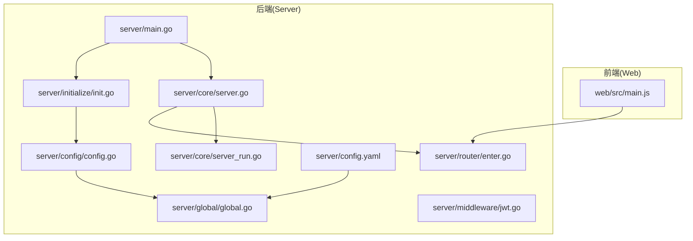
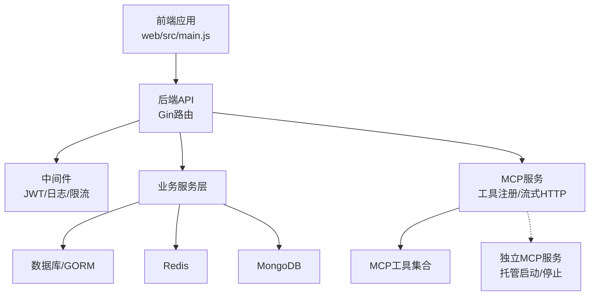
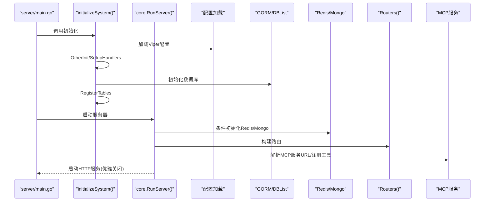
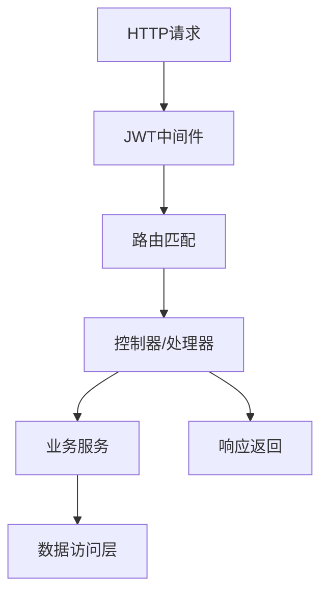
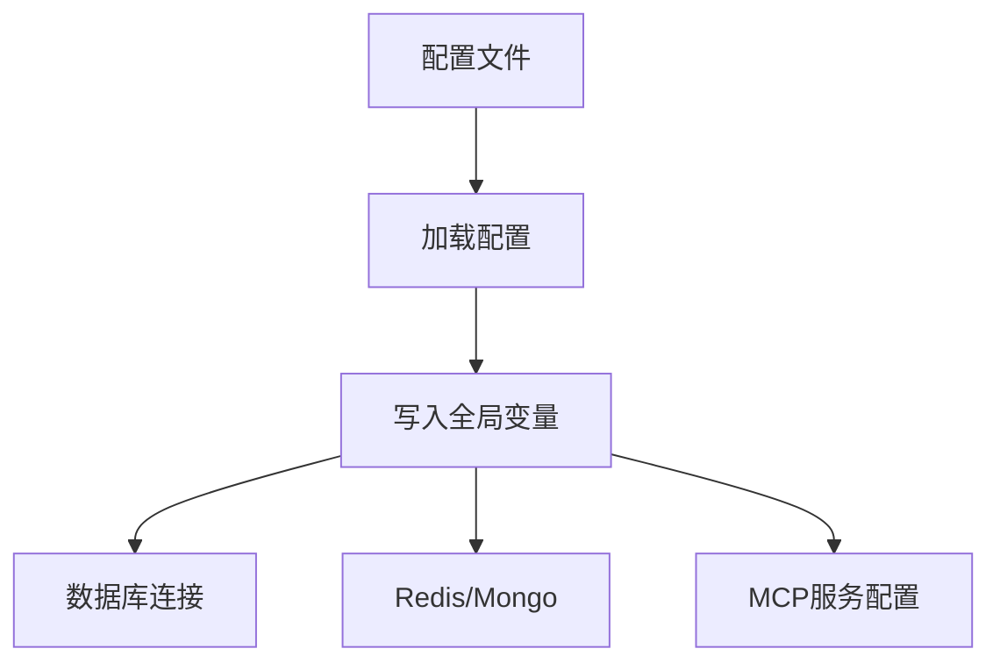
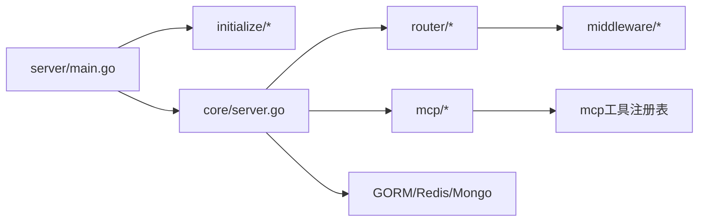
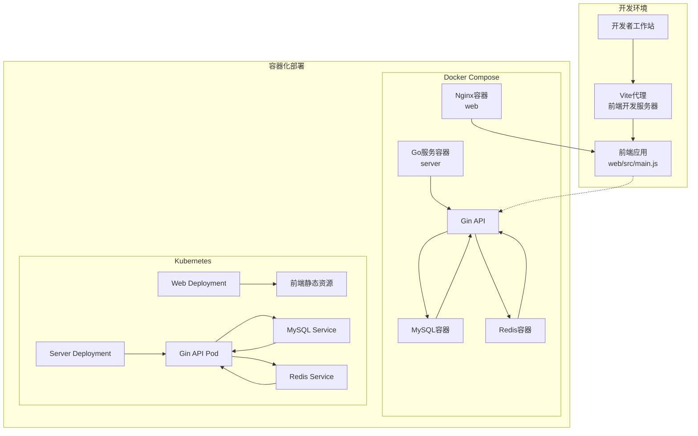

# 整体架构设计

<cite>
**本文档引用的文件**
- [README.md](file://README.md)
- [server/main.go](file://server/main.go)
- [server/core/server.go](file://server/core/server.go)
- [server/core/server_run.go](file://server/core/server_run.go)
- [server/config/config.go](file://server/config/config.go)
- [server/config.yaml](file://server/config.yaml)
- [server/global/global.go](file://server/global/global.go)
- [server/initialize/init.go](file://server/initialize/init.go)
- [server/router/enter.go](file://server/router/enter.go)
- [server/middleware/jwt.go](file://server/middleware/jwt.go)
- [web/src/main.js](file://web/src/main.js)
- [web/vite.config.js](file://web/vite.config.js)
- [deploy/docker-compose/docker-compose.yaml](file://deploy/docker-compose/docker-compose.yaml)
- [deploy/kubernetes/server/gva-server-deployment.yaml](file://deploy/kubernetes/server/gva-server-deployment.yaml)
- [repowiki/zh/content/系统架构/整体架构设计.md](file://repowiki/zh/content/系统架构/整体架构设计.md)
</cite>

## 目录
1. [引言](#引言)
2. [项目结构](#项目结构)
3. [核心组件](#核心组件)
4. [架构总览](#架构总览)
5. [详细组件分析](#详细组件分析)
6. [依赖关系分析](#依赖关系分析)
7. [性能考虑](#性能考虑)
8. [故障排查指南](#故障排查指南)
9. [结论](#结论)
10. [附录](#附录)

## 引言
本文件面向测试管理平台的整体架构设计，重点阐述以下内容：
- 前后端分离的 MVC 架构与分层设计原则
- 组件间的交互关系与数据流向
- MCP（Model Context Protocol）插件架构的设计理念与实现方式
- 系统启动流程：从 main 函数到各初始化模块的调用顺序
- 系统架构图与组件关系图，帮助开发者快速理解系统设计与扩展点

## 项目结构
系统采用典型的前后端分离架构：
- 后端基于 Go 语言，使用 Gin 框架作为 Web 服务器，提供 REST API 与 MCP 插件服务
- 前端基于 Vue 3 + Vite，通过 Element Plus 构建界面，使用 Pinia 状态管理
- 配置中心统一管理数据库、缓存、日志、MCP 等多类配置
- 初始化模块负责按序装配数据库、缓存、定时任务、路由等基础设施
- MCP 插件体系通过工具注册表与流式 HTTP 服务实现插件化能力

图表来源
- [server/main.go:30-52](file://server/main.go#L30-L52)
- [server/core/server.go:14-48](file://server/core/server.go#L14-L48)
- [server/core/server_run.go:21-61](file://server/core/server_run.go#L21-L61)
- [server/config/config.go:3-40](file://server/config/config.go#L3-L40)
- [server/config.yaml:1-284](file://server/config.yaml#L1-L284)
- [server/global/global.go:25-42](file://server/global/global.go#L25-L42)
- [server/initialize/init.go:9-16](file://server/initialize/init.go#L9-L16)
- [server/router/enter.go:1-14](file://server/router/enter.go#L1-L14)
- [server/middleware/jwt.go:16-90](file://server/middleware/jwt.go#L16-L90)
- [web/src/main.js:1-38](file://web/src/main.js#L1-L38)

章节来源
- [server/main.go:30-52](file://server/main.go#L30-L52)
- [web/src/main.js:1-38](file://web/src/main.js#L1-L38)

## 核心组件
- 全局配置与环境
  - 配置模型集中定义在配置模块，涵盖系统、JWT、Redis、Mongo、MCP 等关键配置项
  - 全局变量集中保存数据库、缓存、日志、定时器、MCP 服务实例等
- 初始化与装配
  - main 中调用初始化函数，完成 Viper、zap 日志、GORM 数据库、定时任务、表结构注册等
  - 核心服务器启动前根据配置决定是否启用 Redis/Mongo，并加载系统资源
- 路由与中间件
  - 路由按功能分组组织，中间件提供 JWT 鉴权、跨域、限流、日志等横切能力
- MCP 插件体系
  - 工具接口抽象与注册表，统一注册工具并注入到 MCP 服务
  - 支持独立运行的 MCP 服务，提供健康检查、托管启动/停止、二进制构建与运行时目录管理

章节来源
- [server/config/config.go:3-40](file://server/config/config.go#L3-L40)
- [server/config.yaml:1-284](file://server/config.yaml#L1-L284)
- [server/global/global.go:25-42](file://server/global/global.go#L25-L42)
- [server/initialize/init.go:9-16](file://server/initialize/init.go#L9-L16)
- [server/middleware/jwt.go:16-90](file://server/middleware/jwt.go#L16-L90)

## 架构总览
系统采用"前后端分离 + 插件化"的整体架构：
- 前端通过 HTTP 请求与后端交互，后端提供 REST API 与 Swagger 文档
- 后端基于 Gin 路由与中间件实现请求处理链，支持 JWT 鉴权与 RBAC
- MCP 插件通过独立服务或内嵌服务运行，提供工具注册、上下文传递与流式通信
- 配置驱动一切：系统行为由配置文件控制，便于多环境部署与扩展

图表来源
- [web/src/main.js:10-19](file://web/src/main.js#L10-L19)
- [server/core/server.go:14-48](file://server/core/server.go#L14-L48)

## 详细组件分析

### 启动流程与初始化顺序
系统启动遵循严格的初始化顺序，确保依赖按序装配与可用性保障。

图表来源
- [server/main.go:30-52](file://server/main.go#L30-L52)
- [server/core/server.go:14-48](file://server/core/server.go#L14-L48)
- [server/core/server_run.go:21-61](file://server/core/server_run.go#L21-L61)
- [server/initialize/init.go:9-16](file://server/initialize/init.go#L9-L16)

章节来源
- [server/main.go:30-52](file://server/main.go#L30-L52)
- [server/core/server.go:14-48](file://server/core/server.go#L14-L48)
- [server/core/server_run.go:21-61](file://server/core/server_run.go#L21-L61)
- [server/initialize/init.go:9-16](file://server/initialize/init.go#L9-L16)

### 路由与中间件
- 路由分组：系统路由与示例路由分别组织，统一入口聚合
- 中间件链：JWT 鉴权负责令牌校验与续签；日志、跨域、限流等中间件提供横切能力
- 业务服务：系统服务按模块划分，提供 API、字典、菜单、用户、权限等功能

图表来源
- [server/router/enter.go:1-14](file://server/router/enter.go#L1-L14)
- [server/middleware/jwt.go:16-90](file://server/middleware/jwt.go#L16-L90)

章节来源
- [server/router/enter.go:1-14](file://server/router/enter.go#L1-L14)
- [server/middleware/jwt.go:16-90](file://server/middleware/jwt.go#L16-L90)

### 配置与全局状态
- 配置模型：集中定义系统、数据库、缓存、MCP 等配置字段
- 全局状态：集中保存数据库、缓存、日志、定时器、MCP 服务实例等
- 配置文件：YAML 格式，支持多环境配置与热更新

图表来源
- [server/config/config.go:3-40](file://server/config/config.go#L3-L40)
- [server/config.yaml:1-284](file://server/config.yaml#L1-L284)
- [server/global/global.go:25-42](file://server/global/global.go#L25-L42)

章节来源
- [server/config/config.go:3-40](file://server/config/config.go#L3-L40)
- [server/config.yaml:1-284](file://server/config.yaml#L1-L284)
- [server/global/global.go:25-42](file://server/global/global.go#L25-L42)

## 依赖关系分析
- 组件耦合
  - main 仅负责初始化与启动，不直接参与业务逻辑，耦合度低
  - core.RunServer 依赖全局配置与初始化结果，形成弱耦合
  - MCP 服务与工具注册表解耦，工具实现可独立演进
- 外部依赖
  - Gin 提供 HTTP 路由与中间件
  - GORM 提供 ORM 能力
  - Redis/Mongo 提供缓存与文档存储
  - mcp-go 提供 MCP 协议与服务框架
- 循环依赖
  - 通过全局变量与延迟初始化避免循环导入

图表来源
- [server/main.go:30-52](file://server/main.go#L30-L52)
- [server/core/server.go:14-48](file://server/core/server.go#L14-L48)
- [server/router/enter.go:1-14](file://server/router/enter.go#L1-L14)
- [server/middleware/jwt.go:16-90](file://server/middleware/jwt.go#L16-L90)

章节来源
- [server/main.go:30-52](file://server/main.go#L30-L52)
- [server/core/server.go:14-48](file://server/core/server.go#L14-L48)
- [server/router/enter.go:1-14](file://server/router/enter.go#L1-L14)
- [server/middleware/jwt.go:16-90](file://server/middleware/jwt.go#L16-L90)

## 性能考虑
- 服务器优雅关闭：通过信号量与超时控制，确保请求处理完成后再关闭
- 中间件链路：JWT 鉴权与日志中间件应尽量轻量，避免阻塞主处理链
- 缓存与数据库：合理使用 Redis 缓存热点数据，数据库连接池与索引优化
- MCP 流式处理：利用流式 HTTP 降低延迟，减少不必要的序列化开销
- 配置热更新：通过 Viper 动态加载配置，结合事件系统触发重载

## 故障排查指南
- 启动失败
  - 检查配置文件路径与字段是否正确
  - 查看日志输出定位具体错误
- 数据库连接问题
  - 确认数据库连通性与凭据
  - 检查表结构初始化是否成功
- MCP 服务异常
  - 使用健康检查端点判断服务状态
  - 查看托管进程日志与元数据文件
  - 确认独立服务二进制构建与运行时目录权限
- JWT 鉴权失败
  - 检查请求头中的认证字段与值
  - 核对令牌有效期与黑名单状态

章节来源
- [server/core/server_run.go:21-61](file://server/core/server_run.go#L21-L61)
- [server/middleware/jwt.go:16-90](file://server/middleware/jwt.go#L16-L90)

## 结论
本架构以"前后端分离 + 插件化"为核心，通过清晰的分层与配置驱动，实现了高内聚、低耦合的系统设计。MCP 插件体系提供了强大的扩展能力，配合独立服务与托管管理，满足测试管理平台在工具生态与运行时管理上的多样化需求。建议在后续迭代中持续完善工具注册与生命周期管理，优化中间件链路与缓存策略，提升系统整体性能与可观测性。

## 附录

### 技术栈选择与优势
- Go 语言的并发特性
  - goroutine 轻量级线程，适合高并发场景
  - channel 实现安全的并发通信
  - 内存管理高效，GC 压力小
- Vue.js 的组件化开发
  - 组件化架构，提高代码复用性
  - 响应式数据绑定，简化视图更新
  - 生态系统丰富，开发效率高
- Gin 框架
  - 高性能 HTTP 框架
  - 中间件生态完善
  - 路由设计简洁
- Element Plus
  - 企业级 UI 组件库
  - 主题定制灵活
  - 国际化支持好

### 部署拓扑图

图表来源
- [deploy/docker-compose/docker-compose.yaml:1-91](file://deploy/docker-compose/docker-compose.yaml#L1-L91)
- [deploy/kubernetes/server/gva-server-deployment.yaml:1-74](file://deploy/kubernetes/server/gva-server-deployment.yaml#L1-L74)
- [web/vite.config.js:57-79](file://web/vite.config.js#L57-L79)

### 架构演进历程
- 早期版本：基础的前后端分离架构
- v2.x 版本：引入 MCP 插件体系，增强扩展能力
- v3.x 版本：完善配置管理与多环境支持
- 未来方向：微服务化改造、容器化部署、监控告警完善

### 最佳实践
- 遵循单一职责原则，保持模块边界清晰
- 使用中间件实现横切关注点
- 合理使用缓存，避免过度依赖
- 建立完善的日志与监控体系
- 持续集成与自动化部署