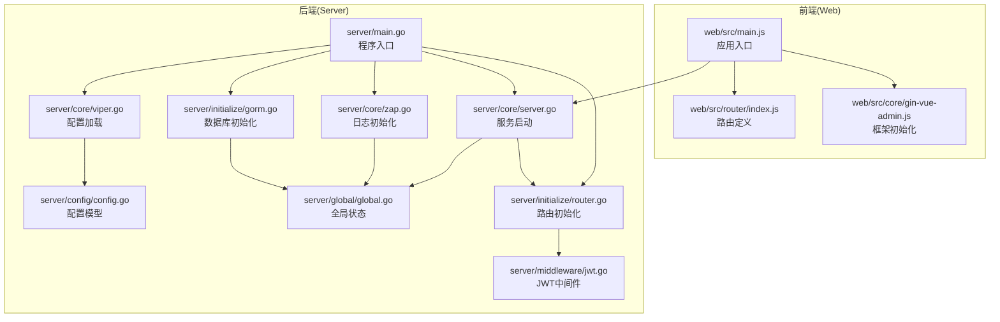
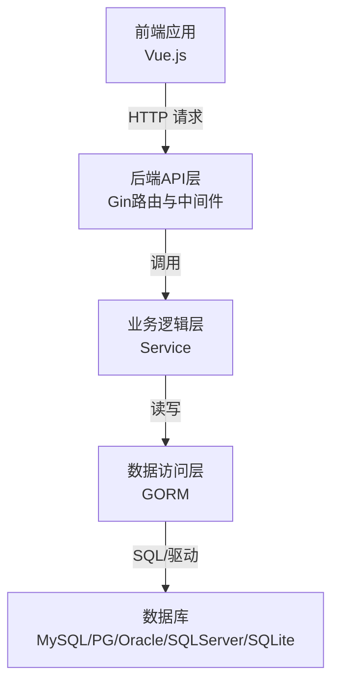
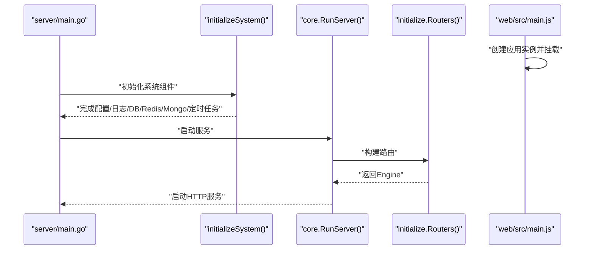
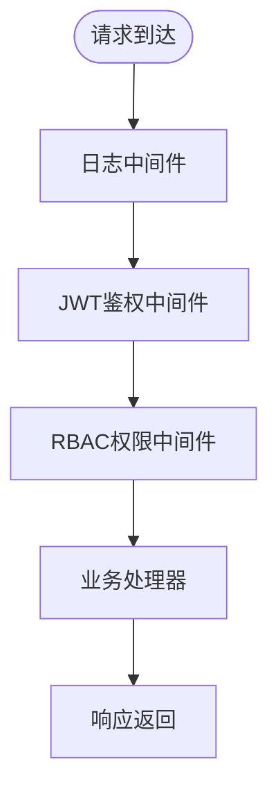
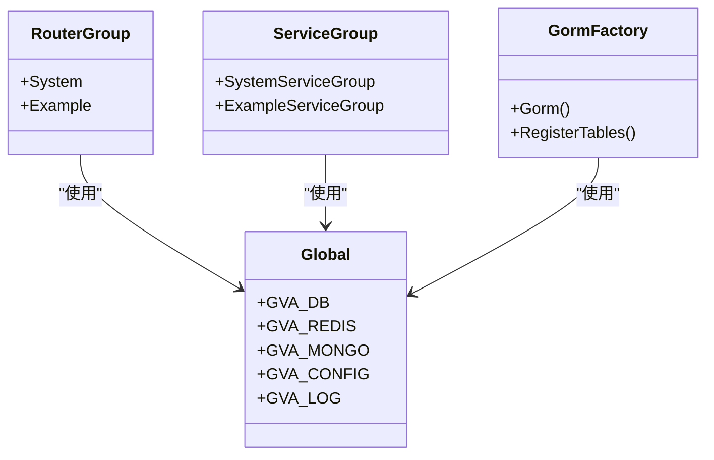
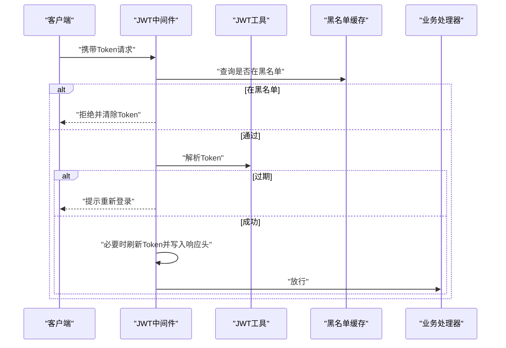
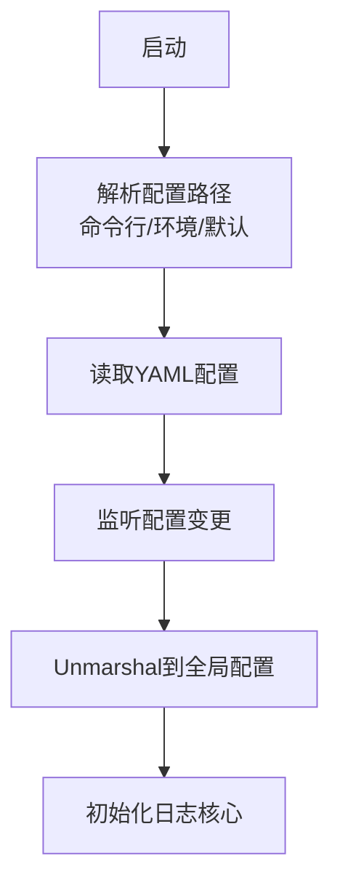
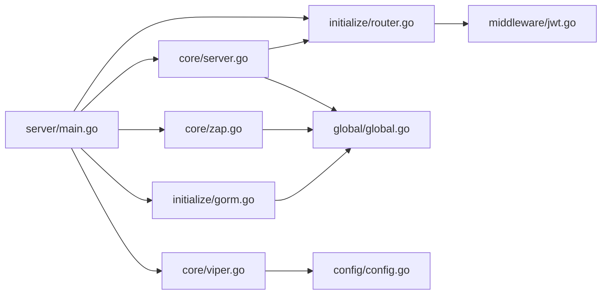

# 系统架构设计

<cite>
**本文引用的文件**
- [server/main.go](file://server/main.go)
- [server/core/server.go](file://server/core/server.go)
- [server/core/viper.go](file://server/core/viper.go)
- [server/core/zap.go](file://server/core/zap.go)
- [server/global/global.go](file://server/global/global.go)
- [server/config/config.go](file://server/config/config.go)
- [server/initialize/router.go](file://server/initialize/router.go)
- [server/initialize/gorm.go](file://server/initialize/gorm.go)
- [server/initialize/init.go](file://server/initialize/init.go)
- [server/router/enter.go](file://server/router/enter.go)
- [server/service/enter.go](file://server/service/enter.go)
- [server/middleware/jwt.go](file://server/middleware/jwt.go)
- [web/src/main.js](file://web/src/main.js)
- [web/src/core/gin-vue-admin.js](file://web/src/core/gin-vue-admin.js)
- [web/src/router/index.js](file://web/src/router/index.js)
</cite>

## 目录
1. [引言](#引言)
2. [项目结构](#项目结构)
3. [核心组件](#核心组件)
4. [架构总览](#架构总览)
5. [详细组件分析](#详细组件分析)
6. [依赖关系分析](#依赖关系分析)
7. [性能考量](#性能考量)
8. [故障排查指南](#故障排查指南)
9. [结论](#结论)
10. [附录](#附录)

## 引言
本文件面向 Gin-Vue-Admin 的系统架构设计，采用前后端分离的三层架构模式：表现层（Vue.js）、业务逻辑层（Gin）、数据访问层（GORM）。文档从整体架构、职责划分、核心组件交互、设计模式应用、技术选型考量、系统边界与数据流、以及演进规划等方面进行全面阐述，帮助开发者与运维人员快速理解并高效扩展系统。

## 项目结构
Gin-Vue-Admin 采用典型的前后端分离工程组织方式：
- 前端（web）：基于 Vue 3 + Vite 构建，使用 Element Plus、Pinia、Vue Router 等生态组件，负责用户界面与交互。
- 后端（server）：基于 Gin 框架，采用模块化分层（API/Router/Service/Initialize/Global/Config/Middleware），负责业务编排、路由与中间件、数据持久化与缓存等。
- 配置与部署：通过 YAML 配置文件与多环境加载；提供 Docker 与 Kubernetes 部署方案。

图表来源
- [server/main.go:30-52](file://server/main.go#L30-L52)
- [server/core/server.go:14-48](file://server/core/server.go#L14-L48)
- [server/core/viper.go:17-42](file://server/core/viper.go#L17-L42)
- [server/core/zap.go:15-36](file://server/core/zap.go#L15-L36)
- [server/global/global.go:25-42](file://server/global/global.go#L25-L42)
- [server/config/config.go:3-40](file://server/config/config.go#L3-L40)
- [server/initialize/router.go:36-117](file://server/initialize/router.go#L36-L117)
- [server/initialize/gorm.go:14-87](file://server/initialize/gorm.go#L14-L87)
- [web/src/main.js:21-37](file://web/src/main.js#L21-L37)
- [web/src/router/index.js:36-42](file://web/src/router/index.js#L36-L42)
- [web/src/core/gin-vue-admin.js:9-29](file://web/src/core/gin-vue-admin.js#L9-L29)

章节来源
- [server/main.go:30-52](file://server/main.go#L30-L52)
- [server/core/server.go:14-48](file://server/core/server.go#L14-L48)
- [server/core/viper.go:17-42](file://server/core/viper.go#L17-L42)
- [server/core/zap.go:15-36](file://server/core/zap.go#L15-L36)
- [server/global/global.go:25-42](file://server/global/global.go#L25-L42)
- [server/config/config.go:3-40](file://server/config/config.go#L3-L40)
- [server/initialize/router.go:36-117](file://server/initialize/router.go#L36-L117)
- [server/initialize/gorm.go:14-87](file://server/initialize/gorm.go#L14-L87)
- [web/src/main.js:21-37](file://web/src/main.js#L21-L37)
- [web/src/router/index.js:36-42](file://web/src/router/index.js#L36-L42)
- [web/src/core/gin-vue-admin.js:9-29](file://web/src/core/gin-vue-admin.js#L9-L29)

## 核心组件
- 应用入口与初始化
  - 后端入口：server/main.go 负责初始化系统组件并启动服务。
  - 前端入口：web/src/main.js 创建应用实例，挂载路由、状态管理、指令与插件。
- 配置与日志
  - server/core/viper.go 实现配置文件的动态加载与变更监听。
  - server/core/zap.go 构建多核日志系统，支持文件输出与调用栈追踪。
- 全局状态
  - server/global/global.go 定义全局数据库、Redis、Mongo、配置、日志、定时器等共享对象。
- 路由与中间件
  - server/initialize/router.go 统一注册公开与私有路由组，并启用中间件链。
  - server/middleware/jwt.go 提供 JWT 鉴权、黑名单校验与令牌刷新。
- 数据访问
  - server/initialize/gorm.go 根据配置选择数据库类型并初始化 GORM，随后自动迁移核心表。
- 服务与路由分组
  - server/router/enter.go 与 server/service/enter.go 提供按模块的路由与服务分组入口，便于扩展业务模块。

章节来源
- [server/main.go:30-52](file://server/main.go#L30-L52)
- [web/src/main.js:21-37](file://web/src/main.js#L21-L37)
- [server/core/viper.go:17-42](file://server/core/viper.go#L17-L42)
- [server/core/zap.go:15-36](file://server/core/zap.go#L15-L36)
- [server/global/global.go:25-42](file://server/global/global.go#L25-L42)
- [server/initialize/router.go:36-117](file://server/initialize/router.go#L36-L117)
- [server/middleware/jwt.go:16-90](file://server/middleware/jwt.go#L16-L90)
- [server/initialize/gorm.go:14-87](file://server/initialize/gorm.go#L14-L87)
- [server/router/enter.go:8-14](file://server/router/enter.go#L8-L14)
- [server/service/enter.go:8-14](file://server/service/enter.go#L8-L14)

## 架构总览
Gin-Vue-Admin 采用“表现层-业务逻辑层-数据访问层”的清晰分层：
- 表现层（Vue.js）
  - 负责页面渲染、状态管理、路由导航与用户交互。
  - 通过 API 层与后端通信，遵循 REST 风格。
- 业务逻辑层（Gin）
  - 路由与中间件：统一处理请求进入、鉴权、权限控制与响应。
  - 服务层：封装业务逻辑，解耦控制器与数据访问。
- 数据访问层（GORM）
  - 支持多种数据库（MySQL、PostgreSQL、Oracle、SQL Server、SQLite），统一抽象与迁移。
  - 提供模型与仓储模式的基础能力，便于扩展与维护。

图表来源
- [server/initialize/router.go:36-117](file://server/initialize/router.go#L36-L117)
- [server/middleware/jwt.go:16-90](file://server/middleware/jwt.go#L16-L90)
- [server/initialize/gorm.go:14-87](file://server/initialize/gorm.go#L14-L87)

## 详细组件分析

### 组件A：系统启动与初始化流程
- 后端启动顺序
  - main.initializeSystem：加载配置、初始化日志、数据库、定时任务、Redis/Mongo、注册全局函数、创建表结构。
  - core.RunServer：根据配置决定是否启用 Redis/Mongo，加载系统常量，构建路由并启动 HTTP 服务。
- 前端启动顺序
  - main.js 创建应用，注册全局指令、插件、路由与状态管理，挂载根组件。

图表来源
- [server/main.go:30-52](file://server/main.go#L30-L52)
- [server/core/server.go:14-48](file://server/core/server.go#L14-L48)
- [server/initialize/router.go:36-117](file://server/initialize/router.go#L36-L117)
- [web/src/main.js:21-37](file://web/src/main.js#L21-L37)

章节来源
- [server/main.go:30-52](file://server/main.go#L30-L52)
- [server/core/server.go:14-48](file://server/core/server.go#L14-L48)
- [server/initialize/router.go:36-117](file://server/initialize/router.go#L36-L117)
- [web/src/main.js:21-37](file://web/src/main.js#L21-L37)

### 组件B：路由系统与中间件链
- 路由分组
  - 公开路由组（PublicGroup）：无需鉴权的基础接口（如健康检查、初始化、登录等）。
  - 私有路由组（PrivateGroup）：需鉴权与权限控制的接口，统一挂载 JWT 与 RBAC 中间件。
- 中间件链
  - 日志与恢复：全局 Logger 与 Recovery 中间件。
  - 鉴权：JWTAuth 校验 Token，黑名单校验与过期刷新。
  - 权限：CasbinHandler 基于 RBAC 的权限控制。
- Swagger 文档
  - 在指定前缀下暴露 Swagger UI，便于接口调试与联调。

图表来源
- [server/initialize/router.go:36-117](file://server/initialize/router.go#L36-L117)
- [server/middleware/jwt.go:16-90](file://server/middleware/jwt.go#L16-L90)

章节来源
- [server/initialize/router.go:36-117](file://server/initialize/router.go#L36-L117)
- [server/middleware/jwt.go:16-90](file://server/middleware/jwt.go#L16-L90)

### 组件C：依赖注入与模块化
- 依赖注入模式
  - 通过全局变量（server/global/global.go）集中存放数据库、Redis、Mongo、配置、日志等依赖，实现“隐式注入”。
  - 通过分组入口（server/router/enter.go、server/service/enter.go）将模块化的路由与服务聚合，便于扩展新模块。
- 工厂模式
  - 数据库初始化（server/initialize/gorm.go）根据配置选择具体数据库驱动，形成简单工厂。
- 初始化机制
  - server/initialize/init.go 注册系统重载事件处理器，支持运行时热重载。

图表来源
- [server/global/global.go:25-42](file://server/global/global.go#L25-L42)
- [server/router/enter.go:8-14](file://server/router/enter.go#L8-L14)
- [server/service/enter.go:8-14](file://server/service/enter.go#L8-L14)
- [server/initialize/gorm.go:14-87](file://server/initialize/gorm.go#L14-L87)

章节来源
- [server/global/global.go:25-42](file://server/global/global.go#L25-L42)
- [server/router/enter.go:8-14](file://server/router/enter.go#L8-L14)
- [server/service/enter.go:8-14](file://server/service/enter.go#L8-L14)
- [server/initialize/gorm.go:14-87](file://server/initialize/gorm.go#L14-L87)
- [server/initialize/init.go:9-16](file://server/initialize/init.go#L9-L16)

### 组件D：JWT 中间件工作流
- 核心流程
  - 从请求头提取 Token，若缺失则直接拒绝。
  - 黑名单校验，异地登录或失效则清空 Token 并拒绝。
  - 解析 Token，区分过期与其它错误，分别处理。
  - 若即将过期，生成新 Token 并更新响应头与 Cookie。
  - 放行至后续处理器。
- 错误处理
  - 统一返回“未登录/非法访问”等提示，必要时触发前端刷新流程。

图表来源
- [server/middleware/jwt.go:16-90](file://server/middleware/jwt.go#L16-L90)

章节来源
- [server/middleware/jwt.go:16-90](file://server/middleware/jwt.go#L16-L90)

### 组件E：配置与日志初始化
- 配置加载
  - server/core/viper.go 支持命令行 -c、环境变量、Gin 模式自动选择配置文件路径，并监听变更动态刷新全局配置。
- 日志初始化
  - server/core/zap.go 根据配置构建多核日志，支持目录创建、级别映射、调用栈与行号等。

图表来源
- [server/core/viper.go:17-42](file://server/core/viper.go#L17-L42)
- [server/core/zap.go:15-36](file://server/core/zap.go#L15-L36)
- [server/config/config.go:3-40](file://server/config/config.go#L3-L40)
- [server/global/global.go:25-42](file://server/global/global.go#L25-L42)

章节来源
- [server/core/viper.go:17-42](file://server/core/viper.go#L17-L42)
- [server/core/zap.go:15-36](file://server/core/zap.go#L15-L36)
- [server/config/config.go:3-40](file://server/config/config.go#L3-L40)
- [server/global/global.go:25-42](file://server/global/global.go#L25-L42)

## 依赖关系分析
- 组件耦合与内聚
  - 路由层与中间件层高内聚，通过中间件链实现横切关注点（鉴权、日志、权限）。
  - 业务层通过服务分组与路由分组解耦，便于独立扩展。
  - 数据访问层通过 GORM 抽象屏蔽底层差异，降低耦合度。
- 外部依赖
  - Gin：Web 框架与路由。
  - GORM：ORM 与迁移。
  - JWT：令牌解析与签发。
  - Redis/Mongo：缓存与文档数据库（可选）。
  - Swagger：接口文档。

图表来源
- [server/main.go:30-52](file://server/main.go#L30-L52)
- [server/core/server.go:14-48](file://server/core/server.go#L14-L48)
- [server/initialize/router.go:36-117](file://server/initialize/router.go#L36-L117)
- [server/initialize/gorm.go:14-87](file://server/initialize/gorm.go#L14-L87)
- [server/core/viper.go:17-42](file://server/core/viper.go#L17-L42)
- [server/core/zap.go:15-36](file://server/core/zap.go#L15-L36)
- [server/global/global.go:25-42](file://server/global/global.go#L25-L42)
- [server/config/config.go:3-40](file://server/config/config.go#L3-L40)
- [server/middleware/jwt.go:16-90](file://server/middleware/jwt.go#L16-L90)

章节来源
- [server/main.go:30-52](file://server/main.go#L30-L52)
- [server/core/server.go:14-48](file://server/core/server.go#L14-L48)
- [server/initialize/router.go:36-117](file://server/initialize/router.go#L36-L117)
- [server/initialize/gorm.go:14-87](file://server/initialize/gorm.go#L14-L87)
- [server/core/viper.go:17-42](file://server/core/viper.go#L17-L42)
- [server/core/zap.go:15-36](file://server/core/zap.go#L15-L36)
- [server/global/global.go:25-42](file://server/global/global.go#L25-L42)
- [server/config/config.go:3-40](file://server/config/config.go#L3-L40)
- [server/middleware/jwt.go:16-90](file://server/middleware/jwt.go#L16-L90)

## 性能考量
- 中间件链顺序
  - 将代价较高的中间件（如鉴权、权限）置于链路靠前位置，尽早失败以减少后续处理。
- 日志与监控
  - 使用多核日志与异步落盘，避免阻塞请求处理。
- 数据库
  - 合理设置连接池与超时，开启索引与查询优化；对热点表进行分表分库。
- 缓存
  - 利用 Redis 缓存热点数据与会话，降低数据库压力。
- 前端
  - 采用懒加载与按需引入，减少首屏体积；合理配置静态资源缓存。

## 故障排查指南
- 配置问题
  - 检查配置文件路径与权限，确认命令行 -c 与环境变量是否正确生效。
  - 关注配置变更监听日志，确认 Unmarshal 是否成功。
- 日志问题
  - 确认日志目录存在且可写；查看日志级别与输出目标。
- 路由与中间件
  - 确认路由前缀与 Swagger 路径一致；检查中间件链顺序与异常分支。
- 数据库
  - 确认数据库类型与连接参数；检查 AutoMigrate 是否成功；关注迁移失败日志。
- JWT 与权限
  - 检查 Token 是否在黑名单；确认过期时间与刷新逻辑；验证 RBAC 规则。

章节来源
- [server/core/viper.go:17-42](file://server/core/viper.go#L17-L42)
- [server/core/zap.go:15-36](file://server/core/zap.go#L15-L36)
- [server/initialize/router.go:36-117](file://server/initialize/router.go#L36-L117)
- [server/initialize/gorm.go:14-87](file://server/initialize/gorm.go#L14-L87)
- [server/middleware/jwt.go:16-90](file://server/middleware/jwt.go#L16-L90)

## 结论
Gin-Vue-Admin 通过清晰的三层架构与模块化设计，实现了前后端分离、高内聚低耦合的系统结构。借助 Gin 的中间件链、GORM 的多数据库抽象、JWT 与 RBAC 的安全体系，以及完善的配置与日志机制，系统在性能、可维护性与扩展性方面具备良好基础。建议在生产环境中进一步完善监控告警、缓存策略与数据库优化，并持续迭代插件化与自动化能力。

## 附录
- 系统边界图
  - 前端边界：浏览器渲染、路由导航、状态管理、API 调用。
  - 后端边界：HTTP 入口、路由与中间件、业务服务、数据访问、外部依赖（数据库、缓存、对象存储）。
- 组件交互图（概念示意）
  - 前端通过 HTTP 与后端交互，后端按模块化路由分发至服务层，服务层通过数据访问层操作数据库，同时可能涉及缓存与外部存储。