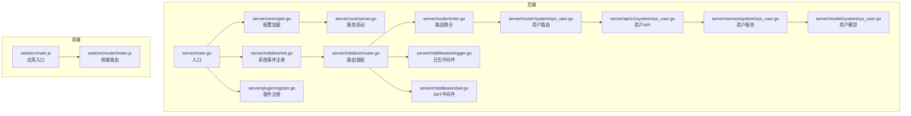
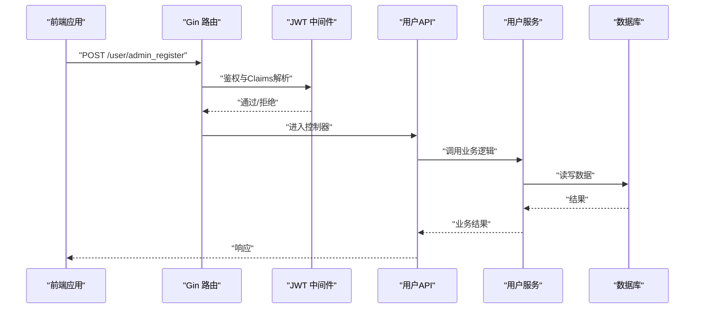
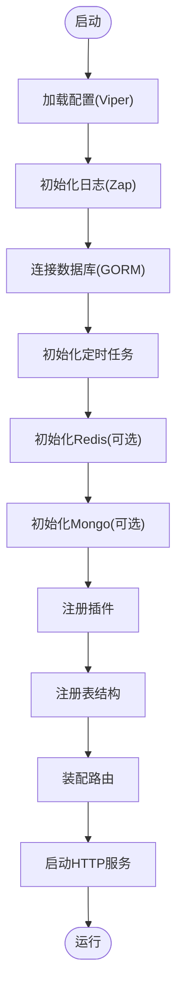
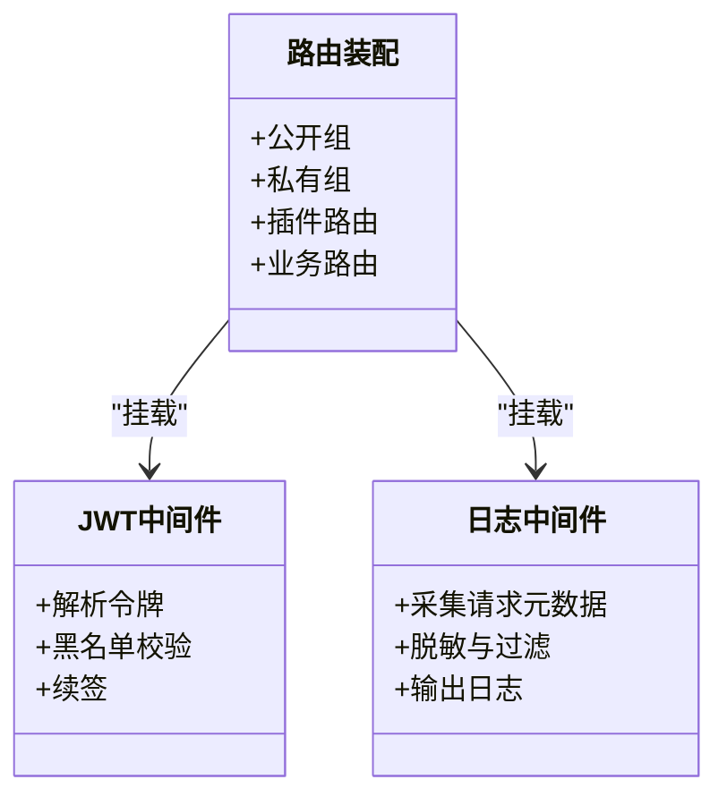
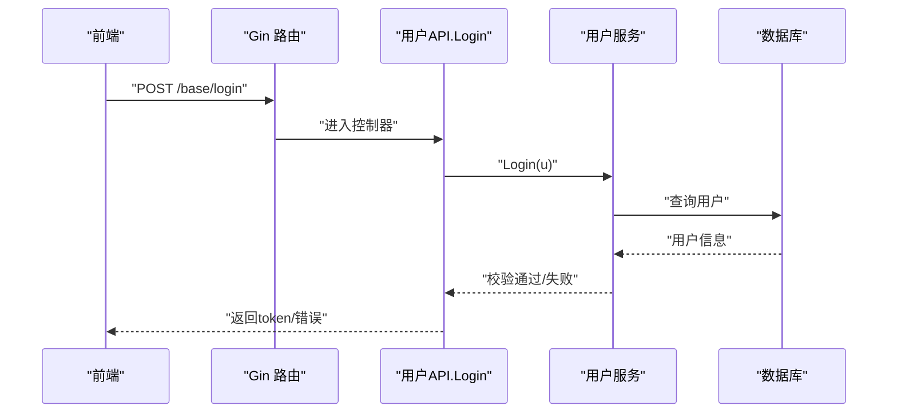
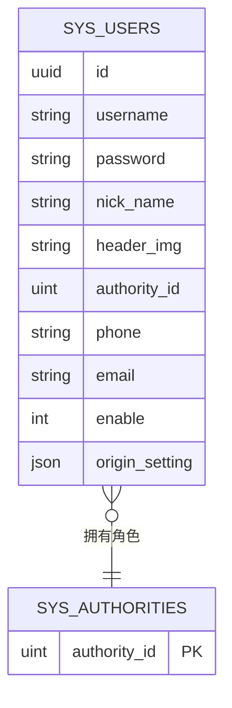
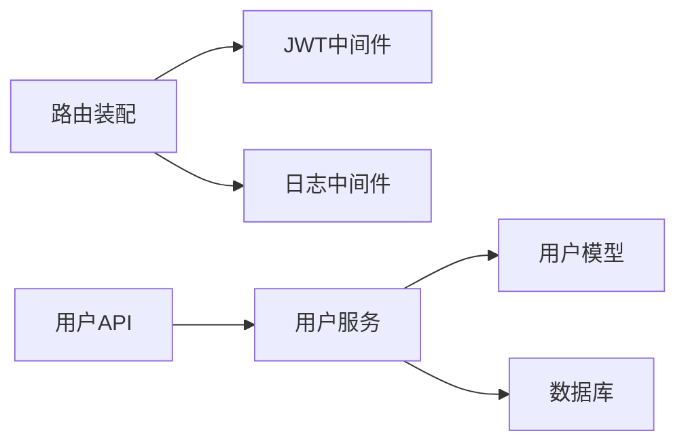

# 组件交互关系

<cite>
**本文引用的文件**
- [server/main.go](file://server/main.go)
- [server/core/server.go](file://server/core/server.go)
- [server/core/viper.go](file://server/core/viper.go)
- [server/initialize/init.go](file://server/initialize/init.go)
- [server/initialize/router.go](file://server/initialize/router.go)
- [server/router/enter.go](file://server/router/enter.go)
- [server/router/system/sys_user.go](file://server/router/system/sys_user.go)
- [server/api/v1/system/sys_user.go](file://server/api/v1/system/sys_user.go)
- [server/service/system/sys_user.go](file://server/service/system/sys_user.go)
- [server/model/system/sys_user.go](file://server/model/system/sys_user.go)
- [server/middleware/logger.go](file://server/middleware/logger.go)
- [server/middleware/jwt.go](file://server/middleware/jwt.go)
- [server/plugin/register.go](file://server/plugin/register.go)
- [web/src/main.js](file://web/src/main.js)
- [web/src/router/index.js](file://web/src/router/index.js)
</cite>

## 目录
1. [引言](#引言)
2. [项目结构](#项目结构)
3. [核心组件](#核心组件)
4. [架构总览](#架构总览)
5. [详细组件分析](#详细组件分析)
6. [依赖分析](#依赖分析)
7. [性能考量](#性能考量)
8. [故障排查指南](#故障排查指南)
9. [结论](#结论)
10. [附录](#附录)

## 引言
本文件聚焦 Gin-Vue-Admin 的组件交互关系，系统性梳理后端初始化流程、路由与中间件体系、依赖注入容器（以全局变量与模块化导入体现）、以及前后端协同机制。文档通过时序图与数据流图，解释典型请求（如登录）的处理过程，并总结组件解耦设计原则与扩展实践。

## 项目结构
后端采用 Go 语言，按领域与层次划分：入口 main 负责初始化与启动；core 提供配置与服务启动；initialize 负责各子系统的初始化与路由装配；router 定义路由分组；api 层承接 HTTP 请求；service 层承载业务逻辑；model 定义数据模型；middleware 提供横切能力；plugin 支持插件注册。

前端采用 Vue 3 + Element Plus，入口 main 负责应用初始化、插件挂载与路由挂载；router 定义前端路由。

**图表来源**
- [server/main.go:30-52](file://server/main.go#L30-L52)
- [server/core/viper.go:17-42](file://server/core/viper.go#L17-L42)
- [server/core/server.go:14-48](file://server/core/server.go#L14-L48)
- [server/initialize/init.go:10-15](file://server/initialize/init.go#L10-L15)
- [server/initialize/router.go:36-117](file://server/initialize/router.go#L36-L117)
- [server/router/enter.go:8-13](file://server/router/enter.go#L8-L13)
- [server/router/system/sys_user.go:10-28](file://server/router/system/sys_user.go#L10-L28)
- [server/api/v1/system/sys_user.go:27-161](file://server/api/v1/system/sys_user.go#L27-L161)
- [server/service/system/sys_user.go:24-61](file://server/service/system/sys_user.go#L24-L61)
- [server/model/system/sys_user.go:20-63](file://server/model/system/sys_user.go#L20-L63)
- [server/middleware/logger.go:41-89](file://server/middleware/logger.go#L41-L89)
- [server/middleware/jwt.go:16-77](file://server/middleware/jwt.go#L16-L77)
- [server/plugin/register.go:1-6](file://server/plugin/register.go#L1-L6)
- [web/src/main.js:21-37](file://web/src/main.js#L21-L37)
- [web/src/router/index.js:36-41](file://web/src/router/index.js#L36-L41)

**章节来源**
- [server/main.go:30-52](file://server/main.go#L30-L52)
- [server/core/server.go:14-48](file://server/core/server.go#L14-L48)
- [server/initialize/router.go:36-117](file://server/initialize/router.go#L36-L117)
- [web/src/main.js:21-37](file://web/src/main.js#L21-L37)

## 核心组件
- 入口与初始化
  - 后端入口负责系统初始化与服务启动，初始化顺序包括配置、日志、数据库、定时任务、插件、表结构等。
  - 初始化模块提供全局事件注册，支持系统重载。
- 路由与中间件
  - 路由装配在初始化阶段完成，统一注册公开与私有路由组，并挂载 JWT 与 RBAC 中间件。
  - 中间件提供日志、跨域、限流、操作审计等能力。
- 业务层
  - API 层负责参数校验、鉴权头读取与响应封装。
  - Service 层承载业务逻辑与事务控制。
  - Model 层定义数据结构与关联关系。
- 插件体系
  - 通过插件注册机制动态扩展路由与功能。
- 前后端协同
  - 前端应用入口挂载路由、状态管理、指令与插件，路由定义页面入口与兜底。

**章节来源**
- [server/main.go:30-52](file://server/main.go#L30-L52)
- [server/initialize/init.go:10-15](file://server/initialize/init.go#L10-L15)
- [server/initialize/router.go:36-117](file://server/initialize/router.go#L36-L117)
- [server/middleware/jwt.go:16-77](file://server/middleware/jwt.go#L16-L77)
- [server/middleware/logger.go:41-89](file://server/middleware/logger.go#L41-L89)
- [server/plugin/register.go:1-6](file://server/plugin/register.go#L1-L6)
- [web/src/main.js:21-37](file://web/src/main.js#L21-L37)

## 架构总览
后端采用“入口 -> 初始化 -> 路由 -> 中间件 -> 控制器 -> 服务 -> 模型”的标准请求链路。前端通过 Vue Router 管理页面路由，与后端 REST API 协同。

**图表来源**
- [server/initialize/router.go:68-105](file://server/initialize/router.go#L68-L105)
- [server/middleware/jwt.go:16-77](file://server/middleware/jwt.go#L16-L77)
- [server/router/system/sys_user.go:10-28](file://server/router/system/sys_user.go#L10-L28)
- [server/api/v1/system/sys_user.go:170-196](file://server/api/v1/system/sys_user.go#L170-L196)
- [server/service/system/sys_user.go:28-38](file://server/service/system/sys_user.go#L28-L38)

## 详细组件分析

### 初始化流程与生命周期
- 初始化顺序
  - 配置加载（Viper）与监听变更
  - 日志初始化（Zap）
  - 数据库连接（GORM）
  - 定时任务、Redis/Mongo（可选）
  - 插件注册与表结构初始化
  - 全局事件处理器注册（支持重载）
- 生命周期
  - 创建：读取配置、建立连接、注册路由
  - 初始化：加载系统数据、注册插件
  - 运行：启动 HTTP 服务
  - 销毁：进程退出（可通过系统事件触发清理）

**图表来源**
- [server/main.go:39-51](file://server/main.go#L39-L51)
- [server/core/viper.go:17-42](file://server/core/viper.go#L17-L42)
- [server/core/server.go:14-48](file://server/core/server.go#L14-L48)
- [server/initialize/router.go:36-117](file://server/initialize/router.go#L36-L117)

**章节来源**
- [server/main.go:30-52](file://server/main.go#L30-L52)
- [server/core/viper.go:17-42](file://server/core/viper.go#L17-L42)
- [server/core/server.go:14-48](file://server/core/server.go#L14-L48)
- [server/initialize/router.go:36-117](file://server/initialize/router.go#L36-L117)

### 路由系统与中间件体系
- 路由装配
  - 公开路由组与私有路由组分离
  - 私有路由组统一挂载 JWT 与 RBAC 中间件
  - 统一注册系统与示例路由
  - 插件路由与业务路由动态安装
- 中间件
  - JWT 中间件：解析令牌、黑名单校验、续签与多端登录处理
  - 日志中间件：统一采集请求路径、参数、耗时、错误等信息

**图表来源**
- [server/initialize/router.go:36-117](file://server/initialize/router.go#L36-L117)
- [server/middleware/jwt.go:16-77](file://server/middleware/jwt.go#L16-L77)
- [server/middleware/logger.go:41-89](file://server/middleware/logger.go#L41-L89)

**章节来源**
- [server/initialize/router.go:36-117](file://server/initialize/router.go#L36-L117)
- [server/middleware/jwt.go:16-77](file://server/middleware/jwt.go#L16-L77)
- [server/middleware/logger.go:41-89](file://server/middleware/logger.go#L41-L89)

### 用户登录典型请求时序
- 前端提交登录请求，携带用户名、密码与验证码
- 后端路由匹配到用户登录接口
- JWT 中间件拦截并校验令牌（此处为登录接口，通常无需 JWT）
- API 层进行参数校验与验证码校验
- 服务层查询用户并校验密码
- 成功后签发 JWT 并记录登录日志

**图表来源**
- [server/router/system/sys_user.go:10-28](file://server/router/system/sys_user.go#L10-L28)
- [server/api/v1/system/sys_user.go:27-99](file://server/api/v1/system/sys_user.go#L27-L99)
- [server/service/system/sys_user.go:47-61](file://server/service/system/sys_user.go#L47-L61)

**章节来源**
- [server/api/v1/system/sys_user.go:27-99](file://server/api/v1/system/sys_user.go#L27-L99)
- [server/service/system/sys_user.go:47-61](file://server/service/system/sys_user.go#L47-L61)

### 数据模型与关系
用户模型包含主键、登录名、密码、角色与多角色关联等字段，并实现登录接口以统一获取用户信息。

**图表来源**
- [server/model/system/sys_user.go:20-38](file://server/model/system/sys_user.go#L20-L38)

**章节来源**
- [server/model/system/sys_user.go:20-63](file://server/model/system/sys_user.go#L20-L63)

### 组件解耦与扩展实践
- 接口抽象
  - 用户模型实现登录接口，便于在不同上下文中复用用户信息提取逻辑。
- 事件驱动
  - 初始化模块注册系统重载事件处理器，便于在运行时热更新。
- 插件机制
  - 通过插件注册文件引入插件包，实现功能模块化扩展。
- 中间件链
  - 路由组内按需组合中间件，形成可复用的处理链。

**章节来源**
- [server/model/system/sys_user.go:9-16](file://server/model/system/sys_user.go#L9-L16)
- [server/initialize/init.go:10-15](file://server/initialize/init.go#L10-L15)
- [server/plugin/register.go:1-6](file://server/plugin/register.go#L1-L6)

## 依赖分析
- 组件耦合
  - 路由装配对中间件存在直接依赖；API 层依赖服务层；服务层依赖模型与数据库。
- 外部依赖
  - Gin 路由框架、JWT 解析库、Zap 日志库、GORM ORM、Redis/Mongo（可选）。
- 循环依赖
  - 当前结构通过分层与接口抽象避免循环依赖。

**图表来源**
- [server/initialize/router.go:36-117](file://server/initialize/router.go#L36-L117)
- [server/middleware/jwt.go:16-77](file://server/middleware/jwt.go#L16-L77)
- [server/middleware/logger.go:41-89](file://server/middleware/logger.go#L41-L89)
- [server/api/v1/system/sys_user.go:27-99](file://server/api/v1/system/sys_user.go#L27-L99)
- [server/service/system/sys_user.go:24-61](file://server/service/system/sys_user.go#L24-L61)
- [server/model/system/sys_user.go:20-38](file://server/model/system/sys_user.go#L20-L38)

**章节来源**
- [server/initialize/router.go:36-117](file://server/initialize/router.go#L36-L117)
- [server/middleware/jwt.go:16-77](file://server/middleware/jwt.go#L16-L77)
- [server/middleware/logger.go:41-89](file://server/middleware/logger.go#L41-L89)
- [server/api/v1/system/sys_user.go:27-99](file://server/api/v1/system/sys_user.go#L27-L99)
- [server/service/system/sys_user.go:24-61](file://server/service/system/sys_user.go#L24-L61)

## 性能考量
- 中间件顺序影响性能：建议将轻量中间件前置，避免阻塞后续处理。
- JWT 续签与多端登录：在高并发场景下注意 Redis 访问与令牌刷新策略。
- 日志中间件：生产环境建议异步输出与脱敏，降低 I/O 影响。
- 路由与插件：尽量减少动态装配成本，插件路由应懒加载。

## 故障排查指南
- 配置热更新异常
  - 检查配置文件路径与权限，确认 Viper 监听与反序列化流程。
- JWT 鉴权失败
  - 核对请求头令牌、黑名单状态与过期时间；检查续签逻辑与 Redis 存储。
- 登录验证码错误
  - 核对验证码缓存与阈值配置，检查登录失败日志记录。
- 路由 404 或权限拒绝
  - 确认路由前缀、中间件挂载顺序与 RBAC 规则。

**章节来源**
- [server/core/viper.go:29-37](file://server/core/viper.go#L29-L37)
- [server/middleware/jwt.go:16-77](file://server/middleware/jwt.go#L16-L77)
- [server/api/v1/system/sys_user.go:40-99](file://server/api/v1/system/sys_user.go#L40-L99)
- [server/initialize/router.go:68-105](file://server/initialize/router.go#L68-L105)

## 结论
Gin-Vue-Admin 通过清晰的初始化流程、可组合的中间件链、分层的业务模块与插件化扩展，实现了前后端高效协同。遵循接口抽象、事件驱动与中间件链模式，有助于在复杂场景下保持组件解耦与可维护性。

## 附录
- 前端应用入口与路由
  - 应用入口挂载 Element Plus、Pinia、路由与指令，统一初始化。
  - 前端路由定义首页跳转、登录页与兜底页等。

**章节来源**
- [web/src/main.js:21-37](file://web/src/main.js#L21-L37)
- [web/src/router/index.js:36-41](file://web/src/router/index.js#L36-L41)