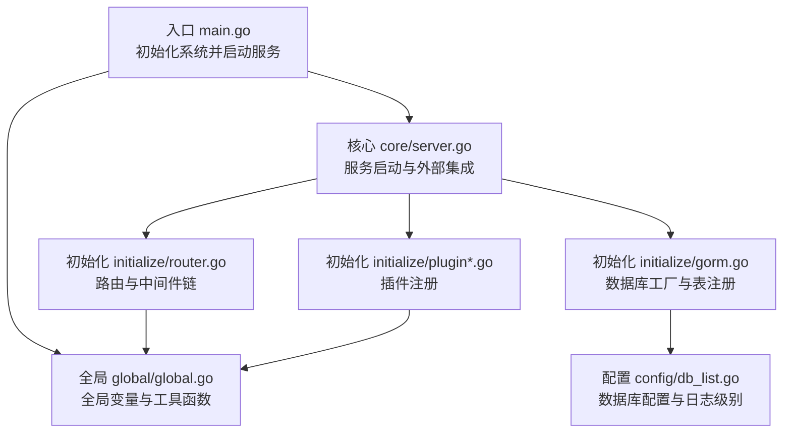
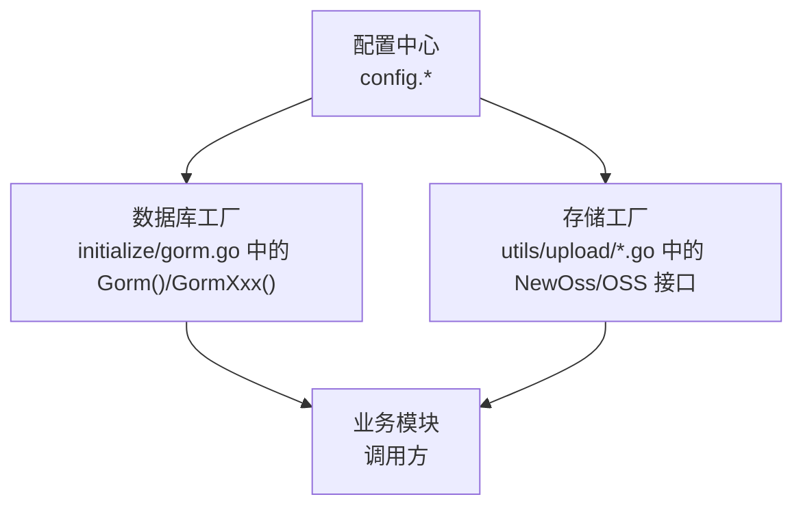
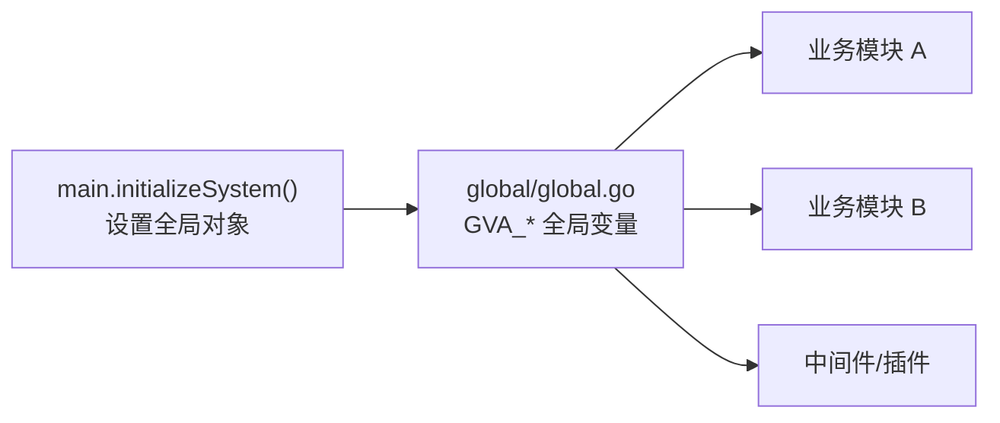
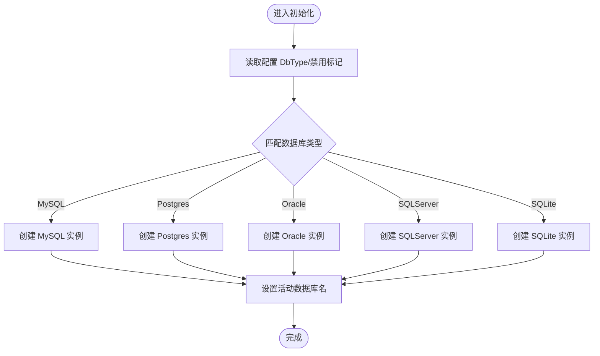
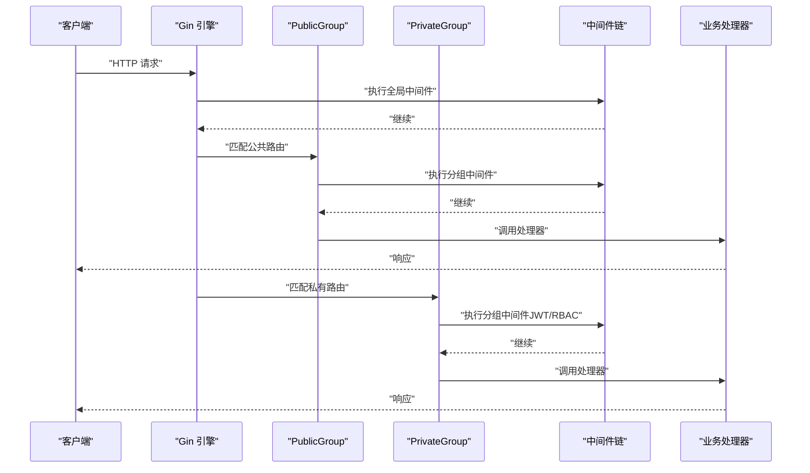
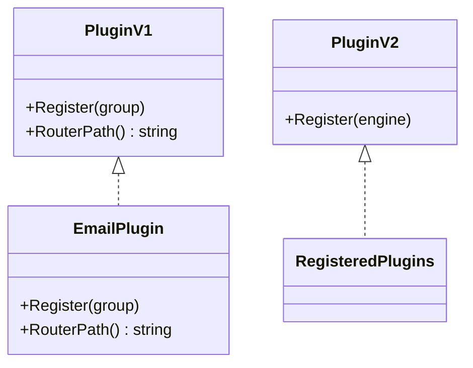
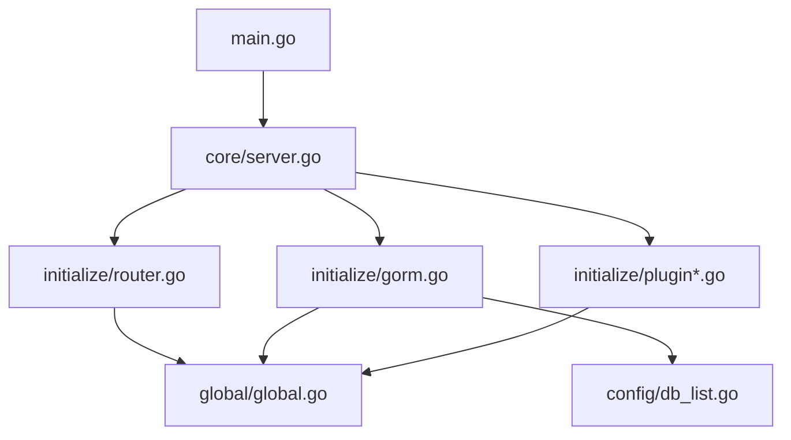

# 设计模式应用

<cite>
**本文引用的文件**
- [server/main.go](file://server/main.go)
- [server/core/server.go](file://server/core/server.go)
- [server/global/global.go](file://server/global/global.go)
- [server/config/db_list.go](file://server/config/db_list.go)
- [server/initialize/gorm.go](file://server/initialize/gorm.go)
- [server/initialize/router.go](file://server/initialize/router.go)
- [server/initialize/plugin.go](file://server/initialize/plugin.go)
- [server/initialize/plugin_biz_v1.go](file://server/initialize/plugin_biz_v1.go)
- [server/initialize/plugin_biz_v2.go](file://server/initialize/plugin_biz_v2.go)
- [server/middleware/logger.go](file://server/middleware/logger.go)
- [server/utils/plugin/plugin.go](file://server/utils/plugin/plugin.go)
- [server/utils/plugin/v2/plugin.go](file://server/utils/plugin/v2/plugin.go)
- [repowiki/zh/content/系统架构/设计模式应用/工厂模式应用.md](file://repowiki/zh/content/系统架构/设计模式应用/工厂模式应用.md)
- [repowiki/zh/content/系统架构/设计模式应用/中间件链模式.md](file://repowiki/zh/content/系统架构/设计模式应用/中间件链模式.md)
</cite>

## 目录
1. [引言](#引言)
2. [项目结构](#项目结构)
3. [核心组件](#核心组件)
4. [架构总览](#架构总览)
5. [详细组件分析](#详细组件分析)
6. [依赖关系分析](#依赖关系分析)
7. [性能考量](#性能考量)
8. [故障排查指南](#故障排查指南)
9. [结论](#结论)
10. [附录](#附录)

## 引言
本文件聚焦 Gin-Vue-Admin 后端在实际工程中的设计模式落地，围绕以下主题展开：依赖注入模式在全局变量管理中的应用、工厂模式在数据库连接与存储后端中的使用、中间件链模式在请求处理中的实现、插件注册模式在扩展系统中的应用。文档通过代码级图示与路径引用，帮助读者理解每种模式如何解决问题、带来收益，并给出扩展思路与选择原则。

## 项目结构
后端采用“入口 -> 核心启动 -> 初始化子系统 -> 运行服务”的分层组织方式。入口负责初始化配置、日志、数据库、定时任务等；核心负责服务启动与外部集成；初始化模块负责路由、插件、数据库连接池、表结构注册等；全局模块集中存放跨模块共享的全局对象。

**图表来源**
- [server/main.go:30-52](file://server/main.go#L30-L52)
- [server/core/server.go:14-49](file://server/core/server.go#L14-L49)
- [server/initialize/router.go:36-118](file://server/initialize/router.go#L36-L118)
- [server/initialize/gorm.go:14-88](file://server/initialize/gorm.go#L14-L88)
- [server/initialize/plugin.go:8-16](file://server/initialize/plugin.go#L8-L16)
- [server/global/global.go:25-69](file://server/global/global.go#L25-L69)
- [server/config/db_list.go:17-54](file://server/config/db_list.go#L17-L54)

**章节来源**
- [server/main.go:30-52](file://server/main.go#L30-L52)
- [server/core/server.go:14-49](file://server/core/server.go#L14-L49)
- [server/initialize/router.go:36-118](file://server/initialize/router.go#L36-L118)
- [server/initialize/gorm.go:14-88](file://server/initialize/gorm.go#L14-L88)
- [server/initialize/plugin.go:8-16](file://server/initialize/plugin.go#L8-L16)
- [server/global/global.go:25-69](file://server/global/global.go#L25-L69)
- [server/config/db_list.go:17-54](file://server/config/db_list.go#L17-L54)

## 核心组件
- 全局变量与并发控制：集中存放数据库、Redis、Mongo、日志、Viper、定时任务、MCP 服务等，提供线程安全的访问与按名称检索能力。
- 数据库工厂：依据配置选择具体数据库类型，统一创建 gorm 实例并支持多实例与日志级别映射。
- 路由与中间件链：在引擎、分组、路由三个层级构建中间件链，实现安全、可观测、限流、审计等功能。
- 插件注册：通过接口抽象插件行为，支持 v1 与 v2 两代注册方式，实现业务扩展与模块化装配。
- 日志中间件：提供可配置的日志布局与打印策略，支持过滤、脱敏与鉴权信息采集。

**章节来源**
- [server/global/global.go:25-69](file://server/global/global.go#L25-L69)
- [server/config/db_list.go:17-54](file://server/config/db_list.go#L17-L54)
- [server/initialize/gorm.go:14-88](file://server/initialize/gorm.go#L14-L88)
- [server/initialize/router.go:36-118](file://server/initialize/router.go#L36-L118)
- [server/initialize/plugin_biz_v1.go:12-37](file://server/initialize/plugin_biz_v1.go#L12-L37)
- [server/initialize/plugin_biz_v2.go:9-17](file://server/initialize/plugin_biz_v2.go#L9-L17)
- [server/middleware/logger.go:14-90](file://server/middleware/logger.go#L14-L90)

## 架构总览
下图展示“配置驱动 + 工厂方法”的整体架构：配置层提供结构化的参数，工厂层依据配置动态创建对应实例，调用方仅面向统一接口编程，降低耦合度。

**图表来源**
- [server/config/db_list.go:17-54](file://server/config/db_list.go#L17-L54)
- [server/initialize/gorm.go:14-35](file://server/initialize/gorm.go#L14-L35)
- [repowiki/zh/content/系统架构/设计模式应用/工厂模式应用.md:93-125](file://repowiki/zh/content/系统架构/设计模式应用/工厂模式应用.md#L93-L125)

**章节来源**
- [server/config/db_list.go:17-54](file://server/config/db_list.go#L17-L54)
- [server/initialize/gorm.go:14-35](file://server/initialize/gorm.go#L14-L35)
- [repowiki/zh/content/系统架构/设计模式应用/工厂模式应用.md:93-125](file://repowiki/zh/content/系统架构/设计模式应用/工厂模式应用.md#L93-L125)

## 详细组件分析

### 依赖注入模式：全局变量管理
- 设计要点
  - 将数据库、Redis、Mongo、日志、Viper、定时任务、MCP 服务等作为全局对象集中管理，避免在各模块之间传递大量参数。
  - 提供按名称检索与线程安全访问的工具函数，减少重复初始化与竞态条件。
- 实现细节
  - 全局对象声明与读写锁保护，提供 Get/MustGet 系列函数，确保在初始化完成后稳定可用。
  - 入口函数在启动前完成全局对象的初始化，保证后续模块可直接依赖。
- 优势
  - 降低模块间耦合，提升可测试性与可维护性。
  - 便于集中配置与统一生命周期管理。
- 适用场景
  - 需要在多个包之间共享的基础设施对象。
  - 配置相对稳定且启动期一次性初始化的对象。

**图表来源**
- [server/main.go:39-51](file://server/main.go#L39-L51)
- [server/global/global.go:25-69](file://server/global/global.go#L25-L69)

**章节来源**
- [server/main.go:39-51](file://server/main.go#L39-L51)
- [server/global/global.go:25-69](file://server/global/global.go#L25-L69)

### 工厂模式：数据库连接与存储后端
- 设计要点
  - 通过配置驱动的工厂方法，依据 DbType 与禁用标记动态创建数据库实例。
  - 通用配置基类封装日志级别映射与连接参数，专用配置结构支持多实例与别名。
- 实现细节
  - 初始化阶段调用工厂方法，按类型分支创建具体数据库连接，并设置活动数据库名。
  - 支持多数据库实例列表，按名称检索，便于多租户或多库场景。
- 优势
  - 配置即代码，无需修改工厂代码即可扩展新数据库类型。
  - 运行时可控，可通过禁用标记实现灰度与降级。
- 适用场景
  - 多数据库类型共存、需要按环境切换的系统。
  - 需要集中管理连接池与日志级别的场景。

**图表来源**
- [server/initialize/gorm.go:14-35](file://server/initialize/gorm.go#L14-L35)
- [server/config/db_list.go:17-54](file://server/config/db_list.go#L17-L54)

**章节来源**
- [server/initialize/gorm.go:14-35](file://server/initialize/gorm.go#L14-L35)
- [server/config/db_list.go:17-54](file://server/config/db_list.go#L17-L54)
- [repowiki/zh/content/系统架构/设计模式应用/工厂模式应用.md:114-125](file://repowiki/zh/content/系统架构/设计模式应用/工厂模式应用.md#L114-L125)

### 中间件链模式：请求处理
- 设计要点
  - Gin 的中间件链遵循“全局 -> 分组 -> 单路由”的责任链，通过 Next/Abort 控制执行顺序。
  - 安全（JWT、RBAC）、跨域、日志、异常恢复、超时、审计、限流等中间件职责分离。
- 实现细节
  - 全局中间件在引擎创建时注册；分组中间件在 PrivateGroup 上注册 JWT 与 RBAC；单路由中间件用于精细化控制。
  - 日志中间件提供可配置的布局、过滤、脱敏与鉴权信息采集。
- 优势
  - 可组合、可裁剪，便于按需启用与参数化配置。
  - 易于扩展新的横切关注点（如指标采集、链路追踪）。
- 适用场景
  - 需要统一安全策略与可观测性的 Web 服务。

**图表来源**
- [server/initialize/router.go:36-118](file://server/initialize/router.go#L36-L118)
- [server/middleware/logger.go:41-90](file://server/middleware/logger.go#L41-L90)

**章节来源**
- [server/initialize/router.go:36-118](file://server/initialize/router.go#L36-L118)
- [server/middleware/logger.go:41-90](file://server/middleware/logger.go#L41-L90)
- [repowiki/zh/content/系统架构/设计模式应用/中间件链模式.md:529-543](file://repowiki/zh/content/系统架构/设计模式应用/中间件链模式.md#L529-L543)

### 插件注册模式：扩展系统
- 设计要点
  - v1 与 v2 两代插件接口分别面向 RouterGroup 与 Engine，支持不同粒度的注册。
  - 通过统一的 Register/RouterPath 接口，插件可声明自身路由前缀并完成注册。
- 实现细节
  - v1：在私有/公共路由组上创建插件专属分组并注册路由。
  - v2：直接向 Engine 注册插件，简化扩展接入。
  - 插件安装在路由初始化之后，确保全局状态已就绪。
- 优势
  - 低耦合扩展，插件可独立开发与发布。
  - 支持多版本接口，兼容旧插件同时引入新能力。
- 适用场景
  - 需要快速集成第三方能力或内部业务模块的场景。

**图表来源**
- [server/utils/plugin/plugin.go:11-18](file://server/utils/plugin/plugin.go#L11-L18)
- [server/utils/plugin/v2/plugin.go:7-11](file://server/utils/plugin/v2/plugin.go#L7-L11)
- [server/initialize/plugin_biz_v1.go:12-37](file://server/initialize/plugin_biz_v1.go#L12-L37)
- [server/initialize/plugin_biz_v2.go:9-17](file://server/initialize/plugin_biz_v2.go#L9-L17)

**章节来源**
- [server/utils/plugin/plugin.go:11-18](file://server/utils/plugin/plugin.go#L11-L18)
- [server/utils/plugin/v2/plugin.go:7-11](file://server/utils/plugin/v2/plugin.go#L7-L11)
- [server/initialize/plugin_biz_v1.go:12-37](file://server/initialize/plugin_biz_v1.go#L12-L37)
- [server/initialize/plugin_biz_v2.go:9-17](file://server/initialize/plugin_biz_v2.go#L9-L17)
- [server/initialize/plugin.go:8-16](file://server/initialize/plugin.go#L8-L16)

## 依赖关系分析
- 入口依赖核心模块启动服务，核心模块再依赖初始化模块完成路由、数据库、插件等子系统的装配。
- 初始化模块依赖全局模块提供的配置与日志，以及配置模块提供的数据库配置。
- 中间件链与插件注册均在初始化阶段完成，确保运行期请求处理具备完整能力。

**图表来源**
- [server/main.go:30-52](file://server/main.go#L30-L52)
- [server/core/server.go:14-49](file://server/core/server.go#L14-L49)
- [server/initialize/router.go:36-118](file://server/initialize/router.go#L36-L118)
- [server/initialize/gorm.go:14-88](file://server/initialize/gorm.go#L14-L88)
- [server/initialize/plugin.go:8-16](file://server/initialize/plugin.go#L8-L16)
- [server/global/global.go:25-69](file://server/global/global.go#L25-L69)
- [server/config/db_list.go:17-54](file://server/config/db_list.go#L17-L54)

**章节来源**
- [server/main.go:30-52](file://server/main.go#L30-L52)
- [server/core/server.go:14-49](file://server/core/server.go#L14-L49)
- [server/initialize/router.go:36-118](file://server/initialize/router.go#L36-L118)
- [server/initialize/gorm.go:14-88](file://server/initialize/gorm.go#L14-L88)
- [server/initialize/plugin.go:8-16](file://server/initialize/plugin.go#L8-L16)
- [server/global/global.go:25-69](file://server/global/global.go#L25-L69)
- [server/config/db_list.go:17-54](file://server/config/db_list.go#L17-L54)

## 性能考量
- 中间件链顺序与数量直接影响请求延迟，建议在生产环境按需启用并参数化配置。
- 全局日志中间件应避免对大体积请求体进行重复读取与拷贝，必要时通过过滤器控制采样。
- 数据库工厂按需创建实例，避免不必要的连接与资源占用；多实例场景下应合理设置连接池参数。

## 故障排查指南
- 插件安装失败：检查全局数据库状态是否已初始化，若未初始化则跳过插件安装并在初始化后重启生效。
- 数据库实例缺失：通过按名称检索函数确认实例是否存在，若不存在检查配置与初始化顺序。
- 中间件链异常：核对中间件注册顺序与错误处理逻辑，定位首个触发错误的中间件。

**章节来源**
- [server/initialize/plugin.go:8-16](file://server/initialize/plugin.go#L8-L16)
- [server/global/global.go:44-69](file://server/global/global.go#L44-L69)
- [server/middleware/logger.go:41-90](file://server/middleware/logger.go#L41-L90)

## 结论
本项目通过依赖注入、工厂、中间件链与插件注册四大设计模式，实现了配置驱动、可扩展、易维护的后端架构。模式选择遵循“配置即代码”“接口抽象”“职责分离”“可组合性”等原则，既满足当前业务需求，也为未来演进提供了清晰的扩展路径。

## 附录
- 设计模式选择原则
  - 优先使用配置驱动与接口抽象，降低硬编码与耦合。
  - 将横切关注点（日志、安全、限流）收敛到中间件链，保持业务代码纯净。
  - 通过工厂方法屏蔽差异，统一对外接口，便于测试与替换。
  - 插件化扩展应区分粒度与生命周期，v1 适合路由级扩展，v2 适合引擎级扩展。