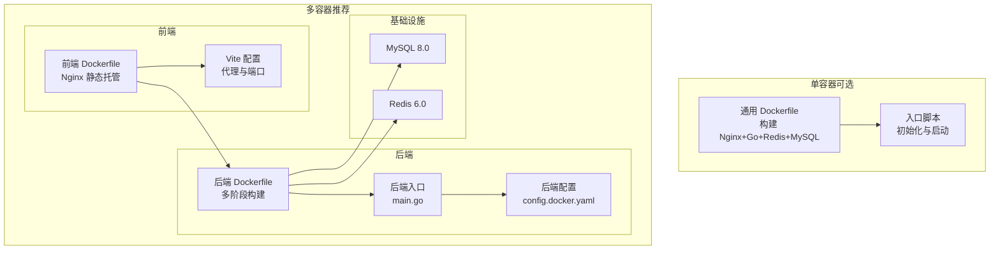
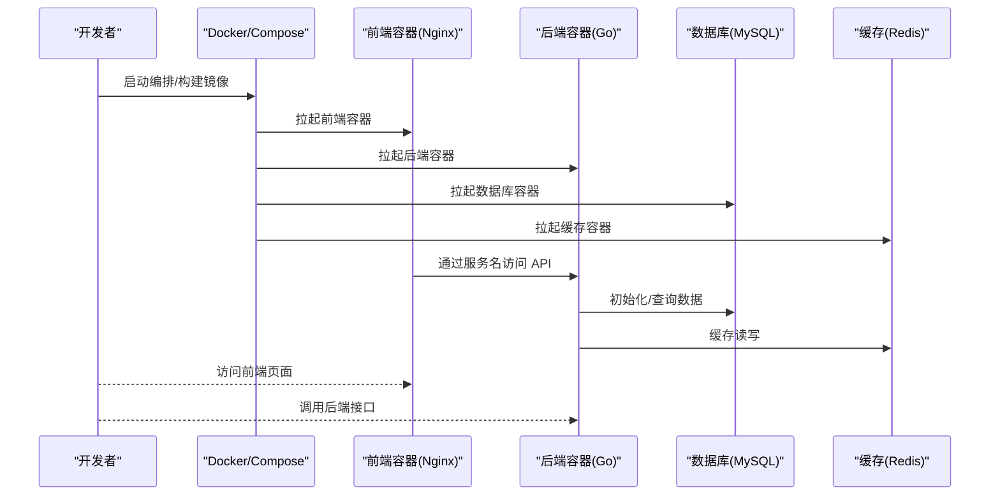
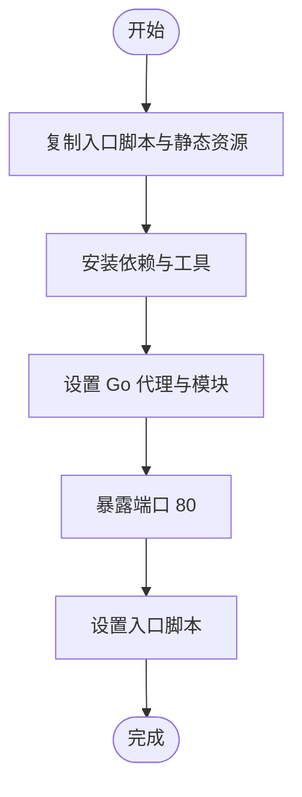
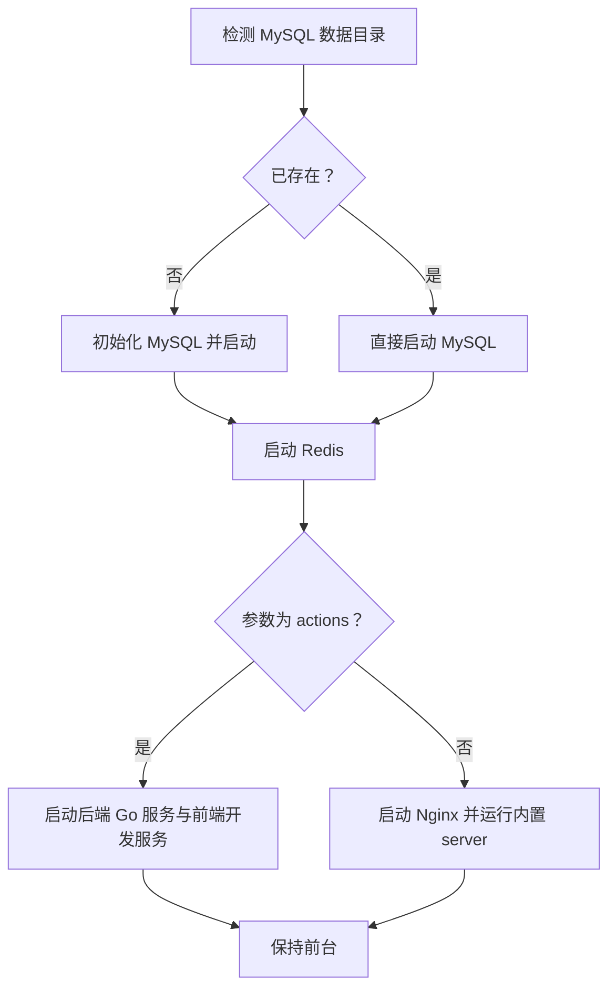
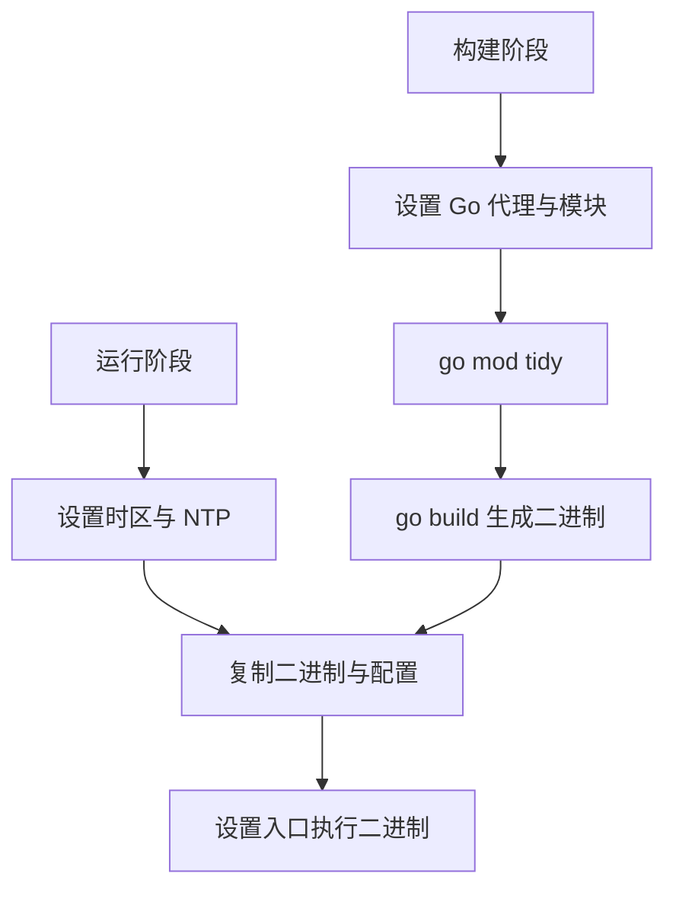
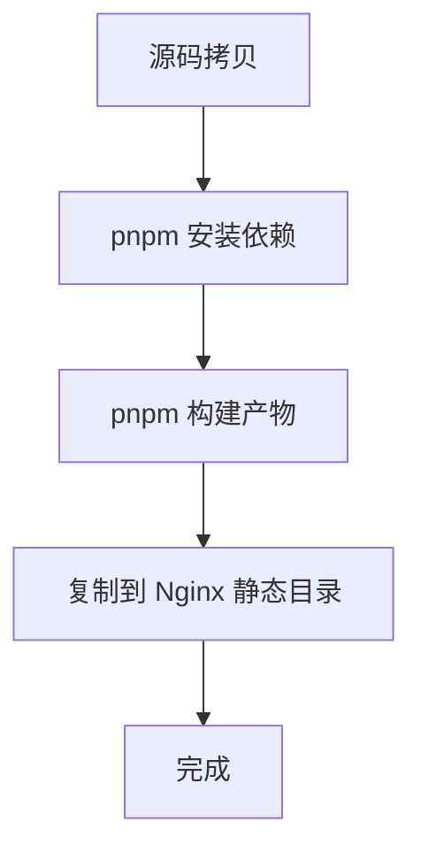
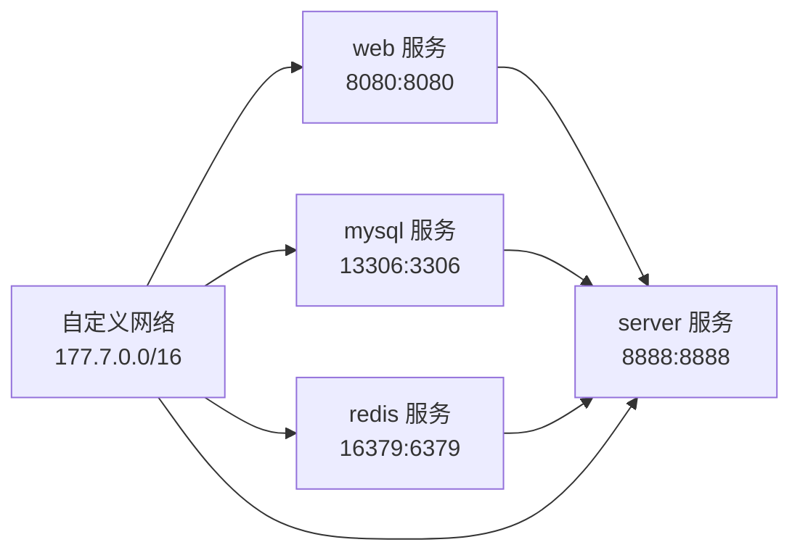
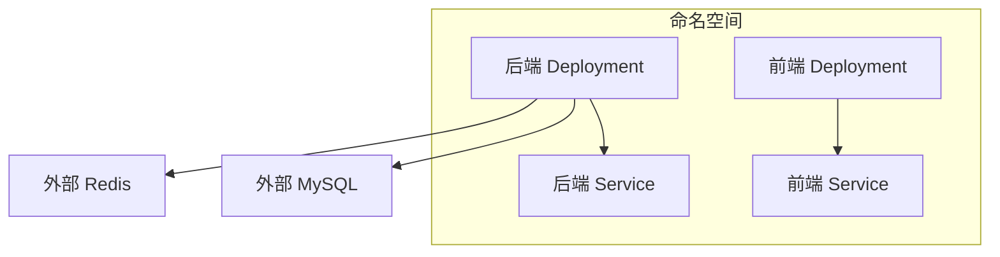
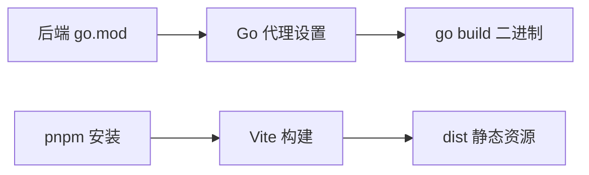

# Docker 容器化部署

<cite>
**本文引用的文件**
- [通用 Dockerfile](file://deploy/docker/Dockerfile)
- [入口脚本（通用）](file://deploy/docker/entrypoint.sh)
- [Docker Compose（编排）](file://deploy/docker-compose/docker-compose.yaml)
- [后端 Dockerfile](file://server/Dockerfile)
- [前端 Dockerfile](file://web/Dockerfile)
- [后端配置（Docker）](file://server/config.docker.yaml)
- [后端入口](file://server/main.go)
- [后端模块清单](file://server/go.mod)
- [前端包清单](file://web/package.json)
- [前端 Vite 配置](file://web/vite.config.js)
- [前端忽略规则](file://web/.dockerignore)
- [K8s 服务端 Deployment](file://deploy/kubernetes/server/gva-server-deployment.yaml)
- [K8s 服务端 Service](file://deploy/kubernetes/server/gva-server-service.yaml)
- [K8s 前端 Deployment](file://deploy/kubernetes/web/gva-web-deploymemt.yaml)
- [K8s 前端 Service](file://deploy/kubernetes/web/gva-web-service.yaml)
- [通用 Nginx 配置（旧版）](file://web/.docker-compose/nginx/conf.d/nginx.conf)
- [通用 Nginx 配置（新版）](file://web/.docker-compose/nginx/conf.d/my.conf)
- [Docker 容器化部署文档](file://repowiki/zh/content/部署运维/Docker容器化部署.md)
- [Makefile](file://Makefile)
</cite>

## 目录
1. [简介](#简介)
2. [项目结构](#项目结构)
3. [核心组件](#核心组件)
4. [架构总览](#架构总览)
5. [详细组件分析](#详细组件分析)
6. [依赖分析](#依赖分析)
7. [性能考虑](#性能考虑)
8. [故障排查指南](#故障排查指南)
9. [结论](#结论)
10. [附录](#附录)

## 简介
本文件面向测试管理平台的 Docker 容器化部署，覆盖以下主题：
- Dockerfile 构建流程与优化策略
- 环境配置、依赖安装与启动脚本
- 容器启动流程、端口映射与网络配置
- 单容器与多容器编排示例
- 镜像构建优化、资源限制与健康检查
- Docker Compose 使用与环境变量配置
- 日志管理与调试技巧

## 项目结构
测试管理平台采用前后端分离的多容器架构，包含：
- 后端服务容器：基于 Go 语言，提供 REST API 与业务逻辑
- 前端容器：基于 Nginx 静态托管 Vue 应用
- 数据库与缓存：MySQL 与 Redis，通过 Compose 或 Kubernetes 编排
- 可选：单容器通用方案（包含 Nginx、Go、Redis、MySQL）

图表来源
- [通用 Dockerfile:1-18](file://deploy/docker/Dockerfile#L1-L18)
- [入口脚本（通用）:1-19](file://deploy/docker/entrypoint.sh#L1-L19)
- [前端 Dockerfile:1-26](file://web/Dockerfile#L1-L26)
- [前端 Vite 配置:57-78](file://web/vite.config.js#L57-L78)
- [后端 Dockerfile:1-32](file://server/Dockerfile#L1-L32)
- [后端入口:30-35](file://server/main.go#L30-L35)
- [后端配置（Docker）:74-81](file://server/config.docker.yaml#L74-L81)

章节来源
- [通用 Dockerfile:1-18](file://deploy/docker/Dockerfile#L1-L18)
- [Docker Compose（编排）:1-91](file://deploy/docker-compose/docker-compose.yaml#L1-L91)
- [后端 Dockerfile:1-32](file://server/Dockerfile#L1-L32)
- [前端 Dockerfile:1-26](file://web/Dockerfile#L1-L26)
- [后端配置（Docker）:74-81](file://server/config.docker.yaml#L74-L81)

## 核心组件
- 通用 Dockerfile（单容器）
  - 基础镜像：CentOS 7
  - 依赖：Git、Redis、Nginx、Go、Yarn、MySQL 客户端
  - 环境：Locale、内核参数、代理与模块开关
  - 入口：入口脚本负责初始化 MySQL、启动 Redis 与 Nginx/服务进程
- 后端 Dockerfile（多容器）
  - 多阶段构建：Alpine + Go 构建器
  - 运行时：Alpine + 时区与 NTP
  - 入口：执行 server 二进制并加载 Docker 专用配置
- 前端 Dockerfile（多容器）
  - 基于 Nginx：静态资源分发
  - 构建链路：pnpm 安装 → 生产依赖 → 构建 → Nginx 复制产物
- Compose 编排
  - 网络：自定义子网，静态 IP 分配
  - 服务：web、server、mysql、redis
  - 健康检查：MySQL 与 Redis 健康探针
  - 端口映射：Web 前端 8080、后端 8888、MySQL 3306、Redis 6379
- K8s 部署（可选）
  - 服务端 Deployment：CPU/Memory 资源限制、存活/就绪/启动探针
  - 服务端 Service：ClusterIP 暴露 8888
  - 前端 Deployment：Nginx 容器，就绪探针 8080

章节来源
- [通用 Dockerfile:1-18](file://deploy/docker/Dockerfile#L1-L18)
- [入口脚本（通用）:1-19](file://deploy/docker/entrypoint.sh#L1-L19)
- [后端 Dockerfile:1-32](file://server/Dockerfile#L1-L32)
- [前端 Dockerfile:1-26](file://web/Dockerfile#L1-L26)
- [Docker Compose（编排）:1-91](file://deploy/docker-compose/docker-compose.yaml#L1-L91)
- [K8s 服务端 Deployment:1-74](file://deploy/kubernetes/server/gva-server-deployment.yaml#L1-L74)
- [K8s 服务端 Service:1-22](file://deploy/kubernetes/server/gva-server-service.yaml#L1-L22)
- [K8s 前端 Deployment:1-52](file://deploy/kubernetes/web/gva-web-deploymemt.yaml#L1-L52)
- [K8s 前端 Service:1-22](file://deploy/kubernetes/web/gva-web-service.yaml#L1-L22)

## 架构总览
下图展示容器启动与交互流程，涵盖单容器与多容器两种模式。

图表来源
- [Docker Compose（编排）:16-91](file://deploy/docker-compose/docker-compose.yaml#L16-L91)
- [后端配置（Docker）:74-81](file://server/config.docker.yaml#L74-L81)
- [K8s 服务端 Service:16-19](file://deploy/kubernetes/server/gva-server-service.yaml#L16-L19)
- [K8s 前端 Service:15-18](file://deploy/kubernetes/web/gva-web-service.yaml#L15-L18)

## 详细组件分析

### 通用 Dockerfile（单容器）
- 基础镜像与工作目录：CentOS 7，工作目录 /opt
- 环境变量：设置 locale 与系统参数
- 依赖安装：epel、MySQL 仓库、git、redis、nginx、go、yarn
- 代理与模块：启用 Go 模块代理，加速依赖下载
- 暴露端口：80
- 入口：执行入口脚本

图表来源
- [通用 Dockerfile:1-18](file://deploy/docker/Dockerfile#L1-L18)

章节来源
- [通用 Dockerfile:1-18](file://deploy/docker/Dockerfile#L1-L18)

### 入口脚本（通用）
- MySQL 初始化：首次运行初始化数据目录并创建数据库与用户
- Redis：后台启动
- 启动模式：根据参数决定启动 Nginx+后端或直接启动 Nginx 与内置 server
- 常驻进程：输出启动信息并保持前台

图表来源
- [入口脚本（通用）:1-19](file://deploy/docker/entrypoint.sh#L1-L19)

章节来源
- [入口脚本（通用）:1-19](file://deploy/docker/entrypoint.sh#L1-L19)

### 后端 Dockerfile（多容器）
- 多阶段构建：builder 阶段拉取依赖、设置 Go 代理、构建二进制；运行时阶段仅含二进制与资源
- 运行时环境：Alpine + 时区与 NTP
- 入口：执行 server 二进制并加载 Docker 专用配置文件

图表来源
- [后端 Dockerfile:1-32](file://server/Dockerfile#L1-L32)

章节来源
- [后端 Dockerfile:1-32](file://server/Dockerfile#L1-L32)

### 前端 Dockerfile（多容器）
- 基于 Nginx：静态资源分发
- 构建链路：pnpm 安装生产依赖与构建 → Nginx 复制 dist 产物
- 优化点：利用缓存层减少重复安装

图表来源
- [前端 Dockerfile:1-26](file://web/Dockerfile#L1-L26)

章节来源
- [前端 Dockerfile:1-26](file://web/Dockerfile#L1-L26)

### Docker Compose 编排（多容器）
- 网络：自定义子网，静态 IP 分配，便于服务间通信
- 服务：
  - web：前端容器，端口映射 8080，依赖后端，使用 Nginx
  - server：后端容器，端口映射 8888，依赖 MySQL 与 Redis 健康
  - mysql：MySQL 8.0，环境变量初始化数据库与用户，健康检查
  - redis：Redis 6.0，健康检查
- 健康检查：MySQL 与 Redis 分别配置探针
- 端口映射：前端 8080→8080，后端 8888→8888，MySQL 13306→3306，Redis 16379→6379

图表来源
- [Docker Compose（编排）:16-91](file://deploy/docker-compose/docker-compose.yaml#L16-L91)

章节来源
- [Docker Compose（编排）:1-91](file://deploy/docker-compose/docker-compose.yaml#L1-L91)

### Kubernetes 部署（可选）
- 服务端 Deployment：
  - CPU/Memory 资源限制与请求
  - 存活/就绪/启动探针（TCP Socket）
  - 挂载配置与本地时间
- 服务端 Service：ClusterIP 暴露 8888
- 前端 Deployment：Nginx 容器，就绪探针 8080

图表来源
- [K8s 服务端 Deployment:24-65](file://deploy/kubernetes/server/gva-server-deployment.yaml#L24-L65)
- [K8s 服务端 Service:13-20](file://deploy/kubernetes/server/gva-server-service.yaml#L13-L20)
- [K8s 前端 Deployment:24-44](file://deploy/kubernetes/web/gva-web-deploymemt.yaml#L24-L44)
- [K8s 前端 Service:13-18](file://deploy/kubernetes/web/gva-web-service.yaml#L13-L18)

章节来源
- [K8s 服务端 Deployment:1-74](file://deploy/kubernetes/server/gva-server-deployment.yaml#L1-L74)
- [K8s 服务端 Service:1-22](file://deploy/kubernetes/server/gva-server-service.yaml#L1-L22)
- [K8s 前端 Deployment:1-52](file://deploy/kubernetes/web/gva-web-deploymemt.yaml#L1-L52)
- [K8s 前端 Service:1-22](file://deploy/kubernetes/web/gva-web-service.yaml#L1-L22)

## 依赖分析
- 后端依赖管理
  - Go 版本与模块代理：在构建阶段设置 GO111MODULE 与 GOPROXY
  - 依赖清单：包含 Gin、GORM、Casbin、Redis、AWS SDK 等
- 前端依赖管理
  - 包管理器：pnpm（启用缓存）
  - 构建工具：Vite、Vue3、Element Plus 等
  - 开发代理：基于 Vite 配置的代理规则，指向后端服务

图表来源
- [后端模块清单:1-208](file://server/go.mod#L1-L208)
- [后端 Dockerfile:6-11](file://server/Dockerfile#L6-L11)
- [前端 Dockerfile:13-18](file://web/Dockerfile#L13-L18)
- [前端包清单:1-88](file://web/package.json#L1-L88)

章节来源
- [后端模块清单:1-208](file://server/go.mod#L1-L208)
- [后端 Dockerfile:6-11](file://server/Dockerfile#L6-L11)
- [前端 Dockerfile:13-18](file://web/Dockerfile#L13-L18)
- [前端包清单:1-88](file://web/package.json#L1-L88)

## 性能考虑
- 镜像构建优化
  - 后端：多阶段构建，仅在运行时包含二进制与必要资源，减小镜像体积
  - 前端：利用 pnpm 缓存与分层构建，避免重复安装依赖
  - 通用：在通用 Dockerfile 中统一设置 Go 代理，提升依赖下载速度
- 资源限制
  - K8s 中为后端设置 CPU/Memory 上限与请求，避免资源争抢
  - 前端 Nginx 资源限制适中，满足静态资源分发需求
- 健康检查
  - MySQL 与 Redis 分别配置健康探针，确保后端启动前依赖可用
- 端口与网络
  - 明确端口映射与服务间通信，避免冲突
  - 自定义网络便于服务发现与隔离

章节来源
- [后端 Dockerfile:1-32](file://server/Dockerfile#L1-L32)
- [前端 Dockerfile:1-26](file://web/Dockerfile#L1-L26)
- [Docker Compose（编排）:64-85](file://deploy/docker-compose/docker-compose.yaml#L64-L85)
- [K8s 服务端 Deployment:37-43](file://deploy/kubernetes/server/gva-server-deployment.yaml#L37-L43)

## 故障排查指南
- 启动失败
  - 检查入口脚本是否正确初始化 MySQL 与启动 Redis/Nginx
  - 查看后端日志与 K8s 事件，确认依赖健康状态
- 端口冲突
  - 确认宿主机端口映射未被占用（如 8080、8888、13306、16379）
- 依赖不可达
  - 校验 Compose/K8s 中的服务名与端口是否匹配
  - 检查健康检查结果与网络连通性
- 日志定位
  - 后端：查看 config.docker.yaml 中日志目录与级别
  - 前端：查看 Nginx 访问/错误日志
  - 通用：容器日志可通过 docker logs 或 kubectl logs 查看

章节来源
- [入口脚本（通用）:1-19](file://deploy/docker/entrypoint.sh#L1-L19)
- [后端配置（Docker）:10-19](file://server/config.docker.yaml#L10-L19)
- [Docker Compose（编排）:64-85](file://deploy/docker-compose/docker-compose.yaml#L64-L85)
- [K8s 服务端 Deployment:44-58](file://deploy/kubernetes/server/gva-server-deployment.yaml#L44-L58)

## 结论
本项目提供了两种容器化部署路径：
- 单容器：适合快速体验，一键启动 Nginx+Go+Redis+MySQL
- 多容器：适合生产与开发协作，清晰分离前后端与基础设施
结合 Compose/K8s 的健康检查、资源限制与网络配置，可实现稳定可靠的容器化交付。

## 附录

### 单容器部署步骤（通用 Dockerfile）
- 构建镜像
  - 使用通用 Dockerfile 构建镜像
- 启动容器
  - 挂载数据卷（如需要持久化）
  - 暴露端口 80
  - 运行入口脚本，按需选择启动模式

章节来源
- [通用 Dockerfile:1-18](file://deploy/docker/Dockerfile#L1-L18)
- [入口脚本（通用）:1-19](file://deploy/docker/entrypoint.sh#L1-L19)

### 多容器编排步骤（Compose）
- 准备
  - 确保 Docker Compose 可用
- 启动
  - 在 compose 目录执行启动命令
  - 观察各服务健康状态
- 访问
  - 前端：浏览器访问宿主机 8080 端口
  - 后端：通过服务名或宿主机 8888 端口访问

章节来源
- [Docker Compose（编排）:1-91](file://deploy/docker-compose/docker-compose.yaml#L1-L91)

### 环境变量与配置
- 前端 Vite
  - 通过 Vite 配置中的代理规则指向后端服务
  - 端口与路径通过环境变量控制
- 后端配置
  - Docker 专用配置文件用于容器内运行参数
  - 系统端口、数据库类型、Redis 地址等均在配置中定义

章节来源
- [前端 Vite 配置:57-78](file://web/vite.config.js#L57-L78)
- [后端配置（Docker）:74-81](file://server/config.docker.yaml#L74-L81)

### 日志与调试
- 后端日志
  - 配置文件中指定日志目录与级别
  - K8s 中可通过 describe events 查看异常
- 前端日志
  - Nginx 访问/错误日志位于标准位置
- 通用
  - 使用容器日志查看器或 K8s 日志命令定位问题

章节来源
- [后端配置（Docker）:10-19](file://server/config.docker.yaml#L10-L19)
- [K8s 服务端 Deployment:44-58](file://deploy/kubernetes/server/gva-server-deployment.yaml#L44-L58)

### 完整部署流程（从镜像构建到容器启动）
- 后端镜像构建
  - 使用多阶段 Dockerfile 构建运行时镜像
  - 复制二进制与资源配置文件
- 前端镜像构建
  - 基于 Nginx 镜像，复制构建产物
  - 配置 Nginx 代理规则
- Compose 编排
  - 定义网络、服务、卷与环境变量
  - 配置健康检查与端口映射
- 启动与验证
  - 启动 Compose 编排
  - 检查服务健康状态与日志输出
  - 访问前端页面与后端接口

章节来源
- [后端 Dockerfile:1-32](file://server/Dockerfile#L1-L32)
- [前端 Dockerfile:1-26](file://web/Dockerfile#L1-L26)
- [Docker Compose（编排）:1-91](file://deploy/docker-compose/docker-compose.yaml#L1-L91)

### 高级配置选项
- 容器配置优化
  - 使用只读根文件系统与最小权限
  - 启用容器安全扫描与漏洞检测
- 资源限制
  - 为后端设置 CPU/Memory 请求与限制
  - 为前端 Nginx 设置合理的资源配额
- 健康检查
  - MySQL：使用 mysqladmin ping 进行健康检查
  - Redis：使用 redis-cli ping 进行健康检查
- 日志输出
  - 配置后端日志级别与输出格式
  - 启用 Nginx 访问日志与错误日志

章节来源
- [Docker Compose（编排）:64-85](file://deploy/docker-compose/docker-compose.yaml#L64-L85)
- [后端配置（Docker）:10-19](file://server/config.docker.yaml#L10-L19)
- [K8s 服务端 Deployment:37-43](file://deploy/kubernetes/server/gva-server-deployment.yaml#L37-L43)