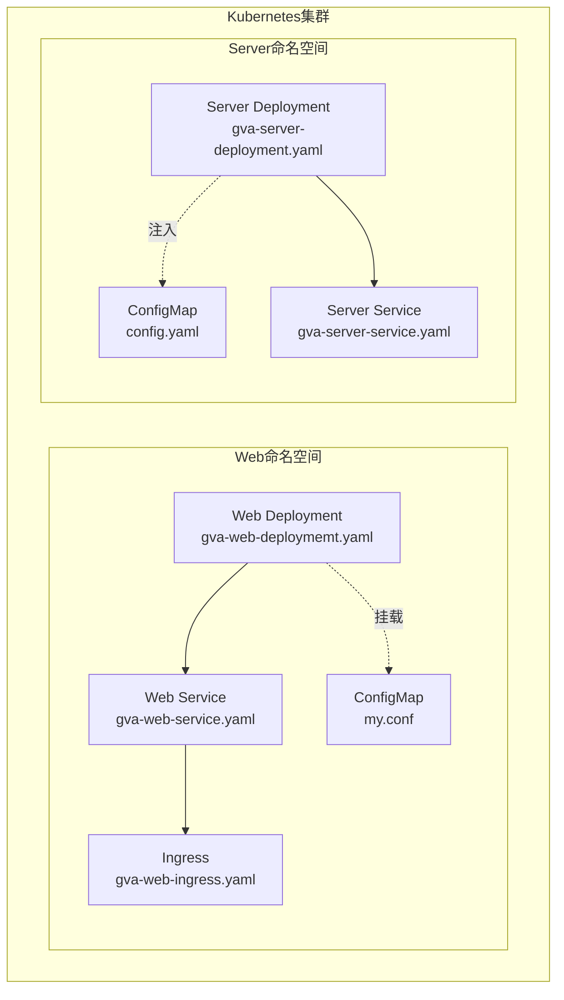
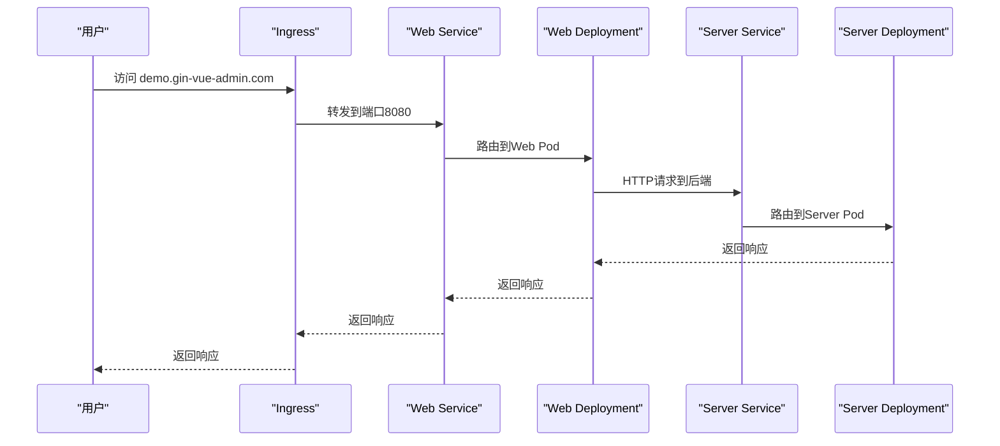
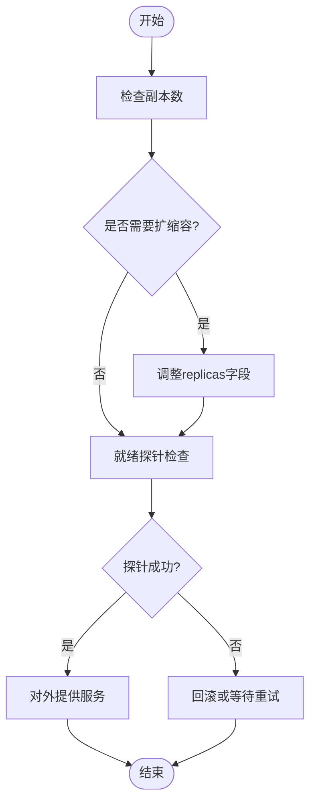
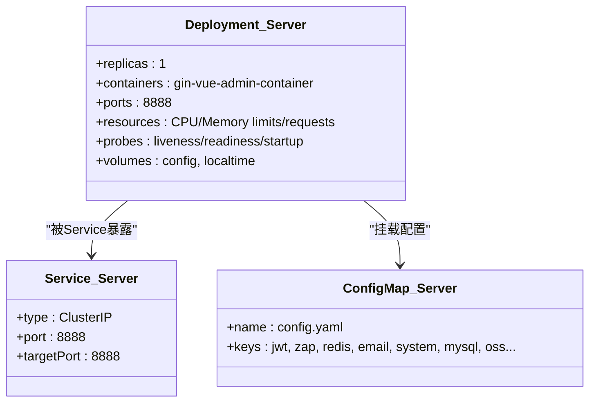
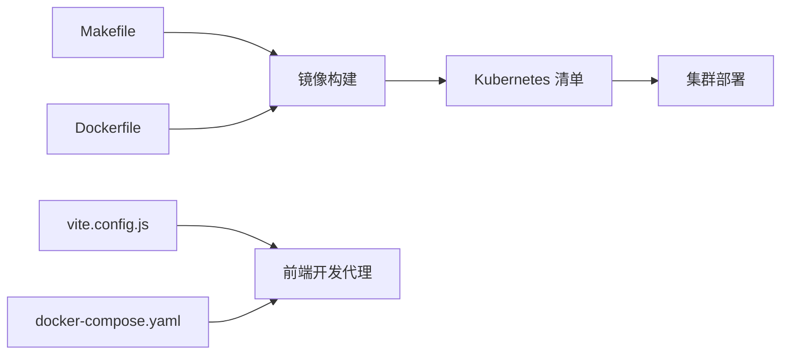

# Kubernetes 集群部署

<cite>
**本文引用的文件**
- [gva-server-deployment.yaml](file://deploy/kubernetes/server/gva-server-deployment.yaml)
- [gva-server-service.yaml](file://deploy/kubernetes/server/gva-server-service.yaml)
- [gva-server-configmap.yaml](file://deploy/kubernetes/server/gva-server-configmap.yaml)
- [gva-web-deploymemt.yaml](file://deploy/kubernetes/web/gva-web-deploymemt.yaml)
- [gva-web-service.yaml](file://deploy/kubernetes/web/gva-web-service.yaml)
- [gva-web-ingress.yaml](file://deploy/kubernetes/web/gva-web-ingress.yaml)
- [gva-web-configmap.yaml](file://deploy/kubernetes/web/gva-web-configmap.yaml)
- [Dockerfile（通用）](file://deploy/docker/Dockerfile)
- [entrypoint.sh](file://deploy/docker/entrypoint.sh)
- [docker-compose.yaml](file://deploy/docker-compose/docker-compose.yaml)
- [Makefile](file://Makefile)
- [Kubernetes集群部署.md](file://repowiki/zh/content/部署运维/Kubernetes集群部署.md)
- [Docker容器化部署.md](file://repowiki/zh/content/部署运维/Docker容器化部署.md)
- [config.docker.yaml](file://server/config.docker.yaml)
- [vite.config.js](file://web/vite.config.js)
</cite>

## 目录
1. [简介](#简介)
2. [项目结构](#项目结构)
3. [核心组件](#核心组件)
4. [架构总览](#架构总览)
5. [详细组件分析](#详细组件分析)
6. [依赖关系分析](#依赖关系分析)
7. [性能与资源规划](#性能与资源规划)
8. [故障排查指南](#故障排查指南)
9. [结论](#结论)
10. [附录](#附录)

## 简介
本文件面向在 Kubernetes 集群中部署“测试管理平台”的工程团队，系统性阐述如何基于现有仓库中的 Kubernetes 清单与 Docker 配置，完成 Deployment、Service、Ingress 等核心资源的配置；说明 Pod 的部署策略、副本数与滚动更新机制；介绍 ConfigMap 的使用、Secret 的安全配置与持久化存储挂载；提供负载均衡、服务发现与网络策略的配置指南；并结合 Makefile 与 Dockerfile 给出 Helm Chart 的使用思路与自动化部署流程建议，最后总结集群扩缩容、资源监控与故障恢复的最佳实践。

## 项目结构
本项目采用“前后端分离 + Docker 多阶段构建 + Kubernetes 原生清单”的部署架构：
- 前端：基于 Vite 构建，产物静态托管于 Nginx 容器，通过 Ingress 对外暴露。
- 后端：Go 服务，通过 Deployment 运行，Service 提供稳定访问入口。
- 配置：后端配置通过 ConfigMap 注入，前端通过 ConfigMap 挂载 Nginx 配置。
- 存储：数据库与缓存使用外部服务或集群内 StatefulSet/Service，本仓库未提供持久卷清单。
- 镜像：通过 Makefile 统一构建，镜像仓库位于阿里云容器镜像服务。

图表来源
- [gva-web-deploymemt.yaml:1-52](file://deploy/kubernetes/web/gva-web-deploymemt.yaml#L1-L52)
- [gva-web-service.yaml:1-22](file://deploy/kubernetes/web/gva-web-service.yaml#L1-L22)
- [gva-web-ingress.yaml:1-18](file://deploy/kubernetes/web/gva-web-ingress.yaml#L1-L18)
- [gva-server-deployment.yaml:1-74](file://deploy/kubernetes/server/gva-server-deployment.yaml#L1-L74)
- [gva-server-service.yaml:1-22](file://deploy/kubernetes/server/gva-server-service.yaml#L1-L22)
- [gva-server-configmap.yaml:1-149](file://deploy/kubernetes/server/gva-server-configmap.yaml#L1-L149)

章节来源
- [gva-web-deploymemt.yaml:1-52](file://deploy/kubernetes/web/gva-web-deploymemt.yaml#L1-L52)
- [gva-web-service.yaml:1-22](file://deploy/kubernetes/web/gva-web-service.yaml#L1-L22)
- [gva-web-ingress.yaml:1-18](file://deploy/kubernetes/web/gva-web-ingress.yaml#L1-L18)
- [gva-server-deployment.yaml:1-74](file://deploy/kubernetes/server/gva-server-deployment.yaml#L1-L74)
- [gva-server-service.yaml:1-22](file://deploy/kubernetes/server/gva-server-service.yaml#L1-L22)
- [gva-server-configmap.yaml:1-149](file://deploy/kubernetes/server/gva-server-configmap.yaml#L1-L149)

## 核心组件
- Web 前端（Nginx）：通过 Deployment 运行，暴露 8080 端口；Service 为 ClusterIP；Ingress 将域名 demo.gin-vue-admin.com 指向 Web Service。
- Server 后端（Go）：通过 Deployment 运行，暴露 8888 端口；Service 为 ClusterIP；通过 ConfigMap 注入 config.yaml。
- 配置管理：Web 侧通过 ConfigMap 挂载 Nginx 配置；Server 侧通过 ConfigMap 注入 config.yaml。
- 镜像与构建：Makefile 统一构建镜像，Dockerfile 定义容器环境与启动脚本。

章节来源
- [gva-web-deploymemt.yaml:1-52](file://deploy/kubernetes/web/gva-web-deploymemt.yaml#L1-L52)
- [gva-web-service.yaml:1-22](file://deploy/kubernetes/web/gva-web-service.yaml#L1-L22)
- [gva-web-ingress.yaml:1-18](file://deploy/kubernetes/web/gva-web-ingress.yaml#L1-L18)
- [gva-server-deployment.yaml:1-74](file://deploy/kubernetes/server/gva-server-deployment.yaml#L1-L74)
- [gva-server-service.yaml:1-22](file://deploy/kubernetes/server/gva-server-service.yaml#L1-L22)
- [gva-server-configmap.yaml:1-149](file://deploy/kubernetes/server/gva-server-configmap.yaml#L1-L149)
- [Makefile:1-76](file://Makefile#L1-L76)
- [Dockerfile（通用）:1-18](file://deploy/docker/Dockerfile#L1-L18)
- [entrypoint.sh:1-19](file://deploy/docker/entrypoint.sh#L1-L19)

## 架构总览
下图展示 Kubernetes 中的流量走向与组件交互：客户端经 Ingress 进入 Web Service，再转发至 Web Pod；Web Pod 通过 HTTP 请求访问 Server Service，最终到达 Server Pod。

图表来源
- [gva-web-ingress.yaml:1-18](file://deploy/kubernetes/web/gva-web-ingress.yaml#L1-L18)
- [gva-web-service.yaml:1-22](file://deploy/kubernetes/web/gva-web-service.yaml#L1-L22)
- [gva-web-deploymemt.yaml:1-52](file://deploy/kubernetes/web/gva-web-deploymemt.yaml#L1-L52)
- [gva-server-service.yaml:1-22](file://deploy/kubernetes/server/gva-server-service.yaml#L1-L22)
- [gva-server-deployment.yaml:1-74](file://deploy/kubernetes/server/gva-server-deployment.yaml#L1-L74)

## 详细组件分析

### Web 前端组件（Nginx）
- Deployment
  - 副本数：1（可按需扩缩容）
  - 容器端口：8080
  - 资源限制与请求：CPU/Memory 限制与请求已配置
  - 就绪探针：TCP 探测 8080 端口
  - 卷挂载：挂载 ConfigMap my.conf 到 /etc/nginx/conf.d/
- Service
  - 类型：ClusterIP
  - 端口：8080，目标端口：8080
- Ingress
  - 类型：nginx
  - 主机：demo.gin-vue-admin.com
  - 路径：/，转发到 gva-web Service 的 8080 端口

图表来源
- [gva-web-deploymemt.yaml:1-52](file://deploy/kubernetes/web/gva-web-deploymemt.yaml#L1-L52)
- [gva-web-service.yaml:1-22](file://deploy/kubernetes/web/gva-web-service.yaml#L1-L22)
- [gva-web-ingress.yaml:1-18](file://deploy/kubernetes/web/gva-web-ingress.yaml#L1-L18)

章节来源
- [gva-web-deploymemt.yaml:1-52](file://deploy/kubernetes/web/gva-web-deploymemt.yaml#L1-L52)
- [gva-web-service.yaml:1-22](file://deploy/kubernetes/web/gva-web-service.yaml#L1-L22)
- [gva-web-ingress.yaml:1-18](file://deploy/kubernetes/web/gva-web-ingress.yaml#L1-L18)

### Server 后端组件（Go）
- Deployment
  - 副本数：1（可按需扩缩容）
  - 容器端口：8888
  - 资源限制与请求：CPU/Memory 限制与请求已配置
  - 探针：存活/就绪/启动探针均针对 8888 端口
  - 卷挂载：挂载 hostPath /etc/localtime；挂载 ConfigMap config.yaml
- Service
  - 类型：ClusterIP
  - 端口：8888，目标端口：8888
- ConfigMap
  - 名称：config.yaml
  - 内容：包含 jwt、zap、redis、email、system、mysql、oss 等配置项

图表来源
- [gva-server-deployment.yaml:1-74](file://deploy/kubernetes/server/gva-server-deployment.yaml#L1-L74)
- [gva-server-service.yaml:1-22](file://deploy/kubernetes/server/gva-server-service.yaml#L1-L22)
- [gva-server-configmap.yaml:1-149](file://deploy/kubernetes/server/gva-server-configmap.yaml#L1-L149)

章节来源
- [gva-server-deployment.yaml:1-74](file://deploy/kubernetes/server/gva-server-deployment.yaml#L1-L74)
- [gva-server-service.yaml:1-22](file://deploy/kubernetes/server/gva-server-service.yaml#L1-L22)
- [gva-server-configmap.yaml:1-149](file://deploy/kubernetes/server/gva-server-configmap.yaml#L1-L149)

### 配置管理（ConfigMap 与 Secret）
- ConfigMap
  - Web 侧：my.conf（Nginx 配置），通过卷挂载到 /etc/nginx/conf.d/
  - Server 侧：config.yaml（应用配置），通过 subPath 挂载到 /go/.../config.docker.yaml
- Secret（建议）
  - 对于敏感配置（如数据库密码、Redis 密码、邮件密钥、OSS 密钥等），应迁移到 Secret，并通过环境变量或 Secret 卷挂载注入，避免硬编码在 ConfigMap 中。

章节来源
- [gva-web-deploymemt.yaml:45-51](file://deploy/kubernetes/web/gva-web-deploymemt.yaml#L45-L51)
- [gva-server-deployment.yaml:31-36](file://deploy/kubernetes/server/gva-server-deployment.yaml#L31-L36)
- [gva-server-configmap.yaml:13-149](file://deploy/kubernetes/server/gva-server-configmap.yaml#L13-L149)

### 滚动更新与发布策略
- Deployment 默认策略为滚动更新（RollingUpdate），可通过 maxUnavailable 与 maxSurge 参数精细化控制更新节奏。
- 建议：
  - 设置合理的探针（存活/就绪/启动）以确保平滑切换。
  - 在高可用场景下，将 replicas 提升至 2 或以上，并结合 PodDisruptionBudget 保障更新期间的服务连续性。

章节来源
- [gva-web-deploymemt.yaml:13-13](file://deploy/kubernetes/web/gva-web-deploymemt.yaml#L13-L13)
- [gva-server-deployment.yaml:13-13](file://deploy/kubernetes/server/gva-server-deployment.yaml#L13-L13)

### 持久化存储与卷
- 当前清单未提供 PersistentVolume/PersistentVolumeClaim，数据库与缓存依赖外部服务或集群内 StatefulSet。
- 如需本地持久化，可在 Server Deployment 中新增 PVC 并挂载到容器路径，同时为 ConfigMap 与数据卷分别管理。

章节来源
- [gva-server-deployment.yaml:68-74](file://deploy/kubernetes/server/gva-server-deployment.yaml#L68-L74)

### 负载均衡与服务发现
- Service 为 ClusterIP，内部服务发现通过 Service DNS 名称（如 gva-web、gva-server）实现。
- 若需对外暴露，可将 Web Service 改为 NodePort 或在 Ingress 中统一入口。

章节来源
- [gva-web-service.yaml:13-14](file://deploy/kubernetes/web/gva-web-service.yaml#L13-L14)
- [gva-server-service.yaml:13-13](file://deploy/kubernetes/server/gva-server-service.yaml#L13-L13)

### 网络策略（NetworkPolicy）
- 可通过 NetworkPolicy 限制入站/出站流量，例如仅允许 Ingress 访问 Web Service，或仅允许 Server 访问特定后端服务。
- 建议为不同命名空间划分 NetworkPolicy，确保最小权限原则。

## 依赖关系分析
- 构建与镜像
  - Makefile 负责前后端构建与镜像推送，镜像仓库位于阿里云容器镜像服务。
  - Dockerfile 定义容器基础环境、安装依赖与启动脚本。
- 前端开发与代理
  - vite.config.js 提供开发代理规则，将 /api 前缀代理到后端服务，便于本地联调。
- Compose 对比
  - docker-compose.yaml 展示了本地多服务编排（Web、Server、MySQL、Redis），可作为 Kubernetes 部署前的对照与验证。

图表来源
- [Makefile:32-64](file://Makefile#L32-L64)
- [Dockerfile（通用）:1-18](file://deploy/docker/Dockerfile#L1-L18)
- [vite.config.js:61-77](file://web/vite.config.js#L61-L77)
- [docker-compose.yaml:16-50](file://deploy/docker-compose/docker-compose.yaml#L16-L50)

章节来源
- [Makefile:1-76](file://Makefile#L1-L76)
- [Dockerfile（通用）:1-18](file://deploy/docker/Dockerfile#L1-L18)
- [entrypoint.sh:1-19](file://deploy/docker/entrypoint.sh#L1-L19)
- [vite.config.js:1-119](file://web/vite.config.js#L1-L119)
- [docker-compose.yaml:1-91](file://deploy/docker-compose/docker-compose.yaml#L1-L91)

## 性能与资源规划
- 资源请求与限制
  - Web：CPU/Memory 请求与限制已配置，建议根据实际流量与并发调优。
  - Server：CPU/Memory 请求与限制已配置，建议结合探针与 HPA 进行弹性伸缩。
- 探针
  - Web：就绪探针检查 8080 端口。
  - Server：存活/就绪/启动探针检查 8888 端口，初始延迟与周期合理。
- 滚动更新
  - 建议设置 maxUnavailable 与 maxSurge，确保更新过程中的稳定性。
- HPA（水平自动伸缩）
  - 可基于 CPU/内存或自定义指标对 Deployment 进行 HPA 配置，实现弹性扩容。

## 故障排查指南
- Pod 无法就绪
  - 检查就绪探针配置与端口是否正确。
  - 查看 Pod 事件与日志，确认容器内进程是否正常启动。
- 服务不可达
  - 检查 Service 选择器与标签是否匹配 Deployment。
  - 确认 Ingress 主机与路径配置正确，且 Ingress 控制器已部署。
- 配置不生效
  - 确认 ConfigMap 键名与挂载路径一致，subPath 是否正确。
  - 对于敏感配置，优先使用 Secret 并校验权限。
- 启动失败
  - 检查启动探针与初始延迟，确认应用监听端口与探针端口一致。
  - 查看容器日志定位错误原因。

章节来源
- [gva-web-deploymemt.yaml:31-37](file://deploy/kubernetes/web/gva-web-deploymemt.yaml#L31-L37)
- [gva-server-deployment.yaml:44-65](file://deploy/kubernetes/server/gva-server-deployment.yaml#L44-L65)
- [gva-web-ingress.yaml:9-18](file://deploy/kubernetes/web/gva-web-ingress.yaml#L9-L18)

## 结论
本仓库提供了完整的 Kubernetes 部署清单与 Docker 构建链路，能够支撑测试管理平台在集群中的稳定运行。建议在生产环境中进一步完善：
- 将敏感配置迁移至 Secret；
- 引入 HPA 与资源优化；
- 增加 NetworkPolicy 与安全组策略；
- 使用 Helm Chart 标准化部署与版本管理；
- 结合 Prometheus/Grafana 进行监控与告警。

## 附录

### 部署步骤（基于现有清单）
- 准备镜像
  - 使用 Makefile 构建镜像并推送到镜像仓库。
- 应用清单
  - 先创建 ConfigMap，再应用 Deployment 与 Service，最后应用 Ingress。
- 验证
  - 检查 Pod 状态、Service 端点与 Ingress 路由。

章节来源
- [Makefile:32-64](file://Makefile#L32-L64)
- [gva-server-configmap.yaml:1-149](file://deploy/kubernetes/server/gva-server-configmap.yaml#L1-L149)
- [gva-web-deploymemt.yaml:1-52](file://deploy/kubernetes/web/gva-web-deploymemt.yaml#L1-L52)
- [gva-web-service.yaml:1-22](file://deploy/kubernetes/web/gva-web-service.yaml#L1-L22)
- [gva-web-ingress.yaml:1-18](file://deploy/kubernetes/web/gva-web-ingress.yaml#L1-L18)

### Helm Chart 使用建议
- Chart 结构
  - 将现有清单拆分为 templates 目录下的 Deployment、Service、Ingress、ConfigMap、Secret 等模板。
  - 使用 values.yaml 集中管理镜像、副本数、资源、探针等参数。
- 自动化
  - 在 CI/CD 中集成 helm upgrade --install，实现一键部署与回滚。
- 安全
  - 将敏感配置放入 Secret，并通过 helm secrets 或外部密管集成。

### 扩缩容与监控最佳实践
- 扩缩容
  - 通过 kubectl scale 或 Helm 升级调整 replicas；结合 HPA 实现自动扩缩。
- 监控
  - 部署 Prometheus Operator 与 Grafana，采集 Pod 指标与 Ingress 访问日志。
- 故障恢复
  - 使用 Deployment 的滚动更新与 PodDisruptionBudget 保障高可用；定期备份 ConfigMap 与 Secret。