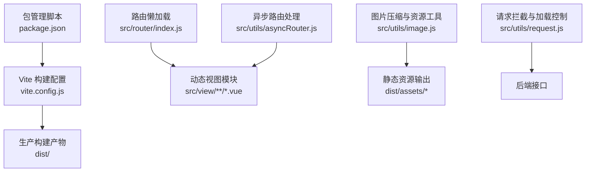
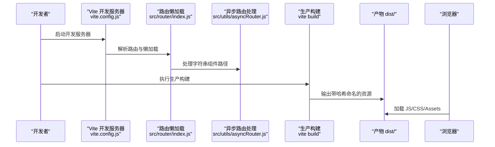
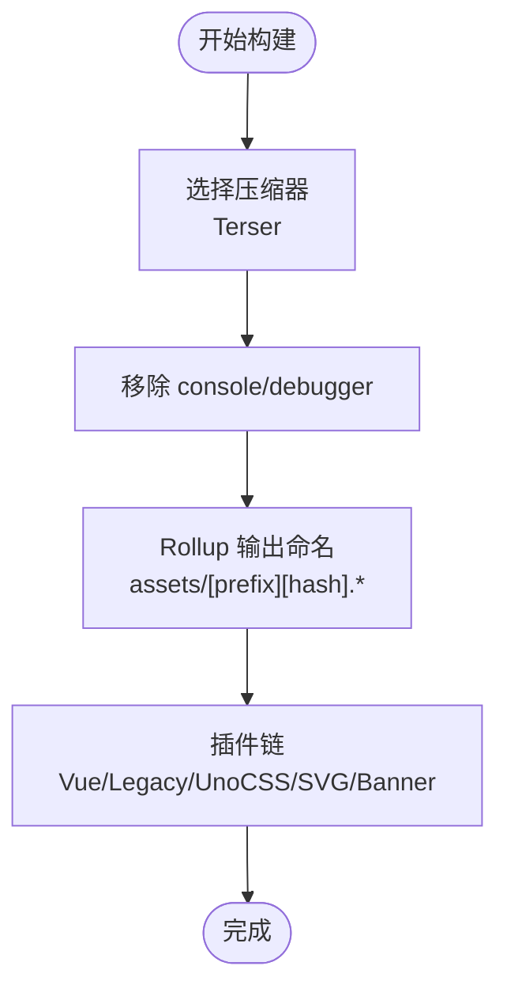
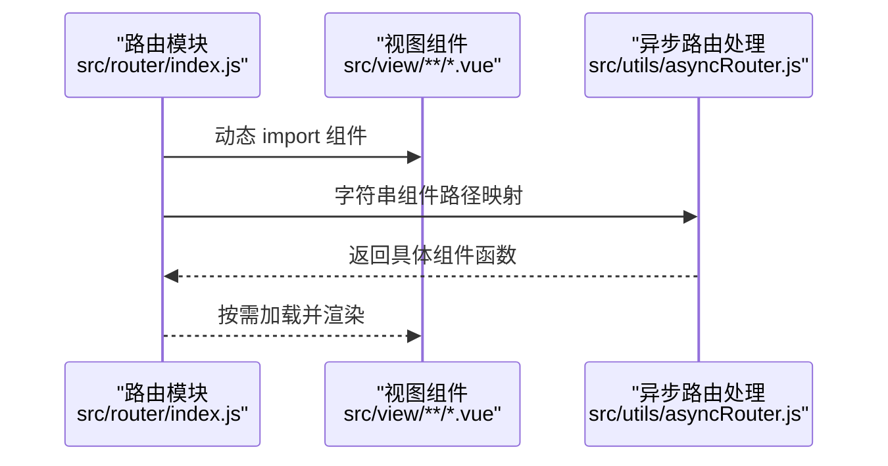
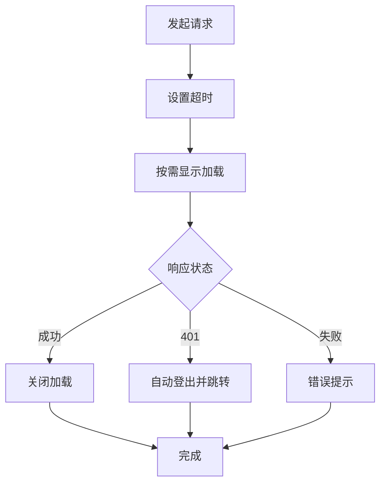
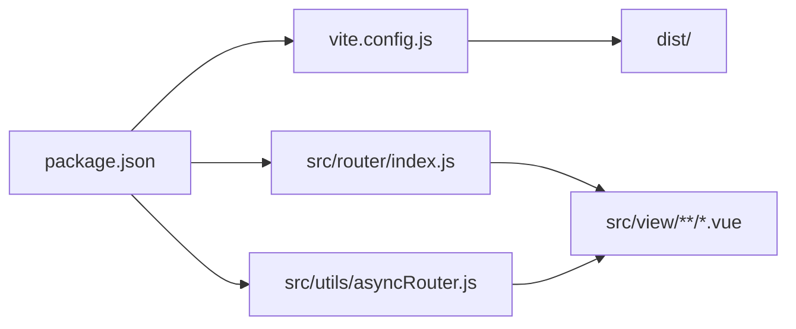

# 前端性能优化

<cite>
**本文引用的文件**
- [vite.config.js](file://web/vite.config.js)
- [package.json](file://web/package.json)
- [.prettierrc](file://web/.prettierrc)
- [eslint.config.mjs](file://web/eslint.config.mjs)
- [babel.config.js](file://web/babel.config.js)
- [index.js（路由）](file://web/src/router/index.js)
- [main.js](file://web/src/main.js)
- [asyncRouter.js](file://web/src/utils/asyncRouter.js)
- [image.js](file://web/src/utils/image.js)
- [request.js](file://web/src/utils/request.js)
- [config.js（核心配置）](file://web/src/core/config.js)
- [gin-vue-admin.js（核心安装器）](file://web/src/core/gin-vue-admin.js)
- [index.vue（布局）](file://web/src/view/layout/index.vue)
</cite>

## 目录
1. [引言](#引言)
2. [项目结构](#项目结构)
3. [核心组件](#核心组件)
4. [架构总览](#架构总览)
5. [详细组件分析](#详细组件分析)
6. [依赖分析](#依赖分析)
7. [性能考量](#性能考量)
8. [故障排查指南](#故障排查指南)
9. [结论](#结论)
10. [附录](#附录)

## 引言
本技术文档聚焦于前端性能优化，结合 Gin-Vue-Admin 前端工程的实际配置与实现，系统讲解以下主题：
- Vite 生产构建优化：构建配置、Terser 压缩、代码分割与 Tree Shaking 策略
- 懒加载与路由优化：路由级懒加载、组件级异步导入、图片与富文本按需加载
- 浏览器缓存策略：HTTP 缓存头、ETag/Last-Modified、CDN 缓存
- 静态资源优化：资源压缩、Gzip/Brotli、资源版本管理
- 前端监控与性能测试：Lighthouse 分析、Web Vitals 指标监控、性能基准测试

## 项目结构
前端工程位于 web 目录，采用 Vite 作为构建工具，Vue 3 + Vue Router + Pinia 的现代前端技术栈。关键目录与文件如下：
- 构建与工具：vite.config.js、package.json、.prettierrc、eslint.config.mjs、babel.config.js
- 应用入口：src/main.js、src/App.vue
- 路由与权限：src/router/index.js、src/permission.js
- 性能相关工具：src/utils/asyncRouter.js、src/utils/image.js、src/utils/request.js
- 核心配置：src/core/config.js、src/core/gin-vue-admin.js
- 布局与页面：src/view/layout/index.vue 及各页面组件

图表来源
- [vite.config.js:80-95](file://web/vite.config.js#L80-L95)
- [package.json:5-12](file://web/package.json#L5-L12)
- [index.js（路由）:1-42](file://web/src/router/index.js#L1-L42)
- [asyncRouter.js:1-30](file://web/src/utils/asyncRouter.js#L1-L30)
- [image.js:1-127](file://web/src/utils/image.js#L1-L127)
- [request.js:1-232](file://web/src/utils/request.js#L1-L232)

章节来源
- [vite.config.js:1-119](file://web/vite.config.js#L1-L119)
- [package.json:1-88](file://web/package.json#L1-L88)
- [index.js（路由）:1-42](file://web/src/router/index.js#L1-L42)
- [asyncRouter.js:1-30](file://web/src/utils/asyncRouter.js#L1-L30)
- [image.js:1-127](file://web/src/utils/image.js#L1-L127)
- [request.js:1-232](file://web/src/utils/request.js#L1-L232)

## 核心组件
- Vite 构建配置：集中于 vite.config.js，包含别名、插件、构建参数、Rollup 输出命名、代理与服务器配置等
- 路由懒加载：通过动态 import 实现路由级懒加载，减少首屏体积
- 异步路由处理：基于 import.meta.glob 动态收集视图模块，支持字符串组件路径映射
- 图片与富文本按需加载：提供图片压缩类与 MIME 类型判断，配合组件按需渲染
- 请求与加载控制：统一 Axios 服务，内置加载提示与超时控制，避免阻塞与资源浪费
- 核心配置与安装器：全局配置与启动日志，便于调试与性能观察

章节来源
- [vite.config.js:15-118](file://web/vite.config.js#L15-L118)
- [index.js（路由）:1-42](file://web/src/router/index.js#L1-L42)
- [asyncRouter.js:1-30](file://web/src/utils/asyncRouter.js#L1-L30)
- [image.js:1-127](file://web/src/utils/image.js#L1-L127)
- [request.js:1-232](file://web/src/utils/request.js#L1-L232)
- [config.js（核心配置）:15-56](file://web/src/core/config.js#L15-L56)
- [gin-vue-admin.js:9-30](file://web/src/core/gin-vue-admin.js#L9-L30)

## 架构总览
下图展示从开发到生产的整体流程，以及与性能优化相关的关键节点。

图表来源
- [vite.config.js:57-79](file://web/vite.config.js#L57-L79)
- [index.js（路由）:1-42](file://web/src/router/index.js#L1-L42)
- [asyncRouter.js:1-30](file://web/src/utils/asyncRouter.js#L1-L30)
- [package.json:8](file://web/package.json#L8)

## 详细组件分析

### Vite 构建优化
- 生产构建配置
  - 压缩：minify 使用 Terser，开启 drop_console 与 drop_debugger，降低包体积并移除调试信息
  - Source Map：关闭以减少构建时间与产物体积
  - Manifest：关闭以避免额外开销
  - 输出命名：Rollup 输出统一前缀与哈希，利于浏览器缓存与版本管理
- 代码分割与 Tree Shaking
  - 通过动态 import 将路由与视图拆分为独立 chunk，实现按需加载
  - 保持 ES Module 导出风格，配合打包器进行死代码消除
- 插件生态
  - Vue、Legacy、UnoCSS、SVG 自动导入、Banner、路径信息等插件协同工作
  - 开发工具：Vue DevTools（条件启用）
- 依赖预优化
  - optimizeDeps 留空，交由 Vite 默认策略处理

图表来源
- [vite.config.js:80-95](file://web/vite.config.js#L80-L95)
- [vite.config.js:31-37](file://web/vite.config.js#L31-L37)
- [vite.config.js:96-115](file://web/vite.config.js#L96-L115)

章节来源
- [vite.config.js:80-95](file://web/vite.config.js#L80-L95)
- [vite.config.js:31-37](file://web/vite.config.js#L31-L37)
- [vite.config.js:96-115](file://web/vite.config.js#L96-L115)

### 懒加载与路由优化
- 路由级懒加载
  - 使用动态 import 包裹组件，实现路由切换时才加载对应模块
  - 静态路由中示例：登录页、初始化页、错误页均采用懒加载
- 组件级异步导入
  - import.meta.glob 收集视图与插件模块，支持字符串路径映射为实际组件
  - 递归处理子路由，确保深层级路由同样受益
- 图片与富文本按需加载
  - 图片压缩类在客户端侧进行等比缩放与数据转换，降低上传与渲染压力
  - 提供 MIME 类型判断，便于按需渲染视频/图片内容

图表来源
- [index.js（路由）:1-42](file://web/src/router/index.js#L1-L42)
- [asyncRouter.js:1-30](file://web/src/utils/asyncRouter.js#L1-L30)

章节来源
- [index.js（路由）:1-42](file://web/src/router/index.js#L1-L42)
- [asyncRouter.js:1-30](file://web/src/utils/asyncRouter.js#L1-L30)
- [image.js:1-127](file://web/src/utils/image.js#L1-L127)

### 请求与加载控制（性能影响点）
- 统一超时与加载提示
  - 默认请求超时较长，避免网络波动导致频繁失败
  - 按需显示加载提示，避免重复叠加与长时间阻塞
- 错误处理与资源回收
  - 401 自动登出与路由跳转，防止无效请求占用资源
  - 页面卸载时重置加载状态，避免内存泄漏
- 对性能的意义
  - 合理的加载控制减少无意义的重绘与请求堆积
  - 统一的错误提示提升用户体验，间接改善感知性能

图表来源
- [request.js:119-223](file://web/src/utils/request.js#L119-L223)

章节来源
- [request.js:1-232](file://web/src/utils/request.js#L1-L232)

### 布局与 Keep-Alive（缓存与复用）
- 布局组件通过 keep-alive 与路由 store 的 keepAlive 列表实现页面级缓存
- 结合 reload 机制，在需要刷新时进行局部重载，避免整页重建
- 对性能的意义
  - 减少重复渲染与组件销毁/挂载成本
  - 在移动端与低端设备上显著提升切换流畅度

章节来源
- [index.vue（布局）:33-47](file://web/src/view/layout/index.vue#L33-L47)
- [index.vue（布局）:101-115](file://web/src/view/layout/index.vue#L101-L115)

## 依赖分析
- 构建与开发工具
  - Vite、@vitejs/plugin-vue、@vitejs/plugin-legacy、UnoCSS、vite-plugin-vue-devtools 等
  - Terser 作为压缩器，ESLint、Prettier 保证代码质量
- 运行时依赖
  - Vue 3、Vue Router、Pinia、Element Plus、axios 等
- 关键耦合点
  - 路由懒加载依赖动态 import；异步路由处理依赖 import.meta.glob；构建产物命名由 Rollup 输出规则决定

图表来源
- [package.json:14-86](file://web/package.json#L14-L86)
- [vite.config.js:15-118](file://web/vite.config.js#L15-L118)
- [index.js（路由）:1-42](file://web/src/router/index.js#L1-L42)
- [asyncRouter.js:1-30](file://web/src/utils/asyncRouter.js#L1-L30)

章节来源
- [package.json:14-86](file://web/package.json#L14-L86)
- [vite.config.js:15-118](file://web/vite.config.js#L15-L118)
- [index.js（路由）:1-42](file://web/src/router/index.js#L1-L42)
- [asyncRouter.js:1-30](file://web/src/utils/asyncRouter.js#L1-L30)

## 性能考量
- 构建与压缩
  - 使用 Terser 并开启 drop_console/drop_debugger，建议在生产环境保持该策略
  - 关闭 sourcemap 与 manifest，减少构建与传输开销
  - 通过 Rollup 输出命名加入哈希，提升缓存命中率
- 代码分割与 Tree Shaking
  - 路由与视图采用动态 import，确保按需加载
  - 保持 ES Module 导出风格，避免打包器无法识别的副作用
- 懒加载与按需渲染
  - 路由级懒加载与组件级异步导入相结合，降低首屏体积
  - 图片压缩与 MIME 判断减少不必要的渲染与下载
- 请求与加载控制
  - 合理的超时与加载提示，避免长时间阻塞
  - 401 自动登出与资源回收，减少无效请求
- 缓存策略（建议）
  - 静态资源（JS/CSS/Assets）：强缓存 + 哈希版本号
  - HTML：短缓存或不缓存，确保更新及时
  - API：合理设置 Cache-Control 与 ETag/Last-Modified
  - CDN：分层缓存与回源策略，边缘节点加速
- 监控与测试（建议）
  - Lighthouse：定期跑分，关注 Largest Contentful Paint、Cumulative Layout Shift、First Input Delay 等指标
  - Web Vitals：在生产环境埋点，持续观测真实用户性能
  - 基准测试：使用浏览器性能面板与 Network 面板对比不同优化策略的效果

## 故障排查指南
- 构建失败或内存不足
  - 使用 limit-build 脚本提升 Node 内存限制后再构建
- 路由懒加载异常
  - 确认动态 import 路径正确，检查 import.meta.glob 是否能匹配到目标文件
- 加载提示卡住
  - 检查请求拦截器中的超时与强制关闭逻辑，确保异常分支能触发关闭
- 缓存问题
  - 确认 Rollup 输出命名包含哈希，浏览器缓存策略与 CDN 配置一致
- ESLint/Prettier 不生效
  - 检查配置文件语法与忽略规则是否覆盖到目标文件

章节来源
- [package.json:8-11](file://web/package.json#L8-L11)
- [index.js（路由）:1-42](file://web/src/router/index.js#L1-L42)
- [asyncRouter.js:1-30](file://web/src/utils/asyncRouter.js#L1-L30)
- [request.js:19-54](file://web/src/utils/request.js#L19-L54)
- [vite.config.js:31-37](file://web/vite.config.js#L31-L37)
- [eslint.config.mjs:25-29](file://web/eslint.config.mjs#L25-L29)
- [.prettierrc:1-13](file://web/.prettierrc#L1-L13)

## 结论
本项目在前端性能优化方面已具备良好基础：合理的 Vite 构建配置、路由与组件级懒加载、统一的请求与加载控制，以及可扩展的缓存与监控空间。建议在生产环境中进一步完善缓存策略与监控体系，持续通过 Lighthouse 与 Web Vitals 指标驱动优化迭代。

## 附录
- 开发与构建命令参考
  - 开发：npm run dev 或 npm run serve
  - 生产构建：npm run build
  - 限制内存构建：npm run limit-build
- 关键配置参考
  - 构建参数与输出命名：见 vite.config.js build 与 rollupOptions
  - 路由懒加载：见 src/router/index.js
  - 异步路由处理：见 src/utils/asyncRouter.js
  - 请求拦截与加载控制：见 src/utils/request.js
  - 核心配置与安装器：见 src/core/config.js、src/core/gin-vue-admin.js