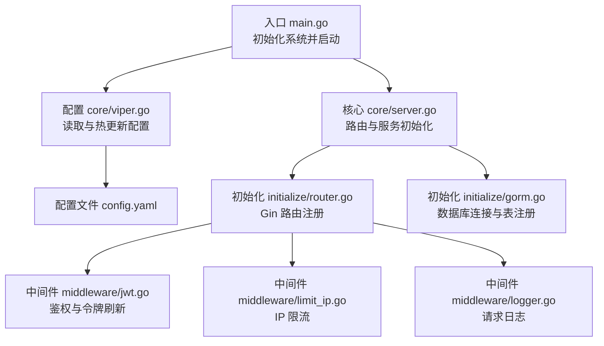
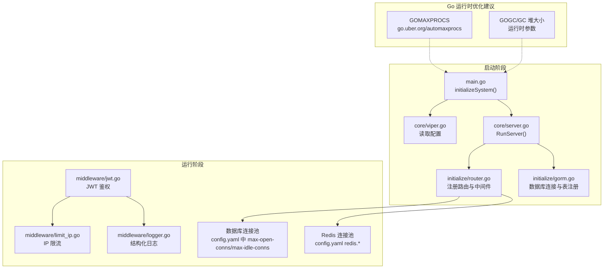
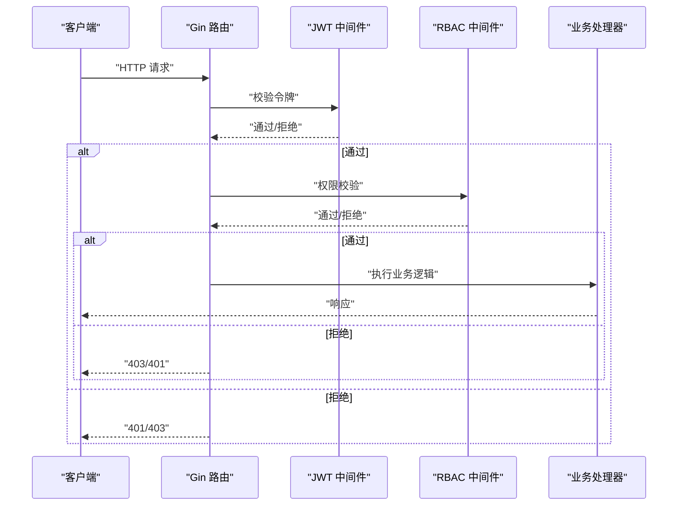
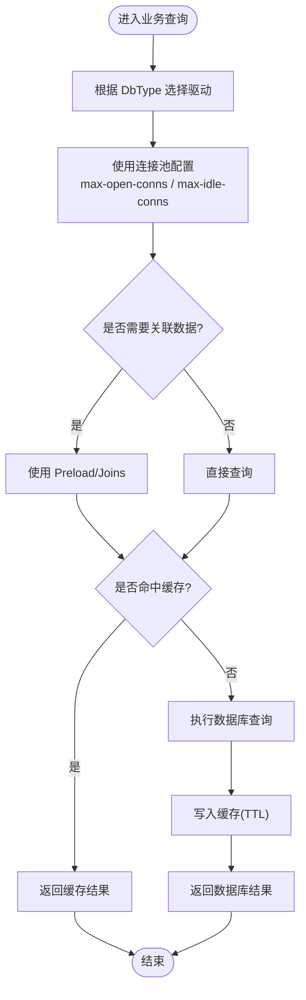
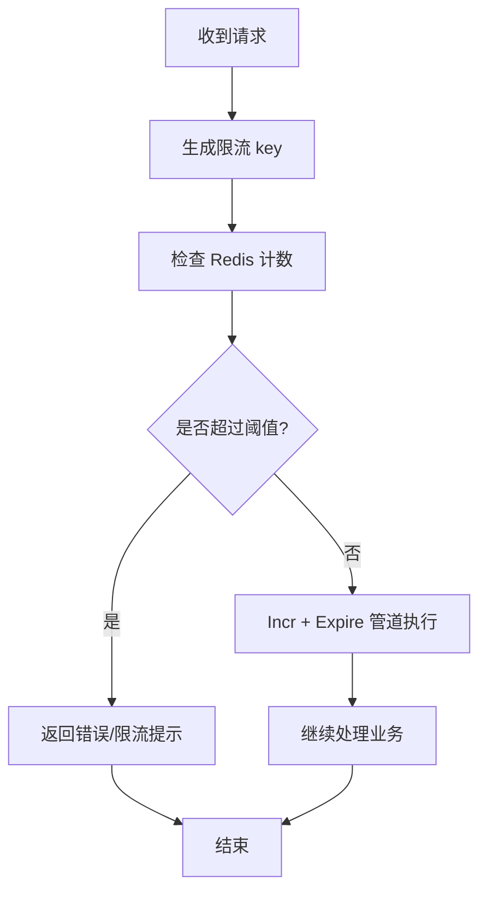
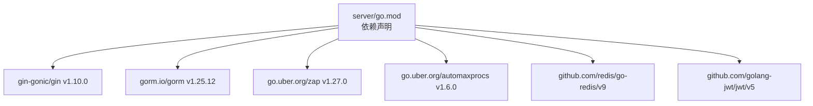

# 后端性能调优

<cite>
**本文引用的文件**
- [server/main.go](file://server/main.go)
- [server/go.mod](file://server/go.mod)
- [server/config.yaml](file://server/config.yaml)
- [server/core/server.go](file://server/core/server.go)
- [server/core/viper.go](file://server/core/viper.go)
- [server/config/config.go](file://server/config/config.go)
- [server/config/system.go](file://server/config/system.go)
- [server/config/gorm_mysql.go](file://server/config/gorm_mysql.go)
- [server/config/gorm_pgsql.go](file://server/config/gorm_pgsql.go)
- [server/config/redis.go](file://server/config/redis.go)
- [server/middleware/jwt.go](file://server/middleware/jwt.go)
- [server/middleware/limit_ip.go](file://server/middleware/limit_ip.go)
- [server/middleware/logger.go](file://server/middleware/logger.go)
- [server/initialize/gorm.go](file://server/initialize/gorm.go)
- [server/initialize/router.go](file://server/initialize/router.go)
</cite>

## 目录
1. [引言](#引言)
2. [项目结构](#项目结构)
3. [核心组件](#核心组件)
4. [架构总览](#架构总览)
5. [详细组件分析](#详细组件分析)
6. [依赖分析](#依赖分析)
7. [性能考量](#性能考量)
8. [故障排查指南](#故障排查指南)
9. [结论](#结论)
10. [附录](#附录)

## 引言
本文件面向后端性能调优，结合 Gin-Vue-Admin 项目的实际代码，系统梳理 Go 应用性能优化要点：包括 GOMAXPROCS 与 GC 参数设置建议、内存分配与 GC 堆大小配置思路、Gin 框架性能优化（路由与中间件）、GORM 查询优化（预加载、批量与缓存）、并发优化（goroutine 与 channel 最佳实践、限流器实现），以及性能监控与分析（pprof、trace、指标采集与基准测试）。

## 项目结构
该项目采用分层清晰的组织方式：
- 入口与启动：main.go 负责初始化系统并启动服务；core/server.go 负责路由与服务初始化。
- 配置体系：config.yaml 提供运行时配置；core/viper.go 负责读取与热更新；config/*.go 定义配置结构体。
- 中间件：middleware/* 提供 JWT、限流、日志等通用能力。
- 初始化：initialize/* 负责数据库、路由、定时任务等初始化流程。
- 路由与控制器：router/* 与 api/v1/* 组织业务路由与接口。

**图表来源**
- [server/main.go:30-52](file://server/main.go#L30-L52)
- [server/core/server.go:14-48](file://server/core/server.go#L14-L48)
- [server/core/viper.go:17-42](file://server/core/viper.go#L17-L42)
- [server/config.yaml:1-284](file://server/config.yaml#L1-L284)
- [server/initialize/router.go:36-117](file://server/initialize/router.go#L36-L117)
- [server/initialize/gorm.go:14-87](file://server/initialize/gorm.go#L14-L87)
- [server/middleware/jwt.go:16-77](file://server/middleware/jwt.go#L16-L77)
- [server/middleware/limit_ip.go:27-62](file://server/middleware/limit_ip.go#L27-L62)
- [server/middleware/logger.go:41-89](file://server/middleware/logger.go#L41-L89)

**章节来源**
- [server/main.go:30-52](file://server/main.go#L30-L52)
- [server/core/server.go:14-48](file://server/core/server.go#L14-L48)
- [server/core/viper.go:17-42](file://server/core/viper.go#L17-L42)
- [server/config.yaml:1-284](file://server/config.yaml#L1-L284)
- [server/initialize/router.go:36-117](file://server/initialize/router.go#L36-L117)
- [server/initialize/gorm.go:14-87](file://server/initialize/gorm.go#L14-L87)
- [server/middleware/jwt.go:16-77](file://server/middleware/jwt.go#L16-L77)
- [server/middleware/limit_ip.go:27-62](file://server/middleware/limit_ip.go#L27-L62)
- [server/middleware/logger.go:41-89](file://server/middleware/logger.go#L41-L89)

## 核心组件
- 启动与初始化：main.go 调用 initializeSystem 完成 Viper、日志、数据库、定时任务、全局函数注册与表初始化；随后 core.RunServer 启动服务。
- 配置系统：core/viper.go 依据 Gin 模式与环境变量选择配置文件，支持热更新；config/*.go 定义结构体映射。
- 中间件：JWTAuth 实现令牌校验与刷新；Limit_IP 基于 Redis 实现周期限流；Logger 提供结构化日志。
- 初始化流程：initialize/router.go 注册路由与中间件；initialize/gorm.go 根据 DbType 选择数据库驱动并注册表。

**章节来源**
- [server/main.go:30-52](file://server/main.go#L30-L52)
- [server/core/viper.go:17-42](file://server/core/viper.go#L17-L42)
- [server/config/config.go:1-41](file://server/config/config.go#L1-L41)
- [server/config/system.go:1-16](file://server/config/system.go#L1-L16)
- [server/middleware/jwt.go:16-77](file://server/middleware/jwt.go#L16-L77)
- [server/middleware/limit_ip.go:27-62](file://server/middleware/limit_ip.go#L27-L62)
- [server/middleware/logger.go:41-89](file://server/middleware/logger.go#L41-L89)
- [server/initialize/router.go:36-117](file://server/initialize/router.go#L36-L117)
- [server/initialize/gorm.go:14-87](file://server/initialize/gorm.go#L14-L87)

## 架构总览
下图展示启动与运行阶段的关键交互，以及性能相关配置点（如 GOMAXPROCS、GC、Redis、数据库连接池）。

**图表来源**
- [server/main.go:30-52](file://server/main.go#L30-L52)
- [server/core/server.go:14-48](file://server/core/server.go#L14-L48)
- [server/core/viper.go:17-42](file://server/core/viper.go#L17-L42)
- [server/config.yaml:74-160](file://server/config.yaml#L74-L160)
- [server/middleware/jwt.go:16-77](file://server/middleware/jwt.go#L16-L77)
- [server/middleware/limit_ip.go:27-62](file://server/middleware/limit_ip.go#L27-L62)
- [server/middleware/logger.go:41-89](file://server/middleware/logger.go#L41-L89)
- [server/initialize/router.go:36-117](file://server/initialize/router.go#L36-L117)
- [server/initialize/gorm.go:14-87](file://server/initialize/gorm.go#L14-L87)

## 详细组件分析

### Gin 框架性能优化
- 路由与中间件设计
  - 路由注册集中在 initialize/router.go，公共中间件（如 Recovery、Logger）按需启用；私有路由组使用 JWT 与 Casbin 中间件链。
  - 建议：将高成本中间件（如鉴权、日志）置于链路靠后位置，减少对快速失败路径的影响；对静态资源与健康检查路由避免不必要的中间件。
- 请求处理优化
  - middleware/logger.go 提供结构化日志，支持 Body 过滤与关键字脱敏，降低敏感信息泄露风险。
  - middleware/jwt.go 在令牌即将过期时自动刷新并写入响应头，减少客户端重复认证开销。
- 并发处理策略
  - Gin 默认并发安全；建议结合限流中间件 middleware/limit_ip.go 控制突发流量，避免下游数据库与 Redis 压力过大。

**图表来源**
- [server/initialize/router.go:65-105](file://server/initialize/router.go#L65-L105)
- [server/middleware/jwt.go:16-77](file://server/middleware/jwt.go#L16-L77)

**章节来源**
- [server/initialize/router.go:36-117](file://server/initialize/router.go#L36-L117)
- [server/middleware/jwt.go:16-77](file://server/middleware/jwt.go#L16-L77)
- [server/middleware/logger.go:41-89](file://server/middleware/logger.go#L41-L89)
- [server/middleware/limit_ip.go:27-62](file://server/middleware/limit_ip.go#L27-L62)

### GORM 查询优化
- 连接池与数据库类型
  - initialize/gorm.go 根据 DbType 选择数据库驱动，并在 config.yaml 中配置 max-open-conns 与 max-idle-conns，直接影响并发与资源占用。
  - config/gorm_mysql.go 与 config/gorm_pgsql.go 提供 DSN 生成，便于统一管理连接参数。
- 预加载与批量操作
  - 建议：对关联查询使用 Preload/Joins 减少 N+1；批量插入/更新使用原生 SQL 或 gorm 的 Debug(false) 与事务批处理，避免逐条提交。
- 查询缓存
  - 可结合 Redis（config/redis.go）作为查询结果缓存层，对热点数据设置 TTL，降低数据库压力。

**图表来源**
- [server/initialize/gorm.go:14-35](file://server/initialize/gorm.go#L14-L35)
- [server/config/gorm_mysql.go:7-9](file://server/config/gorm_mysql.go#L7-L9)
- [server/config/gorm_pgsql.go:9-17](file://server/config/gorm_pgsql.go#L9-L17)
- [server/config.yaml:101-160](file://server/config.yaml#L101-L160)
- [server/config/redis.go:1-11](file://server/config/redis.go#L1-L11)

**章节来源**
- [server/initialize/gorm.go:14-87](file://server/initialize/gorm.go#L14-L87)
- [server/config/gorm_mysql.go:1-10](file://server/config/gorm_mysql.go#L1-L10)
- [server/config/gorm_pgsql.go:1-18](file://server/config/gorm_pgsql.go#L1-L18)
- [server/config/redis.go:1-11](file://server/config/redis.go#L1-L11)
- [server/config.yaml:101-160](file://server/config.yaml#L101-L160)

### 并发优化技术
- goroutine 使用最佳实践
  - 使用 worker pool 或带缓冲 channel 控制并发度，避免无界增长；对共享资源使用互斥锁或原子操作。
- channel 通信优化
  - 选择合适缓冲区大小；避免阻塞发送/接收；使用 context 控制超时与取消。
- 限流器实现
  - middleware/limit_ip.go 提供基于 Redis 的周期限流，建议结合令牌桶或漏桶算法提升公平性与抗突发能力。

**图表来源**
- [server/middleware/limit_ip.go:64-92](file://server/middleware/limit_ip.go#L64-L92)

**章节来源**
- [server/middleware/limit_ip.go:27-62](file://server/middleware/limit_ip.go#L27-L62)
- [server/middleware/limit_ip.go:64-92](file://server/middleware/limit_ip.go#L64-L92)

### 性能监控与分析
- pprof 性能分析
  - 在 Gin 路由中挂载 pprof 路由，或在启动时动态启用；结合 CPU/Heap/Block/Trace 分析定位热点。
- trace 跟踪
  - 使用 Go runtime/trace 记录运行轨迹，分析调度与 GC 影响。
- 指标采集
  - 结合 Prometheus 采集请求耗时、QPS、错误率、连接池使用率、Redis 命中率等。
- 基准测试
  - 使用 testing.B 编写接口基准测试，覆盖关键路径（鉴权、查询、写入）。

[本节为通用指导，无需特定文件引用]

## 依赖分析
- 运行时与框架
  - Gin v1.10.0、GORM v1.25.12、Zap v1.27.0、automaxprocs v1.6.0。
- 数据库与连接池
  - MySQL、Postgres、SQLServer、Oracle、SQLite 驱动；通过 config.yaml 控制连接池参数。
- 缓存与中间件
  - Redis 客户端；JWT、CORS、限流、日志等中间件。

**图表来源**
- [server/go.mod:7-61](file://server/go.mod#L7-L61)

**章节来源**
- [server/go.mod:1-208](file://server/go.mod#L1-L208)

## 性能考量
- GOMAXPROCS 设置
  - 项目引入 go.uber.org/automaxprocs，自动根据 cgroup/调度器设置最优 P 数量；建议在容器环境中确保 CPU 资源可见性。
- GOGC 与 GC 堆大小
  - 通过运行时参数调整 GOGC 与 GOGCEVENT（事件触发）；在高吞吐场景适度提高 GOGC 降低 STW 频率，但需平衡内存占用。
- 内存分配优化
  - 复用对象池、避免大对象频繁分配、减少字符串拼接与反射；使用结构化日志减少 JSON 编码开销。
- 数据库连接池
  - 根据峰值并发与数据库承载能力调整 max-open-conns 与 max-idle-conns；开启连接生命周期管理（max-lifetime）。
- Redis 连接池
  - 合理设置连接池大小与超时；使用 Pipeline 批量执行命令；对热点键设置 TTL 与过期策略。

**章节来源**
- [server/main.go:7](file://server/main.go#L7)
- [server/config.yaml:101-160](file://server/config.yaml#L101-L160)
- [server/config/redis.go:1-11](file://server/config/redis.go#L1-L11)

## 故障排查指南
- 配置热更新异常
  - 检查 core/viper.go 的 OnConfigChange 回调与 Unmarshal 流程；确认 config.yaml 路径与权限。
- JWT 令牌问题
  - middleware/jwt.go 中检查令牌解析、黑名单与刷新逻辑；关注 BufferTime 与过期时间设置。
- 限流不生效
  - middleware/limit_ip.go 依赖 Redis；确认 Redis 连接、管道执行与 TTL 设置。
- 路由未生效或中间件未执行
  - 检查 initialize/router.go 中路由组与中间件顺序；确认 RouterPrefix 与跨域配置。

**章节来源**
- [server/core/viper.go:29-37](file://server/core/viper.go#L29-L37)
- [server/middleware/jwt.go:16-77](file://server/middleware/jwt.go#L16-L77)
- [server/middleware/limit_ip.go:44-53](file://server/middleware/limit_ip.go#L44-L53)
- [server/initialize/router.go:65-105](file://server/initialize/router.go#L65-L105)

## 结论
通过合理的运行时参数、中间件链路设计、数据库与缓存连接池配置，以及完善的监控与基准测试体系，可显著提升 Gin-Vue-Admin 的后端性能与稳定性。建议在生产环境逐步验证各项优化措施，并持续以指标与 trace 为依据迭代调优。

## 附录
- 配置文件位置与优先级
  - 命令行 -c > 环境变量 GVA_CONFIG > Gin 模式对应配置文件 > 默认配置。
- 关键配置项参考
  - 系统端口、路由前缀、IP 限流阈值与周期、数据库连接池参数、Redis 连接参数。

**章节来源**
- [server/core/viper.go:44-76](file://server/core/viper.go#L44-L76)
- [server/config/system.go:1-16](file://server/config/system.go#L1-L16)
- [server/config.yaml:74-160](file://server/config.yaml#L74-L160)