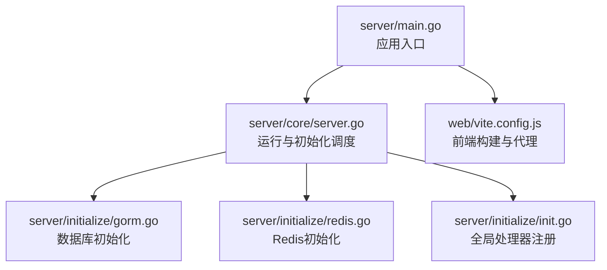
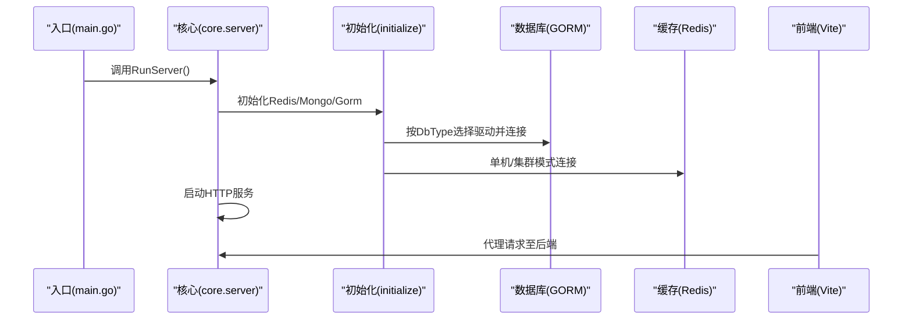
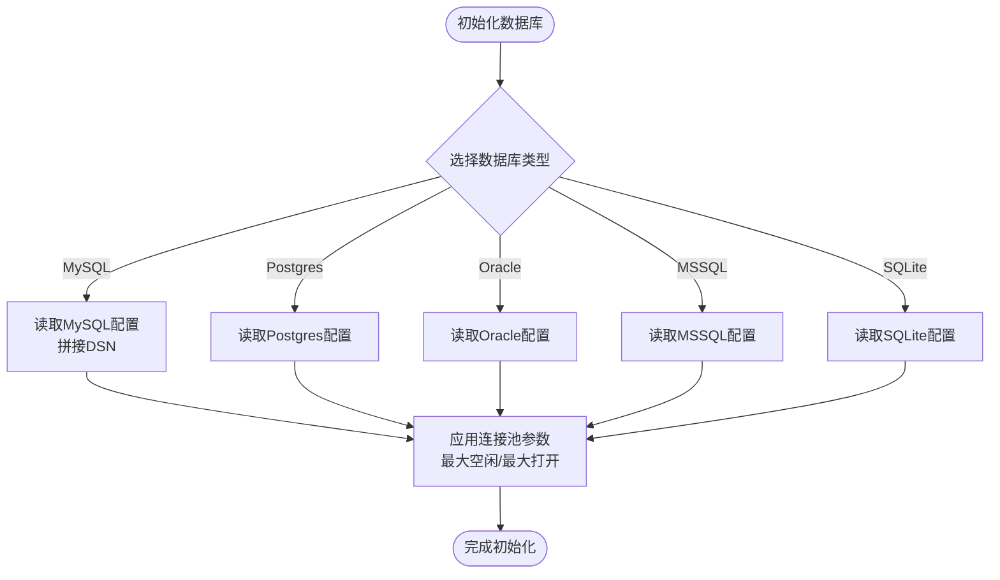
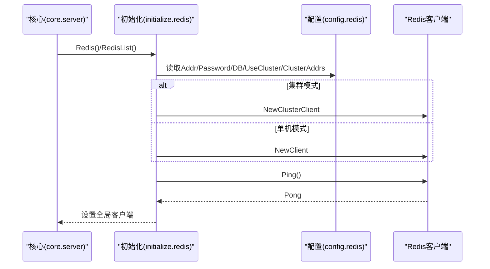
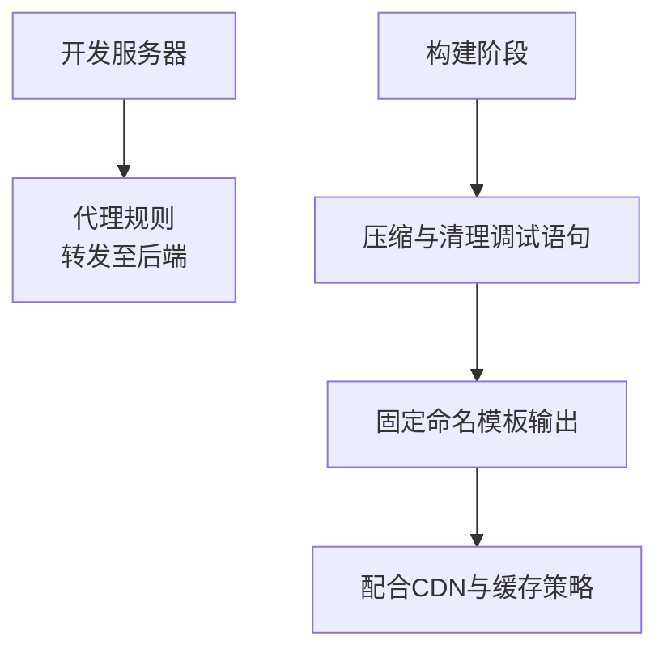
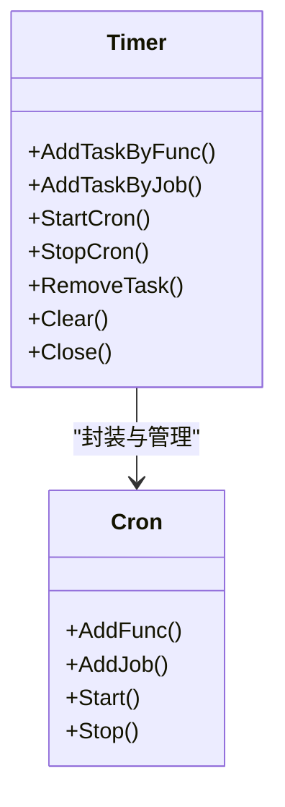
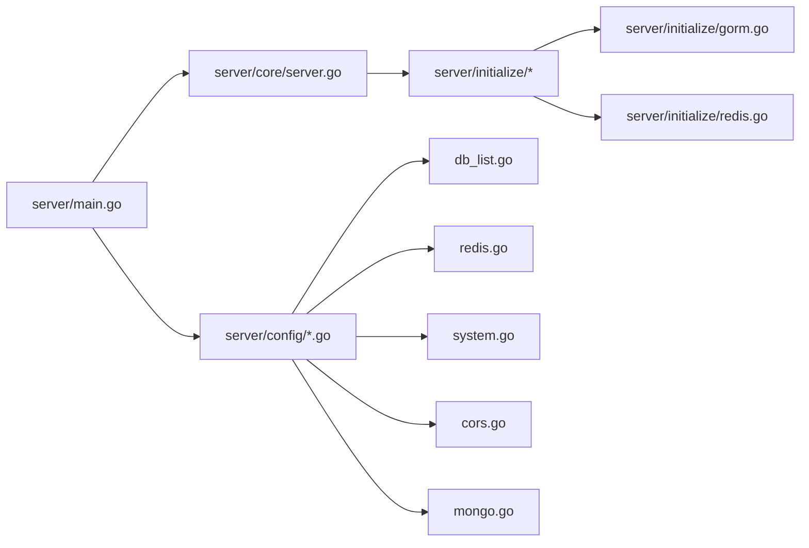

# 性能优化与调优

<cite>
**本文引用的文件**
- [server/main.go](file://server/main.go)
- [server/core/server.go](file://server/core/server.go)
- [server/config/config.go](file://server/config/config.go)
- [server/config/system.go](file://server/config/system.go)
- [server/config/db_list.go](file://server/config/db_list.go)
- [server/config/gorm_mysql.go](file://server/config/gorm_mysql.go)
- [server/config/redis.go](file://server/config/redis.go)
- [server/config/cors.go](file://server/config/cors.go)
- [server/config/mongo.go](file://server/config/mongo.go)
- [server/initialize/init.go](file://server/initialize/init.go)
- [server/initialize/gorm.go](file://server/initialize/gorm.go)
- [server/initialize/redis.go](file://server/initialize/redis.go)
- [server/utils/timer/timed_task.go](file://server/utils/timer/timed_task.go)
- [web/vite.config.js](file://web/vite.config.js)
</cite>

## 目录
1. [简介](#简介)
2. [项目结构](#项目结构)
3. [核心组件](#核心组件)
4. [架构总览](#架构总览)
5. [详细组件分析](#详细组件分析)
6. [依赖分析](#依赖分析)
7. [性能考量](#性能考量)
8. [故障排查指南](#故障排查指南)
9. [结论](#结论)
10. [附录](#附录)

## 简介
本文件面向性能优化与调优，聚焦数据库、缓存、前端与后端服务四个层面的关键优化策略与实践要点。内容基于仓库中实际配置与初始化流程，结合可落地的参数与机制，帮助识别瓶颈并制定针对性优化方案。

## 项目结构
后端采用 Go + Gin 的分层架构：入口初始化系统、按需加载数据库与缓存、路由与中间件、业务服务与数据模型；前端采用 Vite 构建，提供代理、压缩与打包策略。整体结构清晰，便于在各层实施性能优化。

**图表来源**
- [server/main.go:30-35](file://server/main.go#L30-L35)
- [server/core/server.go:14-48](file://server/core/server.go#L14-L48)
- [server/initialize/gorm.go:14-35](file://server/initialize/gorm.go#L14-L35)
- [server/initialize/redis.go:39-60](file://server/initialize/redis.go#L39-L60)
- [server/initialize/init.go:9-16](file://server/initialize/init.go#L9-L16)
- [web/vite.config.js:15-119](file://web/vite.config.js#L15-L119)

**章节来源**
- [server/main.go:30-35](file://server/main.go#L30-L35)
- [server/core/server.go:14-48](file://server/core/server.go#L14-L48)
- [web/vite.config.js:15-119](file://web/vite.config.js#L15-L119)

## 核心组件
- 数据库层：通过配置选择数据库类型（MySQL、PostgreSQL、Oracle、SQL Server、SQLite），并按配置初始化连接池参数（最大空闲连接、最大打开连接）。
- 缓存层：支持单机与集群两种 Redis 模式，按配置建立连接并进行健康检查。
- 日志与中间件：系统配置包含跨域、验证码、JWT、邮件等，为性能监控与安全埋点提供基础。
- 前端构建：Vite 提供代理、压缩、资源命名与插件生态，支撑静态资源性能优化。

**章节来源**
- [server/config/db_list.go:17-31](file://server/config/db_list.go#L17-L31)
- [server/config/gorm_mysql.go:3-9](file://server/config/gorm_mysql.go#L3-L9)
- [server/config/redis.go:3-10](file://server/config/redis.go#L3-L10)
- [server/config/system.go:3-15](file://server/config/system.go#L3-L15)
- [server/config/cors.go:3-14](file://server/config/cors.go#L3-L14)
- [web/vite.config.js:57-95](file://web/vite.config.js#L57-L95)

## 架构总览
后端启动顺序：入口初始化 -> 日志与配置 -> 数据库连接 -> 缓存连接 -> 路由与定时任务 -> 启动服务。前端通过 Vite 开发服务器代理后端 API，构建阶段启用压缩与清理调试语句。

**图表来源**
- [server/main.go:30-35](file://server/main.go#L30-L35)
- [server/core/server.go:14-48](file://server/core/server.go#L14-L48)
- [server/initialize/gorm.go:14-35](file://server/initialize/gorm.go#L14-L35)
- [server/initialize/redis.go:39-60](file://server/initialize/redis.go#L39-L60)
- [web/vite.config.js:61-78](file://web/vite.config.js#L61-L78)

## 详细组件分析

### 数据库性能优化（GORM/多数据库）
- 连接池配置
  - 关键参数：最大空闲连接、最大打开连接，直接影响并发与资源占用。
  - 配置来源：通用数据库配置结构体包含上述字段，可在配置文件中调整。
- 日志与慢查询
  - GORM 日志级别可通过配置切换，建议在生产关闭或降级，避免高频写日志带来的 I/O 压力。
- DSN 与连接字符串
  - MySQL DSN 拼装包含用户名、密码、主机、端口、数据库名与高级参数，建议在生产环境显式设置连接超时、字符集与事务隔离级别。
- 多数据库与别名
  - 支持多数据库实例与别名，便于读写分离与分库分表场景的连接管理。

**图表来源**
- [server/initialize/gorm.go:14-35](file://server/initialize/gorm.go#L14-L35)
- [server/config/gorm_mysql.go:7-9](file://server/config/gorm_mysql.go#L7-L9)
- [server/config/db_list.go:17-31](file://server/config/db_list.go#L17-L31)

**章节来源**
- [server/config/db_list.go:17-31](file://server/config/db_list.go#L17-L31)
- [server/config/gorm_mysql.go:7-9](file://server/config/gorm_mysql.go#L7-L9)
- [server/initialize/gorm.go:14-35](file://server/initialize/gorm.go#L14-L35)

### 缓存策略设计（Redis）
- 模式选择
  - 单机与集群模式通过配置开关切换，集群模式需提供节点地址列表。
- 连接与健康检查
  - 初始化时执行 Ping 并记录日志，失败直接中断，确保上线即可用。
- 多实例支持
  - 支持多个 Redis 实例，按名称映射，便于多业务域隔离。

**图表来源**
- [server/core/server.go:14-20](file://server/core/server.go#L14-L20)
- [server/initialize/redis.go:13-37](file://server/initialize/redis.go#L13-L37)
- [server/config/redis.go:3-10](file://server/config/redis.go#L3-L10)

**章节来源**
- [server/config/redis.go:3-10](file://server/config/redis.go#L3-L10)
- [server/initialize/redis.go:39-60](file://server/initialize/redis.go#L39-L60)
- [server/core/server.go:14-20](file://server/core/server.go#L14-L20)

### 前端性能优化（Vite）
- 代理与开发体验
  - 通过代理将 API 请求转发至后端，减少跨域与本地联调成本。
- 构建优化
  - 启用压缩、移除 console 与 debugger，降低包体积与运行时开销。
- 资源命名
  - 固定命名模板，有利于浏览器缓存与 CDN 缓存命中。
- 插件生态
  - 通过插件扩展 SVG、主题、开发工具等功能，按需启用以避免构建膨胀。

**图表来源**
- [web/vite.config.js:57-95](file://web/vite.config.js#L57-L95)
- [web/vite.config.js:61-78](file://web/vite.config.js#L61-L78)

**章节来源**
- [web/vite.config.js:57-95](file://web/vite.config.js#L57-L95)
- [web/vite.config.js:61-78](file://web/vite.config.js#L61-L78)

### 后端性能调优（GIN/GORM/并发/内存）
- Gin 与中间件
  - 跨域配置支持白名单与暴露头，合理设置可减少无效请求与预检开销。
- GORM 优化
  - 连接池参数直接影响并发能力与资源占用；生产建议根据 QPS 与实例规格调优。
  - 日志级别应按环境切换，避免高频写日志造成 I/O 压力。
- 并发与定时任务
  - 定时任务管理器基于 cron，支持按秒级调度与动态增删任务，适合周期性清理、统计等场景。
- 内存与进程
  - 引入自动 CPU 核心数适配，有助于在容器化环境下充分利用资源。

**图表来源**
- [server/utils/timer/timed_task.go:8-35](file://server/utils/timer/timed_task.go#L8-L35)
- [server/utils/timer/timed_task.go:54-95](file://server/utils/timer/timed_task.go#L54-L95)
- [server/utils/timer/timed_task.go:219-225](file://server/utils/timer/timed_task.go#L219-L225)

**章节来源**
- [server/config/cors.go:3-14](file://server/config/cors.go#L3-L14)
- [server/config/db_list.go:27-28](file://server/config/db_list.go#L27-L28)
- [server/utils/timer/timed_task.go:54-95](file://server/utils/timer/timed_task.go#L54-L95)
- [server/utils/timer/timed_task.go:219-225](file://server/utils/timer/timed_task.go#L219-L225)
- [server/main.go:7](file://server/main.go#L7)

### MongoDB 连接池与超时
- 连接池大小、Socket 超时、连接超时等参数可按业务延迟与吞吐需求调优。
- 支持多主机配置，便于副本集或分片场景的连接管理。

**章节来源**
- [server/config/mongo.go:8-21](file://server/config/mongo.go#L8-L21)
- [server/config/mongo.go:28-41](file://server/config/mongo.go#L28-L41)

## 依赖分析
- 入口与核心
  - 入口负责初始化系统并启动核心服务；核心负责按配置加载 Redis/Mongo、注册路由并启动 HTTP 服务。
- 初始化链路
  - 初始化模块负责数据库、缓存、定时任务等组件的装配；全局处理器注册便于系统热重载。
- 配置聚合
  - 顶层配置聚合了 JWT、日志、Redis、Mongo、数据库、跨域、MCP 等模块配置，便于集中管理。

**图表来源**
- [server/main.go:30-35](file://server/main.go#L30-L35)
- [server/core/server.go:14-48](file://server/core/server.go#L14-L48)
- [server/initialize/gorm.go:14-35](file://server/initialize/gorm.go#L14-L35)
- [server/initialize/redis.go:39-60](file://server/initialize/redis.go#L39-L60)
- [server/config/db_list.go:17-31](file://server/config/db_list.go#L17-L31)
- [server/config/redis.go:3-10](file://server/config/redis.go#L3-L10)
- [server/config/system.go:3-15](file://server/config/system.go#L3-L15)
- [server/config/cors.go:3-14](file://server/config/cors.go#L3-L14)
- [server/config/mongo.go:8-21](file://server/config/mongo.go#L8-L21)

**章节来源**
- [server/main.go:30-35](file://server/main.go#L30-L35)
- [server/core/server.go:14-48](file://server/core/server.go#L14-L48)
- [server/initialize/init.go:9-16](file://server/initialize/init.go#L9-L16)

## 性能考量
- 数据库
  - 连接池参数：根据峰值并发与平均请求耗时估算最大打开连接，空闲连接不宜过大以免占用内存。
  - 日志级别：生产环境建议关闭或降级，仅在定位问题时临时开启。
  - DSN 参数：显式设置连接超时、读超时、字符集与事务隔离级别，避免默认值导致的隐性性能问题。
- 缓存
  - 集群模式：节点数量与网络拓扑影响延迟与可用性，建议就近部署与健康检查。
  - 多实例：按业务域隔离，避免共享实例导致的争用。
- 前端
  - 构建压缩与清理调试语句显著降低体积；固定命名模板提升缓存命中。
  - 代理仅用于开发，生产通过 Nginx 或网关统一接入，减少不必要的中间层。
- 后端
  - 定时任务：周期性任务应避免在高峰期执行重负载操作，必要时拆分与限流。
  - 中间件：跨域白名单与暴露头应最小化，减少无效请求与预检次数。
  - 并发：结合自动 CPU 适配与容器资源限制，避免过度竞争与 OOM。

[本节为通用指导，不直接分析具体文件]

## 故障排查指南
- Redis 连接失败
  - 现象：初始化阶段 Ping 失败并记录错误日志。
  - 排查：核对地址、密码、DB 号与集群节点列表；确认网络连通与防火墙策略。
- 数据库连接异常
  - 现象：初始化失败或注册表失败。
  - 排查：核对 DSN 拼装参数、连接超时与字符集；检查数据库实例状态与权限。
- 前端代理无效
  - 现象：开发时 API 请求 404 或跨域。
  - 排查：确认代理路径与目标地址、变更原点与重写规则是否正确。
- 定时任务未执行
  - 现象：任务未按期触发。
  - 排查：确认 cron 表达式、秒级选项是否启用、任务是否被移除或清理。

**章节来源**
- [server/initialize/redis.go:29-36](file://server/initialize/redis.go#L29-L36)
- [server/initialize/gorm.go:75-78](file://server/initialize/gorm.go#L75-L78)
- [web/vite.config.js:61-78](file://web/vite.config.js#L61-L78)
- [server/utils/timer/timed_task.go:54-95](file://server/utils/timer/timed_task.go#L54-L95)

## 结论
本项目在配置层提供了数据库、缓存、前端构建与后端中间件等关键性能参数的可调空间。通过合理设置连接池、日志级别、代理与压缩策略，并结合定时任务与自动 CPU 适配，可在不同环境与规模下获得稳定且高效的运行表现。建议在生产环境持续监控关键指标并迭代优化。

[本节为总结，不直接分析具体文件]

## 附录
- 性能监控指标建议
  - 数据库：连接数、等待时间、慢查询数、锁等待、QPS、TPS。
  - 缓存：命中率、请求延迟、连接数、过期与淘汰事件。
  - 前端：首屏时间、TTFB、资源体积、缓存命中率。
  - 后端：CPU 使用率、内存占用、Goroutine 数、P95/P99 延迟、错误率。
- 基准测试方法
  - 使用压测工具对关键接口进行阶梯式压力测试，逐步提升并发与数据量，观察指标拐点并定位瓶颈。
  - 对比启用/关闭压缩、不同连接池大小、不同日志级别的性能差异，形成基线数据。

[本节为通用指导，不直接分析具体文件]