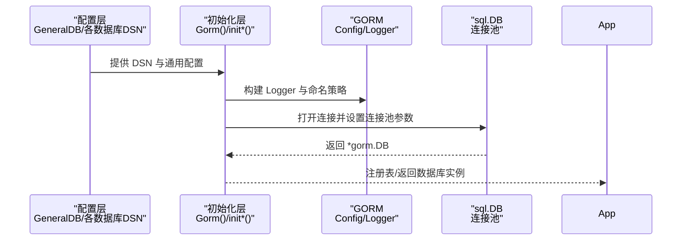
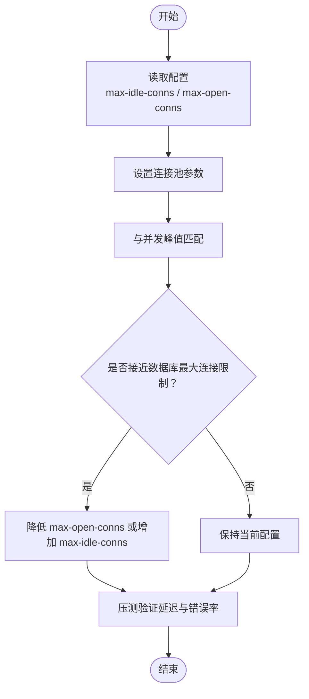

# 数据库性能优化

<cite>
**本文引用的文件**
- [server/config/db_list.go](file://server/config/db_list.go)
- [server/config/gorm_mysql.go](file://server/config/gorm_mysql.go)
- [server/config/gorm_pgsql.go](file://server/config/gorm_pgsql.go)
- [server/config/gorm_mssql.go](file://server/config/gorm_mssql.go)
- [server/config/gorm_oracle.go](file://server/config/gorm_oracle.go)
- [server/config/gorm_sqlite.go](file://server/config/gorm_sqlite.go)
- [server/config/config.go](file://server/config/config.go)
- [server/initialize/gorm.go](file://server/initialize/gorm.go)
- [server/initialize/gorm_mysql.go](file://server/initialize/gorm_mysql.go)
- [server/initialize/gorm_pgsql.go](file://server/initialize/gorm_pgsql.go)
- [server/initialize/gorm_mssql.go](file://server/initialize/gorm_mssql.go)
- [server/initialize/gorm_oracle.go](file://server/initialize/gorm_oracle.go)
- [server/initialize/gorm_sqlite.go](file://server/initialize/gorm_sqlite.go)
- [server/initialize/internal/gorm.go](file://server/initialize/internal/gorm.go)
- [server/global/global.go](file://server/global/global.go)
- [repowiki/zh/content/系统架构/性能优化策略.md](file://repowiki/zh/content/系统架构/性能优化策略.md)
- [repowiki/zh/content/部署运维/性能优化与调优.md](file://repowiki/zh/content/部署运维/性能优化与调优.md)
</cite>

## 目录
1. [简介](#简介)
2. [项目结构](#项目结构)
3. [核心组件](#核心组件)
4. [架构总览](#架构总览)
5. [详细组件分析](#详细组件分析)
6. [依赖分析](#依赖分析)
7. [性能考量](#性能考量)
8. [故障排查指南](#故障排查指南)
9. [结论](#结论)
10. [附录](#附录)

## 简介
本文件聚焦数据库性能优化，结合项目中数据库连接池配置、索引与查询优化、数据库参数调优以及监控与基准测试方法，形成一套可落地的优化实践指南。内容覆盖 MySQL、PostgreSQL、SQL Server、Oracle、SQLite 等多数据库类型，并给出与代码实现直接对应的调优入口与参考路径。

## 项目结构
围绕数据库性能优化的关键代码分布在以下模块：
- 配置层：统一的通用数据库配置结构与各数据库 DSN 生成
- 初始化层：按数据库类型初始化 GORM 连接与连接池
- 日志与命名策略：GORM 日志级别与慢日志阈值
- 全局变量：数据库实例与多库列表管理

```mermaid
graph TB
subgraph "配置层"
CFG_GEN["GeneralDB<br/>server/config/db_list.go"]
CFG_MYSQL["Mysql.Dsn()<br/>server/config/gorm_mysql.go"]
CFG_PG["Pgsql.Dsn()/LinkDsn()<br/>server/config/gorm_pgsql.go"]
CFG_MSSQL["Mssql.Dsn()<br/>server/config/gorm_mssql.go"]
CFG_ORA["Oracle.Dsn()<br/>server/config/gorm_oracle.go"]
CFG_SQLITE["Sqlite.Dsn()<br/>server/config/gorm_sqlite.go"]
CFG_ROOT["Server 包含各类数据库配置<br/>server/config/config.go"]
end
subgraph "初始化层"
INIT_G["Gorm()<br/>server/initialize/gorm.go"]
INIT_MYSQL["initMysqlDatabase()<br/>server/initialize/gorm_mysql.go"]
INIT_PG["initPgSqlDatabase()<br/>server/initialize/gorm_pgsql.go"]
INIT_MSSQL["initMssqlDatabase()<br/>server/initialize/gorm_mssql.go"]
INIT_ORA["initOracleDatabase()<br/>server/initialize/gorm_oracle.go"]
INIT_SQLITE["initSqliteDatabase()<br/>server/initialize/gorm_sqlite.go"]
end
subgraph "运行时"
LOGIC["GORM 日志与命名策略<br/>server/initialize/internal/gorm.go"]
GLOBAL["全局 DB 实例与 DB 列表<br/>server/global/global.go"]
end
CFG_GEN --> INIT_MYSQL
CFG_GEN --> INIT_PG
CFG_GEN --> INIT_MSSQL
CFG_GEN --> INIT_ORA
CFG_GEN --> INIT_SQLITE
CFG_MYSQL --> INIT_MYSQL
CFG_PG --> INIT_PG
CFG_MSSQL --> INIT_MSSQL
CFG_ORA --> INIT_ORA
CFG_SQLITE --> INIT_SQLITE
INIT_G --> INIT_MYSQL
INIT_G --> INIT_PG
INIT_G --> INIT_MSSQL
INIT_G --> INIT_ORA
INIT_G --> INIT_SQLITE
LOGIC --> INIT_MYSQL
LOGIC --> INIT_PG
LOGIC --> INIT_MSSQL
LOGIC --> INIT_ORA
LOGIC --> INIT_SQLITE
INIT_MYSQL --> GLOBAL
INIT_PG --> GLOBAL
INIT_MSSQL --> GLOBAL
INIT_ORA --> GLOBAL
INIT_SQLITE --> GLOBAL
```

**图表来源**
- [server/config/db_list.go:17-31](file://server/config/db_list.go#L17-L31)
- [server/config/gorm_mysql.go:7-9](file://server/config/gorm_mysql.go#L7-L9)
- [server/config/gorm_pgsql.go:9-17](file://server/config/gorm_pgsql.go#L9-L17)
- [server/config/gorm_mssql.go:8-10](file://server/config/gorm_mssql.go#L8-L10)
- [server/config/gorm_oracle.go:13-18](file://server/config/gorm_oracle.go#L13-L18)
- [server/config/gorm_sqlite.go:11-13](file://server/config/gorm_sqlite.go#L11-L13)
- [server/initialize/gorm.go:14-35](file://server/initialize/gorm.go#L14-L35)
- [server/initialize/gorm_mysql.go:27-47](file://server/initialize/gorm_mysql.go#L27-L47)
- [server/initialize/gorm_pgsql.go:25-42](file://server/initialize/gorm_pgsql.go#L25-L42)
- [server/initialize/gorm_mssql.go:23-41](file://server/initialize/gorm_mssql.go#L23-L41)
- [server/initialize/gorm_oracle.go:23-36](file://server/initialize/gorm_oracle.go#L23-L36)
- [server/initialize/gorm_sqlite.go:23-37](file://server/initialize/gorm_sqlite.go#L23-L37)
- [server/initialize/internal/gorm.go:18-30](file://server/initialize/internal/gorm.go#L18-L30)
- [server/global/global.go:25-42](file://server/global/global.go#L25-L42)

**章节来源**
- [server/config/db_list.go:17-31](file://server/config/db_list.go#L17-L31)
- [server/config/gorm_mysql.go:7-9](file://server/config/gorm_mysql.go#L7-L9)
- [server/config/gorm_pgsql.go:9-17](file://server/config/gorm_pgsql.go#L9-L17)
- [server/config/gorm_mssql.go:8-10](file://server/config/gorm_mssql.go#L8-L10)
- [server/config/gorm_oracle.go:13-18](file://server/config/gorm_oracle.go#L13-L18)
- [server/config/gorm_sqlite.go:11-13](file://server/config/gorm_sqlite.go#L11-L13)
- [server/config/config.go:15-19](file://server/config/config.go#L15-L19)
- [server/initialize/gorm.go:14-35](file://server/initialize/gorm.go#L14-L35)
- [server/initialize/gorm_mysql.go:27-47](file://server/initialize/gorm_mysql.go#L27-L47)
- [server/initialize/gorm_pgsql.go:25-42](file://server/initialize/gorm_pgsql.go#L25-L42)
- [server/initialize/gorm_mssql.go:23-41](file://server/initialize/gorm_mssql.go#L23-L41)
- [server/initialize/gorm_oracle.go:23-36](file://server/initialize/gorm_oracle.go#L23-L36)
- [server/initialize/gorm_sqlite.go:23-37](file://server/initialize/gorm_sqlite.go#L23-L37)
- [server/initialize/internal/gorm.go:18-30](file://server/initialize/internal/gorm.go#L18-L30)
- [server/global/global.go:25-42](file://server/global/global.go#L25-L42)

## 核心组件
- 通用数据库配置结构 GeneralDB：包含连接池参数 max-idle-conns、max-open-conns，以及日志模式、表前缀、是否禁用复数等。
- 各数据库 DSN 生成：MySQL、PostgreSQL、SQL Server、Oracle、SQLite 的 DSN 构造方法，用于连接字符串拼装。
- 初始化流程：按 DbType 选择对应驱动，构造 GORM 配置与连接池，设置最大空闲与最大打开连接数。
- GORM 日志与命名策略：慢日志阈值、日志级别、表名复数策略等。
- 全局数据库实例：单实例与多库列表管理，便于跨库访问与监控。

**章节来源**
- [server/config/db_list.go:17-31](file://server/config/db_list.go#L17-L31)
- [server/config/gorm_mysql.go:7-9](file://server/config/gorm_mysql.go#L7-L9)
- [server/config/gorm_pgsql.go:9-17](file://server/config/gorm_pgsql.go#L9-L17)
- [server/config/gorm_mssql.go:8-10](file://server/config/gorm_mssql.go#L8-L10)
- [server/config/gorm_oracle.go:13-18](file://server/config/gorm_oracle.go#L13-L18)
- [server/config/gorm_sqlite.go:11-13](file://server/config/gorm_sqlite.go#L11-L13)
- [server/initialize/gorm.go:14-35](file://server/initialize/gorm.go#L14-L35)
- [server/initialize/gorm_mysql.go:44-45](file://server/initialize/gorm_mysql.go#L44-L45)
- [server/initialize/gorm_pgsql.go:39-40](file://server/initialize/gorm_pgsql.go#L39-L40)
- [server/initialize/gorm_mssql.go:38-39](file://server/initialize/gorm_mssql.go#L38-L39)
- [server/initialize/gorm_oracle.go:32-33](file://server/initialize/gorm_oracle.go#L32-L33)
- [server/initialize/gorm_sqlite.go:33-34](file://server/initialize/gorm_sqlite.go#L33-L34)
- [server/initialize/internal/gorm.go:18-30](file://server/initialize/internal/gorm.go#L18-L30)
- [server/global/global.go:25-42](file://server/global/global.go#L25-L42)

## 架构总览
数据库初始化与连接池设置的整体流程如下：

**图表来源**
- [server/initialize/gorm.go:14-35](file://server/initialize/gorm.go#L14-L35)
- [server/initialize/gorm_mysql.go:27-47](file://server/initialize/gorm_mysql.go#L27-L47)
- [server/initialize/gorm_pgsql.go:25-42](file://server/initialize/gorm_pgsql.go#L25-L42)
- [server/initialize/gorm_mssql.go:23-41](file://server/initialize/gorm_mssql.go#L23-L41)
- [server/initialize/gorm_oracle.go:23-36](file://server/initialize/gorm_oracle.go#L23-L36)
- [server/initialize/gorm_sqlite.go:23-37](file://server/initialize/gorm_sqlite.go#L23-L37)
- [server/initialize/internal/gorm.go:18-30](file://server/initialize/internal/gorm.go#L18-L30)

## 详细组件分析

### 连接池配置与调优
- 关键参数
  - max-idle-conns：空闲连接上限，建议与并发峰值相匹配，避免过多空闲占用资源。
  - max-open-conns：最大打开连接数，建议与数据库最大连接限制相协调，防止连接风暴。
- 设置位置
  - MySQL：在初始化函数中设置空闲与打开连接数。
  - PostgreSQL：同上。
  - SQL Server：同上。
  - Oracle：同上。
  - SQLite：同上。
- 调优策略
  - 与并发请求匹配：以 P95 并发为基准，max-idle-conns 取并发的 20%~50%，max-open-conns 取并发的 100%~200%。
  - 数据库侧限制：需结合目标数据库的最大连接数进行上限控制，避免超过数据库许可。
  - 生命周期：可配合连接最大空闲时间与最大生命周期参数（如适用）进一步优化。

**图表来源**
- [server/initialize/gorm_mysql.go:44-45](file://server/initialize/gorm_mysql.go#L44-L45)
- [server/initialize/gorm_pgsql.go:39-40](file://server/initialize/gorm_pgsql.go#L39-L40)
- [server/initialize/gorm_mssql.go:38-39](file://server/initialize/gorm_mssql.go#L38-L39)
- [server/initialize/gorm_oracle.go:32-33](file://server/initialize/gorm_oracle.go#L32-L33)
- [server/initialize/gorm_sqlite.go:33-34](file://server/initialize/gorm_sqlite.go#L33-L34)

**章节来源**
- [server/config/db_list.go:27-28](file://server/config/db_list.go#L27-L28)
- [server/initialize/gorm_mysql.go:44-45](file://server/initialize/gorm_mysql.go#L44-L45)
- [server/initialize/gorm_pgsql.go:39-40](file://server/initialize/gorm_pgsql.go#L39-L40)
- [server/initialize/gorm_mssql.go:38-39](file://server/initialize/gorm_mssql.go#L38-L39)
- [server/initialize/gorm_oracle.go:32-33](file://server/initialize/gorm_oracle.go#L32-L33)
- [server/initialize/gorm_sqlite.go:33-34](file://server/initialize/gorm_sqlite.go#L33-L34)

### 索引优化技术
- 复合索引设计原则
  - 前缀匹配：将最常过滤且选择性高的列放在前面。
  - 覆盖查询：尽量让查询走索引即可满足返回列，减少回表。
  - 避免冗余：删除重复或被更强索引覆盖的索引。
- 索引使用率分析
  - 通过数据库统计信息与执行计划分析索引命中情况。
- 冗余索引清理策略
  - 定期巡检，结合业务查询模式与索引扫描比例，清理低效或重复索引。

**章节来源**
- [repowiki/zh/content/系统架构/性能优化策略.md:170-176](file://repowiki/zh/content/系统架构/性能优化策略.md#L170-L176)

### 查询优化方法
- EXPLAIN/ANALYZE 执行计划分析：定位全表扫描、回表、排序与临时表等高成本步骤。
- 慢查询日志识别：结合 GORM 慢日志阈值与数据库慢日志，定位热点 SQL。
- N+1 查询问题：使用预加载、批量查询或 JOIN 合并，避免逐条二次查询。

**章节来源**
- [repowiki/zh/content/系统架构/性能优化策略.md:170-176](file://repowiki/zh/content/系统架构/性能优化策略.md#L170-L176)
- [repowiki/zh/content/部署运维/性能优化与调优.md:279](file://repowiki/zh/content/部署运维/性能优化与调优.md#L279)

### 数据库参数调优（多数据库）
- MySQL
  - 连接池：max-idle-conns、max-open-conns 与 innodb_thread_concurrency、max_connections 协同。
  - 查询：optimizer_switch、bulk_insert_buffer_size、innodb_flush_log_at_trx_commit。
- PostgreSQL
  - 连接池：max-idle-conns、max-open-conns 与 max_connections、shared_buffers。
  - 查询：work_mem、effective_cache_size、random_page_cost。
- SQL Server
  - 连接池：max-idle-conns、max-open-conns 与 max worker threads、max degree parallelism。
  - 查询：cost threshold for parallelism、max server memory。
- Oracle
  - 连接池：max-idle-conns、max-open-conns 与 processes、sga_target。
  - 查询：optimizer_mode、pga_aggregate_limit。
- SQLite
  - 连接池：max-idle-conns、max-open-conns 与 cache_size、journal_mode。

**章节来源**
- [server/config/gorm_mysql.go:7-9](file://server/config/gorm_mysql.go#L7-L9)
- [server/config/gorm_pgsql.go:9-17](file://server/config/gorm_pgsql.go#L9-L17)
- [server/config/gorm_mssql.go:8-10](file://server/config/gorm_mssql.go#L8-L10)
- [server/config/gorm_oracle.go:13-18](file://server/config/gorm_oracle.go#L13-L18)
- [server/config/gorm_sqlite.go:11-13](file://server/config/gorm_sqlite.go#L11-L13)

### 监控指标与基准测试
- 监控指标
  - 连接池：活跃连接数、空闲连接数、等待获取连接次数、连接超时次数。
  - 数据库：QPS、P95/P99 延迟、锁等待、缓存命中率、磁盘 IO。
- 基准测试
  - 使用压测工具逐步提升并发与数据规模，观察指标拐点，定位瓶颈。

**章节来源**
- [repowiki/zh/content/部署运维/性能优化与调优.md:287-289](file://repowiki/zh/content/部署运维/性能优化与调优.md#L287-L289)

## 依赖分析
- 配置到初始化的依赖：所有数据库初始化均依赖 GeneralDB 的通用配置与各数据库 DSN。
- 初始化到运行时：初始化完成后将 GORM 实例写入全局变量，供业务模块使用。
- 日志策略：GORM 的日志级别与慢日志阈值由内部配置统一管理。

**图表来源**
- [server/config/db_list.go:17-31](file://server/config/db_list.go#L17-L31)
- [server/config/gorm_mysql.go:7-9](file://server/config/gorm_mysql.go#L7-L9)
- [server/config/gorm_pgsql.go:9-17](file://server/config/gorm_pgsql.go#L9-L17)
- [server/config/gorm_mssql.go:8-10](file://server/config/gorm_mssql.go#L8-L10)
- [server/config/gorm_oracle.go:13-18](file://server/config/gorm_oracle.go#L13-L18)
- [server/config/gorm_sqlite.go:11-13](file://server/config/gorm_sqlite.go#L11-L13)
- [server/initialize/gorm_mysql.go:27-47](file://server/initialize/gorm_mysql.go#L27-L47)
- [server/initialize/gorm_pgsql.go:25-42](file://server/initialize/gorm_pgsql.go#L25-L42)
- [server/initialize/gorm_mssql.go:23-41](file://server/initialize/gorm_mssql.go#L23-L41)
- [server/initialize/gorm_oracle.go:23-36](file://server/initialize/gorm_oracle.go#L23-L36)
- [server/initialize/gorm_sqlite.go:23-37](file://server/initialize/gorm_sqlite.go#L23-L37)
- [server/initialize/internal/gorm.go:18-30](file://server/initialize/internal/gorm.go#L18-L30)
- [server/global/global.go:25-42](file://server/global/global.go#L25-L42)

**章节来源**
- [server/config/db_list.go:17-31](file://server/config/db_list.go#L17-L31)
- [server/initialize/internal/gorm.go:18-30](file://server/initialize/internal/gorm.go#L18-L30)
- [server/global/global.go:25-42](file://server/global/global.go#L25-L42)

## 性能考量
- 连接池参数与并发匹配：以 P95 并发为基准，合理设置 max-idle-conns 与 max-open-conns，避免过度占用或连接不足。
- 日志与慢查询：生产环境建议关闭 Debug 日志，仅在定位问题时临时开启；结合慢日志阈值与执行计划分析热点 SQL。
- 查询优化：建立合适索引、避免全表扫描；使用 LIMIT/OFFSET 或基于游标的分页；批量写入合并为事务。
- 定时清理：定期清理操作日志与黑名单，控制表膨胀。

**章节来源**
- [repowiki/zh/content/系统架构/性能优化策略.md:165-179](file://repowiki/zh/content/系统架构/性能优化策略.md#L165-L179)
- [repowiki/zh/content/部署运维/性能优化与调优.md:277-279](file://repowiki/zh/content/部署运维/性能优化与调优.md#L277-L279)

## 故障排查指南
- 连接池耗尽
  - 现象：大量请求等待连接或报错。
  - 排查：检查 max-open-conns 与实际并发，确认数据库最大连接限制；观察等待时间与超时次数。
- 慢查询
  - 现象：P99 延迟升高。
  - 排查：启用慢日志，结合 EXPLAIN/ANALYZE 分析；检查索引使用与回表情况。
- N+1 查询
  - 现象：接口响应时间随关联数量线性增长。
  - 排查：使用预加载或 JOIN 合并查询；避免循环内二次查询。
- 日志级别
  - 现象：CPU 占用升高。
  - 排查：生产关闭 Debug 日志，仅保留必要的慢日志阈值。

**章节来源**
- [repowiki/zh/content/系统架构/性能优化策略.md:170-176](file://repowiki/zh/content/系统架构/性能优化策略.md#L170-L176)
- [repowiki/zh/content/部署运维/性能优化与调优.md:279](file://repowiki/zh/content/部署运维/性能优化与调优.md#L279)

## 结论
本项目通过统一的通用配置结构与各数据库 DSN 生成，结合初始化阶段对连接池参数的设置，形成了可扩展的数据库性能优化基础。配合索引与查询优化、慢日志分析、N+1 问题治理以及监控与基准测试，可在多数据库环境下稳定提升系统整体性能与稳定性。

## 附录
- 关键实现参考路径
  - 通用配置与连接池参数：[server/config/db_list.go:27-28](file://server/config/db_list.go#L27-L28)
  - MySQL 初始化与连接池设置：[server/initialize/gorm_mysql.go:44-45](file://server/initialize/gorm_mysql.go#L44-L45)
  - PostgreSQL 初始化与连接池设置：[server/initialize/gorm_pgsql.go:39-40](file://server/initialize/gorm_pgsql.go#L39-L40)
  - SQL Server 初始化与连接池设置：[server/initialize/gorm_mssql.go:38-39](file://server/initialize/gorm_mssql.go#L38-L39)
  - Oracle 初始化与连接池设置：[server/initialize/gorm_oracle.go:32-33](file://server/initialize/gorm_oracle.go#L32-L33)
  - SQLite 初始化与连接池设置：[server/initialize/gorm_sqlite.go:33-34](file://server/initialize/gorm_sqlite.go#L33-L34)
  - GORM 日志与命名策略：[server/initialize/internal/gorm.go:18-30](file://server/initialize/internal/gorm.go#L18-L30)
  - 全局数据库实例与多库列表：[server/global/global.go:25-42](file://server/global/global.go#L25-L42)