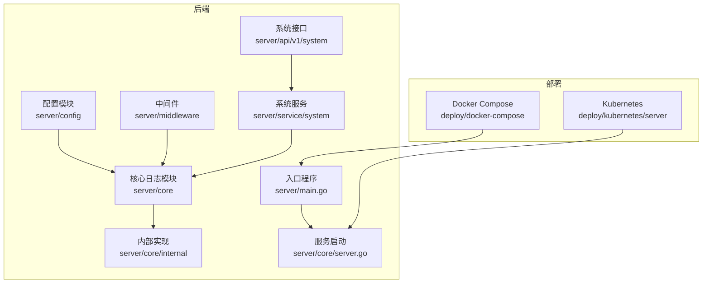
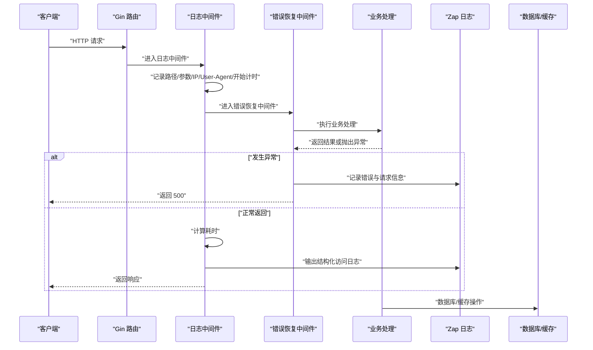
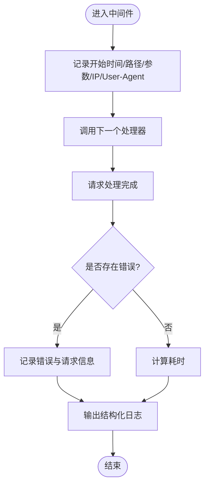
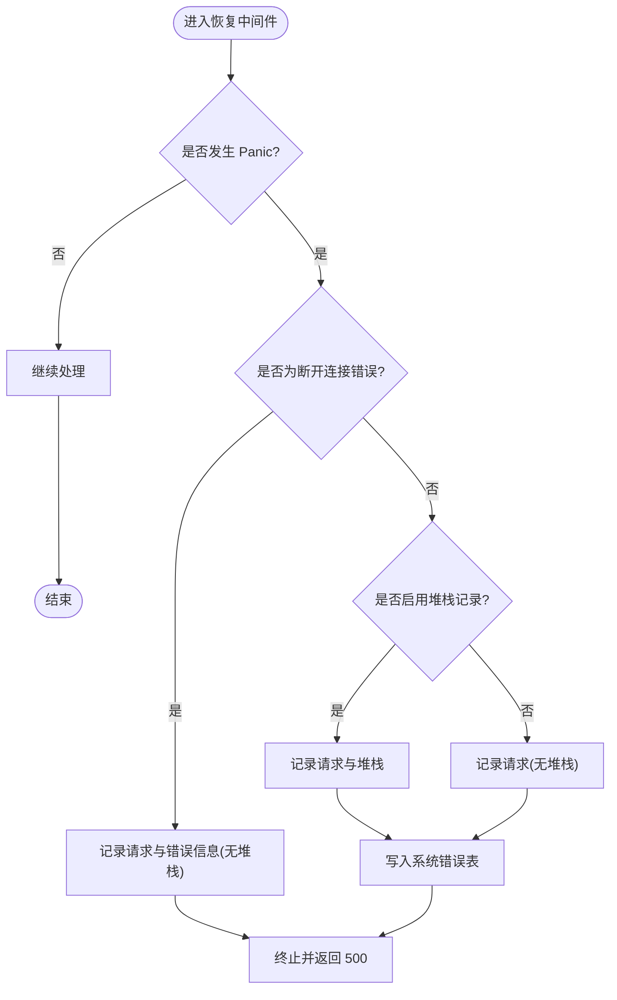
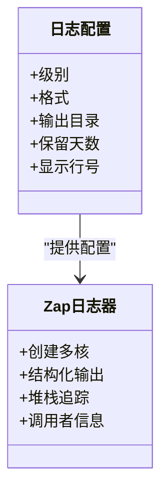
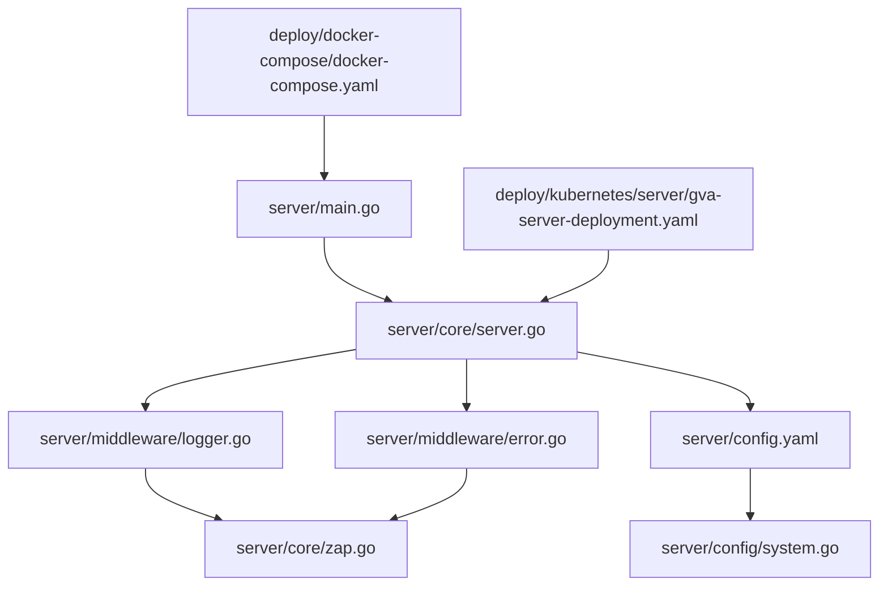

# 监控与基准测试

<cite>
**本文档引用的文件**
- [server/main.go](file://server/main.go)
- [server/core/server.go](file://server/core/server.go)
- [server/middleware/logger.go](file://server/middleware/logger.go)
- [server/middleware/error.go](file://server/middleware/error.go)
- [server/core/zap.go](file://server/core/zap.go)
- [server/global/global.go](file://server/global/global.go)
- [server/config/config.go](file://server/config/config.go)
- [server/config/system.go](file://server/config/system.go)
- [server/config.yaml](file://server/config.yaml)
- [server/config.docker.yaml](file://server/config.docker.yaml)
- [deploy/docker-compose/docker-compose.yaml](file://deploy/docker-compose/docker-compose.yaml)
- [deploy/kubernetes/server/gva-server-deployment.yaml](file://deploy/kubernetes/server/gva-server-deployment.yaml)
- [repowiki/zh/content/部署运维/监控与日志管理.md](file://repowiki/zh/content/部署运维/监控与日志管理.md)
</cite>

## 目录
1. [简介](#简介)
2. [项目结构](#项目结构)
3. [核心组件](#核心组件)
4. [架构总览](#架构总览)
5. [详细组件分析](#详细组件分析)
6. [依赖关系分析](#依赖关系分析)
7. [性能考量](#性能考量)
8. [故障排查指南](#故障排查指南)
9. [结论](#结论)
10. [附录](#附录)

## 简介
本文件面向系统监控与基准测试的专业技术需求，结合代码库现状，系统梳理性能监控指标体系、监控工具集成思路、基准测试方法、性能分析技术以及容量规划指导。当前代码库已具备完善的日志基础设施与中间件链路，可作为监控与基准测试的基础支撑；同时提供容器化与 Kubernetes 部署样例，便于后续接入 Prometheus/Grafana 等监控体系。

## 项目结构
后端以 Gin 为核心，通过中间件链路收集访问日志与异常信息，日志由 Zap 统一输出与落盘，错误信息可入库并提供查询接口。系统通过配置模块集中管理运行参数，包含系统、数据库、缓存、对象存储等配置项。部署方面提供 Docker Compose 与 Kubernetes 清单示例，便于容器化与云原生环境部署。

图表来源
- [server/main.go:30-35](file://server/main.go#L30-L35)
- [server/core/server.go:14-48](file://server/core/server.go#L14-L48)
- [server/config.yaml:74-92](file://server/config.yaml#L74-L92)
- [deploy/docker-compose/docker-compose.yaml:16-51](file://deploy/docker-compose/docker-compose.yaml#L16-L51)
- [deploy/kubernetes/server/gva-server-deployment.yaml:24-65](file://deploy/kubernetes/server/gva-server-deployment.yaml#L24-L65)

章节来源
- [server/main.go:30-35](file://server/main.go#L30-L35)
- [server/core/server.go:14-48](file://server/core/server.go#L14-L48)
- [server/config.yaml:74-92](file://server/config.yaml#L74-L92)
- [deploy/docker-compose/docker-compose.yaml:16-51](file://deploy/docker-compose/docker-compose.yaml#L16-L51)
- [deploy/kubernetes/server/gva-server-deployment.yaml:24-65](file://deploy/kubernetes/server/gva-server-deployment.yaml#L24-L65)

## 核心组件
- 入口与启动流程：应用入口负责初始化系统组件并启动 HTTP 服务，系统启动时根据配置决定启用 Redis/MongoDB 等组件，并打印服务地址与文档地址等信息。
- 中间件链路：提供结构化访问日志中间件，记录请求路径、查询参数、客户端 IP、User-Agent、耗时、错误信息等；同时提供 Panic 恢复中间件，捕获异常并记录日志与错误信息。
- 日志系统：Zap 日志模块按配置创建多核日志器，支持结构化输出、堆栈追踪、调用者信息等，满足监控与排障需求。
- 配置中心：系统配置涵盖系统参数、数据库连接池参数、缓存与对象存储等，便于在不同环境调整运行参数与资源上限。

章节来源
- [server/main.go:30-35](file://server/main.go#L30-L35)
- [server/core/server.go:14-48](file://server/core/server.go#L14-L48)
- [server/middleware/logger.go:41-89](file://server/middleware/logger.go#L41-L89)
- [server/middleware/error.go:21-80](file://server/middleware/error.go#L21-L80)
- [server/core/zap.go:13-36](file://server/core/zap.go#L13-L36)
- [server/config/config.go:3-40](file://server/config/config.go#L3-L40)
- [server/config/system.go:3-15](file://server/config/system.go#L3-L15)

## 架构总览
下图展示了从请求进入、中间件处理到日志输出与错误恢复的整体流程，以及与配置、数据库、缓存等外部组件的关系。

图表来源
- [server/middleware/logger.go:41-89](file://server/middleware/logger.go#L41-L89)
- [server/middleware/error.go:21-80](file://server/middleware/error.go#L21-L80)
- [server/core/zap.go:13-36](file://server/core/zap.go#L13-L36)

章节来源
- [server/middleware/logger.go:41-89](file://server/middleware/logger.go#L41-L89)
- [server/middleware/error.go:21-80](file://server/middleware/error.go#L21-L80)
- [server/core/zap.go:13-36](file://server/core/zap.go#L13-L36)

## 详细组件分析

### 访问日志中间件
- 功能要点：在请求进入与退出时分别记录时间戳、路径、查询参数、客户端 IP、User-Agent、错误信息与耗时；支持自定义过滤、关键字脱敏与鉴权处理回调。
- 输出格式：默认以 JSON 结构化输出至标准输出，便于容器日志收集与后续分析。
- 性能影响：仅在必要字段上进行字符串拼接与序列化，避免对热路径造成显著开销。

图表来源
- [server/middleware/logger.go:41-89](file://server/middleware/logger.go#L41-L89)

章节来源
- [server/middleware/logger.go:41-89](file://server/middleware/logger.go#L41-L89)

### 错误恢复中间件
- 功能要点：捕获 Panic 并区分“断开连接”与一般异常；对一般异常记录请求信息与堆栈；将错误信息写入系统错误表，便于前端查询与统计。
- 异常分类：针对“Broken Pipe/Connection Reset”等断开连接场景不输出堆栈，减少噪音。
- 输出目标：同时写入 Zap 日志与系统错误表，兼顾实时告警与持久化归档。

图表来源
- [server/middleware/error.go:21-80](file://server/middleware/error.go#L21-L80)

章节来源
- [server/middleware/error.go:21-80](file://server/middleware/error.go#L21-L80)

### 日志系统（Zap）
- 多核日志器：根据配置创建多个日志核心，支持结构化字段、编码器与调用者信息，满足不同输出目标与级别要求。
- 堆栈追踪：启用错误及以上级别的堆栈捕捉，保证异常信息可追溯。
- 落盘与轮转：通过配置目录与保留策略，实现日志文件的持久化与轮转。

图表来源
- [server/core/zap.go:13-36](file://server/core/zap.go#L13-L36)
- [server/config.yaml:10-20](file://server/config.yaml#L10-L20)

章节来源
- [server/core/zap.go:13-36](file://server/core/zap.go#L13-L36)
- [server/config.yaml:10-20](file://server/config.yaml#L10-L20)

### 配置与系统参数
- 系统参数：包含端口、路由前缀、IP 限制、是否使用 Redis/Mongo、严格权限模式等，直接影响服务可用性与安全策略。
- 数据库连接池：提供最大空闲连接数与最大打开连接数等参数，便于在不同负载下调整连接池规模。
- 缓存与对象存储：Redis/Mongo 配置与 OSS 类型选择，支持多实例与集群模式。

章节来源
- [server/config/system.go:3-15](file://server/config/system.go#L3-L15)
- [server/config.yaml:101-160](file://server/config.yaml#L101-L160)
- [server/config.yaml:21-62](file://server/config.yaml#L21-L62)
- [server/config.yaml:176-187](file://server/config.yaml#L176-L187)

## 依赖关系分析
- 入口依赖：入口程序依赖核心模块初始化系统组件与启动 HTTP 服务。
- 中间件依赖：日志与错误恢复中间件依赖 Gin 路由链路，输出依赖 Zap 日志器。
- 配置依赖：系统配置贯穿日志、数据库、缓存、对象存储等模块，决定运行行为与资源上限。
- 部署依赖：Docker Compose 与 Kubernetes 清单定义了服务端口、健康检查与资源配置，保障容器化部署的稳定性。

图表来源
- [server/main.go:30-35](file://server/main.go#L30-L35)
- [server/core/server.go:14-48](file://server/core/server.go#L14-L48)
- [server/middleware/logger.go:41-89](file://server/middleware/logger.go#L41-L89)
- [server/middleware/error.go:21-80](file://server/middleware/error.go#L21-L80)
- [server/core/zap.go:13-36](file://server/core/zap.go#L13-L36)
- [server/config.yaml:74-92](file://server/config.yaml#L74-L92)
- [deploy/docker-compose/docker-compose.yaml:16-51](file://deploy/docker-compose/docker-compose.yaml#L16-L51)
- [deploy/kubernetes/server/gva-server-deployment.yaml:24-65](file://deploy/kubernetes/server/gva-server-deployment.yaml#L24-L65)

章节来源
- [server/main.go:30-35](file://server/main.go#L30-L35)
- [server/core/server.go:14-48](file://server/core/server.go#L14-L48)
- [server/middleware/logger.go:41-89](file://server/middleware/logger.go#L41-L89)
- [server/middleware/error.go:21-80](file://server/middleware/error.go#L21-L80)
- [server/core/zap.go:13-36](file://server/core/zap.go#L13-L36)
- [server/config.yaml:74-92](file://server/config.yaml#L74-L92)
- [deploy/docker-compose/docker-compose.yaml:16-51](file://deploy/docker-compose/docker-compose.yaml#L16-L51)
- [deploy/kubernetes/server/gva-server-deployment.yaml:24-65](file://deploy/kubernetes/server/gva-server-deployment.yaml#L24-L65)

## 性能考量
- 连接池使用率：数据库连接池的最大空闲与打开连接数应与并发请求峰值匹配，避免过度占用或频繁创建销毁连接。
- 响应时间：通过访问日志中间件记录耗时，结合业务处理复杂度评估热点路径，优先优化高延迟接口。
- GC 与内存：结合容器资源限制与日志输出频率，合理设置日志级别与缓冲策略，降低 GC 压力。
- 缓存命中：Redis/Mongo 使用开关与连接池参数需与业务流量相匹配，避免成为瓶颈。

章节来源
- [server/config.yaml:101-160](file://server/config.yaml#L101-L160)
- [server/middleware/logger.go:41-89](file://server/middleware/logger.go#L41-L89)

## 故障排查指南
- Panic 恢复：当出现异常时，错误恢复中间件会记录请求与堆栈信息，并将错误写入系统错误表，便于前端查询与统计。
- 日志定位：访问日志中间件输出结构化 JSON，包含路径、参数、耗时、错误等字段，结合 Zap 日志器的调用者信息与堆栈追踪快速定位问题。
- 健康检查：Kubernetes 部署清单提供了存活探针与就绪探针配置，可用于快速发现不可用实例并触发重建。

章节来源
- [server/middleware/error.go:21-80](file://server/middleware/error.go#L21-L80)
- [server/middleware/logger.go:41-89](file://server/middleware/logger.go#L41-L89)
- [deploy/kubernetes/server/gva-server-deployment.yaml:44-58](file://deploy/kubernetes/server/gva-server-deployment.yaml#L44-L58)

## 结论
本项目已具备完善的日志与中间件基础，能够有效支撑系统监控与故障排查。结合容器化与云原生部署样例，可进一步引入 Prometheus/Grafana 等监控体系，建立覆盖 QPS、响应时间、连接池使用率、GC 与内存等关键指标的监控与告警闭环，为性能基准测试与容量规划提供坚实的数据基础。

## 附录

### 监控指标体系与采集
- 指标维度建议
  - QPS：通过访问日志中间件统计每秒请求数与成功/失败分布。
  - 响应时间：利用中间件记录的耗时字段，计算平均值、P50/P95/P99。
  - 连接池使用率：结合数据库连接池参数与实际连接数，监控空闲与活跃连接占比。
  - GC 与内存：结合容器资源限制与日志输出频率，观察内存增长趋势与 GC 次数。
- 采集与可视化
  - 在应用中引入指标导出库，暴露关键指标并通过 HTTP 端点供 Prometheus 抓取。
  - 在 Grafana 中创建面板，使用 PromQL 查询指标并设置告警规则。

章节来源
- [repowiki/zh/content/部署运维/监控与日志管理.md:351-356](file://repowiki/zh/content/部署运维/监控与日志管理.md#L351-L356)

### 基准测试方法
- 工具选择
  - wrk/hey：用于生成高并发请求，验证系统吞吐与延迟表现。
  - JMeter：用于模拟复杂业务场景与事务，评估端到端性能。
- 场景设计
  - 端到端场景：覆盖登录、查询、上传等关键路径，逐步提升并发与数据量。
  - 瓶颈场景：重点测试数据库、缓存与对象存储等外部依赖的极限。
- 基准制定
  - 基线：在稳定环境下记录 QPS、P95/P99 延迟、连接池使用率等关键指标。
  - 回归：每次变更后进行回归测试，对比基线差异，确保性能不退步。

章节来源
- [repowiki/zh/content/部署运维/监控与日志管理.md:351-356](file://repowiki/zh/content/部署运维/监控与日志管理.md#L351-L356)

### 性能分析技术
- pprof 分析：结合容器资源限制与日志输出频率，定位 CPU 与内存热点，识别慢函数与高占用路径。
- 火焰图解读：通过火焰图查看函数调用栈占比，识别主要耗时来源。
- 内存泄漏检测：关注内存增长趋势与 GC 次数，结合 pprof heap 分析定位泄漏点。
- CPU 热点分析：结合访问日志耗时与 pprof profile，识别高延迟接口与热点函数。

章节来源
- [repowiki/zh/content/部署运维/监控与日志管理.md:351-356](file://repowiki/zh/content/部署运维/监控与日志管理.md#L351-L356)

### 容量规划与扩容策略
- 瓶颈识别：通过监控指标与日志分析，识别数据库、缓存、对象存储与网络等瓶颈。
- 扩容策略：根据 QPS 与延迟趋势，采用水平扩展（多副本）与垂直扩展（提升资源）相结合的方式。
- 负载预测：基于历史指标与业务增长曲线，预测未来负载并提前准备资源。

章节来源
- [repowiki/zh/content/部署运维/监控与日志管理.md:351-356](file://repowiki/zh/content/部署运维/监控与日志管理.md#L351-L356)