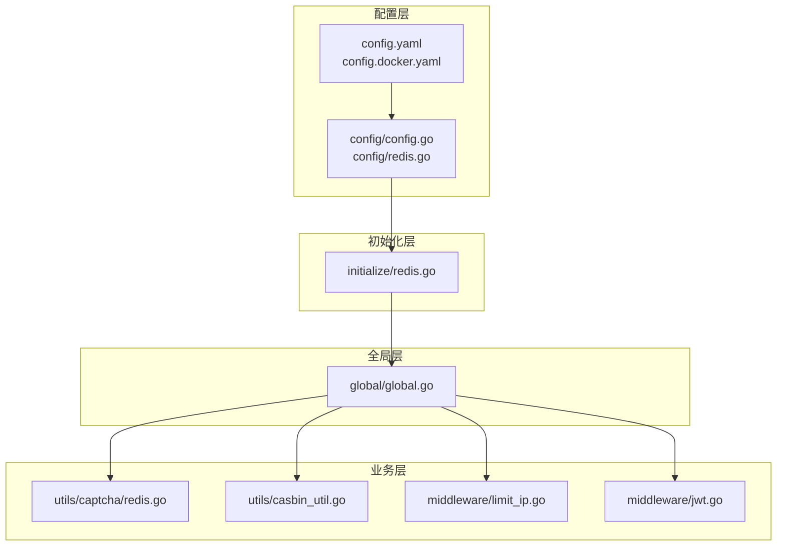
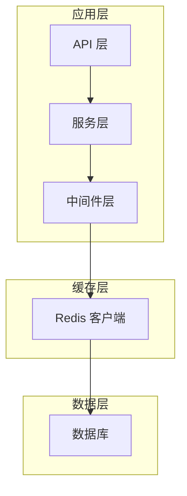
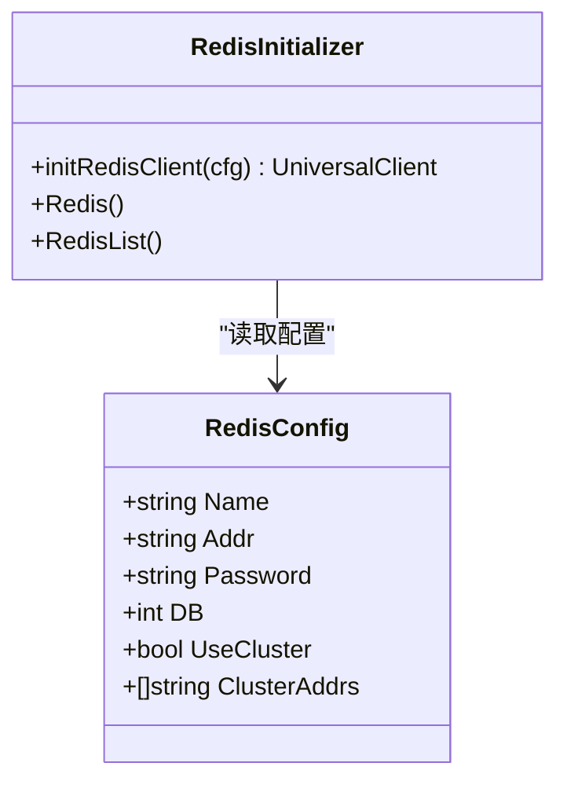
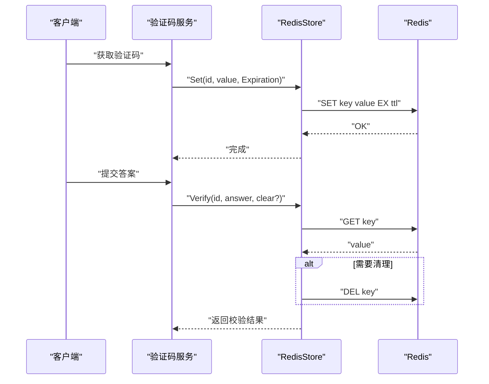
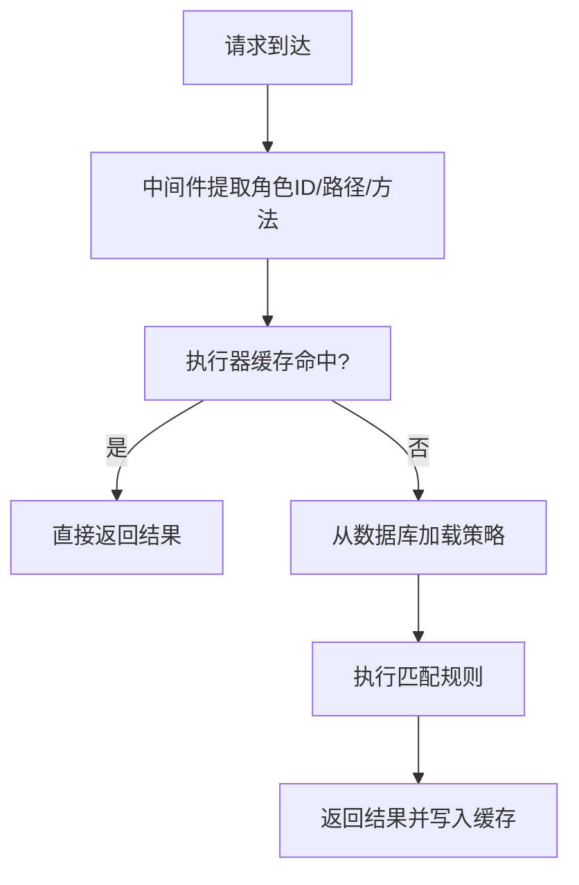
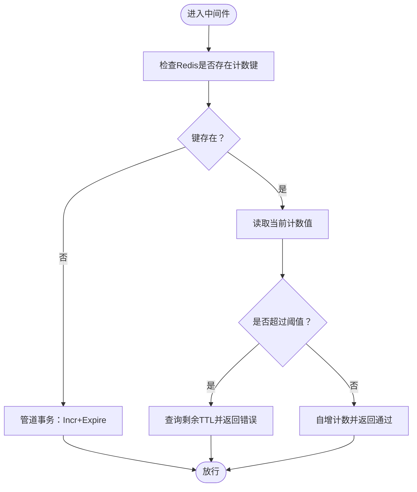
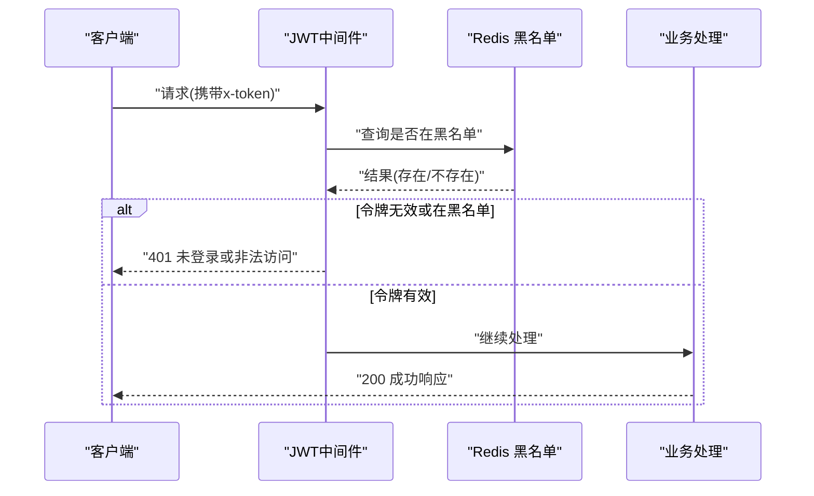
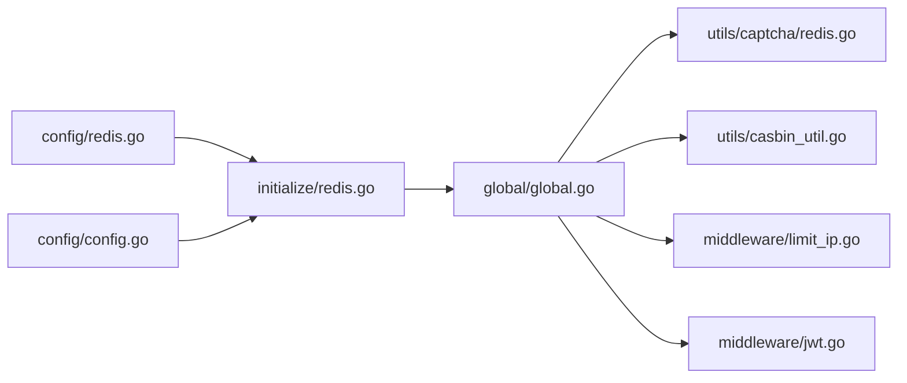

# 缓存策略优化

<cite>
**本文档引用的文件**
- [server/config/redis.go](file://server/config/redis.go)
- [server/config/config.go](file://server/config/config.go)
- [server/config.yaml](file://server/config.yaml)
- [server/config.docker.yaml](file://server/config.docker.yaml)
- [server/initialize/redis.go](file://server/initialize/redis.go)
- [server/global/global.go](file://server/global/global.go)
- [server/utils/captcha/redis.go](file://server/utils/captcha/redis.go)
- [server/utils/casbin_util.go](file://server/utils/casbin_util.go)
- [server/middleware/limit_ip.go](file://server/middleware/limit_ip.go)
- [server/middleware/jwt.go](file://server/middleware/jwt.go)
- [repowiki/zh/content/系统架构/性能优化策略.md](file://repowiki/zh/content/系统架构/性能优化策略.md)
- [repowiki/zh/content/数据库设计/数据库设计.md](file://repowiki/zh/content/数据库设计/数据库设计.md)
- [repowiki/zh/content/API文档/API文档.md](file://repowiki/zh/content/API文档/API文档.md)
- [repowiki/zh/content/安全权限/安全策略.md](file://repowiki/zh/content/安全权限/安全策略.md)
- [repowiki/zh/content/部署运维/部署运维.md](file://repowiki/zh/content/部署运维/部署运维.md)
- [repowiki/zh/content/部署运维/Kubernetes集群部署.md](file://repowiki/zh/content/部署运维/Kubernetes集群部署.md)
</cite>

## 目录
1. [简介](#简介)
2. [项目结构](#项目结构)
3. [核心组件](#核心组件)
4. [架构总览](#架构总览)
5. [详细组件分析](#详细组件分析)
6. [依赖分析](#依赖分析)
7. [性能考量](#性能考量)
8. [故障排查指南](#故障排查指南)
9. [结论](#结论)
10. [附录](#附录)

## 简介
本文件聚焦于 Gin-Vue-Admin 项目的缓存策略优化，围绕 Redis 缓存配置与初始化、连接池参数调优、单实例与集群模式、哨兵与集群部署策略展开；同时系统阐述缓存命中率提升技术（缓存预热、热点识别、分层设计）、缓存失效策略（LRU/LFU 淘汰、过期时间、穿透防护）、分布式一致性（更新策略、双写一致性、雪崩预防）、以及监控指标与性能测试方法，帮助评估与持续优化缓存效果。

## 项目结构
- 配置层：集中于配置文件与配置结构体，定义 Redis 单实例与集群模式、密码、DB 选择、集群节点列表等。
- 初始化层：根据配置动态创建 Redis 客户端，支持单实例与集群模式，并进行 Ping 校验。
- 全局层：将 Redis 客户端注入全局变量，供各模块复用。
- 业务层：验证码、权限校验等模块使用 Redis 实现缓存与限流。

**图表来源**
- [server/config/config.go:3-41](file://server/config/config.go#L3-L41)
- [server/config/redis.go:3-10](file://server/config/redis.go#L3-L10)
- [server/config.yaml:21-45](file://server/config.yaml#L21-L45)
- [server/config.docker.yaml:21-45](file://server/config.docker.yaml#L21-L45)
- [server/initialize/redis.go:13-45](file://server/initialize/redis.go#L13-L45)
- [server/global/global.go:25-42](file://server/global/global.go#L25-L42)
- [server/utils/captcha/redis.go:11-62](file://server/utils/captcha/redis.go#L11-L62)
- [server/utils/casbin_util.go:18-52](file://server/utils/casbin_util.go#L18-L52)
- [server/middleware/limit_ip.go:27-92](file://server/middleware/limit_ip.go#L27-L92)
- [server/middleware/jwt.go:16-77](file://server/middleware/jwt.go#L16-L77)

**章节来源**
- [server/config/config.go:3-41](file://server/config/config.go#L3-L41)
- [server/config/redis.go:3-10](file://server/config/redis.go#L3-L10)
- [server/config.yaml:21-45](file://server/config.yaml#L21-L45)
- [server/config.docker.yaml:21-45](file://server/config.docker.yaml#L21-L45)
- [server/initialize/redis.go:13-45](file://server/initialize/redis.go#L13-L45)
- [server/global/global.go:25-42](file://server/global/global.go#L25-L42)

## 核心组件
- Redis 配置模型：支持单实例与集群模式、密码、DB 选择、集群节点列表。
- 初始化器：根据配置创建单机或集群客户端，Ping 校验连通性。
- 全局客户端：单例注入，供验证码、权限、限流等模块共享。
- 业务缓存实现：验证码存储、权限策略缓存、IP 限流计数等。

**章节来源**
- [server/config/redis.go:3-10](file://server/config/redis.go#L3-L10)
- [server/initialize/redis.go:13-45](file://server/initialize/redis.go#L13-L45)
- [server/global/global.go:25-42](file://server/global/global.go#L25-L42)
- [server/utils/captcha/redis.go:11-62](file://server/utils/captcha/redis.go#L11-L62)
- [server/utils/casbin_util.go:18-52](file://server/utils/casbin_util.go#L18-L52)
- [server/middleware/limit_ip.go:27-92](file://server/middleware/limit_ip.go#L27-L92)

## 架构总览
Redis 在系统中的位置与交互如下：

**图表来源**
- [server/initialize/redis.go:13-45](file://server/initialize/redis.go#L13-L45)
- [server/utils/captcha/redis.go:32-54](file://server/utils/captcha/redis.go#L32-L54)
- [server/utils/casbin_util.go:47-52](file://server/utils/casbin_util.go#L47-L52)
- [server/middleware/limit_ip.go:64-92](file://server/middleware/limit_ip.go#L64-L92)

## 详细组件分析

### Redis 配置与初始化
- 配置模型
  - 单实例：地址、密码、DB。
  - 集群：useCluster=true，提供节点地址列表。
- 初始化流程
  - 根据配置选择 NewClient 或 NewClusterClient。
  - 执行 Ping 校验，记录日志。
- 优化建议
  - 连接池大小：根据并发请求量设置连接池上限，避免过多空闲连接。
  - 命中率：热点键设置合理过期时间，结合 LRU 淘汰策略。
  - 分片：多 DB 实例分片存储不同业务域数据。
  - 客户端复用：全局单例客户端，避免频繁创建销毁。
  - 网络：内网部署、长连接、超时与重试策略。

**图表来源**
- [server/config/redis.go:3-10](file://server/config/redis.go#L3-L10)
- [server/initialize/redis.go:13-45](file://server/initialize/redis.go#L13-L45)

**章节来源**
- [server/config/redis.go:3-10](file://server/config/redis.go#L3-L10)
- [server/initialize/redis.go:13-45](file://server/initialize/redis.go#L13-L45)
- [repowiki/zh/content/系统架构/性能优化策略.md:127-138](file://repowiki/zh/content/系统架构/性能优化策略.md#L127-L138)

### 验证码缓存（RedisStore）
- 设计要点
  - 使用前缀键与固定过期时间，便于清理与防滥用。
  - 支持上下文传递、设置/获取/校验/删除。
- 命中率与一致性
  - 合理设置过期时间，避免长期占用内存。
  - 校验后可选删除，防止重复使用。

**图表来源**
- [server/utils/captcha/redis.go:11-62](file://server/utils/captcha/redis.go#L11-L62)

**章节来源**
- [server/utils/captcha/redis.go:11-62](file://server/utils/captcha/redis.go#L11-L62)

### 权限缓存（Casbin SyncedCachedEnforcer）
- 设计要点
  - 使用缓存执行器，设置过期时间，减少数据库压力。
  - 首次加载策略，后续命中缓存快速返回。
- 更新策略
  - 按角色更新时先清理旧策略再重写入。
  - API 变更时同步更新策略，写入后触发 LoadPolicy 生效。

**图表来源**
- [server/utils/casbin_util.go:18-52](file://server/utils/casbin_util.go#L18-L52)
- [repowiki/zh/content/数据库设计/核心数据模型/API权限模型.md:293-318](file://repowiki/zh/content/数据库设计/核心数据模型/API权限模型.md#L293-L318)

**章节来源**
- [server/utils/casbin_util.go:18-52](file://server/utils/casbin_util.go#L18-L52)
- [repowiki/zh/content/数据库设计/核心数据模型/API权限模型.md:293-318](file://repowiki/zh/content/数据库设计/核心数据模型/API权限模型.md#L293-L318)

### IP 限流（基于 Redis 的计数与过期）
- 设计要点
  - 使用 Redis 键值计数与过期时间实现滑动/固定窗口限流。
  - 管道事务：Incr + Expire 保证原子性。
- 雪崩与穿透防护
  - 通过过期时间与 TTL 查询，避免无限增长。
  - 对异常阈值直接返回错误，保护下游。

**图表来源**
- [server/middleware/limit_ip.go:64-92](file://server/middleware/limit_ip.go#L64-L92)
- [server/config/system.go:8-9](file://server/config/system.go#L8-L9)

**章节来源**
- [server/middleware/limit_ip.go:27-92](file://server/middleware/limit_ip.go#L27-L92)
- [repowiki/zh/content/安全权限/安全策略.md:243-256](file://repowiki/zh/content/安全权限/安全策略.md#L243-L256)

### 认证与黑名单缓存（JWT 黑名单）
- 设计要点
  - JWT 中间件在每次请求时查询 Redis 黑名单，若存在则拒绝。
  - 令牌失效（登出/吊销）时写入黑名单，设置过期时间。
- 一致性
  - 登出即刻生效，避免缓存击穿导致的短暂放行。

**图表来源**
- [server/middleware/jwt.go:16-77](file://server/middleware/jwt.go#L16-L77)
- [repowiki/zh/content/API文档/API文档.md:144-159](file://repowiki/zh/content/API文档/API文档.md#L144-L159)

**章节来源**
- [server/middleware/jwt.go:16-77](file://server/middleware/jwt.go#L16-L77)
- [repowiki/zh/content/API文档/API文档.md:131-159](file://repowiki/zh/content/API文档/API文档.md#L131-L159)

## 依赖分析
- 配置到初始化：config/redis.go 与 config/config.go 定义配置结构，initialize/redis.go 读取并创建客户端。
- 初始化到全局：initialize/redis.go 将客户端注入 global/global.go 的全局变量。
- 全局到业务：验证码、权限、限流中间件通过 global 全局变量使用 Redis。

**图表来源**
- [server/config/redis.go:3-10](file://server/config/redis.go#L3-L10)
- [server/config/config.go:3-41](file://server/config/config.go#L3-L41)
- [server/initialize/redis.go:13-45](file://server/initialize/redis.go#L13-L45)
- [server/global/global.go:25-42](file://server/global/global.go#L25-L42)
- [server/utils/captcha/redis.go:11-62](file://server/utils/captcha/redis.go#L11-L62)
- [server/utils/casbin_util.go:18-52](file://server/utils/casbin_util.go#L18-L52)
- [server/middleware/limit_ip.go:27-92](file://server/middleware/limit_ip.go#L27-L92)
- [server/middleware/jwt.go:16-77](file://server/middleware/jwt.go#L16-L77)

**章节来源**
- [server/config/redis.go:3-10](file://server/config/redis.go#L3-L10)
- [server/config/config.go:3-41](file://server/config/config.go#L3-L41)
- [server/initialize/redis.go:13-45](file://server/initialize/redis.go#L13-L45)
- [server/global/global.go:25-42](file://server/global/global.go#L25-L42)

## 性能考量
- 连接池参数调优
  - 根据并发请求量设置连接池上限，避免过多空闲连接造成资源浪费。
  - 单实例与集群模式下均需关注 Ping 校验与超时设置。
- 命中率优化
  - 热点键设置合理过期时间，结合 LRU 淘汰策略。
  - 对高频读取的数据（如菜单树、字典树、权限矩阵）进行缓存预热。
- 分层设计
  - 多 DB 实例分片存储不同业务域数据，降低单实例压力。
  - 客户端复用与全局单例，避免频繁创建销毁带来的开销。
- 网络与部署
  - 内网部署、长连接、超时与重试策略，结合 Docker/Kubernetes 编排提升可用性。

**章节来源**
- [repowiki/zh/content/系统架构/性能优化策略.md:127-138](file://repowiki/zh/content/系统架构/性能优化策略.md#L127-L138)
- [repowiki/zh/content/数据库设计/数据库设计.md:399-407](file://repowiki/zh/content/数据库设计/数据库设计.md#L399-L407)

## 故障排查指南
- 连接失败
  - 检查 Redis 地址、密码、DB/集群节点列表配置。
  - 查看初始化日志，确认 Ping 校验是否成功。
- 命中率低
  - 分析热点键分布，调整过期时间与淘汰策略。
  - 对高频读取数据进行预热，减少冷启动抖动。
- 雪崩与穿透
  - 为热点键设置随机过期时间，避免同时失效。
  - 对空值也设置短 TTL，防止缓存穿透放大。
- 一致性问题
  - 权限策略更新后及时触发 LoadPolicy。
  - 黑名单写入后设置过期时间，避免长期占用。

**章节来源**
- [server/initialize/redis.go:29-36](file://server/initialize/redis.go#L29-L36)
- [server/utils/casbin_util.go:47-52](file://server/utils/casbin_util.go#L47-L52)
- [server/middleware/jwt.go:16-77](file://server/middleware/jwt.go#L16-L77)

## 结论
通过规范的 Redis 配置与初始化、合理的连接池参数、命中率与一致性优化策略，以及完善的监控与测试方法，可显著提升 Gin-Vue-Admin 的缓存性能与稳定性。建议在生产环境中结合内网部署、长连接、超时与重试策略，并持续评估命中率与延迟，动态调整过期时间与淘汰策略。

## 附录
- 部署与运行参考
  - 本地开发与测试：使用 Docker Compose 快速拉起应用、数据库与缓存服务。
  - 生产部署：使用 Kubernetes 清单进行编排，结合 ConfigMap/Secret 管理敏感配置。
  - 配置文件位置：应用配置文件位于 server/config.yaml 与 server/config.docker.yaml。

**章节来源**
- [repowiki/zh/content/部署运维/部署运维.md:262-273](file://repowiki/zh/content/部署运维/部署运维.md#L262-L273)
- [repowiki/zh/content/部署运维/Kubernetes集群部署.md:32-369](file://repowiki/zh/content/部署运维/Kubernetes集群部署.md#L32-L369)