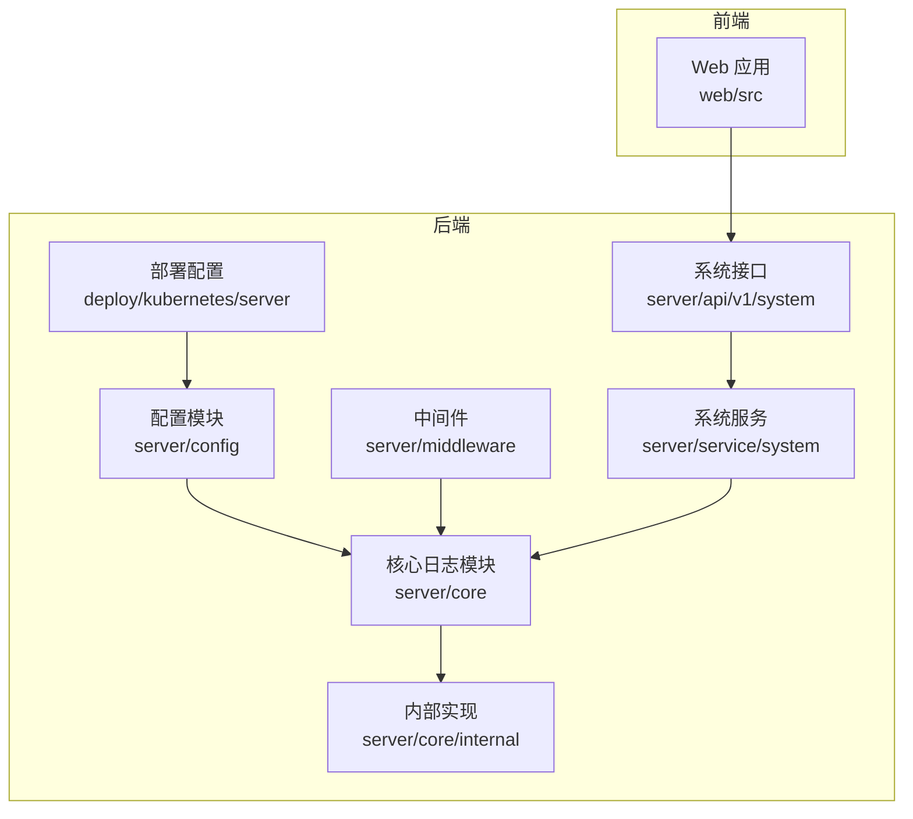
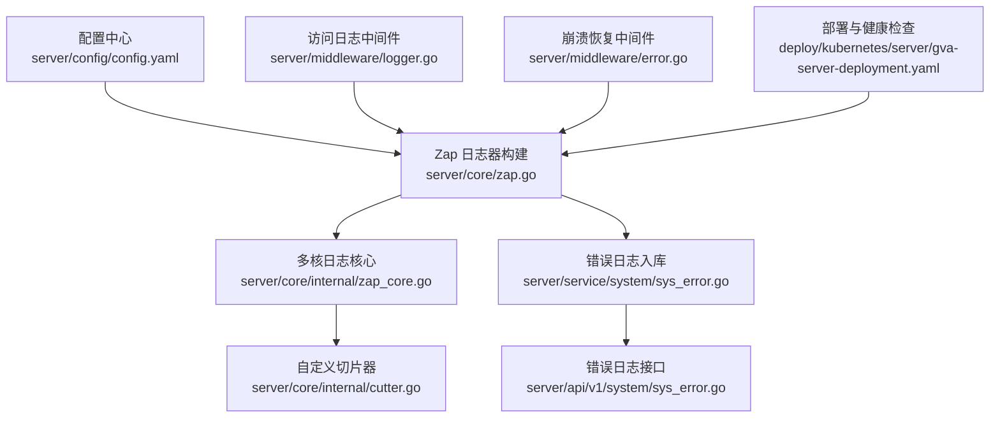
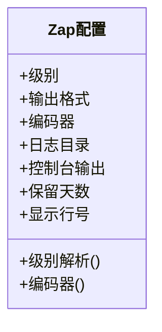
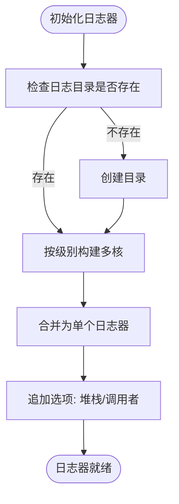
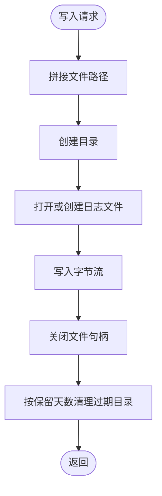
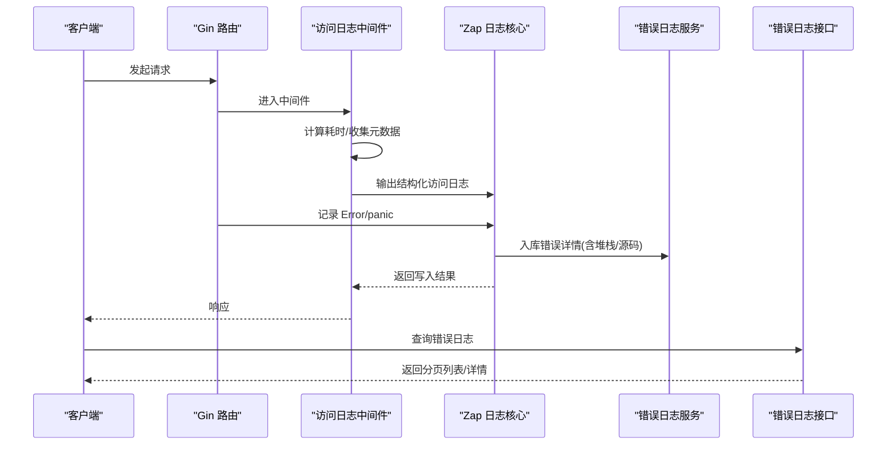
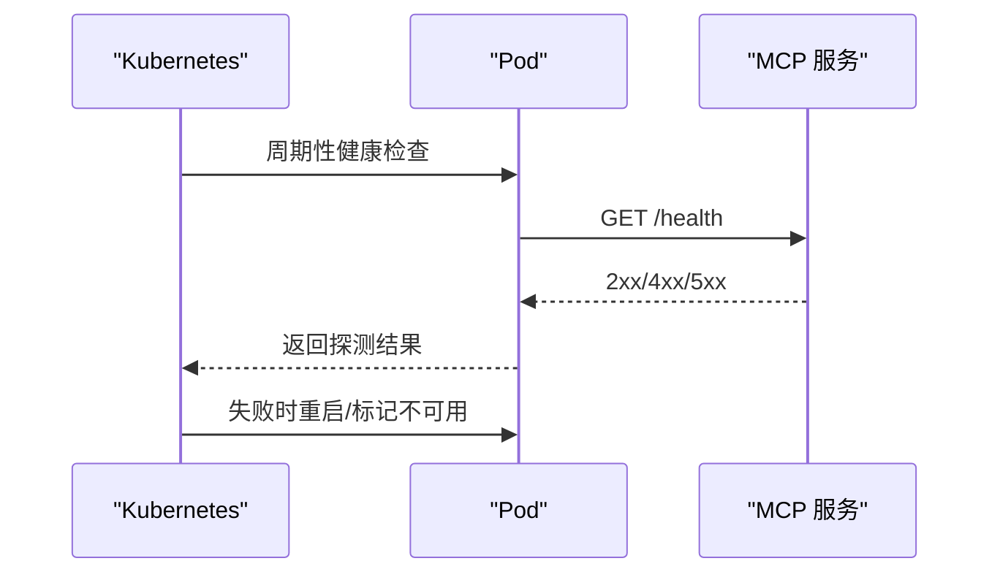
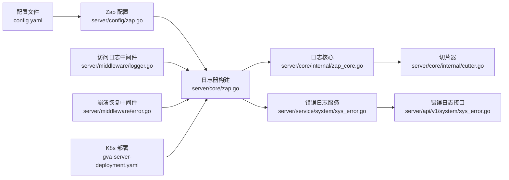

# 监控与日志管理

<cite>
**本文引用的文件**
- [监控与日志管理.md](file://repowiki/zh/content/部署运维/监控与日志管理.md)
- [zap.go](file://server/config/zap.go)
- [config.go](file://server/config/config.go)
- [config.yaml](file://server/config.yaml)
- [zap.go](file://server/core/zap.go)
- [zap_core.go](file://server/core/internal/zap_core.go)
- [cutter.go](file://server/core/internal/cutter.go)
- [logger.go](file://server/middleware/logger.go)
- [error.go](file://server/middleware/error.go)
- [sys_error.go](file://server/service/system/sys_error.go)
- [sys_error.go](file://server/api/v1/system/sys_error.go)
- [gva-server-deployment.yaml](file://deploy/kubernetes/server/gva-server-deployment.yaml)
- [standalone_manager.go](file://server/mcp/standalone_manager.go)
- [docs.go](file://server/docs/docs.go)
- [swagger.json](file://server/docs/swagger.json)
</cite>

## 目录
1. [简介](#简介)
2. [项目结构](#项目结构)
3. [核心组件](#核心组件)
4. [架构总览](#架构总览)
5. [详细组件分析](#详细组件分析)
6. [依赖分析](#依赖分析)
7. [性能考量](#性能考量)
8. [故障排查指南](#故障排查指南)
9. [结论](#结论)
10. [附录](#附录)

## 简介
本技术文档面向测试管理平台的监控与日志管理建设，系统性阐述以下内容：
- 基于 Zap 的日志体系：日志级别、编码器、输出格式、控制台与文件双写、多核日志器、切片与轮转策略、错误日志入库与可视化查询。
- 系统与业务监控：系统指标（CPU、内存、磁盘、网络）、业务指标（请求量、响应时间、错误率）的采集与落地点。
- 告警机制：告警规则配置、告警级别、通知渠道、去重与抑制策略的设计思路。
- 故障排查：问题定位方法、根因分析、应急响应与恢复策略。
- 可视化与分析：Prometheus/Grafana 集成建议、日志分析与错误追踪实践。

## 项目结构
后端以 Gin 为核心，日志子系统通过 Zap 实现统一采集与落盘，同时具备错误日志入库与可视化查询能力。前端通过 API 层访问系统能力，部署采用 Kubernetes，内置健康检查探针保障可用性。

**图表来源**
- [监控与日志管理.md:44-64](file://repowiki/zh/content/部署运维/监控与日志管理.md#L44-L64)
- [zap.go:13-36](file://server/core/zap.go#L13-L36)
- [logger.go:41-89](file://server/middleware/logger.go#L41-L89)
- [error.go:21-80](file://server/middleware/error.go#L21-L80)
- [sys_error.go:14-126](file://server/service/system/sys_error.go#L14-L126)
- [sys_error.go:14-200](file://server/api/v1/system/sys_error.go#L14-L200)
- [gva-server-deployment.yaml:12-74](file://deploy/kubernetes/server/gva-server-deployment.yaml#L12-L74)

**章节来源**
- [监控与日志管理.md:41-64](file://repowiki/zh/content/部署运维/监控与日志管理.md#L41-L64)
- [config.yaml:10-19](file://server/config.yaml#L10-L19)

## 核心组件
- 配置模型：集中定义日志、数据库、缓存、对象存储等配置项，便于统一管理与热加载。
- Zap 日志核心：负责构建多核日志器、级别过滤、编码器选择与写入器组合。
- 自定义切片器：按级别与日期生成文件路径，支持控制保留天数与目录清理。
- 错误日志入库：将 Error 及以上级别的日志内容入库，便于检索与 AI 方案生成。
- Web 访问日志中间件：对请求路径、参数、耗时、错误等进行结构化输出。
- 崩溃恢复中间件：捕获 panic 并记录请求上下文与堆栈，同时入库。
- 错误日志服务与接口：提供增删改查、分页检索与异步处理入口。

**章节来源**
- [监控与日志管理.md:80-86](file://repowiki/zh/content/部署运维/监控与日志管理.md#L80-L86)
- [zap.go:1-72](file://server/config/zap.go#L1-L72)
- [zap.go:13-36](file://server/core/zap.go#L13-L36)
- [zap_core.go:18-134](file://server/core/internal/zap_core.go#L18-L134)
- [cutter.go:11-126](file://server/core/internal/cutter.go#L11-L126)
- [logger.go:14-90](file://server/middleware/logger.go#L14-L90)
- [error.go:20-81](file://server/middleware/error.go#L20-L81)
- [sys_error.go:14-126](file://server/service/system/sys_error.go#L14-L126)
- [sys_error.go:14-200](file://server/api/v1/system/sys_error.go#L14-L200)

## 架构总览
下图展示了日志与监控在系统中的位置与交互关系：配置驱动日志器构建，中间件负责访问日志与崩溃恢复，错误日志入库并提供查询接口，部署层通过健康检查保障可用性。

**图表来源**
- [config.yaml:10-19](file://server/config.yaml#L10-L19)
- [zap.go:13-36](file://server/core/zap.go#L13-L36)
- [zap_core.go:18-134](file://server/core/internal/zap_core.go#L18-L134)
- [cutter.go:11-126](file://server/core/internal/cutter.go#L11-L126)
- [logger.go:41-89](file://server/middleware/logger.go#L41-L89)
- [error.go:21-80](file://server/middleware/error.go#L21-L80)
- [sys_error.go:14-126](file://server/service/system/sys_error.go#L14-L126)
- [sys_error.go:14-200](file://server/api/v1/system/sys_error.go#L14-L200)
- [gva-server-deployment.yaml:44-58](file://deploy/kubernetes/server/gva-server-deployment.yaml#L44-L58)

## 详细组件分析

### 日志配置与级别
- 配置项来源：配置模型包含日志级别、输出格式、编码器、目录、是否控制台输出、是否显示行号、保留天数等。
- 级别解析：将字符串级别解析为 Zap Level，并生成从该级别到致命级别的全集，用于构建多核日志器。
- 编码器：支持 JSON 与控制台两种格式，时间前缀可自定义，级别编码器支持大小写与彩色选项。
- 控制台输出：可选将日志同时输出到控制台与文件。

**图表来源**
- [zap.go:8-71](file://server/config/zap.go#L8-L71)

**章节来源**
- [zap.go:8-71](file://server/config/zap.go#L8-L71)
- [config.go:1-41](file://server/config/config.go#L1-L41)
- [config.yaml:10-19](file://server/config.yaml#L10-L19)

### Zap 日志器构建与多核
- 目录创建：若日志目录不存在则自动创建。
- 多核构建：遍历有效级别集合，为每个级别创建一个核心，使用“分流”写入器将不同级别写入对应文件。
- 堆栈与调用者：启用 Error 级别及以上堆栈捕捉，可选启用调用者信息。
- 入库逻辑：在写入完成后，对 Error 及以上级别进行入库处理，避免与 GORM 日志写入递归。

**图表来源**
- [zap.go:15-36](file://server/core/zap.go#L15-L36)

**章节来源**
- [zap.go:15-36](file://server/core/zap.go#L15-L36)

### 自定义切片器与轮转策略
- 文件命名：按“目录/日期/自定义参数/级别.log”的路径组织，日期布局可配置。
- 写入与同步：写入时确保目录存在，写入完成后关闭文件句柄；提供同步接口。
- 保留清理：按保留天数清理过期目录，默认保留天数小于等于零时忽略清理。

**图表来源**
- [cutter.go:58-95](file://server/core/internal/cutter.go#L58-L95)

**章节来源**
- [cutter.go:58-95](file://server/core/internal/cutter.go#L58-L95)
- [cutter.go:108-126](file://server/core/internal/cutter.go#L108-L126)

### 访问日志中间件与错误日志入库
- 访问日志：结构化输出请求路径、参数、耗时、错误、来源等字段，支持过滤与脱敏。
- 错误日志：Error 及以上级别日志入库，包含来源文件与行号、调用栈、最终调用方法与源码片段，便于快速定位。
- 崩溃恢复：捕获 panic，记录请求上下文与堆栈，入库并返回统一错误码。

**图表来源**
- [logger.go:41-89](file://server/middleware/logger.go#L41-L89)
- [zap_core.go:63-129](file://server/core/internal/zap_core.go#L63-L129)
- [sys_error.go:14-126](file://server/service/system/sys_error.go#L14-L126)
- [sys_error.go:14-200](file://server/api/v1/system/sys_error.go#L14-L200)

**章节来源**
- [logger.go:14-90](file://server/middleware/logger.go#L14-L90)
- [error.go:21-80](file://server/middleware/error.go#L21-L80)
- [zap_core.go:74-127](file://server/core/internal/zap_core.go#L74-L127)
- [sys_error.go:52-82](file://server/service/system/sys_error.go#L52-L82)

### 第三方服务监控与健康检查
- MCP 独立服务：提供健康检查 URL 与监听地址解析，支持托管进程生命周期管理与可达性检测。
- Kubernetes 探针：存活/就绪/启动探针配置，保障服务可用性与自动恢复。

**图表来源**
- [standalone_manager.go:77-86](file://server/mcp/standalone_manager.go#L77-L86)
- [standalone_manager.go:242-269](file://server/mcp/standalone_manager.go#L242-L269)
- [gva-server-deployment.yaml:44-65](file://deploy/kubernetes/server/gva-server-deployment.yaml#L44-L65)

**章节来源**
- [standalone_manager.go:77-86](file://server/mcp/standalone_manager.go#L77-L86)
- [standalone_manager.go:242-269](file://server/mcp/standalone_manager.go#L242-L269)
- [gva-server-deployment.yaml:44-65](file://deploy/kubernetes/server/gva-server-deployment.yaml#L44-L65)

## 依赖分析
- 配置驱动：日志级别、编码器、输出格式、保留天数均来自配置文件，支持热加载与统一管理。
- 组件耦合：日志核心依赖配置与切片器，中间件依赖日志器，服务与接口依赖数据库与日志入库。
- 外部依赖：Kubernetes 探针与 MCP 健康检查作为系统可用性保障。

**图表来源**
- [config.yaml:10-19](file://server/config.yaml#L10-L19)
- [zap.go:8-71](file://server/config/zap.go#L8-L71)
- [zap.go:15-36](file://server/core/zap.go#L15-L36)
- [zap_core.go:18-134](file://server/core/internal/zap_core.go#L18-L134)
- [cutter.go:11-126](file://server/core/internal/cutter.go#L11-L126)
- [logger.go:41-89](file://server/middleware/logger.go#L41-L89)
- [error.go:21-80](file://server/middleware/error.go#L21-L80)
- [sys_error.go:14-126](file://server/service/system/sys_error.go#L14-L126)
- [sys_error.go:14-200](file://server/api/v1/system/sys_error.go#L14-L200)
- [gva-server-deployment.yaml:12-74](file://deploy/kubernetes/server/gva-server-deployment.yaml#L12-L74)

**章节来源**
- [config.yaml:10-19](file://server/config.yaml#L10-L19)
- [zap.go:8-71](file://server/config/zap.go#L8-L71)
- [zap.go:15-36](file://server/core/zap.go#L15-L36)
- [zap_core.go:18-134](file://server/core/internal/zap_core.go#L18-L134)
- [cutter.go:11-126](file://server/core/internal/cutter.go#L11-L126)
- [logger.go:41-89](file://server/middleware/logger.go#L41-L89)
- [error.go:21-80](file://server/middleware/error.go#L21-L80)
- [sys_error.go:14-126](file://server/service/system/sys_error.go#L14-L126)
- [sys_error.go:14-200](file://server/api/v1/system/sys_error.go#L14-L200)
- [gva-server-deployment.yaml:12-74](file://deploy/kubernetes/server/gva-server-deployment.yaml#L12-L74)

## 性能考量
- 日志写入：采用多核分流与文件句柄复用，减少锁竞争；保留天数清理避免磁盘膨胀。
- 访问日志：结构化输出，避免复杂格式化开销；支持过滤与脱敏，降低敏感信息泄露风险。
- 错误日志：仅在 Error 及以上级别入库，避免高频写入；入库前解析堆栈与源码，提升定位效率。
- 部署探针：合理设置探针间隔与超时，避免频繁探测影响性能。

[本节为通用性能建议，无需特定文件引用]

## 故障排查指南
- 问题定位：通过访问日志中间件的结构化输出与错误日志入库的堆栈信息，快速定位请求路径、参数与最终调用方法。
- 根因分析：结合 MCP 健康检查与 Kubernetes 探针状态，判断是应用内部异常还是外部依赖问题。
- 应急响应：启用降级策略与熔断机制，限制下游依赖压力；通过错误日志接口进行紧急修复与回滚。
- 故障恢复：利用部署层的健康检查与自动重启机制，确保服务尽快恢复可用。

**章节来源**
- [logger.go:41-89](file://server/middleware/logger.go#L41-L89)
- [error.go:21-80](file://server/middleware/error.go#L21-L80)
- [zap_core.go:103-118](file://server/core/internal/zap_core.go#L103-L118)
- [standalone_manager.go:242-269](file://server/mcp/standalone_manager.go#L242-L269)
- [gva-server-deployment.yaml:44-65](file://deploy/kubernetes/server/gva-server-deployment.yaml#L44-L65)

## 结论
本项目通过集中配置、多核日志器、结构化访问日志与错误入库，构建了完善的日志与监控基础。结合外部监控工具，可进一步实现系统指标、性能与业务监控的可视化与自动化告警，提升运维效率与问题定位速度。

[本节为总结性内容，无需特定文件引用]

## 附录

### Prometheus 与 Grafana 集成建议
- 指标暴露：在应用中引入指标导出库，暴露关键指标（如请求耗时、错误率、队列长度等），并通过 HTTP 端点暴露给 Prometheus 抓取。
- 抓取配置：在 Prometheus 中配置抓取目标，设置合适的抓取间隔与超时。
- 图表与仪表板：在 Grafana 中创建面板，使用 PromQL 查询指标，设置告警规则并绑定通知通道。

[本节为通用集成建议，无需特定文件引用]

### 告警规则与通知渠道
- 告警规则：基于错误率、P95/P99 延迟、资源使用率等设置阈值与持续时间。
- 通知渠道：对接邮件、IM、短信等通知方式，确保关键告警及时触达。

[本节为通用运维建议，无需特定文件引用]

### 故障自动恢复机制
- 健康检查：利用部署配置中的存活/就绪探针，确保服务可用性。
- 自动重启：容器编排系统在探针失败时自动重启 Pod。
- 降级策略：在高负载或依赖异常时，启用降级开关与熔断策略。

**章节来源**
- [gva-server-deployment.yaml:44-65](file://deploy/kubernetes/server/gva-server-deployment.yaml#L44-L65)

### 监控可视化与日志分析工具使用指南
- Swagger 文档：通过接口文档了解错误日志的查询与处理接口，便于集成到监控与分析平台。
- 日志分析：结合结构化访问日志与错误日志入库，使用日志聚合工具进行检索与统计分析。

**章节来源**
- [docs.go:3358-3395](file://server/docs/docs.go#L3358-L3395)
- [swagger.json:3346-3383](file://server/docs/swagger.json#L3346-L3383)
- [sys_error.go:14-200](file://server/api/v1/system/sys_error.go#L14-L200)