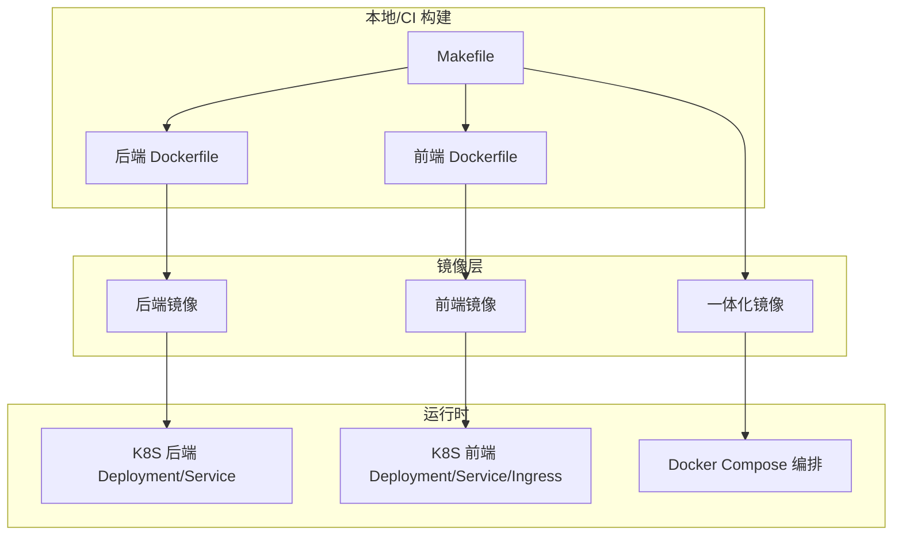
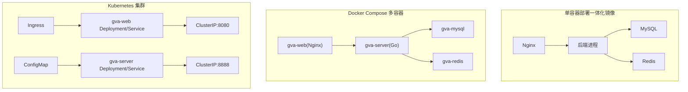
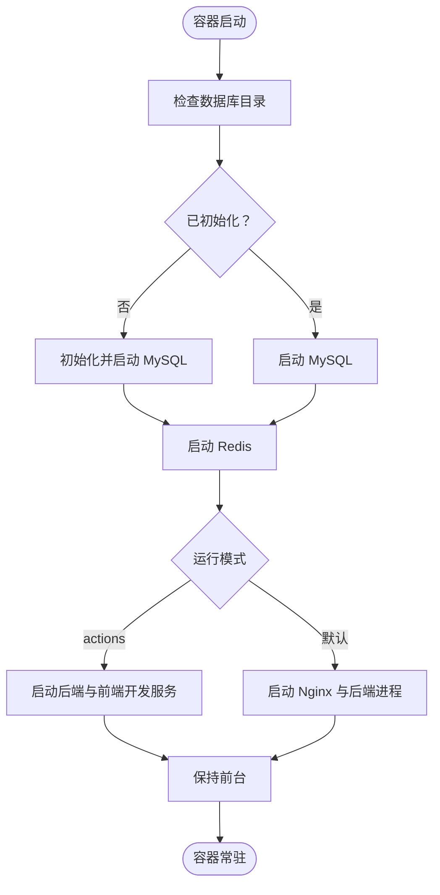
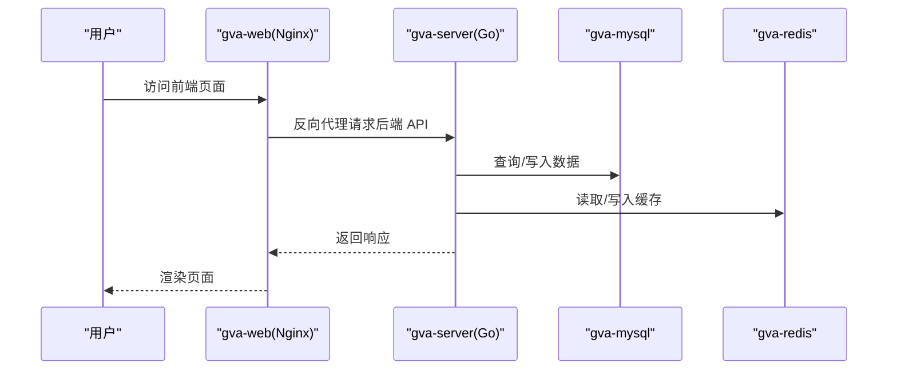
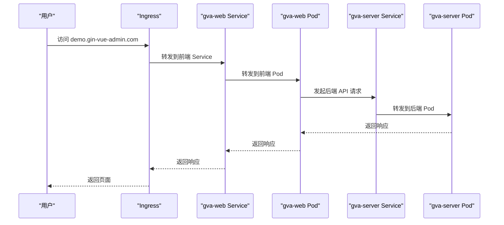
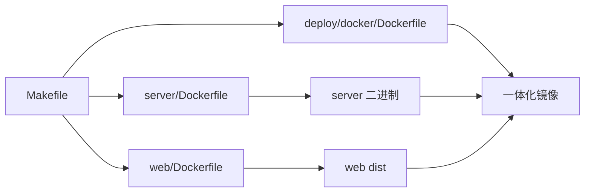

# 部署运维指南

<cite>
**本文引用的文件**
- [Dockerfile（一体化镜像）](file://deploy/docker/Dockerfile)
- [入口脚本（一体化镜像）](file://deploy/docker/entrypoint.sh)
- [Docker Compose 编排](file://deploy/docker-compose/docker-compose.yaml)
- [Kubernetes 后端 Deployment](file://deploy/kubernetes/server/gva-server-deployment.yaml)
- [Kubernetes 后端 Service](file://deploy/kubernetes/server/gva-server-service.yaml)
- [Kubernetes 后端 ConfigMap](file://deploy/kubernetes/server/gva-server-configmap.yaml)
- [Kubernetes 前端 Deployment](file://deploy/kubernetes/web/gva-web-deploymemt.yaml)
- [Kubernetes 前端 Service](file://deploy/kubernetes/web/gva-web-service.yaml)
- [Kubernetes Ingress](file://deploy/kubernetes/web/gva-web-ingress.yaml)
- [后端配置（通用）](file://server/config.yaml)
- [后端配置（容器专用）](file://server/config.docker.yaml)
- [Makefile（构建与打包）](file://Makefile)
- [项目总览（README）](file://README.md)
- [Dockerfile（后端）](file://server/Dockerfile)
- [Dockerfile（前端）](file://web/Dockerfile)
- [后端入口](file://server/main.go)
- [后端模块清单](file://server/go.mod)
- [前端包清单](file://web/package.json)
- [前端Vite配置](file://web/vite.config.js)
- [前端忽略规则](file://web/.dockerignore)
- [K8s服务端Service](file://deploy/kubernetes/server/gva-server-service.yaml)
- [K8s前端Service](file://deploy/kubernetes/web/gva-web-service.yaml)
- [K8s前端Ingress](file://deploy/kubernetes/web/gva-web-ingress.yaml)
- [server/go.mod](file://server/go.mod)
- [server/core/server.go](file://server/core/server.go)
- [server/config/zap.go](file://server/config/zap.go)
- [server/core/zap.go](file://server/core/zap.go)
- [server/core/internal/zap_core.go](file://server/core/internal/zap_core.go)
- [server/core/internal/cutter.go](file://server/core/internal/cutter.go)
- [server/middleware/logger.go](file://server/middleware/logger.go)
- [server/middleware/error.go](file://server/middleware/error.go)
- [server/service/system/sys_error.go](file://server/service/system/sys_error.go)
- [server/api/v1/system/sys_error.go](file://server/api/v1/system/sys_error.go)
</cite>

## 目录
1. [简介](#简介)
2. [项目结构](#项目结构)
3. [核心组件](#核心组件)
4. [架构总览](#架构总览)
5. [详细组件分析](#详细组件分析)
6. [依赖分析](#依赖分析)
7. [性能考虑](#性能考虑)
8. [故障排查指南](#故障排查指南)
9. [结论](#结论)
10. [附录](#附录)

## 简介
本文件面向测试管理平台的部署与运维团队，提供从单容器到多容器编排，再到 Kubernetes 集群部署的完整方案；涵盖数据库、缓存、对象存储的部署与集成要点；给出生产环境性能优化、监控与日志、备份恢复及故障处理的实践建议，并说明部署脚本与自动化工具的使用。

## 项目结构
项目采用前后端分离与容器化部署策略：
- 后端服务基于 Go 语言，提供 REST API 与 Swagger 文档。
- 前端基于 Vue3 + Vite，构建产物由 Nginx 提供静态服务。
- 提供 Docker 与 Docker Compose 单机部署方案，以及 Kubernetes 多组件编排方案。
- 通过 Makefile 提供统一的构建与打包流程。

图表来源
- [Makefile（构建与打包）:1-76](file://Makefile#L1-L76)
- [Dockerfile（后端）:1-32](file://server/Dockerfile#L1-L32)
- [Dockerfile（前端）:1-26](file://web/Dockerfile#L1-L26)
- [Dockerfile（一体化镜像）:1-18](file://deploy/docker/Dockerfile#L1-L18)
- [Kubernetes 后端 Deployment:1-74](file://deploy/kubernetes/server/gva-server-deployment.yaml#L1-L74)
- [Kubernetes 前端 Deployment:1-52](file://deploy/kubernetes/web/gva-web-deploymemt.yaml#L1-L52)
- [Docker Compose 编排:1-91](file://deploy/docker-compose/docker-compose.yaml#L1-L91)

章节来源
- [Makefile（构建与打包）:1-76](file://Makefile#L1-L76)
- [项目总览（README）:1-390](file://README.md#L1-L390)

## 核心组件
- 后端服务（Go + Gin）
  - 镜像构建：多阶段构建，精简运行时。
  - 启动参数：通过配置文件启动。
- 前端服务（Vue3 + Nginx）
  - 镜像构建：Node 构建产物，Nginx 提供静态服务。
- 一体化镜像
  - 将前端构建产物与后端二进制打包至同一镜像，内置 Nginx 与后端进程。
- 数据库与缓存
  - 默认使用 MySQL 与 Redis；可通过配置切换。
- 对象存储
  - 支持本地、七牛、阿里云、腾讯云、AWS S3、Cloudflare R2、华为 OBS 等。
- 配置管理
  - 通过 ConfigMap/ConfigMap 文件挂载注入，支持热更新与多环境切换。

章节来源
- [Dockerfile（后端）:1-32](file://server/Dockerfile#L1-L32)
- [Dockerfile（前端）:1-26](file://web/Dockerfile#L1-L26)
- [Dockerfile（一体化镜像）:1-18](file://deploy/docker/Dockerfile#L1-L18)
- [后端配置（通用）:1-284](file://server/config.yaml#L1-L284)
- [后端配置（容器专用）:1-283](file://server/config.docker.yaml#L1-L283)

## 架构总览
下图展示三种部署形态的组件交互与数据流：

图表来源
- [Dockerfile（一体化镜像）:1-18](file://deploy/docker/Dockerfile#L1-L18)
- [入口脚本（一体化镜像）:1-19](file://deploy/docker/entrypoint.sh#L1-L19)
- [Docker Compose 编排:1-91](file://deploy/docker-compose/docker-compose.yaml#L1-L91)
- [Kubernetes 后端 Deployment:1-74](file://deploy/kubernetes/server/gva-server-deployment.yaml#L1-L74)
- [Kubernetes 后端 Service:1-22](file://deploy/kubernetes/server/gva-server-service.yaml#L1-L22)
- [Kubernetes 前端 Service:1-22](file://deploy/kubernetes/web/gva-web-service.yaml#L1-L22)
- [Kubernetes Ingress:1-18](file://deploy/kubernetes/web/gva-web-ingress.yaml#L1-L18)
- [后端配置（容器专用）:1-283](file://server/config.docker.yaml#L1-L283)

## 详细组件分析

### 单容器部署（一体化镜像）
- 镜像构建
  - 基于 CentOS，安装 Nginx、Go、Node、Git、Redis、MySQL 社区版。
  - 将前端构建产物与后端二进制复制至镜像，内置 Nginx 配置。
- 启动流程
  - 首次启动初始化 MySQL 数据库与用户；随后启动 Redis、Nginx 与后端进程。
  - 提供"actions"模式用于开发调试。
- 端口暴露
  - Web 80；后端 8888；MySQL 3306；Redis 6379。

图表来源
- [Dockerfile（一体化镜像）:1-18](file://deploy/docker/Dockerfile#L1-L18)
- [入口脚本（一体化镜像）:1-19](file://deploy/docker/entrypoint.sh#L1-L19)

章节来源
- [Dockerfile（一体化镜像）:1-18](file://deploy/docker/Dockerfile#L1-L18)
- [入口脚本（一体化镜像）:1-19](file://deploy/docker/entrypoint.sh#L1-L19)

### Docker Compose 多容器编排
- 网络与卷
  - 自定义子网；MySQL、Redis 使用命名卷持久化。
- 服务关系
  - gva-web 依赖 gva-server；gva-server 依赖 gva-mysql 与 gva-redis。
- 健康检查
  - MySQL 与 Redis 提供健康检查，确保后端服务延迟启动。
- 端口映射
  - gva-web: 8080 → 8080；gva-server: 8888 → 8888；gva-mysql: 13306 → 3306；gva-redis: 16379 → 6379。

图表来源
- [Docker Compose 编排:1-91](file://deploy/docker-compose/docker-compose.yaml#L1-L91)

章节来源
- [Docker Compose 编排:1-91](file://deploy/docker-compose/docker-compose.yaml#L1-L91)

### Kubernetes 集群部署
- 后端
  - Deployment：拉取镜像、挂载 ConfigMap、设置资源请求/限制、健康探针。
  - Service：ClusterIP 暴露 8888。
- 前端
  - Deployment：拉取镜像、挂载 Nginx 配置 ConfigMap、就绪探针。
  - Service：ClusterIP 暴露 8080。
  - Ingress：将域名解析到前端 Service。
- 配置管理
  - 通过 ConfigMap 注入后端配置，避免硬编码敏感信息。

图表来源
- [Kubernetes 后端 Deployment:1-74](file://deploy/kubernetes/server/gva-server-deployment.yaml#L1-L74)
- [Kubernetes 后端 Service:1-22](file://deploy/kubernetes/server/gva-server-service.yaml#L1-L22)
- [Kubernetes 前端 Deployment:1-52](file://deploy/kubernetes/web/gva-web-deploymemt.yaml#L1-L52)
- [Kubernetes 前端 Service:1-22](file://deploy/kubernetes/web/gva-web-service.yaml#L1-L22)
- [Kubernetes Ingress:1-18](file://deploy/kubernetes/web/gva-web-ingress.yaml#L1-L18)

章节来源
- [Kubernetes 后端 Deployment:1-74](file://deploy/kubernetes/server/gva-server-deployment.yaml#L1-L74)
- [Kubernetes 后端 Service:1-22](file://deploy/kubernetes/server/gva-server-service.yaml#L1-L22)
- [Kubernetes 前端 Deployment:1-52](file://deploy/kubernetes/web/gva-web-deploymemt.yaml#L1-L52)
- [Kubernetes 前端 Service:1-22](file://deploy/kubernetes/web/gva-web-service.yaml#L1-L22)
- [Kubernetes Ingress:1-18](file://deploy/kubernetes/web/gva-web-ingress.yaml#L1-L18)

### 数据库与缓存部署
- MySQL
  - Docker Compose 默认使用官方镜像，提供健康检查与持久化卷。
  - 容器内字符集与排序规则配置。
- Redis
  - Docker Compose 默认使用官方镜像，提供健康检查与持久化卷。
- 容器内连接
  - 后端容器配置中 Redis 地址指向 Docker 内部网络地址，便于一体化镜像或 Compose 场景使用。

章节来源
- [Docker Compose 编排:52-91](file://deploy/docker-compose/docker-compose.yaml#L52-L91)
- [后端配置（容器专用）:21-44](file://server/config.docker.yaml#L21-L44)

### 对象存储集成
- 支持类型
  - 本地存储、七牛、阿里云 OSS、腾讯云 COS、AWS S3（兼容）、Cloudflare R2、华为 OBS。
- 配置位置
  - 在后端配置文件中按需启用与填入密钥、桶名、URL 等。
- 使用建议
  - 生产环境建议使用独立的存储服务，结合 CDN 与跨域配置提升访问性能与安全性。

章节来源
- [后端配置（通用）:189-255](file://server/config.yaml#L189-L255)
- [后端配置（容器专用）:187-253](file://server/config.docker.yaml#L187-L253)

### 配置管理与安全
- ConfigMap 注入
  - 后端通过挂载 ConfigMap 注入配置，避免镜像内硬编码。
- 环境隔离
  - 通过不同 ConfigMap 或环境变量区分开发/测试/生产环境。
- 敏感信息
  - 建议结合 Secret 管理数据库密码、存储密钥等敏感信息。

章节来源
- [Kubernetes 后端 ConfigMap:1-149](file://deploy/kubernetes/server/gva-server-configmap.yaml#L1-L149)
- [后端配置（通用）:1-284](file://server/config.yaml#L1-L284)

## 依赖分析
- 构建链路
  - Makefile 负责统一构建前端、后端与一体化镜像。
  - 前端镜像基于 Node 构建，后端镜像基于多阶段构建。
- 运行时依赖
  - 后端依赖 MySQL/Redis；前端依赖 Nginx 提供静态资源。
- 配置依赖
  - 后端配置文件决定数据库类型、缓存开关、对象存储类型等。

图表来源
- [Makefile（构建与打包）:1-76](file://Makefile#L1-L76)
- [Dockerfile（后端）:1-32](file://server/Dockerfile#L1-L32)
- [Dockerfile（前端）:1-26](file://web/Dockerfile#L1-L26)
- [Dockerfile（一体化镜像）:1-18](file://deploy/docker/Dockerfile#L1-L18)

章节来源
- [Makefile（构建与打包）:1-76](file://Makefile#L1-L76)

## 性能考虑
- 资源配额
  - 建议为后端与前端分别设置合理的 CPU/Memory requests/limits，避免资源争抢。
- 探针与启动策略
  - 后端设置 liveness/readiness/startup 探针，确保平滑重启与流量接入。
- 数据库连接池
  - 根据并发量调整最大连接数与空闲连接数，避免连接耗尽。
- 缓存命中
  - 合理设置 Redis 过期策略与键空间淘汰策略，降低后端压力。
- 存储与网络
  - 对象存储建议使用就近地域与 CDN，减少跨域与带宽成本。
- 日志与监控
  - 启用结构化日志，结合集中式日志收集与指标采集，建立告警阈值。

## 故障排查指南
- 启动失败
  - 查看容器日志与健康检查状态；确认数据库与缓存服务可达。
- 端口冲突
  - 检查宿主机端口占用与容器端口映射。
- 配置错误
  - 核对 ConfigMap/Config 文件中的数据库、Redis、存储配置项。
- 数据库初始化
  - 一体化镜像首次启动会初始化数据库，若失败需检查权限与字符集配置。
- Ingress 不可达
  - 检查域名解析、Ingress 控制器状态与 Service 端口匹配。

章节来源
- [Docker Compose 编排:1-91](file://deploy/docker-compose/docker-compose.yaml#L1-L91)
- [Kubernetes 后端 Deployment:1-74](file://deploy/kubernetes/server/gva-server-deployment.yaml#L1-L74)
- [Kubernetes 前端 Service:1-22](file://deploy/kubernetes/web/gva-web-service.yaml#L1-L22)
- [入口脚本（一体化镜像）:1-19](file://deploy/docker/entrypoint.sh#L1-L19)

## 结论
本部署运维文档提供了从单容器到多容器编排与 Kubernetes 集群的完整方案，明确了数据库、缓存与对象存储的集成方式，并给出了性能优化、监控与故障处理的实践建议。建议在生产环境中结合 Secret、HPA/LimitRange、Ingress 控制器与集中式日志/监控体系，持续迭代与加固。

## 附录
- 构建与打包
  - 使用 Makefile 统一构建前端、后端与一体化镜像，支持 CI/CD 流水线。
- 配置文件
  - 后端提供通用与容器专用配置文件，按部署形态选择挂载路径。
- 文档与示例
  - Swagger 文档生成与访问路径见项目说明。

章节来源
- [Makefile（构建与打包）:1-76](file://Makefile#L1-L76)
- [后端配置（通用）:1-284](file://server/config.yaml#L1-L284)
- [后端配置（容器专用）:1-283](file://server/config.docker.yaml#L1-L283)
- [项目总览（README）:147-162](file://README.md#L147-L162)

# Docker 容器化部署

## Dockerfile 配置
- 通用 Dockerfile（单容器）
  - 基础镜像：CentOS 7
  - 依赖：Git、Redis、Nginx、Go、Yarn、MySQL 客户端
  - 环境：Locale、内核参数、代理与模块开关
  - 入口：入口脚本负责初始化 MySQL、启动 Redis 与 Nginx/服务进程
- 后端 Dockerfile（多容器）
  - 多阶段构建：Alpine + Go 构建器
  - 运行时：Alpine + 时区与 NTP
  - 入口：执行 server 二进制并加载 Docker 专用配置
- 前端 Dockerfile（多容器）
  - 基于 Nginx：静态资源分发
  - 构建链路：pnpm 安装 → 生产依赖 → 构建 → Nginx 复制产物

章节来源
- [Dockerfile（通用）:1-18](file://deploy/docker/Dockerfile#L1-L18)
- [入口脚本（通用）:1-19](file://deploy/docker/entrypoint.sh#L1-L19)
- [后端Dockerfile:1-32](file://server/Dockerfile#L1-L32)
- [前端Dockerfile:1-26](file://web/Dockerfile#L1-L26)

## 镜像构建
- 后端依赖管理
  - Go 版本与模块代理：在构建阶段设置 GO111MODULE 与 GOPROXY
  - 依赖清单：包含 Gin、GORM、Casbin、Redis、AWS SDK 等
- 前端依赖管理
  - 包管理器：pnpm（启用缓存）
  - 构建工具：Vite、Vue3、Element Plus 等
  - 开发代理：基于 Vite 配置的代理规则，指向后端服务

章节来源
- [后端模块清单:1-208](file://server/go.mod#L1-L208)
- [后端Dockerfile:6-11](file://server/Dockerfile#L6-L11)
- [前端Dockerfile:13-18](file://web/Dockerfile#L13-L18)
- [前端包清单:1-88](file://web/package.json#L1-L88)

## 容器编排
- Docker Compose 编排（多容器）
  - 网络：自定义子网，静态 IP 分配，便于服务间通信
  - 服务：
    - web：前端容器，端口映射 8080，依赖后端，使用 Nginx
    - server：后端容器，端口映射 8888，依赖 MySQL 与 Redis 健康
    - mysql：MySQL 8.0，环境变量初始化数据库与用户，健康检查
    - redis：Redis 6.0，健康检查
  - 健康检查：MySQL 与 Redis 分别配置探针
  - 端口映射：前端 8080:8080，后端 8888:8888，MySQL 13306:3306，Redis 16379:6379

章节来源
- [Docker Compose 编排:1-91](file://deploy/docker-compose/docker-compose.yaml#L1-L91)

## 环境变量配置
- 前端 Vite
  - 通过 Vite 配置中的代理规则指向后端服务
  - 端口与路径通过环境变量控制
- 后端配置
  - Docker 专用配置文件用于容器内运行参数
  - 系统端口、数据库类型、Redis 地址等均在配置中定义

章节来源
- [前端Vite配置:57-78](file://web/vite.config.js#L57-L78)
- [后端配置（Docker）:74-81](file://server/config.docker.yaml#L74-L81)

## 数据持久化
- 卷管理
  - MySQL、Redis 使用命名卷持久化
  - 建议在生产环境使用独立的持久化存储
- 配置挂载
  - 通过 ConfigMap 挂载配置文件，支持热更新

章节来源
- [Docker Compose 编排:12-14](file://deploy/docker-compose/docker-compose.yaml#L12-L14)
- [Kubernetes 后端 ConfigMap:1-149](file://deploy/kubernetes/server/gva-server-configmap.yaml#L1-L149)

# Kubernetes 集群部署

## 部署配置文件编写
- 后端 Deployment
  - 副本数：1（可按需扩缩容）
  - 容器端口：8888
  - 资源限制与请求：CPU/Memory 限制与请求已配置
  - 探针：存活/就绪/启动探针均针对 8888 端口
  - 卷挂载：挂载 hostPath /etc/localtime；挂载 ConfigMap config.yaml
- 后端 Service
  - 类型：ClusterIP
  - 端口：8888，目标端口：8888
- 前端 Deployment
  - 副本数：1（可按需扩缩容）
  - 容器端口：8080
  - 资源限制与请求：CPU/Memory 限制与请求已配置
  - 就绪探针：TCP 探测 8080 端口
  - 卷挂载：挂载 ConfigMap my.conf 到 /etc/nginx/conf.d/
- 前端 Service
  - 类型：ClusterIP
  - 端口：8080，目标端口：8080
- Ingress
  - 类型：nginx
  - 主机：demo.gin-vue-admin.com
  - 路径：/，转发到 gva-web Service 的 8080 端口

章节来源
- [Kubernetes 后端 Deployment:1-74](file://deploy/kubernetes/server/gva-server-deployment.yaml#L1-L74)
- [Kubernetes 后端 Service:1-22](file://deploy/kubernetes/server/gva-server-service.yaml#L1-L22)
- [Kubernetes 前端 Deployment:1-52](file://deploy/kubernetes/web/gva-web-deploymemt.yaml#L1-L52)
- [Kubernetes 前端 Service:1-22](file://deploy/kubernetes/web/gva-web-service.yaml#L1-L22)
- [Kubernetes Ingress:1-18](file://deploy/kubernetes/web/gva-web-ingress.yaml#L1-L18)

## 服务发现与负载均衡
- Service 为 ClusterIP，内部服务发现通过 Service DNS 名称（如 gva-web、gva-server）实现。
- 若需对外暴露，可将 Web Service 改为 NodePort 或在 Ingress 中统一入口。
- 建议使用 Ingress 进行统一入口管理，支持 TLS 终止与路径路由。

章节来源
- [Kubernetes 前端 Service:13-14](file://deploy/kubernetes/web/gva-web-service.yaml#L13-L14)
- [Kubernetes 后端 Service:13-13](file://deploy/kubernetes/server/gva-server-service.yaml#L13-L13)
- [Kubernetes Ingress:1-18](file://deploy/kubernetes/web/gva-web-ingress.yaml#L1-L18)

## 滚动更新
- Deployment 默认策略为滚动更新（RollingUpdate），可通过 maxUnavailable 与 maxSurge 参数精细化控制更新节奏。
- 建议：
  - 设置合理的探针（存活/就绪/启动）以确保平滑切换。
  - 在高可用场景下，将 replicas 提升至 2 或以上，并结合 PodDisruptionBudget 保障更新期间的服务连续性。

章节来源
- [Kubernetes 后端 Deployment:13-13](file://deploy/kubernetes/server/gva-server-deployment.yaml#L13-L13)
- [Kubernetes 前端 Deployment:13-13](file://deploy/kubernetes/web/gva-web-deploymemt.yaml#L13-L13)

## 监控与告警
- 探针配置
  - Web：就绪探针检查 8080 端口。
  - Server：存活/就绪/启动探针检查 8888 端口，初始延迟与周期合理。
- HPA（水平自动伸缩）
  - 可基于 CPU/内存或自定义指标对 Deployment 进行 HPA 配置，实现弹性扩容。

章节来源
- [Kubernetes 后端 Deployment:44-65](file://deploy/kubernetes/server/gva-server-deployment.yaml#L44-L65)
- [Kubernetes 前端 Deployment:31-37](file://deploy/kubernetes/web/gva-web-deploymemt.yaml#L31-L37)

# 性能优化与调优

## 后端 Go 应用性能优化
- 内存管理与 GC 调优
  - 使用 automaxprocs 自动设置 GOMAXPROCS，避免容器环境下 CPU 资源受限导致吞吐下降。
  - 建议在生产环境设置 GOGC、GOMAXPROCS 与 GC 堆大小阈值，结合 pprof/trace 分析热点路径。
  - 避免频繁小对象分配，优先复用缓冲区与对象池（如上传分片、批量查询）。
- 并发优化
  - Gin 路由与中间件应尽量无阻塞，IO 密集场景使用 goroutine + channel 或限流器。
  - Redis/Mongo 访问建议使用连接池与超时控制，避免阻塞请求线程。
- 数据库优化
  - 合理设置连接池：max-idle-conns 与 max-open-conns，结合慢查询日志定位瓶颈。
  - 使用 EXPLAIN/ANALYZE 分析慢 SQL，建立必要索引，避免 N+1 查询。
  - 读写分离与只读副本，热点表分区或分表。
- 缓存策略
  - 使用 Redis 缓存热点数据与会话，设置合理过期时间与淘汰策略。
  - 对于强一致需求的数据，采用"先更新数据库再失效缓存"的双写策略。
- 负载均衡与水平扩展
  - 使用反向代理（Nginx/Traefik）做健康检查与流量分发。
  - 无状态服务可横向扩展，状态类数据集中化（Redis/Mongo）。
- 监控与基准测试
  - 引入 Prometheus + Grafana 指标采集，记录 QPS、P95/P99 延迟、连接池使用率、GC 次数与暂停时间。
  - 使用 wrk/hey/JMeter 进行压力测试，逐步提升并发与数据规模，观察指标拐点。

章节来源
- [server/go.mod:49-50](file://server/go.mod#L49-L50)
- [server/config/db_list.go:27-28](file://server/config/db_list.go#L27-L28)
- [server/config.yaml:101-160](file://server/config.yaml#L101-L160)

## 前端性能优化
- 打包优化
  - 生产构建启用 Terser 压缩与移除调试语句，合理拆分代码块，减少首屏体积。
  - 使用 Rollup 输出命名策略，结合 CDN 与浏览器缓存实现长效缓存。
- 懒加载与路由
  - 路由级懒加载与组件级异步导入，降低初始包体。
  - 图片与富文本内容按需加载，使用骨架屏与占位符提升感知速度。
- 缓存策略
  - 利用浏览器缓存与 ETag/Last-Modified，静态资源配置长缓存与版本号。
  - 服务端返回 Cache-Control 与 Vary 头，避免错误缓存。
- CDN 配置
  - 将静态资源托管至 CDN，缩短边缘节点延迟。
  - 配置回源策略与压缩（gzip/br），确保图片与字体资源优化。
- 请求与渲染
  - Axios 统一超时与错误处理，避免长时间加载导致 UI 卡顿。
  - 合理使用虚拟滚动与分页，避免一次性渲染大量 DOM。

章节来源
- [web/vite.config.js:80-95](file://web/vite.config.js#L80-L95)
- [web/src/utils/request.js:7-14](file://web/src/utils/request.js#L7-L14)
- [web/src/utils/request.js:119-223](file://web/src/utils/request.js#L119-L223)

## 数据库查询与索引优化
- 连接池配置
  - 根据并发与数据库承载能力调整 max-idle-conns 与 max-open-conns，避免连接饥饿或过多连接导致资源争用。
- 索引设计
  - 为高频过滤、排序与关联字段建立复合索引，定期评估索引使用率。
  - 避免冗余索引，清理不使用的索引以减少写入开销。
- 查询优化
  - 使用 EXPLAIN 分析执行计划，避免全表扫描与隐式转换。
  - 分页查询使用覆盖索引与游标分页，避免 deep pagination。
- 定时任务与批处理
  - 将大批量操作拆分为小批次，设置合理的休眠与重试机制。

章节来源
- [server/config/db_list.go:27-28](file://server/config/db_list.go#L27-L28)
- [server/config/gorm_mysql.go:7-9](file://server/config/gorm_mysql.go#L7-L9)
- [server/initialize/gorm.go:37-87](file://server/initialize/gorm.go#L37-L87)

## 跨域与安全边界
- CORS 模式支持严格白名单与宽松放行，建议生产环境使用严格白名单，最小暴露头部与方法。
- 通过中间件统一校验 Origin、Headers 与 Credentials，防止 CSRF 与越权访问。

章节来源
- [server/config/cors.go:3-15](file://server/config/cors.go#L3-L15)
- [server/config.yaml:264-279](file://server/config.yaml#L264-L279)

# 监控与日志管理

## 应用监控
- 指标暴露
  - 在应用中引入指标导出库，暴露关键指标（如请求耗时、错误率、队列长度等），并通过 HTTP 端点暴露给 Prometheus 抓取。
- 抓取配置
  - 在 Prometheus 中配置抓取目标，设置合适的抓取间隔与超时。
- 图表与仪表板
  - 在 Grafana 中创建面板，使用 PromQL 查询指标，设置告警规则并绑定通知通道。

## 日志收集
- 结构化日志
  - 后端使用 Zap 提供结构化日志输出，前端使用 Nginx 访问日志。
- 日志轮转
  - 配置日志保留天数，避免磁盘空间不足。
- 集中式收集
  - 建议使用 ELK/EFK 或 Loki + Promtail 进行日志收集与查询。

## 告警配置
- 告警规则
  - 基于错误率、P95/P99 延迟、资源使用率等设置阈值与持续时间。
- 通知渠道
  - 对接邮件、IM、短信等通知方式，确保关键告警及时触达。

## 故障排查
- 日志无法写入：检查日志目录权限与磁盘空间；确认配置中的目录与保留天数设置。
- 日志未入库：确认数据库连接已初始化；检查错误级别是否达到入库阈值。
- 访问日志缺失：确认中间件已正确挂载；检查输出格式与控制台开关。
- 崩溃恢复无效：检查中间件顺序与堆栈开关；确认 panic 信息是否被正确记录。
- 错误日志检索异常：确认分页参数与筛选条件；检查数据库字段映射。

章节来源
- [server/config/zap.go:1-72](file://server/config/zap.go#L1-L72)
- [server/core/zap.go:1-37](file://server/core/zap.go#L1-L37)
- [server/core/internal/zap_core.go:1-134](file://server/core/internal/zap_core.go#L1-L134)
- [server/core/internal/cutter.go:1-126](file://server/core/internal/cutter.go#L1-L126)
- [server/middleware/logger.go:1-90](file://server/middleware/logger.go#L1-L90)
- [server/middleware/error.go:1-81](file://server/middleware/error.go#L1-L81)
- [server/service/system/sys_error.go:1-127](file://server/service/system/sys_error.go#L1-L127)
- [server/api/v1/system/sys_error.go:78-199](file://server/api/v1/system/sys_error.go#L78-L199)

# 部署最佳实践

## 环境分离
- 开发环境：使用本地 Docker Compose，便于快速迭代。
- 测试环境：使用 Kubernetes 集群，模拟生产环境配置。
- 生产环境：使用 Kubernetes 集群 + 外部存储 + 监控告警。

## 安全配置
- 密钥管理：使用 Kubernetes Secret 管理数据库密码、存储密钥等敏感信息。
- 网络策略：通过 NetworkPolicy 限制入站/出站流量，确保最小权限原则。
- 访问控制：启用 RBAC，限制不同环境的访问权限。

## 备份策略
- 数据库备份：定期备份 MySQL 数据，支持增量备份与恢复测试。
- 配置备份：备份 ConfigMap 与 Secret，支持快速恢复。
- 应用备份：备份应用镜像与配置，支持蓝绿部署与回滚。

## 灾难恢复
- 多活部署：在多个可用区部署应用，确保单点故障不影响业务。
- 自动恢复：利用 Kubernetes 的健康检查与自动重启机制。
- 降级策略：在高负载或依赖异常时，启用降级开关与熔断策略。

## CI/CD 流水线
- 构建阶段：使用 Makefile 统一构建前端、后端与一体化镜像。
- 测试阶段：在测试环境中运行自动化测试，包括单元测试、集成测试与端到端测试。
- 部署阶段：在预生产环境中进行金丝雀发布，逐步扩大流量。
- 回滚机制：支持一键回滚到上一个稳定版本。

章节来源
- [Makefile（构建与打包）:1-76](file://Makefile#L1-L76)
- [Kubernetes 后端 ConfigMap:1-149](file://deploy/kubernetes/server/gva-server-configmap.yaml#L1-L149)
- [Kubernetes 后端 Deployment:44-65](file://deploy/kubernetes/server/gva-server-deployment.yaml#L44-L65)