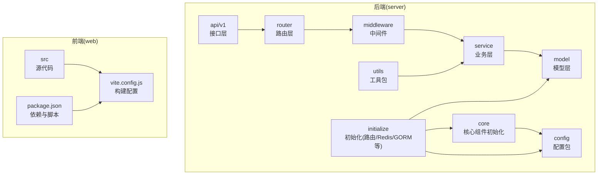
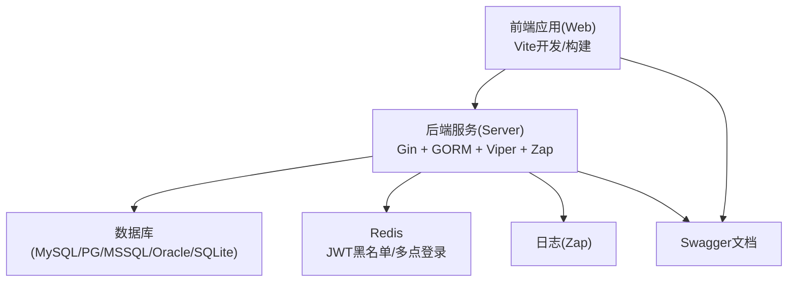
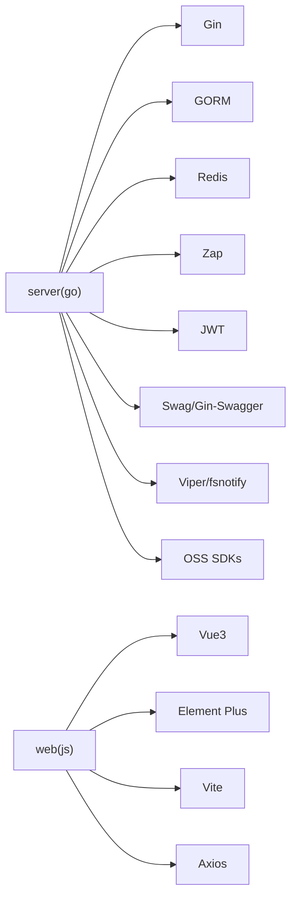

# 快速开始

<cite>
**本文引用的文件**
- [README.md](file://README.md)
- [README-en.md](file://README-en.md)
- [gin-vue-admin.code-workspace](file://gin-vue-admin.code-workspace)
- [server/go.mod](file://server/go.mod)
- [server/main.go](file://server/main.go)
- [server/config.yaml](file://server/config.yaml)
- [server/config.docker.yaml](file://server/config.docker.yaml)
- [web/package.json](file://web/package.json)
- [web/vite.config.js](file://web/vite.config.js)
- [Makefile](file://Makefile)
- [repowiki/zh/content/快速开始.md](file://repowiki/zh/content/快速开始.md)
</cite>

## 目录
1. [简介](#简介)
2. [项目结构](#项目结构)
3. [核心组件](#核心组件)
4. [架构总览](#架构总览)
5. [详细组件分析](#详细组件分析)
6. [依赖分析](#依赖分析)
7. [性能考虑](#性能考虑)
8. [故障排除指南](#故障排除指南)
9. [结论](#结论)
10. [附录](#附录)

## 简介
本指南面向首次接触 Gin-Vue-Admin 的开发者，目标是在最短时间内完成环境准备、安装部署与启动验证。文档覆盖以下场景：
- 环境要求：Node.js、Go 语言版本与推荐 IDE
- 两种运行方式：本地开发与 VSCode 工作区一键启动
- Swagger API 文档的安装与生成
- 在线演示地址与测试账号信息
- 常见问题与故障排除

## 项目结构
项目采用前后端分离架构，后端基于 Go + Gin，前端基于 Vue 3 + Element Plus。根目录包含 server、web、deploy、docs 等子目录；后端按层次划分 api、config、core、initialize、middleware、model、router、service、utils 等模块。

图表来源
- [repowiki/zh/content/快速开始.md:44-73](file://repowiki/zh/content/快速开始.md#L44-L73)

章节来源
- [repowiki/zh/content/快速开始.md:41-81](file://repowiki/zh/content/快速开始.md#L41-L81)

## 核心组件
- 后端核心启动入口负责初始化配置、日志、数据库、定时任务、全局处理器与表结构注册，随后启动 HTTP 服务。
- 前端通过 Vite 开发服务器提供热重载，生产环境打包构建静态资源。
- 配置系统采用 YAML 文件并通过 Viper 加载，支持多数据库、Redis、Mongo、OSS 等扩展配置。

章节来源
- [server/main.go:30-52](file://server/main.go#L30-L52)
- [server/config.yaml:1-284](file://server/config.yaml#L1-L284)

## 架构总览
后端服务对外提供 REST API，前端通过 Axios 访问后端接口；Redis 用于 JWT 黑名单与多点登录控制；数据库支持 MySQL、PostgreSQL、SQL Server、Oracle、SQLite 等；日志使用 Zap；Swagger 自动生成 API 文档。

图表来源
- [README.md:183-192](file://README.md#L183-L192)
- [server/config.yaml:101-160](file://server/config.yaml#L101-L160)
- [server/config.yaml:21-45](file://server/config.yaml#L21-L45)

章节来源
- [README.md:183-192](file://README.md#L183-L192)
- [server/config.yaml:1-284](file://server/config.yaml#L1-L284)

## 详细组件分析

### 环境要求与 IDE 推荐
- Node.js 版本要求：大于等于 v18.16.0
- Go 语言版本：建议使用 v1.22 及以上（go.mod 显示模块使用 go 1.24）
- IDE 推荐：GoLand（后端）、VSCode（工作区配置 gin-vue-admin.code-workspace，支持后端/前端/双端任务）

章节来源
- [README.md:109-113](file://README.md#L109-L113)
- [README.md:164-182](file://README.md#L164-L182)
- [server/go.mod:1-6](file://server/go.mod#L1-L6)

### 本地开发环境搭建
- 后端
  - 进入 server 目录，使用 Go Modules 安装依赖并运行
  - 建议使用 GoLand 打开 server 目录，避免在根目录打开导致工具链定位问题
- 前端
  - 进入 web 目录，安装依赖并启动开发服务器
  - 生产构建与测试命令在 package.json 中定义

章节来源
- [README.md:115-145](file://README.md#L115-L145)
- [web/package.json:1-88](file://web/package.json#L1-L88)

### VSCode 工作区配置
- 使用 VSCode 打开根目录下的工作区文件 gin-vue-admin.code-workspace，可以看到三个虚拟目录：backend、frontend、root。
- 在“运行和调试”中可以看到三个任务：Backend、Frontend、Both (Backend & Frontend)。运行 Both 可以同时启动前后端项目。
- 工作区配置文件中有 go.toolsEnvVars 字段，用于 VSCode 自身的 Go 工具环境变量。此外在多 Go 版本的系统中，可以通过 gopath、go.goroot 指定运行版本。

章节来源
- [gin-vue-admin.code-workspace:1-50](file://gin-vue-admin.code-workspace#L1-L50)

### Swagger API 文档
- 安装 swagger
  - 在命令行中执行安装命令以获取 swag 工具
- 生成 API 文档
  - 在 server 目录执行初始化命令生成文档文件
  - 启动后端服务后，在浏览器访问相应页面查看 Swagger 文档

章节来源
- [README.md:147-162](file://README.md#L147-L162)

### 在线演示与测试账号
- 在线演示地址与测试账号信息可在项目 README 中找到，便于快速体验系统功能。

章节来源
- [README.md:80-84](file://README.md#L80-L84)

### 配置文件设置详解
- 通用配置结构
  - JWT：签名密钥、过期时间、缓冲时间、签发方
  - 日志(Zap)：级别、格式、输出目录、保留天数等
  - Redis：单实例与列表配置，支持集群地址
  - MongoDB：连接参数、池大小、超时等
  - 邮件：SMTP 参数与发件人信息
  - 系统(System)：运行环境、监听端口、数据库类型、OSS 类型、是否启用 Redis/Mongo、多点登录开关、IP 限制、路由前缀、严格权限模式、自动迁移开关
  - 验证码：长度、宽高、开启策略与超时
  - 数据库连接：MySQL、PG、Oracle、MSSQL、SQLite 的连接参数与连接池配置
  - OSS：本地、七牛、阿里云、腾讯云、AWS S3、Cloudflare R2、华为 OBS 等配置
  - Excel：导入导出目录
  - 跨域(CORS)：严格白名单模式与放行规则
  - MCP：插件管理器配置
- 本地与容器差异
  - 本地使用 server/config.yaml
  - 容器编排使用 server/config.docker.yaml，其中 Redis 地址与集群节点按 compose 网络调整

章节来源
- [server/config.yaml:1-284](file://server/config.yaml#L1-L284)
- [server/config.docker.yaml:1-283](file://server/config.docker.yaml#L1-L283)

### 启动命令与验证步骤
- 本地开发
  - 后端：进入 server 目录，安装依赖后运行主程序
  - 前端：进入 web 目录，安装依赖后启动开发服务器
- Swagger 文档
  - 安装 swag 工具，在 server 目录执行初始化命令生成文档文件，启动后访问相应页面查看
- 验证
  - 后端：访问服务端口，查看日志与接口响应
  - 前端：访问前端端口，登录系统并检查页面功能
  - Swagger：访问文档页面，核对接口定义

章节来源
- [README.md:115-162](file://README.md#L115-L162)

### 构建与打包（可选）
- Makefile 提供容器化构建与打包命令，支持分别构建前端、后端与整体打包，以及生成 Swagger 文档与插件打包

章节来源
- [Makefile:1-76](file://Makefile#L1-L76)

## 依赖分析
- 后端依赖
  - Web 框架：Gin
  - ORM：GORM（支持多数据库驱动）
  - 缓存：Redis 客户端
  - 日志：Zap
  - 鉴权：JWT
  - 文档：Swag + Gin-Swagger
  - 配置：Viper + fsnotify
  - 其他：Casbin、MongoDB 驱动、AWS/七牛/阿里云等对象存储 SDK
- 前端依赖
  - 框架：Vue 3 + Element Plus
  - 构建：Vite
  - 状态管理：Pinia
  - 工具：Axios、Markdown 渲染、图表库等

图表来源
- [server/go.mod:7-61](file://server/go.mod#L7-L61)
- [web/package.json:14-57](file://web/package.json#L14-L57)

章节来源
- [server/go.mod:1-208](file://server/go.mod#L1-L208)
- [web/package.json:1-88](file://web/package.json#L1-L88)

## 性能考虑
- 连接池与并发
  - 数据库连接池参数可在配置中调整最大空闲与最大打开连接数
  - Redis 连接池大小与超时参数可按业务峰值优化
- 日志与监控
  - 使用 Zap 输出到文件并设置保留天数，避免磁盘占用
  - 启用探针与健康检查，结合容器编排实现弹性伸缩
- 前端构建
  - 生产构建开启压缩与 Tree Shaking，减少包体积
  - 使用 CDN 或静态资源缓存策略提升首屏速度

## 故障排除指南
- 启动后端报错
  - 检查配置文件中的数据库连接参数与 Redis 地址是否正确
  - 确认数据库与 Redis 服务已就绪且网络可达
  - 查看后端日志定位 panic 或初始化异常
- 前端无法访问后端接口
  - 检查 CORS 配置与白名单设置
  - 确认后端监听端口与防火墙放行
- Swagger 文档不更新
  - 重新在 server 目录执行文档生成命令并重启服务
- Docker 容器启动失败
  - 查看容器日志，确认 MySQL 初始化、Redis 启动与 Nginx 配置是否正常
  - 检查端口冲突与卷挂载路径
- Kubernetes 部署未就绪
  - 查看 Pod 探针失败原因，确认配置文件挂载与服务连通性
  - 检查资源限制与节点可用资源

章节来源
- [server/config.yaml:264-284](file://server/config.yaml#L264-L284)
- [repowiki/zh/content/快速开始.md:306-326](file://repowiki/zh/content/快速开始.md#L306-L326)

## 结论
通过本指南，您可以基于本地开发、VSCode 工作区一键启动快速搭建 Gin-Vue-Admin，并在需要时迁移到 Docker 或 Kubernetes。建议优先使用 VSCode 工作区进行本地联调，再迁移到容器化部署。遇到问题时，优先检查配置文件、服务依赖与日志输出。

## 附录

### 常用命令速查
- 本地后端运行：进入 server 目录，安装依赖后运行主程序
- 本地前端运行：进入 web 目录，安装依赖后启动开发服务器
- Swagger 文档生成：在 server 目录执行文档初始化命令
- VSCode 工作区：打开 gin-vue-admin.code-workspace，使用 Backend/Frontend/Both 任务
- 在线演示：参考 README 中的演示地址与测试账号信息

章节来源
- [README.md:115-162](file://README.md#L115-L162)
- [gin-vue-admin.code-workspace:16-48](file://gin-vue-admin.code-workspace#L16-L48)