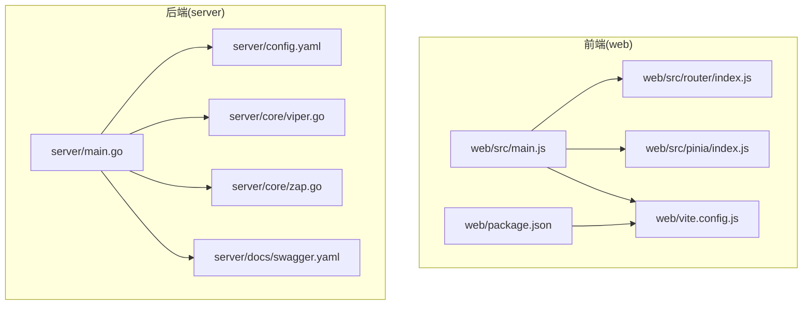
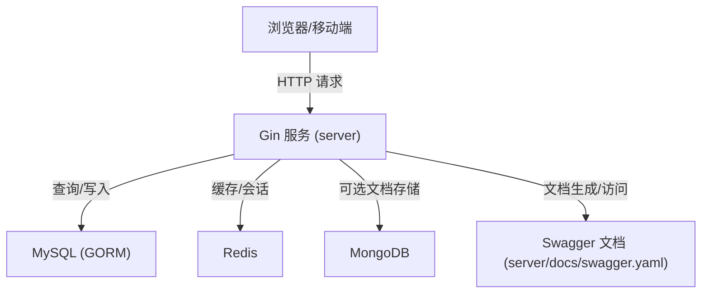
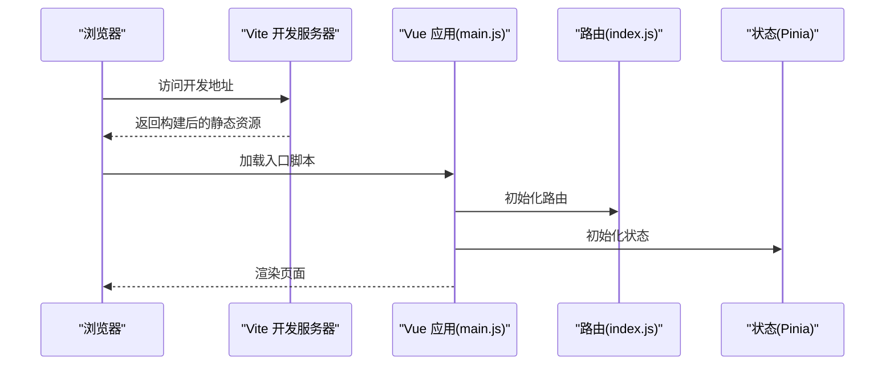
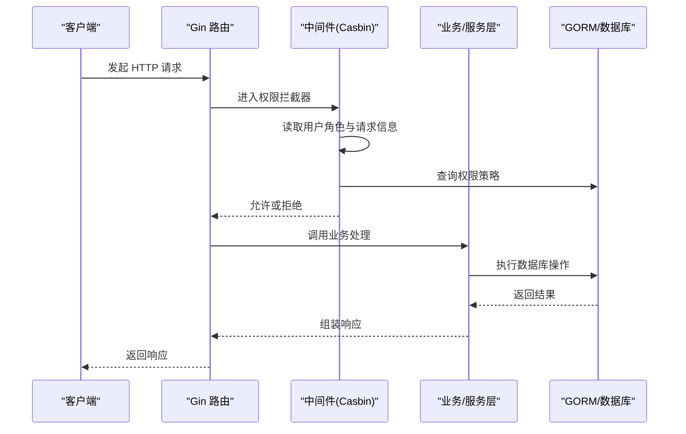
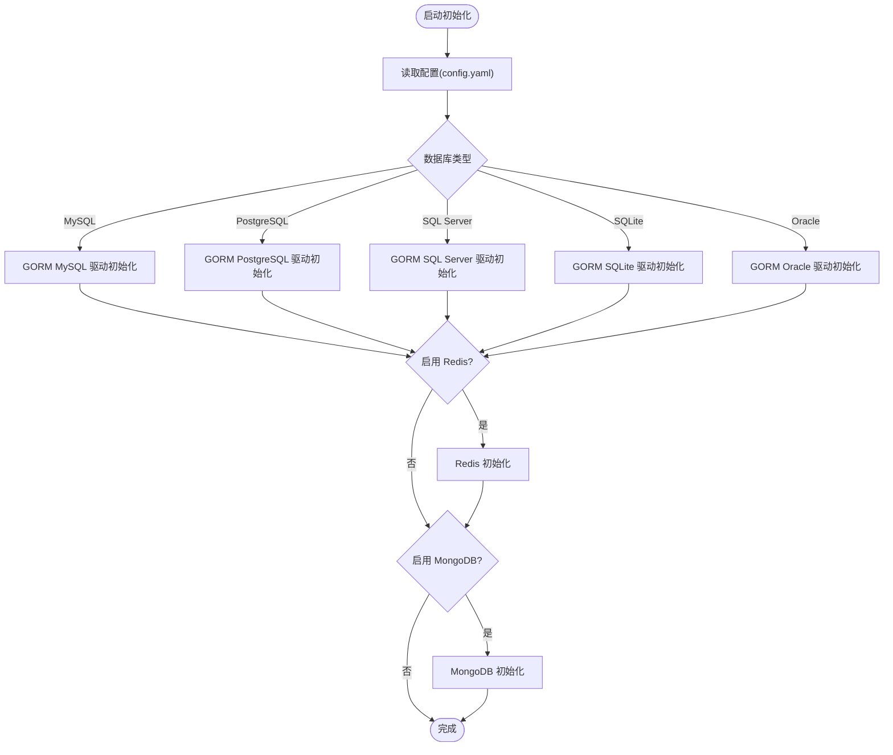
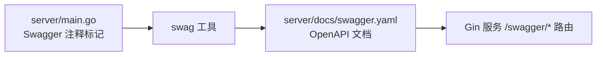
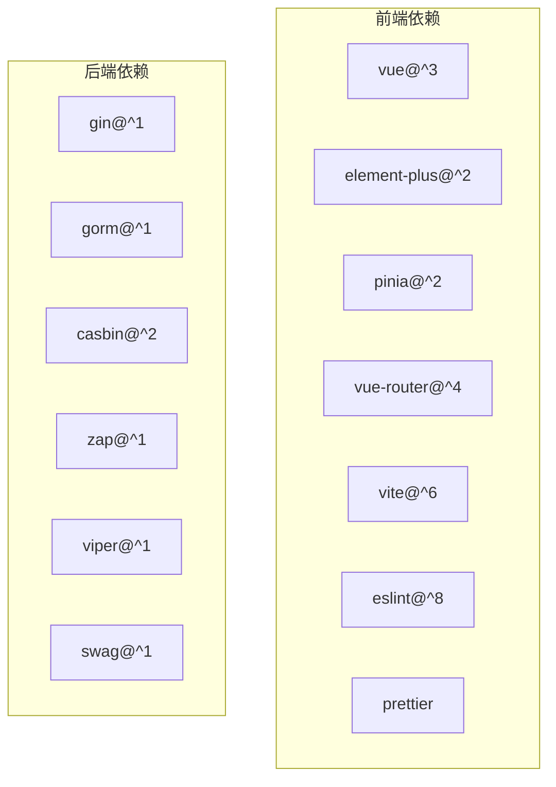

# 技术栈说明

<cite>
**本文引用的文件**   
- [go.mod](file://server/go.mod)
- [main.go](file://server/main.go)
- [config.yaml](file://server/config.yaml)
- [config.go](file://server/config/config.go)
- [db_list.go](file://server/config/db_list.go)
- [redis.go](file://server/config/redis.go)
- [mongo.go](file://server/config/mongo.go)
- [viper.go](file://server/core/viper.go)
- [zap.go](file://server/core/zap.go)
- [casbin_rbac.go](file://server/middleware/casbin_rbac.go)
- [swagger.yaml](file://server/docs/swagger.yaml)
- [package.json](file://web/package.json)
- [vite.config.js](file://web/vite.config.js)
- [main.js](file://web/src/main.js)
- [index.js](file://web/src/router/index.js)
- [index.js](file://web/src/pinia/index.js)
- [eslint.config.mjs](file://web/eslint.config.mjs)
- [.prettierrc](file://web/.prettierrc)
</cite>

## 目录
1. [引言](#引言)
2. [项目结构](#项目结构)
3. [核心组件](#核心组件)
4. [架构总览](#架构总览)
5. [详细组件分析](#详细组件分析)
6. [依赖分析](#依赖分析)
7. [性能考虑](#性能考虑)
8. [故障排查指南](#故障排查指南)
9. [结论](#结论)
10. [附录](#附录)

## 引言
本文件面向 Gin-Vue-Admin 项目的开发者与维护者，系统梳理并解释前后端技术栈选型、数据库与中间件生态、API 文档生成、开发工具链以及版本与兼容性要求。内容以仓库现有实现为依据，结合配置文件与核心源码，帮助读者快速理解项目的技术基础与运行方式。

## 项目结构
项目采用前后端分离架构：
- 前端位于 web 目录，基于 Vue 3、Element Plus、Pinia、Vue Router 构建。
- 后端位于 server 目录，基于 Go 语言、Gin 框架、GORM ORM、Casbin 权限控制、Zap 日志系统、Viper 配置管理。
- 数据库与中间件包括 MySQL、Redis、MongoDB；API 文档通过 Swagger 生成；开发工具链包含 Vite、ESLint、Prettier。

**图表来源**
- [main.js:1-38](file://web/src/main.js#L1-L38)
- [index.js:1-42](file://web/src/router/index.js#L1-L42)
- [index.js:1-9](file://web/src/pinia/index.js#L1-L9)
- [vite.config.js:1-119](file://web/vite.config.js#L1-L119)
- [package.json:1-88](file://web/package.json#L1-L88)
- [main.go:1-52](file://server/main.go#L1-L52)
- [config.yaml:1-284](file://server/config.yaml#L1-L284)
- [viper.go:1-77](file://server/core/viper.go#L1-L77)
- [zap.go:1-37](file://server/core/zap.go#L1-L37)
- [swagger.yaml:1-200](file://server/docs/swagger.yaml#L1-L200)

**章节来源**
- [main.go:1-52](file://server/main.go#L1-L52)
- [config.yaml:1-284](file://server/config.yaml#L1-L284)
- [package.json:1-88](file://web/package.json#L1-L88)
- [vite.config.js:1-119](file://web/vite.config.js#L1-L119)
- [main.js:1-38](file://web/src/main.js#L1-L38)
- [index.js:1-42](file://web/src/router/index.js#L1-L42)
- [index.js:1-9](file://web/src/pinia/index.js#L1-L9)

## 核心组件
- 前端技术栈
  - Vue 3：响应式与组合式 API，构建用户界面。
  - Element Plus：桌面端组件库，提供丰富的 UI 组件。
  - Pinia：轻量级状态管理，替代 Vuex。
  - Vue Router：单页应用路由管理。
  - Vite：现代化构建工具，提供快速热更新与打包能力。
  - ESLint/Prettier：代码质量与风格统一。
- 后端技术栈
  - Go 1.24.x：高性能并发语言，配合标准库与第三方库。
  - Gin：HTTP Web 框架，提供路由、中间件与请求处理。
  - GORM：对象关系映射，支持多数据库驱动。
  - Casbin：基于模型的访问控制（RBAC），提供细粒度权限控制。
  - Zap：高性能日志库，支持结构化日志与多级别输出。
  - Viper：配置读取与热更新，支持 YAML/环境变量/命令行。
- 数据库与中间件
  - MySQL：主业务数据库。
  - Redis：缓存与会话存储。
  - MongoDB：可选文档型数据存储。
- API 文档
  - Swagger：通过 swag 生成 OpenAPI 文档，集成在 Gin 服务中。
- 开发工具链
  - Vite：开发与生产构建。
  - ESLint：静态代码检查。
  - Prettier：代码格式化。

**章节来源**
- [go.mod:1-208](file://server/go.mod#L1-L208)
- [package.json:1-88](file://web/package.json#L1-L88)
- [config.yaml:1-284](file://server/config.yaml#L1-L284)
- [main.go:1-52](file://server/main.go#L1-L52)
- [swagger.yaml:1-200](file://server/docs/swagger.yaml#L1-L200)

## 架构总览
下图展示前后端交互与核心模块关系：

**图表来源**
- [main.go:1-52](file://server/main.go#L1-L52)
- [swagger.yaml:1-200](file://server/docs/swagger.yaml#L1-L200)
- [config.yaml:101-160](file://server/config.yaml#L101-L160)
- [redis.go:1-11](file://server/config/redis.go#L1-L11)
- [mongo.go:1-42](file://server/config/mongo.go#L1-L42)

## 详细组件分析

### 前端技术栈
- Vue 3
  - 通过入口文件挂载应用，引入 Element Plus、路由、状态管理与指令。
  - 版本在依赖中声明为 3.x，具备 Composition API 与更好的 Tree-shaking。
- Element Plus
  - 在入口文件中按需引入主题与图标，提升首屏性能。
- Pinia
  - 创建全局状态仓库，集中管理应用与用户状态。
- Vue Router
  - 基于哈希历史模式，定义基础路由与重定向规则。
- Vite
  - 配置代理、构建产物命名、压缩与插件生态，支持开发与生产模式。
- ESLint/Prettier
  - ESLint 使用 flat 配置，规则覆盖 Vue 与 JS；Prettier 统一格式化风格。

**图表来源**
- [main.js:1-38](file://web/src/main.js#L1-L38)
- [index.js:1-42](file://web/src/router/index.js#L1-L42)
- [index.js:1-9](file://web/src/pinia/index.js#L1-L9)
- [vite.config.js:1-119](file://web/vite.config.js#L1-L119)

**章节来源**
- [main.js:1-38](file://web/src/main.js#L1-L38)
- [index.js:1-42](file://web/src/router/index.js#L1-L42)
- [index.js:1-9](file://web/src/pinia/index.js#L1-L9)
- [vite.config.js:1-119](file://web/vite.config.js#L1-L119)
- [package.json:1-88](file://web/package.json#L1-L88)
- [eslint.config.mjs:1-30](file://web/eslint.config.mjs#L1-L30)
- [.prettierrc:1-13](file://web/.prettierrc#L1-L13)

### 后端技术栈
- Go 语言与模块
  - Go 版本要求：1.24.0；工具链版本 1.24.2。
  - 依赖管理：通过 go.mod 管理第三方库，包含 Gin、GORM、Casbin、Zap、Viper、Swagger 等。
- Gin 框架
  - 作为 HTTP 服务框架，承载路由、中间件与控制器。
- GORM ORM
  - 支持 MySQL、PostgreSQL、SQL Server、SQLite、Oracle 等数据库驱动。
  - 通过配置文件与初始化流程完成数据库连接与表初始化。
- Casbin 权限控制
  - 基于 RBAC 模型，拦截器根据用户角色与请求路径/方法进行权限判断。
- Zap 日志系统
  - 提供结构化日志、多级别输出与可配置落盘策略。
- Viper 配置管理
  - 读取 YAML 配置，支持环境变量与命令行覆盖，并监听变更热更新。

**图表来源**
- [casbin_rbac.go:1-33](file://server/middleware/casbin_rbac.go#L1-L33)
- [main.go:1-52](file://server/main.go#L1-L52)
- [config.yaml:1-284](file://server/config.yaml#L1-L284)

**章节来源**
- [go.mod:1-208](file://server/go.mod#L1-L208)
- [main.go:1-52](file://server/main.go#L1-L52)
- [config.go:1-41](file://server/config/config.go#L1-L41)
- [db_list.go:1-54](file://server/config/db_list.go#L1-L54)
- [redis.go:1-11](file://server/config/redis.go#L1-L11)
- [mongo.go:1-42](file://server/config/mongo.go#L1-L42)
- [viper.go:1-77](file://server/core/viper.go#L1-L77)
- [zap.go:1-37](file://server/core/zap.go#L1-L37)
- [casbin_rbac.go:1-33](file://server/middleware/casbin_rbac.go#L1-L33)

### 数据库技术栈
- MySQL
  - 通过 GORM 驱动连接，配置项包含连接参数、日志模式与连接池大小。
- Redis
  - 支持单实例与集群模式，配置项包含地址、密码、数据库索引与集群节点列表。
- MongoDB
  - 支持主机列表、认证、连接与套接字超时、连接池大小等配置，提供 URI 生成方法。

**图表来源**
- [config.yaml:101-160](file://server/config.yaml#L101-L160)
- [redis.go:1-11](file://server/config/redis.go#L1-L11)
- [mongo.go:1-42](file://server/config/mongo.go#L1-L42)
- [db_list.go:1-54](file://server/config/db_list.go#L1-L54)

**章节来源**
- [config.yaml:1-284](file://server/config.yaml#L1-L284)
- [config.go:1-41](file://server/config/config.go#L1-L41)
- [db_list.go:1-54](file://server/config/db_list.go#L1-L54)
- [redis.go:1-11](file://server/config/redis.go#L1-L11)
- [mongo.go:1-42](file://server/config/mongo.go#L1-L42)

### API 文档生成（Swagger）
- 通过 swag 工具扫描注释生成 OpenAPI 文档，集成在 Gin 服务中。
- 文档定义文件位于 server/docs/swagger.yaml，包含大量配置与模型定义。
- 项目入口文件包含 Swagger 注释标记，便于文档聚合与排序。

**图表来源**
- [main.go:16-30](file://server/main.go#L16-L30)
- [swagger.yaml:1-200](file://server/docs/swagger.yaml#L1-L200)

**章节来源**
- [main.go:1-52](file://server/main.go#L1-L52)
- [swagger.yaml:1-200](file://server/docs/swagger.yaml#L1-L200)

### 开发工具链
- Vite
  - 配置开发服务器、代理、构建产物命名、压缩选项与插件生态。
- ESLint
  - 使用 flat 配置，推荐规则与忽略文件列表。
- Prettier
  - 统一缩进、引号、尾逗号、换行符等格式规范。

**章节来源**
- [vite.config.js:1-119](file://web/vite.config.js#L1-L119)
- [eslint.config.mjs:1-30](file://web/eslint.config.mjs#L1-L30)
- [.prettierrc:1-13](file://web/.prettierrc#L1-L13)

## 依赖分析
- 前端依赖
  - Vue 3、Element Plus、Pinia、Vue Router 为核心 UI/状态/路由依赖。
  - Vite 生态与开发插件支撑构建与调试。
- 后端依赖
  - Gin 提供 HTTP 能力；GORM 提供 ORM；Casbin 提供权限；Zap/Viper 提供日志与配置；Swagger 提供文档。

**图表来源**
- [package.json:14-57](file://web/package.json#L14-L57)
- [go.mod:7-61](file://server/go.mod#L7-L61)

**章节来源**
- [package.json:1-88](file://web/package.json#L1-L88)
- [go.mod:1-208](file://server/go.mod#L1-L208)

## 性能考虑
- 前端
  - 使用 Vite 的按需构建与 Tree-shaking，减少包体积。
  - 开启生产环境压缩与去除调试语句，降低传输体积。
- 后端
  - GORM 连接池参数可调，避免高并发下的连接瓶颈。
  - Zap 结构化日志与异步写入，降低 I/O 影响。
  - Casbin 权限校验在中间件层进行，避免重复计算。

[本节为通用指导，无需列出具体文件来源]

## 故障排查指南
- 配置文件未生效
  - 检查 Viper 的配置路径解析顺序：命令行参数 > 环境变量 > 模式文件 > 默认文件。
  - 确认配置文件存在且可读，必要时回退到默认路径。
- 日志未输出或格式异常
  - 检查 Zap 配置项与日志目录权限，确认目录已创建。
- 权限不足
  - 确认 Casbin 策略已正确写入，请求路径与方法匹配。
- 数据库连接失败
  - 核对 config.yaml 中数据库连接参数与驱动配置，确认网络可达与凭据正确。
- Swagger 文档缺失
  - 确认注释标记存在于入口文件，重新执行 swag 生成命令。

**章节来源**
- [viper.go:44-77](file://server/core/viper.go#L44-L77)
- [zap.go:13-37](file://server/core/zap.go#L13-L37)
- [casbin_rbac.go:1-33](file://server/middleware/casbin_rbac.go#L1-L33)
- [config.yaml:1-284](file://server/config.yaml#L1-L284)
- [main.go:16-30](file://server/main.go#L16-L30)

## 结论
Gin-Vue-Admin 采用现代化、高扩展性的技术栈组合：前端以 Vue 3 为核心，辅以 Element Plus、Pinia、Vue Router 与 Vite；后端以 Go/Gin 为基础，结合 GORM、Casbin、Zap、Viper 与 Swagger，形成清晰的分层与职责边界。数据库与中间件支持丰富，开发工具链完善，适合快速搭建企业级全栈应用。

[本节为总结性内容，无需列出具体文件来源]

## 附录

### 版本与兼容性要求
- Go
  - 版本：1.24.0；工具链：1.24.2
- 前端
  - Vue：^3
  - Element Plus：^2
  - Pinia：^2
  - Vue Router：^4
  - Vite：^6
  - ESLint：^8
  - Prettier：项目内置配置
- 后端
  - Gin：^1
  - GORM：^1
  - Casbin：^2
  - Zap：^1
  - Viper：^1
  - Swagger：swag 工具与 gin-swagger 集成

**章节来源**
- [go.mod:3-5](file://server/go.mod#L3-L5)
- [package.json:14-57](file://web/package.json#L14-L57)
- [main.go:1-52](file://server/main.go#L1-L52)