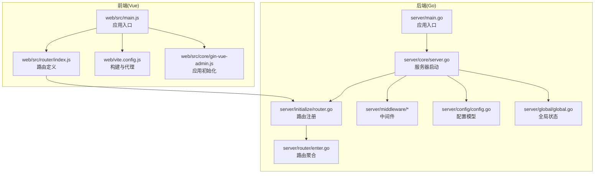
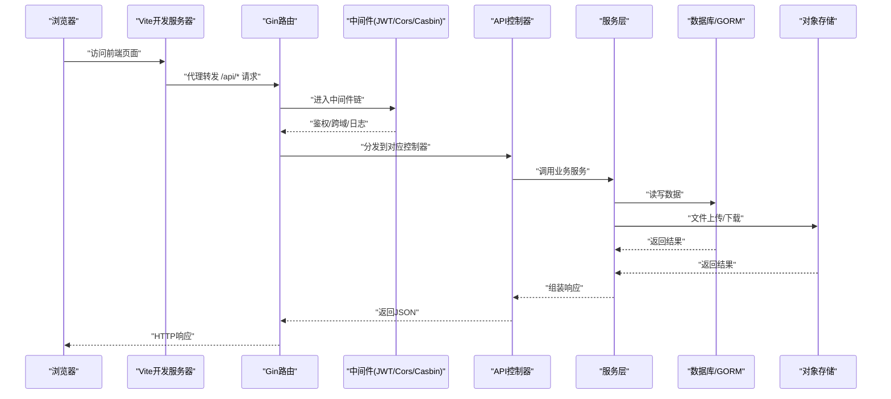
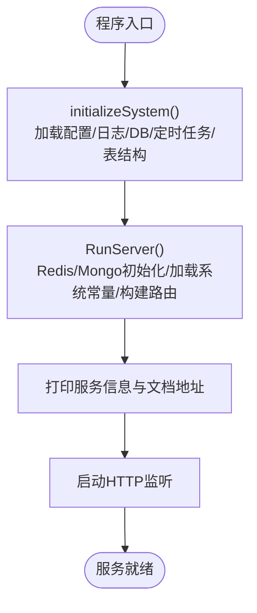
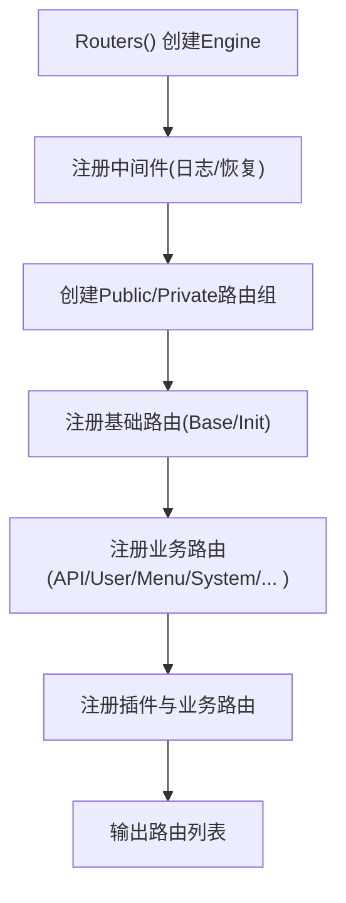
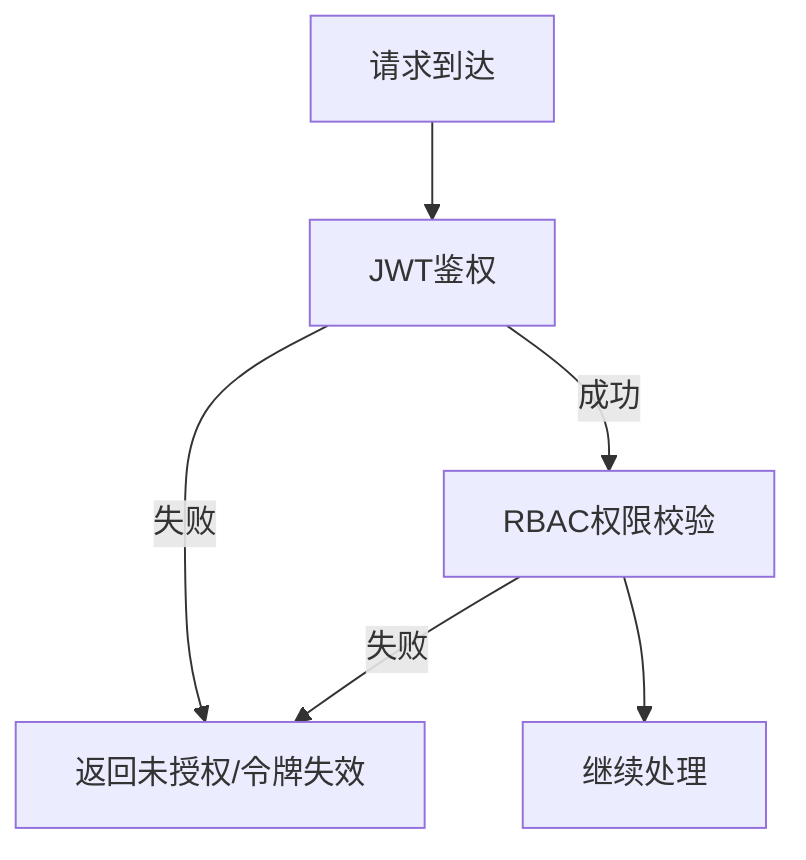
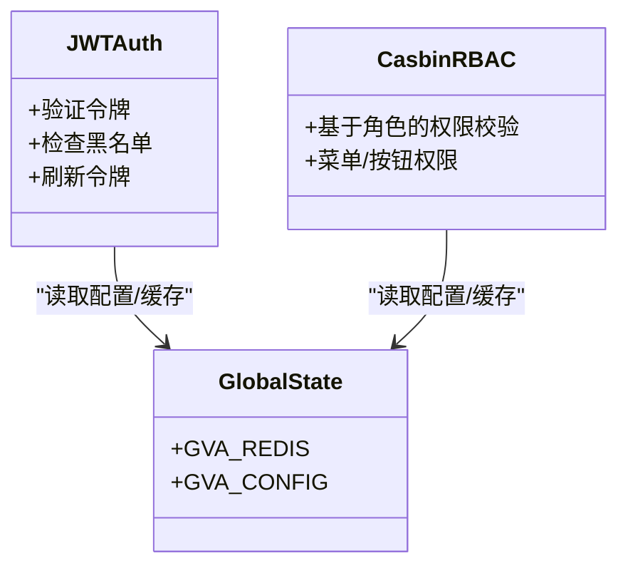
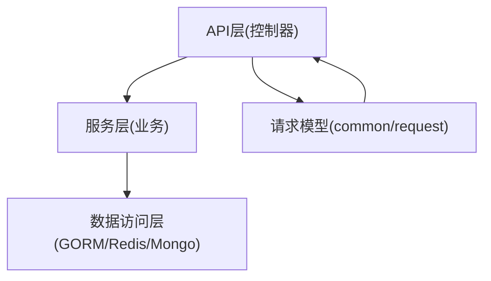
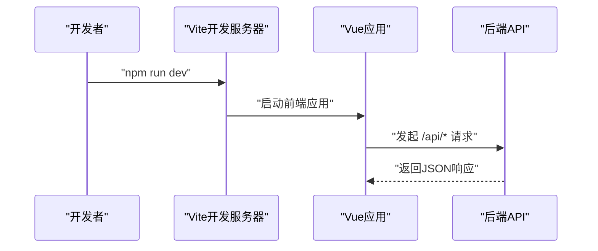
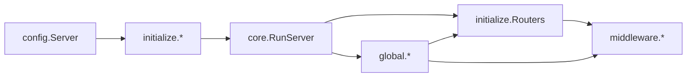

# 架构概览

<cite>
**本文引用的文件**
- [server/main.go](file://server/main.go)
- [server/core/server.go](file://server/core/server.go)
- [server/initialize/router.go](file://server/initialize/router.go)
- [server/router/enter.go](file://server/router/enter.go)
- [server/middleware/jwt.go](file://server/middleware/jwt.go)
- [server/middleware/cors.go](file://server/middleware/cors.go)
- [server/config/config.go](file://server/config/config.go)
- [server/global/global.go](file://server/global/global.go)
- [server/api/v1/enter.go](file://server/api/v1/enter.go)
- [server/service/enter.go](file://server/service/enter.go)
- [server/model/common/request/common.go](file://server/model/common/request/common.go)
- [web/src/main.js](file://web/src/main.js)
- [web/src/router/index.js](file://web/src/router/index.js)
- [web/vite.config.js](file://web/vite.config.js)
- [web/src/core/gin-vue-admin.js](file://web/src/core/gin-vue-admin.js)
</cite>

## 目录
1. [引言](#引言)
2. [项目结构](#项目结构)
3. [核心组件](#核心组件)
4. [架构总览](#架构总览)
5. [详细组件分析](#详细组件分析)
6. [依赖关系分析](#依赖关系分析)
7. [性能考量](#性能考量)
8. [故障排查指南](#故障排查指南)
9. [结论](#结论)
10. [附录](#附录)

## 引言
本文件面向 Gin-Vue-Admin 项目，提供系统级架构概览与深入解读。项目采用前后端分离的微服务风格（非多进程微服务拆分，而是通过模块化与插件化实现松耦合），后端基于 Go 的 Gin 框架，前端基于 Vue 3 + Vite。整体架构遵循“API 层-服务层-数据访问层”的分层设计，配合中间件体系、权限控制与路由系统，形成清晰的职责边界与可扩展性。

## 项目结构
- 后端（Go）位于 server/ 目录，包含核心启动、配置、初始化、路由、中间件、API 控制器、服务层、数据模型与插件化扩展。
- 前端（Vue 3）位于 web/ 目录，包含应用入口、路由、状态管理（Pinia）、指令与插件生态。
- 配置与部署：后端配置集中于 config/，前端通过 Vite 环境变量与代理配置对接后端；部署支持 Docker 与 Kubernetes。

图表来源
- [server/main.go:30-35](file://server/main.go#L30-L35)
- [server/core/server.go:14-48](file://server/core/server.go#L14-L48)
- [server/initialize/router.go:36-117](file://server/initialize/router.go#L36-L117)
- [server/router/enter.go:8-13](file://server/router/enter.go#L8-L13)
- [web/src/main.js:21-36](file://web/src/main.js#L21-L36)
- [web/src/router/index.js:36-39](file://web/src/router/index.js#L36-L39)
- [web/vite.config.js:57-79](file://web/vite.config.js#L57-L79)
- [web/src/core/gin-vue-admin.js:9-29](file://web/src/core/gin-vue-admin.js#L9-L29)

章节来源
- [server/main.go:30-52](file://server/main.go#L30-L52)
- [web/src/main.js:21-38](file://web/src/main.js#L21-L38)

## 核心组件
- 服务器启动流程：后端通过 main() 调用初始化函数完成配置、日志、数据库、定时任务、表结构等初始化，随后启动 HTTP 服务。
- 路由系统：统一在 initialize/Routers() 中注册公开与私有路由组，并挂载 Swagger 文档与插件路由。
- 中间件体系：包括 JWT 鉴权、RBAC 权限校验、跨域处理、日志与错误恢复等。
- 权限控制：JWT 中间件负责令牌解析与黑名单校验；Casbin 中间件负责基于角色的访问控制。
- 分层架构：API 层（控制器）- 服务层（业务逻辑）- 数据访问层（GORM/Mongo/Redis 等），通过全局配置与初始化模块解耦。

章节来源
- [server/core/server.go:14-48](file://server/core/server.go#L14-L48)
- [server/initialize/router.go:36-117](file://server/initialize/router.go#L36-L117)
- [server/middleware/jwt.go:16-77](file://server/middleware/jwt.go#L16-L77)
- [server/middleware/cors.go:10-62](file://server/middleware/cors.go#L10-L62)
- [server/config/config.go:3-40](file://server/config/config.go#L3-L40)
- [server/global/global.go:25-42](file://server/global/global.go#L25-L42)

## 架构总览
下图展示从浏览器到后端服务、再到数据库与外部存储的完整数据流。前端通过 Vite 开发服务器与代理访问后端 API；后端按路由分发至控制器，控制器调用服务层，服务层通过数据访问层与数据库交互；中间件贯穿请求生命周期，提供安全与可观测性保障。

图表来源
- [web/vite.config.js:61-77](file://web/vite.config.js#L61-L77)
- [server/initialize/router.go:65-105](file://server/initialize/router.go#L65-L105)
- [server/middleware/jwt.go:16-77](file://server/middleware/jwt.go#L16-L77)
- [server/middleware/cors.go:10-62](file://server/middleware/cors.go#L10-L62)

## 详细组件分析

### 服务器启动流程
- main() 调用 initializeSystem() 完成配置加载、日志初始化、数据库连接、定时任务、表结构注册等。
- RunServer() 根据配置决定启用 Redis/Mongo，加载系统常量，构建路由并启动 HTTP 服务，打印服务信息与文档地址。

图表来源
- [server/main.go:30-52](file://server/main.go#L30-L52)
- [server/core/server.go:14-48](file://server/core/server.go#L14-L48)

章节来源
- [server/main.go:30-52](file://server/main.go#L30-L52)
- [server/core/server.go:14-48](file://server/core/server.go#L14-L48)

### 路由系统设计
- 统一在 initialize.Routers() 中创建 gin.Engine，注册 Swagger 文档、静态资源与健康检查。
- 公开路由组与私有路由组分离，私有路由组强制 JWT 与 Casbin 中间件。
- 路由聚合通过 router.RouterGroupApp 将 system 与 example 路由组统一注册。

图表来源
- [server/initialize/router.go:36-117](file://server/initialize/router.go#L36-L117)
- [server/router/enter.go:8-13](file://server/router/enter.go#L8-L13)

章节来源
- [server/initialize/router.go:36-117](file://server/initialize/router.go#L36-L117)
- [server/router/enter.go:8-13](file://server/router/enter.go#L8-L13)

### 中间件体系
- JWTAuth：从请求头提取令牌，校验黑名单与过期，必要时刷新令牌并写入响应头。
- Cors/CorsByRules：支持宽松放行与严格白名单模式，处理预检请求。
- 其他中间件：日志、错误恢复、IP 限制、超时控制、操作日志等。

图表来源
- [server/middleware/jwt.go:16-77](file://server/middleware/jwt.go#L16-L77)

章节来源
- [server/middleware/jwt.go:16-77](file://server/middleware/jwt.go#L16-L77)
- [server/middleware/cors.go:10-62](file://server/middleware/cors.go#L10-L62)

### 权限控制机制
- JWT：基于令牌的无状态认证，支持过期刷新与异地登录拦截。
- Casbin：基于角色的访问控制，结合菜单与按钮权限实现细粒度授权。
- 黑名单：Redis 或内存缓存维护 JWT 黑名单，防止令牌复用。

图表来源
- [server/middleware/jwt.go:16-77](file://server/middleware/jwt.go#L16-L77)
- [server/global/global.go:25-42](file://server/global/global.go#L25-L42)

章节来源
- [server/middleware/jwt.go:16-77](file://server/middleware/jwt.go#L16-L77)
- [server/global/global.go:25-42](file://server/global/global.go#L25-L42)

### 分层架构设计
- API 层（控制器）：接收请求参数，调用服务层，返回标准响应结构。
- 服务层：封装业务逻辑，协调多个数据访问对象与第三方服务。
- 数据访问层：基于 GORM/Redis/Mongo 等，提供数据持久化与缓存能力。
- 请求输入模型：通用分页、ID 获取、批量 ID 等结构，统一约束输入。

图表来源
- [server/api/v1/enter.go:8-13](file://server/api/v1/enter.go#L8-L13)
- [server/service/enter.go:8-13](file://server/service/enter.go#L8-L13)
- [server/model/common/request/common.go:7-49](file://server/model/common/request/common.go#L7-L49)

章节来源
- [server/api/v1/enter.go:8-13](file://server/api/v1/enter.go#L8-L13)
- [server/service/enter.go:8-13](file://server/service/enter.go#L8-L13)
- [server/model/common/request/common.go:7-49](file://server/model/common/request/common.go#L7-L49)

### 前端应用与交互
- 应用入口：web/src/main.js 创建 Vue 实例，挂载路由、状态、指令与插件。
- 路由系统：web/src/router/index.js 定义静态路由与错误兜底路由。
- 开发代理：web/vite.config.js 配置代理将 /api* 请求转发至后端服务。
- 初始化：web/src/core/gin-vue-admin.js 注册全局配置与提示信息。

图表来源
- [web/src/main.js:21-36](file://web/src/main.js#L21-L36)
- [web/src/router/index.js:36-39](file://web/src/router/index.js#L36-L39)
- [web/vite.config.js:61-77](file://web/vite.config.js#L61-L77)
- [web/src/core/gin-vue-admin.js:9-29](file://web/src/core/gin-vue-admin.js#L9-L29)

章节来源
- [web/src/main.js:21-38](file://web/src/main.js#L21-L38)
- [web/src/router/index.js:36-42](file://web/src/router/index.js#L36-L42)
- [web/vite.config.js:61-77](file://web/vite.config.js#L61-L77)
- [web/src/core/gin-vue-admin.js:9-29](file://web/src/core/gin-vue-admin.js#L9-L29)

## 依赖关系分析
- 后端依赖注入：通过 initialize 包完成路由、数据库、Redis、Mongo、定时任务等初始化；RunServer() 统一启动。
- 配置模型：config.Server 将 JWT、Zap、Redis、Mongo、系统参数、数据库与对象存储等配置集中管理。
- 全局状态：global 包提供全局 DB、Redis、Mongo、配置、日志、定时器等共享资源。
- 前后端通信：前端通过 Vite 代理将 API 请求转发至后端，避免跨域问题。

图表来源
- [server/config/config.go:3-40](file://server/config/config.go#L3-L40)
- [server/global/global.go:25-42](file://server/global/global.go#L25-L42)
- [server/core/server.go:14-48](file://server/core/server.go#L14-L48)
- [server/initialize/router.go:36-117](file://server/initialize/router.go#L36-L117)

章节来源
- [server/config/config.go:3-40](file://server/config/config.go#L3-L40)
- [server/global/global.go:25-42](file://server/global/global.go#L25-L42)
- [server/core/server.go:14-48](file://server/core/server.go#L14-L48)
- [server/initialize/router.go:36-117](file://server/initialize/router.go#L36-L117)

## 性能考量
- 中间件链顺序：日志与恢复应尽量前置，JWT/Casbin 在鉴权阶段尽早失败以减少后续处理。
- 缓存策略：Redis 用于 JWT 黑名单与多点登录场景；可结合热点数据缓存降低数据库压力。
- 数据库连接：GORM 连接池与慢查询日志建议开启；分页查询注意索引与 LIMIT 优化。
- 前端代理：开发环境使用 Vite 代理，生产环境建议 Nginx 统一代理与静态资源缓存。
- 定时任务：使用全局定时器模块，避免重复任务与资源泄漏。

## 故障排查指南
- 未登录或非法访问：检查前端是否携带令牌与 Cookie/LocalStorage 设置；确认 JWT 中间件生效。
- 跨域问题：确认 CORS 配置模式与白名单；预检请求是否正确放行。
- 路由 404：核对 RouterPrefix 与前端代理路径；确认路由是否注册到 Private/Public 组。
- 数据库连接失败：检查配置文件中的数据库连接串与网络连通性。
- Swagger 文档不可用：确认 RouterPrefix 与 Swagger 路由前缀一致。

章节来源
- [server/middleware/jwt.go:16-77](file://server/middleware/jwt.go#L16-L77)
- [server/middleware/cors.go:10-62](file://server/middleware/cors.go#L10-L62)
- [server/initialize/router.go:60-62](file://server/initialize/router.go#L60-L62)
- [server/config/config.go:3-40](file://server/config/config.go#L3-L40)

## 结论
Gin-Vue-Admin 通过清晰的分层架构与中间件体系，实现了前后端分离下的高内聚低耦合。后端以 Gin 为核心，结合配置驱动与初始化模块，快速完成启动与路由装配；前端以 Vue 生态为基础，借助 Vite 代理与现代化工具链提升开发体验。该架构便于扩展与维护，适合中大型后台管理系统的快速落地与迭代。

## 附录
- 架构演进方向建议：
  - 插件化：现有插件注册机制可进一步抽象为独立服务或 MCP 服务，增强可替换性。
  - 多数据库支持：通过 DBList 与动态选择，支持多租户或多源数据。
  - 监控与可观测：集成 Prometheus/Grafana 与链路追踪，完善日志与告警。
  - 安全加固：引入 WAF、速率限制、敏感信息脱敏与审计日志。
- 部署建议：
  - Docker/K8s：使用现有部署清单，结合 ConfigMap/Service/Ingress 实现弹性伸缩与灰度发布。
  - CDN 与对象存储：静态资源与上传文件分离，提升访问性能与成本控制。