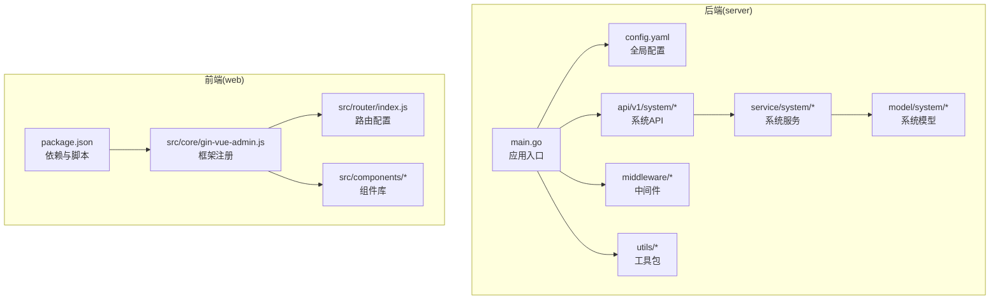
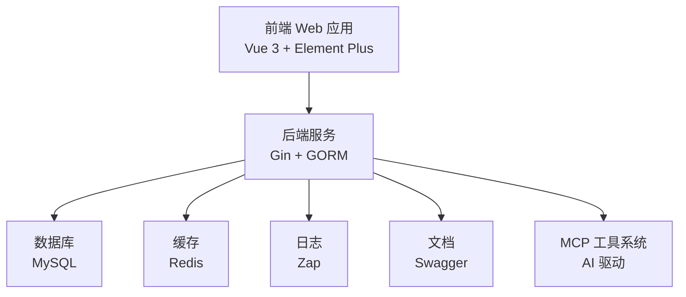
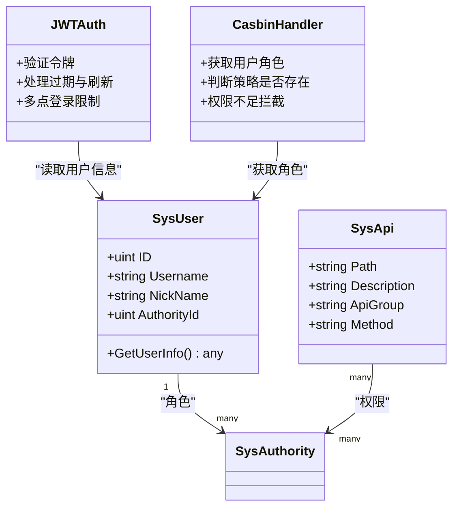
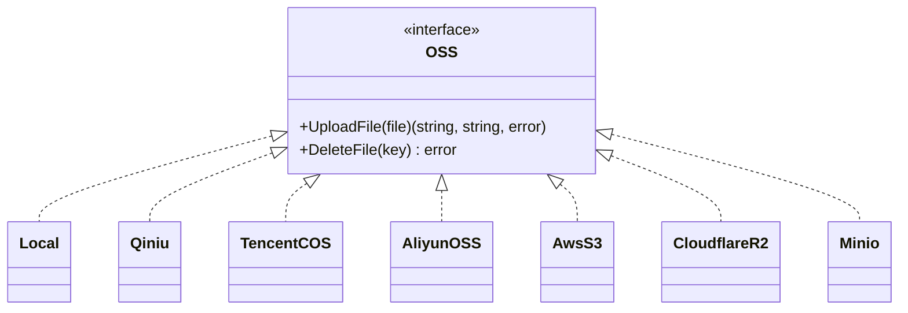
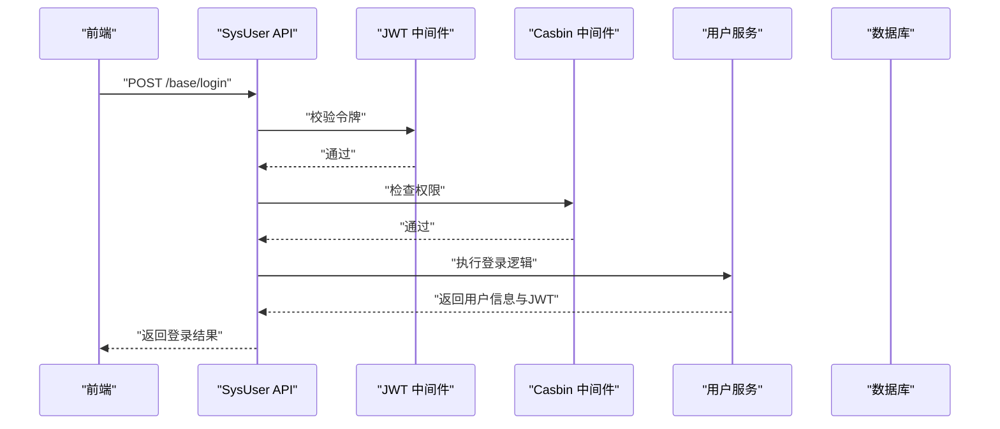
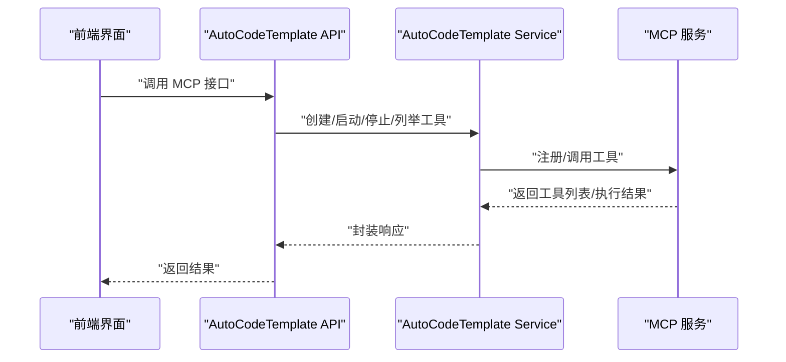
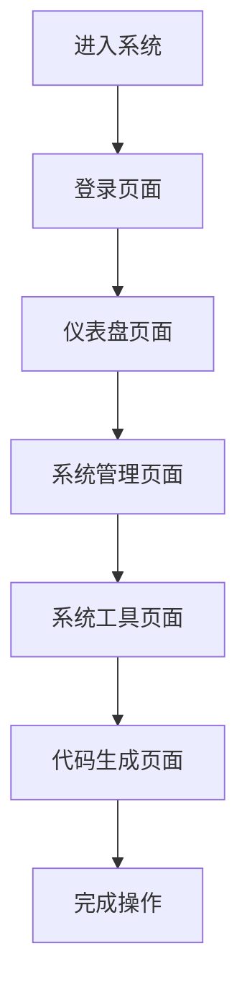
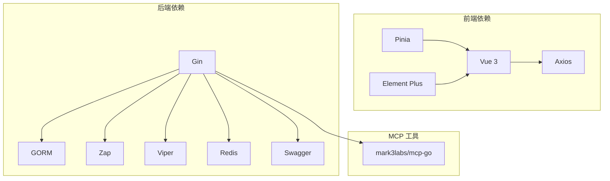

# 项目简介

<cite>
**本文引用的文件**
- [README.md](file://README.md)
- [项目介绍.md](file://repowiki\zh\content\项目概述\项目介绍.md)
- [main.go](file://server\main.go)
- [config.yaml](file://server\config.yaml)
- [package.json](file://web\package.json)
- [gin-vue-admin.js](file://web\src\core\gin-vue-admin.js)
- [jwt.go](file://server\middleware\jwt.go)
- [casbin_rbac.go](file://server\middleware\casbin_rbac.go)
- [upload.go](file://server\utils\upload\upload.go)
- [sys_user.go](file://server\api\v1\system\sys_user.go)
- [auto_code_mcp.go](file://server\api\v1\system\auto_code_mcp.go)
- [auto_code_mcp.go](file://server\service\system\auto_code_mcp.go)
- [index.js](file://web\src\router\index.js)
</cite>

## 目录
1. [简介](#简介)
2. [项目结构](#项目结构)
3. [核心组件](#核心组件)
4. [架构总览](#架构总览)
5. [详细组件分析](#详细组件分析)
6. [依赖分析](#依赖分析)
7. [性能考虑](#性能考虑)
8. [故障排查指南](#故障排查指南)
9. [结论](#结论)
10. [附录](#附录)

## 简介
Gin-Vue-Admin 是一个基于 Go Gin 和 Vue.js 的企业级管理后台开发平台，提供前后端分离架构、JWT 与 Casbin 权限管理、动态路由与菜单系统、文件上传下载、分页封装、用户与角色管理、API 管理、配置管理、条件搜索、RESTful API 示例、多点登录限制、分片上传、表单生成器与代码生成器等核心能力。项目通过完善的中间件体系、ORM 封装、日志与配置管理，帮助开发者专注于业务逻辑，快速搭建高质量的管理后台。

- 项目定位：企业级管理后台开发平台，强调权限控制、动态配置与自动化能力。
- 技术选型：前端 Vue 3 + Element Plus；后端 Gin + GORM；数据库 MySQL；缓存 Redis；日志 Zap；配置 Viper；文档 Swagger。
- 扩展机制：插件化架构与 MCP 工具系统，支持 AI 驱动的代码生成与测试工具编排。

**章节来源**
- [README.md: 74-85:74-85](file://README.md#L74-L85)
- [README.md: 183-192:183-192](file://README.md#L183-L192)
- [项目介绍.md: 37-43:37-43](file://repowiki\zh\content\项目概述\项目介绍.md#L37-L43)

## 项目结构
项目采用典型的前后端分离架构：
- 后端 server 目录包含 API、服务层、模型层、中间件、初始化、配置、路由、工具包等模块，统一通过 main.go 启动并初始化系统组件。
- 前端 web 目录包含 Vue 3 应用、组件、路由、状态管理（Pinia）、工具库等，通过 Vite 构建与开发。
- MCP 工具系统位于 server/mcp，提供 AI 驱动的测试工具链与自动化能力，贯穿需求分析、代码生成与审查环节。

**图表来源**
- [main.go: 30-35:30-35](file://server\main.go#L30-L35)
- [config.yaml: 3-92:3-92](file://server\config.yaml#L3-L92)
- [gin-vue-admin.js: 9-29:9-29](file://web\src\core\gin-vue-admin.js#L9-L29)
- [index.js: 1-42:1-42](file://web\src\router\index.js#L1-L42)

**章节来源**
- [README.md: 203-302:203-302](file://README.md#L203-L302)
- [项目介绍.md: 48-86:48-86](file://repowiki\zh\content\项目概述\项目介绍.md#L48-L86)

## 核心组件
- 应用入口与初始化：后端通过 main.go 初始化配置、日志、数据库、定时任务、插件与表结构，随后启动 HTTP 服务。
- 配置系统：config.yaml 提供 JWT、日志、Redis、Mongo、邮件、系统参数、数据库连接、跨域等配置项。
- 前端框架：package.json 与 gin-vue-admin.js 提供依赖、构建脚本与框架注册，支撑系统工具与页面。
- 权限与安全：JWT 中间件负责令牌校验与刷新，Casbin 中间件实现基于角色的访问控制（RBAC）。
- 文件存储：upload.go 提供 OSS 接口抽象与多云存储适配（本地、七牛、阿里云、腾讯云、AWS S3、Cloudflare R2、MinIO 等）。
- 用户与 API 管理：sys_user.go 提供登录、注册、密码修改、用户列表、权限设置、删除用户、个人信息设置等接口。
- MCP 工具系统：auto_code_mcp.go 与 auto_code_mcp.go 提供 MCP 工具的创建、状态查询、启动/停止、工具列表与调用能力。
- 路由系统：前端通过 index.js 定义基础路由与页面组件，支持静态路由与动态路由扩展。

**章节来源**
- [main.go: 39-51:39-51](file://server\main.go#L39-L51)
- [config.yaml: 3-92:3-92](file://server\config.yaml#L3-L92)
- [package.json: 14-57:14-57](file://web\package.json#L14-L57)
- [gin-vue-admin.js: 9-29:9-29](file://web\src\core\gin-vue-admin.js#L9-L29)
- [jwt.go: 16-78:16-78](file://server\middleware\jwt.go#L16-L78)
- [casbin_rbac.go: 12-32:12-32](file://server\middleware\casbin_rbac.go#L12-L32)
- [upload.go: 9-47:9-47](file://server\utils\upload\upload.go#L9-L47)
- [sys_user.go: 20-517:20-517](file://server\api\v1\system\sys_user.go#L20-L517)
- [auto_code_mcp.go: 15-174:15-174](file://server\api\v1\system\auto_code_mcp.go#L15-L174)
- [auto_code_mcp.go: 14-46:14-46](file://server\service\system\auto_code_mcp.go#L14-L46)
- [index.js: 1-42:1-42](file://web\src\router\index.js#L1-L42)

## 架构总览
系统采用前后端分离架构，后端提供 RESTful API 与 MCP 工具服务，前端通过 Vue 3 提供交互界面。MCP 工具系统贯穿需求分析、代码生成与审查环节，形成闭环的测试自动化流水线。

**图表来源**
- [README.md: 183-192:183-192](file://README.md#L183-L192)
- [config.yaml: 10-19:10-19](file://server\config.yaml#L10-L19)
- [config.yaml: 21-28:21-28](file://server\config.yaml#L21-L28)
- [项目介绍.md: 103-122:103-122](file://repowiki\zh\content\项目概述\项目介绍.md#L103-L122)

## 详细组件分析

### 组件 A：权限与安全（JWT、Casbin、API 管理）
系统通过 JWT 与 Casbin 实现权限控制，JWT 中间件负责令牌校验、过期处理与多点登录限制，Casbin 中间件实现基于角色的访问控制（RBAC）。API 层通过装饰器与中间件组合，确保每个接口的安全性与一致性。

**图表来源**
- [jwt.go: 16-78:16-78](file://server\middleware\jwt.go#L16-L78)
- [casbin_rbac.go: 12-32:12-32](file://server\middleware\casbin_rbac.go#L12-L32)
- [sys_user.go: 20-63:20-63](file://server\api\v1\system\sys_user.go#L20-L63)

**章节来源**
- [jwt.go: 16-78:16-78](file://server\middleware\jwt.go#L16-L78)
- [casbin_rbac.go: 12-32:12-32](file://server\middleware\casbin_rbac.go#L12-L32)
- [sys_user.go: 20-63:20-63](file://server\api\v1\system\sys_user.go#L20-L63)

### 组件 B：文件上传与存储（OSS 抽象与多云适配）
upload.go 提供 OSS 接口抽象与多云存储适配，支持本地、七牛、阿里云、腾讯云、AWS S3、Cloudflare R2、MinIO 等存储后端。通过配置文件切换存储类型，满足不同场景的文件管理需求。

**图表来源**
- [upload.go: 9-47:9-47](file://server\utils\upload\upload.go#L9-L47)

**章节来源**
- [upload.go: 9-47:9-47](file://server\utils\upload\upload.go#L9-L47)

### 组件 C：用户与 API 管理（登录、注册、权限设置、列表查询）
sys_user.go 提供用户登录、注册、密码修改、用户列表、权限设置、删除用户、个人信息设置等接口，配合 JWT 与 Casbin 中间件，实现完整的用户生命周期管理与权限控制。

**图表来源**
- [sys_user.go: 20-161:20-161](file://server\api\v1\system\sys_user.go#L20-L161)
- [jwt.go: 16-78:16-78](file://server\middleware\jwt.go#L16-L78)
- [casbin_rbac.go: 12-32:12-32](file://server\middleware\casbin_rbac.go#L12-L32)

**章节来源**
- [sys_user.go: 20-517:20-517](file://server\api\v1\system\sys_user.go#L20-L517)

### 组件 D：MCP 工具系统（需求分析-代码生成-审查）
auto_code_mcp.go 与 auto_code_mcp.go 提供 MCP 工具的创建、状态查询、启动/停止、工具列表与调用能力。通过模板生成工具文件，支持 AI 驱动的测试工具链与自动化流程。

**图表来源**
- [auto_code_mcp.go: 15-174:15-174](file://server\api\v1\system\auto_code_mcp.go#L15-L174)
- [auto_code_mcp.go: 14-46:14-46](file://server\service\system\auto_code_mcp.go#L14-L46)

**章节来源**
- [auto_code_mcp.go: 15-174:15-174](file://server\api\v1\system\auto_code_mcp.go#L15-L174)
- [auto_code_mcp.go: 14-46:14-46](file://server\service\system\auto_code_mcp.go#L14-L46)

### 组件 E：前端路由与页面（基础路由与页面组件）
前端通过 index.js 定义基础路由与页面组件，支持静态路由与动态路由扩展。配合状态管理与组件系统，提供完整的页面导航与交互体验。

**图表来源**
- [index.js: 1-42:1-42](file://web\src\router\index.js#L1-L42)

**章节来源**
- [index.js: 1-42:1-42](file://web\src\router\index.js#L1-L42)

## 依赖分析
- 前端依赖：Vue 3、Element Plus、Axios、Pinia、Vue Router 等，提供页面渲染、状态管理与网络请求能力。
- 后端依赖：Gin、GORM、Zap、Viper、Redis、Swagger 等，提供高性能 API、ORM、日志、配置与文档能力。
- MCP 工具：基于 mark3labs/mcp-go，提供工具注册、列表与调用能力，支撑 AI 驱动的测试工具链。

**图表来源**
- [package.json: 14-57:14-57](file://web\package.json#L14-L57)
- [README.md: 183-192:183-192](file://README.md#L183-L192)

**章节来源**
- [package.json: 14-88:14-88](file://web\package.json#L14-L88)
- [README.md: 183-192:183-192](file://README.md#L183-L192)

## 性能考虑
- 数据库连接池：通过最大空闲连接与最大打开连接数配置，平衡并发与资源占用。
- 缓存策略：Redis 用于 JWT 令牌与会话管理，减少数据库压力。
- 日志与监控：Zap 提供高性能日志记录，便于问题定位与性能分析。
- 前端构建：Vite 提供快速开发与生产构建，优化页面加载与交互体验。

**章节来源**
- [config.yaml: 101-161:101-161](file://server\config.yaml#L101-L161)
- [config.yaml: 21-28:21-28](file://server\config.yaml#L21-L28)
- [config.yaml: 10-19:10-19](file://server\config.yaml#L10-L19)

## 故障排查指南
- 启动失败：检查 config.yaml 中数据库、Redis、JWT 等配置是否正确，确认端口未被占用。
- API 文档：通过 Swagger 生成与访问，确保 swag 初始化与路由配置正确。
- MCP 工具：确认 MCP 服务已启动，工具列表可正常列出，调用参数符合工具 Schema。
- 权限问题：核对 JWT 与 Casbin 配置，确保用户角色与 API 权限匹配。

**章节来源**
- [config.yaml: 74-92:74-92](file://server\config.yaml#L74-L92)
- [README.md: 147-162:147-162](file://README.md#L147-L162)
- [auto_code_mcp.go: 70-137:70-137](file://server\api\v1\system\auto_code_mcp.go#L70-L137)

## 结论
本测试管理平台以 Gin-Vue-Admin 为基础，结合 MCP 工具系统与插件化扩展机制，实现了测试用例管理、测试执行跟踪、缺陷管理与报告生成的全流程自动化与智能化。通过前后端分离架构与完善的权限体系，平台能够有效提升测试效率、降低测试成本，适用于企业级测试团队的日常协作与持续交付。

## 附录
- 在线文档与演示地址：README 中提供在线文档与演示链接。
- 开发与部署：README 提供开发环境、部署与视频教程指引。
- 社区与插件市场：提供社区支持与插件市场入口，便于扩展与集成。

**章节来源**
- [README.md: 45-58:45-58](file://README.md#L45-L58)
- [README.md: 107-146:107-146](file://README.md#L107-L146)
- [README.md: 52-56:52-56](file://README.md#L52-L56)