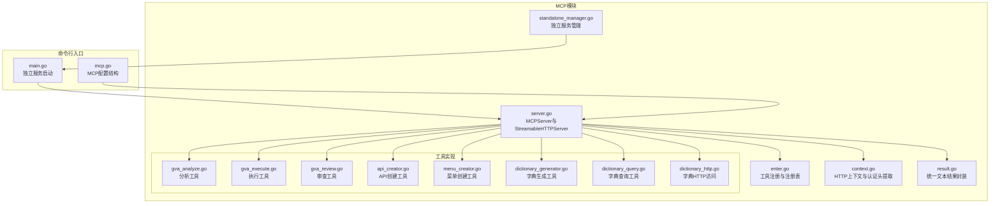
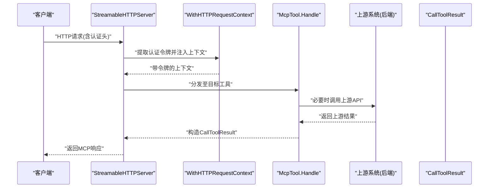
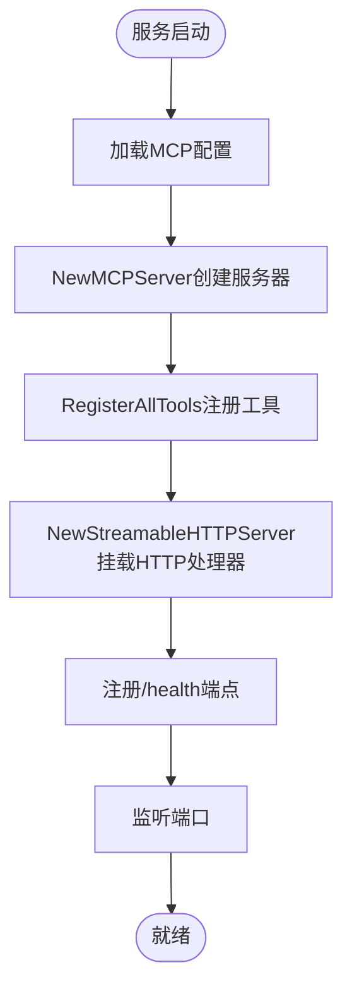
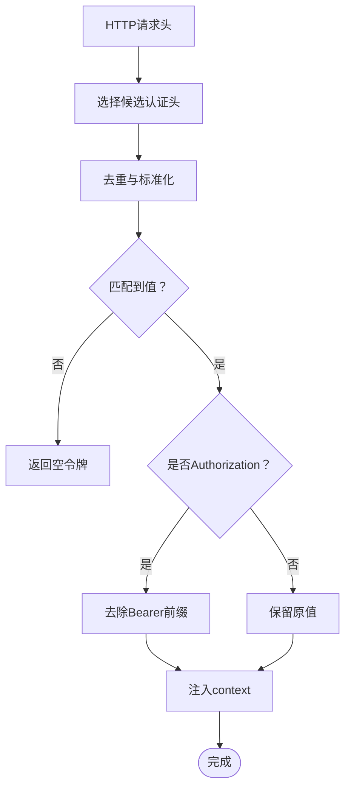
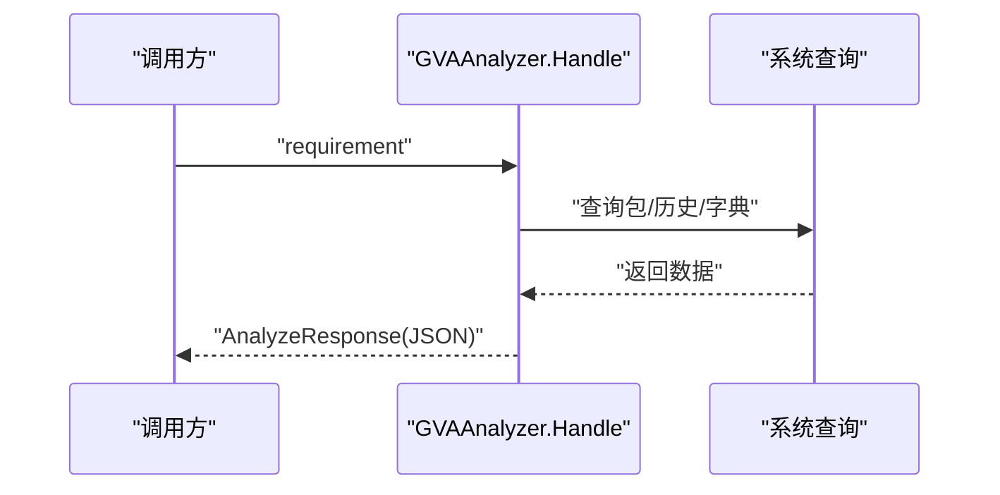
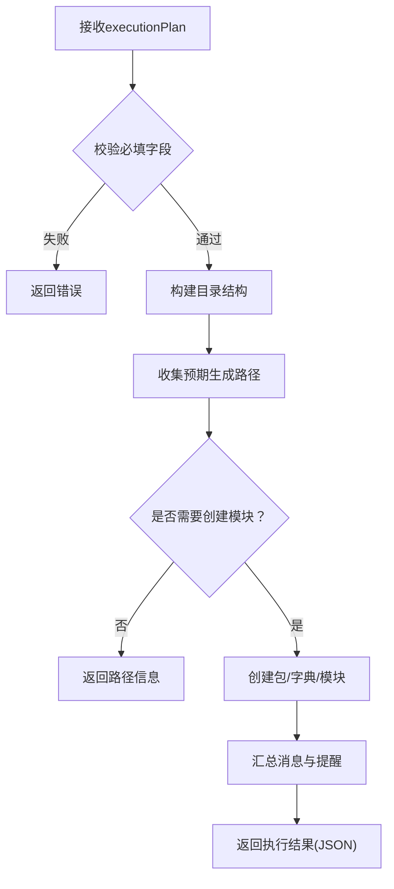
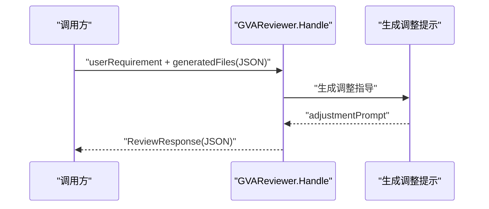
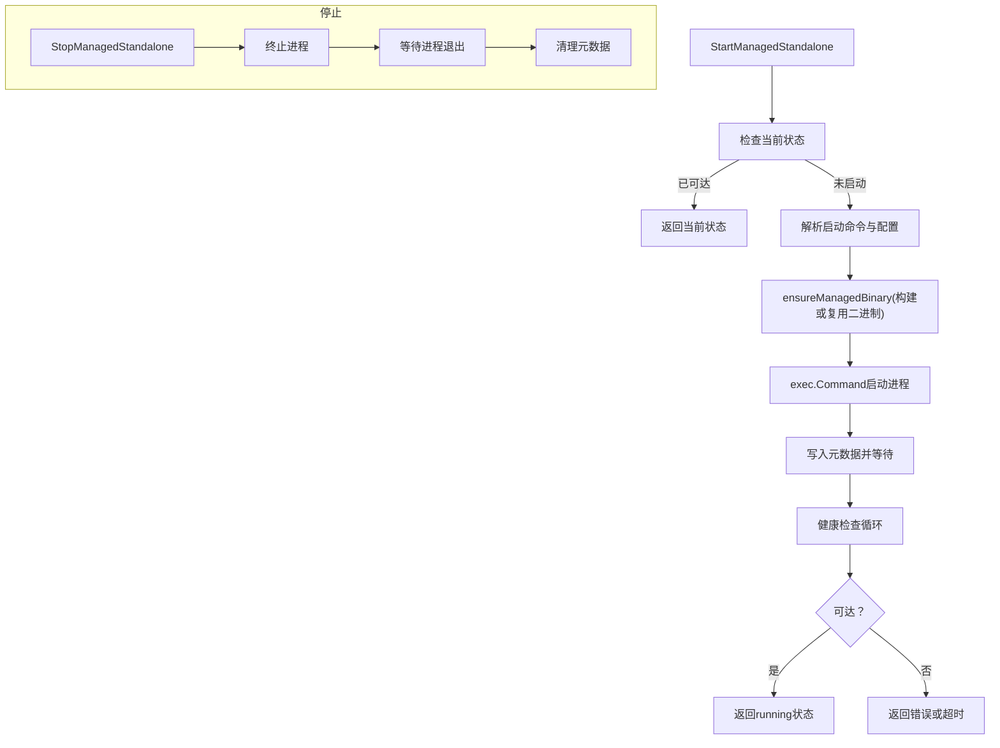
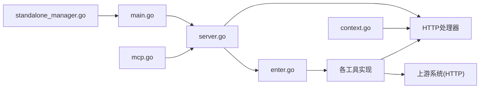

# 插件MCP API

<cite>
**本文引用的文件**
- [enter.go](file://server/mcp/enter.go)
- [server.go](file://server/mcp/server.go)
- [context.go](file://server/mcp/context.go)
- [main.go](file://server/cmd/mcp/main.go)
- [mcp.go](file://server/config/mcp.go)
- [gva_analyze.go](file://server/mcp/gva_analyze.go)
- [gva_execute.go](file://server/mcp/gva_execute.go)
- [gva_review.go](file://server/mcp/gva_review.go)
- [api_creator.go](file://server/mcp/api_creator.go)
- [menu_creator.go](file://server/mcp/menu_creator.go)
- [dictionary_generator.go](file://server/mcp/dictionary_generator.go)
- [dictionary_query.go](file://server/mcp/dictionary_query.go)
- [dictionary_http.go](file://server/mcp/dictionary_http.go)
- [result.go](file://server/mcp/result.go)
- [standalone_manager.go](file://server/mcp/standalone_manager.go)
</cite>

## 目录
1. [简介](#简介)
2. [项目结构](#项目结构)
3. [核心组件](#核心组件)
4. [架构总览](#架构总览)
5. [详细组件分析](#详细组件分析)
6. [依赖关系分析](#依赖关系分析)
7. [性能考虑](#性能考虑)
8. [故障排查指南](#故障排查指南)
9. [结论](#结论)
10. [附录](#附录)

## 简介
本文件为“插件MCP模块”的专业API文档，面向希望接入或扩展MCP（Model Context Protocol）插件体系的开发者。文档系统性阐述MCP插件系统的API接口规范、插件注册与生命周期管理、工具执行与结果返回、通信机制与认证、插件发现与加载流程、工具接口定义与参数传递规范、错误处理与调试方法、开发示例、部署配置与性能优化建议，以及安全隔离、资源管理与故障恢复机制。

## 项目结构
MCP模块位于后端服务的server/mcp目录，围绕“工具注册表”“MCP服务器”“独立运行器”“上下文与认证”“工具实现”等维度组织。命令行入口位于server/cmd/mcp，负责启动独立的MCP HTTP服务。

**图表来源**
- [enter.go:1-32](file://server/mcp/enter.go#L1-L32)
- [server.go:1-53](file://server/mcp/server.go#L1-L53)
- [context.go:1-67](file://server/mcp/context.go#L1-L67)
- [result.go:1-30](file://server/mcp/result.go#L1-L30)
- [gva_analyze.go:1-495](file://server/mcp/gva_analyze.go#L1-L495)
- [gva_execute.go:1-751](file://server/mcp/gva_execute.go#L1-L751)
- [gva_review.go:1-171](file://server/mcp/gva_review.go#L1-L171)
- [api_creator.go:1-160](file://server/mcp/api_creator.go#L1-L160)
- [menu_creator.go:1-229](file://server/mcp/menu_creator.go#L1-L229)
- [dictionary_generator.go:1-175](file://server/mcp/dictionary_generator.go#L1-L175)
- [dictionary_query.go:1-140](file://server/mcp/dictionary_query.go#L1-L140)
- [dictionary_http.go:1-74](file://server/mcp/dictionary_http.go#L1-L74)
- [standalone_manager.go:1-480](file://server/mcp/standalone_manager.go#L1-L480)
- [main.go:1-36](file://server/cmd/mcp/main.go#L1-L36)
- [mcp.go:1-19](file://server/config/mcp.go#L1-L19)

**章节来源**
- [enter.go:1-32](file://server/mcp/enter.go#L1-L32)
- [server.go:1-53](file://server/mcp/server.go#L1-L53)
- [main.go:1-36](file://server/cmd/mcp/main.go#L1-L36)
- [mcp.go:1-19](file://server/config/mcp.go#L1-L19)

## 核心组件
- 工具接口与注册表
  - 定义McpTool接口，包含New()返回工具元信息、Handle()处理调用。
  - 工具注册表通过RegisterTool集中登记，RegisterAllTools统一注入MCPServer。
- MCP服务器
  - NewMCPServer基于全局配置创建MCPServer实例并注册全部工具。
  - NewStreamableHTTPServer创建HTTP处理器，挂载健康检查与MCP路径。
- 上下文与认证
  - WithHTTPRequestContext从HTTP请求头提取令牌，注入到context。
  - 支持多种认证头名回退策略，兼容常见命名。
- 独立服务管理
  - Standalone Manager负责独立MCP进程的启动、停止、健康检查、元数据持久化与日志路径管理。
- 工具实现
  - 分析工具：返回现有包、模块、字典信息并清理空包。
  - 执行工具：按执行计划批量创建包、模块、字典，返回生成路径与后续动作。
  - 审查工具：接收用户需求与生成文件列表，给出调整建议与优化提示。
  - API/菜单/字典工具：分别对接后端API、前端菜单、字典系统，支持批量创建与查询。

**章节来源**
- [enter.go:9-32](file://server/mcp/enter.go#L9-L32)
- [server.go:11-52](file://server/mcp/server.go#L11-L52)
- [context.go:15-66](file://server/mcp/context.go#L15-L66)
- [standalone_manager.go:88-198](file://server/mcp/standalone_manager.go#L88-L198)
- [gva_analyze.go:74-115](file://server/mcp/gva_analyze.go#L74-L115)
- [gva_execute.go:54-289](file://server/mcp/gva_execute.go#L54-L289)
- [gva_review.go:35-140](file://server/mcp/gva_review.go#L35-L140)
- [api_creator.go:36-159](file://server/mcp/api_creator.go#L36-L159)
- [menu_creator.go:55-216](file://server/mcp/menu_creator.go#L55-L216)
- [dictionary_generator.go:40-102](file://server/mcp/dictionary_generator.go#L40-L102)
- [dictionary_query.go:46-108](file://server/mcp/dictionary_query.go#L46-L108)

## 架构总览
MCP模块采用“工具即服务”的设计：每个工具实现McpTool接口并通过注册表注入MCPServer。HTTP层负责接收外部调用，上下文层负责认证与令牌传递，工具层负责业务逻辑与结果封装。

**图表来源**
- [server.go:40-44](file://server/mcp/server.go#L40-L44)
- [context.go:15-34](file://server/mcp/context.go#L15-L34)
- [result.go:10-29](file://server/mcp/result.go#L10-L29)

## 详细组件分析

### 工具注册与生命周期
- 工具注册
  - 工具在init中调用RegisterTool，将自身工具元信息与处理函数注册到全局注册表。
  - 启动时，RegisterAllTools遍历注册表，统一AddTool到MCPServer。
- 生命周期
  - 服务启动：NewMCPServer创建服务器并注册工具。
  - 独立服务：main.go读取配置、初始化日志、创建StreamableHTTPServer并监听端口。
  - 健康检查：/health端点返回200状态码。

**图表来源**
- [server.go:11-52](file://server/mcp/server.go#L11-L52)
- [enter.go:20-31](file://server/mcp/enter.go#L20-L31)
- [main.go:22-35](file://server/cmd/mcp/main.go#L22-L35)

**章节来源**
- [enter.go:17-31](file://server/mcp/enter.go#L17-L31)
- [server.go:11-52](file://server/mcp/server.go#L11-L52)
- [main.go:12-35](file://server/cmd/mcp/main.go#L12-L35)

### 认证与上下文
- 认证头提取策略
  - 优先使用配置的AuthHeader，其次尝试"x-token"、"token"、"authorization"。
  - Authorization头若为Bearer形式，去除前缀。
- 上下文注入
  - WithHTTPRequestContext将令牌放入context，供工具Handle使用。
- 配置项
  - AuthHeader、BaseURL、UpstreamBaseURL、Path、Addr等。

**图表来源**
- [context.go:36-66](file://server/mcp/context.go#L36-L66)
- [context.go:15-34](file://server/mcp/context.go#L15-L34)
- [mcp.go:3-11](file://server/config/mcp.go#L3-L11)

**章节来源**
- [context.go:15-66](file://server/mcp/context.go#L15-L66)
- [mcp.go:3-11](file://server/config/mcp.go#L3-L11)

### 工具接口与参数规范

#### 分析工具（gva_analyze）
- 功能：分析系统现有包、模块、字典，清理空包与脏历史，返回清理信息。
- 输入参数
  - requirement: 用户需求描述（必填）
- 输出结构
  - existingPackages: 包信息列表
  - predesignedModules: 预设计模块列表
  - dictionaries: 字典信息
  - cleanupInfo: 清理信息（可选）

**图表来源**
- [gva_analyze.go:85-115](file://server/mcp/gva_analyze.go#L85-L115)
- [gva_analyze.go:118-259](file://server/mcp/gva_analyze.go#L118-L259)

**章节来源**
- [gva_analyze.go:74-115](file://server/mcp/gva_analyze.go#L74-L115)
- [gva_analyze.go:118-259](file://server/mcp/gva_analyze.go#L118-L259)

#### 执行工具（gva_execute）
- 功能：按执行计划批量创建包、模块、字典，返回生成路径与后续动作。
- 输入参数
  - executionPlan: 执行计划对象（必填）
    - packageName: 包名
    - packageType: "package" 或 "plugin"
    - needCreatedPackage/needCreatedModules/needCreatedDictionaries: 布尔开关
    - packageInfo/modulesInfo/dictionariesInfo: 对应信息（按需提供）
  - requirement: 原始需求描述（可选）
- 输出结构
  - success/message/packageId/historyId/paths/generatedPaths/nextActions

**图表来源**
- [gva_execute.go:217-289](file://server/mcp/gva_execute.go#L217-L289)
- [gva_execute.go:291-438](file://server/mcp/gva_execute.go#L291-L438)
- [gva_execute.go:440-515](file://server/mcp/gva_execute.go#L440-L515)

**章节来源**
- [gva_execute.go:54-289](file://server/mcp/gva_execute.go#L54-L289)
- [gva_execute.go:291-515](file://server/mcp/gva_execute.go#L291-L515)

#### 审查工具（gva_review）
- 功能：在执行完成后，基于用户需求与生成文件列表给出调整建议。
- 输入参数
  - userRequirement: 经过分析后的用户需求（必填）
  - generatedFiles: 生成文件列表（JSON字符串，必填）
- 输出结构
  - success/message/adjustmentPrompt/reviewDetails

**图表来源**
- [gva_review.go:80-140](file://server/mcp/gva_review.go#L80-L140)
- [gva_review.go:142-171](file://server/mcp/gva_review.go#L142-L171)

**章节来源**
- [gva_review.go:35-140](file://server/mcp/gva_review.go#L35-L140)
- [gva_review.go:142-171](file://server/mcp/gva_review.go#L142-L171)

#### API创建工具（create_api）
- 功能：创建后端API记录，支持单个与批量创建。
- 输入参数
  - path/description/apiGroup/method（单个）或 apis（批量JSON）
- 输出结构
  - success/totalCount/successCount/failedCount/details

**章节来源**
- [api_creator.go:36-159](file://server/mcp/api_creator.go#L36-L159)

#### 菜单创建工具（create_menu）
- 功能：创建前端菜单记录，支持参数与按钮配置。
- 输入参数
  - parentId/path/name/hidden/component/sort/title/icon/keepAlive/defaultMenu/closeTab/activeName/parameters/menuBtn
- 输出结构
  - success/message/menuId/name/path

**章节来源**
- [menu_creator.go:55-216](file://server/mcp/menu_creator.go#L55-L216)

#### 字典生成工具（generate_dictionary_options）
- 功能：智能生成字典选项并自动创建字典与字典详情。
- 输入参数
  - dictType/fieldDesc/options（必填），dictName/description（可选）
- 输出结构
  - success/message/dictType/optionsCount

**章节来源**
- [dictionary_generator.go:40-102](file://server/mcp/dictionary_generator.go#L40-L102)
- [dictionary_generator.go:104-160](file://server/mcp/dictionary_generator.go#L104-L160)

#### 字典查询工具（query_dictionaries）
- 功能：查询系统中所有字典或指定类型的字典，支持包含禁用项与仅详情。
- 输入参数
  - dictType/includeDisabled/detailsOnly
- 输出结构
  - success/message/total/dictionaries/details

**章节来源**
- [dictionary_query.go:46-108](file://server/mcp/dictionary_query.go#L46-L108)
- [dictionary_query.go:110-139](file://server/mcp/dictionary_query.go#L110-L139)

### 独立服务管理
- 状态查询：GetManagedStandaloneStatus根据健康检查与进程存在性判断状态。
- 启动流程：resolveManagedStartCommand -> ensureManagedBinary -> exec.Command -> 写入元数据 -> waitForManagedProcess。
- 停止流程：StopManagedStandalone终止托管进程并清理元数据。
- 健康检查：ResolveMCPHealthURL + checkMCPHealth。

**图表来源**
- [standalone_manager.go:142-198](file://server/mcp/standalone_manager.go#L142-L198)
- [standalone_manager.go:200-240](file://server/mcp/standalone_manager.go#L200-L240)
- [standalone_manager.go:242-293](file://server/mcp/standalone_manager.go#L242-L293)
- [standalone_manager.go:295-353](file://server/mcp/standalone_manager.go#L295-L353)

**章节来源**
- [standalone_manager.go:88-198](file://server/mcp/standalone_manager.go#L88-L198)
- [standalone_manager.go:242-293](file://server/mcp/standalone_manager.go#L242-L293)
- [standalone_manager.go:295-353](file://server/mcp/standalone_manager.go#L295-L353)

## 依赖关系分析
- 组件耦合
  - 工具实现依赖统一的McpTool接口与注册表，降低工具间耦合。
  - 服务器层依赖全局配置与上下文，工具层通过Handle接收上下文与参数。
  - 独立服务管理与命令行入口解耦，便于运维与集成。
- 外部依赖
  - 使用mark3labs/mcp-go作为MCP协议实现。
  - 通过HTTP上游调用后端系统（API、菜单、字典等）。

**图表来源**
- [enter.go:1-32](file://server/mcp/enter.go#L1-L32)
- [server.go:1-53](file://server/mcp/server.go#L1-L53)
- [context.go:1-67](file://server/mcp/context.go#L1-L67)
- [main.go:1-36](file://server/cmd/mcp/main.go#L1-L36)
- [mcp.go:1-19](file://server/config/mcp.go#L1-L19)
- [standalone_manager.go:1-480](file://server/mcp/standalone_manager.go#L1-L480)

**章节来源**
- [enter.go:1-32](file://server/mcp/enter.go#L1-L32)
- [server.go:1-53](file://server/mcp/server.go#L1-L53)
- [main.go:1-36](file://server/cmd/mcp/main.go#L1-L36)
- [mcp.go:1-19](file://server/config/mcp.go#L1-L19)
- [standalone_manager.go:1-480](file://server/mcp/standalone_manager.go#L1-L480)

## 性能考虑
- 并发与超时
  - 健康检查与启动等待设置超时阈值，避免阻塞。
  - HTTP处理器基于标准库ServeMux，适合轻量并发。
- 资源管理
  - 独立服务二进制按需构建，减少重复编译开销。
  - 日志文件落盘，便于问题定位与容量控制。
- 优化建议
  - 对批量创建工具（API/菜单/字典）建议合并请求，减少上游往返。
  - 工具内部增加幂等检查，避免重复创建导致的无效开销。
  - 对大型字典查询建议分页或按类型过滤，减少响应体积。

[本节为通用建议，无需特定文件引用]

## 故障排查指南
- 常见问题
  - 认证失败：检查AuthHeader配置与请求头命名是否一致。
  - 工具未注册：确认工具init中调用了RegisterTool。
  - 独立服务不可达：查看/health端点与监听地址配置。
  - 启动超时：检查二进制构建与日志路径权限。
- 调试方法
  - 使用GetManagedStandaloneStatus查看状态与LastError。
  - 查看托管进程PID、启动时间、日志路径。
  - 在工具Handle中打印关键参数与中间结果，结合日志定位。

**章节来源**
- [context.go:20-66](file://server/mcp/context.go#L20-L66)
- [enter.go:20-31](file://server/mcp/enter.go#L20-L31)
- [standalone_manager.go:88-140](file://server/mcp/standalone_manager.go#L88-L140)
- [standalone_manager.go:242-293](file://server/mcp/standalone_manager.go#L242-L293)

## 结论
MCP模块通过清晰的工具接口、统一的注册与注入机制、完善的上下文与认证、以及独立服务管理能力，提供了可扩展、可观测、可运维的插件化能力。配合分析-执行-审查的闭环工具链，能够高效支撑代码生成与系统扩展场景。

[本节为总结，无需特定文件引用]

## 附录

### 开发示例（步骤指引）
- 新增工具
  - 实现McpTool接口（New/Handle），在init中调用RegisterTool。
  - 在Handle中解析参数、执行业务逻辑、返回CallToolResult。
- 集成到服务器
  - 确保启动流程调用NewMCPServer与RegisterAllTools。
  - 配置MCP.Path、Addr、AuthHeader等参数。
- 独立运行
  - 使用server/cmd/mcp/main.go启动独立服务，或通过standalone_manager管理。

**章节来源**
- [enter.go:9-31](file://server/mcp/enter.go#L9-L31)
- [server.go:11-23](file://server/mcp/server.go#L11-L23)
- [main.go:12-35](file://server/cmd/mcp/main.go#L12-L35)
- [standalone_manager.go:142-198](file://server/mcp/standalone_manager.go#L142-L198)

### 部署配置要点
- 配置项
  - name/version/path/addr/base_url/upstream_base_url/auth_header/request_timeout
- 独立服务
  - 通过环境变量GVA_MCP_CONFIG指定配置文件路径。
  - 支持显式GVA_MCP_BIN指定二进制位置。

**章节来源**
- [mcp.go:3-18](file://server/config/mcp.go#L3-L18)
- [standalone_manager.go:295-319](file://server/mcp/standalone_manager.go#L295-L319)

### 安全与隔离
- 认证隔离
  - 通过WithHTTPRequestContext提取令牌并注入上下文，工具侧可基于令牌进行鉴权。
- 进程隔离
  - 独立服务以独立进程运行，支持后台守护与健康检查。
- 资源隔离
  - 日志文件与元数据分离，便于审计与回收。

**章节来源**
- [context.go:15-34](file://server/mcp/context.go#L15-L34)
- [standalone_manager.go:427-462](file://server/mcp/standalone_manager.go#L427-L462)