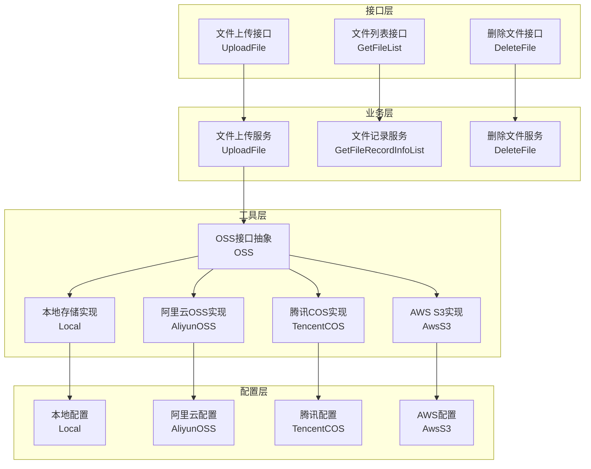
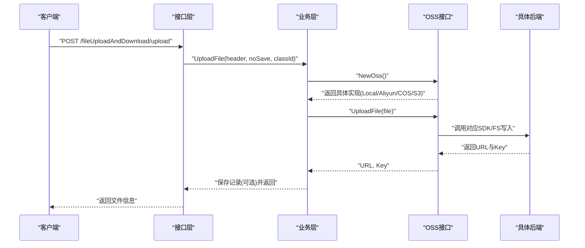
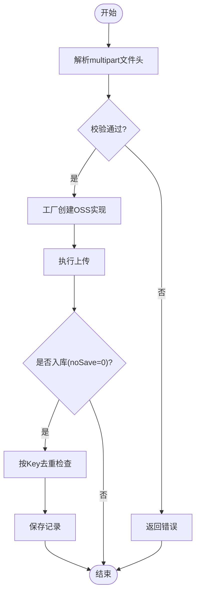
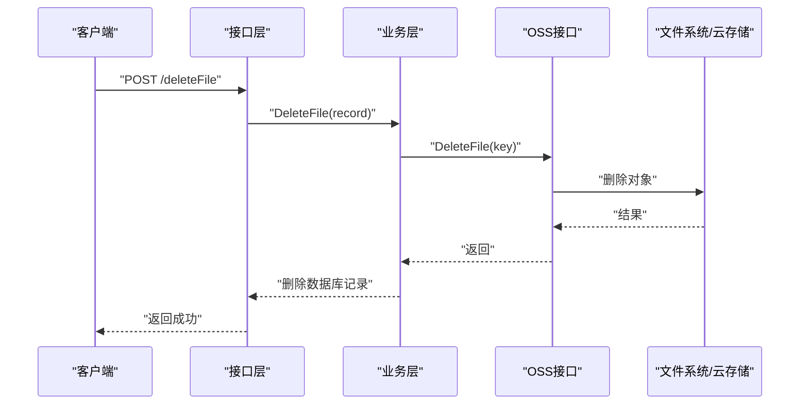
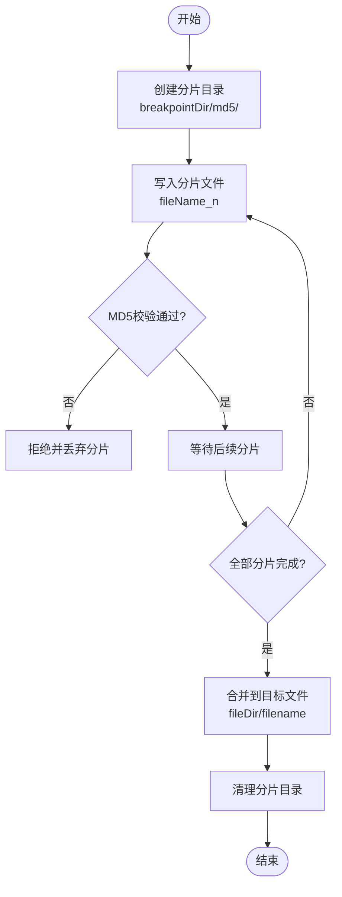
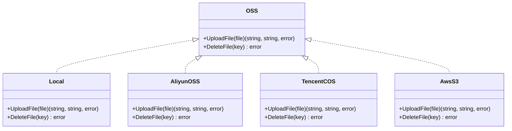
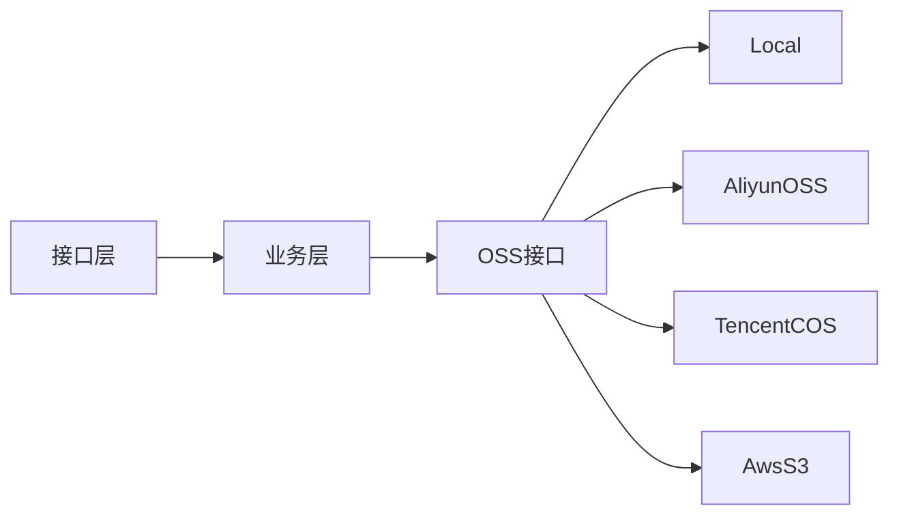
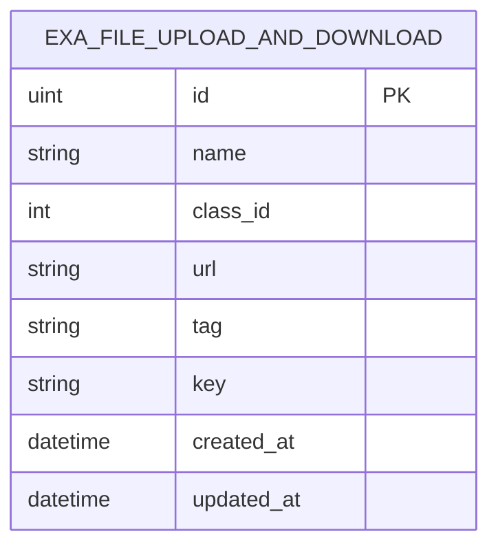

# 文件存储API

<cite>
**本文引用的文件**
- [exa_file_upload_download.go](file://server/api/v1/example/exa_file_upload_download.go)
- [exa_file_upload_download.go](file://server/service/example/exa_file_upload_download.go)
- [upload.go](file://server/utils/upload/upload.go)
- [local.go](file://server/utils/Upload/local.go)
- [aliyun_oss.go](file://server/utils/Upload/aliyun_oss.go)
- [tencent_cos.go](file://server/utils/Upload/tencent_cos.go)
- [aws_s3.go](file://server/utils/Upload/aws_s3.go)
- [breakpoint_continue.go](file://server/utils/breakpoint_continue.go)
- [exa_file_upload_download.go](file://server/model/example/exa_file_upload_download.go)
- [oss_local.go](file://server/config/oss_local.go)
- [oss_aliyun.go](file://server/config/oss_aliyun.go)
- [oss_tencent.go](file://server/config/oss_tencent.go)
- [oss_aws.go](file://server/config/oss_aws.go)
- [disk.go](file://server/config/disk.go)
- [exa_file_upload_and_downloads.go](file://server/model/example/request/exa_file_upload_and_downloads.go)
</cite>

## 目录
1. [简介](#简介)
2. [项目结构](#项目结构)
3. [核心组件](#核心组件)
4. [架构总览](#架构总览)
5. [详细组件分析](#详细组件分析)
6. [依赖分析](#依赖分析)
7. [性能考虑](#性能考虑)
8. [故障排查指南](#故障排查指南)
9. [结论](#结论)
10. [附录](#附录)

## 简介
本文件存储API文档面向测试管理平台的文件上传、下载、断点续传与多云存储集成能力，覆盖本地存储、阿里云OSS、腾讯COS、AWS S3等后端的统一接口规范。文档详细说明：
- 文件上传流程控制与分片/并发策略
- 断点续传的实现机制与目录组织
- 多存储后端的配置参数、访问权限与安全防护
- 文件类型验证、大小限制、配额与清理策略
- 访问URL生成、临时令牌与CDN加速使用建议

## 项目结构
围绕文件存储的关键代码分布在以下层次：
- 接口层：对外暴露REST API，定义请求参数与响应结构
- 业务层：封装上传、删除、列表查询等业务逻辑
- 工具层：抽象OSS接口与具体后端实现，支持按配置切换
- 配置层：集中管理各存储后端的访问凭据与路径前缀
- 模型层：数据库表结构与请求参数模型

图表来源
- [exa_file_upload_download.go:16-42](file://server/api/v1/example/exa_file_upload_download.go#L16-L42)
- [exa_file_upload_download.go:96-120](file://server/service/example/exa_file_upload_download.go#L96-L120)
- [upload.go:12-46](file://server/utils/upload/upload.go#L12-L46)
- [local.go:31-69](file://server/utils/Upload/local.go#L31-L69)
- [aliyun_oss.go:15-41](file://server/utils/Upload/aliyun_oss.go#L15-L41)
- [tencent_cos.go:21-36](file://server/utils/Upload/tencent_cos.go#L21-L36)
- [aws_s3.go:29-54](file://server/utils/Upload/aws_s3.go#L29-L54)
- [oss_local.go:3-6](file://server/config/oss_local.go#L3-L6)
- [oss_aliyun.go:3-10](file://server/config/oss_aliyun.go#L3-L10)
- [oss_tencent.go:3-10](file://server/config/oss_tencent.go#L3-L10)
- [oss_aws.go:3-13](file://server/config/oss_aws.go#L3-L13)

章节来源
- [exa_file_upload_download.go:16-136](file://server/api/v1/example/exa_file_upload_download.go#L16-L136)
- [exa_file_upload_download.go:21-131](file://server/service/example/exa_file_upload_download.go#L21-L131)
- [upload.go:9-47](file://server/utils/upload/upload.go#L9-L47)

## 核心组件
- 接口层
  - 上传文件：接收multipart/form-data，返回文件信息与访问URL
  - 编辑文件名/备注：更新数据库记录
  - 删除文件：调用OSS后端删除对象，并清理数据库记录
  - 获取文件列表：分页查询附件记录
  - 导入URL：批量导入外部URL作为附件记录
- 业务层
  - 统一通过OSS工厂选择具体实现
  - 支持“不入库”模式用于预览或临时上传
  - 删除时先调用OSS后端删除，再删除数据库记录
- 工具层
  - OSS接口抽象，屏蔽后端差异
  - 本地：基于文件系统写入与删除
  - 阿里云OSS：基于SDK上传与删除
  - 腾讯COS：基于SDK上传与删除
  - AWS S3：基于SDK上传与删除，支持自定义Endpoint与路径风格

章节来源
- [exa_file_upload_download.go:16-136](file://server/api/v1/example/exa_file_upload_download.go#L16-L136)
- [exa_file_upload_download.go:96-131](file://server/service/example/exa_file_upload_download.go#L96-L131)
- [upload.go:12-46](file://server/utils/upload/upload.go#L12-L46)
- [local.go:31-109](file://server/utils/Upload/local.go#L31-L109)
- [aliyun_oss.go:15-59](file://server/utils/Upload/aliyun_oss.go#L15-L59)
- [tencent_cos.go:21-61](file://server/utils/Upload/tencent_cos.go#L21-L61)
- [aws_s3.go:29-114](file://server/utils/Upload/aws_s3.go#L29-L114)

## 架构总览
文件存储采用“接口抽象 + 工厂选择 + 配置驱动”的架构，确保在不修改上层逻辑的前提下切换后端。

图表来源
- [exa_file_upload_download.go:25-42](file://server/api/v1/example/exa_file_upload_download.go#L25-L42)
- [exa_file_upload_download.go:96-120](file://server/service/example/exa_file_upload_download.go#L96-L120)
- [upload.go:20-46](file://server/utils/upload/upload.go#L20-L46)

## 详细组件分析

### 上传流程与接口规范
- 接口定义
  - 方法：POST
  - 路径：/fileUploadAndDownload/upload
  - 请求体：multipart/form-data，字段file为文件；可选查询参数noSave控制是否入库；可选表单字段classId用于分类
  - 成功响应：包含文件信息（名称、URL、Key、标签、分类ID）
- 流程控制
  - 接收文件头，校验错误即返回
  - 通过OSS工厂创建具体实现并执行上传
  - 生成URL与Key，按noSave决定是否入库
  - 入库时去重（按Key），避免重复记录
- 并发与分片
  - 当前实现为整体上传，未见内置分片并发逻辑
  - 若需分片/断点续传，可参考断点续传工具函数进行扩展

图表来源
- [exa_file_upload_download.go:25-42](file://server/api/v1/example/exa_file_upload_download.go#L25-L42)
- [exa_file_upload_download.go:96-120](file://server/service/example/exa_file_upload_download.go#L96-L120)

章节来源
- [exa_file_upload_download.go:16-42](file://server/api/v1/example/exa_file_upload_download.go#L16-L42)
- [exa_file_upload_download.go:96-120](file://server/service/example/exa_file_upload_download.go#L96-L120)

### 删除流程与权限控制
- 接口定义
  - 方法：POST
  - 路径：/fileUploadAndDownload/deleteFile
  - 请求体：文件记录ID
  - 成功响应：删除成功提示
- 权限与安全
  - 删除操作依赖鉴权中间件（ApiKeyAuth）
  - OSS后端删除失败会回滚错误信息
  - 本地删除对Key进行路径遍历与非法字符校验

图表来源
- [exa_file_upload_download.go:61-82](file://server/api/v1/example/exa_file_upload_download.go#L61-L82)
- [exa_file_upload_download.go:43-55](file://server/service/example/exa_file_upload_download.go#L43-L55)
- [local.go:81-109](file://server/utils/Upload/local.go#L81-L109)

章节来源
- [exa_file_upload_download.go:61-82](file://server/api/v1/example/exa_file_upload_download.go#L61-L82)
- [exa_file_upload_download.go:43-55](file://server/service/example/exa_file_upload_download.go#L43-L55)
- [local.go:81-109](file://server/utils/Upload/local.go#L81-L109)

### 断点续传与分片上传
- 实现机制
  - 本地断点续传：将每个分片写入./breakpointDir/{md5}/，完成后合并至./fileDir/
  - 校验逻辑：通过MD5校验分片完整性，不一致则拒绝
  - 清理逻辑：合并完成后可移除对应分片目录
- 并发策略
  - 未见内置并发分片上传实现
  - 可结合前端分片并发与后端分片落盘，合并阶段串行或加锁
- 安全与路径
  - 对文件名与路径进行包含“..”与非法字符检测，防止路径穿越

图表来源
- [breakpoint_continue.go:26-107](file://server/utils/breakpoint_continue.go#L26-L107)

章节来源
- [breakpoint_continue.go:15-122](file://server/utils/breakpoint_continue.go#L15-L122)

### 多云存储集成与配置
- 接口抽象
  - OSS接口定义UploadFile与DeleteFile两个方法，屏蔽后端差异
  - 工厂方法根据系统配置选择具体实现
- 后端实现
  - 本地：基于文件系统写入与删除，支持路径与访问路径分离
  - 阿里云OSS：使用SDK上传与删除，支持BasePath与BucketUrl
  - 腾讯COS：使用SDK上传与删除，支持PathPrefix与BaseURL
  - AWS S3：使用SDK上传与删除，支持Endpoint、Region、S3ForcePathStyle与DisableSSL
- 配置项
  - 本地：path、store-path
  - 阿里云：endpoint、access-key-id、access-key-secret、bucket-name、bucket-url、base-path
  - 腾讯：bucket、region、secret-id、secret-key、base-url、path-prefix
  - AWS：bucket、region、endpoint、secret-id、secret-key、base-url、path-prefix、s3-force-path-style、disable-ssl

图表来源
- [upload.go:12-46](file://server/utils/upload/upload.go#L12-L46)
- [local.go:20-109](file://server/utils/Upload/local.go#L20-L109)
- [aliyun_oss.go:13-59](file://server/utils/Upload/aliyun_oss.go#L13-L59)
- [tencent_cos.go:18-61](file://server/utils/Upload/tencent_cos.go#L18-L61)
- [aws_s3.go:20-114](file://server/utils/Upload/aws_s3.go#L20-L114)

章节来源
- [upload.go:12-46](file://server/utils/upload/upload.go#L12-L46)
- [oss_local.go:3-6](file://server/config/oss_local.go#L3-L6)
- [oss_aliyun.go:3-10](file://server/config/oss_aliyun.go#L3-L10)
- [oss_tencent.go:3-10](file://server/config/oss_tencent.go#L3-L10)
- [oss_aws.go:3-13](file://server/config/oss_aws.go#L3-L13)

### 下载与访问URL
- 本地存储
  - 通过配置中的访问路径与存储路径拼接生成URL
- 云存储
  - 通过BucketUrl/BaseURL + BasePath/PathPrefix + 文件Key拼接生成URL
- CDN加速
  - 建议在云存储侧配置CDN域名，将访问URL指向CDN加速域名
- 临时令牌
  - 阿里云OSS/腾讯COS/AWS S3均支持签名URL生成，建议在需要私有访问时使用
  - 本仓库未内置签名接口，可在业务层扩展

章节来源
- [local.go:46-69](file://server/utils/Upload/local.go#L46-L69)
- [aliyun_oss.go:31-40](file://server/utils/Upload/aliyun_oss.go#L31-L40)
- [tencent_cos.go:31-35](file://server/utils/Upload/tencent_cos.go#L31-L35)
- [aws_s3.go:53-53](file://server/utils/Upload/aws_s3.go#L53-L53)

### 文件类型验证、大小限制与配额管理
- 类型与大小
  - 当前实现未见显式类型白名单与大小限制逻辑
  - 建议在接口层增加MIME类型与Content-Length校验
- 配额与清理
  - 未见服务端配额限制与自动清理策略
  - 建议引入存储用量统计与定期清理任务（如过期未入库文件）

章节来源
- [exa_file_upload_download.go:25-42](file://server/api/v1/example/exa_file_upload_download.go#L25-L42)
- [exa_file_upload_download.go:96-120](file://server/service/example/exa_file_upload_download.go#L96-L120)

## 依赖分析
- 组件耦合
  - 接口层仅依赖业务层；业务层仅依赖OSS接口；OSS接口与具体实现松耦合
  - 工厂方法集中于配置选择，便于扩展新后端
- 外部依赖
  - 阿里云OSS SDK、腾讯COS SDK、AWS SDK
  - 本地文件系统I/O
- 循环依赖
  - 未发现循环依赖

图表来源
- [upload.go:20-46](file://server/utils/upload/upload.go#L20-L46)
- [exa_file_upload_download.go:49-52](file://server/service/example/exa_file_upload_download.go#L49-L52)

章节来源
- [upload.go:20-46](file://server/utils/upload/upload.go#L20-L46)

## 性能考虑
- 上传性能
  - 本地上传为同步I/O，建议在高并发场景下优化磁盘队列与并发写入
  - 云存储上传建议启用多部分上传（Multipart Upload）以提升大文件稳定性
- 并发策略
  - 断点续传可并行写入分片，合并阶段串行或加锁
  - 云存储端可利用SDK的并发上传器（如S3 Uploader）
- 缓存与CDN
  - 对热点文件启用CDN缓存，降低源站压力
- 日志与监控
  - 建议埋点上传耗时、成功率与错误类型，便于容量规划与问题定位

## 故障排查指南
- 常见错误
  - 文件接收失败：检查multipart解析与文件大小限制
  - OSS初始化失败：核对凭据、Endpoint、Bucket等配置
  - 本地删除失败：检查Key合法性与文件存在性
- 定位步骤
  - 查看日志输出，定位具体失败环节
  - 核对配置项与网络连通性
  - 对云存储后端，确认签名与权限策略
- 建议
  - 在生产环境开启更详细的日志级别
  - 对外暴露的上传接口增加速率限制与IP白名单

章节来源
- [local.go:41-68](file://server/utils/Upload/local.go#L41-L68)
- [aliyun_oss.go:18-38](file://server/utils/Upload/aliyun_oss.go#L18-L38)
- [tencent_cos.go:25-34](file://server/utils/Upload/tencent_cos.go#L25-L34)
- [aws_s3.go:48-51](file://server/utils/Upload/aws_s3.go#L48-L51)

## 结论
本文件存储API通过统一的OSS接口抽象实现了多后端无缝切换，满足本地与主流云存储的上传、删除与访问需求。建议在现有基础上补充：
- 分片/断点续传的并发策略与合并机制
- 文件类型与大小限制、配额与清理策略
- 云存储签名URL与CDN加速的最佳实践
- 更完善的错误处理与可观测性

## 附录

### 数据模型

图表来源
- [exa_file_upload_download.go:7-18](file://server/model/example/exa_file_upload_download.go#L7-L18)

### 请求参数模型
- 分页查询参数
  - classId：分类ID
  - PageInfo：分页信息（页码、每页数量）

章节来源
- [exa_file_upload_and_downloads.go:7-10](file://server/model/example/request/exa_file_upload_and_downloads.go#L7-L10)