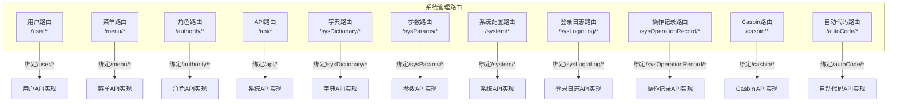
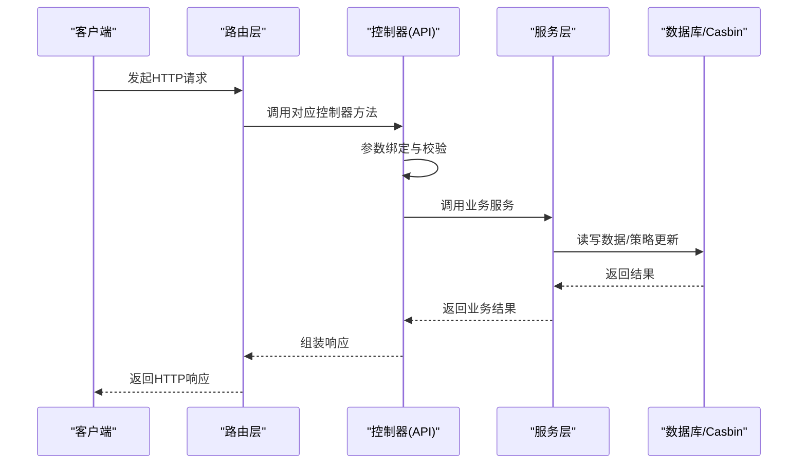
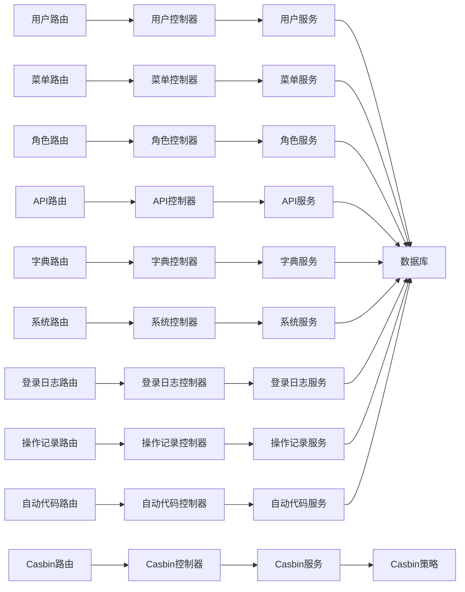

# 系统管理API

<cite>
**本文引用的文件**
- [server/router/system/sys_user.go](file://server/router/system/sys_user.go)
- [server/router/system/sys_menu.go](file://server/router/system/sys_menu.go)
- [server/router/system/sys_authority.go](file://server/router/system/sys_authority.go)
- [server/router/system/sys_api.go](file://server/router/system/sys_api.go)
- [server/router/system/sys_dictionary.go](file://server/router/system/sys_dictionary.go)
- [server/router/system/sys_params.go](file://server/router/system/sys_params.go)
- [server/router/system/sys_system.go](file://server/router/system/sys_system.go)
- [server/router/system/sys_login_log.go](file://server/router/system/sys_login_log.go)
- [server/router/system/sys_operation_record.go](file://server/router/system/sys_operation_record.go)
- [server/router/system/sys_casbin.go](file://server/router/system/sys_casbin.go)
- [server/router/system/sys_auto_code.go](file://server/router/system/sys_auto_code.go)
- [server/api/v1/system/sys_user.go](file://server/api/v1/system/sys_user.go)
- [server/api/v1/system/sys_menu.go](file://server/api/v1/system/sys_menu.go)
- [server/api/v1/system/sys_authority.go](file://server/api/v1/system/sys_authority.go)
- [server/api/v1/system/sys_api.go](file://server/api/v1/system/sys_api.go)
- [server/api/v1/system/sys_dictionary.go](file://server/api/v1/system/sys_dictionary.go)
</cite>

## 目录
1. [简介](#简介)
2. [项目结构](#项目结构)
3. [核心组件](#核心组件)
4. [架构总览](#架构总览)
5. [详细组件分析](#详细组件分析)
6. [依赖分析](#依赖分析)
7. [性能考量](#性能考量)
8. [故障排查指南](#故障排查指南)
9. [结论](#结论)
10. [附录](#附录)

## 简介
本文件为“系统管理模块”的RESTful API文档，覆盖用户管理、角色权限、菜单管理、API管理、字典管理、系统配置、登录日志、操作审计、Casbin权限、自动代码生成等核心能力。文档逐项说明HTTP方法、URL路径、请求参数、响应格式与典型错误场景，并给出调用流程、最佳实践与安全与性能建议。

## 项目结构
系统管理相关路由集中在后端 server/router/system 下，各子模块通过 Router.Group 组织，统一挂载到系统分组下；具体接口实现位于 server/api/v1/system 对应文件中，遵循注释式接口文档规范，便于自动生成OpenAPI/Swagger。

图表来源
- [server/router/system/sys_user.go:10-27](file://server/router/system/sys_user.go#L10-L27)
- [server/router/system/sys_menu.go:10-27](file://server/router/system/sys_menu.go#L10-L27)
- [server/router/system/sys_authority.go:10-24](file://server/router/system/sys_authority.go#L10-L24)
- [server/router/system/sys_api.go:10-34](file://server/router/system/sys_api.go#L10-L34)
- [server/router/system/sys_dictionary.go:10-23](file://server/router/system/sys_dictionary.go#L10-L23)
- [server/router/system/sys_params.go:10-24](file://server/router/system/sys_params.go#L10-L24)
- [server/router/system/sys_system.go:10-21](file://server/router/system/sys_system.go#L10-L21)
- [server/router/system/sys_login_log.go:11-22](file://server/router/system/sys_login_log.go#L11-L22)
- [server/router/system/sys_operation_record.go:9-17](file://server/router/system/sys_operation_record.go#L9-L17)
- [server/router/system/sys_casbin.go:10-18](file://server/router/system/sys_casbin.go#L10-L18)
- [server/router/system/sys_auto_code.go:7-54](file://server/router/system/sys_auto_code.go#L7-L54)

章节来源
- [server/router/system/sys_user.go:10-27](file://server/router/system/sys_user.go#L10-L27)
- [server/router/system/sys_menu.go:10-27](file://server/router/system/sys_menu.go#L10-L27)
- [server/router/system/sys_authority.go:10-24](file://server/router/system/sys_authority.go#L10-L24)
- [server/router/system/sys_api.go:10-34](file://server/router/system/sys_api.go#L10-L34)
- [server/router/system/sys_dictionary.go:10-23](file://server/router/system/sys_dictionary.go#L10-L23)
- [server/router/system/sys_params.go:10-24](file://server/router/system/sys_params.go#L10-L24)
- [server/router/system/sys_system.go:10-21](file://server/router/system/sys_system.go#L10-L21)
- [server/router/system/sys_login_log.go:11-22](file://server/router/system/sys_login_log.go#L11-L22)
- [server/router/system/sys_operation_record.go:9-17](file://server/router/system/sys_operation_record.go#L9-L17)
- [server/router/system/sys_casbin.go:10-18](file://server/router/system/sys_casbin.go#L10-L18)
- [server/router/system/sys_auto_code.go:7-54](file://server/router/system/sys_auto_code.go#L7-L54)

## 核心组件
- 用户管理：管理员注册、修改密码、设置用户权限/信息、重置密码、获取用户列表、获取自身信息、界面配置等。
- 角色权限：创建/删除/更新/复制角色、设置数据权限、全量覆盖角色关联用户。
- 菜单管理：新增/删除/更新菜单、获取菜单树/列表、按角色获取菜单、设置菜单关联角色。
- API管理：创建/删除/批量删除API、更新API、获取API列表/详情、同步API、忽略API、刷新Casbin策略、按API查询角色。
- 字典管理：创建/删除/更新字典、导入/导出字典JSON、按条件分页查询字典。
- 系统配置：设置/获取系统配置、重启服务、获取服务器信息。
- 日志与审计：登录日志删除/批量删除、查询详情/列表；操作审计删除/批量删除、查询详情/列表。
- Casbin权限：更新策略、按角色查询策略路径。
- 自动代码：数据库发现、表/列查询、模板预览/生成、MCP工作流、插件打包/安装/移除、LLM辅助等。

章节来源
- [server/api/v1/system/sys_user.go:20-516](file://server/api/v1/system/sys_user.go#L20-L516)
- [server/api/v1/system/sys_menu.go:18-335](file://server/api/v1/system/sys_menu.go#L18-L335)
- [server/api/v1/system/sys_authority.go:17-257](file://server/api/v1/system/sys_authority.go#L17-L257)
- [server/api/v1/system/sys_api.go:18-381](file://server/api/v1/system/sys_api.go#L18-L381)
- [server/api/v1/system/sys_dictionary.go:14-191](file://server/api/v1/system/sys_dictionary.go#L14-L191)
- [server/router/system/sys_system.go:10-21](file://server/router/system/sys_system.go#L10-L21)
- [server/router/system/sys_login_log.go:11-22](file://server/router/system/sys_login_log.go#L11-L22)
- [server/router/system/sys_operation_record.go:9-17](file://server/router/system/sys_operation_record.go#L9-L17)
- [server/router/system/sys_casbin.go:10-18](file://server/router/system/sys_casbin.go#L10-L18)
- [server/router/system/sys_auto_code.go:7-54](file://server/router/system/sys_auto_code.go#L7-L54)

## 架构总览
系统管理API采用“路由层-控制器层-服务层-数据层”分层设计，路由层负责URL映射与中间件（如操作审计），控制器层负责参数校验与调用服务层，服务层封装业务逻辑并访问持久化存储，部分接口直接对接Casbin进行权限策略维护。

图表来源
- [server/router/system/sys_user.go:10-27](file://server/router/system/sys_user.go#L10-L27)
- [server/api/v1/system/sys_user.go:20-516](file://server/api/v1/system/sys_user.go#L20-L516)
- [server/router/system/sys_api.go:10-34](file://server/router/system/sys_api.go#L10-L34)
- [server/api/v1/system/sys_api.go:18-381](file://server/api/v1/system/sys_api.go#L18-L381)

## 详细组件分析

### 用户管理API
- 管理员注册
  - 方法与路径：POST /user/admin_register
  - 请求体：注册信息（用户名、昵称、密码、头像、主角色ID、附加角色ID列表、启用状态、手机、邮箱）
  - 成功响应：返回用户信息
  - 错误场景：参数校验失败、注册失败
- 修改密码
  - 方法与路径：POST /user/changePassword
  - 请求体：当前用户ID、原密码、新密码
  - 成功响应：修改成功
  - 错误场景：原密码不匹配、参数校验失败
- 设置用户权限
  - 方法与路径：POST /user/setUserAuthority
  - 请求体：目标用户ID、角色ID
  - 成功响应：返回新token与过期时间
  - 错误场景：权限不足、参数校验失败
- 设置用户权限组
  - 方法与路径：POST /user/setUserAuthorities
  - 请求体：目标用户ID、角色ID列表
  - 成功响应：修改成功
  - 错误场景：参数校验失败
- 删除用户
  - 方法与路径：DELETE /user/deleteUser
  - 请求体：用户ID
  - 成功响应：删除成功
  - 错误场景：不可删除自身、参数校验失败
- 设置用户信息
  - 方法与路径：PUT /user/setUserInfo
  - 请求体：用户ID、昵称、头像、手机、邮箱、启用状态、可选角色ID列表
  - 成功响应：设置成功
  - 错误场景：参数校验失败
- 设置自身信息
  - 方法与路径：PUT /user/setUserInfo
  - 请求体：昵称、头像、手机、邮箱、启用状态
  - 成功响应：设置成功
  - 错误场景：参数校验失败
- 重置用户密码
  - 方法与路径：POST /user/resetPassword
  - 请求体：用户ID、新密码
  - 成功响应：重置成功
  - 错误场景：参数校验失败
- 设置自身界面配置
  - 方法与路径：PUT /user/setSelfSetting
  - 请求体：配置键值对
  - 成功响应：设置成功
  - 错误场景：参数校验失败
- 分页获取用户列表
  - 方法与路径：POST /user/getUserList
  - 请求体：分页参数（页码、每页大小）
  - 成功响应：分页结果（列表、总数、页码、每页数量）
  - 错误场景：参数校验失败
- 获取自身信息
  - 方法与路径：GET /user/getUserInfo
  - 成功响应：用户信息
  - 错误场景：未登录或令牌无效

章节来源
- [server/router/system/sys_user.go:10-27](file://server/router/system/sys_user.go#L10-L27)
- [server/api/v1/system/sys_user.go:163-516](file://server/api/v1/system/sys_user.go#L163-L516)

### 角色权限API
- 创建角色
  - 方法与路径：POST /authority/createAuthority
  - 请求体：角色标识、角色名称、父角色ID
  - 成功响应：返回新建角色详情
  - 错误场景：参数校验失败、严格模式下父角色默认继承
- 删除角色
  - 方法与路径：POST /authority/deleteAuthority
  - 请求体：角色ID
  - 成功响应：删除成功
  - 错误场景：角色被占用、参数校验失败
- 更新角色
  - 方法与路径：PUT /authority/updateAuthority
  - 请求体：角色ID、角色名称、父角色ID
  - 成功响应：返回更新后的角色
  - 错误场景：参数校验失败
- 拷贝角色
  - 方法与路径：POST /authority/copyAuthority
  - 请求体：旧角色ID、新角色标识、新角色名称、新父角色ID
  - 成功响应：返回拷贝后角色
  - 错误场景：参数校验失败
- 设置数据权限
  - 方法与路径：POST /authority/setDataAuthority
  - 请求体：角色ID
  - 成功响应：设置成功
  - 错误场景：参数校验失败
- 全量覆盖角色关联用户
  - 方法与路径：POST /authority/setRoleUsers
  - 请求体：角色ID、用户ID列表
  - 成功响应：设置成功
  - 错误场景：角色ID为空、参数校验失败
- 获取角色列表
  - 方法与路径：POST /authority/getAuthorityList
  - 请求体：分页参数
  - 成功响应：分页结果
  - 错误场景：参数校验失败
- 获取拥有指定角色的用户ID列表
  - 方法与路径：GET /authority/getUsersByAuthority
  - 查询参数：角色ID
  - 成功响应：用户ID数组
  - 错误场景：角色ID为空

章节来源
- [server/router/system/sys_authority.go:10-24](file://server/router/system/sys_authority.go#L10-L24)
- [server/api/v1/system/sys_authority.go:17-257](file://server/api/v1/system/sys_authority.go#L17-L257)

### 菜单管理API
- 新增菜单
  - 方法与路径：POST /menu/addBaseMenu
  - 请求体：菜单元数据（路由path、父菜单ID、路由name、组件路径、排序标记、元信息等）
  - 成功响应：新增成功
  - 错误场景：参数校验失败
- 删除菜单
  - 方法与路径：POST /menu/deleteBaseMenu
  - 请求体：菜单ID
  - 成功响应：删除成功
  - 错误场景：参数校验失败
- 更新菜单
  - 方法与路径：POST /menu/updateBaseMenu
  - 请求体：菜单ID与更新字段
  - 成功响应：更新成功
  - 错误场景：参数校验失败
- 获取用户动态路由
  - 方法与路径：POST /menu/getMenu
  - 请求体：空
  - 成功响应：菜单树
  - 错误场景：无可用菜单
- 获取用户基础菜单树
  - 方法与路径：POST /menu/getBaseMenuTree
  - 请求体：空
  - 成功响应：基础菜单树
  - 错误场景：无可用菜单
- 增加菜单与角色关联
  - 方法与路径：POST /menu/addMenuAuthority
  - 请求体：菜单ID集合、角色ID
  - 成功响应：添加成功
  - 错误场景：角色ID校验失败
- 获取指定角色菜单
  - 方法与路径：POST /menu/getMenuAuthority
  - 请求体：角色ID
  - 成功响应：菜单列表
  - 错误场景：角色ID校验失败
- 根据ID获取菜单
  - 方法与路径：POST /menu/getBaseMenuById
  - 请求体：菜单ID
  - 成功响应：菜单详情
  - 错误场景：ID校验失败
- 获取菜单关联角色ID列表
  - 方法与路径：GET /menu/getMenuRoles
  - 查询参数：菜单ID
  - 成功响应：角色ID数组与默认首页角色ID数组
  - 错误场景：菜单ID为空
- 全量覆盖菜单关联角色
  - 方法与路径：POST /menu/setMenuRoles
  - 请求体：菜单ID、角色ID列表
  - 成功响应：设置成功
  - 错误场景：菜单ID为空、参数校验失败
- 分页获取基础菜单列表
  - 方法与路径：POST /menu/getMenuList
  - 请求体：分页参数
  - 成功响应：分页结果
  - 错误场景：参数校验失败

章节来源
- [server/router/system/sys_menu.go:10-27](file://server/router/system/sys_menu.go#L10-L27)
- [server/api/v1/system/sys_menu.go:18-335](file://server/api/v1/system/sys_menu.go#L18-L335)

### API管理API
- 创建API
  - 方法与路径：POST /api/createApi
  - 请求体：API路径、中文描述、分组、HTTP方法
  - 成功响应：创建成功
  - 错误场景：参数校验失败
- 删除API
  - 方法与路径：POST /api/deleteApi
  - 请求体：API ID
  - 成功响应：删除成功
  - 错误场景：ID校验失败
- 批量删除API
  - 方法与路径：DELETE /api/deleteApisByIds
  - 请求体：ID数组
  - 成功响应：删除成功
  - 错误场景：参数校验失败
- 更新API
  - 方法与路径：POST /api/updateApi
  - 请求体：API ID与更新字段
  - 成功响应：更新成功
  - 错误场景：参数校验失败
- 获取API列表
  - 方法与路径：POST /api/getApiList
  - 请求体：分页参数与过滤条件
  - 成功响应：分页结果
  - 错误场景：参数校验失败
- 获取所有API（不分页）
  - 方法与路径：POST /api/getAllApis
  - 成功响应：API列表
  - 错误场景：内部错误
- 根据ID获取API
  - 方法与路径：POST /api/getApiById
  - 请求体：API ID
  - 成功响应：API详情
  - 错误场景：ID校验失败
- 获取API分组
  - 方法与路径：GET /api/getApiGroups
  - 成功响应：分组与映射
  - 错误场景：内部错误
- 同步API
  - 方法与路径：GET /api/syncApi
  - 成功响应：新增/删除/忽略的API统计
  - 错误场景：同步失败
- 忽略API
  - 方法与路径：POST /api/ignoreApi
  - 请求体：忽略规则
  - 成功响应：忽略成功
  - 错误场景：忽略失败
- 确认同步API
  - 方法与路径：POST /api/enterSyncApi
  - 请求体：同步确认参数
  - 成功响应：确认成功
  - 错误场景：确认失败
- 刷新Casbin权限
  - 方法与路径：GET /api/freshCasbin
  - 成功响应：刷新成功
  - 错误场景：刷新失败
- 获取API关联角色ID列表
  - 方法与路径：GET /api/getApiRoles
  - 查询参数：path、method
  - 成功响应：角色ID数组
  - 错误场景：path/method为空
- 全量覆盖API关联角色
  - 方法与路径：POST /api/setApiRoles
  - 请求体：path、method、角色ID列表
  - 成功响应：设置成功
  - 错误场景：path/method为空、设置失败

章节来源
- [server/router/system/sys_api.go:10-34](file://server/router/system/sys_api.go#L10-L34)
- [server/api/v1/system/sys_api.go:18-381](file://server/api/v1/system/sys_api.go#L18-L381)

### 字典管理API
- 创建字典
  - 方法与路径：POST /sysDictionary/createSysDictionary
  - 请求体：字典模型
  - 成功响应：创建成功
  - 错误场景：创建失败
- 删除字典
  - 方法与路径：DELETE /sysDictionary/deleteSysDictionary
  - 请求体：字典模型
  - 成功响应：删除成功
  - 错误场景：删除失败
- 更新字典
  - 方法与路径：PUT /sysDictionary/updateSysDictionary
  - 请求体：字典模型
  - 成功响应：更新成功
  - 错误场景：更新失败
- 导入字典JSON
  - 方法与路径：POST /sysDictionary/importSysDictionary
  - 请求体：JSON数据
  - 成功响应：导入成功
  - 错误场景：导入失败
- 导出字典JSON
  - 方法与路径：GET /sysDictionary/exportSysDictionary
  - 查询参数：字典ID
  - 成功响应：导出数据
  - 错误场景：ID为空、导出失败
- 用ID查询字典
  - 方法与路径：GET /sysDictionary/findSysDictionary
  - 查询参数：ID或字典英文名
  - 成功响应：字典详情
  - 错误场景：字典未创建或未开启
- 分页获取字典列表
  - 方法与路径：GET /sysDictionary/getSysDictionaryList
  - 查询参数：name/type等搜索条件
  - 成功响应：分页结果
  - 错误场景：获取失败

章节来源
- [server/router/system/sys_dictionary.go:10-23](file://server/router/system/sys_dictionary.go#L10-L23)
- [server/api/v1/system/sys_dictionary.go:14-191](file://server/api/v1/system/sys_dictionary.go#L14-L191)

### 系统配置与参数API
- 设置系统配置
  - 方法与路径：POST /system/setSystemConfig
  - 请求体：配置内容
  - 成功响应：设置成功
  - 错误场景：设置失败
- 重启服务
  - 方法与路径：POST /system/reloadSystem
  - 成功响应：重启成功
  - 错误场景：重启失败
- 获取系统配置
  - 方法与路径：POST /system/getSystemConfig
  - 成功响应：配置内容
  - 错误场景：获取失败
- 获取服务器信息
  - 方法与路径：POST /system/getServerInfo
  - 成功响应：服务器信息
  - 错误场景：获取失败
- 新建参数
  - 方法与路径：POST /sysParams/createSysParams
  - 请求体：参数模型
  - 成功响应：创建成功
  - 错误场景：创建失败
- 删除参数
  - 方法与路径：DELETE /sysParams/deleteSysParams
  - 请求体：参数模型
  - 成功响应：删除成功
  - 错误场景：删除失败
- 批量删除参数
  - 方法与路径：DELETE /sysParams/deleteSysParamsByIds
  - 请求体：参数ID数组
  - 成功响应：删除成功
  - 错误场景：删除失败
- 更新参数
  - 方法与路径：PUT /sysParams/updateSysParams
  - 请求体：参数模型
  - 成功响应：更新成功
  - 错误场景：更新失败
- 根据ID获取参数
  - 方法与路径：GET /sysParams/findSysParams
  - 查询参数：参数ID
  - 成功响应：参数详情
  - 错误场景：获取失败
- 获取参数列表
  - 方法与路径：GET /sysParams/getSysParamsList
  - 查询参数：分页与筛选条件
  - 成功响应：分页结果
  - 错误场景：获取失败
- 根据Key获取参数
  - 方法与路径：GET /sysParams/getSysParam
  - 查询参数：参数Key
  - 成功响应：参数值
  - 错误场景：获取失败

章节来源
- [server/router/system/sys_system.go:10-21](file://server/router/system/sys_system.go#L10-L21)
- [server/router/system/sys_params.go:10-24](file://server/router/system/sys_params.go#L10-L24)

### 登录日志与操作审计API
- 删除登录日志
  - 方法与路径：DELETE /sysLoginLog/deleteLoginLog
  - 请求体：日志ID
  - 成功响应：删除成功
  - 错误场景：删除失败
- 批量删除登录日志
  - 方法与路径：DELETE /sysLoginLog/deleteLoginLogByIds
  - 请求体：ID数组
  - 成功响应：删除成功
  - 错误场景：删除失败
- 查询登录日志详情
  - 方法与路径：GET /sysLoginLog/findLoginLog
  - 查询参数：日志ID
  - 成功响应：日志详情
  - 错误场景：查询失败
- 获取登录日志列表
  - 方法与路径：GET /sysLoginLog/getLoginLogList
  - 查询参数：分页与筛选条件
  - 成功响应：分页结果
  - 错误场景：获取失败
- 删除操作记录
  - 方法与路径：DELETE /sysOperationRecord/deleteSysOperationRecord
  - 请求体：记录ID
  - 成功响应：删除成功
  - 错误场景：删除失败
- 批量删除操作记录
  - 方法与路径：DELETE /sysOperationRecord/deleteSysOperationRecordByIds
  - 请求体：ID数组
  - 成功响应：删除成功
  - 错误场景：删除失败
- 查询操作记录详情
  - 方法与路径：GET /sysOperationRecord/findSysOperationRecord
  - 查询参数：记录ID
  - 成功响应：记录详情
  - 错误场景：查询失败
- 获取操作记录列表
  - 方法与路径：GET /sysOperationRecord/getSysOperationRecordList
  - 查询参数：分页与筛选条件
  - 成功响应：分页结果
  - 错误场景：获取失败

章节来源
- [server/router/system/sys_login_log.go:11-22](file://server/router/system/sys_login_log.go#L11-L22)
- [server/router/system/sys_operation_record.go:9-17](file://server/router/system/sys_operation_record.go#L9-L17)

### Casbin权限API
- 更新策略
  - 方法与路径：POST /casbin/updateCasbin
  - 请求体：策略参数
  - 成功响应：更新成功
  - 错误场景：更新失败
- 按角色查询策略路径
  - 方法与路径：POST /casbin/getPolicyPathByAuthorityId
  - 请求体：角色ID
  - 成功响应：策略路径
  - 错误场景：查询失败

章节来源
- [server/router/system/sys_casbin.go:10-18](file://server/router/system/sys_casbin.go#L10-L18)

### 自动代码生成API
- 数据库发现
  - 方法与路径：GET /autoCode/getDB
  - 成功响应：数据库列表
  - 错误场景：获取失败
- 表查询
  - 方法与路径：GET /autoCode/getTables
  - 成功响应：表列表
  - 错误场景：获取失败
- 列查询
  - 方法与路径：GET /autoCode/getColumn
  - 查询参数：库名、表名
  - 成功响应：列列表
  - 错误场景：获取失败
- 模板预览
  - 方法与路径：POST /autoCode/preview
  - 请求体：模板参数
  - 成功响应：预览结果
  - 错误场景：预览失败
- 模板生成
  - 方法与路径：POST /autoCode/createTemp
  - 请求体：模板参数
  - 成功响应：生成成功
  - 错误场景：生成失败
- 添加函数
  - 方法与路径：POST /autoCode/addFunc
  - 请求体：函数定义
  - 成功响应：添加成功
  - 错误场景：添加失败
- MCP工作流控制
  - 方法与路径：POST /autoCode/mcp / mcpStatus / mcpStart / mcpStop / mcpList / mcpRoutes / mcpTest
  - 请求体：工作流参数
  - 成功响应：操作成功
  - 错误场景：操作失败
- 包管理
  - 方法与路径：POST /autoCode/getPackage / delPackage / createPackage
  - 请求体：包参数
  - 成功响应：操作成功
  - 错误场景：操作失败
- AI工作流会话
  - 方法与路径：POST /autoCode/saveAIWorkflowSession / getAIWorkflowSessionList / getAIWorkflowSessionDetail / deleteAIWorkflowSession / dumpAIWorkflowMarkdown
  - 请求体：会话参数
  - 成功响应：操作成功
  - 错误场景：操作失败
- 模板管理
  - 方法与路径：GET /autoCode/getTemplates
  - 成功响应：模板列表
  - 错误场景：获取失败
- 插件管理
  - 方法与路径：POST /autoCode/pubPlug / installPlugin / removePlugin / GET /autoCode/getPluginList
  - 请求体：插件参数
  - 成功响应：操作成功
  - 错误场景：操作失败
- LLM辅助
  - 方法与路径：POST /autoCode/llmAuto / llmAutoSSE
  - 请求体：LLM参数
  - 成功响应：生成成功
  - 错误场景：生成失败
- 初始化菜单/API/字典
  - 方法与路径：POST /autoCode/initMenu / initAPI / initDictionary
  - 请求体：初始化参数
  - 成功响应：初始化成功
  - 错误场景：初始化失败

章节来源
- [server/router/system/sys_auto_code.go:7-54](file://server/router/system/sys_auto_code.go#L7-L54)

## 依赖分析
- 路由到控制器：各路由组在初始化时将URL与控制器方法绑定，控制器内完成参数校验与调用服务层。
- 控制器到服务：控制器调用对应服务层，服务层封装业务逻辑并访问数据库/Casbin。
- 权限与审计：路由层统一挂载操作审计中间件，部分接口要求ApiKeyAuth或JWT鉴权。
- 外部集成：Casbin用于API与菜单权限策略维护；Redis用于JWT黑名单与多端登录控制；验证码缓存用于防刷。

图表来源
- [server/router/system/sys_user.go:10-27](file://server/router/system/sys_user.go#L10-L27)
- [server/router/system/sys_menu.go:10-27](file://server/router/system/sys_menu.go#L10-L27)
- [server/router/system/sys_authority.go:10-24](file://server/router/system/sys_authority.go#L10-L24)
- [server/router/system/sys_api.go:10-34](file://server/router/system/sys_api.go#L10-L34)
- [server/router/system/sys_dictionary.go:10-23](file://server/router/system/sys_dictionary.go#L10-L23)
- [server/router/system/sys_system.go:10-21](file://server/router/system/sys_system.go#L10-L21)
- [server/router/system/sys_login_log.go:11-22](file://server/router/system/sys_login_log.go#L11-L22)
- [server/router/system/sys_operation_record.go:9-17](file://server/router/system/sys_operation_record.go#L9-L17)
- [server/router/system/sys_casbin.go:10-18](file://server/router/system/sys_casbin.go#L10-L18)
- [server/router/system/sys_auto_code.go:7-54](file://server/router/system/sys_auto_code.go#L7-L54)

## 性能考量
- 分页查询：用户、菜单、API、字典、登录日志、操作记录均支持分页，建议前端传入合理页码与每页大小，避免一次性拉取大量数据。
- 缓存与黑名单：JWT黑名单与Redis缓存用于多端登录与防刷，建议结合配置调整过期时间与缓存容量。
- 权限刷新：批量设置角色/菜单/API权限后建议触发Casbin刷新，确保策略即时生效。
- 并发控制：验证码与登录失败计数采用基于IP的缓存，建议配合限流策略防止暴力破解。
- 大数据导出：字典导出可能产生较大JSON，建议在服务端分块输出或异步任务处理。

## 故障排查指南
- 鉴权失败
  - 现象：返回未授权或令牌无效
  - 排查：确认请求头携带有效JWT；检查多端登录与黑名单；核对UseMultipoint配置
- 参数校验失败
  - 现象：返回参数错误
  - 排查：对照接口注释中的请求体字段与校验规则；检查必填字段与类型
- 权限不足
  - 现象：返回权限不足
  - 排查：确认当前用户角色与目标资源权限；检查Casbin策略是否已刷新
- 数据不存在
  - 现象：返回数据未找到
  - 排查：确认ID或Key是否存在；检查软删除/状态字段
- 操作冲突
  - 现象：删除失败或角色被占用
  - 排查：确认是否存在关联用户或子角色；先清理关联再删除
- Casbin策略异常
  - 现象：权限变更后仍可访问
  - 排查：调用刷新接口；检查策略是否正确覆盖；核对path与method

章节来源
- [server/api/v1/system/sys_user.go:20-516](file://server/api/v1/system/sys_user.go#L20-L516)
- [server/api/v1/system/sys_menu.go:18-335](file://server/api/v1/system/sys_menu.go#L18-L335)
- [server/api/v1/system/sys_authority.go:17-257](file://server/api/v1/system/sys_authority.go#L17-L257)
- [server/api/v1/system/sys_api.go:18-381](file://server/api/v1/system/sys_api.go#L18-L381)
- [server/api/v1/system/sys_dictionary.go:14-191](file://server/api/v1/system/sys_dictionary.go#L14-L191)

## 结论
系统管理API围绕用户、角色、菜单、API、字典、配置与审计等维度构建了完整的后台管理能力。通过严格的参数校验、鉴权与审计机制，以及Casbin策略的灵活维护，保障了系统的安全性与可运维性。建议在生产环境中结合分页、缓存与限流策略，持续优化性能与稳定性。

## 附录
- 最佳实践
  - 使用分页接口获取列表数据，避免一次性加载过多
  - 在批量设置角色/菜单/API权限后及时刷新Casbin
  - 对敏感操作（删除、重置密码）增加二次确认与审计记录
  - 定期清理登录日志与操作记录，控制存储增长
  - 对外暴露的公共接口（如LLM辅助）需谨慎配置白名单与配额
- 安全建议
  - 强制启用JWT鉴权，避免明文传输敏感信息
  - 对验证码与登录失败次数进行限制，防止暴力破解
  - 严格区分超级管理员与普通管理员权限，避免越权操作
  - 定期轮换密钥与刷新token，缩短过期时间降低风险