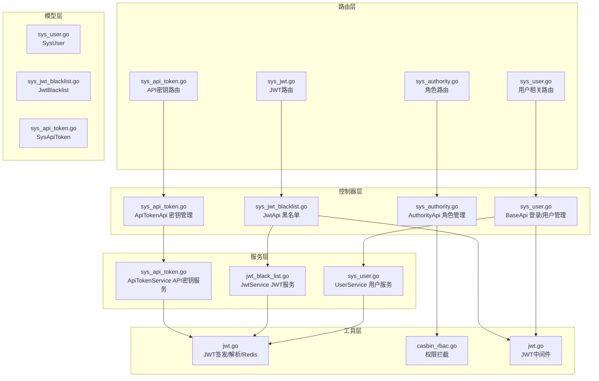
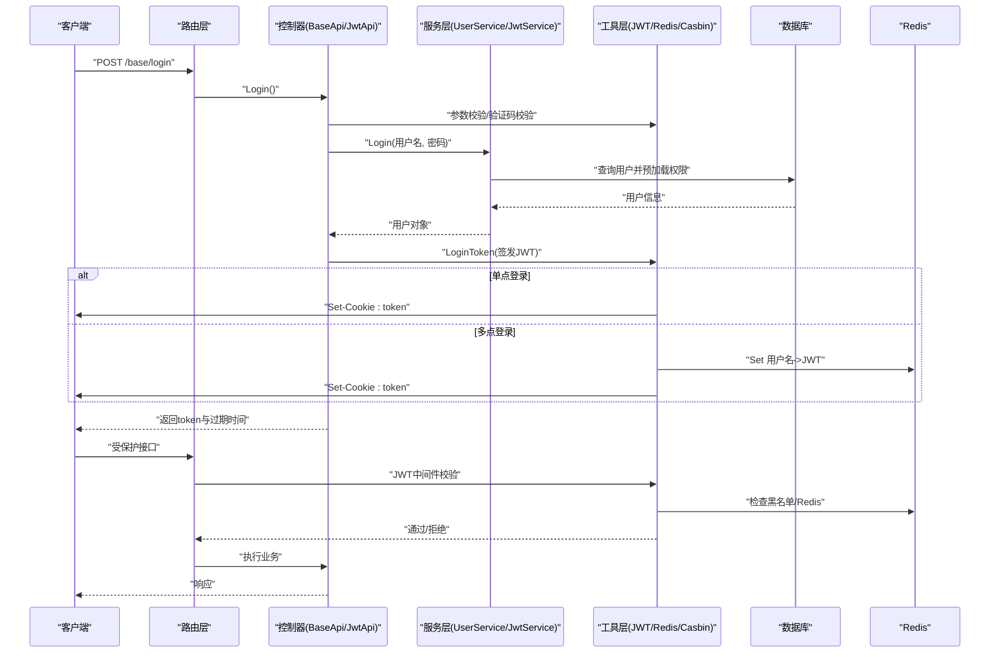
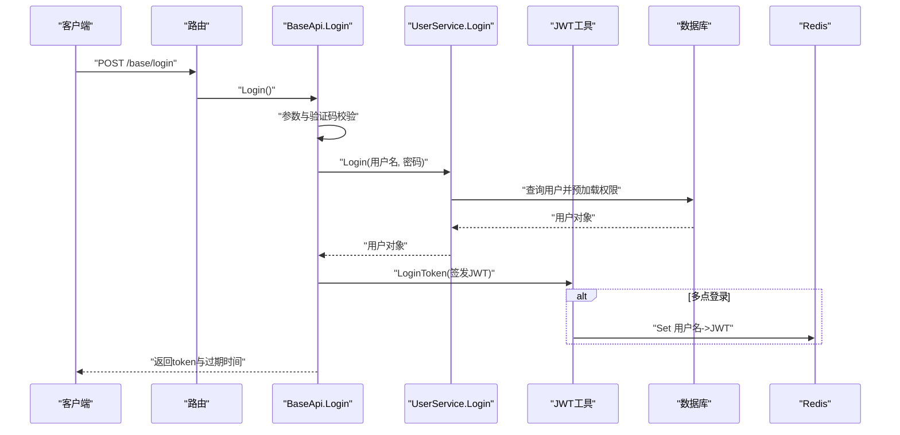
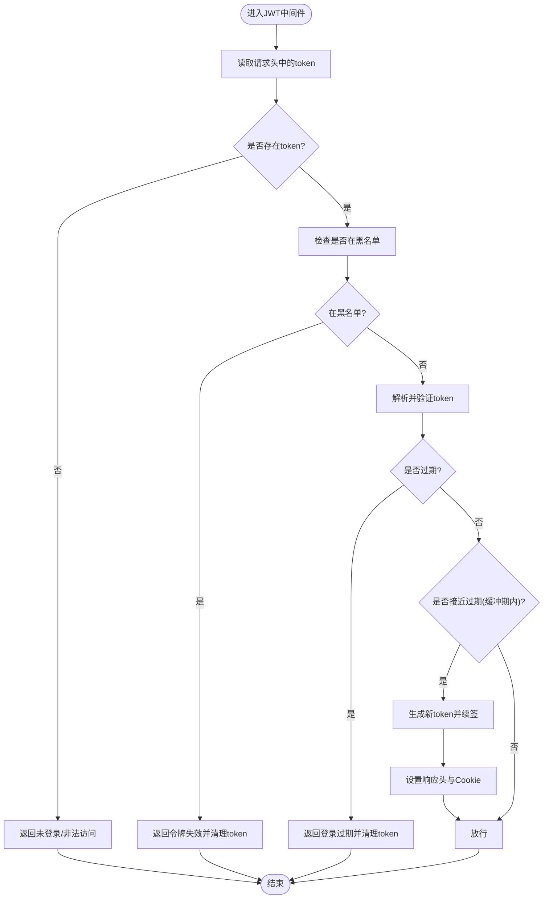
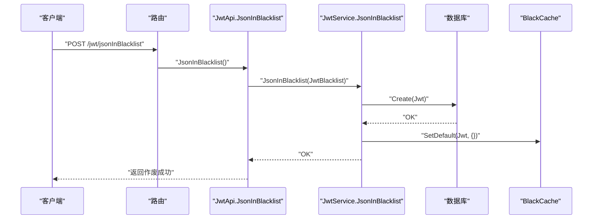
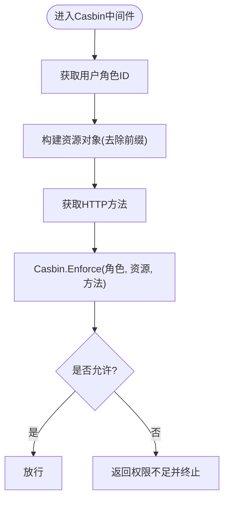
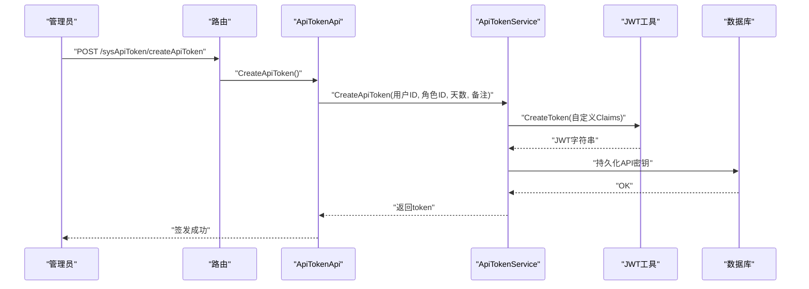
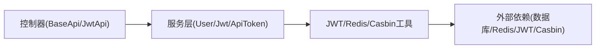

# 认证授权API

<cite>
**本文档引用的文件**
- [server/router/system/sys_user.go](file://server/router/system/sys_user.go)
- [server/api/v1/system/sys_user.go](file://server/api/v1/system/sys_user.go)
- [server/service/system/sys_user.go](file://server/service/system/sys_user.go)
- [server/model/system/sys_user.go](file://server/model/system/sys_user.go)
- [server/utils/jwt.go](file://server/utils/jwt.go)
- [server/middleware/jwt.go](file://server/middleware/jwt.go)
- [server/router/system/sys_jwt.go](file://server/router/system/sys_jwt.go)
- [server/api/v1/system/sys_jwt_blacklist.go](file://server/api/v1/system/sys_jwt_blacklist.go)
- [server/service/system/jwt_black_list.go](file://server/service/system/jwt_black_list.go)
- [server/model/system/sys_jwt_blacklist.go](file://server/model/system/sys_jwt_blacklist.go)
- [server/router/system/sys_authority.go](file://server/router/system/sys_authority.go)
- [server/api/v1/system/sys_authority.go](file://server/api/v1/system/sys_authority.go)
- [server/middleware/casbin_rbac.go](file://server/middleware/casbin_rbac.go)
- [server/router/system/sys_api_token.go](file://server/router/system/sys_api_token.go)
- [server/api/v1/system/sys_api_token.go](file://server/api/v1/system/sys_api_token.go)
</cite>

## 目录
1. [简介](#简介)
2. [项目结构](#项目结构)
3. [核心组件](#核心组件)
4. [架构总览](#架构总览)
5. [详细组件分析](#详细组件分析)
6. [依赖分析](#依赖分析)
7. [性能考虑](#性能考虑)
8. [故障排查指南](#故障排查指南)
9. [结论](#结论)

## 简介
本文件面向认证授权模块的API设计与实现，涵盖用户登录、JWT令牌管理、API密钥管理以及基于RBAC的权限控制。文档从系统架构、组件关系、数据流与处理逻辑出发，结合中间件工作原理，给出令牌验证流程、权限检查机制、错误处理与安全防护建议，并对多设备登录与会话管理进行说明。

## 项目结构
认证授权相关代码主要分布在以下层次：
- 路由层：定义REST接口路径与分组
- 控制器层：处理HTTP请求、参数校验与响应封装
- 服务层：业务逻辑（登录、用户管理、权限管理、JWT黑名单）
- 工具层：JWT签发与解析、Redis交互、Casbin集成
- 模型层：用户、JWT黑名单、API密钥等数据模型

图表来源
- [server/router/system/sys_user.go:1-29](file://server/router/system/sys_user.go#L1-L29)
- [server/api/v1/system/sys_user.go:1-517](file://server/api/v1/system/sys_user.go#L1-L517)
- [server/service/system/sys_user.go:1-337](file://server/service/system/sys_user.go#L1-L337)
- [server/utils/jwt.go:1-106](file://server/utils/jwt.go#L1-L106)
- [server/middleware/jwt.go:1-90](file://server/middleware/jwt.go#L1-L90)
- [server/router/system/sys_jwt.go:1-15](file://server/router/system/sys_jwt.go#L1-L15)
- [server/api/v1/system/sys_jwt_blacklist.go:1-34](file://server/api/v1/system/sys_jwt_blacklist.go#L1-L34)
- [server/service/system/jwt_black_list.go:1-53](file://server/service/system/jwt_black_list.go#L1-L53)
- [server/router/system/sys_authority.go:1-26](file://server/router/system/sys_authority.go#L1-L26)
- [server/api/v1/system/sys_authority.go:1-258](file://server/api/v1/system/sys_authority.go#L1-L258)
- [server/middleware/casbin_rbac.go:1-33](file://server/middleware/casbin_rbac.go#L1-L33)
- [server/router/system/sys_api_token.go:1-20](file://server/router/system/sys_api_token.go#L1-L20)
- [server/api/v1/system/sys_api_token.go:1-82](file://server/api/v1/system/sys_api_token.go#L1-L82)

章节来源
- [server/router/system/sys_user.go:1-29](file://server/router/system/sys_user.go#L1-L29)
- [server/router/system/sys_authority.go:1-26](file://server/router/system/sys_authority.go#L1-L26)
- [server/router/system/sys_jwt.go:1-15](file://server/router/system/sys_jwt.go#L1-L15)
- [server/router/system/sys_api_token.go:1-20](file://server/router/system/sys_api_token.go#L1-L20)

## 核心组件
- 用户登录与会话
  - 登录接口负责参数校验、验证码校验、用户身份验证、签发JWT并记录登录日志。
  - 支持单点或多点登录模式，多点登录时将当前JWT写入Redis并绑定用户名。
- JWT中间件
  - 从请求头读取令牌，校验黑名单、解析并验证有效期；临近过期自动续签并刷新响应头与Cookie。
- JWT黑名单
  - 将失效令牌加入数据库与内存缓存，拦截后续请求。
- RBAC权限控制
  - 基于Casbin的策略检查，按角色ID、请求路径与方法进行权限判定。
- API密钥管理
  - 为指定用户签发短期或长期API密钥，支持列表查询与作废。

章节来源
- [server/api/v1/system/sys_user.go:20-161](file://server/api/v1/system/sys_user.go#L20-L161)
- [server/middleware/jwt.go:16-78](file://server/middleware/jwt.go#L16-L78)
- [server/api/v1/system/sys_jwt_blacklist.go:14-34](file://server/api/v1/system/sys_jwt_blacklist.go#L14-L34)
- [server/middleware/casbin_rbac.go:12-32](file://server/middleware/casbin_rbac.go#L12-L32)
- [server/api/v1/system/sys_api_token.go:14-82](file://server/api/v1/system/sys_api_token.go#L14-L82)

## 架构总览
下图展示认证授权的整体调用链路与组件交互：

图表来源
- [server/api/v1/system/sys_user.go:20-161](file://server/api/v1/system/sys_user.go#L20-L161)
- [server/middleware/jwt.go:16-78](file://server/middleware/jwt.go#L16-L78)
- [server/utils/jwt.go:48-106](file://server/utils/jwt.go#L48-L106)
- [server/service/system/sys_user.go:47-61](file://server/service/system/sys_user.go#L47-L61)

## 详细组件分析

### 用户登录与会话管理
- 接口定义
  - 登录：接收用户名、密码、验证码，校验后签发JWT并返回用户信息与过期时间。
  - 多点登录：若启用UseMultipoint，则将当前JWT写入Redis，键为用户名，值为JWT字符串。
- 关键流程
  - 参数与验证码校验
  - 查询用户并验证密码
  - 登录成功后签发JWT并记录登录日志
  - 根据配置决定是否写入Redis
- 安全要点
  - 密码采用哈希校验
  - 登录失败记录日志便于审计
  - 支持验证码防暴力破解

图表来源
- [server/api/v1/system/sys_user.go:20-161](file://server/api/v1/system/sys_user.go#L20-L161)
- [server/service/system/sys_user.go:47-61](file://server/service/system/sys_user.go#L47-L61)
- [server/utils/jwt.go:48-52](file://server/utils/jwt.go#L48-L52)

章节来源
- [server/api/v1/system/sys_user.go:20-161](file://server/api/v1/system/sys_user.go#L20-L161)
- [server/service/system/sys_user.go:47-61](file://server/service/system/sys_user.go#L47-L61)
- [server/utils/jwt.go:48-52](file://server/utils/jwt.go#L48-L52)

### JWT中间件与令牌续签
- 功能概述
  - 从请求头提取令牌，检查黑名单，解析并验证有效期
  - 若处于缓冲期内，自动续签并刷新响应头与Cookie
  - 支持多点登录场景下的Redis活跃令牌记录
- 错误处理
  - 未登录/非法访问、令牌过期、签名无效等均返回相应提示并清理令牌

图表来源
- [server/middleware/jwt.go:16-78](file://server/middleware/jwt.go#L16-L78)
- [server/utils/jwt.go:62-88](file://server/utils/jwt.go#L62-L88)

章节来源
- [server/middleware/jwt.go:16-78](file://server/middleware/jwt.go#L16-L78)
- [server/utils/jwt.go:62-88](file://server/utils/jwt.go#L62-L88)

### JWT黑名单与作废
- 接口
  - 将当前token加入黑名单，同时写入内存缓存，拦截后续请求
- 数据模型
  - JwtBlacklist包含唯一标识与JWT字符串字段
- 服务
  - 写入数据库后同步到BlackCache
  - 启动时可加载历史黑名单至内存

图表来源
- [server/api/v1/system/sys_jwt_blacklist.go:14-34](file://server/api/v1/system/sys_jwt_blacklist.go#L14-L34)
- [server/service/system/jwt_black_list.go:22-29](file://server/service/system/jwt_black_list.go#L22-L29)
- [server/model/system/sys_jwt_blacklist.go:7-10](file://server/model/system/sys_jwt_blacklist.go#L7-L10)

章节来源
- [server/api/v1/system/sys_jwt_blacklist.go:14-34](file://server/api/v1/system/sys_jwt_blacklist.go#L14-L34)
- [server/service/system/jwt_black_list.go:22-29](file://server/service/system/jwt_black_list.go#L22-L29)
- [server/model/system/sys_jwt_blacklist.go:7-10](file://server/model/system/sys_jwt_blacklist.go#L7-L10)

### RBAC权限控制
- 中间件
  - 从请求上下文获取用户角色ID
  - 去除路由前缀后得到资源标识，结合请求方法进行策略匹配
- 策略来源
  - 通过Casbin Enforce进行权限判断，未通过则返回权限不足

图表来源
- [server/middleware/casbin_rbac.go:12-32](file://server/middleware/casbin_rbac.go#L12-L32)

章节来源
- [server/middleware/casbin_rbac.go:12-32](file://server/middleware/casbin_rbac.go#L12-L32)

### API密钥管理
- 接口
  - 签发：为指定用户与角色签发短期或长期API密钥
  - 列表：分页查询API密钥
  - 作废：根据ID作废指定密钥
- 生命周期
  - 支持“永久(-1)”与“N天”两种有效期
  - 作废后立即失效，配合JWT黑名单机制

图表来源
- [server/router/system/sys_api_token.go:11-19](file://server/router/system/sys_api_token.go#L11-L19)
- [server/api/v1/system/sys_api_token.go:14-42](file://server/api/v1/system/sys_api_token.go#L14-L42)

章节来源
- [server/router/system/sys_api_token.go:11-19](file://server/router/system/sys_api_token.go#L11-L19)
- [server/api/v1/system/sys_api_token.go:14-42](file://server/api/v1/system/sys_api_token.go#L14-L42)

### 角色与权限管理
- 接口
  - 创建/更新/删除角色、复制角色、设置数据权限、设置角色用户
  - 获取角色列表与拥有某角色的用户ID列表
- 安全与一致性
  - 创建角色后刷新Casbin策略，确保权限规则即时生效

章节来源
- [server/router/system/sys_authority.go:10-25](file://server/router/system/sys_authority.go#L10-L25)
- [server/api/v1/system/sys_authority.go:17-258](file://server/api/v1/system/sys_authority.go#L17-L258)

## 依赖分析
- 组件耦合
  - 控制器依赖服务层，服务层依赖工具层与数据库
  - JWT中间件与Casbin中间件分别独立运行，前者负责令牌校验，后者负责权限校验
- 外部依赖
  - JWT库用于签发与解析
  - Redis用于多点登录场景下的活跃令牌存储
  - Casbin用于RBAC策略匹配

图表来源
- [server/api/v1/system/sys_user.go:1-517](file://server/api/v1/system/sys_user.go#L1-L517)
- [server/api/v1/system/sys_jwt_blacklist.go:1-34](file://server/api/v1/system/sys_jwt_blacklist.go#L1-L34)
- [server/api/v1/system/sys_api_token.go:1-82](file://server/api/v1/system/sys_api_token.go#L1-L82)
- [server/utils/jwt.go:1-106](file://server/utils/jwt.go#L1-L106)
- [server/middleware/jwt.go:1-90](file://server/middleware/jwt.go#L1-L90)
- [server/middleware/casbin_rbac.go:1-33](file://server/middleware/casbin_rbac.go#L1-L33)

章节来源
- [server/api/v1/system/sys_user.go:1-517](file://server/api/v1/system/sys_user.go#L1-L517)
- [server/api/v1/system/sys_jwt_blacklist.go:1-34](file://server/api/v1/system/sys_jwt_blacklist.go#L1-L34)
- [server/api/v1/system/sys_api_token.go:1-82](file://server/api/v1/system/sys_api_token.go#L1-L82)
- [server/utils/jwt.go:1-106](file://server/utils/jwt.go#L1-L106)
- [server/middleware/jwt.go:1-90](file://server/middleware/jwt.go#L1-L90)
- [server/middleware/casbin_rbac.go:1-33](file://server/middleware/casbin_rbac.go#L1-L33)

## 性能考虑
- 并发安全
  - JWT续签使用并发控制避免并发刷新导致的重复签发
- 缓存策略
  - 黑名单加载至内存缓存，减少数据库查询
  - 多点登录场景下Redis存储当前活跃JWT，降低数据库压力
- 优化建议
  - 对频繁访问的用户信息与权限进行缓存
  - 合理设置缓冲时间与过期时间，平衡安全性与用户体验

## 故障排查指南
- 常见错误与定位
  - 未登录/非法访问：检查请求头是否携带token，确认中间件是否正确挂载
  - 登录已过期：确认客户端是否及时续签，检查服务器时间与JWT过期配置
  - 权限不足：核对角色ID与资源路径/方法是否匹配，必要时刷新Casbin策略
  - 令牌失效/异地登录：确认是否被加入黑名单，检查Redis中是否仍保留旧JWT
- 日志与审计
  - 登录失败与权限拒绝均有日志记录，可用于追踪与分析

章节来源
- [server/middleware/jwt.go:16-78](file://server/middleware/jwt.go#L16-L78)
- [server/middleware/casbin_rbac.go:12-32](file://server/middleware/casbin_rbac.go#L12-L32)
- [server/api/v1/system/sys_user.go:55-96](file://server/api/v1/system/sys_user.go#L55-L96)

## 结论
本认证授权模块通过清晰的分层设计与中间件机制，实现了从登录到权限控制的完整闭环。JWT中间件保障了令牌的安全性与可用性，Casbin提供了灵活的RBAC策略控制，API密钥管理满足了短期与长期访问需求。结合黑名单与Redis多点登录支持，系统在保证安全的同时兼顾了性能与可维护性。