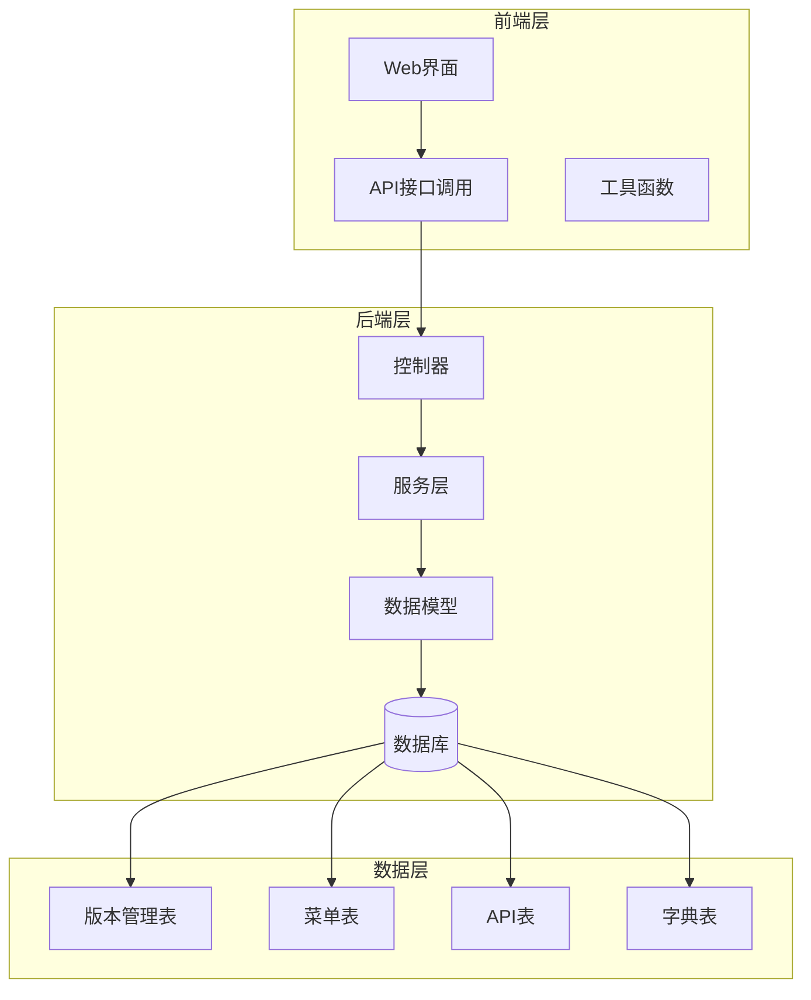
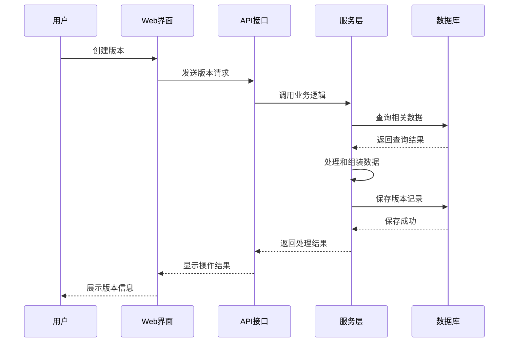
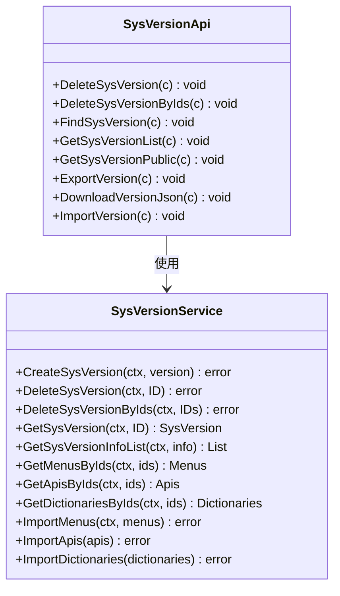
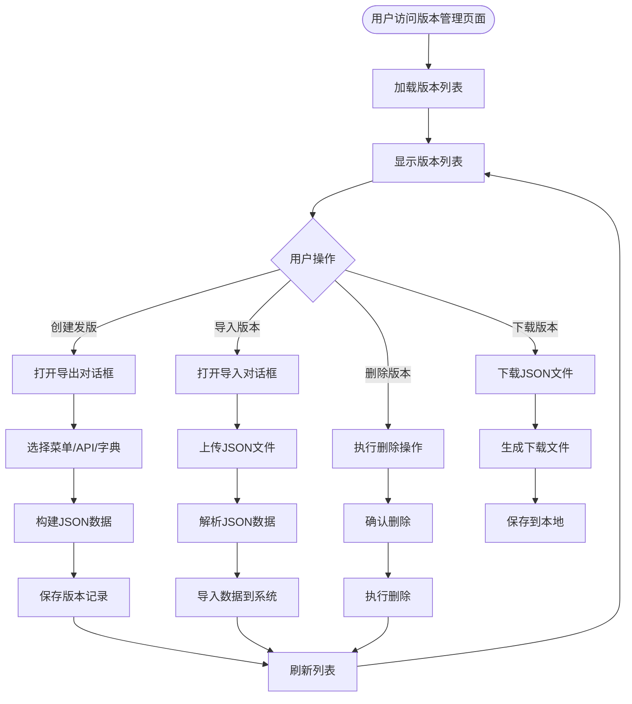
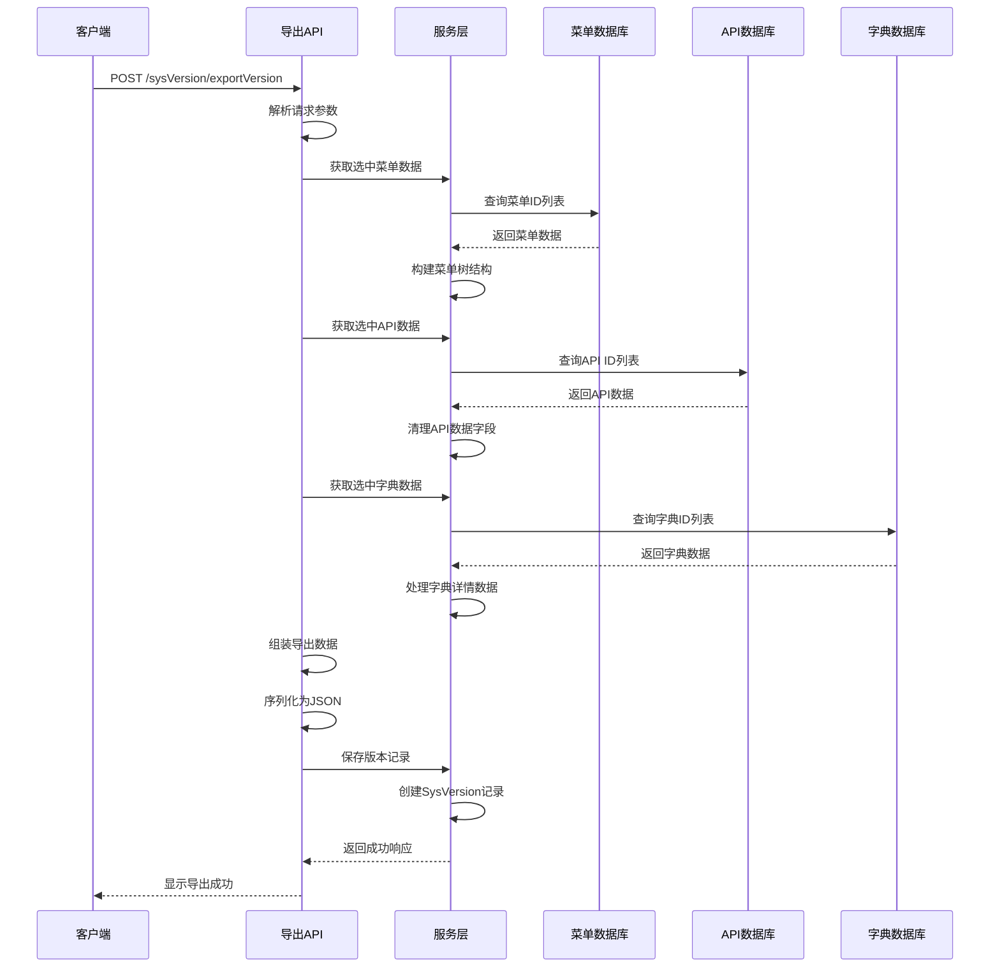
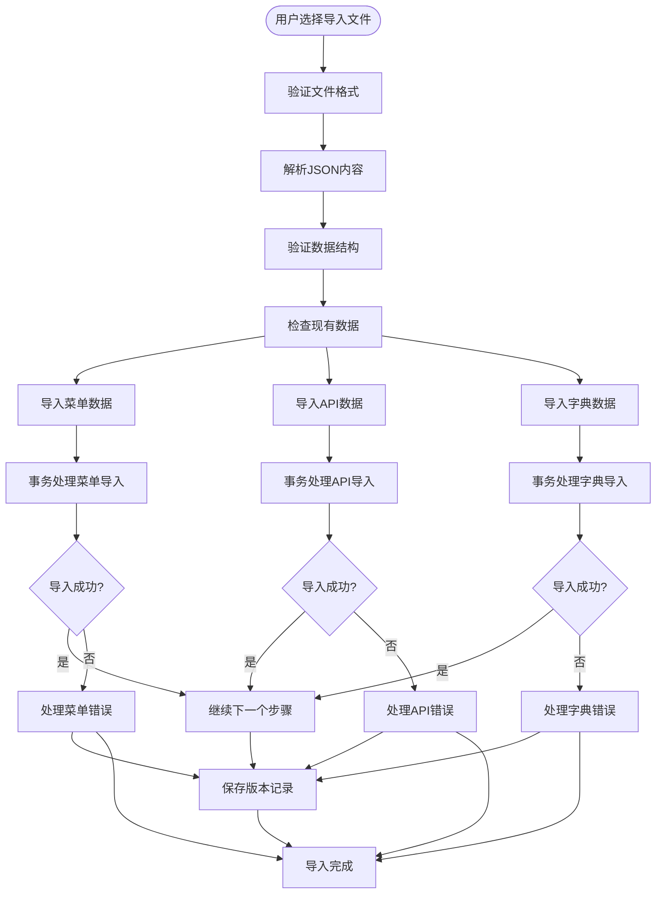
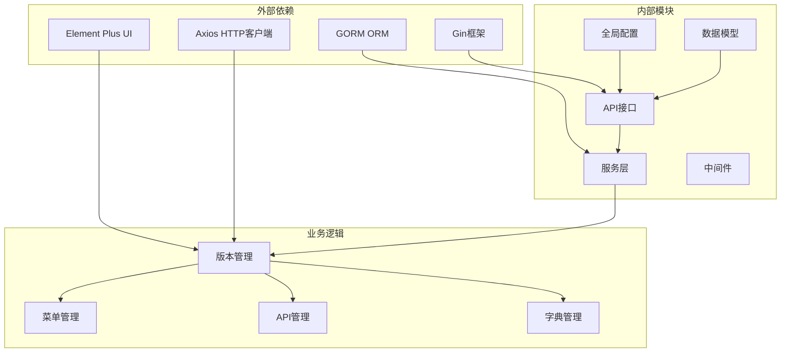

# 版本更新

<cite>
**本文档引用的文件**
- [version.go](file://server/global/version.go)
- [sys_version.go](file://server/model/system/sys_version.go)
- [sys_version.go](file://server/api/v1/system/sys_version.go)
- [sys_version.go](file://server/service/system/sys_version.go)
- [version.js](file://web/src/api/version.js)
- [sys_version.go](file://server/model/system/request/sys_version.go)
- [sys_version.go](file://server/model/system/response/sys_version.go)
- [version.vue](file://web/src/view/systemTools/version/version.vue)
</cite>

## 目录
1. [简介](#简介)
2. [项目结构](#项目结构)
3. [核心组件](#核心组件)
4. [架构概览](#架构概览)
5. [详细组件分析](#详细组件分析)
6. [依赖关系分析](#依赖关系分析)
7. [性能考虑](#性能考虑)
8. [故障排除指南](#故障排除指南)
9. [结论](#结论)

## 简介

版本更新功能是测试管理平台中的一个重要模块，它允许用户创建、管理和导入导出系统版本。该功能通过JSON格式的数据包来封装和传输系统的配置信息，包括菜单、API接口和字典等关键组件。

当前系统版本为v2.9.1，应用名称为Gin-Vue-Admin，这是一个基于Go和Vue.js的全栈开发基础平台。版本更新功能提供了完整的版本生命周期管理，从版本创建到导入导出的全流程支持。

## 项目结构

版本更新功能采用前后端分离的架构设计，主要由以下层次组成：

**图表来源**
- [version.go:1-13](file://server/global/version.go#L1-L13)
- [sys_version.go:1-21](file://server/model/system/sys_version.go#L1-L21)

**章节来源**
- [version.go:1-13](file://server/global/version.go#L1-L13)
- [sys_version.go:1-21](file://server/model/system/sys_version.go#L1-L21)

## 核心组件

版本更新功能的核心组件包括：

### 1. 版本信息常量
系统在全局配置中定义了版本信息常量，包括当前版本号、应用名称和描述信息。

### 2. 数据模型
版本管理使用SysVersion结构体来存储版本信息，包含版本名称、版本号、描述和版本数据等字段。

### 3. API接口
提供完整的RESTful API接口，支持版本的创建、查询、删除和导入导出功能。

### 4. 前端界面
提供直观的Web界面，支持版本数据的选择、预览和管理功能。

**章节来源**
- [version.go:6-12](file://server/global/version.go#L6-L12)
- [sys_version.go:9-20](file://server/model/system/sys_version.go#L9-L20)

## 架构概览

版本更新功能采用经典的三层架构模式：

**图表来源**
- [sys_version.go:238-361](file://server/api/v1/system/sys_version.go#L238-L361)
- [sys_version.go:13-18](file://server/service/system/sys_version.go#L13-L18)

## 详细组件分析

### 后端架构分析

#### 控制器层
控制器负责处理HTTP请求和响应，实现了完整的CRUD操作：

**图表来源**
- [sys_version.go:21-487](file://server/api/v1/system/sys_version.go#L21-L487)
- [sys_version.go:11-231](file://server/service/system/sys_version.go#L11-L231)

#### 数据模型层
版本管理使用结构化的数据模型来存储相关信息：

| 字段名 | 类型 | 描述 | 约束 |
|--------|------|------|------|
| ID | uint | 主键标识 | 自增 |
| VersionName | string | 版本名称 | 必填，长度255 |
| VersionCode | string | 版本号 | 必填，长度100 |
| Description | string | 版本描述 | 长度500 |
| VersionData | text | 版本数据JSON | 可空 |

**章节来源**
- [sys_version.go:9-20](file://server/model/system/sys_version.go#L9-L20)

### 前端界面分析

#### 版本管理界面
前端提供了完整的版本管理界面，包含以下功能特性：

**图表来源**
- [version.vue:687-748](file://web/src/view/systemTools/version/version.vue#L687-L748)
- [version.vue:750-915](file://web/src/view/systemTools/version/version.vue#L750-L915)

**章节来源**
- [version.vue:1-999](file://web/src/view/systemTools/version/version.vue#L1-L999)

### API接口流程

#### 导出版本流程
导出版本功能实现了复杂的数据处理逻辑：

**图表来源**
- [sys_version.go:238-361](file://server/api/v1/system/sys_version.go#L238-L361)
- [sys_version.go:77-93](file://server/service/system/sys_version.go#L77-L93)

**章节来源**
- [sys_version.go:238-361](file://server/api/v1/system/sys_version.go#L238-L361)
- [sys_version.go:77-93](file://server/service/system/sys_version.go#L77-L93)

### 数据导入流程

#### 导入版本流程
导入版本功能提供了完整的数据恢复能力：

**图表来源**
- [sys_version.go:417-486](file://server/api/v1/system/sys_version.go#L417-L486)
- [sys_version.go:95-230](file://server/service/system/sys_version.go#L95-L230)

**章节来源**
- [sys_version.go:417-486](file://server/api/v1/system/sys_version.go#L417-L486)
- [sys_version.go:95-230](file://server/service/system/sys_version.go#L95-L230)

## 依赖关系分析

版本更新功能的依赖关系相对清晰，遵循了良好的分层架构原则：

**图表来源**
- [sys_version.go:3-19](file://server/api/v1/system/sys_version.go#L3-L19)
- [sys_version.go:3-9](file://server/service/system/sys_version.go#L3-L9)

**章节来源**
- [sys_version.go:3-19](file://server/api/v1/system/sys_version.go#L3-L19)
- [sys_version.go:3-9](file://server/service/system/sys_version.go#L3-L9)

## 性能考虑

### 数据库性能优化
- 使用预加载机制减少N+1查询问题
- 事务处理确保数据一致性
- 合理的索引设计提升查询性能

### 前端性能优化
- 懒加载机制减少初始加载时间
- 虚拟滚动处理大量数据展示
- 缓存策略优化重复操作

### 网络性能优化
- JSON数据压缩传输
- 分页加载避免大数据量请求
- 并发请求优化用户体验

## 故障排除指南

### 常见问题及解决方案

#### 1. 版本导出失败
**问题症状**: 导出版本时出现错误提示
**可能原因**:
- 选中的数据量过大导致内存不足
- 数据库连接超时
- JSON序列化失败

**解决方法**:
- 减少选中的数据量
- 检查数据库连接状态
- 验证数据完整性

#### 2. 版本导入失败
**问题症状**: 导入JSON文件时报错
**可能原因**:
- JSON格式不正确
- 数据结构不符合要求
- 数据库约束冲突

**解决方法**:
- 使用在线JSON验证工具检查格式
- 对照示例JSON文件核对结构
- 检查数据库是否存在重复数据

#### 3. 前端界面卡顿
**问题症状**: 页面加载缓慢或操作响应迟缓
**可能原因**:
- 数据量过大
- 网络延迟
- 浏览器兼容性问题

**解决方法**:
- 使用分页功能
- 检查网络连接
- 更新浏览器版本

**章节来源**
- [version.vue:742-747](file://web/src/view/systemTools/version/version.vue#L742-L747)
- [sys_version.go:338-343](file://server/api/v1/system/sys_version.go#L338-L343)

## 结论

版本更新功能作为测试管理平台的重要组成部分，提供了完整且实用的版本管理解决方案。该功能具有以下特点：

### 技术优势
- **架构清晰**: 采用分层架构设计，职责明确
- **功能完整**: 支持版本的全生命周期管理
- **数据安全**: 通过事务处理确保数据一致性
- **用户体验**: 提供直观易用的Web界面

### 扩展性考虑
- 模块化设计便于功能扩展
- 标准化的API接口支持第三方集成
- 灵活的数据格式支持未来升级

### 改进建议
- 增加版本差异对比功能
- 优化大文件处理性能
- 添加版本回滚机制
- 完善权限控制体系

当前版本v2.9.1为系统提供了稳定的基础功能，版本更新功能的实现体现了良好的软件工程实践，为后续的功能扩展和维护奠定了坚实的基础。