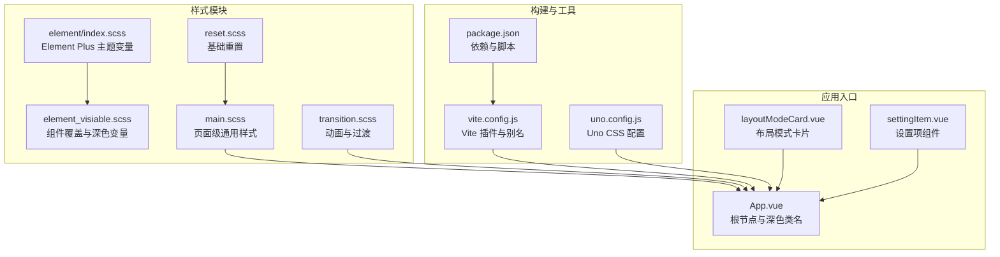
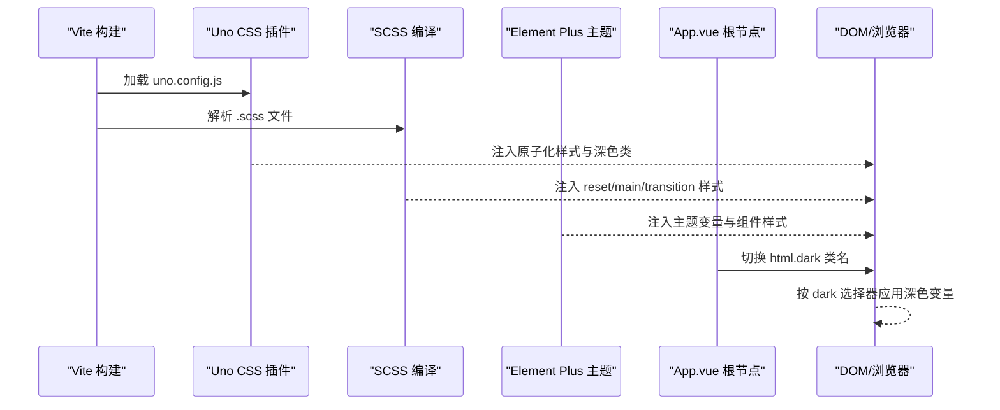
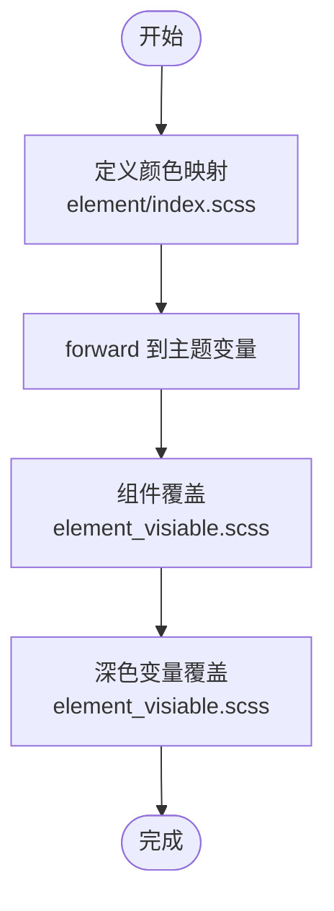
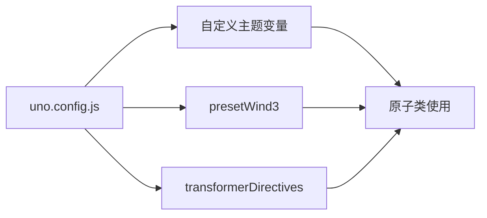
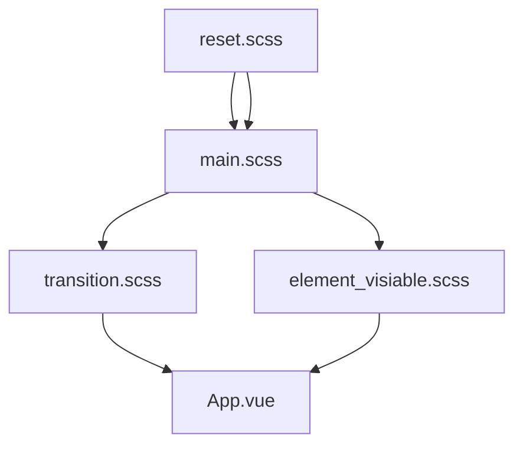
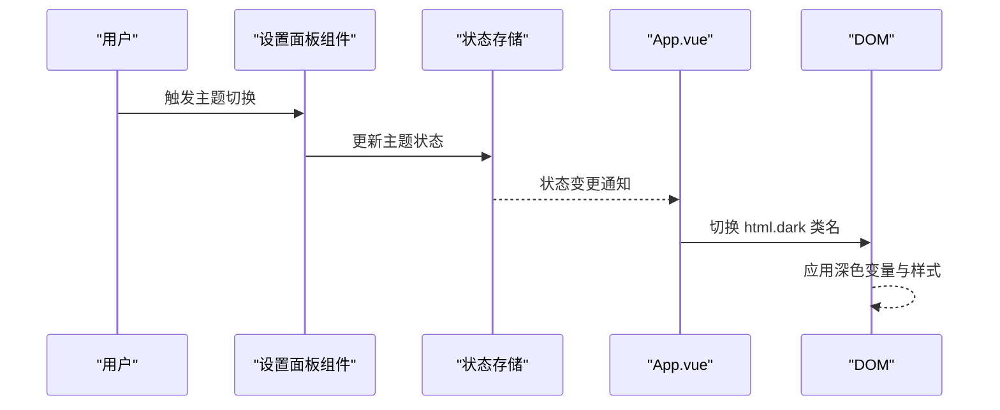
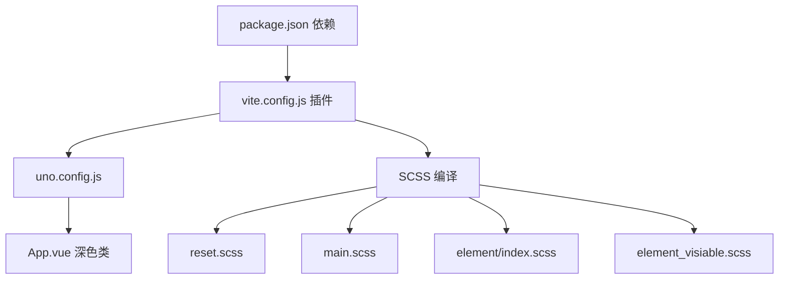

# UI主题定制

<cite>
**本文引用的文件**
- [web/src/style/element/index.scss](file://web/src/style/element/index.scss)
- [web/src/style/element_visiable.scss](file://web/src/style/element_visiable.scss)
- [web/src/style/main.scss](file://web/src/style/main.scss)
- [web/src/style/reset.scss](file://web/src/style/reset.scss)
- [web/src/style/transition.scss](file://web/src/style/transition.scss)
- [web/uno.config.js](file://web/uno.config.js)
- [web/vite.config.js](file://web/vite.config.js)
- [web/package.json](file://web/package.json)
- [web/src/App.vue](file://web/src/App.vue)
- [web/src/view/layout/setting/components/layoutModeCard.vue](file://web/src/view/layout/setting/components/layoutModeCard.vue)
- [web/src/view/layout/setting/components/settingItem.vue](file://web/src/view/layout/setting/components/settingItem.vue)
</cite>

## 目录
1. [简介](#简介)
2. [项目结构](#项目结构)
3. [核心组件](#核心组件)
4. [架构总览](#架构总览)
5. [详细组件分析](#详细组件分析)
6. [依赖分析](#依赖分析)
7. [性能考虑](#性能考虑)
8. [故障排查指南](#故障排查指南)
9. [结论](#结论)
10. [附录](#附录)

## 简介
本文件面向测试管理平台的前端UI主题定制，系统性阐述以下内容：
- Element Plus 主题定制与 SCSS 样式体系
- 全局样式组织与模块化管理
- Uno CSS 原子化工具的集成与使用
- 深色主题的实现与切换机制
- 响应式设计与断点管理
- 样式覆盖与组件样式定制方法
- 主题变量配置与颜色系统说明
- 样式调试工具与浏览器兼容性处理

## 项目结构
前端样式采用“模块化 + 工程化”组织方式：
- 全局重置与基础样式：reset.scss
- 元素级样式与覆盖：element/index.scss（主题变量）、element_visiable.scss（组件覆盖）
- 页面级通用样式：main.scss（容器、表格、按钮等）
- 动画与过渡：transition.scss
- Uno CSS 配置：uno.config.js
- 构建与插件：vite.config.js、package.json
- 应用根节点与深色类名挂载：App.vue
- 设置面板与主题切换交互：layoutModeCard.vue、settingItem.vue

**图表来源**
- [web/src/style/reset.scss:1-382](file://web/src/style/reset.scss#L1-L382)
- [web/src/style/element/index.scss:1-25](file://web/src/style/element/index.scss#L1-L25)
- [web/src/style/element_visiable.scss:1-139](file://web/src/style/element_visiable.scss#L1-L139)
- [web/src/style/main.scss:1-60](file://web/src/style/main.scss#L1-L60)
- [web/src/style/transition.scss:1-69](file://web/src/style/transition.scss#L1-L69)
- [web/vite.config.js:1-119](file://web/vite.config.js#L1-L119)
- [web/uno.config.js:1-27](file://web/uno.config.js#L1-L27)
- [web/package.json:1-88](file://web/package.json#L1-L88)
- [web/src/App.vue:1-47](file://web/src/App.vue#L1-L47)
- [web/src/view/layout/setting/components/layoutModeCard.vue](file://web/src/view/layout/setting/components/layoutModeCard.vue)
- [web/src/view/layout/setting/components/settingItem.vue](file://web/src/view/layout/setting/components/settingItem.vue)

**章节来源**
- [web/src/style/reset.scss:1-382](file://web/src/style/reset.scss#L1-L382)
- [web/src/style/element/index.scss:1-25](file://web/src/style/element/index.scss#L1-L25)
- [web/src/style/element_visiable.scss:1-139](file://web/src/style/element_visiable.scss#L1-L139)
- [web/src/style/main.scss:1-60](file://web/src/style/main.scss#L1-L60)
- [web/src/style/transition.scss:1-69](file://web/src/style/transition.scss#L1-L69)
- [web/uno.config.js:1-27](file://web/uno.config.js#L1-L27)
- [web/vite.config.js:1-119](file://web/vite.config.js#L1-L119)
- [web/package.json:1-88](file://web/package.json#L1-L88)
- [web/src/App.vue:1-47](file://web/src/App.vue#L1-L47)

## 核心组件
- Element Plus 主题变量定制：通过 forward 覆盖内置颜色映射，统一主色与语义色。
- 组件级覆盖：针对分页、表格、菜单、抽屉等组件进行尺寸、间距、边框、深色变量覆盖。
- Uno CSS 集成：启用 wind3 预设与指令转换器，支持原子化类与深色模式类名策略。
- 全局样式模块：reset 提供跨浏览器一致性；main 提供容器、表格、按钮等通用样式；transition 提供路由动画。
- 应用根节点：在根节点上挂载深色类名，配合 Uno CSS 的 dark: 'class' 实现深色切换。

**章节来源**
- [web/src/style/element/index.scss:1-25](file://web/src/style/element/index.scss#L1-L25)
- [web/src/style/element_visiable.scss:1-139](file://web/src/style/element_visiable.scss#L1-L139)
- [web/src/style/main.scss:1-60](file://web/src/style/main.scss#L1-L60)
- [web/src/style/transition.scss:1-69](file://web/src/style/transition.scss#L1-L69)
- [web/uno.config.js:1-27](file://web/uno.config.js#L1-L27)
- [web/src/App.vue:1-47](file://web/src/App.vue#L1-L47)

## 架构总览
下图展示样式系统从配置到运行时的端到端流程：

**图表来源**
- [web/vite.config.js:1-119](file://web/vite.config.js#L1-L119)
- [web/uno.config.js:1-27](file://web/uno.config.js#L1-L27)
- [web/src/style/reset.scss:1-382](file://web/src/style/reset.scss#L1-L382)
- [web/src/style/main.scss:1-60](file://web/src/style/main.scss#L1-L60)
- [web/src/style/element/index.scss:1-25](file://web/src/style/element/index.scss#L1-L25)
- [web/src/style/element_visiable.scss:1-139](file://web/src/style/element_visiable.scss#L1-L139)
- [web/src/App.vue:1-47](file://web/src/App.vue#L1-L47)

## 详细组件分析

### Element Plus 主题定制与颜色系统
- 变量覆盖：通过 forward 方式重映射内置颜色，集中定义主色与语义色，便于统一品牌风格。
- 组件覆盖：在 element_visiable.scss 中对分页、表格、菜单、抽屉等组件进行尺寸、边框、深色变量覆盖，确保视觉一致。
- 深色变量：在深色模式下覆盖 Element Plus 内部背景与填充变量，保证暗色环境下可读性与层次感。

**图表来源**
- [web/src/style/element/index.scss:1-25](file://web/src/style/element/index.scss#L1-L25)
- [web/src/style/element_visiable.scss:1-139](file://web/src/style/element_visiable.scss#L1-L139)

**章节来源**
- [web/src/style/element/index.scss:1-25](file://web/src/style/element/index.scss#L1-L25)
- [web/src/style/element_visiable.scss:1-139](file://web/src/style/element_visiable.scss#L1-L139)

### Uno CSS 原子化工具集成与使用
- 配置策略：启用 wind3 预设与指令转换器，dark 策略为 class，与 App.vue 的 html.dark 协同工作。
- 主题扩展：在 uno.config.js 中自定义背景、文本、阴影、边框等主题变量，使其可被原子类引用。
- 使用建议：优先使用原子类提升开发效率；复杂样式或跨组件复用场景可结合 SCSS 模块化维护。

**图表来源**
- [web/uno.config.js:1-27](file://web/uno.config.js#L1-L27)

**章节来源**
- [web/uno.config.js:1-27](file://web/uno.config.js#L1-L27)

### 全局样式组织与模块化管理
- reset.scss：统一重置元素内外边距、字体、占位符、替换元素等，确保跨浏览器一致性。
- main.scss：提供容器、表格、表单、按钮列表等通用样式，结合 Uno CSS 达成“最小必要样式”。
- transition.scss：提供路由切换动画，增强用户体验。
- 模块化原则：按功能域拆分 SCSS 文件，避免全局污染；通过 @use/@forward 控制作用域与继承。

**图表来源**
- [web/src/style/reset.scss:1-382](file://web/src/style/reset.scss#L1-L382)
- [web/src/style/main.scss:1-60](file://web/src/style/main.scss#L1-L60)
- [web/src/style/transition.scss:1-69](file://web/src/style/transition.scss#L1-L69)
- [web/src/style/element_visiable.scss:1-139](file://web/src/style/element_visiable.scss#L1-L139)
- [web/src/App.vue:1-47](file://web/src/App.vue#L1-L47)

**章节来源**
- [web/src/style/reset.scss:1-382](file://web/src/style/reset.scss#L1-L382)
- [web/src/style/main.scss:1-60](file://web/src/style/main.scss#L1-L60)
- [web/src/style/transition.scss:1-69](file://web/src/style/transition.scss#L1-L69)
- [web/src/style/element_visiable.scss:1-139](file://web/src/style/element_visiable.scss#L1-L139)

### 深色主题实现与切换机制
- 运行时切换：App.vue 在根节点上挂载 dark 类名，Uno CSS 的 dark: 'class' 使原子类按需切换。
- 组件深色覆盖：element_visiable.scss 中对表格、菜单等组件在 html.dark 下覆盖内部变量，确保深色一致性。
- 设置面板：layoutModeCard.vue 与 settingItem.vue 提供布局模式与主题设置交互，驱动状态变更。

**图表来源**
- [web/src/App.vue:1-47](file://web/src/App.vue#L1-L47)
- [web/src/view/layout/setting/components/layoutModeCard.vue](file://web/src/view/layout/setting/components/layoutModeCard.vue)
- [web/src/view/layout/setting/components/settingItem.vue](file://web/src/view/layout/setting/components/settingItem.vue)

**章节来源**
- [web/src/App.vue:1-47](file://web/src/App.vue#L1-L47)
- [web/src/style/element_visiable.scss:1-139](file://web/src/style/element_visiable.scss#L1-L139)
- [web/src/view/layout/setting/components/layoutModeCard.vue](file://web/src/view/layout/setting/components/layoutModeCard.vue)
- [web/src/view/layout/setting/components/settingItem.vue](file://web/src/view/layout/setting/components/settingItem.vue)

### 响应式设计与断点管理
- Uno CSS 预设：presetWind3 提供常用断点与响应式工具类，满足移动端与桌面端适配。
- SCSS 辅助：main.scss 中使用原子类与内联样式组合，减少媒体查询耦合度。
- 建议：优先使用原子类进行响应式布局；仅在复杂场景引入少量 SCSS 断点。

**章节来源**
- [web/uno.config.js:1-27](file://web/uno.config.js#L1-L27)
- [web/src/style/main.scss:1-60](file://web/src/style/main.scss#L1-L60)

### 样式覆盖与组件样式定制
- Element Plus 组件：通过 element_visiable.scss 对分页、表格、菜单、抽屉等进行尺寸、边框、颜色覆盖。
- 优先级控制：使用 !important 仅在必要时，优先通过层级与选择器权重控制；避免全局污染。
- 变量驱动：统一使用 CSS 变量与 Element Plus 主题变量，便于主题切换与维护。

**章节来源**
- [web/src/style/element_visiable.scss:1-139](file://web/src/style/element_visiable.scss#L1-L139)
- [web/src/style/element/index.scss:1-25](file://web/src/style/element/index.scss#L1-L25)

### 主题变量配置与颜色系统说明
- Element Plus 颜色映射：通过 forward 重映射白、黑、主色、成功、警告、危险、错误、信息等。
- Uno CSS 主题变量：在 uno.config.js 中扩展背景、文本、阴影、边框等变量，与 Element Plus 变量联动。
- 深色变量：在 html.dark 下覆盖 Element Plus 内部变量，确保暗色模式下的对比度与可读性。

**章节来源**
- [web/src/style/element/index.scss:1-25](file://web/src/style/element/index.scss#L1-L25)
- [web/uno.config.js:1-27](file://web/uno.config.js#L1-L27)
- [web/src/style/element_visiable.scss:1-139](file://web/src/style/element_visiable.scss#L1-L139)

### 样式调试工具与浏览器兼容性处理
- 开发工具：Vite 插件链中包含 Vue DevTools、多 DOM 校验等，辅助定位样式问题。
- 兼容性：通过 @vitejs/plugin-legacy 配置目标浏览器，确保旧版浏览器可用。
- 原子类调试：Uno CSS 支持指令转换器，可在模板中直接使用原生 CSS 指令进行局部调试。

**章节来源**
- [web/vite.config.js:1-119](file://web/vite.config.js#L1-L119)
- [web/package.json:1-88](file://web/package.json#L1-L88)
- [web/uno.config.js:1-27](file://web/uno.config.js#L1-L27)

## 依赖分析
- 构建链路：Vite 作为构建核心，加载 Uno CSS、Vue、Legacy 等插件；SCSS 现代编译器提升性能。
- 样式链路：reset → main → element 变量 → 组件覆盖 → Uno CSS 原子类；深色模式由 App.vue 驱动。
- 依赖关系：Element Plus 与 Uno CSS 为样式系统两大支柱；Vite 插件链保障兼容性与开发体验。

**图表来源**
- [web/package.json:1-88](file://web/package.json#L1-L88)
- [web/vite.config.js:1-119](file://web/vite.config.js#L1-L119)
- [web/uno.config.js:1-27](file://web/uno.config.js#L1-L27)
- [web/src/style/reset.scss:1-382](file://web/src/style/reset.scss#L1-L382)
- [web/src/style/main.scss:1-60](file://web/src/style/main.scss#L1-L60)
- [web/src/style/element/index.scss:1-25](file://web/src/style/element/index.scss#L1-L25)
- [web/src/style/element_visiable.scss:1-139](file://web/src/style/element_visiable.scss#L1-L139)
- [web/src/App.vue:1-47](file://web/src/App.vue#L1-L47)

**章节来源**
- [web/package.json:1-88](file://web/package.json#L1-L88)
- [web/vite.config.js:1-119](file://web/vite.config.js#L1-L119)
- [web/uno.config.js:1-27](file://web/uno.config.js#L1-L27)

## 性能考虑
- 原子化优先：使用 Uno CSS 减少重复样式与体积，提升渲染性能。
- 按需覆盖：仅对必要组件进行样式覆盖，避免全局重写导致的样式冲突与体积膨胀。
- 现代编译：SCSS 现代编译器与 Terser 压缩，优化打包体积与运行时性能。
- 深色变量缓存：通过 CSS 变量与 Uno CSS 类名策略，降低深色切换成本。

## 故障排查指南
- 深色不生效：检查 App.vue 是否正确挂载 html.dark；确认 uno.config.js 的 dark: 'class' 配置。
- 组件样式错乱：核对 element_visiable.scss 的选择器优先级与作用域；避免与第三方样式冲突。
- 原子类无效：确认 Uno CSS 插件已加载且未被禁用；检查指令转换器是否启用。
- 浏览器兼容：检查 @vitejs/plugin-legacy 的目标配置；必要时增加 polyfill 或降级规则。

**章节来源**
- [web/src/App.vue:1-47](file://web/src/App.vue#L1-L47)
- [web/uno.config.js:1-27](file://web/uno.config.js#L1-L27)
- [web/vite.config.js:1-119](file://web/vite.config.js#L1-L119)

## 结论
本项目通过“SCSS 模块化 + Uno CSS 原子化 + Element Plus 主题变量”的组合，实现了高可维护性的 UI 主题定制体系。深色主题以类名驱动，与组件覆盖协同，兼顾一致性与灵活性。建议在后续迭代中持续沉淀通用样式模块与主题变量，保持跨浏览器与跨设备的一致体验。

## 附录
- 快速定位
  - 主题变量：[web/src/style/element/index.scss:1-25](file://web/src/style/element/index.scss#L1-L25)
  - 组件覆盖：[web/src/style/element_visiable.scss:1-139](file://web/src/style/element_visiable.scss#L1-L139)
  - 全局样式：[web/src/style/main.scss:1-60](file://web/src/style/main.scss#L1-L60)
  - 重置样式：[web/src/style/reset.scss:1-382](file://web/src/style/reset.scss#L1-L382)
  - 动画过渡：[web/src/style/transition.scss:1-69](file://web/src/style/transition.scss#L1-L69)
  - Uno CSS 配置：[web/uno.config.js:1-27](file://web/uno.config.js#L1-L27)
  - 构建配置：[web/vite.config.js:1-119](file://web/vite.config.js#L1-L119)
  - 依赖清单：[web/package.json:1-88](file://web/package.json#L1-L88)
  - 根节点与深色类：[web/src/App.vue:1-47](file://web/src/App.vue#L1-L47)
  - 设置面板交互：[web/src/view/layout/setting/components/layoutModeCard.vue](file://web/src/view/layout/setting/components/layoutModeCard.vue), [web/src/view/layout/setting/components/settingItem.vue](file://web/src/view/layout/setting/components/settingItem.vue)