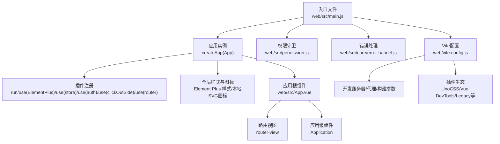
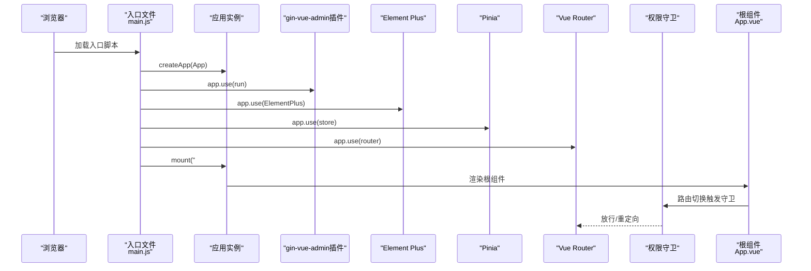
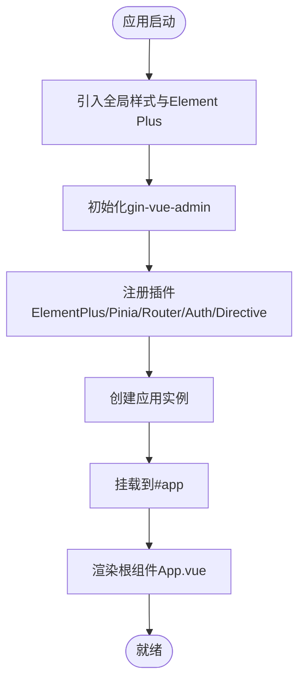
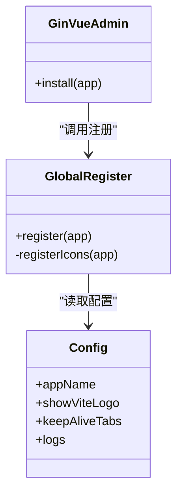
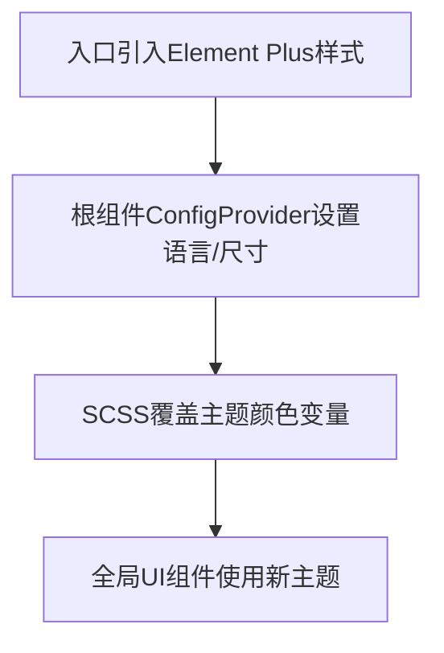
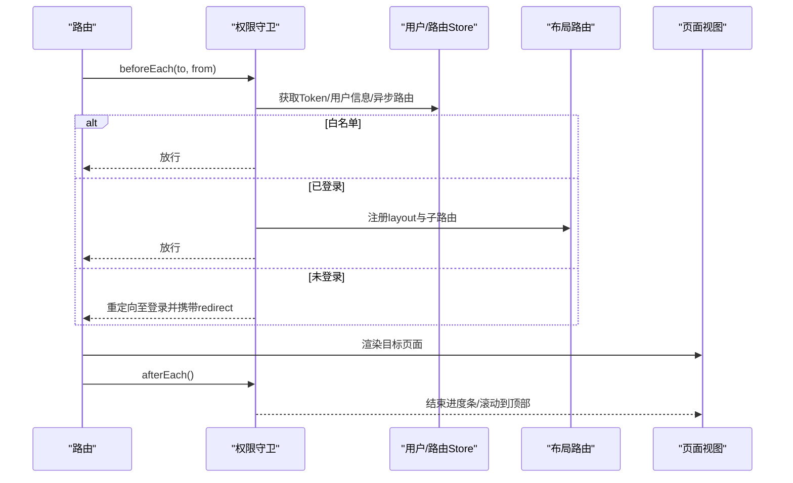
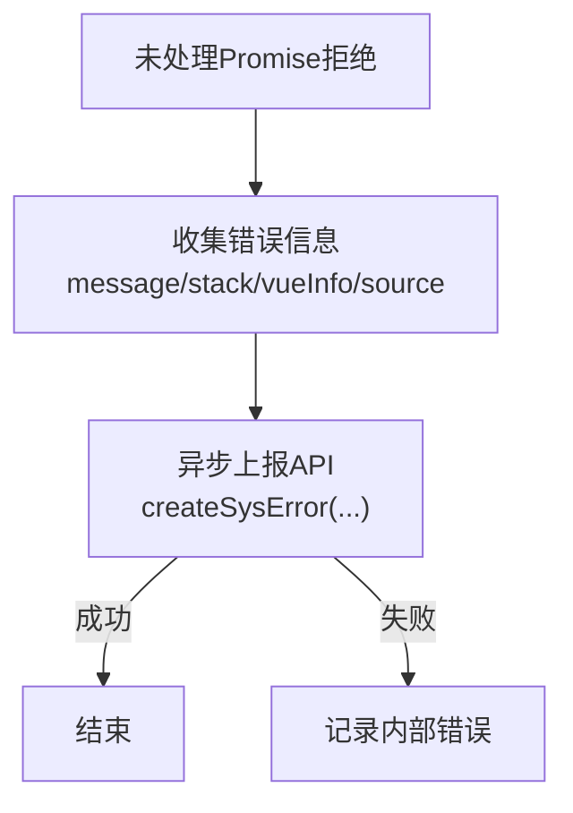
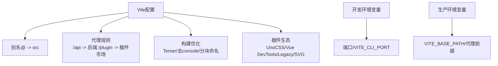
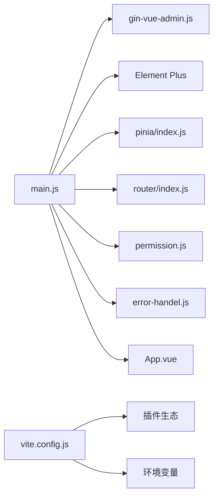

# Vue应用结构

<cite>
**本文引用的文件**
- [web/src/main.js](file://web/src/main.js)
- [web/vite.config.js](file://web/vite.config.js)
- [web/package.json](file://web/package.json)
- [web/src/core/gin-vue-admin.js](file://web/src/core/gin-vue-admin.js)
- [web/src/core/global.js](file://web/src/core/global.js)
- [web/src/App.vue](file://web/src/App.vue)
- [web/src/router/index.js](file://web/src/router/index.js)
- [web/src/permission.js](file://web/src/permission.js)
- [web/src/core/error-handel.js](file://web/src/core/error-handel.js)
- [web/src/core/config.js](file://web/src/core/config.js)
- [web/src/style/element/index.scss](file://web/src/style/element/index.scss)
- [web/.env.development](file://web/.env.development)
- [web/.env.production](file://web/.env.production)
- [web/vitePlugin/secret/index.js](file://web/vitePlugin/secret/index.js)
</cite>

## 目录
1. [简介](#简介)
2. [项目结构](#项目结构)
3. [核心组件](#核心组件)
4. [架构总览](#架构总览)
5. [详细组件分析](#详细组件分析)
6. [依赖分析](#依赖分析)
7. [性能考虑](#性能考虑)
8. [故障排查指南](#故障排查指南)
9. [结论](#结论)
10. [附录](#附录)

## 简介
本文件面向测试管理平台的前端Vue 3应用，系统性梳理应用入口配置、gin-vue-admin框架初始化、Element Plus集成与主题配置、应用启动流程、错误处理机制、开发工具集成以及Vite构建与开发环境设置。文档同时提供架构图与模块依赖关系说明，帮助开发者快速理解并高效扩展。

## 项目结构
前端工程位于 web 目录，采用Vite作为构建工具，Vue 3 + Pinia + Vue Router构成核心运行时，配合Element Plus提供UI基础能力。应用通过入口文件创建应用实例，按序注册插件与全局配置，随后挂载到DOM。权限与路由由独立模块负责，错误处理通过全局事件监听实现。

图表来源
- [web/src/main.js:1-38](file://web/src/main.js#L1-L38)
- [web/src/App.vue:1-47](file://web/src/App.vue#L1-L47)
- [web/src/permission.js:1-225](file://web/src/permission.js#L1-L225)
- [web/vite.config.js:1-119](file://web/vite.config.js#L1-L119)

章节来源
- [web/src/main.js:1-38](file://web/src/main.js#L1-L38)
- [web/vite.config.js:1-119](file://web/vite.config.js#L1-L119)
- [web/package.json:1-88](file://web/package.json#L1-L88)

## 核心组件
- 应用入口与初始化
  - 创建应用实例，引入全局样式、Element Plus、开发工具校验、gin-vue-admin初始化、路由、权限、Pinia状态管理、指令与错误处理，最后挂载到#app。
  - 关键路径参考：[入口文件:1-38](file://web/src/main.js#L1-L38)、[应用根组件:1-47](file://web/src/App.vue#L1-L47)、[权限守卫:1-225](file://web/src/permission.js#L1-L225)、[错误处理:1-25](file://web/src/core/error-handel.js#L1-L25)。
- gin-vue-admin框架初始化
  - 通过插件形式注册全局配置、图标、全局属性，打印欢迎信息与版权提示。
  - 关键路径参考：[框架初始化:1-30](file://web/src/core/gin-vue-admin.js#L1-L30)、[全局注册:1-64](file://web/src/core/global.js#L1-L64)、[配置输出:1-56](file://web/src/core/config.js#L1-L56)。
- Element Plus集成与主题
  - 引入Element Plus样式与暗色主题变量，根组件通过ConfigProvider设置语言与全局尺寸；主题颜色通过SCSS覆盖实现。
  - 关键路径参考：[入口样式引入:1-8](file://web/src/main.js#L1-L8)、[根组件配置:6-18](file://web/src/App.vue#L6-L18)、[主题覆盖:1-25](file://web/src/style/element/index.scss#L1-L25)。
- 路由与权限
  - 基于哈希历史的路由，白名单控制、动态路由扁平化注册、keep-alive与页面标题处理、NProgress进度条。
  - 关键路径参考：[路由定义:1-42](file://web/src/router/index.js#L1-L42)、[权限守卫:155-221](file://web/src/permission.js#L155-L221)。
- 错误处理
  - 全局捕获未处理Promise拒绝，构造错误上报数据并通过API提交。
  - 关键路径参考：[错误上报:1-25](file://web/src/core/error-handel.js#L1-L25)。
- Vite构建与开发环境
  - 配置别名、代理、构建产物命名、插件生态（UnoCSS、Vue DevTools、Legacy等）、开发端口与代理规则。
  - 关键路径参考：[Vite配置:1-119](file://web/vite.config.js#L1-L119)、[开发环境变量:1-12](file://web/.env.development#L1-L12)、[生产环境变量:1-8](file://web/.env.production#L1-L8)。

章节来源
- [web/src/main.js:1-38](file://web/src/main.js#L1-L38)
- [web/src/core/gin-vue-admin.js:1-30](file://web/src/core/gin-vue-admin.js#L1-L30)
- [web/src/core/global.js:1-64](file://web/src/core/global.js#L1-L64)
- [web/src/App.vue:1-47](file://web/src/App.vue#L1-L47)
- [web/src/style/element/index.scss:1-25](file://web/src/style/element/index.scss#L1-L25)
- [web/src/router/index.js:1-42](file://web/src/router/index.js#L1-L42)
- [web/src/permission.js:1-225](file://web/src/permission.js#L1-L225)
- [web/src/core/error-handel.js:1-25](file://web/src/core/error-handel.js#L1-L25)
- [web/vite.config.js:1-119](file://web/vite.config.js#L1-L119)
- [web/.env.development:1-12](file://web/.env.development#L1-L12)
- [web/.env.production:1-8](file://web/.env.production#L1-L8)

## 架构总览
下图展示从浏览器加载到应用启动的关键交互：入口文件创建应用实例并依次注册插件与全局配置；权限守卫在路由切换时生效；错误处理在运行期捕获异常并上报；Vite在开发阶段提供代理与热更新支持。

图表来源
- [web/src/main.js:21-36](file://web/src/main.js#L21-L36)
- [web/src/core/gin-vue-admin.js:9-28](file://web/src/core/gin-vue-admin.js#L9-L28)
- [web/src/App.vue:6-18](file://web/src/App.vue#L6-L18)
- [web/src/permission.js:155-209](file://web/src/permission.js#L155-L209)

## 详细组件分析

### 应用入口与启动流程
- 初始化步骤
  - 引入全局样式与Element Plus主题，确保UI一致性与暗色支持。
  - 引入gin-vue-admin初始化逻辑，注册全局图标与配置。
  - 注册路由、权限、Pinia、指令与错误处理。
  - 创建应用实例并挂载。
- 关键点
  - 使用开发工具校验插件防止多实例DOM冲突。
  - 在根组件通过ConfigProvider设置语言与全局尺寸。
- 参考路径
  - [入口文件:1-38](file://web/src/main.js#L1-L38)
  - [根组件配置:6-18](file://web/src/App.vue#L6-L18)

图表来源
- [web/src/main.js:1-38](file://web/src/main.js#L1-L38)
- [web/src/App.vue:6-18](file://web/src/App.vue#L6-L18)

章节来源
- [web/src/main.js:1-38](file://web/src/main.js#L1-L38)
- [web/src/App.vue:6-18](file://web/src/App.vue#L6-L18)

### gin-vue-admin框架初始化
- 功能职责
  - 通过插件install钩子执行注册流程，打印版本与社区信息。
  - 全局注册Element Plus图标与本地SVG图标，注入全局配置对象。
- 关键实现
  - 插件安装：[框架初始化:9-28](file://web/src/core/gin-vue-admin.js#L9-L28)
  - 全局注册：[图标与配置:55-64](file://web/src/core/global.js#L55-L64)
  - 配置输出：[站点配置:8-13](file://web/src/core/config.js#L8-L13)
- 依赖关系
  - 依赖package.json中的版本信息与环境变量。
  - 依赖Vite环境加载与日志输出。

图表来源
- [web/src/core/gin-vue-admin.js:9-28](file://web/src/core/gin-vue-admin.js#L9-L28)
- [web/src/core/global.js:55-64](file://web/src/core/global.js#L55-L64)
- [web/src/core/config.js:8-13](file://web/src/core/config.js#L8-L13)

章节来源
- [web/src/core/gin-vue-admin.js:1-30](file://web/src/core/gin-vue-admin.js#L1-L30)
- [web/src/core/global.js:1-64](file://web/src/core/global.js#L1-L64)
- [web/src/core/config.js:1-56](file://web/src/core/config.js#L1-L56)

### Element Plus集成与主题配置
- 集成方式
  - 在入口引入Element Plus样式与暗色主题变量，保证全局可用。
  - 在根组件通过ConfigProvider设置语言与全局尺寸，便于统一风格。
- 主题定制
  - 通过SCSS覆盖Element Plus颜色变量，实现品牌色统一。
- 参考路径
  - [入口样式引入:1-8](file://web/src/main.js#L1-L8)
  - [根组件配置:6-18](file://web/src/App.vue#L6-L18)
  - [主题覆盖:1-25](file://web/src/style/element/index.scss#L1-L25)

图表来源
- [web/src/main.js:1-8](file://web/src/main.js#L1-L8)
- [web/src/App.vue:6-18](file://web/src/App.vue#L6-L18)
- [web/src/style/element/index.scss:1-25](file://web/src/style/element/index.scss#L1-L25)

章节来源
- [web/src/main.js:1-8](file://web/src/main.js#L1-L8)
- [web/src/App.vue:6-18](file://web/src/App.vue#L6-L18)
- [web/src/style/element/index.scss:1-25](file://web/src/style/element/index.scss#L1-L25)

### 路由与权限系统
- 路由定义
  - 基于哈希历史，包含登录、初始化、扫描上传与兜底错误页。
- 权限策略
  - 白名单放行、Token校验、异步路由扁平化注册、Keep-Alive与页面标题处理、NProgress进度条。
  - 路由守卫在beforeEach/afterEach/onError中分别处理前置校验、后置滚动与错误回调。
- 参考路径
  - [路由定义:1-42](file://web/src/router/index.js#L1-L42)
  - [权限守卫:155-221](file://web/src/permission.js#L155-L221)

图表来源
- [web/src/router/index.js:1-42](file://web/src/router/index.js#L1-L42)
- [web/src/permission.js:155-221](file://web/src/permission.js#L155-L221)

章节来源
- [web/src/router/index.js:1-42](file://web/src/router/index.js#L1-L42)
- [web/src/permission.js:1-225](file://web/src/permission.js#L1-L225)

### 错误处理机制
- 未处理Promise拒绝捕获
  - 通过window.unhandledrejection监听，构造错误信息并调用系统错误上报接口。
  - 上报失败时记录内部错误，避免二次异常。
- 参考路径
  - [错误上报:1-25](file://web/src/core/error-handel.js#L1-L25)

图表来源
- [web/src/core/error-handel.js:1-25](file://web/src/core/error-handel.js#L1-L25)

章节来源
- [web/src/core/error-handel.js:1-25](file://web/src/core/error-handel.js#L1-L25)

### Vite构建配置与开发环境
- 核心配置
  - 别名与打包器：@指向src，vue运行时指向bundler版本。
  - 代理：将/api前缀代理至后端服务，插件市场路径单独代理。
  - 构建：Terser压缩、去除console与debugger、Rollup输出命名规则。
  - 插件：UnoCSS、Vue DevTools、Legacy、SVG自动导入、路径信息生成、多DOM校验。
- 开发环境
  - 端口、打开浏览器、代理后端地址与端口。
- 生产环境
  - 代理前缀与线上域名配置。
- 参考路径
  - [Vite配置:1-119](file://web/vite.config.js#L1-L119)
  - [开发环境变量:1-12](file://web/.env.development#L1-L12)
  - [生产环境变量:1-8](file://web/.env.production#L1-L8)
  - [包管理脚本:5-12](file://web/package.json#L5-L12)
  - [密钥注入插件:1-8](file://web/vitePlugin/secret/index.js#L1-L8)

图表来源
- [web/vite.config.js:24-93](file://web/vite.config.js#L24-L93)
- [web/.env.development:2-11](file://web/.env.development#L2-L11)
- [web/.env.production:4-7](file://web/.env.production#L4-L7)
- [web/package.json:5-12](file://web/package.json#L5-L12)
- [web/vitePlugin/secret/index.js:1-8](file://web/vitePlugin/secret/index.js#L1-L8)

章节来源
- [web/vite.config.js:1-119](file://web/vite.config.js#L1-L119)
- [web/.env.development:1-12](file://web/.env.development#L1-L12)
- [web/.env.production:1-8](file://web/.env.production#L1-L8)
- [web/package.json:1-88](file://web/package.json#L1-L88)
- [web/vitePlugin/secret/index.js:1-8](file://web/vitePlugin/secret/index.js#L1-L8)

## 依赖分析
- 模块耦合
  - 入口文件对插件与全局配置存在强依赖，权限守卫依赖路由与状态管理，错误处理依赖API层。
- 外部依赖
  - Vue 3、Element Plus、Pinia、Vue Router、Axios、UnoCSS、Vite插件生态。
- 关键依赖路径
  - [入口依赖:1-38](file://web/src/main.js#L1-L38)
  - [权限依赖:1-7](file://web/src/permission.js#L1-L7)
  - [Vite依赖:1-13](file://web/vite.config.js#L1-L13)

图表来源
- [web/src/main.js:1-38](file://web/src/main.js#L1-L38)
- [web/src/core/gin-vue-admin.js:1-30](file://web/src/core/gin-vue-admin.js#L1-L30)
- [web/src/core/error-handel.js:1-25](file://web/src/core/error-handel.js#L1-L25)
- [web/src/permission.js:1-225](file://web/src/permission.js#L1-L225)
- [web/src/router/index.js:1-42](file://web/src/router/index.js#L1-L42)
- [web/src/App.vue:1-47](file://web/src/App.vue#L1-L47)
- [web/vite.config.js:1-119](file://web/vite.config.js#L1-L119)

章节来源
- [web/src/main.js:1-38](file://web/src/main.js#L1-L38)
- [web/src/permission.js:1-225](file://web/src/permission.js#L1-L225)
- [web/vite.config.js:1-119](file://web/vite.config.js#L1-L119)

## 性能考虑
- 构建优化
  - 启用Terser压缩与去除调试语句，减少生产包体积。
  - 自定义Rollup输出命名，提升缓存命中率。
- 依赖优化
  - 使用Vue运行时bundler版本，减少不必要的运行时开销。
  - 合理拆分第三方依赖，结合懒加载与按需加载策略。
- 开发体验
  - 启用Vue DevTools与多DOM校验，降低开发成本。
  - UnoCSS按需生成样式，避免全局污染。

## 故障排查指南
- 启动失败
  - 检查Vite端口占用与代理配置是否正确。
  - 确认环境变量VITE_CLI_PORT与VITE_SERVER_PORT设置。
- 路由异常
  - 查看权限守卫日志，确认Token与异步路由是否正确加载。
  - 检查layout与子路由注册顺序，避免重复或缺失。
- UI主题不生效
  - 确认Element Plus样式引入顺序与SCSS覆盖文件加载。
  - 检查ConfigProvider的语言与尺寸设置。
- 错误上报失败
  - 查看未处理Promise拒绝事件是否被捕获。
  - 确认系统错误API接口可用性与网络代理。

章节来源
- [web/vite.config.js:57-78](file://web/vite.config.js#L57-L78)
- [web/src/permission.js:155-221](file://web/src/permission.js#L155-L221)
- [web/src/App.vue:6-18](file://web/src/App.vue#L6-L18)
- [web/src/core/error-handel.js:1-25](file://web/src/core/error-handel.js#L1-L25)

## 结论
本应用以Vue 3为核心，结合gin-vue-admin框架与Element Plus UI体系，构建了清晰的启动流程与完善的权限控制。通过Vite的现代化配置与插件生态，实现了高效的开发体验与稳定的生产构建。建议在后续迭代中持续优化路由与状态管理的模块化程度，进一步细化错误上报与监控体系，以提升系统的可观测性与可维护性。

## 附录
- 开发命令
  - 开发：npm run dev 或 npm run serve
  - 构建：npm run build
  - 预览：npm run preview
- 关键环境变量
  - VITE_CLI_PORT：前端开发端口
  - VITE_SERVER_PORT：后端服务端口
  - VITE_BASE_API：API代理前缀
  - VITE_BASE_PATH：后端服务地址
  - VITE_POSITION：是否启用Vue DevTools
  - VITE_EDITOR：编辑器类型（用于DOM定位）

章节来源
- [web/package.json:5-12](file://web/package.json#L5-L12)
- [web/.env.development:2-11](file://web/.env.development#L2-L11)
- [web/.env.production:4-7](file://web/.env.production#L4-L7)