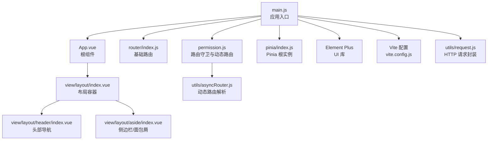
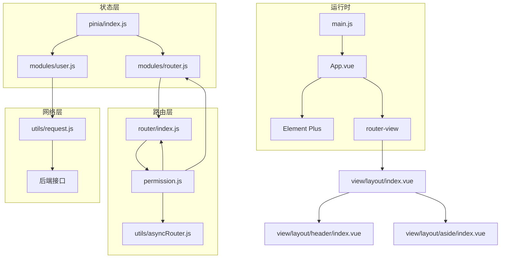
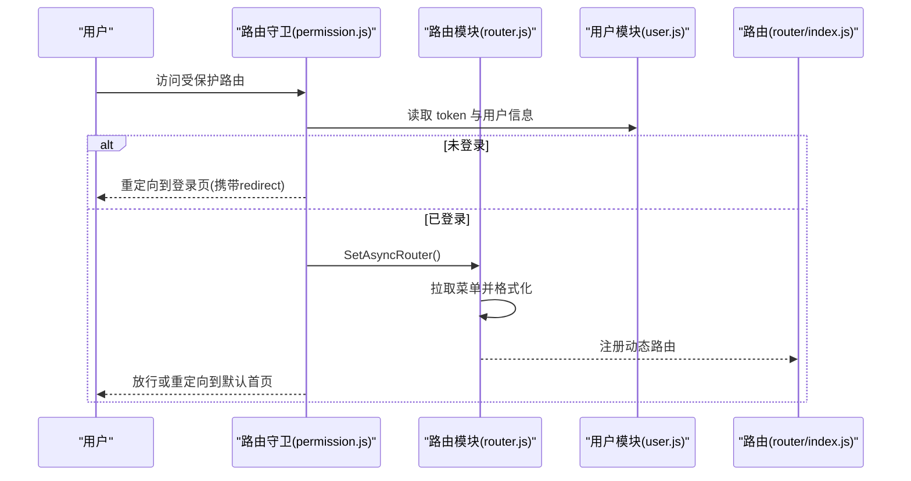
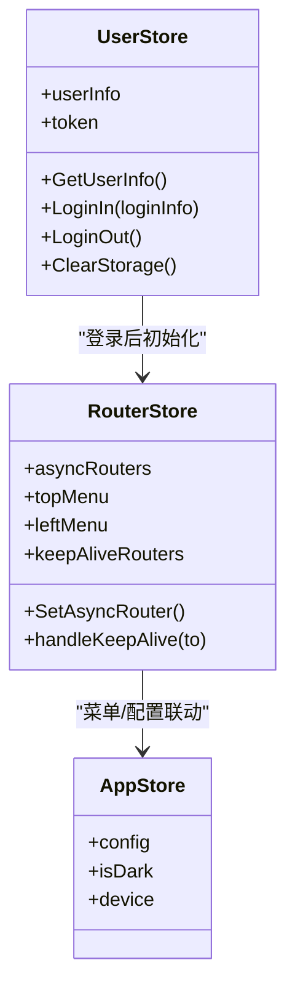
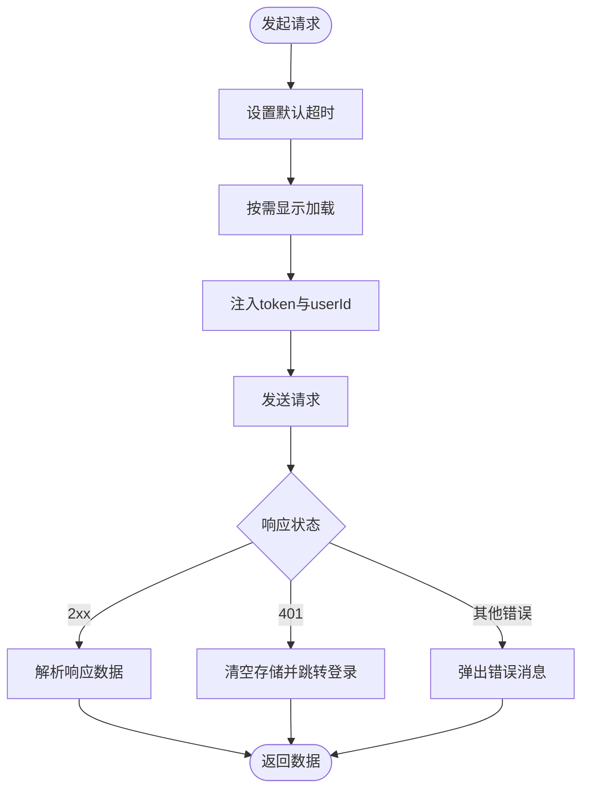
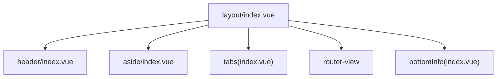
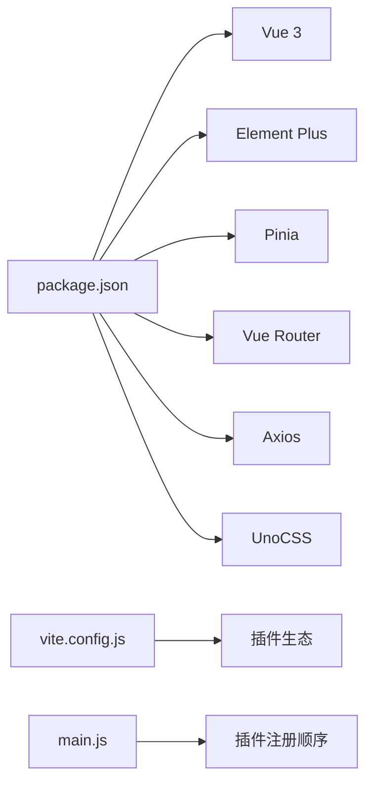

# 前端应用

<cite>
**本文引用的文件**
- [package.json](file://web/package.json)
- [main.js](file://web/src/main.js)
- [App.vue](file://web/src/App.vue)
- [vite.config.js](file://web/vite.config.js)
- [router/index.js](file://web/src/router/index.js)
- [pinia/index.js](file://web/src/pinia/index.js)
- [permission.js](file://web/src/permission.js)
- [core/gin-vue-admin.js](file://web/src/core/gin-vue-admin.js)
- [utils/asyncRouter.js](file://web/src/utils/asyncRouter.js)
- [utils/request.js](file://web/src/utils/request.js)
- [pinia/modules/user.js](file://web/src/pinia/modules/user.js)
- [pinia/modules/router.js](file://web/src/pinia/modules/router.js)
- [view/layout/index.vue](file://web/src/view/layout/index.vue)
- [view/layout/aside/index.vue](file://web/src/view/layout/aside/index.vue)
- [view/layout/header/index.vue](file://web/src/view/layout/header/index.vue)
</cite>

## 目录
1. [简介](#简介)
2. [项目结构](#项目结构)
3. [核心组件](#核心组件)
4. [架构总览](#架构总览)
5. [详细组件分析](#详细组件分析)
6. [依赖关系分析](#依赖关系分析)
7. [性能考量](#性能考量)
8. [故障排查指南](#故障排查指南)
9. [结论](#结论)
10. [附录](#附录)

## 简介
本文件面向测试管理平台前端应用，系统性阐述基于 Vue 3 的前端架构设计与实现要点，覆盖组件化开发、状态管理（Pinia）、路由系统、UI 组件库（Element Plus）集成与主题配置、页面布局体系、权限控制与动态路由、以及主要功能模块（用户管理、系统配置、测试管理等）的前端实现思路与最佳实践。文档同时提供组件开发规范与常见问题排查建议，帮助开发者快速理解并高效迭代。

## 项目结构
前端工程位于 web 目录，采用 Vite 构建工具，核心入口为 main.js，应用根组件为 App.vue，路由与状态管理分别位于 src/router 与 src/pinia，权限控制逻辑集中在 src/permission.js，并通过 utils/request.js 统一封装 HTTP 请求与加载提示。

**图示来源**
- [main.js:1-38](file://web/src/main.js#L1-L38)
- [App.vue:1-47](file://web/src/App.vue#L1-L47)
- [router/index.js:1-42](file://web/src/router/index.js#L1-L42)
- [permission.js:1-225](file://web/src/permission.js#L1-L225)
- [pinia/index.js:1-9](file://web/src/pinia/index.js#L1-L9)
- [vite.config.js:1-119](file://web/vite.config.js#L1-L119)
- [utils/request.js:1-232](file://web/src/utils/request.js#L1-L232)
- [utils/asyncRouter.js:1-30](file://web/src/utils/asyncRouter.js#L1-L30)
- [view/layout/index.vue:1-119](file://web/src/view/layout/index.vue#L1-L119)
- [view/layout/header/index.vue:1-134](file://web/src/view/layout/header/index.vue#L1-L134)
- [view/layout/aside/index.vue:1-40](file://web/src/view/layout/aside/index.vue#L1-L40)

**章节来源**
- [main.js:1-38](file://web/src/main.js#L1-L38)
- [vite.config.js:1-119](file://web/vite.config.js#L1-L119)

## 核心组件
- 应用入口与插件注册：在 main.js 中完成 Element Plus、路由、指令、Pinia、权限控制等插件的安装与应用挂载。
- 根组件与全局配置：App.vue 通过 el-config-provider 提供语言与尺寸配置，承载路由视图与应用级组件。
- 路由系统：基础路由在 router/index.js 中定义，包含登录、初始化、扫码上传与兜底错误页；动态路由在权限守卫中按用户权限注册。
- 状态管理：pinia/index.js 创建 Pinia 实例并导出多个模块（app、user、dictionary），其中 user 与 router 模块承担登录态、路由与菜单状态管理。
- 权限与动态路由：permission.js 实现路由守卫、白名单处理、异步路由注册与扁平化挂载、keep-alive 路由筛选与缓存策略。
- HTTP 请求封装：utils/request.js 统一拦截器、加载提示、错误处理与 Token 注入，支持持久化加载与超时控制。
- 布局系统：view/layout/index.vue 为核心布局容器，组合 header、aside、tabs、router-view 与底部信息组件，支持多端适配与水印配置。

**章节来源**
- [main.js:1-38](file://web/src/main.js#L1-L38)
- [App.vue:1-47](file://web/src/App.vue#L1-L47)
- [router/index.js:1-42](file://web/src/router/index.js#L1-L42)
- [pinia/index.js:1-9](file://web/src/pinia/index.js#L1-L9)
- [permission.js:1-225](file://web/src/permission.js#L1-L225)
- [utils/request.js:1-232](file://web/src/utils/request.js#L1-L232)
- [view/layout/index.vue:1-119](file://web/src/view/layout/index.vue#L1-L119)

## 架构总览
前端采用“入口装配 + 布局容器 + 动态路由 + 状态管理 + 统一请求”的分层架构。Element Plus 提供 UI 能力，Vite 负责构建与开发体验，Pinia 管理跨组件状态，路由守卫保障访问安全与动态挂载。

**图示来源**
- [main.js:1-38](file://web/src/main.js#L1-L38)
- [App.vue:1-47](file://web/src/App.vue#L1-L47)
- [router/index.js:1-42](file://web/src/router/index.js#L1-L42)
- [permission.js:1-225](file://web/src/permission.js#L1-L225)
- [utils/asyncRouter.js:1-30](file://web/src/utils/asyncRouter.js#L1-L30)
- [utils/request.js:1-232](file://web/src/utils/request.js#L1-L232)
- [pinia/index.js:1-9](file://web/src/pinia/index.js#L1-L9)
- [pinia/modules/user.js:1-151](file://web/src/pinia/modules/user.js#L1-L151)
- [pinia/modules/router.js:1-208](file://web/src/pinia/modules/router.js#L1-L208)
- [view/layout/index.vue:1-119](file://web/src/view/layout/index.vue#L1-L119)
- [view/layout/header/index.vue:1-134](file://web/src/view/layout/header/index.vue#L1-L134)
- [view/layout/aside/index.vue:1-40](file://web/src/view/layout/aside/index.vue#L1-L40)

## 详细组件分析

### 路由与权限控制（动态路由）
- 白名单与守卫：permission.js 定义白名单路由（如登录、初始化），在 beforeEach 中处理元数据、缓存与页面标题，未登录自动跳转登录并携带重定向参数。
- 动态路由注册：首次登录或进入受保护路由时，调用 router 模块拉取菜单并扁平化挂载至 layout 或顶级路由；支持 defaultMenu 顶级路由与外链节点过滤。
- 路由扁平化算法：根据父子关系与路径片段生成绝对/相对路径，避免重复注册与 /layout/layout/ 结构；支持 redirect 到首个子路由。
- 错误处理：afterEach 关闭进度条，onError 输出错误日志并移除加载动画。

**图示来源**
- [permission.js:155-209](file://web/src/permission.js#L155-L209)
- [pinia/modules/router.js:158-193](file://web/src/pinia/modules/router.js#L158-L193)
- [pinia/modules/user.js:54-111](file://web/src/pinia/modules/user.js#L54-L111)
- [router/index.js:1-42](file://web/src/router/index.js#L1-L42)

**章节来源**
- [permission.js:1-225](file://web/src/permission.js#L1-L225)
- [utils/asyncRouter.js:1-30](file://web/src/utils/asyncRouter.js#L1-L30)
- [pinia/modules/router.js:1-208](file://web/src/pinia/modules/router.js#L1-L208)
- [pinia/modules/user.js:1-151](file://web/src/pinia/modules/user.js#L1-L151)
- [router/index.js:1-42](file://web/src/router/index.js#L1-L42)

### Pinia 状态管理与数据流
- Store 实例：pinia/index.js 创建 Pinia 并导出 useAppStore、useUserStore、useDictionaryStore。
- 用户状态（user.js）：维护 token、用户信息、登录/登出、获取用户信息、清理存储；登录成功后触发路由初始化与首页跳转。
- 路由状态（router.js）：维护异步路由树、顶部/左侧菜单、keep-alive 路由集合、路由映射与缓存处理；提供 SetAsyncRouter 与 handleKeepAlive。
- 数据流特点：用户态变更驱动路由注册，路由变更影响菜单与缓存策略，布局组件通过 storeToRefs 订阅状态变化。

**图示来源**
- [pinia/index.js:1-9](file://web/src/pinia/index.js#L1-L9)
- [pinia/modules/user.js:13-151](file://web/src/pinia/modules/user.js#L13-L151)
- [pinia/modules/router.js:51-208](file://web/src/pinia/modules/router.js#L51-L208)

**章节来源**
- [pinia/index.js:1-9](file://web/src/pinia/index.js#L1-L9)
- [pinia/modules/user.js:1-151](file://web/src/pinia/modules/user.js#L1-L151)
- [pinia/modules/router.js:1-208](file://web/src/pinia/modules/router.js#L1-L208)

### HTTP 请求封装与错误处理
- 统一拦截器：request.js 在请求头注入 token 与用户 ID，支持 donNotShowLoading 与 loadingOption；响应头含 new-token 时自动更新本地 token。
- 加载与超时：内置加载计数与定时器，支持持久化加载与强制关闭；默认请求超时 10 分钟。
- 错误分类：网络异常、401 未认证（触发登出与路由跳转）、业务错误（读取响应体 msg）统一通过消息提示与事件总线上报。

**图示来源**
- [utils/request.js:119-223](file://web/src/utils/request.js#L119-L223)

**章节来源**
- [utils/request.js:1-232](file://web/src/utils/request.js#L1-L232)

### 布局系统与页面骨架
- 布局容器：view/layout/index.vue 提供水印、头部、侧边栏、标签页、主内容区与底部信息；支持 keep-alive 缓存与过渡动画。
- 侧边栏模式：aside/index.vue 根据配置渲染 normal/head/combination/sidebar 四种模式，移动端适配 head/combination/sidebar。
- 头部导航：header/index.vue 展示面包屑、用户信息、角色切换、个人中心与登出；支持移动端隐藏标题与头部模式。

**图示来源**
- [view/layout/index.vue:1-119](file://web/src/view/layout/index.vue#L1-L119)
- [view/layout/header/index.vue:1-134](file://web/src/view/layout/header/index.vue#L1-L134)
- [view/layout/aside/index.vue:1-40](file://web/src/view/layout/aside/index.vue#L1-L40)

**章节来源**
- [view/layout/index.vue:1-119](file://web/src/view/layout/index.vue#L1-L119)
- [view/layout/aside/index.vue:1-40](file://web/src/view/layout/aside/index.vue#L1-L40)
- [view/layout/header/index.vue:1-134](file://web/src/view/layout/header/index.vue#L1-L134)

### Element Plus 集成与主题配置
- 安装与注册：main.js 引入 Element Plus 并在 App.vue 通过 el-config-provider 设置语言与全局尺寸。
- 主题与暗色模式：引入 Element Plus 暗色变量与 UnoCSS，配合 App.vue 的深色类名实现暗色切换。
- 组件使用：布局、导航、下拉、水印、加载、消息等组件贯穿于 header、layout 与各页面。

**章节来源**
- [main.js:1-38](file://web/src/main.js#L1-L38)
- [App.vue:1-47](file://web/src/App.vue#L1-L47)

### 页面布局系统与权限控制机制
- 多端适配：通过响应式钩子与 storeToRefs 订阅设备状态，控制侧边栏模式与头部展示。
- 权限控制：permission.js 在 beforeEach 中判断 token 与白名单，结合用户默认首页与动态路由注册，确保访问安全。
- 动态路由：router.js 从后端拉取菜单，formatRouter 与 asyncRouterHandle 完成路径规范化与组件动态解析，再由 permission.js 扁平化挂载。

**章节来源**
- [permission.js:1-225](file://web/src/permission.js#L1-L225)
- [pinia/modules/router.js:1-208](file://web/src/pinia/modules/router.js#L1-L208)
- [utils/asyncRouter.js:1-30](file://web/src/utils/asyncRouter.js#L1-L30)

### 主要功能页面设计思路
- 登录与初始化：登录页负责认证与路由初始化；初始化页用于系统初始化流程。
- 仪表盘与统计：dashboard 目录包含图表与卡片组件，结合 charts.js 钩子实现可视化。
- 示例与工具：example 目录提供断点续传、客户管理、上传示例等；systemTools 提供系统工具集。
- 系统配置与用户管理：superAdmin 与 system 目录提供菜单、字典、参数、操作日志、登录日志等功能页面，权限通过按钮级权限与路由级权限共同控制。

注：以上模块页面组织遵循目录结构与命名约定，具体实现细节以对应组件文件为准。

## 依赖关系分析
- 依赖生态：package.json 明确 Vue 3、Element Plus、Pinia、Vue Router、Axios、ECharts、UnoCSS 等核心依赖。
- 构建与开发：vite.config.js 配置别名、代理、插件（UnoCSS、SVG 自动引入、Vue DevTools、Banner、根节点校验）与生产优化（Terser 压缩、去除 console）。
- 运行时依赖：main.js 将 Element Plus、路由、指令、Pinia、权限控制与错误处理统一注册，形成稳定的应用启动序列。

**图示来源**
- [package.json:1-88](file://web/package.json#L1-L88)
- [vite.config.js:1-119](file://web/vite.config.js#L1-L119)
- [main.js:1-38](file://web/src/main.js#L1-L38)

**章节来源**
- [package.json:1-88](file://web/package.json#L1-L88)
- [vite.config.js:1-119](file://web/vite.config.js#L1-L119)
- [main.js:1-38](file://web/src/main.js#L1-L38)

## 性能考量
- 资源加载：生产构建启用 Terser 压缩与去除 console，Rollup 输出文件名带哈希，利于浏览器缓存。
- 请求优化：request.js 内置加载节流与强制关闭，避免长时间阻塞；支持 donNotShowLoading 与持久化加载，减少不必要的 UI 占位。
- 路由与缓存：router.js 的 keepAliveFilter 与 handleKeepAlive 降低重复渲染成本；layout 的 keep-alive include 精准缓存命中。
- 开发体验：Vite 插件链路包含 DevTools、根节点校验与 SVG 自动引入，提升调试效率与图标资源复用。

## 故障排查指南
- 登录后无法进入首页：检查用户默认首页配置与动态路由注册是否成功，确认 permission.js 的白名单与异步路由标志位。
- 401 未认证：request.js 在 401 时触发登出与路由跳转，检查后端 JWT 与黑名单接口返回。
- 路由不显示或重复：核对 permission.js 的 addRouteByChildren 逻辑与 router.js 的 formatRouter，确保 defaultMenu 与外链节点处理正确。
- 加载卡住：确认 donNotShowLoading 与 persistLoading 使用是否合理，request.js 的计时器与强制关闭逻辑会自动清理。
- 深色主题不生效：确认 App.vue 的深色类名与 Element Plus 暗色变量引入顺序。

**章节来源**
- [permission.js:155-209](file://web/src/permission.js#L155-L209)
- [utils/request.js:119-223](file://web/src/utils/request.js#L119-L223)
- [main.js:1-38](file://web/src/main.js#L1-L38)

## 结论
测试管理平台前端以 Vue 3 为核心，结合 Element Plus、Pinia、Vue Router 与 Vite，构建了高内聚、低耦合的前端架构。通过统一的权限守卫与动态路由机制，实现了灵活的页面访问控制；借助 Pinia 的模块化状态管理与 request.js 的统一网络层，保障了数据流的清晰与健壮。布局系统与多端适配提升了用户体验，插件化的构建配置与主题体系增强了可扩展性。建议在后续迭代中持续完善组件开发规范、错误监控与性能指标采集，以支撑更大规模的功能演进。

## 附录
- 组件开发规范（建议）
  - 组件命名：采用 PascalCase，目录与文件同名；功能相关组件放置在 view 或 components 对应子目录。
  - Props 与事件：明确类型与默认值，使用 emits 明确对外事件；避免在组件内直接操作全局状态。
  - 状态管理：优先使用 Pinia 模块化 store，避免跨组件共享复杂状态；使用 storeToRefs 订阅响应式状态。
  - 路由与权限：菜单与路由保持一致的命名与路径；按钮级权限通过指令或工具函数控制显隐。
  - 请求封装：统一使用 request.js 发起请求，避免在组件内直接调用 axios；合理使用 donNotShowLoading 与 persistLoading。
  - 布局与样式：遵循 layout/index.vue 的结构与命名空间，样式使用 SCSS 并结合 UnoCSS 原子化工具。
  - 测试与文档：为关键组件与工具函数补充单元测试与使用说明，保持代码可读性与可维护性。