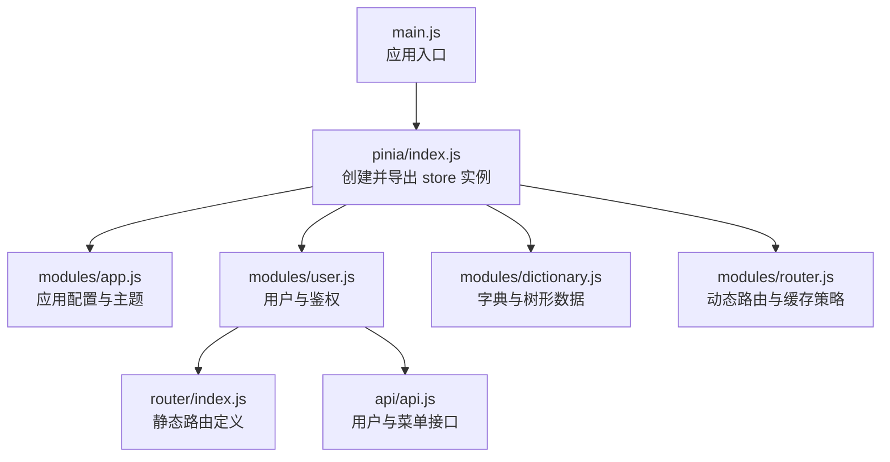
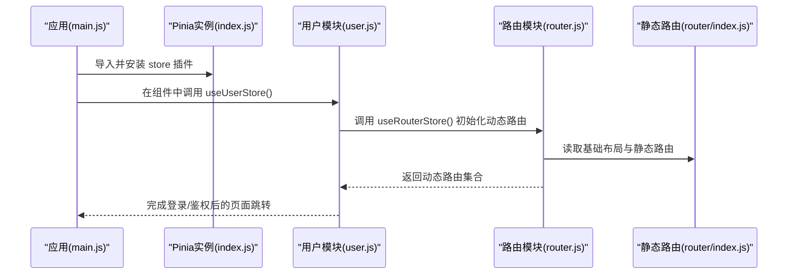
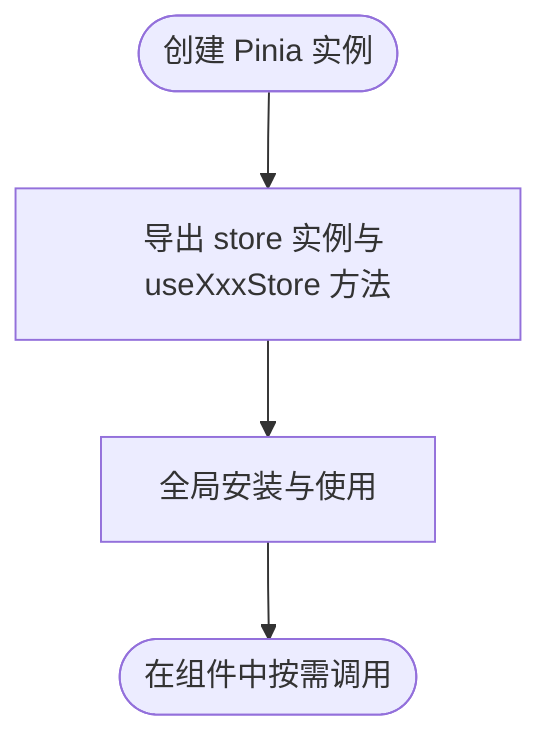
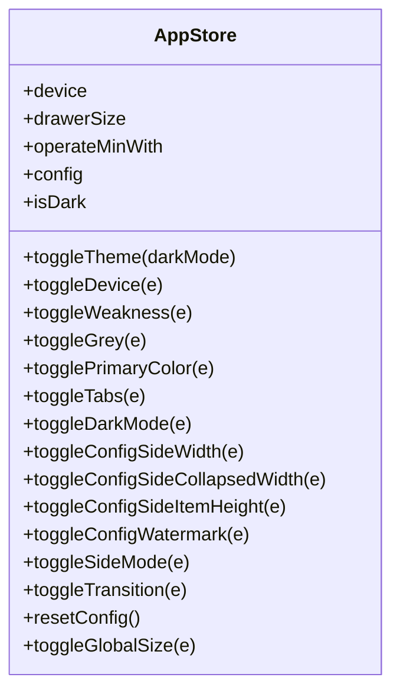
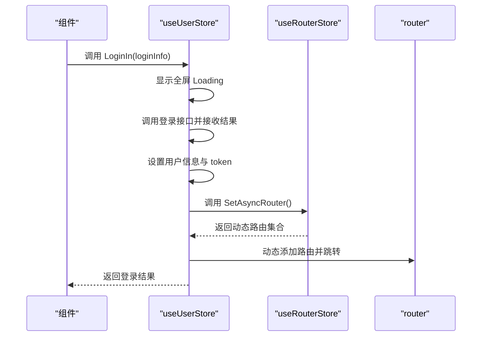
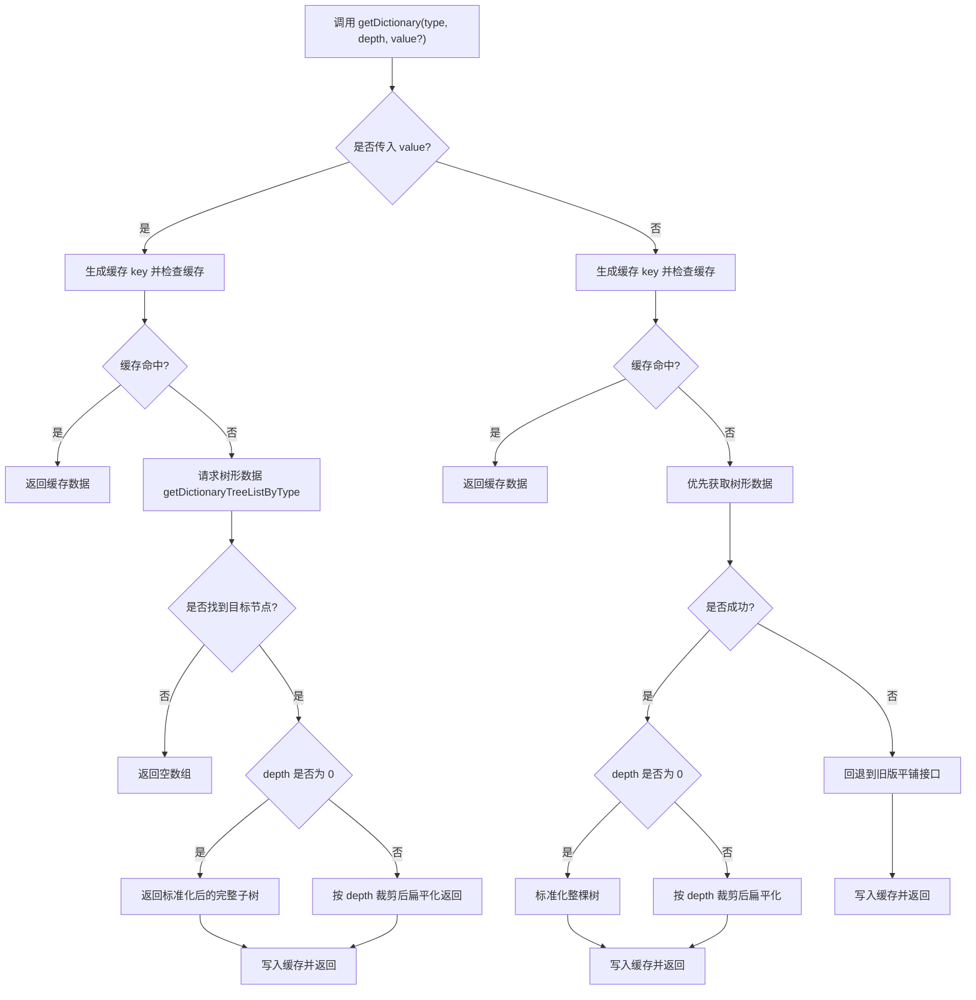
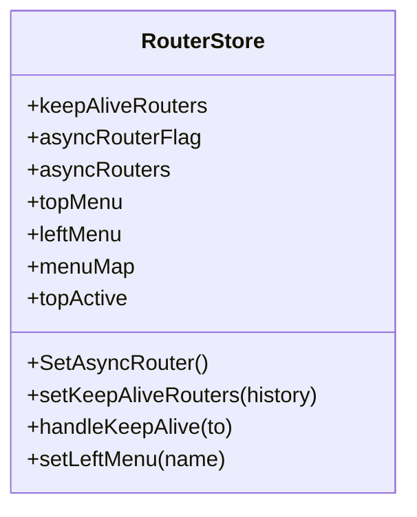
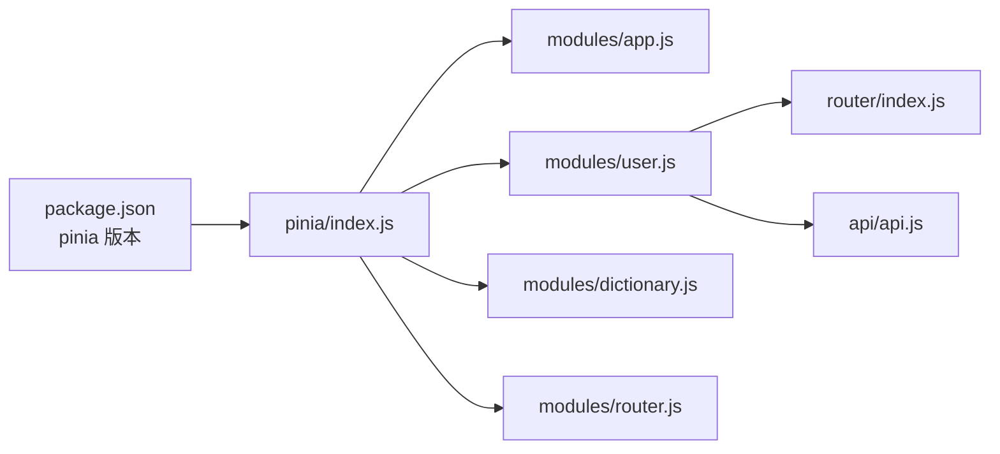

# Pinia Store 初始化

<cite>
**本文引用的文件**
- [web/src/pinia/index.js](file://web/src/pinia/index.js)
- [web/src/main.js](file://web/src/main.js)
- [web/package.json](file://web/package.json)
- [web/src/pinia/modules/app.js](file://web/src/pinia/modules/app.js)
- [web/src/pinia/modules/user.js](file://web/src/pinia/modules/user.js)
- [web/src/pinia/modules/dictionary.js](file://web/src/pinia/modules/dictionary.js)
- [web/src/pinia/modules/router.js](file://web/src/pinia/modules/router.js)
- [web/src/router/index.js](file://web/src/router/index.js)
- [web/src/api/api.js](file://web/src/api/api.js)
</cite>

## 目录
1. [简介](#简介)
2. [项目结构](#项目结构)
3. [核心组件](#核心组件)
4. [架构总览](#架构总览)
5. [详细组件分析](#详细组件分析)
6. [依赖关系分析](#依赖关系分析)
7. [性能考量](#性能考量)
8. [故障排查指南](#故障排查指南)
9. [结论](#结论)
10. [附录](#附录)

## 简介
本文件面向测试管理平台的前端工程，系统性阐述基于 Vue 3 与 Pinia 的状态管理初始化流程与最佳实践。重点包括：
- 如何创建 Pinia 实例并在应用中完成安装与注册
- store 模块的组织方式、命名导出与全局访问
- 在 Vue 应用中正确集成 Pinia 的步骤与注意事项
- 性能优化建议与常见问题的排查方法
- 提供可参考的配置与调用路径，便于快速落地

## 项目结构
前端采用 Vite 构建，Pinia Store 的入口位于 web/src/pinia/index.js，并在应用启动时由 web/src/main.js 完成安装。store 模块按功能拆分为多个文件，分别位于 web/src/pinia/modules 下。

图表来源
- [web/src/main.js:17](file://web/src/main.js#L17)
- [web/src/pinia/index.js:6](file://web/src/pinia/index.js#L6)
- [web/src/pinia/modules/user.js:1](file://web/src/pinia/modules/user.js#L1)
- [web/src/pinia/modules/router.js:1](file://web/src/pinia/modules/router.js#L1)
- [web/src/router/index.js:1](file://web/src/router/index.js#L1)
- [web/src/api/api.js:1](file://web/src/api/api.js#L1)

章节来源
- [web/src/main.js:17](file://web/src/main.js#L17)
- [web/src/pinia/index.js:6](file://web/src/pinia/index.js#L6)

## 核心组件
- Pinia 实例创建与导出：在 store 入口文件中创建实例并集中导出，便于全局统一使用。
- store 模块划分：按领域拆分，如应用配置、用户与路由、字典等，职责清晰。
- 全局安装与使用：在应用入口中安装插件，随后在任意组件中通过组合式 API 访问 store。

章节来源
- [web/src/pinia/index.js:1-9](file://web/src/pinia/index.js#L1-L9)
- [web/src/pinia/modules/app.js:1-163](file://web/src/pinia/modules/app.js#L1-L163)
- [web/src/pinia/modules/user.js:1-151](file://web/src/pinia/modules/user.js#L1-L151)
- [web/src/pinia/modules/dictionary.js:1-253](file://web/src/pinia/modules/dictionary.js#L1-L253)
- [web/src/pinia/modules/router.js:1-208](file://web/src/pinia/modules/router.js#L1-L208)

## 架构总览
下图展示了应用启动时 Pinia 初始化与模块加载的关键交互：

图表来源
- [web/src/main.js:32](file://web/src/main.js#L32)
- [web/src/pinia/index.js:2-8](file://web/src/pinia/index.js#L2-L8)
- [web/src/pinia/modules/user.js:80](file://web/src/pinia/modules/user.js#L80)
- [web/src/pinia/modules/router.js:158](file://web/src/pinia/modules/router.js#L158)
- [web/src/router/index.js:1](file://web/src/router/index.js#L1)

## 详细组件分析

### Pinia 实例创建与导出
- 在入口文件中创建 Pinia 实例并集中导出，便于在应用各处按需导入。
- 通过命名导出的方式，同时导出 store 实例以及各个模块的 useXxxStore 方法，形成统一的访问入口。

图表来源
- [web/src/pinia/index.js:6](file://web/src/pinia/index.js#L6)
- [web/src/pinia/index.js:8](file://web/src/pinia/index.js#L8)

章节来源
- [web/src/pinia/index.js:1-9](file://web/src/pinia/index.js#L1-L9)

### 应用配置与主题模块（app）
- 功能：维护全局主题、布局、颜色、标签页等配置；监听系统偏好并自动切换深浅色。
- 关键点：使用响应式对象与 watchEffect 实时同步 DOM 类名与样式变量；提供重置配置的能力。

图表来源
- [web/src/pinia/modules/app.js:6](file://web/src/pinia/modules/app.js#L6)
- [web/src/pinia/modules/app.js:140](file://web/src/pinia/modules/app.js#L140)

章节来源
- [web/src/pinia/modules/app.js:1-163](file://web/src/pinia/modules/app.js#L1-L163)

### 用户与鉴权模块（user）
- 功能：登录、登出、获取用户信息、初始化路由、清理存储等。
- 关键点：结合 Cookie 与 Storage 统一管理 token；登录后动态注册路由并跳转至默认首页；异常处理与 Loading 状态管理。

图表来源
- [web/src/pinia/modules/user.js:63](file://web/src/pinia/modules/user.js#L63)
- [web/src/pinia/modules/user.js:80](file://web/src/pinia/modules/user.js#L80)
- [web/src/pinia/modules/router.js:158](file://web/src/pinia/modules/router.js#L158)
- [web/src/router/index.js:1](file://web/src/router/index.js#L1)

章节来源
- [web/src/pinia/modules/user.js:1-151](file://web/src/pinia/modules/user.js#L1-L151)

### 字典与树形数据模块（dictionary）
- 功能：按类型获取字典树或扁平化数据；支持按深度裁剪与节点查找；带缓存以提升性能。
- 关键点：对树形数据进行标准化与扁平化处理；提供按 value 定位子树的能力；错误回退到旧版平铺接口。

图表来源
- [web/src/pinia/modules/dictionary.js:117](file://web/src/pinia/modules/dictionary.js#L117)
- [web/src/pinia/modules/dictionary.js:176](file://web/src/pinia/modules/dictionary.js#L176)
- [web/src/pinia/modules/dictionary.js:207](file://web/src/pinia/modules/dictionary.js#L207)

章节来源
- [web/src/pinia/modules/dictionary.js:1-253](file://web/src/pinia/modules/dictionary.js#L1-L253)

### 动态路由与缓存模块（router）
- 功能：从后端拉取菜单并格式化为前端可用的路由树；计算需要 keep-alive 的组件；处理路由级 keep-alive。
- 关键点：通过事件总线与配置开关控制 keep-alive 行为；对嵌套路由进行处理，避免无效缓存。

图表来源
- [web/src/pinia/modules/router.js:51](file://web/src/pinia/modules/router.js#L51)
- [web/src/pinia/modules/router.js:195](file://web/src/pinia/modules/router.js#L195)

章节来源
- [web/src/pinia/modules/router.js:1-208](file://web/src/pinia/modules/router.js#L1-L208)

## 依赖关系分析
- 版本与依赖：Pinia 版本在 package.json 中声明，确保与 Vue 3 生态兼容。
- 模块间耦合：用户模块依赖路由模块以完成动态路由注册；路由模块依赖静态路由与工具函数；字典模块依赖接口层；应用模块被用户模块引用以同步配置。

图表来源
- [web/package.json:41](file://web/package.json#L41)
- [web/src/pinia/index.js:1](file://web/src/pinia/index.js#L1)
- [web/src/pinia/modules/user.js:1](file://web/src/pinia/modules/user.js#L1)
- [web/src/router/index.js:1](file://web/src/router/index.js#L1)
- [web/src/api/api.js:1](file://web/src/api/api.js#L1)

章节来源
- [web/package.json:41](file://web/package.json#L41)
- [web/src/pinia/index.js:1](file://web/src/pinia/index.js#L1)

## 性能考量
- 缓存策略：字典模块对树形与扁平化结果进行缓存，减少重复请求与转换开销。
- 响应式监听：应用模块通过 watchEffect 实时同步样式与类名，避免不必要的 DOM 操作。
- 动态路由：仅在登录后拉取一次动态路由并复用，减少网络与解析成本。
- keep-alive：通过计算规则精准控制缓存范围，避免无意义的组件缓存导致内存占用上升。

章节来源
- [web/src/pinia/modules/dictionary.js:117](file://web/src/pinia/modules/dictionary.js#L117)
- [web/src/pinia/modules/app.js:130](file://web/src/pinia/modules/app.js#L130)
- [web/src/pinia/modules/router.js:54](file://web/src/pinia/modules/router.js#L54)

## 故障排查指南
- 登录后无法进入首页
  - 检查用户模块是否正确设置默认首页名称并与后端配置一致。
  - 确认动态路由已成功注册并存在对应路由。
  - 参考路径：[web/src/pinia/modules/user.js:94](file://web/src/pinia/modules/user.js#L94)，[web/src/pinia/modules/router.js:158](file://web/src/pinia/modules/router.js#L158)
- 登录流程卡顿或报错
  - 检查登录接口返回与 token 写入逻辑，确认 Loading 正确关闭。
  - 参考路径：[web/src/pinia/modules/user.js:63](file://web/src/pinia/modules/user.js#L63)
- 字典数据为空或异常
  - 检查树形数据接口与回退逻辑，确认缓存 key 生成规则与调用参数。
  - 参考路径：[web/src/pinia/modules/dictionary.js:117](file://web/src/pinia/modules/dictionary.js#L117)，[web/src/pinia/modules/dictionary.js:207](file://web/src/pinia/modules/dictionary.js#L207)
- 主题或样式未生效
  - 检查应用模块的主题监听与类名切换逻辑。
  - 参考路径：[web/src/pinia/modules/app.js:130](file://web/src/pinia/modules/app.js#L130)

章节来源
- [web/src/pinia/modules/user.js:63](file://web/src/pinia/modules/user.js#L63)
- [web/src/pinia/modules/user.js:94](file://web/src/pinia/modules/user.js#L94)
- [web/src/pinia/modules/router.js:158](file://web/src/pinia/modules/router.js#L158)
- [web/src/pinia/modules/dictionary.js:117](file://web/src/pinia/modules/dictionary.js#L117)
- [web/src/pinia/modules/dictionary.js:207](file://web/src/pinia/modules/dictionary.js#L207)
- [web/src/pinia/modules/app.js:130](file://web/src/pinia/modules/app.js#L130)

## 结论
通过在入口集中创建与导出 Pinia 实例，并将业务 store 按模块拆分，测试管理平台实现了清晰的状态管理架构。配合动态路由、字典缓存与主题监听等机制，既保证了开发效率，也兼顾了运行时性能。遵循本文的最佳实践与排错建议，可在复杂业务场景中稳定地扩展与维护状态层。

## 附录
- 在应用中安装 Pinia 的步骤
  - 在入口文件中导入 store 并调用 app.use(store) 完成安装。
  - 参考路径：[web/src/main.js:32](file://web/src/main.js#L32)
- 在组件中使用 store
  - 从入口文件导入 useXxxStore 并在组合式生命周期中使用。
  - 参考路径：[web/src/pinia/index.js:2](file://web/src/pinia/index.js#L2)，[web/src/pinia/modules/user.js:13](file://web/src/pinia/modules/user.js#L13)