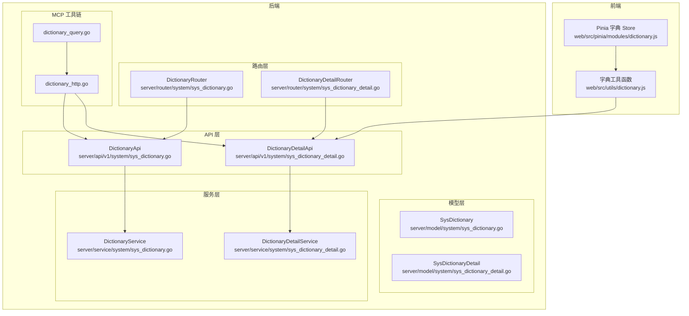
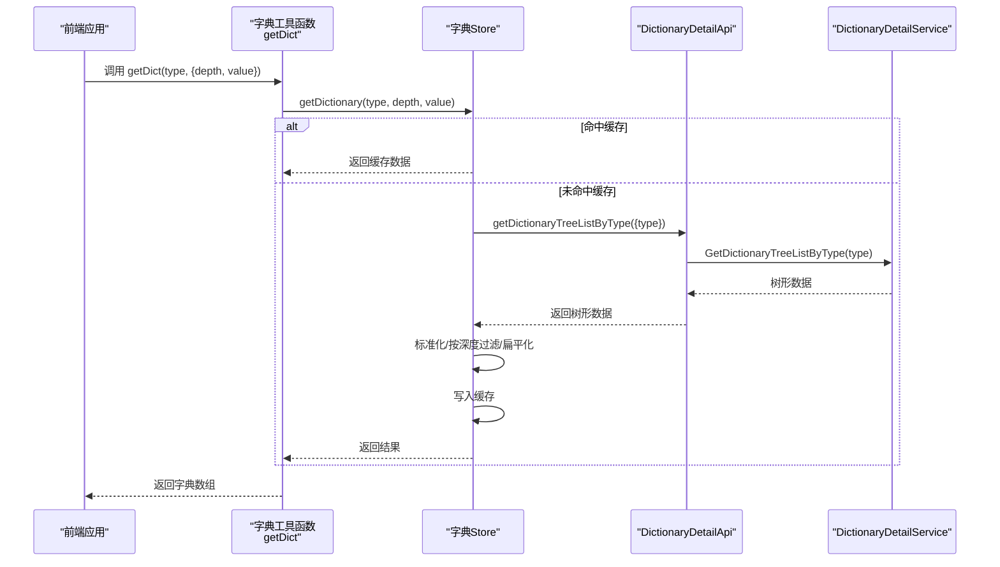
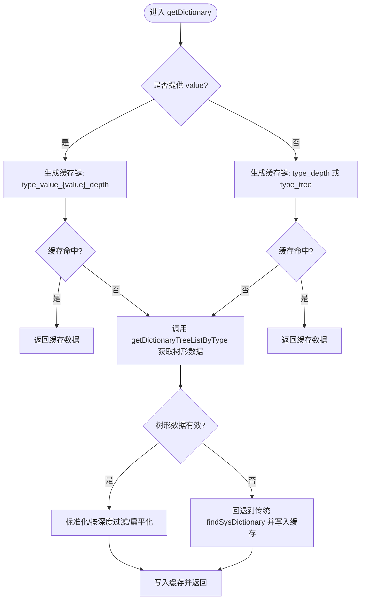
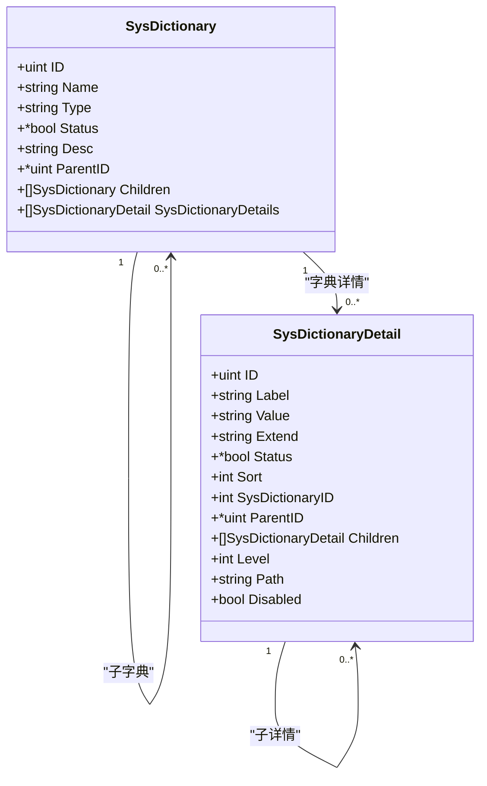
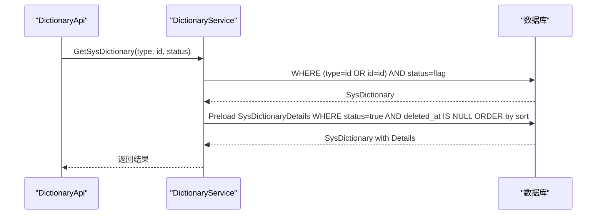
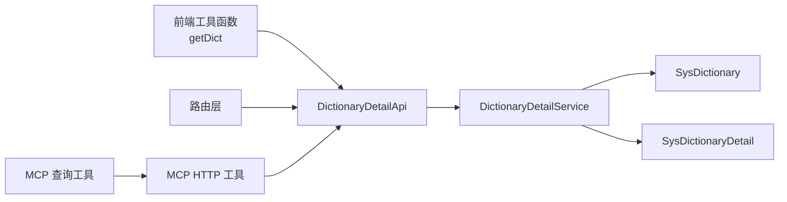

# 字典状态管理

<cite>
**本文档引用的文件**
- [web/src/pinia/modules/dictionary.js](file://web/src/pinia/modules/dictionary.js)
- [web/src/utils/dictionary.js](file://web/src/utils/dictionary.js)
- [server/model/system/sys_dictionary.go](file://server/model/system/sys_dictionary.go)
- [server/model/system/sys_dictionary_detail.go](file://server/model/system/sys_dictionary_detail.go)
- [server/api/v1/system/sys_dictionary.go](file://server/api/v1/system/sys_dictionary.go)
- [server/api/v1/system/sys_dictionary_detail.go](file://server/api/v1/system/sys_dictionary_detail.go)
- [server/service/system/sys_dictionary.go](file://server/service/system/sys_dictionary.go)
- [server/service/system/sys_dictionary_detail.go](file://server/service/system/sys_dictionary_detail.go)
- [server/router/system/sys_dictionary.go](file://server/router/system/sys_dictionary.go)
- [server/router/system/sys_dictionary_detail.go](file://server/router/system/sys_dictionary_detail.go)
- [server/mcp/dictionary_http.go](file://server/mcp/dictionary_http.go)
- [server/mcp/dictionary_query.go](file://server/mcp/dictionary_query.go)
</cite>

## 目录
1. [简介](#简介)
2. [项目结构](#项目结构)
3. [核心组件](#核心组件)
4. [架构总览](#架构总览)
5. [详细组件分析](#详细组件分析)
6. [依赖关系分析](#依赖关系分析)
7. [性能考虑](#性能考虑)
8. [故障排除指南](#故障排除指南)
9. [结论](#结论)
10. [附录](#附录)

## 简介
本文件面向测试管理平台的字典状态管理模块，系统性阐述前端字典状态存储与后端字典数据模型、服务层、API 层及 MCP 工具链的协作设计。重点覆盖：
- 前端 Pinia 字典 Store 的缓存策略与查询/过滤能力
- 后端字典与字典详情的数据模型与树形结构构建
- 字典数据的加载、更新与同步机制
- 本地缓存键设计、性能优化与最佳实践
- 实际使用示例与常见问题排查

## 项目结构
字典状态管理涉及前后端协同：
- 前端：Pinia Store 负责本地缓存与查询；工具函数提供统一的获取接口与标签展示
- 后端：模型定义字典与字典详情的树形结构；API 提供树形列表与按类型查询；服务层负责业务逻辑与树形构建；MCP 工具链支持外部查询与导入导出

**图表来源**
- [web/src/pinia/modules/dictionary.js:1-253](file://web/src/pinia/modules/dictionary.js#L1-L253)
- [web/src/utils/dictionary.js:1-94](file://web/src/utils/dictionary.js#L1-L94)
- [server/model/system/sys_dictionary.go:1-23](file://server/model/system/sys_dictionary.go#L1-L23)
- [server/model/system/sys_dictionary_detail.go:1-27](file://server/model/system/sys_dictionary_detail.go#L1-L27)
- [server/api/v1/system/sys_dictionary.go:1-192](file://server/api/v1/system/sys_dictionary.go#L1-L192)
- [server/api/v1/system/sys_dictionary_detail.go:1-268](file://server/api/v1/system/sys_dictionary_detail.go#L1-L268)
- [server/service/system/sys_dictionary.go:1-298](file://server/service/system/sys_dictionary.go#L1-L298)
- [server/service/system/sys_dictionary_detail.go:1-393](file://server/service/system/sys_dictionary_detail.go#L1-L393)
- [server/router/system/sys_dictionary.go:1-25](file://server/router/system/sys_dictionary.go#L1-L25)
- [server/router/system/sys_dictionary_detail.go:1-27](file://server/router/system/sys_dictionary_detail.go#L1-L27)
- [server/mcp/dictionary_http.go:1-74](file://server/mcp/dictionary_http.go#L1-L74)
- [server/mcp/dictionary_query.go:1-140](file://server/mcp/dictionary_query.go#L1-L140)

**章节来源**
- [web/src/pinia/modules/dictionary.js:1-253](file://web/src/pinia/modules/dictionary.js#L1-L253)
- [web/src/utils/dictionary.js:1-94](file://web/src/utils/dictionary.js#L1-L94)
- [server/model/system/sys_dictionary.go:1-23](file://server/model/system/sys_dictionary.go#L1-L23)
- [server/model/system/sys_dictionary_detail.go:1-27](file://server/model/system/sys_dictionary_detail.go#L1-L27)
- [server/api/v1/system/sys_dictionary.go:1-192](file://server/api/v1/system/sys_dictionary.go#L1-L192)
- [server/api/v1/system/sys_dictionary_detail.go:1-268](file://server/api/v1/system/sys_dictionary_detail.go#L1-L268)
- [server/service/system/sys_dictionary.go:1-298](file://server/service/system/sys_dictionary.go#L1-L298)
- [server/service/system/sys_dictionary_detail.go:1-393](file://server/service/system/sys_dictionary_detail.go#L1-L393)
- [server/router/system/sys_dictionary.go:1-25](file://server/router/system/sys_dictionary.go#L1-L25)
- [server/router/system/sys_dictionary_detail.go:1-27](file://server/router/system/sys_dictionary_detail.go#L1-L27)
- [server/mcp/dictionary_http.go:1-74](file://server/mcp/dictionary_http.go#L1-L74)
- [server/mcp/dictionary_query.go:1-140](file://server/mcp/dictionary_query.go#L1-L140)

## 核心组件
- 前端字典 Store：维护字典映射缓存，支持按类型、深度、指定节点 value 的查询与缓存命中；提供树形标准化、扁平化、按深度过滤等工具方法
- 字典工具函数：封装统一的 getDict 方法，负责参数校验、调用 Store、生成缓存键、返回结果
- 后端模型：SysDictionary 与 SysDictionaryDetail 定义字典与字典详情的树形结构字段与层级路径
- 服务层：提供字典与字典详情的增删改查、树形构建、父子关系校验、路径计算、按类型/父级查询等
- API 层：提供树形列表、按类型树形列表、按父级查询、路径查询等接口
- 路由层：注册字典与字典详情相关路由
- MCP 工具链：提供上游字典查询、导出、创建等 HTTP 工具，以及 AI 查询工具

**章节来源**
- [web/src/pinia/modules/dictionary.js:7-251](file://web/src/pinia/modules/dictionary.js#L7-L251)
- [web/src/utils/dictionary.js:38-74](file://web/src/utils/dictionary.js#L38-L74)
- [server/model/system/sys_dictionary.go:9-22](file://server/model/system/sys_dictionary.go#L9-L22)
- [server/model/system/sys_dictionary_detail.go:9-26](file://server/model/system/sys_dictionary_detail.go#L9-L26)
- [server/service/system/sys_dictionary.go:21-298](file://server/service/system/sys_dictionary.go#L21-L298)
- [server/service/system/sys_dictionary_detail.go:18-393](file://server/service/system/sys_dictionary_detail.go#L18-L393)
- [server/api/v1/system/sys_dictionary.go:12-192](file://server/api/v1/system/sys_dictionary.go#L12-L192)
- [server/api/v1/system/sys_dictionary_detail.go:15-268](file://server/api/v1/system/sys_dictionary_detail.go#L15-L268)
- [server/router/system/sys_dictionary.go:8-24](file://server/router/system/sys_dictionary.go#L8-L24)
- [server/router/system/sys_dictionary_detail.go:8-26](file://server/router/system/sys_dictionary_detail.go#L8-L26)
- [server/mcp/dictionary_http.go:12-74](file://server/mcp/dictionary_http.go#L12-L74)
- [server/mcp/dictionary_query.go:44-140](file://server/mcp/dictionary_query.go#L44-L140)

## 架构总览
前端通过工具函数调用 API 获取字典树形结构，Store 对结果进行缓存与转换；后端服务层负责树形构建与数据一致性校验。

**图表来源**
- [web/src/utils/dictionary.js:38-74](file://web/src/utils/dictionary.js#L38-L74)
- [web/src/pinia/modules/dictionary.js:117-245](file://web/src/pinia/modules/dictionary.js#L117-L245)
- [server/api/v1/system/sys_dictionary_detail.go:185-208](file://server/api/v1/system/sys_dictionary_detail.go#L185-L208)
- [server/service/system/sys_dictionary_detail.go:317-346](file://server/service/system/sys_dictionary_detail.go#L317-L346)

**章节来源**
- [web/src/utils/dictionary.js:38-74](file://web/src/utils/dictionary.js#L38-L74)
- [web/src/pinia/modules/dictionary.js:117-245](file://web/src/pinia/modules/dictionary.js#L117-L245)
- [server/api/v1/system/sys_dictionary_detail.go:185-208](file://server/api/v1/system/sys_dictionary_detail.go#L185-L208)
- [server/service/system/sys_dictionary_detail.go:317-346](file://server/service/system/sys_dictionary_detail.go#L317-L346)

## 详细组件分析

### 前端字典 Store（Pinia）
- 数据结构
  - dictionaryMap：以缓存键为索引的对象，存储不同查询维度的结果
- 查询与缓存
  - 支持按 type + depth 查询完整树或按深度过滤后的扁平数组
  - 支持按 type + value 查询指定节点的子节点，并可按 depth 限制层级
  - 缓存键规则：无 value 时使用 type_depth 或 type_tree；有 value 时使用 type_value_{value}_depth
- 工具方法
  - 标准化树形数据 normalizeTreeData
  - 按深度过滤 filterTreeByDepth
  - 树形扁平化 flattenTree
  - 按 value 查找节点 findNodeByValue

**图表来源**
- [web/src/pinia/modules/dictionary.js:117-245](file://web/src/pinia/modules/dictionary.js#L117-L245)

**章节来源**
- [web/src/pinia/modules/dictionary.js:7-251](file://web/src/pinia/modules/dictionary.js#L7-L251)

### 字典工具函数（getDict）
- 参数校验：type 必填且为非空字符串；depth 非负数
- 统一入口：调用 Store 的 getDictionary，随后按生成的缓存键取值
- 错误兜底：异常时返回空数组，保证调用方健壮性

**章节来源**
- [web/src/utils/dictionary.js:38-74](file://web/src/utils/dictionary.js#L38-L74)

### 后端模型（SysDictionary 与 SysDictionaryDetail）
- SysDictionary
  - 字段：name、type、status、desc、parentID、children、sysDictionaryDetails
  - 表名：sys_dictionaries
- SysDictionaryDetail
  - 字段：label、value、extend、status、sort、sys_dictionary_id、parentID、children、level、path、disabled
  - 表名：sys_dictionary_details
  - disabled 为运行时派生字段，基于 status 动态计算

**图表来源**
- [server/model/system/sys_dictionary.go:9-22](file://server/model/system/sys_dictionary.go#L9-L22)
- [server/model/system/sys_dictionary_detail.go:9-26](file://server/model/system/sys_dictionary_detail.go#L9-L26)

**章节来源**
- [server/model/system/sys_dictionary.go:9-22](file://server/model/system/sys_dictionary.go#L9-L22)
- [server/model/system/sys_dictionary_detail.go:9-26](file://server/model/system/sys_dictionary_detail.go#L9-L26)

### 服务层（DictionaryService 与 DictionaryDetailService）
- DictionaryService
  - 校验重复 type、循环引用检查、预加载字典详情并按 sort 排序
  - 导出/导入：清理 ID 与时间戳，事务内创建字典与详情，重建父子关系映射
- DictionaryDetailService
  - 自动计算 level 与 path，递归更新子项层级与路径
  - 树形构建：按父级为空的顶级项加载，递归填充 children，并设置 disabled
  - 按类型/父级查询、路径查询、按值查询等

**图表来源**
- [server/api/v1/system/sys_dictionary.go:89-112](file://server/api/v1/system/sys_dictionary.go#L89-L112)
- [server/service/system/sys_dictionary.go:101-112](file://server/service/system/sys_dictionary.go#L101-L112)

**章节来源**
- [server/service/system/sys_dictionary.go:21-298](file://server/service/system/sys_dictionary.go#L21-L298)
- [server/service/system/sys_dictionary_detail.go:18-393](file://server/service/system/sys_dictionary_detail.go#L18-L393)

### API 层（DictionaryApi 与 DictionaryDetailApi）
- DictionaryApi：创建/删除/更新字典、按条件查询、分页列表、导入导出
- DictionaryDetailApi：创建/删除/更新字典详情、按 ID/列表/树形/父级/路径查询

**章节来源**
- [server/api/v1/system/sys_dictionary.go:12-192](file://server/api/v1/system/sys_dictionary.go#L12-L192)
- [server/api/v1/system/sys_dictionary_detail.go:15-268](file://server/api/v1/system/sys_dictionary_detail.go#L15-L268)

### 路由层（DictionaryRouter 与 DictionaryDetailRouter）
- 注册字典与字典详情相关路由，区分带操作记录与不带操作记录的组

**章节来源**
- [server/router/system/sys_dictionary.go:8-24](file://server/router/system/sys_dictionary.go#L8-L24)
- [server/router/system/sys_dictionary_detail.go:8-26](file://server/router/system/sys_dictionary_detail.go#L8-L26)

### MCP 工具链（dictionary_http.go 与 dictionary_query.go）
- dictionary_http.go：封装上游字典列表查询、按类型查找、导出、创建字典与详情等 HTTP 工具
- dictionary_query.go：AI 查询工具，支持按类型筛选、包含禁用项、仅返回详情等

**章节来源**
- [server/mcp/dictionary_http.go:12-74](file://server/mcp/dictionary_http.go#L12-L74)
- [server/mcp/dictionary_query.go:44-140](file://server/mcp/dictionary_query.go#L44-L140)

## 依赖关系分析
- 前端依赖后端 API 提供的树形结构与按类型查询接口
- Store 依赖工具函数进行参数校验与缓存键生成
- 服务层依赖 GORM 进行树形构建与父子关系校验
- 路由层将请求转发至对应 API 控制器
- MCP 工具链依赖上游服务完成跨进程/跨服务的字典查询与导入导出

**图表来源**
- [web/src/utils/dictionary.js:38-74](file://web/src/utils/dictionary.js#L38-L74)
- [server/api/v1/system/sys_dictionary_detail.go:185-208](file://server/api/v1/system/sys_dictionary_detail.go#L185-L208)
- [server/service/system/sys_dictionary_detail.go:317-346](file://server/service/system/sys_dictionary_detail.go#L317-L346)
- [server/model/system/sys_dictionary.go:9-22](file://server/model/system/sys_dictionary.go#L9-L22)
- [server/model/system/sys_dictionary_detail.go:9-26](file://server/model/system/sys_dictionary_detail.go#L9-L26)
- [server/router/system/sys_dictionary_detail.go:8-26](file://server/router/system/sys_dictionary_detail.go#L8-L26)
- [server/mcp/dictionary_http.go:12-74](file://server/mcp/dictionary_http.go#L12-L74)
- [server/mcp/dictionary_query.go:44-140](file://server/mcp/dictionary_query.go#L44-L140)

**章节来源**
- [web/src/utils/dictionary.js:38-74](file://web/src/utils/dictionary.js#L38-L74)
- [server/api/v1/system/sys_dictionary_detail.go:185-208](file://server/api/v1/system/sys_dictionary_detail.go#L185-L208)
- [server/service/system/sys_dictionary_detail.go:317-346](file://server/service/system/sys_dictionary_detail.go#L317-L346)
- [server/router/system/sys_dictionary_detail.go:8-26](file://server/router/system/sys_dictionary_detail.go#L8-L26)
- [server/mcp/dictionary_http.go:12-74](file://server/mcp/dictionary_http.go#L12-L74)
- [server/mcp/dictionary_query.go:44-140](file://server/mcp/dictionary_query.go#L44-L140)

## 性能考虑
- 前端缓存策略
  - 以 type + depth + value 组合生成缓存键，避免重复网络请求
  - 按需裁剪树形结构：depth=0 返回完整树，其他值按深度过滤后再扁平化，减少渲染开销
- 后端树形构建
  - 服务层按 sort 顺序加载，避免额外排序成本
  - 递归加载 children 时一次性设置 disabled，减少多次查询
- 数据库访问
  - 预加载字典详情并按状态过滤，减少 N+1 查询风险
  - 导入/导出时使用事务，批量创建详情并重建父子关系映射
- MCP 工具链
  - 上游查询采用分页与条件过滤，降低传输与解析成本

[本节为通用性能建议，无需特定文件来源]

## 故障排除指南
- 前端
  - getDict 参数校验失败：检查 type 是否为非空字符串，depth 是否为非负数
  - 缓存未命中：确认后端树形接口返回有效数据；若无树形数据，Store 会回退到传统接口
  - 节点查找失败：当按 value 查找不到节点时返回空数组，检查字典类型与 value 是否正确
- 后端
  - 循环引用：更新字典或字典详情时会进行循环引用检查，违反约束会报错
  - 删除失败：字典详情下仍有子项时禁止删除
  - 导入失败：JSON 格式错误或必填字段缺失会导致导入失败
- API
  - 树形接口参数校验：字典 ID/类型不能为空；格式错误会返回错误信息

**章节来源**
- [web/src/utils/dictionary.js:45-54](file://web/src/utils/dictionary.js#L45-L54)
- [web/src/pinia/modules/dictionary.js:117-170](file://web/src/pinia/modules/dictionary.js#L117-L170)
- [server/service/system/sys_dictionary.go:133-155](file://server/service/system/sys_dictionary.go#L133-L155)
- [server/service/system/sys_dictionary_detail.go:50-64](file://server/service/system/sys_dictionary_detail.go#L50-L64)
- [server/api/v1/system/sys_dictionary_detail.go:152-208](file://server/api/v1/system/sys_dictionary_detail.go#L152-L208)

## 结论
字典状态管理模块通过“前端 Store 缓存 + 后端树形模型 + 服务层一致性校验 + API 树形接口”的组合，实现了高效、可扩展的字典数据管理。前端按需裁剪与缓存策略显著降低了网络与渲染压力；后端通过父子关系校验与路径计算保障了树形结构的完整性。配合 MCP 工具链，进一步增强了系统的可集成性与智能化能力。

[本节为总结性内容，无需特定文件来源]

## 附录

### 字典数据结构与分类组织
- 字典（SysDictionary）
  - 英文类型标识（type）、中文名称（name）、状态（status）、描述（desc）
  - 支持父子关系（parent_id），形成多级字典树
- 字典详情（SysDictionaryDetail）
  - 展示值（label）、字典值（value）、扩展值（extend）、排序（sort）、层级（level）、路径（path）
  - 支持父子关系（parent_id），形成多级字典详情树
  - disabled 字段根据 status 动态计算，用于禁用状态展示

**章节来源**
- [server/model/system/sys_dictionary.go:9-22](file://server/model/system/sys_dictionary.go#L9-L22)
- [server/model/system/sys_dictionary_detail.go:9-26](file://server/model/system/sys_dictionary_detail.go#L9-L26)

### 加载、更新与同步机制
- 加载
  - 前端通过 getDict(type, {depth, value}) 获取数据；Store 命中缓存则直接返回，否则调用后端树形接口并写入缓存
- 更新
  - 后端更新字典或详情时进行循环引用检查与层级/路径重算；更新父级会触发子项层级与路径的递归更新
- 同步
  - MCP 工具链提供上游查询与导入导出能力，支持跨服务的字典同步

**章节来源**
- [web/src/utils/dictionary.js:38-74](file://web/src/utils/dictionary.js#L38-L74)
- [web/src/pinia/modules/dictionary.js:117-245](file://web/src/pinia/modules/dictionary.js#L117-L245)
- [server/service/system/sys_dictionary_detail.go:125-160](file://server/service/system/sys_dictionary_detail.go#L125-L160)
- [server/mcp/dictionary_http.go:12-74](file://server/mcp/dictionary_http.go#L12-L74)

### 本地缓存策略与性能优化
- 缓存键设计
  - 无 value：type_depth（depth>0）或 type_tree（depth=0）
  - 有 value：type_value_{value}_depth
- 性能优化
  - 按深度过滤后扁平化，减少渲染节点数量
  - 预加载与排序，避免额外查询
  - 事务导入，批量重建父子关系映射

**章节来源**
- [web/src/pinia/modules/dictionary.js:10-15](file://web/src/pinia/modules/dictionary.js#L10-L15)
- [web/src/pinia/modules/dictionary.js:173-204](file://web/src/pinia/modules/dictionary.js#L173-L204)
- [server/service/system/sys_dictionary.go:234-296](file://server/service/system/sys_dictionary.go#L234-L296)

### 查询与过滤方法
- 前端
  - getDict(type, {depth, value})：按类型、深度、节点 value 查询
  - 标准化/过滤/扁平化工具方法：normalizeTreeData、filterTreeByDepth、flattenTree、findNodeByValue
- 后端
  - 按类型树形列表：GetDictionaryTreeListByType
  - 按父级查询：GetDictionaryDetailsByParent
  - 路径查询：GetDictionaryPath、GetDictionaryPathByValue
  - 按值查询：GetDictionaryInfoByValue、GetDictionaryInfoByTypeValue

**章节来源**
- [web/src/utils/dictionary.js:38-74](file://web/src/utils/dictionary.js#L38-L74)
- [web/src/pinia/modules/dictionary.js:63-115](file://web/src/pinia/modules/dictionary.js#L63-L115)
- [server/api/v1/system/sys_dictionary_detail.go:185-267](file://server/api/v1/system/sys_dictionary_detail.go#L185-L267)
- [server/service/system/sys_dictionary_detail.go:272-392](file://server/service/system/sys_dictionary_detail.go#L272-L392)

### 实际使用示例与最佳实践
- 示例
  - 获取完整树形结构：getDict('user_status')
  - 获取指定深度的扁平数据：getDict('user_status', {depth: 2})
  - 获取指定节点的子节点：getDict('user_status', {value: 'active'})
- 最佳实践
  - 前端统一通过 getDict 调用，避免分散的 API 请求
  - 合理设置 depth，避免一次性加载过多节点导致性能问题
  - 在需要禁用项时，结合后端 status 字段与前端 disabled 字段进行展示控制
  - 导入字典时使用事务，确保数据一致性

**章节来源**
- [web/src/utils/dictionary.js:24-37](file://web/src/utils/dictionary.js#L24-L37)
- [web/src/utils/dictionary.js:38-74](file://web/src/utils/dictionary.js#L38-L74)
- [server/service/system/sys_dictionary.go:234-296](file://server/service/system/sys_dictionary.go#L234-L296)