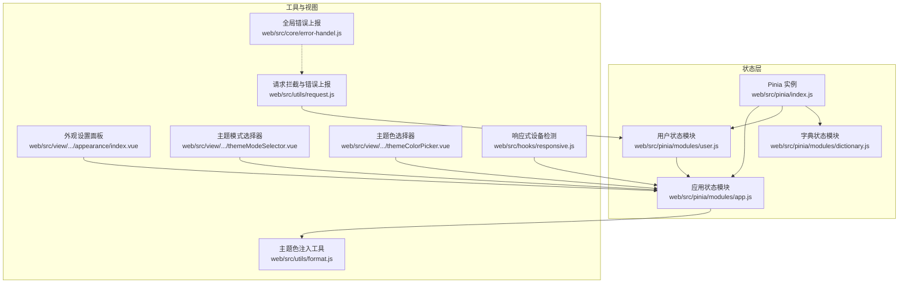
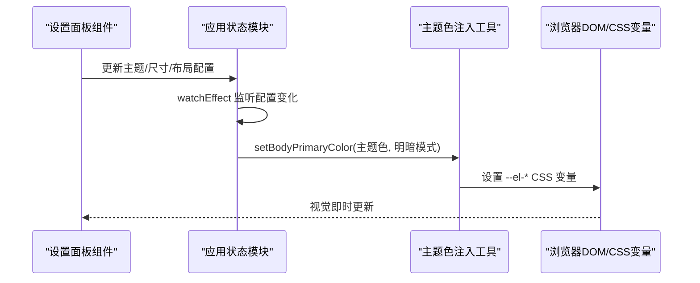
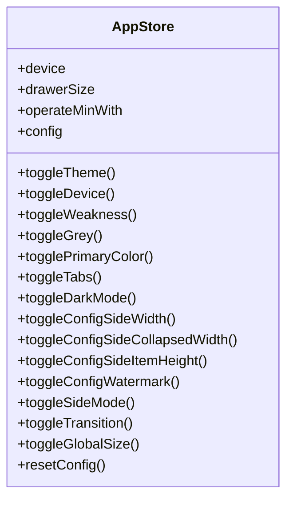
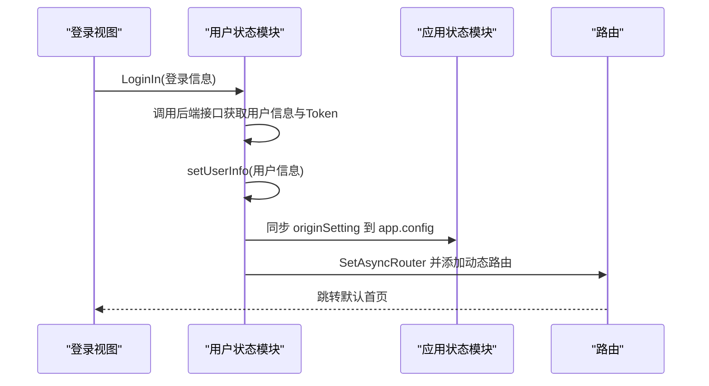
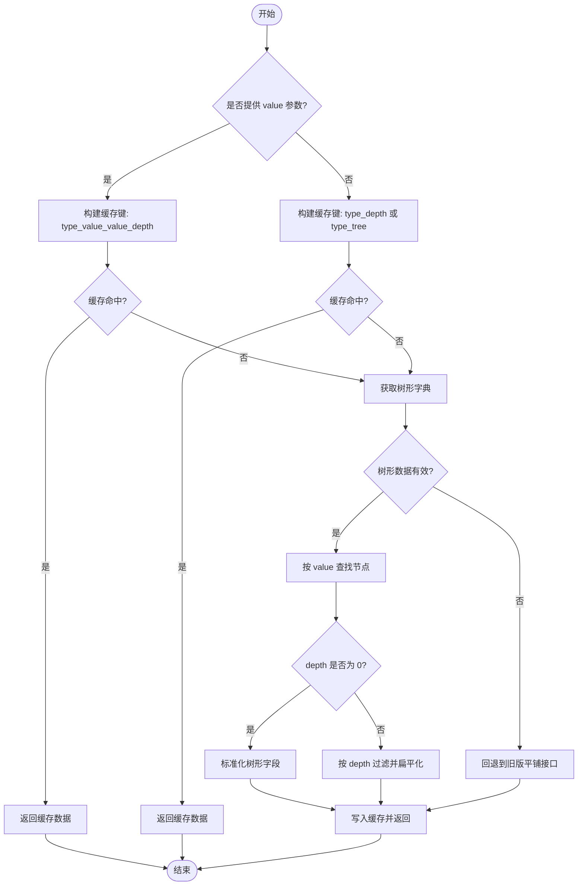
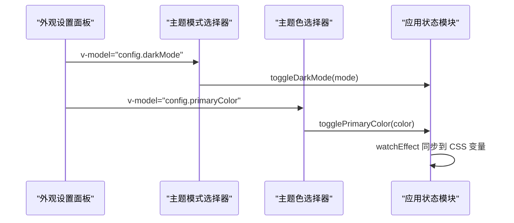
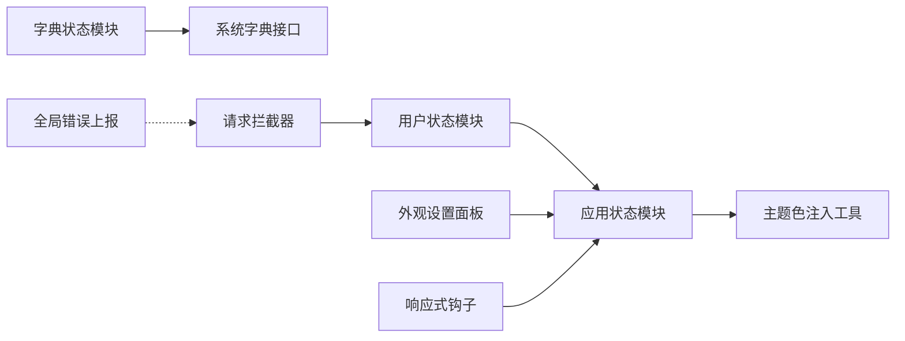

# 应用状态管理

<cite>
**本文引用的文件**
- [web/src/pinia/index.js](file://web/src/pinia/index.js)
- [web/src/pinia/modules/app.js](file://web/src/pinia/modules/app.js)
- [web/src/pinia/modules/user.js](file://web/src/pinia/modules/user.js)
- [web/src/pinia/modules/dictionary.js](file://web/src/pinia/modules/dictionary.js)
- [web/src/utils/format.js](file://web/src/utils/format.js)
- [web/src/view/layout/setting/modules/appearance/index.vue](file://web/src/view/layout/setting/modules/appearance/index.vue)
- [web/src/view/layout/setting/components/themeModeSelector.vue](file://web/src/view/layout/setting/components/themeModeSelector.vue)
- [web/src/view/layout/setting/components/themeColorPicker.vue](file://web/src/view/layout/setting/components/themeColorPicker.vue)
- [web/src/view/layout/tabs/index.vue](file://web/src/view/layout/tabs/index.vue)
- [web/src/hooks/responsive.js](file://web/src/hooks/responsive.js)
- [web/src/utils/request.js](file://web/src/utils/request.js)
- [web/src/core/error-handel.js](file://web/src/core/error-handel.js)
- [web/src/core/global.js](file://web/src/core/global.js)
</cite>

## 目录
1. [引言](#引言)
2. [项目结构](#项目结构)
3. [核心组件](#核心组件)
4. [架构总览](#架构总览)
5. [详细组件分析](#详细组件分析)
6. [依赖关系分析](#依赖关系分析)
7. [性能考量](#性能考量)
8. [故障排查指南](#故障排查指南)
9. [结论](#结论)
10. [附录](#附录)

## 引言
本文件面向测试管理平台的“应用状态管理”模块，系统性阐述前端基于 Pinia 的应用状态设计与实现，覆盖应用配置、主题设置、布局状态、响应式更新、组件间共享、持久化与恢复、日志与调试等方面。文档以代码为依据，结合可视化图示，帮助开发者快速理解与高效使用。

## 项目结构
应用状态管理主要由以下层次构成：
- 状态入口与聚合：Pinia 实例与导出的模块 Store
- 应用状态模块：app.js 提供主题、布局、设备、全局尺寸等配置
- 用户状态模块：user.js 管理登录态、用户信息与与应用配置的联动
- 字典状态模块：dictionary.js 提供字典树与扁平化数据的缓存与查询
- 工具与视图：format.js 负责主题色注入；设置面板组件负责 UI 交互；响应式钩子负责设备切换；请求拦截器与错误上报负责日志与调试

图表来源
- [web/src/pinia/index.js:1-9](file://web/src/pinia/index.js#L1-L9)
- [web/src/pinia/modules/app.js:1-163](file://web/src/pinia/modules/app.js#L1-L163)
- [web/src/pinia/modules/user.js:1-151](file://web/src/pinia/modules/user.js#L1-L151)
- [web/src/pinia/modules/dictionary.js:1-253](file://web/src/pinia/modules/dictionary.js#L1-L253)
- [web/src/utils/format.js:1-176](file://web/src/utils/format.js#L1-L176)
- [web/src/view/layout/setting/modules/appearance/index.vue:1-107](file://web/src/view/layout/setting/modules/appearance/index.vue#L1-L107)
- [web/src/view/layout/setting/components/themeModeSelector.vue:1-70](file://web/src/view/layout/setting/components/themeModeSelector.vue#L1-L70)
- [web/src/view/layout/setting/components/themeColorPicker.vue:1-151](file://web/src/view/layout/setting/components/themeColorPicker.vue#L1-L151)
- [web/src/hooks/responsive.js:1-35](file://web/src/hooks/responsive.js#L1-L35)
- [web/src/utils/request.js:1-232](file://web/src/utils/request.js#L1-L232)
- [web/src/core/error-handel.js:1-24](file://web/src/core/error-handel.js#L1-L24)

章节来源
- [web/src/pinia/index.js:1-9](file://web/src/pinia/index.js#L1-L9)
- [web/src/pinia/modules/app.js:1-163](file://web/src/pinia/modules/app.js#L1-L163)
- [web/src/pinia/modules/user.js:1-151](file://web/src/pinia/modules/user.js#L1-L151)
- [web/src/pinia/modules/dictionary.js:1-253](file://web/src/pinia/modules/dictionary.js#L1-L253)
- [web/src/utils/format.js:1-176](file://web/src/utils/format.js#L1-L176)
- [web/src/view/layout/setting/modules/appearance/index.vue:1-107](file://web/src/view/layout/setting/modules/appearance/index.vue#L1-L107)
- [web/src/view/layout/setting/components/themeModeSelector.vue:1-70](file://web/src/view/layout/setting/components/themeModeSelector.vue#L1-L70)
- [web/src/view/layout/setting/components/themeColorPicker.vue:1-151](file://web/src/view/layout/setting/components/themeColorPicker.vue#L1-L151)
- [web/src/hooks/responsive.js:1-35](file://web/src/hooks/responsive.js#L1-L35)
- [web/src/utils/request.js:1-232](file://web/src/utils/request.js#L1-L232)
- [web/src/core/error-handel.js:1-24](file://web/src/core/error-handel.js#L1-L24)

## 核心组件
- 应用状态模块（app）
  - 职责：集中管理主题模式、主色、全局尺寸、布局宽度、侧边栏折叠宽度、条目高度、标签页显示、水印、过渡动画、设备与抽屉尺寸等
  - 关键能力：响应式监听（watchEffect）、主题色注入（CSS 变量）、自动/跟随系统主题切换、配置重置
- 用户状态模块（user）
  - 职责：登录、登出、获取用户信息、与应用配置联动（originSetting 同步）
  - 关键能力：Token 管理、路由初始化、清理存储
- 字典状态模块（dictionary）
  - 职责：树形字典数据的获取、缓存、扁平化、按层级过滤、按 value 查询子节点
  - 关键能力：缓存键拼接、错误回退、标准化字段
- 工具与视图
  - 主题色注入：通过 CSS 自定义属性动态设置 Element Plus 主题变量
  - 设置面板：外观设置、主题模式、主题色、全局尺寸、视觉辅助（灰色/色弱/水印）
  - 响应式设备检测：根据窗口宽度切换移动端/桌面端布局
  - 请求拦截与错误上报：统一加载、错误提示与日志上报

章节来源
- [web/src/pinia/modules/app.js:1-163](file://web/src/pinia/modules/app.js#L1-L163)
- [web/src/pinia/modules/user.js:1-151](file://web/src/pinia/modules/user.js#L1-L151)
- [web/src/pinia/modules/dictionary.js:1-253](file://web/src/pinia/modules/dictionary.js#L1-L253)
- [web/src/utils/format.js:1-176](file://web/src/utils/format.js#L1-L176)
- [web/src/view/layout/setting/modules/appearance/index.vue:1-107](file://web/src/view/layout/setting/modules/appearance/index.vue#L1-L107)
- [web/src/hooks/responsive.js:1-35](file://web/src/hooks/responsive.js#L1-L35)
- [web/src/utils/request.js:1-232](file://web/src/utils/request.js#L1-L232)

## 架构总览
应用状态管理采用“模块化 Store + 视图组件驱动”的架构：
- Store 通过响应式 API（ref/reactive/watchEffect）实现状态变更的自动传播
- 视图组件通过 Pinia 的 storeToRefs 或直接使用 Store 实例进行读取与写入
- 工具函数（如主题色注入）在 watchEffect 中监听状态变化并同步到 DOM/CSS 变量
- 用户状态与应用配置存在联动（用户 originSetting -> app.config）

图表来源
- [web/src/view/layout/setting/modules/appearance/index.vue:1-107](file://web/src/view/layout/setting/modules/appearance/index.vue#L1-L107)
- [web/src/pinia/modules/app.js:1-163](file://web/src/pinia/modules/app.js#L1-L163)
- [web/src/utils/format.js:1-176](file://web/src/utils/format.js#L1-L176)

## 详细组件分析

### 应用状态模块（app）
- 数据结构
  - 设备类型、抽屉尺寸、最小操作宽度
  - 配置对象：主题模式、主色、标签页显示、明暗模式、布局宽度、折叠宽度、条目高度、水印、侧边栏模式、页面过渡动画、全局尺寸
- 关键方法
  - 切换主题模式、主色、标签页、明暗模式、布局宽度、折叠宽度、条目高度、水印、侧边栏模式、过渡动画、全局尺寸
  - 重置配置为默认值
- 响应式机制
  - 使用 watchEffect 监听明暗模式与系统偏好、色弱/灰色模式、主题色
  - 通过 setBodyPrimaryColor 将主题色映射为 Element Plus 的 CSS 变量
- 组件共享
  - 通过 Pinia 导出的 useAppStore 在任意组件中共享与修改

图表来源
- [web/src/pinia/modules/app.js:1-163](file://web/src/pinia/modules/app.js#L1-L163)

章节来源
- [web/src/pinia/modules/app.js:1-163](file://web/src/pinia/modules/app.js#L1-L163)
- [web/src/utils/format.js:1-176](file://web/src/utils/format.js#L1-L176)

### 用户状态模块（user）
- 数据结构
  - 用户信息、Token（本地存储与 Cookie 双通道）
- 关键方法
  - 登录、登出、获取用户信息、NeedInit、重置用户信息、清理存储
  - 与应用配置联动：setUserInfo 支持从用户 originSetting 同步 app.config
- 持久化与恢复
  - Token 使用本地存储与 Cookie；登出/异常时清理存储并跳转登录页

图表来源
- [web/src/pinia/modules/user.js:1-151](file://web/src/pinia/modules/user.js#L1-L151)
- [web/src/pinia/modules/app.js:1-163](file://web/src/pinia/modules/app.js#L1-L163)

章节来源
- [web/src/pinia/modules/user.js:1-151](file://web/src/pinia/modules/user.js#L1-L151)

### 字典状态模块（dictionary）
- 功能要点
  - 树形字典数据获取与缓存
  - 按层级过滤与扁平化
  - 按 value 查找子节点并返回 children
  - 缓存键包含 type、depth、value 等维度
  - 错误回退：树形失败时回退到旧版平铺接口
- 性能特性
  - 基于内存缓存减少重复请求
  - 递归遍历与扁平化处理，时间复杂度与树高/分支数相关

图表来源
- [web/src/pinia/modules/dictionary.js:1-253](file://web/src/pinia/modules/dictionary.js#L1-L253)

章节来源
- [web/src/pinia/modules/dictionary.js:1-253](file://web/src/pinia/modules/dictionary.js#L1-L253)

### 设置面板与主题交互
- 外观设置面板
  - 主题模式：浅色/深色/跟随系统
  - 主题色：预设色板与自定义色
  - 全局尺寸：默认/大/小
  - 视觉辅助：灰色模式、色弱模式、显示水印
- 交互流程
  - 组件通过 v-model 与 appStore.toggle* 方法绑定
  - watchEffect 自动同步到 DOM/CSS 变量

图表来源
- [web/src/view/layout/setting/modules/appearance/index.vue:1-107](file://web/src/view/layout/setting/modules/appearance/index.vue#L1-L107)
- [web/src/view/layout/setting/components/themeModeSelector.vue:1-70](file://web/src/view/layout/setting/components/themeModeSelector.vue#L1-L70)
- [web/src/view/layout/setting/components/themeColorPicker.vue:1-151](file://web/src/view/layout/setting/components/themeColorPicker.vue#L1-L151)
- [web/src/pinia/modules/app.js:1-163](file://web/src/pinia/modules/app.js#L1-L163)

章节来源
- [web/src/view/layout/setting/modules/appearance/index.vue:1-107](file://web/src/view/layout/setting/modules/appearance/index.vue#L1-L107)
- [web/src/view/layout/setting/components/themeModeSelector.vue:1-70](file://web/src/view/layout/setting/components/themeModeSelector.vue#L1-L70)
- [web/src/view/layout/setting/components/themeColorPicker.vue:1-151](file://web/src/view/layout/setting/components/themeColorPicker.vue#L1-L151)

### 响应式与设备适配
- 响应式钩子
  - 监听窗口 resize，根据阈值切换移动端/桌面端
  - 通过 appStore.toggleDevice 更新设备状态与抽屉尺寸
- 作用范围
  - 为布局、抽屉宽度、最小操作宽度等提供运行时调整

章节来源
- [web/src/hooks/responsive.js:1-35](file://web/src/hooks/responsive.js#L1-L35)
- [web/src/pinia/modules/app.js:1-163](file://web/src/pinia/modules/app.js#L1-L163)

### 持久化与恢复
- 应用配置持久化
  - 用户登录后，originSetting 会同步到 app.config，实现用户偏好的持久化
- 页面历史与标签页
  - tabs 组件使用 sessionStorage 存储历史与活动页，实现刷新后恢复
- Token 与 Cookie
  - 用户状态模块使用本地存储与 Cookie 管理 Token，支持跨会话登录态保持

章节来源
- [web/src/pinia/modules/user.js:1-151](file://web/src/pinia/modules/user.js#L1-L151)
- [web/src/view/layout/tabs/index.vue:259-304](file://web/src/view/layout/tabs/index.vue#L259-L304)

### 日志记录与调试
- 请求拦截与错误上报
  - 统一处理加载、错误提示、401 跳转登录
  - 通过事件总线发射错误信息，便于统一展示
- 全局未捕获错误
  - 监听 unhandledrejection，收集错误信息并上报
- 全局图标注册与日志
  - 全局组件注册与开发模式下的图标列表输出，便于定位问题

章节来源
- [web/src/utils/request.js:1-232](file://web/src/utils/request.js#L1-L232)
- [web/src/core/error-handel.js:1-24](file://web/src/core/error-handel.js#L1-L24)
- [web/src/core/global.js:1-64](file://web/src/core/global.js#L1-L64)

## 依赖关系分析
- 模块内聚与耦合
  - app 与 user 存在弱耦合：user.setUserInfo 会同步 originSetting 到 app.config
  - dictionary 与 API 层解耦，内部封装缓存与回退策略
- 外部依赖
  - Vue 响应式系统（ref/reactive/watchEffect）
  - Element Plus 组件与图标
  - Axios 请求拦截器与 Element Plus 加载/消息组件

图表来源
- [web/src/pinia/modules/user.js:1-151](file://web/src/pinia/modules/user.js#L1-L151)
- [web/src/pinia/modules/dictionary.js:1-253](file://web/src/pinia/modules/dictionary.js#L1-L253)
- [web/src/pinia/modules/app.js:1-163](file://web/src/pinia/modules/app.js#L1-L163)
- [web/src/utils/format.js:1-176](file://web/src/utils/format.js#L1-L176)
- [web/src/view/layout/setting/modules/appearance/index.vue:1-107](file://web/src/view/layout/setting/modules/appearance/index.vue#L1-L107)
- [web/src/hooks/responsive.js:1-35](file://web/src/hooks/responsive.js#L1-L35)
- [web/src/utils/request.js:1-232](file://web/src/utils/request.js#L1-L232)
- [web/src/core/error-handel.js:1-24](file://web/src/core/error-handel.js#L1-L24)

## 性能考量
- 状态粒度
  - 将主题、布局、设备等拆分到 app，避免无关状态频繁触发渲染
- 计算与缓存
  - dictionary 模块对树形数据进行缓存，减少重复请求
- 响应式开销
  - watchEffect 仅监听必要字段，避免过度订阅
- 请求与加载
  - 请求拦截器统一管理加载状态，防止长时间阻塞 UI

## 故障排查指南
- 登录后主题/尺寸未生效
  - 检查用户 originSetting 是否正确下发与同步
  - 确认 app.config 的 watchEffect 是否执行
- 主题色不更新
  - 检查 setBodyPrimaryColor 是否被调用
  - 确认 CSS 变量是否被正确设置
- 字典数据为空或异常
  - 查看缓存键是否正确
  - 观察回退逻辑是否触发
- 401 未跳转登录
  - 检查请求拦截器中的 401 分支与用户存储清理逻辑
- 全局错误未上报
  - 检查全局错误上报脚本是否加载
  - 确认事件总线与错误展示组件是否正常

章节来源
- [web/src/pinia/modules/user.js:1-151](file://web/src/pinia/modules/user.js#L1-L151)
- [web/src/pinia/modules/app.js:1-163](file://web/src/pinia/modules/app.js#L1-L163)
- [web/src/pinia/modules/dictionary.js:1-253](file://web/src/pinia/modules/dictionary.js#L1-L253)
- [web/src/utils/request.js:1-232](file://web/src/utils/request.js#L1-L232)
- [web/src/core/error-handel.js:1-24](file://web/src/core/error-handel.js#L1-L24)

## 结论
本应用状态管理模块以 Pinia 为核心，围绕“主题/布局/设备/尺寸”等应用级配置构建，配合用户偏好同步、字典缓存与统一请求/错误处理，形成清晰、可维护且易扩展的状态体系。通过 watchEffect 与 CSS 变量实现响应式更新，通过 originSetting 与 sessionStorage 实现持久化与恢复，满足测试管理平台的多样化使用场景。

## 附录
- 最佳实践
  - 将 UI 相关配置收敛到 app 模块，避免分散在多个组件
  - 使用 originSetting 同步用户偏好，避免重复本地存储
  - 对高频字典请求启用缓存，合理设置缓存键
  - 在组件中优先使用 storeToRefs 读取响应式状态，减少不必要的解构
  - 对外暴露明确的 toggle 方法，便于统一调试与追踪