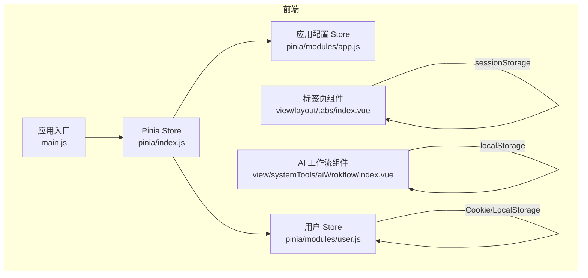
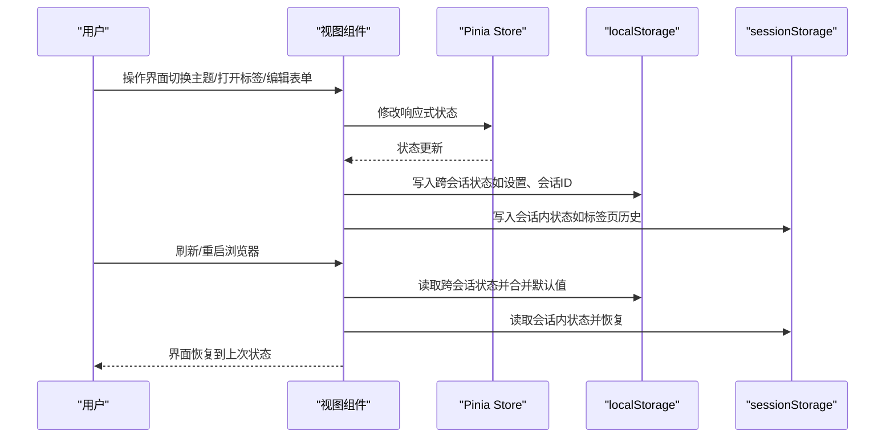
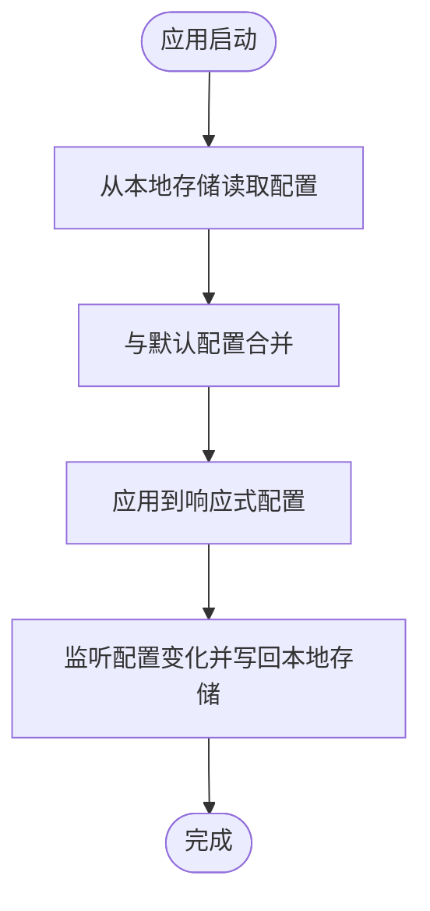
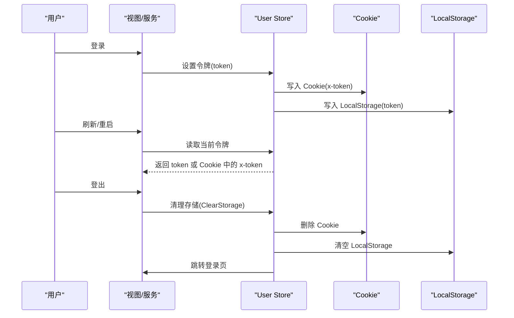
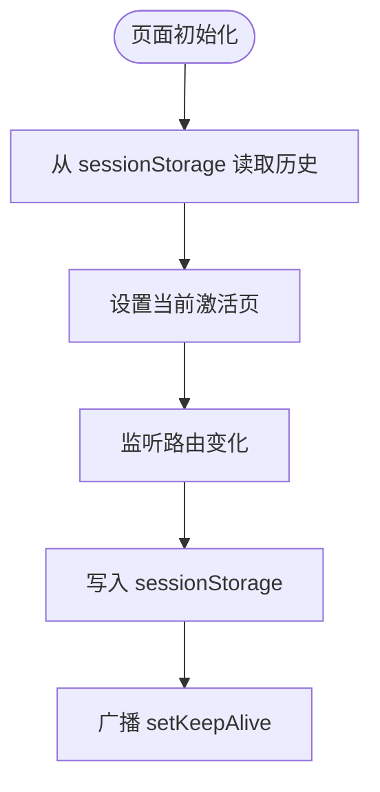
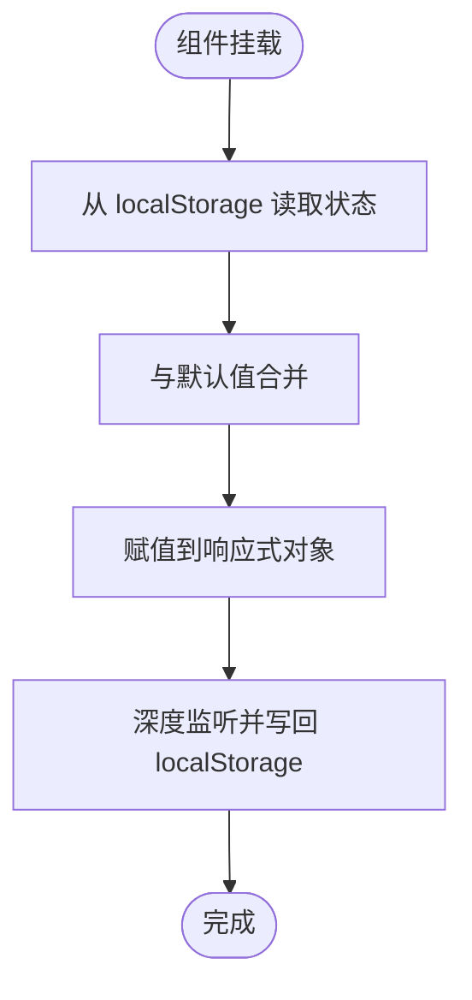
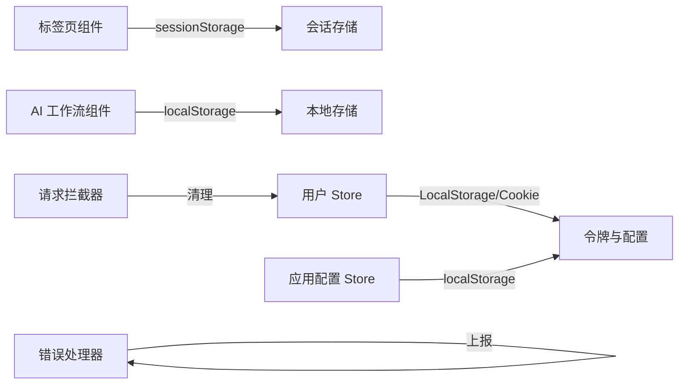

# 状态持久化

<cite>
**本文引用的文件**
- [web/src/view/layout/tabs/index.vue](file://web/src/view/layout/tabs/index.vue)
- [web/src/pinia/modules/user.js](file://web/src/pinia/modules/user.js)
- [web/src/pinia/modules/app.js](file://web/src/pinia/modules/app.js)
- [web/src/pinia/index.js](file://web/src/pinia/index.js)
- [web/src/view/systemTools/aiWrokflow/index.vue](file://web/src/view/systemTools/aiWrokflow/index.vue)
- [web/src/utils/request.js](file://web/src/utils/request.js)
- [web/src/core/error-handel.js](file://web/src/core/error-handel.js)
- [web/src/main.js](file://web/src/main.js)
</cite>

## 目录
1. [引言](#引言)
2. [项目结构](#项目结构)
3. [核心组件](#核心组件)
4. [架构总览](#架构总览)
5. [详细组件分析](#详细组件分析)
6. [依赖关系分析](#依赖关系分析)
7. [性能考量](#性能考量)
8. [故障排除指南](#故障排除指南)
9. [结论](#结论)
10. [附录](#附录)

## 引言
本文件聚焦于测试管理平台前端的状态持久化机制，系统性阐述本地存储策略、需要持久化的状态类型、持久化时机与方式、localStorage 与 sessionStorage 的使用场景与注意事项、状态恢复流程与数据格式转换、状态版本管理与兼容性处理，并提供配置示例与故障排除方法。目标是帮助开发者与运维人员快速理解并维护状态持久化能力。

## 项目结构
本项目采用前后端分离架构，前端基于 Vue 3 + Pinia，后端基于 Go。状态持久化主要发生在前端，涉及以下关键位置：
- 应用配置与主题偏好：通过 Pinia Store 与本地存储联动
- 用户会话与令牌：通过 Cookie 与本地存储结合
- 页面标签页历史：通过 sessionStorage 实现跨页会话恢复
- AI 工作流等复杂业务状态：通过 localStorage 实现跨会话恢复

**图表来源**
- [web/src/main.js:1-38](file://web/src/main.js#L1-L38)
- [web/src/pinia/index.js:1-9](file://web/src/pinia/index.js#L1-L9)
- [web/src/pinia/modules/app.js:1-163](file://web/src/pinia/modules/app.js#L1-L163)
- [web/src/pinia/modules/user.js:1-151](file://web/src/pinia/modules/user.js#L1-L151)
- [web/src/view/layout/tabs/index.vue:1-422](file://web/src/view/layout/tabs/index.vue#L1-L422)
- [web/src/view/systemTools/aiWrokflow/index.vue:1083-1205](file://web/src/view/systemTools/aiWrokflow/index.vue#L1083-L1205)

**章节来源**
- [web/src/main.js:1-38](file://web/src/main.js#L1-L38)
- [web/src/pinia/index.js:1-9](file://web/src/pinia/index.js#L1-L9)

## 核心组件
- 应用配置 Store（app.js）
  - 维护主题、布局、全局尺寸、水印等配置
  - 通过响应式对象与 watchEffect 实现配置变更的即时生效
  - 与本地存储联动以实现跨会话恢复
- 用户 Store（user.js）
  - 维护用户信息与令牌
  - 使用 Cookie 与本地存储结合，支持登录态恢复与清理
  - 提供清理存储的方法，确保登出或异常时清除敏感数据
- 标签页组件（tabs/index.vue）
  - 维护页面访问历史与当前激活页
  - 使用 sessionStorage 在浏览器会话内持久化标签页状态
- AI 工作流组件（aiWrokflow/index.vue）
  - 维护工作流设置、活动会话 ID、表单与结果等
  - 使用 localStorage 实现跨浏览器会话的状态恢复

**章节来源**
- [web/src/pinia/modules/app.js:1-163](file://web/src/pinia/modules/app.js#L1-L163)
- [web/src/pinia/modules/user.js:1-151](file://web/src/pinia/modules/user.js#L1-L151)
- [web/src/view/layout/tabs/index.vue:1-422](file://web/src/view/layout/tabs/index.vue#L1-L422)
- [web/src/view/systemTools/aiWrokflow/index.vue:1083-1205](file://web/src/view/systemTools/aiWrokflow/index.vue#L1083-L1205)

## 架构总览
下图展示了状态持久化在前端的关键交互路径：Pinia Store 负责状态管理；localStorage 与 sessionStorage 分别承担跨会话与会话内持久化；组件通过 watch 与事件总线实现状态写入与恢复。

**图表来源**
- [web/src/view/layout/tabs/index.vue:252-352](file://web/src/view/layout/tabs/index.vue#L252-L352)
- [web/src/view/systemTools/aiWrokflow/index.vue:1096-1205](file://web/src/view/systemTools/aiWrokflow/index.vue#L1096-L1205)
- [web/src/pinia/modules/app.js:1-163](file://web/src/pinia/modules/app.js#L1-L163)
- [web/src/pinia/modules/user.js:1-151](file://web/src/pinia/modules/user.js#L1-L151)

## 详细组件分析

### 应用配置持久化（app.js）
- 持久化内容
  - 主题模式、主色调、侧边栏宽度、是否显示水印、全局尺寸、过渡动画等
- 持久化方式
  - 通过响应式对象与 watchEffect 监听配置变化，结合本地存储实现跨会话恢复
- 数据格式
  - JSON 对象，键为配置项名，值为对应配置值
- 恢复机制
  - 应用启动时从本地存储读取配置并合并默认值，保证缺失项有默认值

**图表来源**
- [web/src/pinia/modules/app.js:10-163](file://web/src/pinia/modules/app.js#L10-L163)

**章节来源**
- [web/src/pinia/modules/app.js:1-163](file://web/src/pinia/modules/app.js#L1-L163)

### 用户会话与令牌持久化（user.js）
- 持久化内容
  - 令牌（token）与 Cookie 中的 x-token
- 持久化方式
  - 令牌通过本地存储与 Cookie 双通道保存，登录成功后同时写入
- 数据格式
  - 字符串；令牌字符串
- 恢复机制
  - 登录成功后设置令牌并同步 Cookie；登出或异常时统一清理
- 注意事项
  - 登出时需同时清理本地存储与 Cookie，并清空 sessionStorage
  - 异常网络请求时触发清理并跳转登录页

**图表来源**
- [web/src/pinia/modules/user.js:23-136](file://web/src/pinia/modules/user.js#L23-L136)
- [web/src/utils/request.js:210-215](file://web/src/utils/request.js#L210-L215)

**章节来源**
- [web/src/pinia/modules/user.js:1-151](file://web/src/pinia/modules/user.js#L1-L151)
- [web/src/utils/request.js:210-215](file://web/src/utils/request.js#L210-L215)

### 标签页历史持久化（tabs/index.vue）
- 持久化内容
  - 页面访问历史列表与当前激活页
- 持久化方式
  - 使用 sessionStorage 存储 JSON 字符串
- 数据格式
  - 数组对象，元素包含 name、meta、query、params 等
- 恢复机制
  - 页面加载时从 sessionStorage 读取历史并设置当前激活页
  - 通过事件总线通知 keep-alive 组件维持缓存

**图表来源**
- [web/src/view/layout/tabs/index.vue:252-352](file://web/src/view/layout/tabs/index.vue#L252-L352)

**章节来源**
- [web/src/view/layout/tabs/index.vue:1-422](file://web/src/view/layout/tabs/index.vue#L1-L422)

### AI 工作流状态持久化（aiWrokflow/index.vue）
- 持久化内容
  - 设置（settings）、活动会话 ID（activeSessionIds）、表单与结果等
- 持久化方式
  - 使用 localStorage 存储 JSON 字符串
- 数据格式
  - 复合对象，包含设置、会话列表、表单与结果等
- 恢复机制
  - 页面加载时从 localStorage 读取并合并默认值，保证字段完整性

**图表来源**
- [web/src/view/systemTools/aiWrokflow/index.vue:1096-1205](file://web/src/view/systemTools/aiWrokflow/index.vue#L1096-L1205)

**章节来源**
- [web/src/view/systemTools/aiWrokflow/index.vue:1083-1205](file://web/src/view/systemTools/aiWrokflow/index.vue#L1083-L1205)

## 依赖关系分析
- 组件与存储的关系
  - tabs 组件依赖 sessionStorage
  - aiWrokflow 组件依赖 localStorage
  - user 与 app 组件依赖本地存储与 Cookie
- 错误处理与清理
  - 请求拦截器在特定错误码时触发用户存储清理并跳转登录
  - 前端错误处理器捕获未处理异常并上报

**图表来源**
- [web/src/view/layout/tabs/index.vue:252-352](file://web/src/view/layout/tabs/index.vue#L252-L352)
- [web/src/view/systemTools/aiWrokflow/index.vue:1096-1205](file://web/src/view/systemTools/aiWrokflow/index.vue#L1096-L1205)
- [web/src/pinia/modules/user.js:128-136](file://web/src/pinia/modules/user.js#L128-L136)
- [web/src/utils/request.js:210-215](file://web/src/utils/request.js#L210-L215)
- [web/src/core/error-handel.js:1-24](file://web/src/core/error-handel.js#L1-L24)

**章节来源**
- [web/src/pinia/modules/user.js:1-151](file://web/src/pinia/modules/user.js#L1-L151)
- [web/src/utils/request.js:210-215](file://web/src/utils/request.js#L210-L215)
- [web/src/core/error-handel.js:1-24](file://web/src/core/error-handel.js#L1-L24)

## 性能考量
- 存储粒度
  - 将大对象拆分为多个键，避免单一键过大导致序列化/反序列化开销
- 写入频率
  - 使用深度监听时注意节流/防抖，减少频繁写入
- 数据体积
  - 对历史列表与结果进行必要裁剪，避免无界增长
- 读写时机
  - 在组件卸载或页面隐藏时再写入，降低前台干扰

## 故障排除指南
- 症状：刷新后标签页历史丢失
  - 排查：确认 sessionStorage 是否被清理或超出容量
  - 处理：检查页面初始化逻辑是否正确读取并设置历史
  - 参考：[web/src/view/layout/tabs/index.vue:340-352](file://web/src/view/layout/tabs/index.vue#L340-L352)
- 症状：登录后仍提示未登录或状态异常
  - 排查：确认令牌是否同时写入本地存储与 Cookie
  - 处理：在登出或异常时调用清理方法，确保同步清理
  - 参考：[web/src/pinia/modules/user.js:128-136](file://web/src/pinia/modules/user.js#L128-L136)
- 症状：AI 工作流设置未恢复
  - 排查：确认 localStorage 中对应键是否存在且可解析
  - 处理：检查加载函数是否正确合并默认值
  - 参考：[web/src/view/systemTools/aiWrokflow/index.vue:1096-1113](file://web/src/view/systemTools/aiWrokflow/index.vue#L1096-L1113)
- 症状：全局错误未上报
  - 排查：确认错误处理器是否注册
  - 处理：检查错误处理器的事件绑定与上报接口
  - 参考：[web/src/core/error-handel.js:1-24](file://web/src/core/error-handel.js#L1-L24)

**章节来源**
- [web/src/view/layout/tabs/index.vue:340-352](file://web/src/view/layout/tabs/index.vue#L340-L352)
- [web/src/pinia/modules/user.js:128-136](file://web/src/pinia/modules/user.js#L128-L136)
- [web/src/view/systemTools/aiWrokflow/index.vue:1096-1113](file://web/src/view/systemTools/aiWrokflow/index.vue#L1096-L1113)
- [web/src/core/error-handel.js:1-24](file://web/src/core/error-handel.js#L1-L24)

## 结论
本项目通过 Pinia Store、localStorage 与 sessionStorage 的组合，实现了应用配置、用户会话、页面标签与复杂业务状态的多层级持久化。建议在实际部署中：
- 明确各状态的生命周期与持久化边界
- 对大体量状态进行分片与压缩
- 建立版本迁移与降级策略，保障向后兼容
- 完善监控与告警，及时发现存储异常

## 附录
- 配置示例（概念性说明）
  - 应用配置持久化：在应用启动时从本地存储读取配置并合并默认值，随后监听配置变化写回
  - 用户令牌持久化：登录成功后同时写入本地存储与 Cookie；登出或异常时统一清理
  - 标签页持久化：在路由变化时写入 sessionStorage；页面初始化时读取并恢复
  - AI 工作流持久化：在设置与会话变化时写入 localStorage；组件挂载时读取并合并默认值
- 版本管理与兼容性
  - 为关键状态引入版本号字段，升级时执行迁移脚本
  - 对不可解析的数据采用兜底策略，避免影响整体恢复
- 最佳实践
  - 避免在 localStorage/sessionStorage 中存放敏感信息
  - 对大对象进行序列化时注意异常捕获与降级
  - 在组件销毁或页面卸载时主动清理监听，防止内存泄漏