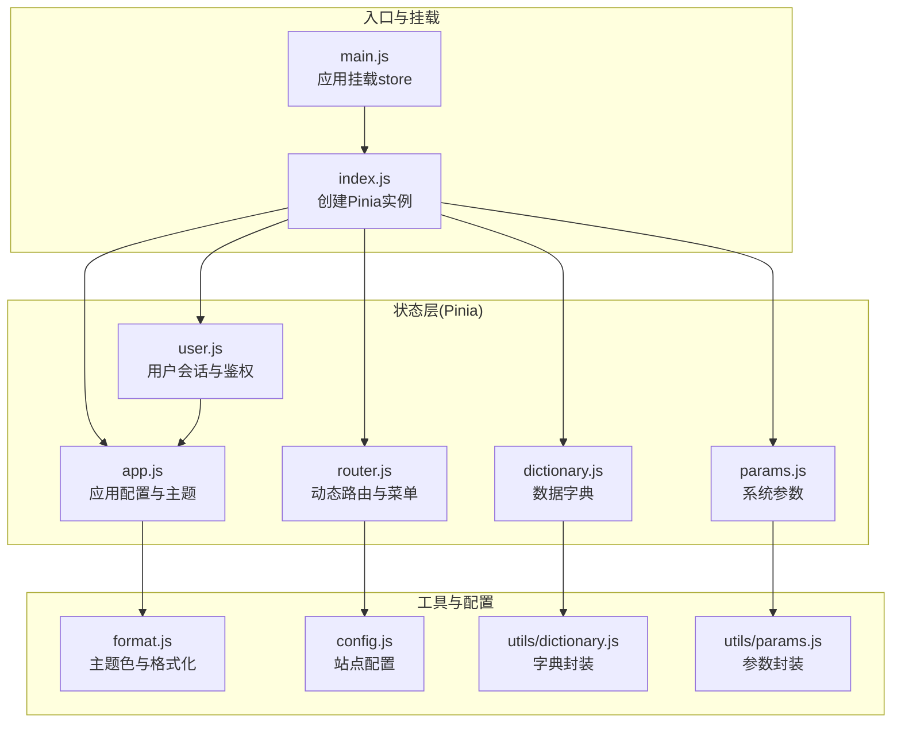
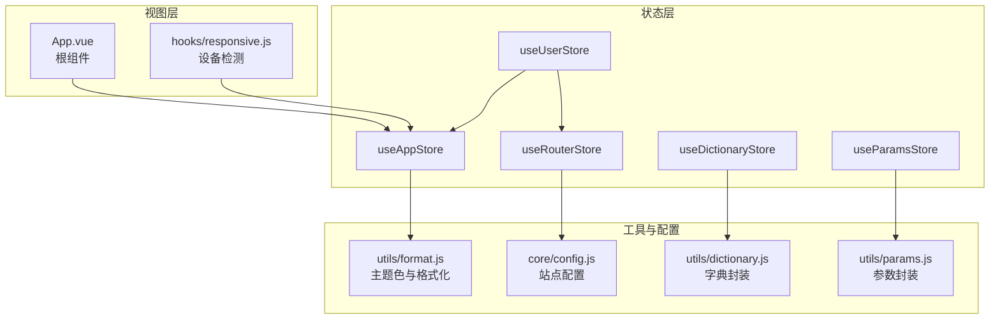
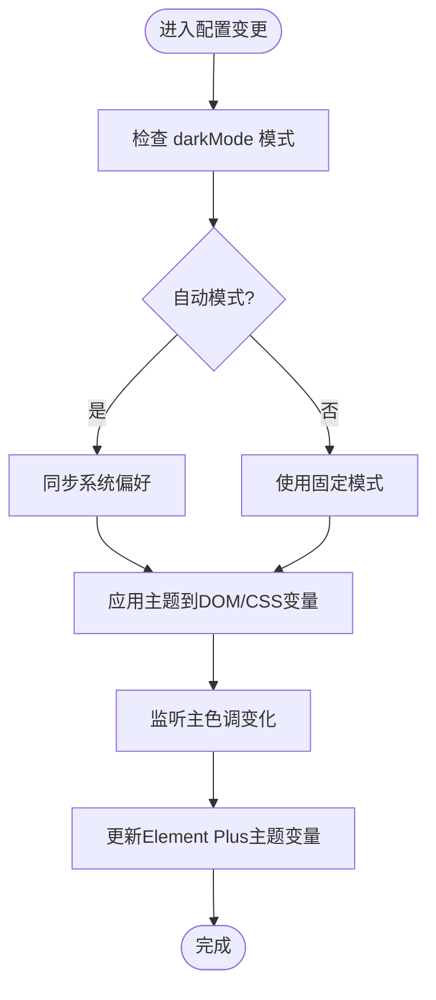
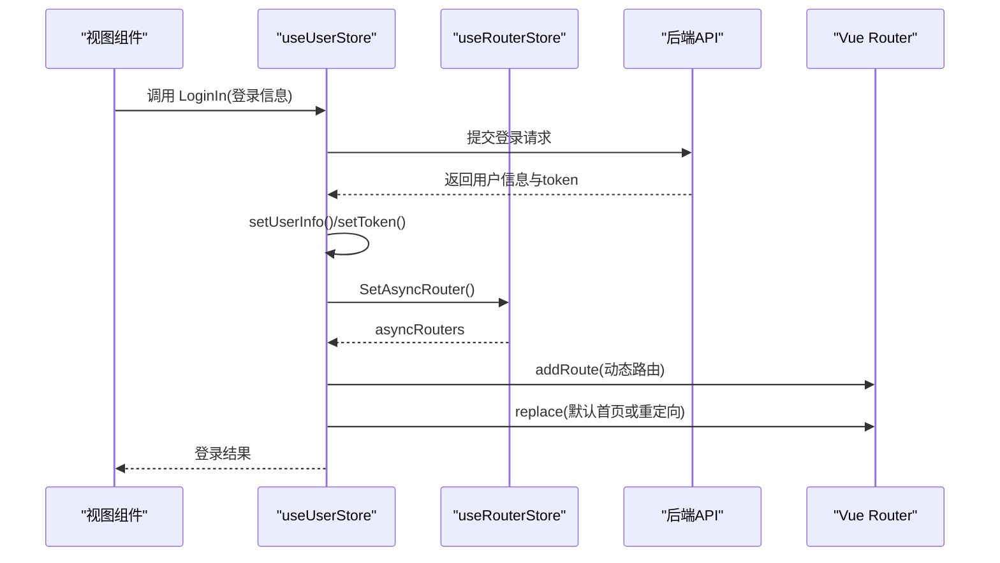
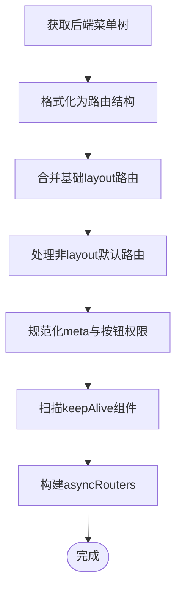
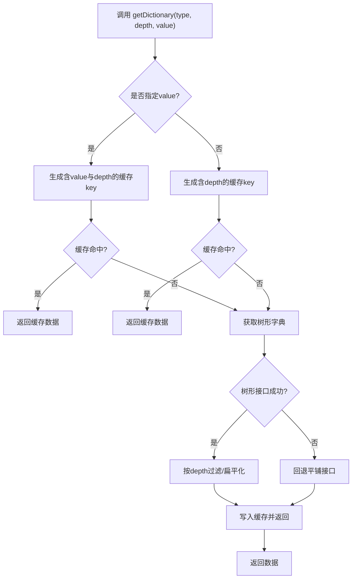
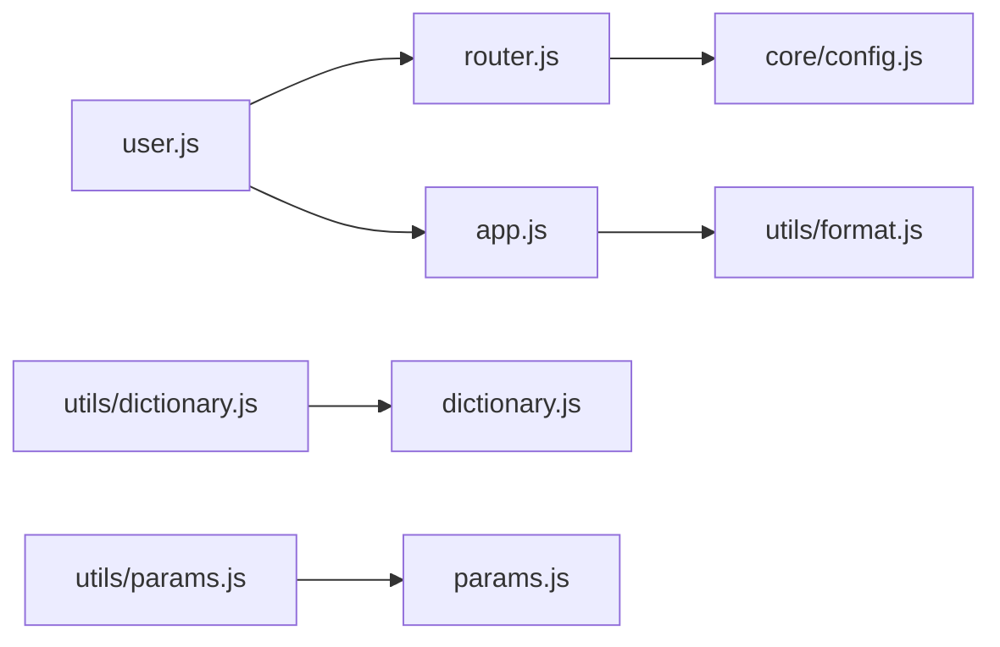

# 状态管理

<cite>
**本文引用的文件**
- [web\src\pinia\index.js](file://web\src\pinia\index.js)
- [web\src\pinia\modules\app.js](file://web\src\pinia\modules\app.js)
- [web\src\pinia\modules\user.js](file://web\src\pinia\modules\user.js)
- [web\src\pinia\modules\router.js](file://web\src\pinia\modules\router.js)
- [web\src\pinia\modules\dictionary.js](file://web\src\pinia\modules\dictionary.js)
- [web\src\pinia\modules\params.js](file://web\src\pinia\modules\params.js)
- [web\src\utils\format.js](file://web\src\utils\format.js)
- [web\src\main.js](file://web\src\main.js)
- [web\src\core\config.js](file://web\src\core\config.js)
- [web\src\App.vue](file://web\src\App.vue)
- [web\src\hooks\responsive.js](file://web\src\hooks\responsive.js)
- [web\src\utils\dictionary.js](file://web\src\utils\dictionary.js)
- [web\src\utils\params.js](file://web\src\utils\params.js)
</cite>

## 目录
1. [简介](#简介)
2. [项目结构](#项目结构)
3. [核心组件](#核心组件)
4. [架构总览](#架构总览)
5. [详细组件分析](#详细组件分析)
6. [依赖关系分析](#依赖关系分析)
7. [性能考量](#性能考量)
8. [故障排查指南](#故障排查指南)
9. [结论](#结论)
10. [附录](#附录)

## 简介
本文件面向“测试管理平台”的前端状态管理，系统性阐述基于 Pinia 的状态管理实现与使用规范。重点覆盖以下方面：
- Store 模块设计与职责划分：应用配置、用户会话、路由与菜单、数据字典、系统参数等。
- 数据流与响应式更新：如何通过响应式 API 实现跨组件状态共享与联动。
- 状态持久化与本地存储：token、主题、布局、字典与参数的缓存策略。
- 最佳实践与性能优化：避免不必要的重渲染、合理拆分模块、缓存命中与降级。
- 调试与排错：常用调试手段、常见问题定位与解决思路。
- 架构图与数据流说明：帮助快速理解各模块交互。

## 项目结构
前端状态管理位于 web/src/pinia 目录，采用按功能域划分的模块化组织方式：
- 入口文件负责创建 Pinia 实例并导出各模块 store。
- 每个模块聚焦单一职责：应用配置、用户认证、动态路由、数据字典、系统参数。
- 工具层提供通用格式化、字典与参数访问封装，供业务组件调用。

图表来源
- [web\src\pinia\index.js:1-9](file://web\src\pinia\index.js#L1-L9)
- [web\src\pinia\modules\app.js:1-163](file://web\src\pinia\modules\app.js#L1-L163)
- [web\src\pinia\modules\user.js:1-151](file://web\src\pinia\modules\user.js#L1-L151)
- [web\src\pinia\modules\router.js:1-208](file://web\src\pinia\modules\router.js#L1-L208)
- [web\src\pinia\modules\dictionary.js:1-253](file://web\src\pinia\modules\dictionary.js#L1-L253)
- [web\src\pinia\modules\params.js:1-32](file://web\src\pinia\modules\params.js#L1-L32)
- [web\src\utils\format.js:1-176](file://web\src\utils\format.js#L1-L176)
- [web\src\main.js:1-38](file://web\src\main.js#L1-L38)
- [web\src\core\config.js:1-56](file://web\src\core\config.js#L1-L56)
- [web\src\utils\dictionary.js:1-94](file://web\src\utils\dictionary.js#L1-L94)
- [web\src\utils\params.js:1-15](file://web\src\utils\params.js#L1-L15)

章节来源
- [web\src\pinia\index.js:1-9](file://web\src\pinia\index.js#L1-L9)
- [web\src\main.js:1-38](file://web\src\main.js#L1-L38)

## 核心组件
本节对四大核心模块进行深入解析，涵盖数据结构、方法职责、依赖关系与典型使用场景。

- 应用配置模块（app）
  - 关键能力：主题切换、暗色/亮色模式、色弱/灰色模式、主色调、侧边栏宽度、标签页显示、全局尺寸、页面过渡动画等。
  - 响应式联动：通过 watchEffect 监听配置变化，自动更新 DOM 类名与 CSS 变量；主题色变更时同步更新 Element Plus 主题变量。
  - 设备适配：监听窗口尺寸，自动切换移动端/桌面端布局参数。
  - 重置配置：提供默认配置恢复能力。

- 用户模块（user）
  - 关键能力：登录/登出、获取用户信息、设置用户配置、清理存储、计算当前有效 token。
  - 与路由模块协作：登录后拉取动态路由，注册到路由表，并跳转至默认首页或重定向地址。
  - 与应用模块协作：用户个性化设置写入后同步到应用配置。
  - 持久化：token 使用浏览器存储与 Cookie 双通道读取，确保跨页面一致。

- 路由模块（router）
  - 关键能力：从后端拉取动态菜单树，格式化为前端路由结构；维护顶部/左侧菜单、活动项；处理 keep-alive 组件列表。
  - 动态路由：支持 layout 包裹的基础路由与非 layout 路由；支持 reload 特殊路由。
  - keep-alive 策略：根据 tabs 与子路由 keepAlive 需求，动态合并组件名集合，保证缓存生效。
  - 事件驱动：通过事件总线接收 keepAlive 更新指令。

- 数据字典模块（dictionary）
  - 关键能力：按类型获取字典树或扁平化数据；支持按节点 value 获取其 children；按 depth 控制返回层级。
  - 缓存策略：以组合键缓存不同维度的数据，避免重复请求；当后端无树形接口时回退到旧版平铺接口。
  - 规范化：统一节点字段结构，确保上层组件消费一致性。

- 系统参数模块（params）
  - 关键能力：按 key 获取系统参数值；缓存到内存，减少重复请求。
  - 场景：动态控制界面行为、开关类配置等。

章节来源
- [web\src\pinia\modules\app.js:1-163](file://web\src\pinia\modules\app.js#L1-L163)
- [web\src\pinia\modules\user.js:1-151](file://web\src\pinia\modules\user.js#L1-L151)
- [web\src\pinia\modules\router.js:1-208](file://web\src\pinia\modules\router.js#L1-L208)
- [web\src\pinia\modules\dictionary.js:1-253](file://web\src\pinia\modules\dictionary.js#L1-L253)
- [web\src\pinia\modules\params.js:1-32](file://web\src\pinia\modules\params.js#L1-L32)

## 架构总览
下图展示了状态管理的整体架构与数据流向，强调模块间的依赖与交互：

图表来源
- [web\src\App.vue:1-47](file://web\src\App.vue#L1-L47)
- [web\src\hooks\responsive.js:1-36](file://web\src\hooks\responsive.js#L1-L36)
- [web\src\pinia\modules\app.js:1-163](file://web\src\pinia\modules\app.js#L1-L163)
- [web\src\pinia\modules\user.js:1-151](file://web\src\pinia\modules\user.js#L1-L151)
- [web\src\pinia\modules\router.js:1-208](file://web\src\pinia\modules\router.js#L1-L208)
- [web\src\pinia\modules\dictionary.js:1-253](file://web\src\pinia\modules\dictionary.js#L1-L253)
- [web\src\pinia\modules\params.js:1-32](file://web\src\pinia\modules\params.js#L1-L32)
- [web\src\utils\format.js:1-176](file://web\src\utils\format.js#L1-L176)
- [web\src\core\config.js:1-56](file://web\src\core\config.js#L1-L56)
- [web\src\utils\dictionary.js:1-94](file://web\src\utils\dictionary.js#L1-L94)
- [web\src\utils\params.js:1-15](file://web\src\utils\params.js#L1-L15)

## 详细组件分析

### 应用配置模块（useAppStore）
- 设计要点
  - 使用组合式 API 定义 store，内部通过 ref/reactive/ref 来声明状态与配置对象。
  - 通过 VueUse 的 useDark/usePreferredDark 实现系统主题感知与自动切换。
  - 通过 watchEffect 监听配置变化，实时更新 DOM 类名与 CSS 变量，确保主题与无障碍模式即时生效。
- 数据结构与复杂度
  - 配置对象为常量规模，读写复杂度 O(1)。
  - 主题色更新通过 CSS 变量批量设置，复杂度 O(k)，k 为主题变量数量。
- 依赖链
  - 依赖 utils/format.js 的主题色设置函数。
  - 与用户模块协作：用户个性化设置写入 app.config。
- 性能建议
  - 将频繁变更的配置拆分为独立响应式片段，避免无关状态触发重渲染。
  - 对主题色与无障碍模式的切换使用防抖/去抖策略。

图表来源
- [web\src\pinia\modules\app.js:26-77](file://web\src\pinia\modules\app.js#L26-L77)
- [web\src\utils\format.js:130-157](file://web\src\utils\format.js#L130-L157)

章节来源
- [web\src\pinia\modules\app.js:1-163](file://web\src\pinia\modules\app.js#L1-L163)
- [web\src\utils\format.js:1-176](file://web\src\utils\format.js#L1-L176)

### 用户模块（useUserStore）
- 设计要点
  - 登录流程：发起登录请求，成功后设置用户信息与 token，拉取动态路由并注册到路由表，最后跳转到默认首页或重定向地址。
  - 登出流程：调用黑名单接口，清理本地存储，跳转登录页并刷新。
  - 计算 token：优先使用内存 token，其次 Cookie 中的 x-token。
  - 与应用模块联动：用户个性化设置写入 app.config。
- 数据流序列

图表来源
- [web\src\pinia\modules\user.js:63-111](file://web\src\pinia\modules\user.js#L63-L111)
- [web\src\pinia\modules\router.js:158-193](file://web\src\pinia\modules\router.js#L158-L193)

章节来源
- [web\src\pinia\modules\user.js:1-151](file://web\src\pinia\modules\user.js#L1-L151)
- [web\src\pinia\modules\router.js:1-208](file://web\src\pinia\modules\router.js#L1-L208)

### 路由模块（useRouterStore）
- 设计要点
  - 动态路由：从后端获取菜单树，格式化为前端路由结构，支持 layout 包裹与非 layout 路由。
  - 菜单管理：维护顶部/左侧菜单、活动项，支持 sessionStorage 持久化活动项。
  - keep-alive 策略：根据 tabs 与子路由 keepAlive 需求，动态合并组件名集合，保证缓存生效。
  - 事件驱动：通过事件总线接收 keepAlive 更新指令。
- 关键算法
  - 菜单树格式化：递归遍历，填充父子关系与按钮权限。
  - keepAlive 过滤：自底向上标记父级，确保子路由启用时父级也启用。
  - 活动项定位：根据当前路由反向查找顶级菜单。

图表来源
- [web\src\pinia\modules\router.js:14-31](file://web\src\pinia\modules\router.js#L14-L31)
- [web\src\pinia\modules\router.js:158-193](file://web\src\pinia\modules\router.js#L158-L193)
- [web\src\pinia\modules\router.js:33-49](file://web\src\pinia\modules\router.js#L33-L49)

章节来源
- [web\src\pinia\modules\router.js:1-208](file://web\src\pinia\modules\router.js#L1-L208)
- [web\src\core\config.js:1-56](file://web\src\core\config.js#L1-L56)

### 数据字典模块（useDictionaryStore）
- 设计要点
  - 支持按类型获取完整树形或按 depth 扁平化；支持按节点 value 获取其 children 并可限制深度。
  - 缓存策略：以组合键缓存多维数据，命中则直接返回；未命中时优先走树形接口，失败则回退平铺接口。
  - 规范化：统一节点字段，确保上层组件消费一致性。
- 算法流程

图表来源
- [web\src\pinia\modules\dictionary.js:117-245](file://web\src\pinia\modules\dictionary.js#L117-L245)
- [web\src\utils\dictionary.js:38-74](file://web\src\utils\dictionary.js#L38-L74)

章节来源
- [web\src\pinia\modules\dictionary.js:1-253](file://web\src\pinia\modules\dictionary.js#L1-L253)
- [web\src\utils\dictionary.js:1-94](file://web\src\utils\dictionary.js#L1-L94)

### 系统参数模块（useParamsStore）
- 设计要点
  - 按 key 获取参数值，首次获取后缓存到内存，后续直接返回。
  - 适用于界面开关、动态配置等场景。
- 使用建议
  - 在组件挂载时预取所需参数，避免运行时异步阻塞。

章节来源
- [web\src\pinia\modules\params.js:1-32](file://web\src\pinia\modules\params.js#L1-L32)
- [web\src\utils\params.js:1-15](file://web\src\utils\params.js#L1-L15)

## 依赖关系分析
- 模块内聚与耦合
  - app 与 user：用户个性化设置写入 app.config，耦合度低，仅通过状态共享。
  - user 与 router：登录后需要 router 拉取动态路由并注册，存在强耦合。
  - dictionary 与 params：均为纯数据模块，彼此无直接依赖。
- 外部依赖
  - app 依赖 utils/format.js 设置主题色。
  - router 依赖 core/config.js 与 pathInfo.json。
  - 工具层依赖 store 层，形成“工具层 -> store 层 -> 外部接口”的调用链。

图表来源
- [web\src\pinia\modules\user.js:1-151](file://web\src\pinia\modules\user.js#L1-L151)
- [web\src\pinia\modules\router.js:1-208](file://web\src\pinia\modules\router.js#L1-L208)
- [web\src\pinia\modules\app.js:1-163](file://web\src\pinia\modules\app.js#L1-L163)
- [web\src\utils\format.js:1-176](file://web\src\utils\format.js#L1-L176)
- [web\src\core\config.js:1-56](file://web\src\core\config.js#L1-L56)
- [web\src\utils\dictionary.js:1-94](file://web\src\utils\dictionary.js#L1-L94)
- [web\src\utils\params.js:1-15](file://web\src\utils\params.js#L1-L15)

章节来源
- [web\src\pinia\modules\user.js:1-151](file://web\src\pinia\modules\user.js#L1-L151)
- [web\src\pinia\modules\router.js:1-208](file://web\src\pinia\modules\router.js#L1-L208)
- [web\src\pinia\modules\app.js:1-163](file://web\src\pinia\modules\app.js#L1-L163)
- [web\src\utils\format.js:1-176](file://web\src\utils\format.js#L1-L176)
- [web\src\core\config.js:1-56](file://web\src\core\config.js#L1-L56)
- [web\src\utils\dictionary.js:1-94](file://web\src\utils\dictionary.js#L1-L94)
- [web\src\utils\params.js:1-15](file://web\src\utils\params.js#L1-L15)

## 性能考量
- 响应式粒度
  - 将高频变更与低频变更分离，避免无关状态导致的重渲染。
  - 对主题色、布局参数等集中管理，减少多次 watchEffect。
- 缓存与降级
  - 字典与参数模块已内置缓存，尽量复用已有数据，减少网络请求。
  - 后端接口不可用时的回退策略（树形 -> 平铺）提升稳定性。
- keep-alive 策略
  - 合理设置 keepAlive 列表，避免过度缓存造成内存压力。
  - 结合 tabs 与父子路由关系，确保缓存生效且不冗余。
- 主题与无障碍
  - 主题色与无障碍模式切换通过 CSS 变量批量更新，避免逐元素修改带来的性能损耗。

## 故障排查指南
- 登录后无法跳转或白屏
  - 检查后端返回的默认首页是否存在；确认动态路由已注册到路由表。
  - 关注用户模块登录流程中的路由注册与跳转逻辑。
- 主题色不生效或闪烁
  - 确认 app 模块的主题色设置函数已执行；检查 CSS 变量是否被覆盖。
- 字典数据为空或异常
  - 检查字典模块的缓存键生成规则与后端接口返回结构。
  - 若回退到平铺接口，确认平铺数据格式是否符合预期。
- 参数获取失败
  - 确认参数 key 正确且后端存在对应值；检查内存缓存是否已写入。
- 设备适配异常
  - 检查窗口 resize 事件绑定与去抖逻辑；确认 app 模块的设备状态切换。

章节来源
- [web\src\pinia\modules\user.js:63-111](file://web\src\pinia\modules\user.js#L63-L111)
- [web\src\pinia\modules\router.js:158-193](file://web\src\pinia\modules\router.js#L158-L193)
- [web\src\pinia\modules\app.js:130-138](file://web\src\pinia\modules\app.js#L130-L138)
- [web\src\pinia\modules\dictionary.js:117-245](file://web\src\pinia\modules\dictionary.js#L117-L245)
- [web\src\pinia\modules\params.js:12-24](file://web\src\pinia\modules\params.js#L12-L24)
- [web\src\hooks\responsive.js:16-35](file://web\src\hooks\responsive.js#L16-L35)

## 结论
本状态管理方案以 Pinia 为核心，围绕应用配置、用户会话、动态路由、数据字典与系统参数五大模块构建，配合工具层封装与配置中心，实现了清晰的职责划分与高效的响应式数据流。通过合理的缓存策略、主题与无障碍支持、以及 keep-alive 管控，整体具备良好的可维护性与性能表现。建议在实际开发中遵循本文最佳实践，持续优化模块边界与数据流，以支撑更复杂的业务场景。

## 附录
- 状态持久化清单
  - 用户 token：内存、Cookie、localStorage 多通道读取与写入。
  - 用户个性化设置：写入 app.config，影响主题与布局。
  - 菜单活动项：sessionStorage 持久化，重启后自动恢复。
  - 字典与参数：内存缓存，必要时结合本地存储扩展。
- 调试建议
  - 使用浏览器开发者工具观察响应式状态变化。
  - 在关键流程（登录、路由注册、主题切换）打点日志，定位异常路径。
  - 对高频操作（resize、滚动）增加去抖/节流，避免性能抖动。