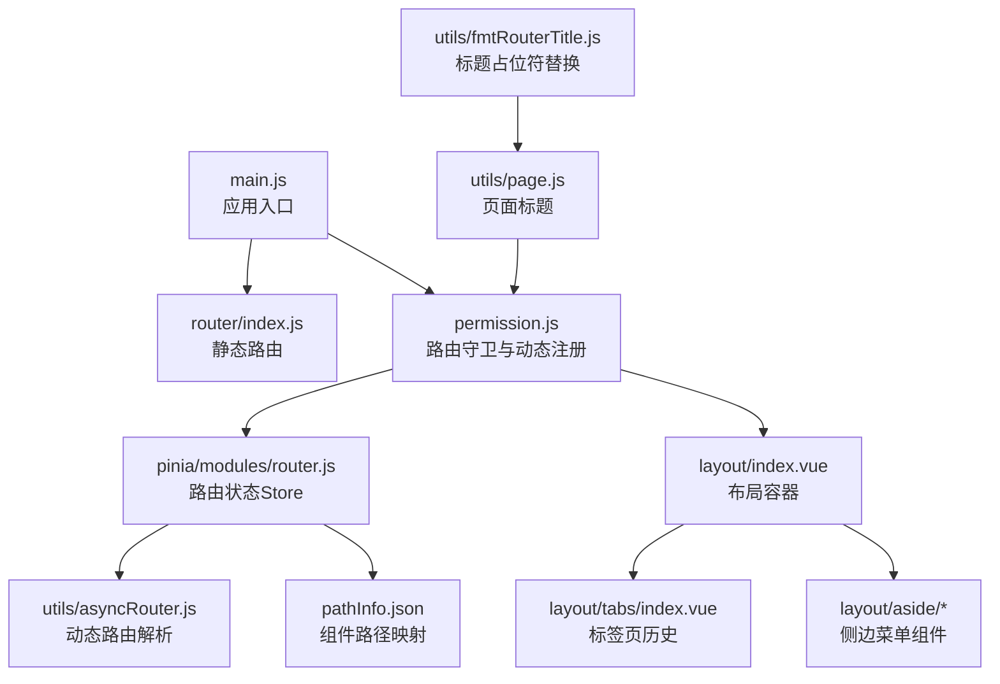
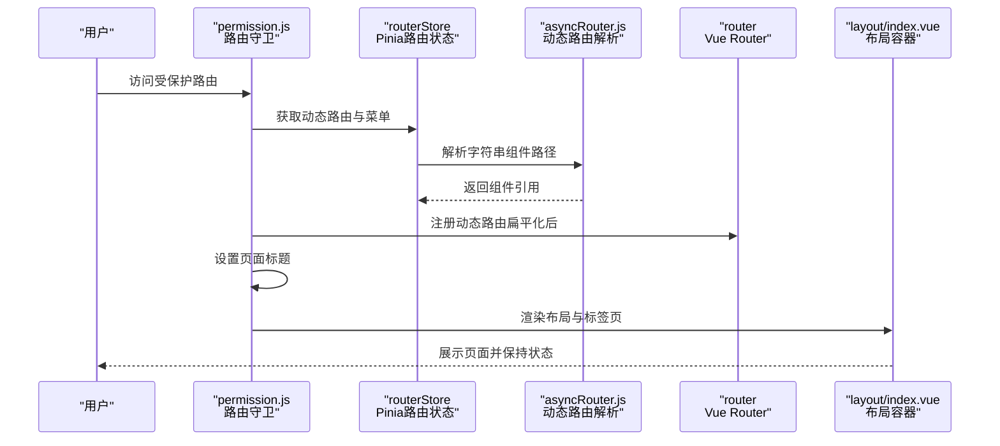
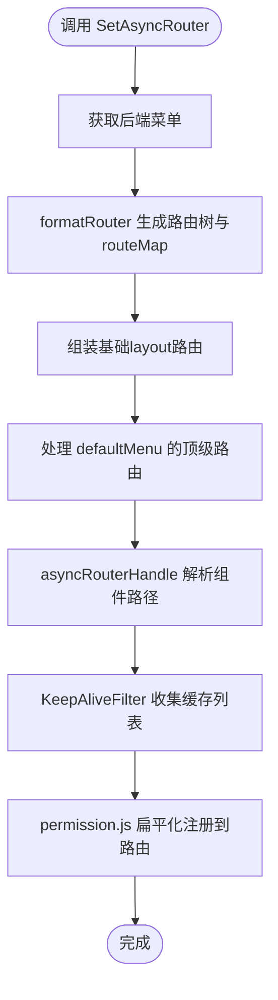
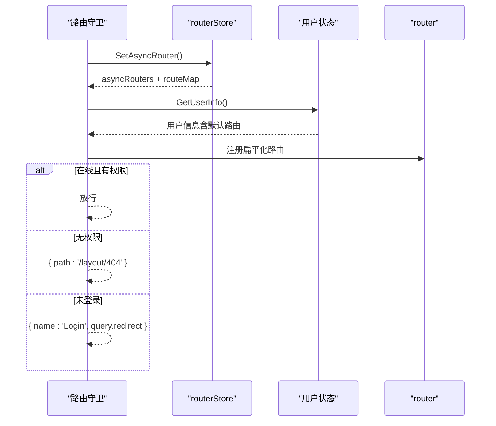
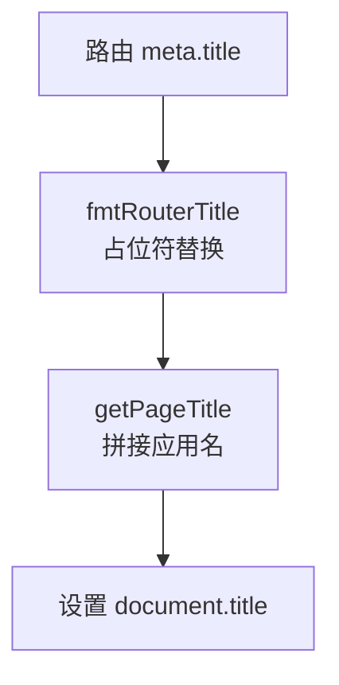
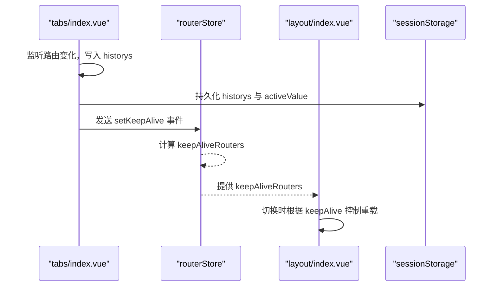
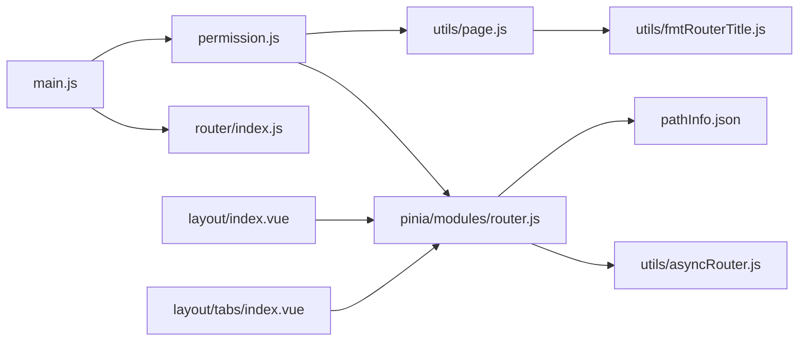

# 路由状态管理

<cite>
**本文引用的文件**
- [web/src/pinia/modules/router.js](file://web/src/pinia/modules/router.js)
- [web/src/utils/asyncRouter.js](file://web/src/utils/asyncRouter.js)
- [web/src/router/index.js](file://web/src/router/index.js)
- [web/src/permission.js](file://web/src/permission.js)
- [web/src/utils/fmtRouterTitle.js](file://web/src/utils/fmtRouterTitle.js)
- [web/src/utils/page.js](file://web/src/utils/page.js)
- [web/src/pathInfo.json](file://web/src/pathInfo.json)
- [web/src/main.js](file://web/src/main.js)
- [web/src/view/layout/index.vue](file://web/src/view/layout/index.vue)
- [web/src/view/layout/tabs/index.vue](file://web/src/view/layout/tabs/index.vue)
- [web/src/view/layout/aside/asideComponent/index.vue](file://web/src/view/layout/aside/asideComponent/index.vue)
- [web/src/view/layout/aside/asideComponent/asyncSubmenu.vue](file://web/src/view/layout/aside/asideComponent/asyncSubmenu.vue)
- [web/src/view/layout/aside/asideComponent/menuItem.vue](file://web/src/view/layout/aside/asideComponent/menuItem.vue)
</cite>

## 目录
1. [引言](#引言)
2. [项目结构](#项目结构)
3. [核心组件](#核心组件)
4. [架构总览](#架构总览)
5. [详细组件分析](#详细组件分析)
6. [依赖分析](#依赖分析)
7. [性能考虑](#性能考虑)
8. [故障排查指南](#故障排查指南)
9. [结论](#结论)
10. [附录](#附录)

## 引言
本文件围绕测试管理平台的“路由状态管理”模块进行系统性说明，重点覆盖以下方面：
- 路由权限与动态路由生成机制
- 面包屑导航与页面标题的来源与格式化
- 路由切换时的状态保持与恢复（含标签页历史、keep-alive 缓存）
- 路由状态的持久化与页面刷新后的恢复
- 实际使用示例与性能优化建议

## 项目结构
路由状态管理涉及前端 Web 应用的多个层次：
- 路由定义层：基础静态路由与入口初始化
- 权限与守卫层：路由注册、白名单、鉴权与动态路由挂载
- 状态管理层：Pinia Store 中的路由状态、菜单状态、keep-alive 列表
- 视图层：布局容器、侧边菜单、标签页组件
- 工具层：动态路由解析、标题格式化、路径映射

图表来源
- [web/src/main.js:1-38](file://web/src/main.js#L1-L38)
- [web/src/router/index.js:1-42](file://web/src/router/index.js#L1-L42)
- [web/src/permission.js:1-225](file://web/src/permission.js#L1-L225)
- [web/src/pinia/modules/router.js:1-208](file://web/src/pinia/modules/router.js#L1-L208)
- [web/src/utils/asyncRouter.js:1-30](file://web/src/utils/asyncRouter.js#L1-L30)
- [web/src/pathInfo.json:1-86](file://web/src/pathInfo.json#L1-L86)
- [web/src/view/layout/index.vue:1-119](file://web/src/view/layout/index.vue#L1-L119)
- [web/src/view/layout/tabs/index.vue:1-422](file://web/src/view/layout/tabs/index.vue#L1-L422)
- [web/src/view/layout/aside/asideComponent/index.vue:1-48](file://web/src/view/layout/aside/asideComponent/index.vue#L1-L48)
- [web/src/utils/page.js:1-10](file://web/src/utils/page.js#L1-L10)
- [web/src/utils/fmtRouterTitle.js:1-14](file://web/src/utils/fmtRouterTitle.js#L1-L14)

章节来源
- [web/src/main.js:1-38](file://web/src/main.js#L1-L38)
- [web/src/router/index.js:1-42](file://web/src/router/index.js#L1-L42)

## 核心组件
- Pinia 路由状态 Store：负责动态路由树、顶部/左侧菜单、keep-alive 列表、路由映射、以及路由切换时的缓存处理
- 动态路由工具：将字符串组件路径转换为实际组件引用，并生成 meta.path 便于后续映射
- 路由守卫与动态注册：根据用户权限拉取菜单，扁平化为可注册路由，挂载到布局或顶级路由下
- 页面标题与标题格式化：支持占位符替换与全局应用名拼接
- 布局与标签页：提供标签页历史持久化、右键菜单、中间点击关闭、查询参数同步等功能
- 侧边菜单：根据路由是否含子项自动选择菜单项或子菜单组件

章节来源
- [web/src/pinia/modules/router.js:51-207](file://web/src/pinia/modules/router.js#L51-L207)
- [web/src/utils/asyncRouter.js:4-29](file://web/src/utils/asyncRouter.js#L4-L29)
- [web/src/permission.js:117-146](file://web/src/permission.js#L117-L146)
- [web/src/utils/page.js:3-9](file://web/src/utils/page.js#L3-L9)
- [web/src/utils/fmtRouterTitle.js:1-14](file://web/src/utils/fmtRouterTitle.js#L1-L14)
- [web/src/view/layout/tabs/index.vue:74-353](file://web/src/view/layout/tabs/index.vue#L74-L353)
- [web/src/view/layout/aside/asideComponent/index.vue:37-46](file://web/src/view/layout/aside/asideComponent/index.vue#L37-L46)

## 架构总览
路由状态管理采用“静态路由 + 动态路由”的组合模式：
- 静态路由：登录、初始化、异常页等基础页面
- 动态路由：后端返回的菜单树，经格式化后挂载到布局或顶级路由
- 权限控制：白名单放行、登录态校验、无权限跳转 404 或登录页
- 状态保持：标签页历史、keep-alive 组件列表、顶部/左侧菜单激活态

图表来源
- [web/src/permission.js:155-209](file://web/src/permission.js#L155-L209)
- [web/src/pinia/modules/router.js:158-193](file://web/src/pinia/modules/router.js#L158-L193)
- [web/src/utils/asyncRouter.js:4-29](file://web/src/utils/asyncRouter.js#L4-L29)
- [web/src/view/layout/index.vue:33-47](file://web/src/view/layout/index.vue#L33-L47)

## 详细组件分析

### 路由状态 Store（Pinia）
职责与关键点：
- 动态路由树维护：接收后端菜单，格式化为带父子关系的路由树，生成 routeMap
- 顶部/左侧菜单：基于顶层路由生成顶部菜单，左侧菜单随顶部激活变化而切换
- keep-alive 策略：结合默认 keepAlive 标记、历史标签页、父子关系，计算最终缓存列表
- 路由切换缓存处理：在进入匹配路由时，按需预加载异步组件并移除布局占位
- 异步路由标志：用于控制首次动态注册流程

图表来源
- [web/src/pinia/modules/router.js:158-193](file://web/src/pinia/modules/router.js#L158-L193)
- [web/src/utils/asyncRouter.js:4-29](file://web/src/utils/asyncRouter.js#L4-L29)

章节来源
- [web/src/pinia/modules/router.js:14-31](file://web/src/pinia/modules/router.js#L14-L31)
- [web/src/pinia/modules/router.js:33-49](file://web/src/pinia/modules/router.js#L33-L49)
- [web/src/pinia/modules/router.js:51-207](file://web/src/pinia/modules/router.js#L51-L207)

### 动态路由生成与权限控制
- 动态路由来源：后端菜单接口返回的菜单树
- 路由扁平化：permission.js 将 layout.children 与其它顶级路由统一注册为 layout 的二级子路由，支持 defaultMenu 的顶级直挂
- 权限拦截：白名单放行；登录态缺失跳转登录页并携带 redirect；无权限时跳转 404
- 首次加载：若未完成动态注册且非白名单，等待 setupRouter 完成后再放行

图表来源
- [web/src/permission.js:117-146](file://web/src/permission.js#L117-L146)
- [web/src/permission.js:155-209](file://web/src/permission.js#L155-L209)
- [web/src/pinia/modules/router.js:158-193](file://web/src/pinia/modules/router.js#L158-L193)

章节来源
- [web/src/permission.js:42-114](file://web/src/permission.js#L42-L114)
- [web/src/permission.js:117-146](file://web/src/permission.js#L117-L146)
- [web/src/permission.js:155-209](file://web/src/permission.js#L155-L209)

### 页面标题与面包屑导航
- 页面标题：utils/page.js 读取路由 meta.title，通过 utils/fmtRouterTitle.js 替换占位符（如 params/query），再拼接应用名
- 面包屑导航：当前实现以“标签页标题”为主，未在侧边栏或头部显式渲染面包屑路径；可通过扩展在布局或头部组件中消费路由 matched 信息实现

图表来源
- [web/src/utils/page.js:3-9](file://web/src/utils/page.js#L3-L9)
- [web/src/utils/fmtRouterTitle.js:1-14](file://web/src/utils/fmtRouterTitle.js#L1-L14)

章节来源
- [web/src/utils/page.js:1-10](file://web/src/utils/page.js#L1-L10)
- [web/src/utils/fmtRouterTitle.js:1-14](file://web/src/utils/fmtRouterTitle.js#L1-L14)
- [web/src/permission.js:164-167](file://web/src/permission.js#L164-L167)

### 路由切换时的状态保持与恢复
- 标签页历史：layout/tabs/index.vue 维护 historys 数组，支持右键菜单批量关闭、中间点击关闭、查询参数同步、持久化到 sessionStorage
- keep-alive：根据配置与历史标签页动态计算 include 列表，确保被缓存的组件在切换时不销毁
- 顶部/左侧菜单激活态：顶部激活态保存于 sessionStorage，刷新后自动恢复；左侧菜单随顶部激活变化而更新
- 布局容器：layout/index.vue 在 reload 时通过 reloadFlag 控制重载逻辑，避免非缓存页面的闪烁

图表来源
- [web/src/view/layout/tabs/index.vue:252-279](file://web/src/view/layout/tabs/index.vue#L252-L279)
- [web/src/pinia/modules/router.js:54-78](file://web/src/pinia/modules/router.js#L54-L78)
- [web/src/view/layout/index.vue:101-115](file://web/src/view/layout/index.vue#L101-L115)

章节来源
- [web/src/view/layout/tabs/index.vue:74-353](file://web/src/view/layout/tabs/index.vue#L74-L353)
- [web/src/pinia/modules/router.js:51-100](file://web/src/pinia/modules/router.js#L51-L100)
- [web/src/view/layout/index.vue:33-47](file://web/src/view/layout/index.vue#L33-L47)

### 路由状态的持久化与恢复
- 标签页历史：historys 与 activeValue 持久化至 sessionStorage，页面刷新后恢复
- 顶部激活态：topActive 保存于 sessionStorage，watchEffect 初始化时恢复
- keep-alive 列表：由标签页历史触发计算并注入布局容器的 keep-alive include

章节来源
- [web/src/view/layout/tabs/index.vue:340-353](file://web/src/view/layout/tabs/index.vue#L340-L353)
- [web/src/pinia/modules/router.js:141-154](file://web/src/pinia/modules/router.js#L141-L154)

### 路由状态与用户权限的关联
- 登录态：token 存在才允许访问受保护路由
- 默认路由：用户信息中 authority.defaultRouter 决定白名单登录后的跳转目标
- 动态菜单：SetAsyncRouter 拉取菜单，permission.js 扁平化注册，形成“菜单 → 路由”的映射
- 权限不足：matched 为空时跳转 404

章节来源
- [web/src/permission.js:155-209](file://web/src/permission.js#L155-L209)
- [web/src/pinia/modules/router.js:158-193](file://web/src/pinia/modules/router.js#L158-L193)

### 侧边菜单与布局组件
- 自动组件选择：根据路由是否有子项自动选择 MenuItem 或 AsyncSubmenu
- 菜单高度：通过应用配置动态计算菜单项高度
- 布局容器：提供水印、头部、侧边、标签页、底部信息区域，以及 keep-alive 包裹的路由视图

章节来源
- [web/src/view/layout/aside/asideComponent/index.vue:37-46](file://web/src/view/layout/aside/asideComponent/index.vue#L37-L46)
- [web/src/view/layout/aside/asideComponent/asyncSubmenu.vue:55-57](file://web/src/view/layout/aside/asideComponent/asyncSubmenu.vue#L55-L57)
- [web/src/view/layout/aside/asideComponent/menuItem.vue:44-46](file://web/src/view/layout/aside/asideComponent/menuItem.vue#L44-L46)
- [web/src/view/layout/index.vue:14-52](file://web/src/view/layout/index.vue#L14-L52)

## 依赖分析
- 路由定义与入口
  - main.js 引入 router、permission、pinia，启动应用
  - router/index.js 定义静态路由（登录、初始化、异常页等）
- 权限与动态注册
  - permission.js 依赖 routerStore、userStore、getPageTitle，负责动态路由注册与守卫
- 状态与工具
  - router.js 依赖 asyncRouter.js、pathInfo.json、fmtRouterTitle.js、page.js
  - layout/tabs/index.vue 依赖 bus.js 事件总线与 userStore.defaultRouter

图表来源
- [web/src/main.js:12-19](file://web/src/main.js#L12-L19)
- [web/src/router/index.js:1-42](file://web/src/router/index.js#L1-L42)
- [web/src/permission.js:1-225](file://web/src/permission.js#L1-L225)
- [web/src/pinia/modules/router.js:1-208](file://web/src/pinia/modules/router.js#L1-L208)
- [web/src/utils/asyncRouter.js:1-30](file://web/src/utils/asyncRouter.js#L1-L30)
- [web/src/pathInfo.json:1-86](file://web/src/pathInfo.json#L1-L86)
- [web/src/utils/page.js:1-10](file://web/src/utils/page.js#L1-L10)
- [web/src/utils/fmtRouterTitle.js:1-14](file://web/src/utils/fmtRouterTitle.js#L1-L14)
- [web/src/view/layout/index.vue:61-68](file://web/src/view/layout/index.vue#L61-L68)
- [web/src/view/layout/tabs/index.vue:57-61](file://web/src/view/layout/tabs/index.vue#L57-L61)

章节来源
- [web/src/main.js:1-38](file://web/src/main.js#L1-L38)
- [web/src/router/index.js:1-42](file://web/src/router/index.js#L1-L42)
- [web/src/permission.js:1-225](file://web/src/permission.js#L1-L225)
- [web/src/pinia/modules/router.js:1-208](file://web/src/pinia/modules/router.js#L1-L208)

## 性能考虑
- 动态导入与懒加载
  - 使用 asyncRouterHandle 对字符串组件路径进行按需动态导入，减少首屏体积
- keep-alive 策略
  - 仅对历史标签页与具备 keepAlive 标记的路由进行缓存，避免过度缓存导致内存压力
- 路由注册去重
  - permission.js 在注册前检查路由是否存在，避免重复注册
- 标签页持久化
  - 仅持久化必要字段，避免 sessionStorage 过大
- 过渡与重载
  - 布局容器在需要时通过 reloadFlag 控制重载，减少不必要的组件卸载/挂载

章节来源
- [web/src/utils/asyncRouter.js:4-29](file://web/src/utils/asyncRouter.js#L4-L29)
- [web/src/pinia/modules/router.js:54-78](file://web/src/pinia/modules/router.js#L54-L78)
- [web/src/permission.js:32-37](file://web/src/permission.js#L32-L37)
- [web/src/view/layout/index.vue:101-115](file://web/src/view/layout/index.vue#L101-L115)

## 故障排查指南
- 动态路由未生效
  - 检查 routerStore.asyncRouterFlag 是否被正确置位
  - 确认 permission.js 中 setupRouter 已执行并完成扁平化注册
- 标题未显示或显示异常
  - 检查 meta.title 是否存在，确认 fmtRouterTitle 占位符是否与 params/query 匹配
- 标签页历史丢失
  - 确认 sessionStorage 中 historys 与 activeValue 是否正常写入与读取
- keep-alive 不生效
  - 检查 pathInfo.json 中组件路径映射是否正确，以及 setKeepAlive 事件是否被触发
- 404 页面频繁出现
  - 确认用户权限与菜单拉取是否成功，路由注册是否包含目标路由

章节来源
- [web/src/permission.js:175-199](file://web/src/permission.js#L175-L199)
- [web/src/utils/page.js:3-9](file://web/src/utils/page.js#L3-L9)
- [web/src/view/layout/tabs/index.vue:252-279](file://web/src/view/layout/tabs/index.vue#L252-L279)
- [web/src/pinia/modules/router.js:54-78](file://web/src/pinia/modules/router.js#L54-L78)

## 结论
本路由状态管理模块通过“静态路由 + 动态路由”的组合，结合 Pinia Store 的状态管理、permission.js 的路由守卫与动态注册、以及布局与标签页的持久化策略，实现了：
- 动态路由的生成与权限控制
- 页面标题与占位符替换
- 标签页历史与 keep-alive 的状态保持
- 刷新后的状态恢复
在保证安全与体验的同时，提供了良好的扩展空间（如面包屑导航、更细粒度的缓存策略等）。

## 附录
- 实际使用示例（步骤说明）
  - 登录后，permission.js 调用 routerStore.SetAsyncRouter 拉取菜单并解析组件路径
  - permission.js 扁平化注册路由，设置页面标题
  - 用户在标签页中切换，tabs 组件持久化历史并触发 setKeepAlive 事件
  - layout 容器根据 keepAliveRouters 列表进行缓存控制
- 路由状态字段说明
  - asyncRouters：动态路由树
  - routeMap：路由名称到路由对象的映射
  - keepAliveRouters：当前需要缓存的组件名数组
  - topMenu/leftMenu/topActive：顶部/左侧菜单与激活态
  - asyncRouterFlag：动态路由注册完成标志

章节来源
- [web/src/pinia/modules/router.js:156-207](file://web/src/pinia/modules/router.js#L156-L207)
- [web/src/permission.js:117-146](file://web/src/permission.js#L117-L146)
- [web/src/view/layout/tabs/index.vue:274-274](file://web/src/view/layout/tabs/index.vue#L274-L274)
- [web/src/view/layout/index.vue:42-44](file://web/src/view/layout/index.vue#L42-L44)