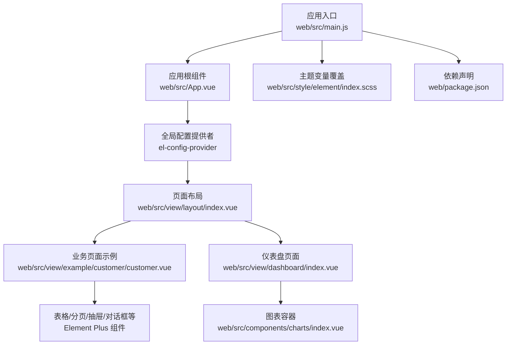
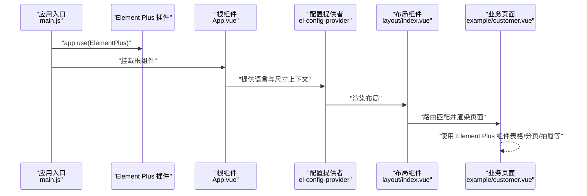
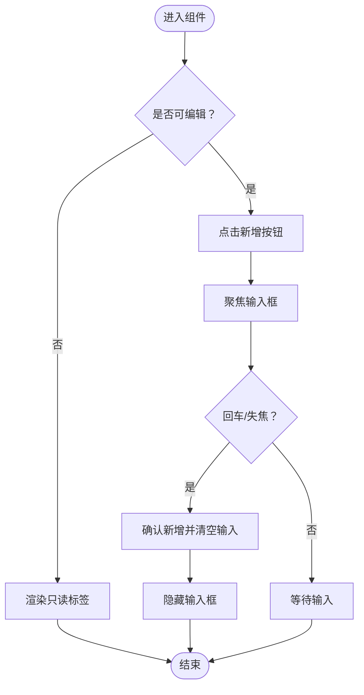
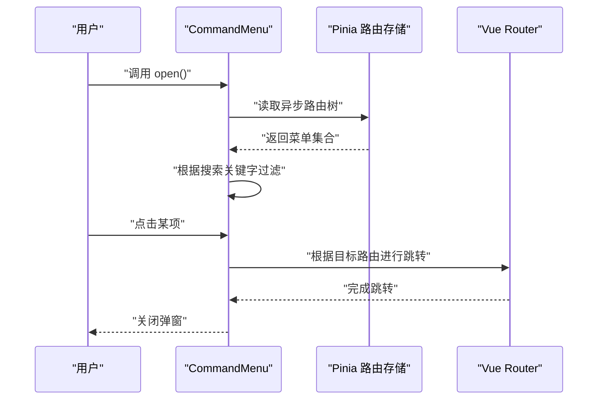
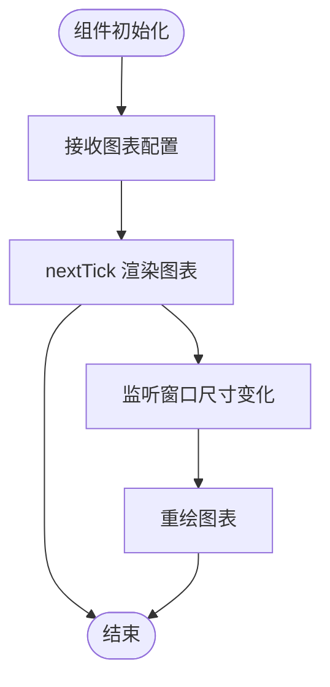
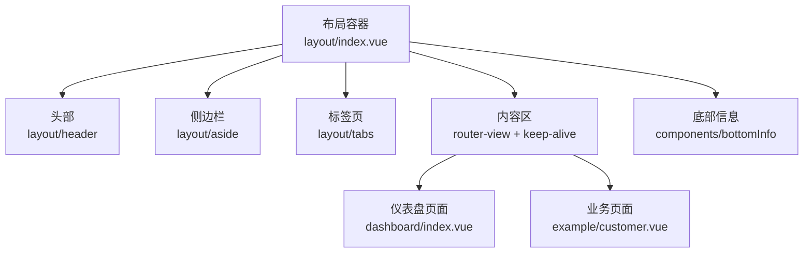
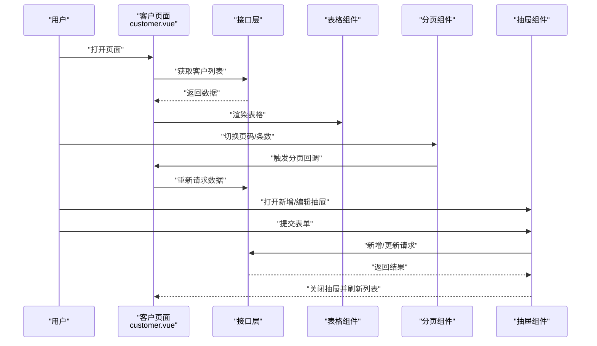
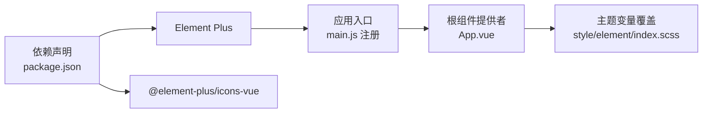

# UI组件库

<cite>
**本文引用的文件**
- [web/package.json](file://web/package.json)
- [web/src/main.js](file://web/src/main.js)
- [web/src/App.vue](file://web/src/App.vue)
- [web/src/style/element/index.scss](file://web/src/style/element/index.scss)
- [web/src/components/arrayCtrl/arrayCtrl.vue](file://web/src/components/arrayCtrl/arrayCtrl.vue)
- [web/src/components/commandMenu/index.vue](file://web/src/components/commandMenu/index.vue)
- [web/src/components/charts/index.vue](file://web/src/components/charts/index.vue)
- [web/src/view/layout/index.vue](file://web/src/view/layout/index.vue)
- [web/src/view/dashboard/index.vue](file://web/src/view/dashboard/index.vue)
- [web/src/view/example/customer/customer.vue](file://web/src/view/example/customer/customer.vue)
</cite>

## 目录
1. [简介](#简介)
2. [项目结构](#项目结构)
3. [核心组件](#核心组件)
4. [架构总览](#架构总览)
5. [详细组件分析](#详细组件分析)
6. [依赖分析](#依赖分析)
7. [性能考虑](#性能考虑)
8. [故障排查指南](#故障排查指南)
9. [结论](#结论)
10. [附录](#附录)

## 简介
本文件面向测试管理平台前端的UI组件库，聚焦于基于 Element Plus 的组件使用与配置，系统性梳理组件功能特性、属性配置、主题定制、样式覆盖与响应式设计，并给出组合使用与布局模式的最佳实践，以及性能优化与常见问题解决方案。文档以仓库中的真实实现为依据，避免臆测，便于不同技术背景的读者快速上手。

## 项目结构
前端采用 Vue 3 + Vite 构建，Element Plus 作为主要 UI 组件库，配合 UnoCSS、Pinia、Vue Router 等生态工具。应用入口在 main.js 中注册 Element Plus 及全局指令、路由、状态管理等；根组件 App.vue 通过 el-config-provider 提供语言与尺寸上下文；样式方面通过 SCSS 主题变量覆盖实现品牌色与明暗主题适配。

图示来源
- [web/src/main.js:1-38](file://web/src/main.js#L1-L38)
- [web/src/App.vue:1-47](file://web/src/App.vue#L1-L47)
- [web/src/view/layout/index.vue:1-119](file://web/src/view/layout/index.vue#L1-L119)
- [web/src/view/example/customer/customer.vue:1-216](file://web/src/view/example/customer/customer.vue#L1-L216)
- [web/src/view/dashboard/index.vue:1-129](file://web/src/view/dashboard/index.vue#L1-L129)
- [web/src/components/charts/index.vue:1-48](file://web/src/components/charts/index.vue#L1-L48)
- [web/src/style/element/index.scss:1-25](file://web/src/style/element/index.scss#L1-L25)
- [web/package.json:1-88](file://web/package.json#L1-L88)

章节来源
- [web/src/main.js:1-38](file://web/src/main.js#L1-L38)
- [web/src/App.vue:1-47](file://web/src/App.vue#L1-L47)
- [web/src/style/element/index.scss:1-25](file://web/src/style/element/index.scss#L1-L25)
- [web/package.json:1-88](file://web/package.json#L1-L88)

## 核心组件
本节从使用视角总结常用组件及其典型用法，便于快速查阅与复用。

- 表单与输入类
  - 输入框：用于表单项输入，常与表单验证结合。
  - 按钮：基础交互入口，支持主次/危险/链接等多种类型。
  - 标签：展示标签列表，支持可关闭与编辑模式。
  - 抽屉：承载表单或详情信息，适合移动端与大屏场景。
  - 对话框：弹窗交互，常用于确认、选择、搜索等。
  - 表单：用于组织字段与校验规则。
- 数据展示类
  - 表格：支持多选、排序、行键、自定义列模板。
  - 分页：与表格联动，支持页码与条数切换。
  - 图表：基于 vue-echarts 封装的图表容器，支持自动适配窗口大小。
- 布局与导航
  - 配置提供者：统一设置语言与全局尺寸。
  - 布局容器：水印、头部、侧边栏、标签页、内容区、底部信息等组合。
  - 快捷命令菜单：全局搜索跳转与主题切换。

章节来源
- [web/src/components/arrayCtrl/arrayCtrl.vue:1-68](file://web/src/components/arrayCtrl/arrayCtrl.vue#L1-L68)
- [web/src/components/commandMenu/index.vue:1-196](file://web/src/components/commandMenu/index.vue#L1-L196)
- [web/src/components/charts/index.vue:1-48](file://web/src/components/charts/index.vue#L1-L48)
- [web/src/view/layout/index.vue:1-119](file://web/src/view/layout/index.vue#L1-L119)
- [web/src/view/example/customer/customer.vue:1-216](file://web/src/view/example/customer/customer.vue#L1-L216)

## 架构总览
下图展示了应用启动到页面渲染的关键流程，以及 Element Plus 在其中的角色与注入方式。

图示来源
- [web/src/main.js:29-36](file://web/src/main.js#L29-L36)
- [web/src/App.vue:6-10](file://web/src/App.vue#L6-L10)
- [web/src/view/layout/index.vue:1-119](file://web/src/view/layout/index.vue#L1-L119)
- [web/src/view/example/customer/customer.vue:1-216](file://web/src/view/example/customer/customer.vue#L1-L216)

## 详细组件分析

### 表单与输入：标签控件 ArrayCtrl
- 功能特性
  - 展示标签列表，支持可关闭与编辑模式。
  - 编辑模式下提供输入框，回车或失焦确认新增。
  - 使用 defineModel 与 props 接收双向绑定值与可编辑开关。
- 关键点
  - 可关闭标签通过 closable 控制，关闭回调中移除对应项。
  - 编辑态通过 ref 获取焦点，确保用户体验连贯。
- 典型用法
  - 适用于标签云、关键词筛选、动态标签管理等场景。

图示来源
- [web/src/components/arrayCtrl/arrayCtrl.vue:1-68](file://web/src/components/arrayCtrl/arrayCtrl.vue#L1-L68)

章节来源
- [web/src/components/arrayCtrl/arrayCtrl.vue:1-68](file://web/src/components/arrayCtrl/arrayCtrl.vue#L1-L68)

### 导航与交互：快捷命令菜单 CommandMenu
- 功能特性
  - 弹窗内支持搜索，按标题过滤菜单项。
  - 支持两类选项：跳转菜单与操作（主题切换、退出登录）。
  - 通过 Pinia 读取路由树，动态生成可跳转项。
- 关键点
  - 使用 el-dialog 承载，header 区域放置搜索输入。
  - 通过 watch 监听搜索输入变化，动态刷新选项列表。
  - 支持外部暴露 open 方法，便于全局触发。
- 典型用法
  - 适合大型后台系统提供“万能钥匙”式快速跳转体验。

图示来源
- [web/src/components/commandMenu/index.vue:113-146](file://web/src/components/commandMenu/index.vue#L113-L146)
- [web/src/components/commandMenu/index.vue:148-152](file://web/src/components/commandMenu/index.vue#L148-L152)

章节来源
- [web/src/components/commandMenu/index.vue:1-196](file://web/src/components/commandMenu/index.vue#L1-L196)

### 数据可视化：图表容器 Charts
- 功能特性
  - 基于 vue-echarts 的轻量封装，支持传入图表配置、自动适配与宽高控制。
  - 通过窗口尺寸监听，在尺寸变化时重绘图表，保证响应式表现。
  - 使用 nextTick 控制首次渲染时机，避免 SSR/首屏闪烁。
- 关键点
  - autoresize 默认开启，适合大多数业务场景。
  - 通过 useWindowResize 钩子实现窗口变化后的重绘。
- 典型用法
  - 仪表盘、趋势图、对比图等数据可视化场景。

图示来源
- [web/src/components/charts/index.vue:1-48](file://web/src/components/charts/index.vue#L1-L48)

章节来源
- [web/src/components/charts/index.vue:1-48](file://web/src/components/charts/index.vue#L1-L48)

### 页面布局：Layout 与 Dashboard
- 功能特性
  - 布局容器支持水印、头部、侧边栏、标签页、内容区与底部信息组合。
  - 通过响应式钩子适配移动端与桌面端布局模式。
  - 内容区支持 keep-alive 缓存与路由过渡动画。
- 关键点
  - 使用 el-watermark 实现用户昵称水印，支持明暗主题颜色切换。
  - 通过 Pinia 管理全局配置（如侧边栏模式、标签页显示、过渡类型等）。
- 典型用法
  - 仪表盘、列表页、详情页等通用布局。

图示来源
- [web/src/view/layout/index.vue:1-119](file://web/src/view/layout/index.vue#L1-L119)
- [web/src/view/dashboard/index.vue:1-129](file://web/src/view/dashboard/index.vue#L1-L129)
- [web/src/view/example/customer/customer.vue:1-216](file://web/src/view/example/customer/customer.vue#L1-L216)

章节来源
- [web/src/view/layout/index.vue:1-119](file://web/src/view/layout/index.vue#L1-L119)
- [web/src/view/dashboard/index.vue:1-129](file://web/src/view/dashboard/index.vue#L1-L129)
- [web/src/view/example/customer/customer.vue:1-216](file://web/src/view/example/customer/customer.vue#L1-L216)

### 业务页面：客户管理示例
- 功能特性
  - 表格展示客户列表，支持多选、行键、自定义列模板。
  - 分页组件与表格联动，支持页码与条数切换。
  - 抽屉承载新增/编辑表单，支持确认与取消。
  - 使用 ElMessage 与 ElMessageBox 进行消息提示与二次确认。
- 关键点
  - 表格列使用模板插槽实现操作按钮。
  - 删除前通过确认对话框防止误操作。
  - 分页变更时重新拉取数据并同步分页状态。
- 典型用法
  - 列表页 + 表单页 + 分页 + 操作按钮的典型 CRUD 场景。

图示来源
- [web/src/view/example/customer/customer.vue:139-213](file://web/src/view/example/customer/customer.vue#L139-L213)

章节来源
- [web/src/view/example/customer/customer.vue:1-216](file://web/src/view/example/customer/customer.vue#L1-L216)

## 依赖分析
- Element Plus 版本与安装
  - 项目通过包管理器引入 Element Plus 与图标库，入口文件中注册插件并引入全局样式。
- 主题与样式
  - 通过 SCSS 主题变量覆盖实现品牌色与明暗主题适配，同时引入暗色主题变量文件。
- 应用级配置
  - 根组件通过 el-config-provider 设置语言与全局尺寸，影响所有子组件。

图示来源
- [web/package.json:14-56](file://web/package.json#L14-L56)
- [web/src/main.js:5-10](file://web/src/main.js#L5-L10)
- [web/src/App.vue:6-10](file://web/src/App.vue#L6-L10)
- [web/src/style/element/index.scss:1-25](file://web/src/style/element/index.scss#L1-L25)

章节来源
- [web/package.json:1-88](file://web/package.json#L1-L88)
- [web/src/main.js:1-38](file://web/src/main.js#L1-L38)
- [web/src/App.vue:1-47](file://web/src/App.vue#L1-L47)
- [web/src/style/element/index.scss:1-25](file://web/src/style/element/index.scss#L1-L25)

## 性能考虑
- 组件懒加载与按需引入
  - Element Plus 支持按需引入，建议在构建阶段配合自动导入工具减少打包体积。
- 图表性能
  - 图表容器默认启用自动适配，窗口频繁 resize 时建议在业务侧做防抖处理，避免重复重绘。
- 列表与分页
  - 大数据量表格建议开启虚拟滚动（若 Element Plus 提供相关能力），或采用分页+增量加载策略。
- 缓存与过渡
  - 布局中的 keep-alive 缓存可减少重复渲染成本，但需注意缓存白名单与内存占用。
- 样式体积
  - 主题变量覆盖仅引入必要变量，避免全量覆盖导致样式膨胀。

## 故障排查指南
- 语言与尺寸未生效
  - 检查根组件是否正确包裹 el-config-provider，并确认语言包已引入。
- 明暗主题异常
  - 确认暗色主题变量文件已引入，且主题切换逻辑正确写入全局状态。
- 图表不显示或尺寸异常
  - 确认容器宽高设置合理，图表容器在窗口尺寸变化时会重绘，检查 useWindowResize 钩子是否正常工作。
- 表格列不显示或操作按钮无效
  - 检查表格列模板插槽是否正确绑定作用域变量，确认按钮事件绑定与数据源一致。
- 抽屉/对话框无法关闭
  - 确认 v-model 绑定与 before-close 回调逻辑，避免阻塞关闭流程。

章节来源
- [web/src/App.vue:6-10](file://web/src/App.vue#L6-L10)
- [web/src/style/element/index.scss:1-25](file://web/src/style/element/index.scss#L1-L25)
- [web/src/components/charts/index.vue:35-44](file://web/src/components/charts/index.vue#L35-L44)
- [web/src/view/example/customer/customer.vue:171-208](file://web/src/view/example/customer/customer.vue#L171-L208)

## 结论
本 UI 组件库以 Element Plus 为核心，结合项目实际业务场景，提供了标签控件、快捷命令菜单、图表容器与典型布局/页面示例。通过主题变量覆盖与全局配置提供者，实现了品牌化与一致性；通过组合使用与响应式设计，满足了多端体验需求。建议在实际开发中遵循按需引入、性能优化与缓存策略，持续提升用户体验与维护效率。

## 附录
- 最佳实践清单
  - 使用 el-config-provider 统一语言与尺寸。
  - 通过 SCSS 变量集中管理品牌色与层级。
  - 图表容器配合窗口监听，确保响应式。
  - 表格与分页联动，保持状态一致。
  - 抽屉/对话框提供明确的确认与取消流程。
- 常见问题速查
  - 语言/尺寸未生效：检查根组件包裹与语言包引入。
  - 主题异常：核对暗色主题变量文件与切换逻辑。
  - 图表不显示：检查容器宽高与重绘逻辑。
  - 表格列/按钮无效：检查模板插槽与事件绑定。
  - 抽屉/对话框无法关闭：检查 v-model 与 before-close。