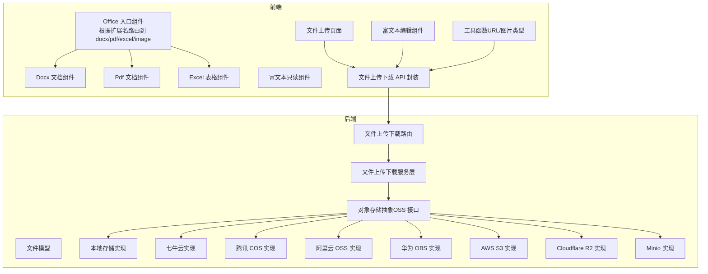
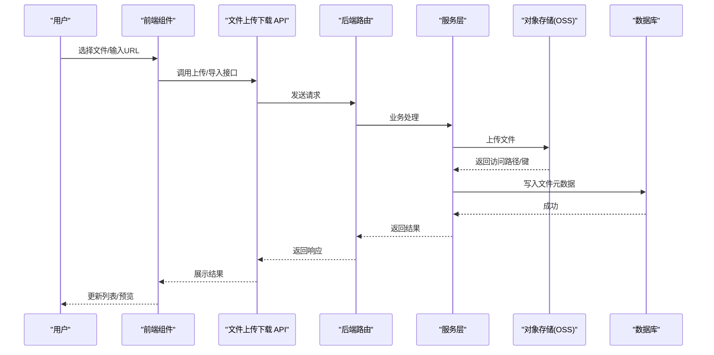
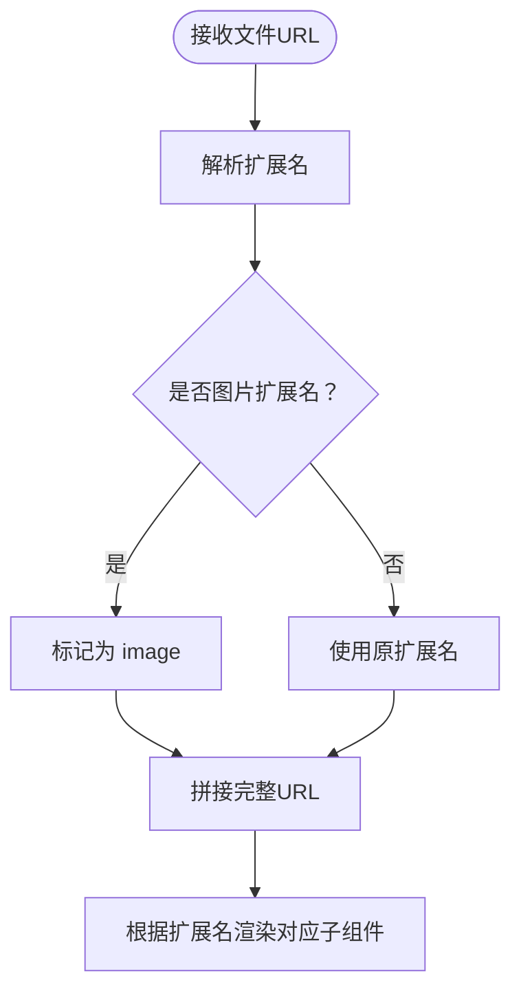
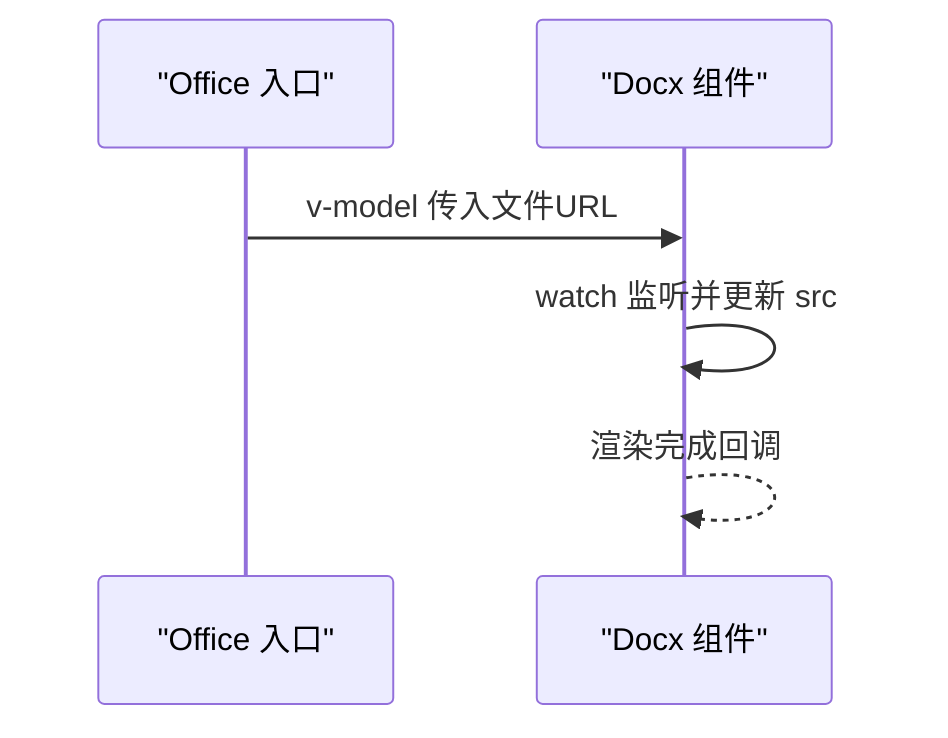
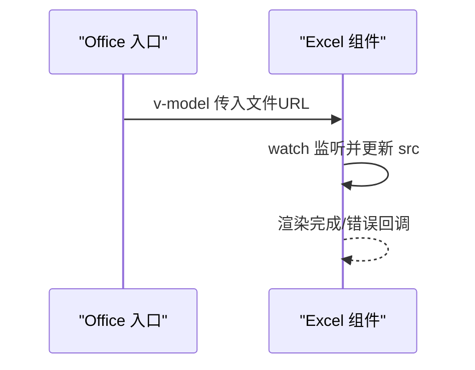
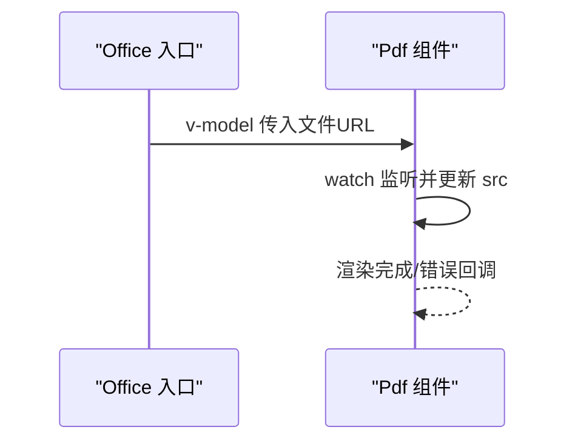
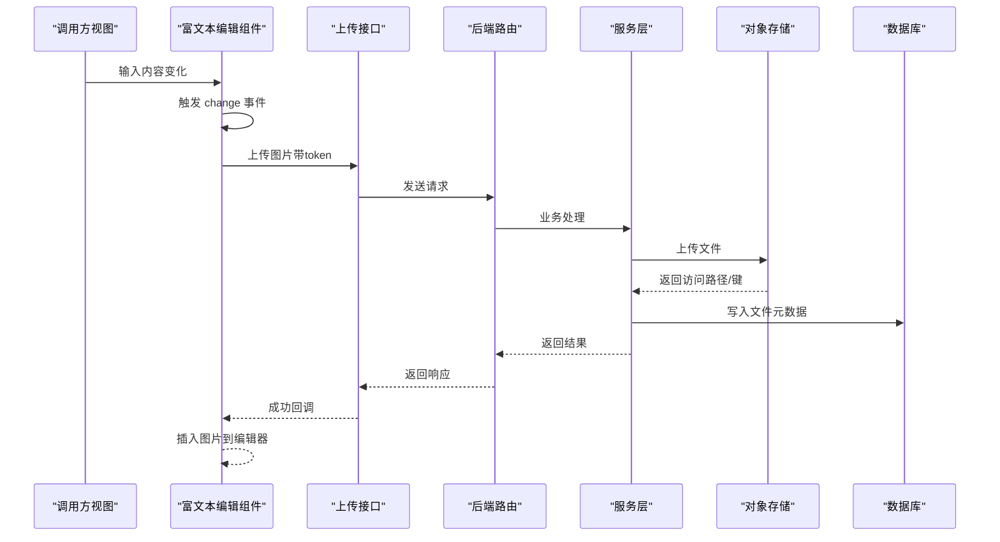
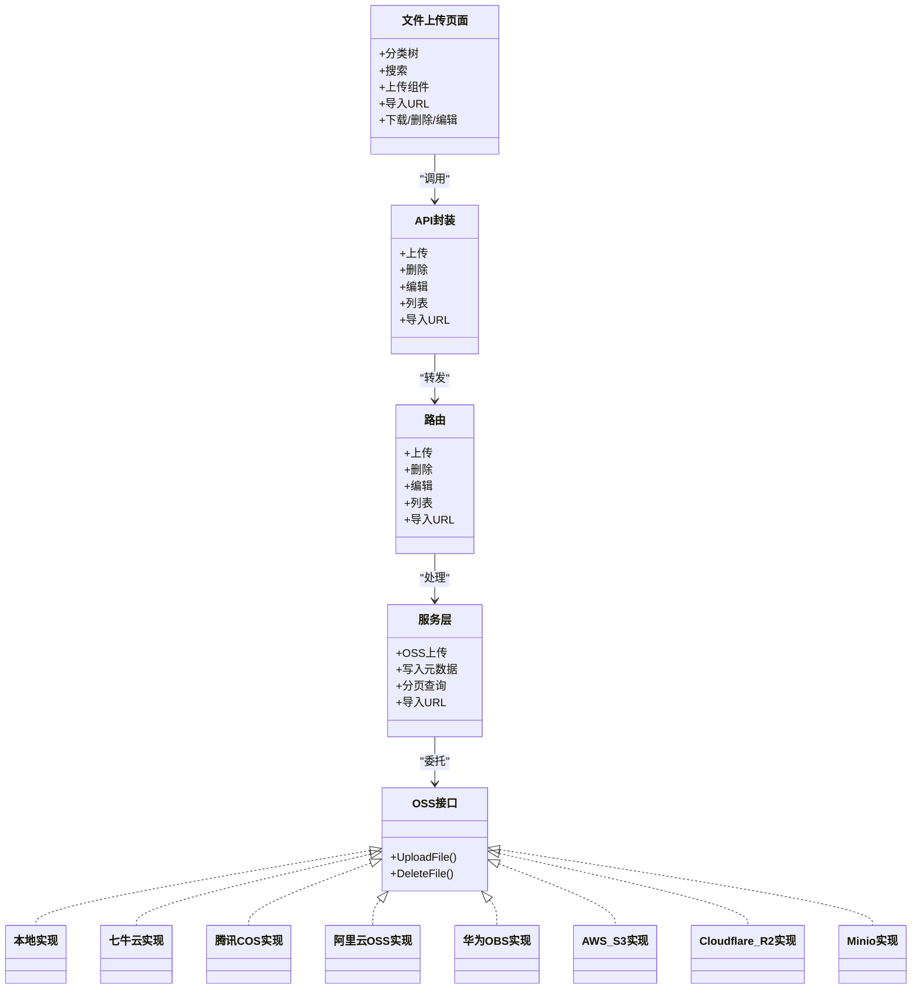
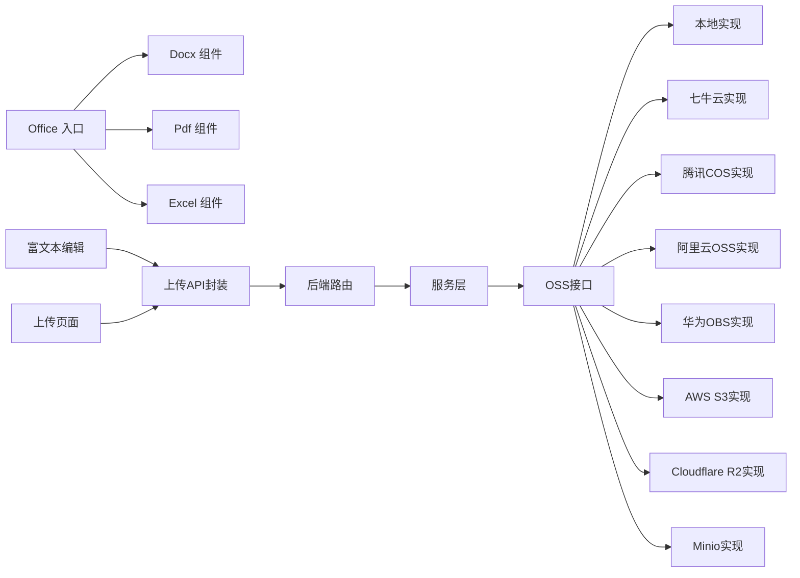

# 办公组件

<cite>
**本文引用的文件**
- [web/src/components/office/index.vue](file://web/src/components/office/index.vue)
- [web/src/components/office/docx.vue](file://web/src/components/office/docx.vue)
- [web/src/components/office/excel.vue](file://web/src/components/office/excel.vue)
- [web/src/components/office/pdf.vue](file://web/src/components/office/pdf.vue)
- [web/src/components/richtext/rich-edit.vue](file://web/src/components/richtext/rich-edit.vue)
- [web/src/components/richtext/rich-view.vue](file://web/src/components/richtext/rich-view.vue)
- [web/src/api/fileUploadAndDownload.js](file://web/src/api/fileUploadAndDownload.js)
- [web/src/view/example/upload/upload.vue](file://web/src/view/example/upload/upload.vue)
- [web/src/utils/image.js](file://web/src/utils/image.js)
- [server/api/v1/example/exa_file_upload_download.go](file://server/api/v1/example/exa_file_upload_download.go)
- [server/service/example/exa_file_upload_download.go](file://server/service/example/exa_file_upload_download.go)
- [server/model/example/exa_file_upload_download.go](file://server/model/example/exa_file_upload_download.go)
- [server/utils/upload/upload.go](file://server/utils/upload/upload.go)
- [server/config/disk.go](file://server/config/disk.go)
- [server/config/excel.go](file://server/config/excel.go)
</cite>

## 目录
1. [简介](#简介)
2. [项目结构](#项目结构)
3. [核心组件](#核心组件)
4. [架构总览](#架构总览)
5. [组件详解](#组件详解)
6. [依赖关系分析](#依赖关系分析)
7. [性能与优化](#性能与优化)
8. [权限与安全](#权限与安全)
9. [集成与使用示例](#集成与使用示例)
10. [故障排除](#故障排除)
11. [结论](#结论)

## 简介
本文件面向测试管理平台的“办公组件”，系统性梳理并说明以下能力：
- 文档处理组件（docx）
- 电子表格组件（xlsx）
- PDF 组件（pdf）
- 富文本编辑与只读组件（wangEditor）
- 文件上传、预览、下载、编辑、导入 URL 的完整流程
- 权限控制与安全策略
- 组件集成方案与性能优化建议
- 实际使用示例与故障排除指南

## 项目结构
办公组件主要由前端组件与后端接口/服务构成，前端通过统一的 Office 入口组件根据文件扩展名动态渲染对应子组件；富文本组件基于 wangEditor；文件上传与管理通过统一的上传下载 API 与服务层对接多种对象存储。

**图表来源**
- [web/src/components/office/index.vue:1-50](file://web/src/components/office/index.vue#L1-L50)
- [web/src/components/office/docx.vue:1-32](file://web/src/components/office/docx.vue#L1-L32)
- [web/src/components/office/excel.vue:1-37](file://web/src/components/office/excel.vue#L1-L37)
- [web/src/components/office/pdf.vue:1-40](file://web/src/components/office/pdf.vue#L1-L40)
- [web/src/components/richtext/rich-edit.vue:1-165](file://web/src/components/richtext/rich-edit.vue#L1-L165)
- [web/src/components/richtext/rich-view.vue:1-132](file://web/src/components/richtext/rich-view.vue#L1-L132)
- [web/src/api/fileUploadAndDownload.js:1-67](file://web/src/api/fileUploadAndDownload.js#L1-L67)
- [web/src/view/example/upload/upload.vue:1-503](file://web/src/view/example/upload/upload.vue#L1-L503)
- [web/src/utils/image.js:1-127](file://web/src/utils/image.js#L1-L127)
- [server/api/v1/example/exa_file_upload_download.go:1-136](file://server/api/v1/example/exa_file_upload_download.go#L1-L136)
- [server/service/example/exa_file_upload_download.go:1-131](file://server/service/example/exa_file_upload_download.go#L1-L131)
- [server/model/example/exa_file_upload_download.go:1-19](file://server/model/example/exa_file_upload_download.go#L1-L19)
- [server/utils/upload/upload.go:1-47](file://server/utils/upload/upload.go#L1-L47)

**章节来源**
- [web/src/components/office/index.vue:1-50](file://web/src/components/office/index.vue#L1-L50)
- [web/src/view/example/upload/upload.vue:1-503](file://web/src/view/example/upload/upload.vue#L1-L503)

## 核心组件
- Office 入口组件：根据文件扩展名动态渲染 docx/pdf/xlsx 或图片预览。
- Docx 组件：基于 @vue-office/docx 渲染 Word 文档。
- Excel 组件：基于 @vue-office/excel 渲染 Excel 表格。
- Pdf 组件：基于 @vue-office/pdf 渲染 PDF。
- 富文本编辑组件：基于 @wangeditor/editor-for-vue，支持图片上传、菜单配置。
- 富文本只读组件：基于 @wangeditor/editor-for-vue，只读模式。
- 文件上传页面：提供上传、下载、删除、编辑文件名、导入 URL 等能力。

**章节来源**
- [web/src/components/office/index.vue:1-50](file://web/src/components/office/index.vue#L1-L50)
- [web/src/components/office/docx.vue:1-32](file://web/src/components/office/docx.vue#L1-L32)
- [web/src/components/office/excel.vue:1-37](file://web/src/components/office/excel.vue#L1-L37)
- [web/src/components/office/pdf.vue:1-40](file://web/src/components/office/pdf.vue#L1-L40)
- [web/src/components/richtext/rich-edit.vue:1-165](file://web/src/components/richtext/rich-edit.vue#L1-L165)
- [web/src/components/richtext/rich-view.vue:1-132](file://web/src/components/richtext/rich-view.vue#L1-L132)
- [web/src/view/example/upload/upload.vue:1-503](file://web/src/view/example/upload/upload.vue#L1-L503)

## 架构总览
前端通过统一入口组件根据文件类型选择渲染器；富文本组件在编辑模式下可上传图片至后端接口；文件上传页面提供完整的文件生命周期管理；后端通过 OSS 抽象对接多种存储实现，并提供文件元数据持久化。

**图表来源**
- [web/src/api/fileUploadAndDownload.js:1-67](file://web/src/api/fileUploadAndDownload.js#L1-L67)
- [server/api/v1/example/exa_file_upload_download.go:1-136](file://server/api/v1/example/exa_file_upload_download.go#L1-L136)
- [server/service/example/exa_file_upload_download.go:1-131](file://server/service/example/exa_file_upload_download.go#L1-L131)
- [server/utils/upload/upload.go:1-47](file://server/utils/upload/upload.go#L1-L47)

## 组件详解

### Office 入口组件
- 功能：根据传入的文件 URL 自动识别扩展名，动态渲染 docx/pdf/xlsx 或图片预览。
- 关键逻辑：监听 modelValue，解析扩展名；对图片扩展名进行归一化处理；拼接完整访问 URL。
- 支持格式：docx、pdf、xlsx、图片（png/jpg/jpeg/gif）。

**图表来源**
- [web/src/components/office/index.vue:36-48](file://web/src/components/office/index.vue#L36-L48)

**章节来源**
- [web/src/components/office/index.vue:1-50](file://web/src/components/office/index.vue#L1-L50)

### Docx 文档组件
- 功能：渲染 Word 文档（.docx），自动引入样式。
- 数据流：接收父组件传递的文件 URL，watch 变化后更新渲染源。
- 事件：预留渲染完成回调。

**图表来源**
- [web/src/components/office/docx.vue:17-29](file://web/src/components/office/docx.vue#L17-L29)

**章节来源**
- [web/src/components/office/docx.vue:1-32](file://web/src/components/office/docx.vue#L1-L32)

### Excel 电子表格组件
- 功能：渲染 Excel 表格（.xlsx），自动引入样式。
- 数据流：接收父组件传递的文件 URL，watch 变化后更新渲染源。
- 事件：渲染完成与错误回调预留。

**图表来源**
- [web/src/components/office/excel.vue:21-34](file://web/src/components/office/excel.vue#L21-L34)

**章节来源**
- [web/src/components/office/excel.vue:1-37](file://web/src/components/office/excel.vue#L1-L37)

### Pdf 文档组件
- 功能：渲染 PDF（.pdf），自动引入样式。
- 数据流：接收父组件传递的文件 URL，watch 变化后更新渲染源。
- 事件：渲染完成与错误回调预留。

**图表来源**
- [web/src/components/office/pdf.vue:21-38](file://web/src/components/office/pdf.vue#L21-L38)

**章节来源**
- [web/src/components/office/pdf.vue:1-40](file://web/src/components/office/pdf.vue#L1-L40)

### 富文本编辑组件（wangEditor）
- 功能：提供富文本编辑能力，支持上传图片至后端接口，插入到编辑器中。
- 图片上传：通过自定义上传配置，携带 token 请求后端上传接口，成功后插入图片。
- 生命周期：组件销毁时主动释放编辑器资源。
- 样式：引入编辑器默认样式，自定义标题、列表等样式。

**图表来源**
- [web/src/components/richtext/rich-edit.vue:55-69](file://web/src/components/richtext/rich-edit.vue#L55-L69)
- [web/src/api/fileUploadAndDownload.js:60-67](file://web/src/api/fileUploadAndDownload.js#L60-L67)
- [server/api/v1/example/exa_file_upload_download.go:25-42](file://server/api/v1/example/exa_file_upload_download.go#L25-L42)
- [server/service/example/exa_file_upload_download.go:96-120](file://server/service/example/exa_file_upload_download.go#L96-L120)
- [server/utils/upload/upload.go:20-46](file://server/utils/upload/upload.go#L20-L46)

**章节来源**
- [web/src/components/richtext/rich-edit.vue:1-165](file://web/src/components/richtext/rich-edit.vue#L1-L165)

### 富文本只读组件（wangEditor）
- 功能：以只读模式展示富文本内容，适合预览场景。
- 配置：设置编辑器为只读模式，避免误操作。
- 生命周期：组件销毁时主动释放编辑器资源。

**章节来源**
- [web/src/components/richtext/rich-view.vue:1-132](file://web/src/components/richtext/rich-view.vue#L1-L132)

### 文件上传页面与 API
- 页面功能：提供分类树、搜索、上传（普通/裁剪/二维码）、导入 URL、下载、删除、编辑文件名等。
- API 封装：封装上传、删除、编辑、列表、导入 URL 等接口。
- 后端路由：提供上传、删除、编辑、列表、导入 URL 等接口。
- 服务层：负责 OSS 上传、文件元数据持久化、分页查询、URL 导入等。
- 工具函数：提供图片压缩、URL 拼接、视频/图片 MIME 类型判断等。

**图表来源**
- [web/src/view/example/upload/upload.vue:1-503](file://web/src/view/example/upload/upload.vue#L1-L503)
- [web/src/api/fileUploadAndDownload.js:1-67](file://web/src/api/fileUploadAndDownload.js#L1-L67)
- [server/api/v1/example/exa_file_upload_download.go:1-136](file://server/api/v1/example/exa_file_upload_download.go#L1-L136)
- [server/service/example/exa_file_upload_download.go:1-131](file://server/service/example/exa_file_upload_download.go#L1-L131)
- [server/utils/upload/upload.go:1-47](file://server/utils/upload/upload.go#L1-L47)

**章节来源**
- [web/src/view/example/upload/upload.vue:1-503](file://web/src/view/example/upload/upload.vue#L1-L503)
- [web/src/api/fileUploadAndDownload.js:1-67](file://web/src/api/fileUploadAndDownload.js#L1-L67)
- [server/api/v1/example/exa_file_upload_download.go:1-136](file://server/api/v1/example/exa_file_upload_download.go#L1-L136)
- [server/service/example/exa_file_upload_download.go:1-131](file://server/service/example/exa_file_upload_download.go#L1-L131)
- [web/src/utils/image.js:1-127](file://web/src/utils/image.js#L1-L127)

## 依赖关系分析
- 前端组件依赖：
  - Office 入口组件依赖 Docx/Pdf/Excel 子组件与 Element 图片组件。
  - 富文本组件依赖 @wangeditor/editor-for-vue 与 @vue-office 文档渲染库。
  - 上传页面依赖 API 封装与工具函数。
- 后端依赖：
  - 路由依赖服务层。
  - 服务层依赖 OSS 抽象与数据库。
  - OSS 抽象根据配置选择具体实现（本地/七牛/腾讯/COS/阿里/OBS/S3/R2/Minio）。

**图表来源**
- [web/src/components/office/index.vue:25-28](file://web/src/components/office/index.vue#L25-L28)
- [web/src/components/richtext/rich-edit.vue:25-30](file://web/src/components/richtext/rich-edit.vue#L25-L30)
- [web/src/view/example/upload/upload.vue:214-230](file://web/src/view/example/upload/upload.vue#L214-L230)
- [server/utils/upload/upload.go:20-46](file://server/utils/upload/upload.go#L20-L46)

**章节来源**
- [web/src/components/office/index.vue:1-50](file://web/src/components/office/index.vue#L1-L50)
- [web/src/components/richtext/rich-edit.vue:1-165](file://web/src/components/richtext/rich-edit.vue#L1-L165)
- [web/src/view/example/upload/upload.vue:1-503](file://web/src/view/example/upload/upload.vue#L1-L503)
- [server/utils/upload/upload.go:1-47](file://server/utils/upload/upload.go#L1-L47)

## 性能与优化
- 文档/表格/PDF 渲染：
  - 使用 @vue-office 提供的懒加载与按需样式，避免一次性加载过多资源。
  - 在 Office 入口组件中按扩展名精确渲染，减少不必要的组件实例化。
- 富文本编辑：
  - 编辑器在组件销毁时主动释放，避免内存泄漏。
  - 图片上传采用异步回调，避免阻塞主线程。
- 文件上传：
  - 服务层在 noSave=0 时去重（基于 key），避免重复入库。
  - OSS 抽象按配置选择实现，便于横向扩展与性能优化。
- 前端工具：
  - 图片压缩工具在浏览器端进行预处理，降低上传体积与带宽消耗。
  - URL 拼接工具统一处理相对/绝对路径，减少重复计算。

**章节来源**
- [web/src/components/office/index.vue:36-48](file://web/src/components/office/index.vue#L36-L48)
- [web/src/components/richtext/rich-edit.vue:72-81](file://web/src/components/richtext/rich-edit.vue#L72-L81)
- [server/service/example/exa_file_upload_download.go:110-120](file://server/service/example/exa_file_upload_download.go#L110-L120)
- [web/src/utils/image.js:1-127](file://web/src/utils/image.js#L1-L127)

## 权限与安全
- 认证与授权：
  - 后端接口标注 ApiKeyAuth 安全方案，确保请求具备有效令牌。
- 上传安全：
  - 服务层根据配置选择 OSS 实现，默认兜底为本地存储。
  - 上传接口支持 classId 分类标识，便于后续权限控制与审计。
- 富文本图片上传：
  - 上传请求附带 x-token 头，后端校验通过后才允许插入图片。
- 下载与预览：
  - 上传页面统一通过后端拼接完整 URL，避免直接暴露存储地址。
- 配置项：
  - 本地磁盘挂载点与 Excel 导出目录可通过配置文件调整，便于隔离与安全加固。

**章节来源**
- [server/api/v1/example/exa_file_upload_download.go:17-42](file://server/api/v1/example/exa_file_upload_download.go#L17-L42)
- [web/src/components/richtext/rich-edit.vue:58-69](file://web/src/components/richtext/rich-edit.vue#L58-L69)
- [web/src/view/example/upload/upload.vue:311-317](file://web/src/view/example/upload/upload.vue#L311-L317)
- [server/utils/upload/upload.go:20-46](file://server/utils/upload/upload.go#L20-L46)
- [server/config/disk.go:1-10](file://server/config/disk.go#L1-L10)
- [server/config/excel.go:1-6](file://server/config/excel.go#L1-L6)

## 集成与使用示例
- Office 组件集成：
  - 在需要预览的页面传入文件 URL，组件会自动识别扩展名并渲染对应组件。
  - 示例路径参考：[web/src/components/office/index.vue:1-50](file://web/src/components/office/index.vue#L1-L50)
- 富文本组件集成：
  - 编辑模式：使用富文本编辑组件，配置上传接口与 token。
  - 只读模式：使用富文本只读组件，展示已保存的内容。
  - 示例路径参考：
    - [web/src/components/richtext/rich-edit.vue:1-165](file://web/src/components/richtext/rich-edit.vue#L1-L165)
    - [web/src/components/richtext/rich-view.vue:1-132](file://web/src/components/richtext/rich-view.vue#L1-L132)
- 文件上传页面集成：
  - 在业务页面嵌入上传页面组件，即可获得完整的文件管理能力。
  - 示例路径参考：[web/src/view/example/upload/upload.vue:1-503](file://web/src/view/example/upload/upload.vue#L1-L503)
- API 使用：
  - 通过 API 封装调用上传、删除、编辑、列表、导入 URL 等接口。
  - 示例路径参考：[web/src/api/fileUploadAndDownload.js:1-67](file://web/src/api/fileUploadAndDownload.js#L1-L67)

**章节来源**
- [web/src/components/office/index.vue:1-50](file://web/src/components/office/index.vue#L1-L50)
- [web/src/components/richtext/rich-edit.vue:1-165](file://web/src/components/richtext/rich-edit.vue#L1-L165)
- [web/src/components/richtext/rich-view.vue:1-132](file://web/src/components/richtext/rich-view.vue#L1-L132)
- [web/src/view/example/upload/upload.vue:1-503](file://web/src/view/example/upload/upload.vue#L1-L503)
- [web/src/api/fileUploadAndDownload.js:1-67](file://web/src/api/fileUploadAndDownload.js#L1-L67)

## 故障排除
- Office 组件无法渲染：
  - 检查传入 URL 的扩展名是否正确，Office 组件按扩展名分支渲染。
  - 确认完整 URL 拼接逻辑是否生效。
  - 参考：[web/src/components/office/index.vue:36-48](file://web/src/components/office/index.vue#L36-L48)
- Docx/Pdf/Excel 无法显示：
  - 确认父组件已传入正确的文件 URL。
  - 检查网络连通性与跨域配置。
  - 参考：
    - [web/src/components/office/docx.vue:22-28](file://web/src/components/office/docx.vue#L22-L28)
    - [web/src/components/office/pdf.vue:28-32](file://web/src/components/office/pdf.vue#L28-L32)
    - [web/src/components/office/excel.vue:28-32](file://web/src/components/office/excel.vue#L28-L32)
- 富文本图片上传失败：
  - 检查 x-token 是否正确传递。
  - 确认后端上传接口返回结构与前端自定义插入逻辑一致。
  - 参考：[web/src/components/richtext/rich-edit.vue:55-69](file://web/src/components/richtext/rich-edit.vue#L55-L69)
- 上传页面列表为空或分页异常：
  - 检查搜索条件与分页参数是否正确传递。
  - 确认后端分页查询逻辑与关键字过滤是否生效。
  - 参考：[web/src/view/example/upload/upload.vue:269-281](file://web/src/view/example/upload/upload.vue#L269-L281)
- OSS 上传失败：
  - 检查配置文件中的 OSS 类型与连接参数。
  - 若使用 Minio，确认初始化成功且 SSL/端点配置正确。
  - 参考：
    - [server/utils/upload/upload.go:20-46](file://server/utils/upload/upload.go#L20-L46)
    - [server/config/disk.go:1-10](file://server/config/disk.go#L1-L10)
    - [server/config/excel.go:1-6](file://server/config/excel.go#L1-L6)

**章节来源**
- [web/src/components/office/index.vue:36-48](file://web/src/components/office/index.vue#L36-L48)
- [web/src/components/office/docx.vue:22-28](file://web/src/components/office/docx.vue#L22-L28)
- [web/src/components/office/pdf.vue:28-32](file://web/src/components/office/pdf.vue#L28-L32)
- [web/src/components/office/excel.vue:28-32](file://web/src/components/office/excel.vue#L28-L32)
- [web/src/components/richtext/rich-edit.vue:55-69](file://web/src/components/richtext/rich-edit.vue#L55-L69)
- [web/src/view/example/upload/upload.vue:269-281](file://web/src/view/example/upload/upload.vue#L269-L281)
- [server/utils/upload/upload.go:20-46](file://server/utils/upload/upload.go#L20-L46)
- [server/config/disk.go:1-10](file://server/config/disk.go#L1-L10)
- [server/config/excel.go:1-6](file://server/config/excel.go#L1-L6)

## 结论
办公组件通过统一入口与清晰的职责划分，实现了文档、表格、PDF 的高效预览与富文本的便捷编辑。配合完善的上传下载 API 与多存储后端抽象，满足不同部署环境的安全与性能需求。建议在生产环境中结合权限体系与日志审计，持续优化渲染性能与用户体验。