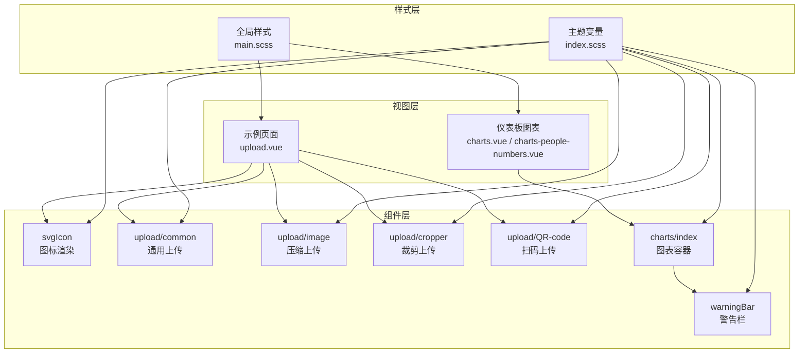
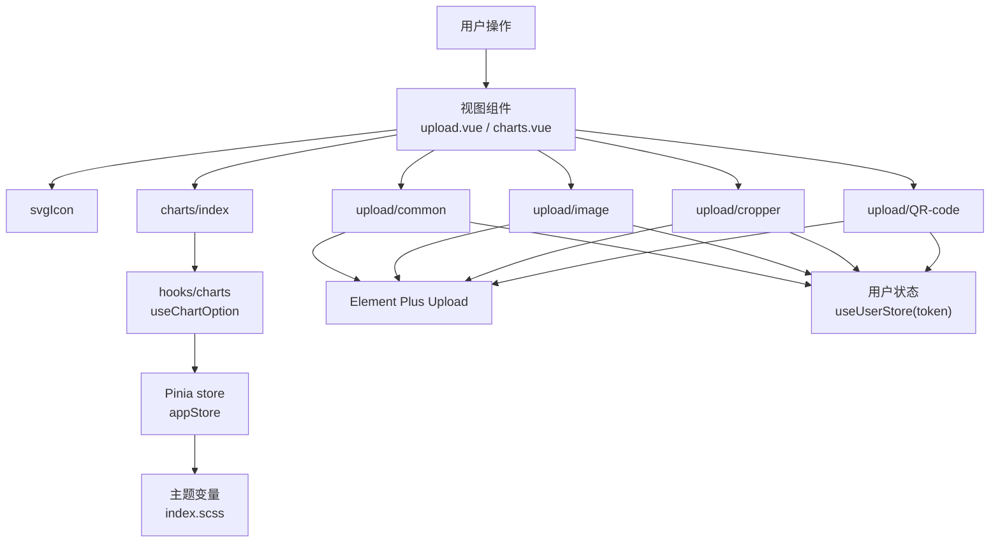
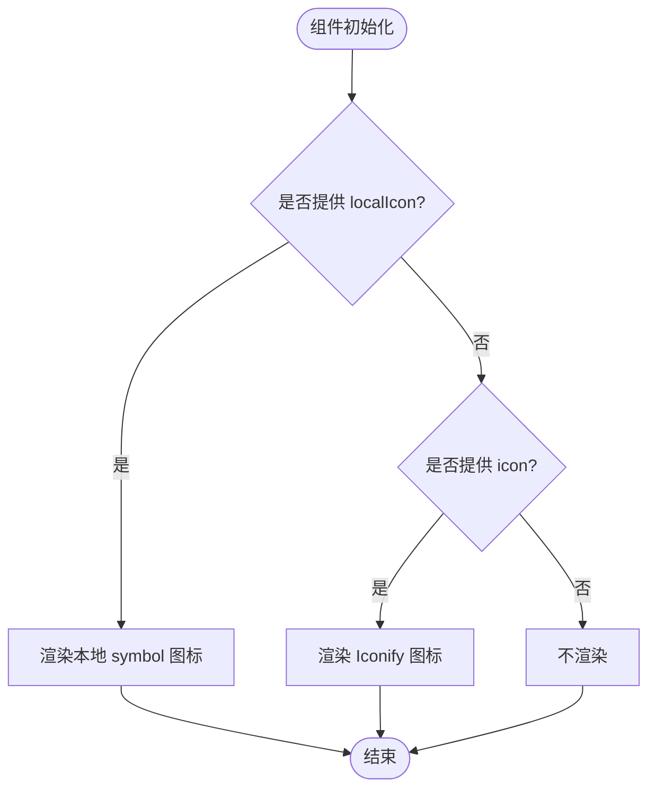
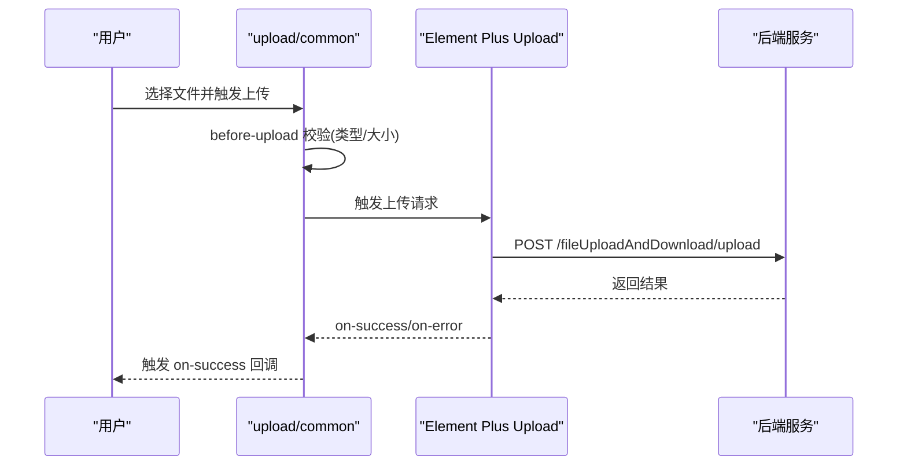
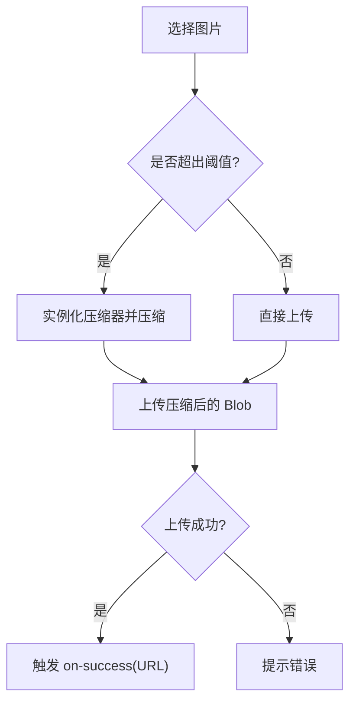
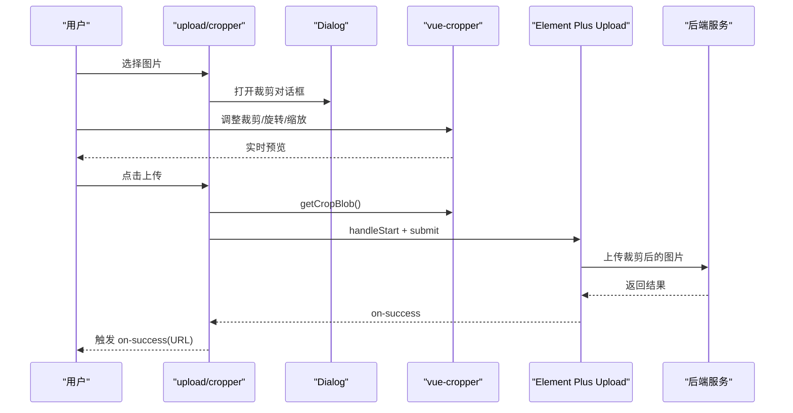
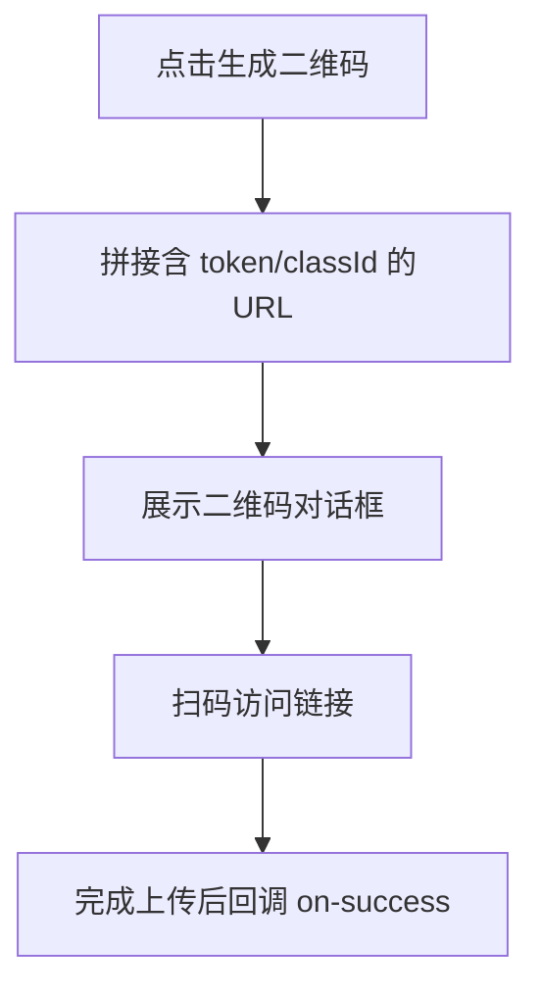
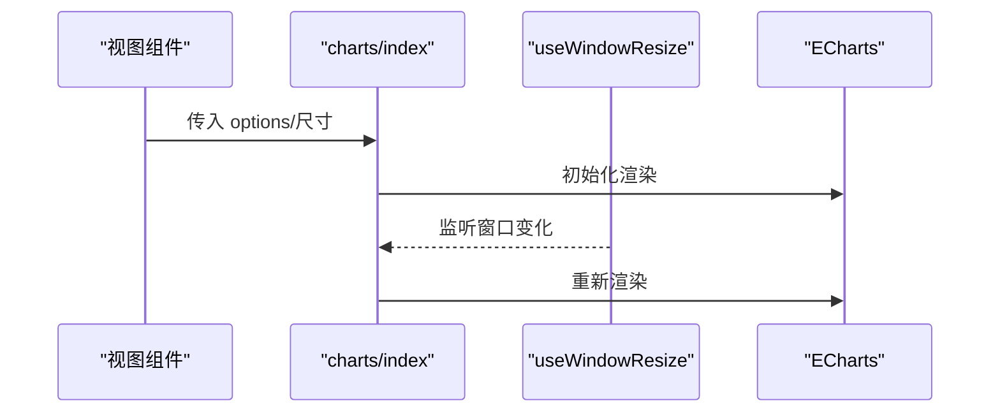
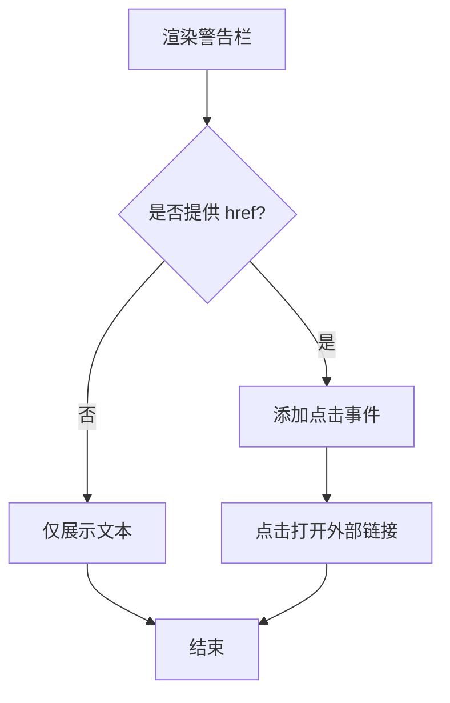
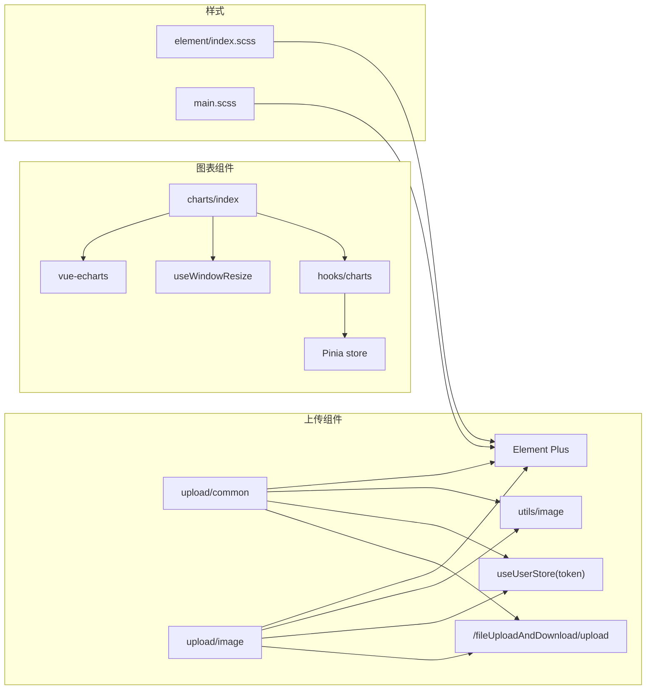

# 组件系统

<cite>
**本文引用的文件**
- [web/src/components/svgIcon/svgIcon.vue](file://web/src/components/svgIcon/svgIcon.vue)
- [web/src/components/upload/common.vue](file://web/src/components/upload/common.vue)
- [web/src/components/upload/image.vue](file://web/src/components/upload/image.vue)
- [web/src/components/upload/cropper.vue](file://web/src/components/upload/cropper.vue)
- [web/src/components/upload/QR-code.vue](file://web/src/components/upload/QR-code.vue)
- [web/src/components/charts/index.vue](file://web/src/components/charts/index.vue)
- [web/src/components/warningBar/warningBar.vue](file://web/src/components/warningBar/warningBar.vue)
- [web/src/style/element/index.scss](file://web/src/style/element/index.scss)
- [web/src/style/main.scss](file://web/src/style/main.scss)
- [web/src/view/example/upload/upload.vue](file://web/src/view/example/upload/upload.vue)
- [web/src/view/dashboard/components/charts.vue](file://web/src/view/dashboard/components/charts.vue)
- [web/src/view/dashboard/components/charts-people-numbers.vue](file://web/src/view/dashboard/components/charts-people-numbers.vue)
</cite>

## 目录
1. [简介](#简介)
2. [项目结构](#项目结构)
3. [核心组件](#核心组件)
4. [架构总览](#架构总览)
5. [组件详解](#组件详解)
6. [依赖关系分析](#依赖关系分析)
7. [性能与可维护性](#性能与可维护性)
8. [故障排查指南](#故障排查指南)
9. [结论](#结论)
10. [附录](#附录)

## 简介
本文件面向测试管理平台的前端组件体系，聚焦于基于 Element Plus 的 UI 组件库使用与自定义组件开发。重点覆盖以下组件族：
- SVG 图标组件：统一图标渲染，支持本地 symbol 与在线 Iconify 图标。
- 上传组件族：通用上传、图片压缩上传、图片裁剪上传、扫码上传。
- 图表组件：基于 vue-echarts 的封装，支持响应式与主题色联动。
- 警告栏组件：信息提示与引导跳转。

文档从架构、数据流、处理逻辑、样式定制与主题适配、复用模式与最佳实践、性能优化与常见问题等方面进行系统化说明，并提供可视化图示与参考路径，便于开发者快速理解与扩展。

## 项目结构
前端组件主要位于 web/src/components 下，按功能域划分：
- svgIcon：图标组件
- upload：上传组件族（common、image、cropper、QR-code）
- charts：图表容器
- warningBar：警告栏

样式方面：
- 主题变量覆盖位于 web/src/style/element/index.scss
- 全局样式与组件样式位于 web/src/style/main.scss

**图表来源**
- [web/src/components/svgIcon/svgIcon.vue:1-45](file://web/src/components/svgIcon/svgIcon.vue#L1-L45)
- [web/src/components/upload/common.vue:1-91](file://web/src/components/upload/common.vue#L1-L91)
- [web/src/components/upload/image.vue:1-103](file://web/src/components/upload/image.vue#L1-L103)
- [web/src/components/upload/cropper.vue:1-238](file://web/src/components/upload/cropper.vue#L1-L238)
- [web/src/components/upload/QR-code.vue:1-66](file://web/src/components/upload/QR-code.vue#L1-L66)
- [web/src/components/charts/index.vue:1-48](file://web/src/components/charts/index.vue#L1-L48)
- [web/src/components/warningBar/warningBar.vue:1-34](file://web/src/components/warningBar/warningBar.vue#L1-L34)
- [web/src/style/element/index.scss:1-25](file://web/src/style/element/index.scss#L1-L25)
- [web/src/style/main.scss:1-60](file://web/src/style/main.scss#L1-L60)
- [web/src/view/example/upload/upload.vue:1-503](file://web/src/view/example/upload/upload.vue#L1-L503)
- [web/src/view/dashboard/components/charts.vue:1-50](file://web/src/view/dashboard/components/charts.vue#L1-L50)
- [web/src/view/dashboard/components/charts-people-numbers.vue:1-131](file://web/src/view/dashboard/components/charts-people-numbers.vue#L1-L131)

**章节来源**
- [web/src/components/svgIcon/svgIcon.vue:1-45](file://web/src/components/svgIcon/svgIcon.vue#L1-L45)
- [web/src/components/upload/common.vue:1-91](file://web/src/components/upload/common.vue#L1-L91)
- [web/src/components/upload/image.vue:1-103](file://web/src/components/upload/image.vue#L1-L103)
- [web/src/components/upload/cropper.vue:1-238](file://web/src/components/upload/cropper.vue#L1-L238)
- [web/src/components/upload/QR-code.vue:1-66](file://web/src/components/upload/QR-code.vue#L1-L66)
- [web/src/components/charts/index.vue:1-48](file://web/src/components/charts/index.vue#L1-L48)
- [web/src/components/warningBar/warningBar.vue:1-34](file://web/src/components/warningBar/warningBar.vue#L1-L34)
- [web/src/style/element/index.scss:1-25](file://web/src/style/element/index.scss#L1-L25)
- [web/src/style/main.scss:1-60](file://web/src/style/main.scss#L1-L60)
- [web/src/view/example/upload/upload.vue:1-503](file://web/src/view/example/upload/upload.vue#L1-L503)
- [web/src/view/dashboard/components/charts.vue:1-50](file://web/src/view/dashboard/components/charts.vue#L1-L50)
- [web/src/view/dashboard/components/charts-people-numbers.vue:1-131](file://web/src/view/dashboard/components/charts-people-numbers.vue#L1-L131)

## 核心组件
- SVG 图标组件：支持本地 symbol 与在线 Iconify 图标，统一绑定类名与内联样式，便于主题与尺寸控制。
- 上传组件族：提供多场景上传能力，包括通用文件上传、图片压缩上传、图片裁剪上传与扫码上传，均通过 Element Plus Upload 组件封装并统一鉴权与回调。
- 图表组件：基于 vue-echarts 封装，提供自动重绘与窗口尺寸变化监听，支持主题色联动与渐变配置。
- 警告栏组件：提供带图标与可选链接的提示条，支持暗色主题适配与点击打开外部链接。

**章节来源**
- [web/src/components/svgIcon/svgIcon.vue:16-43](file://web/src/components/svgIcon/svgIcon.vue#L16-L43)
- [web/src/components/upload/common.vue:35-42](file://web/src/components/upload/common.vue#L35-L42)
- [web/src/components/upload/image.vue:29-46](file://web/src/components/upload/image.vue#L29-L46)
- [web/src/components/upload/cropper.vue:99-104](file://web/src/components/upload/cropper.vue#L99-L104)
- [web/src/components/upload/QR-code.vue:42-47](file://web/src/components/upload/QR-code.vue#L42-L47)
- [web/src/components/charts/index.vue:15-34](file://web/src/components/charts/index.vue#L15-L34)
- [web/src/components/warningBar/warningBar.vue:17-26](file://web/src/components/warningBar/warningBar.vue#L17-L26)

## 架构总览
组件系统围绕“视图层调用组件层，组件层依赖 Element Plus 与第三方库，样式层统一主题变量与全局样式”的架构展开。图表组件通过钩子与 Pinia store 获取主题色，上传组件通过用户状态注入 Token 并统一错误提示。

**图表来源**
- [web/src/view/example/upload/upload.vue:55-72](file://web/src/view/example/upload/upload.vue#L55-L72)
- [web/src/view/dashboard/components/charts.vue:18-23](file://web/src/view/dashboard/components/charts.vue#L18-L23)
- [web/src/components/charts/index.vue:10-13](file://web/src/components/charts/index.vue#L10-L13)
- [web/src/view/dashboard/components/charts-people-numbers.vue:6-13](file://web/src/view/dashboard/components/charts-people-numbers.vue#L6-L13)
- [web/src/style/element/index.scss:1-25](file://web/src/style/element/index.scss#L1-L25)
- [web/src/components/upload/common.vue:25-33](file://web/src/components/upload/common.vue#L25-L33)
- [web/src/components/upload/image.vue:22-50](file://web/src/components/upload/image.vue#L22-L50)
- [web/src/components/upload/cropper.vue:91-111](file://web/src/components/upload/cropper.vue#L91-L111)
- [web/src/components/upload/QR-code.vue:34-51](file://web/src/components/upload/QR-code.vue#L34-L51)

## 组件详解

### SVG 图标组件（svgIcon）
- 功能要点
  - 支持本地 symbol 图标与在线 Iconify 图标，通过属性切换渲染路径。
  - 统一透传类名与内联样式，便于尺寸与颜色控制。
- 关键属性
  - localIcon：本地 symbol id（字符串，可选）
  - icon：Iconify 图标名称（字符串，可选）
- 插槽与事件
  - 无插槽；通过 v-bind 绑定原生属性。
- 使用建议
  - 优先使用本地 symbol 以减少网络请求；在线图标用于动态内容。
  - 结合主题变量与类名控制尺寸与颜色。

**图表来源**
- [web/src/components/svgIcon/svgIcon.vue:1-10](file://web/src/components/svgIcon/svgIcon.vue#L1-L10)
- [web/src/components/svgIcon/svgIcon.vue:24-37](file://web/src/components/svgIcon/svgIcon.vue#L24-L37)
- [web/src/components/svgIcon/svgIcon.vue:38-43](file://web/src/components/svgIcon/svgIcon.vue#L38-L43)

**章节来源**
- [web/src/components/svgIcon/svgIcon.vue:16-43](file://web/src/components/svgIcon/svgIcon.vue#L16-L43)

### 上传组件族

#### 通用上传（upload/common）
- 功能要点
  - 基于 Element Plus Upload，统一鉴权（Token 注入）、文件类型与大小校验、上传成功/失败回调。
  - 默认隐藏文件列表，支持多文件上传。
- 关键属性
  - classId：所属分类 ID（数字，默认 0）
- 事件
  - on-success：上传成功回调，返回文件 URL
- 校验规则
  - 图片：限制大小与格式；视频：限制大小与格式。
- 错误处理
  - 失败时提示错误消息并关闭加载态。

**图表来源**
- [web/src/components/upload/common.vue:3-15](file://web/src/components/upload/common.vue#L3-L15)
- [web/src/components/upload/common.vue:46-74](file://web/src/components/upload/common.vue#L46-L74)
- [web/src/components/upload/common.vue:76-81](file://web/src/components/upload/common.vue#L76-L81)
- [web/src/components/upload/common.vue:83-89](file://web/src/components/upload/common.vue#L83-L89)

**章节来源**
- [web/src/components/upload/common.vue:35-42](file://web/src/components/upload/common.vue#L35-L42)
- [web/src/components/upload/common.vue:46-74](file://web/src/components/upload/common.vue#L46-L74)
- [web/src/components/upload/common.vue:76-89](file://web/src/components/upload/common.vue#L76-L89)

#### 图片压缩上传（upload/image）
- 功能要点
  - 针对图片上传，支持超限自动压缩与尺寸上限控制。
  - 仅允许 JPG/PNG，超出阈值自动压缩。
- 关键属性
  - imageUrl：当前显示的图片 URL（字符串，默认空）
  - fileSize：压缩阈值 KB（数字，默认 2048）
  - maxWH：最大边长（像素，默认 1920）
  - classId：分类 ID（数字，默认 0）
- 事件
  - on-success：上传成功回调，返回文件 URL

**图表来源**
- [web/src/components/upload/image.vue:52-67](file://web/src/components/upload/image.vue#L52-L67)
- [web/src/components/upload/image.vue:69-74](file://web/src/components/upload/image.vue#L69-L74)

**章节来源**
- [web/src/components/upload/image.vue:29-46](file://web/src/components/upload/image.vue#L29-L46)
- [web/src/components/upload/image.vue:52-67](file://web/src/components/upload/image.vue#L52-L67)
- [web/src/components/upload/image.vue:69-74](file://web/src/components/upload/image.vue#L69-L74)

#### 图片裁剪上传（upload/cropper）
- 功能要点
  - 弹窗内集成 vue-cropper，支持旋转、缩放、比例固定与实时预览。
  - 生成裁剪区域的 Blob 后提交到服务端。
- 关键属性
  - classId：分类 ID（数字，默认 0）
- 事件
  - on-success：上传成功回调，返回文件 URL
- 交互流程
  - 选择图片 -> 弹窗展示 -> 调整裁剪与工具 -> 生成 Blob -> 提交上传 -> 成功提示

**图表来源**
- [web/src/components/upload/cropper.vue:16-81](file://web/src/components/upload/cropper.vue#L16-L81)
- [web/src/components/upload/cropper.vue:166-184](file://web/src/components/upload/cropper.vue#L166-L184)
- [web/src/components/upload/cropper.vue:202-216](file://web/src/components/upload/cropper.vue#L202-L216)
- [web/src/components/upload/cropper.vue:218-229](file://web/src/components/upload/cropper.vue#L218-L229)

**章节来源**
- [web/src/components/upload/cropper.vue:99-104](file://web/src/components/upload/cropper.vue#L99-L104)
- [web/src/components/upload/cropper.vue:121-163](file://web/src/components/upload/cropper.vue#L121-L163)
- [web/src/components/upload/cropper.vue:166-184](file://web/src/components/upload/cropper.vue#L166-L184)
- [web/src/components/upload/cropper.vue:202-229](file://web/src/components/upload/cropper.vue#L202-L229)

#### 扫码上传（upload/QR-code）
- 功能要点
  - 生成包含 token 与分类 ID 的二维码链接，扫码后跳转至扫描上传页。
- 关键属性
  - classId：分类 ID（数字，默认 0）
- 事件
  - on-success：完成上传后回调（用于刷新列表）

**图表来源**
- [web/src/components/upload/QR-code.vue:53-58](file://web/src/components/upload/QR-code.vue#L53-L58)
- [web/src/components/upload/QR-code.vue:60-64](file://web/src/components/upload/QR-code.vue#L60-L64)

**章节来源**
- [web/src/components/upload/QR-code.vue:42-47](file://web/src/components/upload/QR-code.vue#L42-L47)
- [web/src/components/upload/QR-code.vue:53-58](file://web/src/components/upload/QR-code.vue#L53-L58)
- [web/src/components/upload/QR-code.vue:60-64](file://web/src/components/upload/QR-code.vue#L60-L64)

### 图表组件（charts/index）
- 功能要点
  - 基于 vue-echarts 渲染，支持自动重绘与窗口尺寸变化监听。
  - 通过钩子 useWindowResize 控制重绘时机，避免闪烁。
- 关键属性
  - options：图表配置对象（对象，默认空对象）
  - autoResize：是否自动重绘（布尔，默认 true）
  - width/height：容器尺寸（字符串，默认 100%）
- 使用示例
  - 在视图中通过 Chart 包裹具体图表配置，如折线图、柱状图等。

**图表来源**
- [web/src/components/charts/index.vue:10-13](file://web/src/components/charts/index.vue#L10-L13)
- [web/src/components/charts/index.vue:35-44](file://web/src/components/charts/index.vue#L35-L44)
- [web/src/view/dashboard/components/charts-people-numbers.vue:6-13](file://web/src/view/dashboard/components/charts-people-numbers.vue#L6-L13)

**章节来源**
- [web/src/components/charts/index.vue:15-34](file://web/src/components/charts/index.vue#L15-L34)
- [web/src/components/charts/index.vue:35-44](file://web/src/components/charts/index.vue#L35-L44)
- [web/src/view/dashboard/components/charts.vue:18-23](file://web/src/view/dashboard/components/charts.vue#L18-L23)
- [web/src/view/dashboard/components/charts-people-numbers.vue:42-127](file://web/src/view/dashboard/components/charts-people-numbers.vue#L42-L127)

### 警告栏组件（warningBar）
- 功能要点
  - 展示提示信息，支持可选链接点击打开。
  - 暗色主题下自动适配文字与背景色。
- 关键属性
  - title：提示文本（字符串，默认空）
  - href：可选链接地址（字符串，默认空）

**图表来源**
- [web/src/components/warningBar/warningBar.vue:1-13](file://web/src/components/warningBar/warningBar.vue#L1-L13)
- [web/src/components/warningBar/warningBar.vue:17-26](file://web/src/components/warningBar/warningBar.vue#L17-L26)
- [web/src/components/warningBar/warningBar.vue:28-32](file://web/src/components/warningBar/warningBar.vue#L28-L32)

**章节来源**
- [web/src/components/warningBar/warningBar.vue:17-26](file://web/src/components/warningBar/warningBar.vue#L17-L26)
- [web/src/components/warningBar/warningBar.vue:28-32](file://web/src/components/warningBar/warningBar.vue#L28-L32)

## 依赖关系分析
- 组件间依赖
  - upload/image 依赖 utils/image 中的压缩工具。
  - upload/common、upload/image、upload/cropper、upload/QR-code 均依赖用户状态注入 token。
  - charts/index 依赖 hooks/use-window-resize 与 vue-echarts。
  - 图表配置依赖 hooks/charts 与 Pinia store。
- 外部依赖
  - Element Plus（Upload、Button、Dialog、Select、Statistic 等）
  - vue-echarts、vue-cropper、@iconify/vue
- 样式依赖
  - 主题变量覆盖 element-plus 主题色；全局样式统一表格、按钮组、滚动条等。

**图表来源**
- [web/src/components/upload/common.vue:20-25](file://web/src/components/upload/common.vue#L20-L25)
- [web/src/components/upload/image.vue:18-22](file://web/src/components/upload/image.vue#L18-L22)
- [web/src/components/upload/cropper.vue:87-91](file://web/src/components/upload/cropper.vue#L87-L91)
- [web/src/components/charts/index.vue:12-13](file://web/src/components/charts/index.vue#L12-L13)
- [web/src/style/element/index.scss:1-25](file://web/src/style/element/index.scss#L1-L25)
- [web/src/style/main.scss:1-60](file://web/src/style/main.scss#L1-L60)

**章节来源**
- [web/src/components/upload/common.vue:20-25](file://web/src/components/upload/common.vue#L20-L25)
- [web/src/components/upload/image.vue:18-22](file://web/src/components/upload/image.vue#L18-L22)
- [web/src/components/upload/cropper.vue:87-91](file://web/src/components/upload/cropper.vue#L87-L91)
- [web/src/components/charts/index.vue:12-13](file://web/src/components/charts/index.vue#L12-L13)
- [web/src/style/element/index.scss:1-25](file://web/src/style/element/index.scss#L1-L25)
- [web/src/style/main.scss:1-60](file://web/src/style/main.scss#L1-L60)

## 性能与可维护性
- 性能优化建议
  - 上传组件
    - 图片压缩与裁剪在前端完成，减少后端压力；注意控制压缩阈值与最大边长，避免过度压缩影响体验。
    - 对大文件上传采用分片或断点续传策略（当前代码未实现，可在后续扩展）。
  - 图表组件
    - 自动重绘仅在窗口变化时触发，避免频繁重绘导致卡顿；必要时可增加节流。
    - 图表配置尽量复用，避免每次渲染都创建新对象。
  - 样式
    - 主题变量集中管理，避免重复覆盖；全局样式统一组件默认行为，降低维护成本。
- 可维护性建议
  - 组件属性与事件命名保持一致，文档化默认值与约束。
  - 将通用逻辑抽取为工具函数或组合式函数（如 useWindowResize、hooks/charts），提升复用度。
  - 对外暴露的组件尽量无副作用，通过 props 与 emits 明确接口。

[本节为通用指导，无需列出章节来源]

## 故障排查指南
- 上传失败
  - 检查 Token 注入与后端鉴权；确认 headers 中 x-token 正确传递。
  - 校验文件类型与大小是否满足要求；查看控制台日志定位失败原因。
- 图片压缩无效
  - 确认 utils/image 压缩器正确初始化；检查 fileSize 与 maxWH 参数是否合理。
- 图表不显示或尺寸异常
  - 确认容器尺寸设置与 autoResize；检查 useWindowResize 钩子是否生效。
- 警告栏无法跳转
  - 检查 href 是否为空；确认浏览器未拦截弹窗。
- 主题色不生效
  - 检查 element/index.scss 中主题变量覆盖顺序；确保样式文件被正确引入。

**章节来源**
- [web/src/components/upload/common.vue:83-89](file://web/src/components/upload/common.vue#L83-L89)
- [web/src/components/upload/image.vue:52-67](file://web/src/components/upload/image.vue#L52-L67)
- [web/src/components/charts/index.vue:35-44](file://web/src/components/charts/index.vue#L35-L44)
- [web/src/components/warningBar/warningBar.vue:28-32](file://web/src/components/warningBar/warningBar.vue#L28-L32)
- [web/src/style/element/index.scss:1-25](file://web/src/style/element/index.scss#L1-L25)

## 结论
本组件系统以 Element Plus 为基础，结合 vue-echarts、vue-cropper、@iconify/vue 等生态，构建了覆盖图标、上传、图表与提示的基础组件库。通过统一的主题变量与全局样式，保证了视觉一致性；通过 props、事件与插槽的清晰设计，提升了组件的可复用性与可扩展性。建议在后续迭代中进一步完善上传的断点续传与图表的交互细节，并持续沉淀组件规范与最佳实践。

[本节为总结性内容，无需列出章节来源]

## 附录

### 组件属性与事件速查
- svgIcon
  - 属性：localIcon（字符串）、icon（字符串）
  - 行为：根据属性切换渲染路径
- upload/common
  - 属性：classId（数字）
  - 事件：on-success（回调文件 URL）
- upload/image
  - 属性：imageUrl（字符串）、fileSize（数字）、maxWH（数字）、classId（数字）
  - 事件：on-success（回调文件 URL）
- upload/cropper
  - 属性：classId（数字）
  - 事件：on-success（回调文件 URL）
- upload/QR-code
  - 属性：classId（数字）
  - 事件：on-success（完成回调）
- charts/index
  - 属性：options（对象）、autoResize（布尔）、width（字符串）、height（字符串）
- warningBar
  - 属性：title（字符串）、href（字符串）

**章节来源**
- [web/src/components/svgIcon/svgIcon.vue:24-37](file://web/src/components/svgIcon/svgIcon.vue#L24-L37)
- [web/src/components/upload/common.vue:35-42](file://web/src/components/upload/common.vue#L35-L42)
- [web/src/components/upload/image.vue:29-46](file://web/src/components/upload/image.vue#L29-L46)
- [web/src/components/upload/cropper.vue:99-104](file://web/src/components/upload/cropper.vue#L99-L104)
- [web/src/components/upload/QR-code.vue:42-47](file://web/src/components/upload/QR-code.vue#L42-L47)
- [web/src/components/charts/index.vue:15-34](file://web/src/components/charts/index.vue#L15-L34)
- [web/src/components/warningBar/warningBar.vue:17-26](file://web/src/components/warningBar/warningBar.vue#L17-L26)

### 实际使用示例路径
- 上传示例页面
  - [web/src/view/example/upload/upload.vue:55-72](file://web/src/view/example/upload/upload.vue#L55-L72)
- 图表示例页面
  - [web/src/view/dashboard/components/charts.vue:18-23](file://web/src/view/dashboard/components/charts.vue#L18-L23)
  - [web/src/view/dashboard/components/charts-people-numbers.vue:42-127](file://web/src/view/dashboard/components/charts-people-numbers.vue#L42-L127)

**章节来源**
- [web/src/view/example/upload/upload.vue:55-72](file://web/src/view/example/upload/upload.vue#L55-L72)
- [web/src/view/dashboard/components/charts.vue:18-23](file://web/src/view/dashboard/components/charts.vue#L18-L23)
- [web/src/view/dashboard/components/charts-people-numbers.vue:42-127](file://web/src/view/dashboard/components/charts-people-numbers.vue#L42-L127)