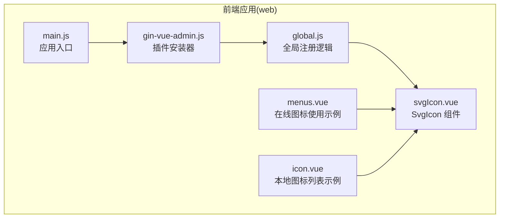
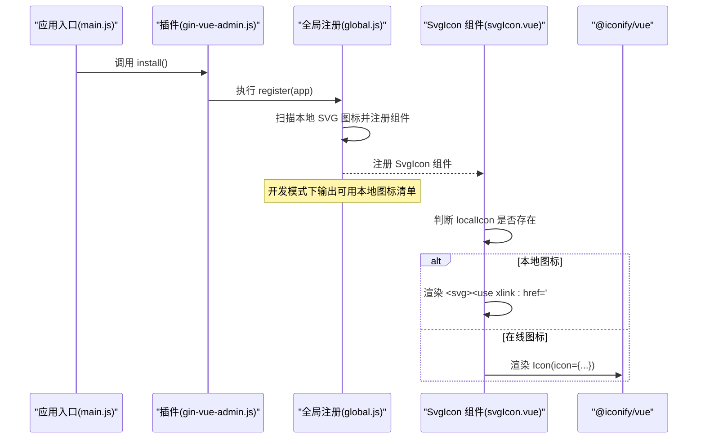
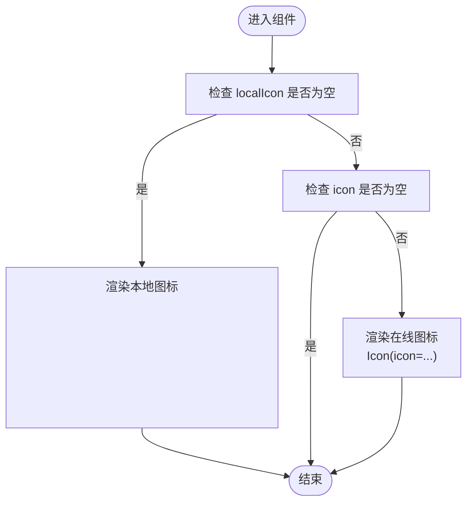
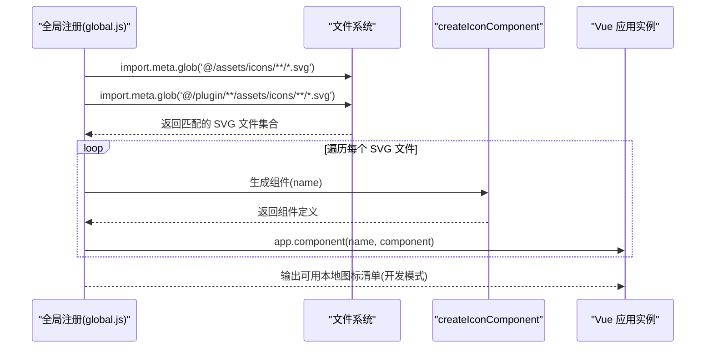
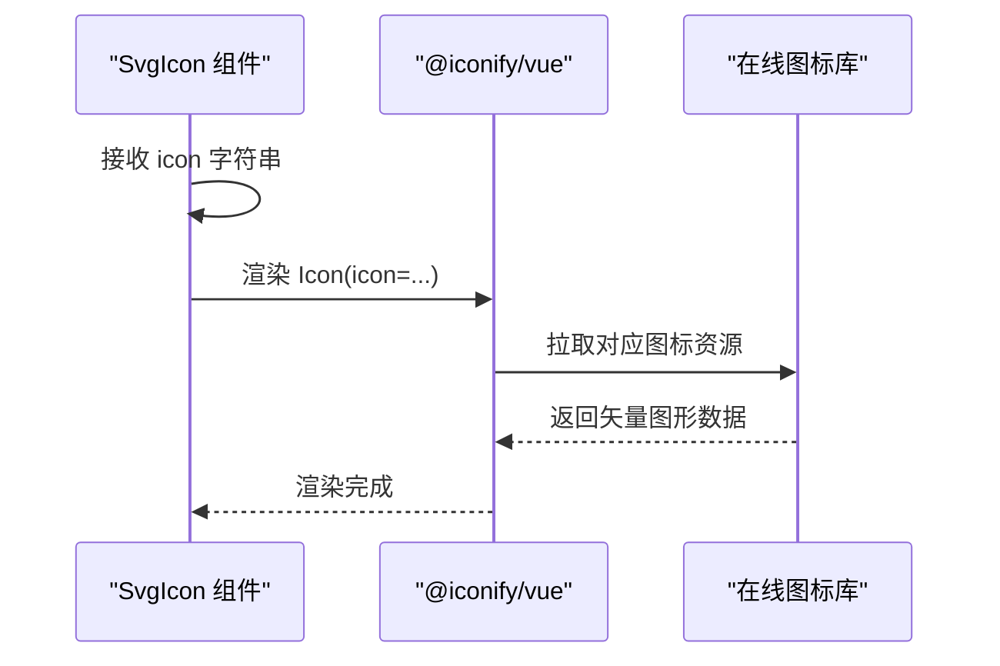
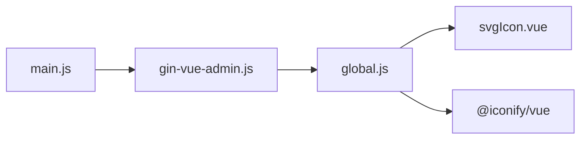
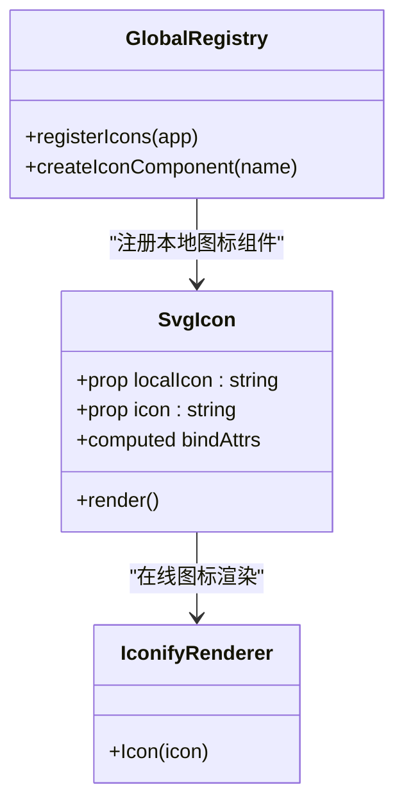

# SVG图标组件

<cite>
**本文引用的文件**
- [svgIcon.vue](file://web/src/components/svgIcon/svgIcon.vue)
- [global.js](file://web/src/core/global.js)
- [gin-vue-admin.js](file://web/src/core/gin-vue-admin.js)
- [main.js](file://web/src/main.js)
- [menus.vue](file://web/src/view/superAdmin/authority/components/menus.vue)
- [icon.vue](file://web/src/view/superAdmin/menu/icon.vue)
</cite>

## 目录
1. [简介](#简介)
2. [项目结构](#项目结构)
3. [核心组件](#核心组件)
4. [架构总览](#架构总览)
5. [详细组件分析](#详细组件分析)
6. [依赖关系分析](#依赖关系分析)
7. [性能考虑](#性能考虑)
8. [故障排查指南](#故障排查指南)
9. [结论](#结论)
10. [附录](#附录)

## 简介
本文件为 SVG 图标组件的深度技术文档，聚焦于 SvgIcon 组件的实现原理与使用方法。组件同时支持两种图标来源：
- 本地 SVG 图标：基于 SVG Symbol 的复用机制，通过注册系统自动扫描并注入全局组件，实现按名称直接渲染。
- 在线图标库：基于 Iconify 提供的 @iconify/vue 渲染器，通过字符串标识从在线图标库动态获取并渲染。

文档将详细说明组件的 props 属性、计算属性绑定、属性透传机制、本地图标注册流程、在线图标渲染路径，并提供样式定制与可访问性建议、图标选择指南与最佳实践。

## 项目结构
SvgIcon 组件位于前端工程的组件目录中，配合全局注册脚本完成本地图标的自动扫描与注册，并在应用启动时完成整体初始化。

**图表来源**
- [main.js:1-38](file://web/src/main.js#L1-L38)
- [gin-vue-admin.js:1-30](file://web/src/core/gin-vue-admin.js#L1-L30)
- [global.js:1-64](file://web/src/core/global.js#L1-L64)
- [svgIcon.vue:1-45](file://web/src/components/svgIcon/svgIcon.vue#L1-L45)
- [menus.vue:40-73](file://web/src/view/superAdmin/authority/components/menus.vue#L40-L73)
- [icon.vue:57-878](file://web/src/view/superAdmin/menu/icon.vue#L57-L878)

**章节来源**
- [main.js:1-38](file://web/src/main.js#L1-L38)
- [gin-vue-admin.js:1-30](file://web/src/core/gin-vue-admin.js#L1-L30)
- [global.js:1-64](file://web/src/core/global.js#L1-L64)
- [svgIcon.vue:1-45](file://web/src/components/svgIcon/svgIcon.vue#L1-L45)

## 核心组件
- 组件名称：SvgIcon
- 文件位置：web/src/components/svgIcon/svgIcon.vue
- 功能概述：
  - 支持本地 SVG 图标（通过 symbol id 渲染）
  - 支持在线图标（通过 Iconify 字符串标识渲染）
  - 自动透传类名与内联样式至渲染根元素
  - 提供使用示例注释，便于快速上手

**章节来源**
- [svgIcon.vue:1-45](file://web/src/components/svgIcon/svgIcon.vue#L1-L45)

## 架构总览
SvgIcon 的工作流分为两条主线：
- 本地图标：由全局注册脚本扫描本地 SVG 文件，生成对应组件并在开发模式下打印可用图标清单；组件内部通过 SVG Symbol 的 use 元素渲染。
- 在线图标：组件直接引入 @iconify/vue 的 Icon 渲染器，通过字符串标识从在线图标库拉取并渲染。

**图表来源**
- [main.js:1-38](file://web/src/main.js#L1-L38)
- [gin-vue-admin.js:1-30](file://web/src/core/gin-vue-admin.js#L1-L30)
- [global.js:1-64](file://web/src/core/global.js#L1-L64)
- [svgIcon.vue:1-45](file://web/src/components/svgIcon/svgIcon.vue#L1-L45)

## 详细组件分析

### 组件属性与行为
- props
  - localIcon: String 类型，用于指定本地 SVG 图标的 symbol id。当该值非空时，组件优先走本地渲染分支。
  - icon: String 类型，用于指定在线图标标识（如“品牌集:图标名”）。当该值非空时，组件走 Iconify 渲染分支。
- 计算属性与属性透传
  - 组件通过 useAttrs 获取父组件传递的所有属性，并将其映射到 class 与 style，再通过 v-bind 透传给渲染根元素，确保样式与类名可控。
- 渲染分支
  - 本地图标分支：渲染一个带有 aria-hidden 的 svg 根元素，并通过 use 元素引用对应的 symbol id。
  - 在线图标分支：渲染 Icon 组件并传入 icon 标识，由 @iconify/vue 进行在线渲染。

**图表来源**
- [svgIcon.vue:1-45](file://web/src/components/svgIcon/svgIcon.vue#L1-L45)

**章节来源**
- [svgIcon.vue:1-45](file://web/src/components/svgIcon/svgIcon.vue#L1-L45)

### 本地图标注册机制
- 扫描范围
  - 系统目录：@/assets/icons/**/*.svg
  - 插件目录：@/plugin/**/assets/icons/**/*.svg
- 注册策略
  - 将扫描到的每个 SVG 文件名作为 symbol id 注册为独立组件，同时在开发模式下输出可用图标清单，便于定位与复制。
  - 对于插件目录中的图标，会自动加上“插件名-”前缀，避免命名冲突。
- 渲染实现
  - 通过 createIconComponent 工厂函数生成组件，内部仅传递 localIcon 名称，最终由 SvgIcon 组件负责渲染。

**图表来源**
- [global.js:18-53](file://web/src/core/global.js#L18-L53)

**章节来源**
- [global.js:1-64](file://web/src/core/global.js#L1-L64)

### 在线图标渲染机制
- 依赖
  - @iconify/vue 提供的 Icon 组件，支持通过字符串标识从在线图标库渲染图标。
- 使用场景
  - 在需要丰富图标库或临时使用特定品牌图标时，直接通过字符串标识传入即可。
- 示例
  - 在菜单项中使用 ant-design:home-filled 进行展示。

**图表来源**
- [svgIcon.vue:7-9](file://web/src/components/svgIcon/svgIcon.vue#L7-L9)
- [menus.vue:42-43](file://web/src/view/superAdmin/authority/components/menus.vue#L42-L43)

**章节来源**
- [svgIcon.vue:1-45](file://web/src/components/svgIcon/svgIcon.vue#L1-L45)
- [menus.vue:40-73](file://web/src/view/superAdmin/authority/components/menus.vue#L40-L73)

### 属性透传与样式定制
- 透传机制
  - 组件通过 useAttrs 获取父组件传入的属性，并将 class 与 style 映射到渲染根元素，确保样式与类名可控。
- 定制建议
  - 可通过传入 class 控制尺寸、颜色等；通过 style 内联样式覆盖默认宽高。
  - 注意：组件根元素已固定宽高为 1em，若需自定义尺寸，可通过外部容器或类名进行缩放。

**章节来源**
- [svgIcon.vue:38-44](file://web/src/components/svgIcon/svgIcon.vue#L38-L44)

### 可访问性支持
- 组件在本地渲染分支中为根 svg 元素设置了 aria-hidden="true"，避免屏幕阅读器读取内部 symbol 内容，提升可访问性。
- 建议
  - 如需为图标添加语义描述，可在父组件中包裹适当的文本标签或使用 aria-label/aria-labelledby。

**章节来源**
- [svgIcon.vue:2-6](file://web/src/components/svgIcon/svgIcon.vue#L2-L6)

### 使用示例与最佳实践
- 本地图标
  - 在开发模式下，控制台会输出所有可用的本地图标名称，可直接复制使用。
  - 示例：通过 localIcon="lock" 渲染锁定图标，并结合类名进行样式定制。
- 在线图标
  - 示例：通过 icon="ant-design:home-filled" 渲染首页图标。
- 最佳实践
  - 优先使用本地图标以减少网络请求与依赖，保证离线可用性。
  - 在线图标适合品牌图标或临时补充，注意控制数量与体积。
  - 统一通过 SvgIcon 组件进行渲染，便于后续扩展与维护。

**章节来源**
- [svgIcon.vue:16-23](file://web/src/components/svgIcon/svgIcon.vue#L16-L23)
- [global.js:51-52](file://web/src/core/global.js#L51-L52)
- [menus.vue:42-43](file://web/src/view/superAdmin/authority/components/menus.vue#L42-L43)

## 依赖关系分析
- 外部依赖
  - @iconify/vue：用于在线图标渲染。
- 内部依赖
  - SvgIcon 组件依赖 Vue 的响应式与渲染能力；全局注册脚本负责扫描与注册本地图标组件。
- 初始化流程
  - 应用启动时，main.js 引入 gin-vue-admin 插件，插件在 install 阶段调用 register，完成全局组件注册与本地图标扫描。

**图表来源**
- [main.js:1-38](file://web/src/main.js#L1-L38)
- [gin-vue-admin.js:1-30](file://web/src/core/gin-vue-admin.js#L1-L30)
- [global.js:1-64](file://web/src/core/global.js#L1-L64)
- [svgIcon.vue:13-14](file://web/src/components/svgIcon/svgIcon.vue#L13-L14)

**章节来源**
- [main.js:1-38](file://web/src/main.js#L1-L38)
- [gin-vue-admin.js:1-30](file://web/src/core/gin-vue-admin.js#L1-L30)
- [global.js:1-64](file://web/src/core/global.js#L1-L64)
- [svgIcon.vue:13-14](file://web/src/components/svgIcon/svgIcon.vue#L13-L14)

## 性能考虑
- 本地图标
  - 通过 SVG Symbol 复用，无需额外网络请求，渲染性能优异；建议优先使用。
- 在线图标
  - 首次加载可能受网络影响，建议控制图标数量与体积；可考虑缓存策略或预加载。
- 通用优化
  - 合理使用 class 与 style，避免过度嵌套导致的重排与重绘。
  - 对频繁使用的图标，尽量采用本地注册方式。

[本节为通用指导，无需具体文件分析]

## 故障排查指南
- 本地图标未显示
  - 检查图标名称是否正确，确认已在开发模式下输出的可用图标清单中。
  - 确认 SVG 文件名不包含空格等非法字符。
- 在线图标未显示
  - 检查 icon 字符串格式是否符合“集合:名称”的规范。
  - 确认网络连通性与 @iconify/vue 正常加载。
- 样式异常
  - 检查父组件传入的 class 与 style 是否覆盖了默认尺寸；必要时通过外部容器进行尺寸调整。

**章节来源**
- [global.js:34-38](file://web/src/core/global.js#L34-L38)
- [svgIcon.vue:38-44](file://web/src/components/svgIcon/svgIcon.vue#L38-L44)

## 结论
SvgIcon 组件通过双模式设计实现了本地与在线图标的统一渲染，既保证了离线可用性与性能，又提供了丰富的在线图标生态支持。配合全局注册脚本，开发者可以便捷地使用本地图标，同时在需要时灵活引入在线图标。建议在实际项目中优先使用本地图标，合理控制在线图标的使用范围与数量，以获得更优的用户体验与维护性。

[本节为总结性内容，无需具体文件分析]

## 附录

### 组件类图

**图表来源**
- [svgIcon.vue:12-44](file://web/src/components/svgIcon/svgIcon.vue#L12-L44)
- [global.js:9-16](file://web/src/core/global.js#L9-L16)
- [global.js:18-53](file://web/src/core/global.js#L18-L53)