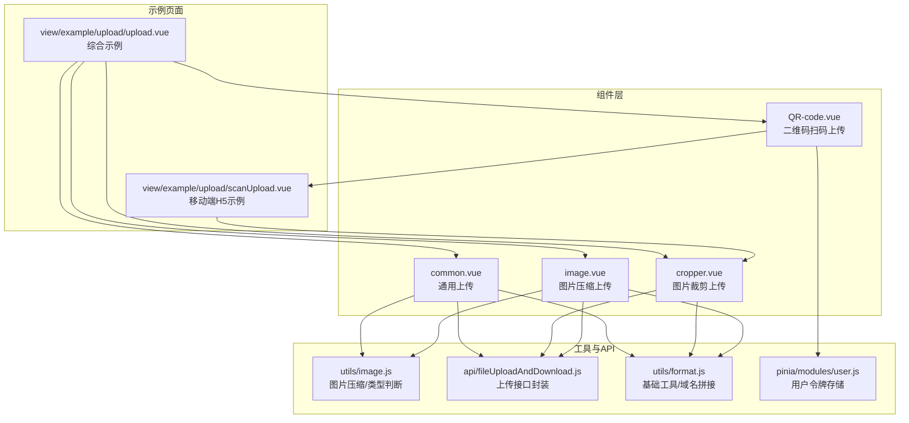
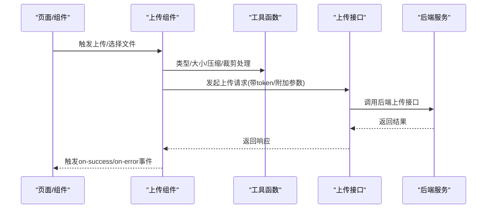
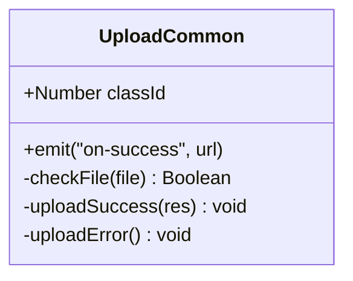
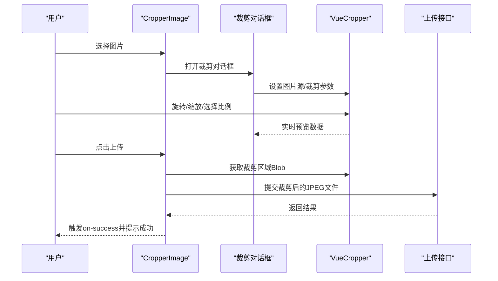
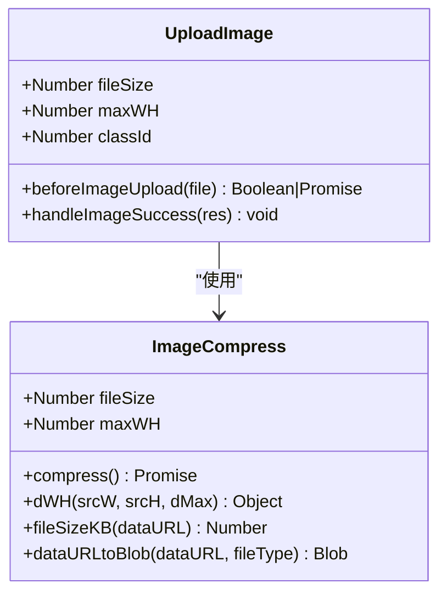
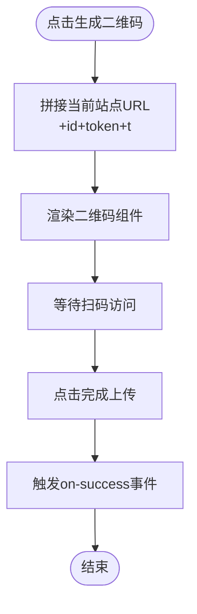
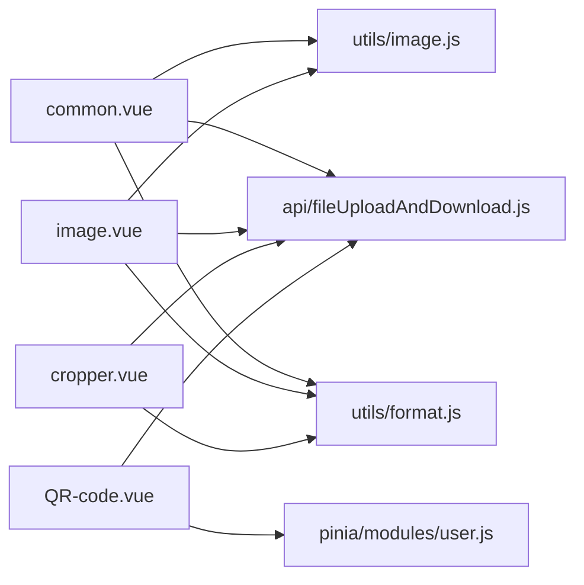

# 上传组件

<cite>
**本文引用的文件**
- [common.vue](file://web/src/components/upload/common.vue)
- [cropper.vue](file://web/src/components/upload/cropper.vue)
- [image.vue](file://web/src/components/upload/image.vue)
- [QR-code.vue](file://web/src/components/upload/QR-code.vue)
- [image.js](file://web/src/utils/image.js)
- [fileUploadAndDownload.js](file://web/src/api/fileUploadAndDownload.js)
- [format.js](file://web/src/utils/format.js)
- [user.js](file://web/src/pinia/modules/user.js)
- [upload.vue](file://web/src/view/example/upload/upload.vue)
- [scanUpload.vue](file://web/src/view/example/upload/scanUpload.vue)
</cite>

## 目录
1. [简介](#简介)
2. [项目结构](#项目结构)
3. [核心组件](#核心组件)
4. [架构总览](#架构总览)
5. [详细组件分析](#详细组件分析)
6. [依赖关系分析](#依赖关系分析)
7. [性能与安全考量](#性能与安全考量)
8. [故障排查指南](#故障排查指南)
9. [结论](#结论)
10. [附录：配置参数与使用示例](#附录配置参数与使用示例)

## 简介
本文件面向上传组件系列，系统性梳理通用上传、图片裁剪、图片压缩上传以及二维码扫码上传四个组件的设计与实现要点，覆盖：
- 组件职责与适用场景
- 核心配置参数与行为约束
- 事件处理机制与错误处理策略
- 进度与状态反馈
- 文件类型校验、大小限制与安全考虑
- 与后端接口的交互流程与关键点

## 项目结构
上传组件位于前端工程的组件目录下，配合工具函数、API 封装与示例页面共同构成完整的上传能力体系。

图表来源
- [common.vue:1-91](file://web/src/components/upload/common.vue#L1-L91)
- [cropper.vue:1-238](file://web/src/components/upload/cropper.vue#L1-L238)
- [image.vue:1-103](file://web/src/components/upload/image.vue#L1-L103)
- [QR-code.vue:1-66](file://web/src/components/upload/QR-code.vue#L1-L66)
- [image.js:1-127](file://web/src/utils/image.js#L1-L127)
- [fileUploadAndDownload.js:1-67](file://web/src/api/fileUploadAndDownload.js#L1-L67)
- [format.js:159-163](file://web/src/utils/format.js#L159-L163)
- [user.js:23-25](file://web/src/pinia/modules/user.js#L23-L25)
- [upload.vue:59-72](file://web/src/view/example/upload/upload.vue#L59-L72)
- [scanUpload.vue:3-16](file://web/src/view/example/upload/scanUpload.vue#L3-L16)

章节来源
- [upload.vue:59-72](file://web/src/view/example/upload/upload.vue#L59-L72)
- [scanUpload.vue:3-16](file://web/src/view/example/upload/scanUpload.vue#L3-L16)

## 核心组件
- 通用上传组件：支持图片与视频上传，内置基础类型与大小校验，触发成功/错误事件回调。
- 图片裁剪上传组件：基于第三方裁剪库，提供旋转、缩放、比例固定、实时预览与最终上传。
- 图片压缩上传组件：对大图自动压缩，满足头像等场景的尺寸与体积要求。
- 二维码扫码上传组件：生成扫码链接，引导移动端扫码上传。

章节来源
- [common.vue:35-42](file://web/src/components/upload/common.vue#L35-L42)
- [cropper.vue:99-104](file://web/src/components/upload/cropper.vue#L99-L104)
- [image.vue:29-46](file://web/src/components/upload/image.vue#L29-L46)
- [QR-code.vue:42-47](file://web/src/components/upload/QR-code.vue#L42-L47)

## 架构总览
上传组件通过 Element Plus 的 el-upload 组件与后端接口对接，统一的上传入口为文件上传接口。各组件在上传前进行本地校验与处理，上传后通过事件回调通知父组件刷新列表或执行后续逻辑。

图表来源
- [common.vue:46-89](file://web/src/components/upload/common.vue#L46-L89)
- [image.vue:52-74](file://web/src/components/upload/image.vue#L52-L74)
- [cropper.vue:202-229](file://web/src/components/upload/cropper.vue#L202-L229)
- [fileUploadAndDownload.js:61-67](file://web/src/api/fileUploadAndDownload.js#L61-L67)

## 详细组件分析

### 通用上传组件（common.vue）
- 功能概述
  - 支持图片与视频上传，自动隐藏文件列表展示。
  - 上传前进行类型与大小校验，不满足条件则阻止上传并提示。
  - 成功/失败分别触发事件回调，便于父组件刷新列表或提示。
- 关键配置
  - 接口地址：基于基础路径拼接上传接口。
  - 附加参数：classId（分类标识）。
  - 请求头：携带用户令牌。
  - 多文件上传：开启多选。
- 校验规则
  - 图片：仅允许特定 MIME 类型，且未压缩图片大小不超过 500KB。
  - 视频：仅允许特定 MIME 类型，大小不超过 5MB。
- 事件与状态
  - 成功：触发 on-success，回传文件访问 URL。
  - 失败：提示错误消息，关闭加载状态。
- 安全与限制
  - 通过 MIME 类型白名单限制文件类型。
  - 通过大小阈值限制上传体积，避免资源浪费与安全风险。

章节来源
- [common.vue:3-15](file://web/src/components/upload/common.vue#L3-L15)
- [common.vue:35-42](file://web/src/components/upload/common.vue#L35-L42)
- [common.vue:46-74](file://web/src/components/upload/common.vue#L46-L74)
- [common.vue:76-89](file://web/src/components/upload/common.vue#L76-L89)
- [image.js:109-126](file://web/src/utils/image.js#L109-L126)

#### 通用上传类图

图表来源
- [common.vue:27-42](file://web/src/components/upload/common.vue#L27-L42)
- [common.vue:46-89](file://web/src/components/upload/common.vue#L46-L89)

### 图片裁剪上传组件（cropper.vue）
- 功能概述
  - 选择图片后弹出裁剪对话框，支持旋转、缩放、比例固定与实时预览。
  - 裁剪完成后将裁剪区域转为 Blob 并提交上传。
  - 成功后关闭对话框并提示上传成功。
- 关键配置
  - 接口地址：基于基础路径拼接上传接口。
  - 附加参数：classId。
  - 请求头：携带用户令牌。
  - 自动上传：关闭自动上传，由裁剪后手动触发。
- 裁剪特性
  - 固定比例：1:1、16:9、9:16、4:3 或自由比例。
  - 缩放控制：+/- 按钮调整缩放级别。
  - 旋转控制：左右旋转按钮。
  - 实时预览：预览区同步显示裁剪效果。
- 校验与限制
  - 仅接受图片类型，大小不超过 8MB。
  - 裁剪输出为 JPEG，自动裁剪区域默认 300x300（可按比例调整）。
- 事件与状态
  - 成功：触发 on-success，回传文件访问 URL。
  - 失败：提示错误消息，关闭上传中状态。
- 与移动端示例的差异
  - 示例页面提供更丰富的工具栏与开关，支持在裁剪与原图之间切换。

章节来源
- [cropper.vue:2-14](file://web/src/components/upload/cropper.vue#L2-L14)
- [cropper.vue:99-104](file://web/src/components/upload/cropper.vue#L99-L104)
- [cropper.vue:121-163](file://web/src/components/upload/cropper.vue#L121-L163)
- [cropper.vue:166-184](file://web/src/components/upload/cropper.vue#L166-L184)
- [cropper.vue:187-193](file://web/src/components/upload/cropper.vue#L187-L193)
- [cropper.vue:196-199](file://web/src/components/upload/cropper.vue#L196-L199)
- [cropper.vue:202-229](file://web/src/components/upload/cropper.vue#L202-L229)

#### 图片裁剪序列图

图表来源
- [cropper.vue:166-184](file://web/src/components/upload/cropper.vue#L166-L184)
- [cropper.vue:187-193](file://web/src/components/upload/cropper.vue#L187-L193)
- [cropper.vue:202-229](file://web/src/components/upload/cropper.vue#L202-L229)

### 图片压缩上传组件（image.vue）
- 功能概述
  - 仅接受 JPG/PNG 图片，超出指定大小阈值时自动压缩。
  - 压缩过程等比缩放至最大边长限制，并转换为指定格式。
  - 成功后触发 on-success，回传文件访问 URL。
- 关键配置
  - fileSize：超过该大小（KB）时触发压缩，默认 2048 KB。
  - maxWH：压缩后最大边长像素，默认 1920。
  - classId：分类标识。
- 压缩算法
  - 读取图片到 Canvas，按最大边长等比缩放，再导出为 DataURL，最后转为 Blob。
  - 计算压缩后大小，确保满足阈值要求。
- 事件与状态
  - 成功：触发 on-success，回传文件访问 URL。
  - 失败：提示错误消息。

章节来源
- [image.vue:29-46](file://web/src/components/upload/image.vue#L29-L46)
- [image.vue:52-67](file://web/src/components/upload/image.vue#L52-L67)
- [image.vue:69-74](file://web/src/components/upload/image.vue#L69-L74)
- [image.js:1-92](file://web/src/utils/image.js#L1-L92)

#### 图片压缩类图

图表来源
- [image.js:1-92](file://web/src/utils/image.js#L1-L92)
- [image.vue:18-46](file://web/src/components/upload/image.vue#L18-L46)

### 二维码扫码上传组件（QR-code.vue）
- 功能概述
  - 生成一个包含当前站点地址与令牌的二维码，引导移动端扫码访问上传页面。
  - 完成上传后触发 on-success，便于父组件处理后续逻辑。
- 关键配置
  - classId：用于拼接扫码链接中的分类标识。
- 生成逻辑
  - 基于当前协议、主机与路由路径，拼接包含 token 与时间戳的链接。
  - 使用二维码组件渲染，支持 Logo、颜色与尺寸配置。
- 事件与状态
  - 完成：触发 on-success，清空二维码内容。

章节来源
- [QR-code.vue:42-47](file://web/src/components/upload/QR-code.vue#L42-L47)
- [QR-code.vue:53-58](file://web/src/components/upload/QR-code.vue#L53-L58)
- [QR-code.vue:60-64](file://web/src/components/upload/QR-code.vue#L60-L64)
- [user.js:23-25](file://web/src/pinia/modules/user.js#L23-L25)

#### 二维码生成流程图

图表来源
- [QR-code.vue:53-58](file://web/src/components/upload/QR-code.vue#L53-L58)
- [QR-code.vue:60-64](file://web/src/components/upload/QR-code.vue#L60-L64)

## 依赖关系分析
- 组件间耦合
  - 通用上传与图片压缩上传均依赖工具函数进行类型判断与压缩处理。
  - 图片裁剪上传依赖第三方裁剪库与基础工具函数。
  - 二维码上传依赖用户令牌与路由路径拼接。
- 外部依赖
  - Element Plus 的 el-upload、消息提示与对话框组件。
  - 第三方裁剪库 vue-cropper。
  - 二维码组件 vue-qr。
- 接口契约
  - 统一调用上传接口，传递 classId 与 token，接收包含文件 URL 的响应。

图表来源
- [common.vue:20-25](file://web/src/components/upload/common.vue#L20-L25)
- [image.vue:18-22](file://web/src/components/upload/image.vue#L18-L22)
- [cropper.vue:85-91](file://web/src/components/upload/cropper.vue#L85-L91)
- [QR-code.vue:32-34](file://web/src/components/upload/QR-code.vue#L32-L34)
- [image.js:1-127](file://web/src/utils/image.js#L1-L127)
- [fileUploadAndDownload.js:61-67](file://web/src/api/fileUploadAndDownload.js#L61-L67)
- [format.js:159-163](file://web/src/utils/format.js#L159-L163)
- [user.js:23-25](file://web/src/pinia/modules/user.js#L23-L25)

## 性能与安全考量
- 性能
  - 图片压缩采用 Canvas 等比缩放，减少传输体积，提升加载速度。
  - 裁剪上传先在前端生成裁剪区域的 Blob，避免不必要的二次处理。
  - 通用上传对未压缩图片设置较小阈值，降低服务器压力。
- 安全
  - 严格限制文件类型与大小，防止恶意文件上传。
  - 上传接口携带用户令牌，确保访问鉴权。
  - 二维码链接包含时间戳，降低复用风险。
- 可靠性
  - 组件内部对异常进行捕获与提示，避免页面崩溃。
  - 上传过程中保持加载状态，避免重复提交。

[本节为通用指导，无需列出具体文件来源]

## 故障排查指南
- 无法上传
  - 检查网络与后端接口可用性。
  - 确认 classId 与 token 正确传递。
- 类型不被接受
  - 确认文件 MIME 类型在允许范围内。
  - 对于图片，检查是否为 JPG/PNG/WebP/SVG 等受支持类型。
- 大小超限
  - 图片未压缩超过阈值时会被拒绝。
  - 视频大小超过限制会提示错误。
- 裁剪无效
  - 确保选择了图片文件且大小未超过限制。
  - 检查裁剪库初始化是否成功。
- 二维码无法扫码
  - 确认当前站点可访问且链接完整。
  - 检查 token 是否有效。

章节来源
- [common.vue:46-74](file://web/src/components/upload/common.vue#L46-L74)
- [image.vue:52-67](file://web/src/components/upload/image.vue#L52-L67)
- [cropper.vue:166-184](file://web/src/components/upload/cropper.vue#L166-L184)
- [QR-code.vue:53-58](file://web/src/components/upload/QR-code.vue#L53-L58)

## 结论
上传组件系列围绕“本地校验 + 统一接口 + 事件回调”的设计模式构建，既满足通用场景，又针对图片裁剪与压缩等专业需求提供了完善方案。通过严格的类型与大小限制、完善的错误处理与状态反馈，保障了上传流程的可靠性与安全性。

[本节为总结性内容，无需列出具体文件来源]

## 附录：配置参数与使用示例

### 通用上传（common.vue）
- 属性
  - classId：Number，默认 0
- 事件
  - on-success：上传成功回调，参数为文件 URL
- 行为
  - 图片类型校验与大小限制（未压缩图片 ≤ 500KB）
  - 视频类型校验与大小限制（≤ 5MB）
  - 成功/失败提示与状态控制

章节来源
- [common.vue:35-42](file://web/src/components/upload/common.vue#L35-L42)
- [common.vue:46-74](file://web/src/components/upload/common.vue#L46-L74)
- [common.vue:76-89](file://web/src/components/upload/common.vue#L76-L89)

### 图片裁剪上传（cropper.vue）
- 属性
  - classId：Number，默认 0
- 事件
  - on-success：上传成功回调，参数为文件 URL
- 裁剪参数
  - autoCropWidth/autoCropHeight：默认 300
  - fixed/fixedNumber：固定比例开关与比例值
  - outputType：输出格式（JPEG）
- 控制
  - 旋转：左右旋转
  - 缩放：+/- 按钮
  - 比例：1:1、16:9、9:16、4:3、自由比例
- 校验
  - 仅图片类型，大小 ≤ 8MB

章节来源
- [cropper.vue:99-104](file://web/src/components/upload/cropper.vue#L99-L104)
- [cropper.vue:121-163](file://web/src/components/upload/cropper.vue#L121-L163)
- [cropper.vue:166-184](file://web/src/components/upload/cropper.vue#L166-L184)
- [cropper.vue:202-229](file://web/src/components/upload/cropper.vue#L202-L229)

### 图片压缩上传（image.vue）
- 属性
  - imageUrl：String，默认空字符串
  - fileSize：Number，默认 2048（KB）
  - maxWH：Number，默认 1920（像素）
  - classId：Number，默认 0
- 事件
  - on-success：上传成功回调，参数为文件 URL
- 行为
  - 仅 JPG/PNG
  - 超过 fileSize 时自动压缩
  - 等比缩放至 maxWH

章节来源
- [image.vue:29-46](file://web/src/components/upload/image.vue#L29-L46)
- [image.vue:52-67](file://web/src/components/upload/image.vue#L52-L67)
- [image.vue:69-74](file://web/src/components/upload/image.vue#L69-L74)
- [image.js:1-92](file://web/src/utils/image.js#L1-L92)

### 二维码扫码上传（QR-code.vue）
- 属性
  - classId：Number，默认 0
- 事件
  - on-success：完成上传回调
- 行为
  - 生成包含 token 与时间戳的二维码链接
  - 点击完成上传后触发回调

章节来源
- [QR-code.vue:42-47](file://web/src/components/upload/QR-code.vue#L42-L47)
- [QR-code.vue:53-58](file://web/src/components/upload/QR-code.vue#L53-L58)
- [QR-code.vue:60-64](file://web/src/components/upload/QR-code.vue#L60-L64)
- [user.js:23-25](file://web/src/pinia/modules/user.js#L23-L25)

### 使用示例（示例页面）
- 综合示例页面展示了四种上传组件的组合使用方式，包括树形分类选择、表格展示与分页。
- 移动端示例页面提供 H5 场景下的裁剪与上传流程，支持动态窗口尺寸与裁剪开关。

章节来源
- [upload.vue:59-72](file://web/src/view/example/upload/upload.vue#L59-L72)
- [scanUpload.vue:3-16](file://web/src/view/example/upload/scanUpload.vue#L3-L16)
- [scanUpload.vue:176-194](file://web/src/view/example/upload/scanUpload.vue#L176-L194)