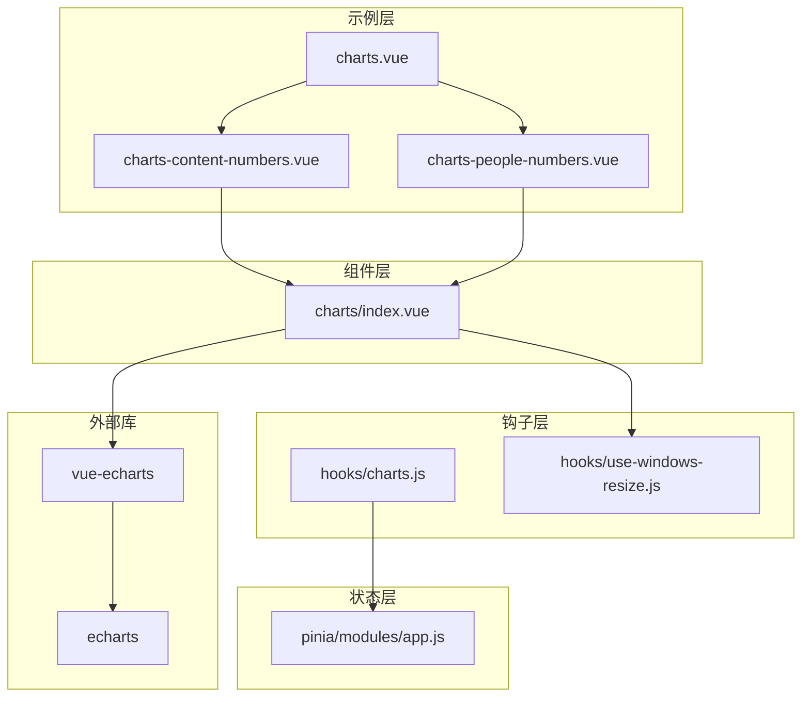
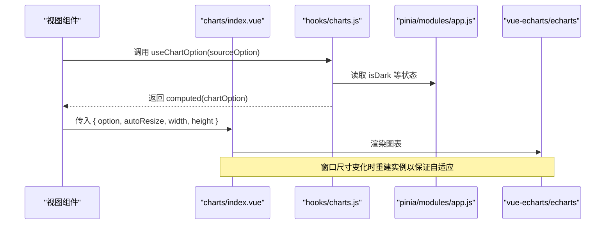
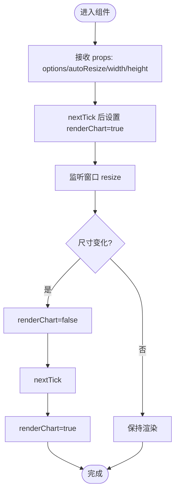
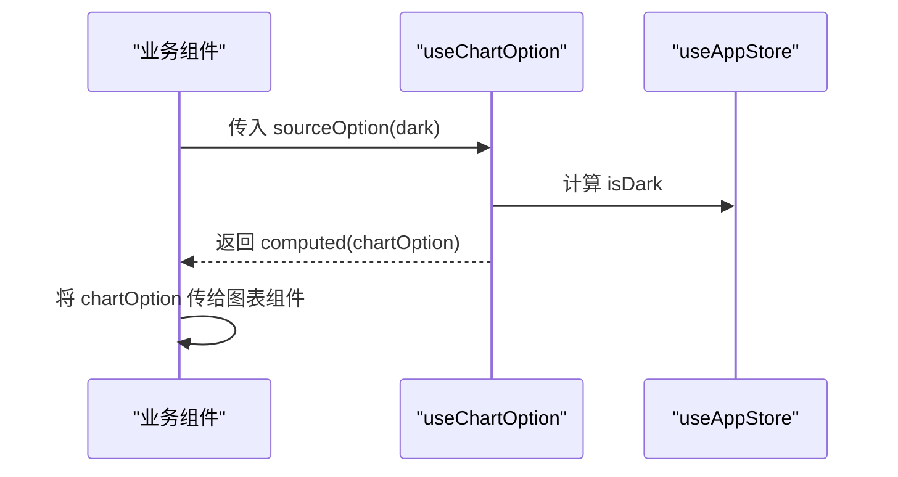
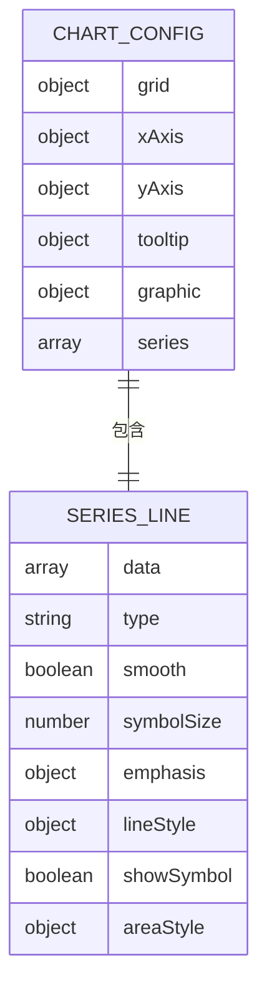
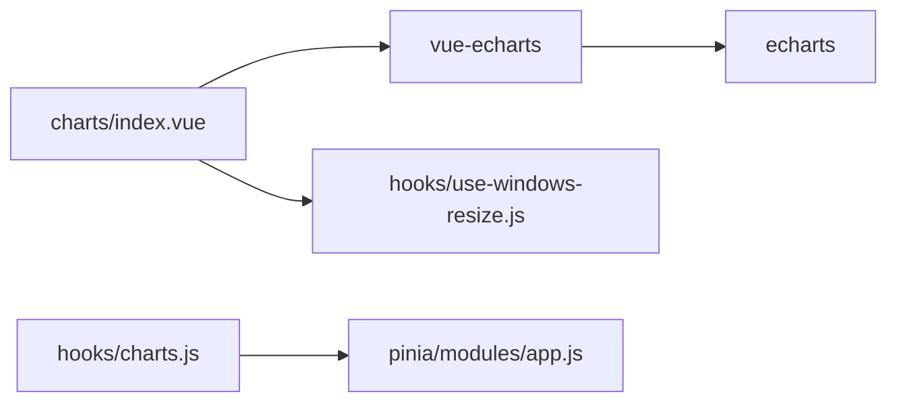

# 图表组件

<cite>
**本文引用的文件**
- [charts/index.vue](file://web/src/components/charts/index.vue)
- [hooks/use-windows-resize.js](file://web/src/hooks/use-windows-resize.js)
- [hooks/charts.js](file://web/src/hooks/charts.js)
- [pinia/modules/app.js](file://web/src/pinia/modules/app.js)
- [package.json](file://web/package.json)
- [view/dashboard/components/charts-content-numbers.vue](file://web/src/view/dashboard/components/charts-content-numbers.vue)
- [view/dashboard/components/charts-people-numbers.vue](file://web/src/view/dashboard/components/charts-people-numbers.vue)
- [view/dashboard/components/charts.vue](file://web/src/view/dashboard/components/charts.vue)
- [utils/downloadImg.js](file://web/src/utils/downloadImg.js)
</cite>

## 目录
1. [简介](#简介)
2. [项目结构](#项目结构)
3. [核心组件](#核心组件)
4. [架构总览](#架构总览)
5. [详细组件分析](#详细组件分析)
6. [依赖关系分析](#依赖关系分析)
7. [性能考虑](#性能考虑)
8. [故障排查指南](#故障排查指南)
9. [结论](#结论)
10. [附录](#附录)

## 简介
本文件面向“图表组件”的使用者与维护者，系统性梳理 web 端基于 vue-echarts 的图表封装组件，重点覆盖以下方面：
- 组件架构与职责边界
- 支持的图表类型与数据格式
- 配置项与主题适配机制
- 响应式设计与尺寸自适应
- 交互能力（缩放、选择、提示等）
- 数据绑定与实时更新策略
- 性能优化建议与常见问题处理

## 项目结构
图表相关代码主要分布在如下位置：
- 组件层：web/src/components/charts/index.vue
- 主题与响应式钩子：web/src/hooks/charts.js、web/src/hooks/use-windows-resize.js
- 应用状态（主题、颜色等）：web/src/pinia/modules/app.js
- 依赖声明：web/package.json
- 使用示例：web/src/view/dashboard/components/*.vue

**图表来源**
- [charts/index.vue:1-48](file://web/src/components/charts/index.vue#L1-L48)
- [hooks/charts.js:1-19](file://web/src/hooks/charts.js#L1-L19)
- [hooks/use-windows-resize.js:1-24](file://web/src/hooks/use-windows-resize.js#L1-L24)
- [pinia/modules/app.js:1-163](file://web/src/pinia/modules/app.js#L1-L163)
- [package.json:14-56](file://web/package.json#L14-L56)
- [view/dashboard/components/charts-content-numbers.vue:1-186](file://web/src/view/dashboard/components/charts-content-numbers.vue#L1-L186)
- [view/dashboard/components/charts-people-numbers.vue:1-131](file://web/src/view/dashboard/components/charts-people-numbers.vue#L1-L131)
- [view/dashboard/components/charts.vue:1-49](file://web/src/view/dashboard/components/charts.vue#L1-L49)

**章节来源**
- [charts/index.vue:1-48](file://web/src/components/charts/index.vue#L1-L48)
- [package.json:14-56](file://web/package.json#L14-L56)

## 核心组件
- charts/index.vue：对 vue-echarts 的轻量封装，负责渲染、尺寸自适应与生命周期控制。
- hooks/charts.js：将主题状态注入到图表配置中，实现深浅主题切换下的配置动态更新。
- hooks/use-windows-resize.js：监听浏览器窗口尺寸变化，触发图表重绘。
- pinia/modules/app.js：提供 isDark、primaryColor 等全局状态，驱动主题与样式。

关键点：
- 通过 v-if 控制图表实例重建，避免在尺寸变化时出现渲染异常。
- 通过 props 暴露 options、autoResize、width、height，满足不同场景的定制化需求。
- 依赖 vue-echarts 与 echarts，确保丰富的图表类型与交互能力。

**章节来源**
- [charts/index.vue:10-45](file://web/src/components/charts/index.vue#L10-L45)
- [hooks/charts.js:7-18](file://web/src/hooks/charts.js#L7-L18)
- [hooks/use-windows-resize.js:8-23](file://web/src/hooks/use-windows-resize.js#L8-L23)
- [pinia/modules/app.js:26-77](file://web/src/pinia/modules/app.js#L26-L77)

## 架构总览
图表组件采用“组件 + 钩子 + 状态”的分层设计：
- 组件层：负责渲染与自适应
- 钩子层：提供主题感知与窗口监听
- 状态层：提供主题、颜色等全局配置
- 外部库：vue-echarts 提供 Vue 组件化封装，echarts 提供底层渲染引擎

**图表来源**
- [charts/index.vue:10-45](file://web/src/components/charts/index.vue#L10-L45)
- [hooks/charts.js:7-18](file://web/src/hooks/charts.js#L7-L18)
- [pinia/modules/app.js:26-77](file://web/src/pinia/modules/app.js#L26-L77)

## 详细组件分析

### charts/index.vue 组件
职责与行为：
- 渲染入口：使用 vue-echarts 的 VCharts 组件进行渲染。
- 自适应控制：通过 v-if 在窗口尺寸变化后销毁并重建实例，确保 autoresize 生效。
- 尺寸控制：支持通过 props 设置 width、height；默认 100%。
- 配置透传：接收 options 并直接传递给 VCharts。

数据与配置要点：
- options：ECharts 完整配置对象，可包含 grid、xAxis、yAxis、series、tooltip、graphic 等。
- autoResize：布尔值，控制是否启用自动尺寸调整。
- width/height：字符串，用于外层容器尺寸约束。

交互与主题：
- 通过 useWindowResize 监听窗口变化，触发布尔值切换以重建图表。
- 与 useChartOption 协作，使图表配置随主题切换而更新。

**图表来源**
- [charts/index.vue:35-44](file://web/src/components/charts/index.vue#L35-L44)

**章节来源**
- [charts/index.vue:1-48](file://web/src/components/charts/index.vue#L1-L48)

### hooks/charts.js 主题适配
- 从 Pinia 读取 isDark 状态，作为图表配置的输入之一。
- 将用户提供的 sourceOption(isDark) 包装为 computed，实现响应式配置。
- 返回 chartOption 供上层组件使用。

**图表来源**
- [hooks/charts.js:7-18](file://web/src/hooks/charts.js#L7-L18)
- [pinia/modules/app.js:26-31](file://web/src/pinia/modules/app.js#L26-L31)

**章节来源**
- [hooks/charts.js:1-19](file://web/src/hooks/charts.js#L1-L19)
- [pinia/modules/app.js:1-163](file://web/src/pinia/modules/app.js#L1-L163)

### hooks/use-windows-resize.js 响应式监听
- 监听 window.resize，计算当前 innerWidth/innerHeight，并触发回调。
- 回调中可执行图表重建逻辑，确保自适应生效。

**章节来源**
- [hooks/use-windows-resize.js:1-24](file://web/src/hooks/use-windows-resize.js#L1-L24)

### 使用示例与数据格式

#### 示例一：折线图（带渐变填充与提示）
- 文件：web/src/view/dashboard/components/charts-content-numbers.vue
- 特性：分类轴、数值轴、平滑折线、渐变线条与面积、自定义提示框、图形元素（graphic）辅助文本。
- 数据格式：xAxis 为时间类数组，series.data 为数值数组。

**图表来源**
- [view/dashboard/components/charts-content-numbers.vue:54-182](file://web/src/view/dashboard/components/charts-content-numbers.vue#L54-L182)

**章节来源**
- [view/dashboard/components/charts-content-numbers.vue:1-186](file://web/src/view/dashboard/components/charts-content-numbers.vue#L1-L186)

#### 示例二：折线图（无坐标轴，仅展示趋势）
- 文件：web/src/view/dashboard/components/charts-people-numbers.vue
- 特性：隐藏坐标轴，使用渐变线条与面积，适合卡片内小图。
- 数据格式：通过 props.data 传入数组。

**章节来源**
- [view/dashboard/components/charts-people-numbers.vue:1-131](file://web/src/view/dashboard/components/charts-people-numbers.vue#L1-L131)

#### 示例三：仪表盘组合
- 文件：web/src/view/dashboard/components/charts.vue
- 特性：根据 type 渲染不同子图表，形成 Dashboard 布局。

**章节来源**
- [view/dashboard/components/charts.vue:1-49](file://web/src/view/dashboard/components/charts.vue#L1-L49)

### 图表类型与数据格式要求
- 支持类型：示例中使用了折线图（line），可扩展柱状图、饼图、散点图等。
- 数据格式：
  - 分类轴：xAxis.type='category'，xAxis.data 为字符串数组。
  - 数值轴：yAxis.type='value'，series.data 为数值数组。
  - 多系列：series 可为数组，每个元素代表一条线/柱等。
- 配置项：grid、xAxis、yAxis、series、tooltip、graphic、visualMap 等均可按需配置。

**章节来源**
- [view/dashboard/components/charts-content-numbers.vue:54-182](file://web/src/view/dashboard/components/charts-content-numbers.vue#L54-L182)
- [view/dashboard/components/charts-people-numbers.vue:42-127](file://web/src/view/dashboard/components/charts-people-numbers.vue#L42-L127)

### 配置选项与主题适配
- 组件级配置：
  - options：ECharts 完整配置对象
  - autoResize：是否启用自动尺寸调整
  - width/height：图表容器尺寸
- 主题适配：
  - 通过 useChartOption 注入 isDark，实现深浅主题下的颜色与样式切换。
  - 应用层通过 useAppStore 提供 primaryColor、isDark 等状态。

**章节来源**
- [charts/index.vue:15-34](file://web/src/components/charts/index.vue#L15-L34)
- [hooks/charts.js:7-18](file://web/src/hooks/charts.js#L7-L18)
- [pinia/modules/app.js:26-31](file://web/src/pinia/modules/app.js#L26-L31)

### 交互功能
- 缩放与选择：由 echarts 内置提供，可通过配置开启缩放、选择区域等交互。
- 提示框：示例中使用 tooltip.trigger='axis'，并自定义 formatter。
- 图形元素：通过 graphic 在图表上叠加文本、形状等。
- 主题联动：isDark 切换时，useChartOption 返回的新配置会驱动图表重新渲染。

**章节来源**
- [view/dashboard/components/charts-content-numbers.vue:119-131](file://web/src/view/dashboard/components/charts-content-numbers.vue#L119-L131)
- [hooks/charts.js:7-18](file://web/src/hooks/charts.js#L7-L18)

### 数据绑定与实时更新机制
- 数据绑定：通过 props.options 传入配置；在业务组件中使用 useChartOption 生成 computed 配置。
- 实时更新：当 isDark 或其他依赖状态变化时，computed(chartOption) 会重新计算，从而驱动图表更新。
- 尺寸自适应：窗口 resize 时，通过 v-if 切换重建图表实例，确保 autoresize 生效。

**章节来源**
- [hooks/charts.js:7-18](file://web/src/hooks/charts.js#L7-L18)
- [charts/index.vue:35-44](file://web/src/components/charts/index.vue#L35-L44)

### 图表导出
- 仓库中存在通用图片下载工具，可用于将图表截图保存为图片。
- 工具函数：downloadImage(imgsrc, name)，支持跨域绘制与下载。

**章节来源**
- [utils/downloadImg.js:1-20](file://web/src/utils/downloadImg.js#L1-L20)

## 依赖关系分析
- 组件依赖：
  - charts/index.vue 依赖 vue-echarts 与 hooks/use-windows-resize.js
  - hooks/charts.js 依赖 pinia/modules/app.js
- 外部依赖：
  - package.json 中声明了 vue-echarts 与 echarts

**图表来源**
- [charts/index.vue:11-13](file://web/src/components/charts/index.vue#L11-L13)
- [hooks/charts.js:4-5](file://web/src/hooks/charts.js#L4-L5)
- [package.json:31,51](file://web/package.json#L31,L51)

**章节来源**
- [charts/index.vue:1-48](file://web/src/components/charts/index.vue#L1-L48)
- [hooks/charts.js:1-19](file://web/src/hooks/charts.js#L1-L19)
- [package.json:14-56](file://web/package.json#L14-L56)

## 性能考虑
- 避免不必要的重建：仅在窗口尺寸变化时通过 v-if 切换重建图表，减少频繁渲染。
- 配置缓存：useChartOption 返回 computed，避免重复计算相同配置。
- 图形优化：示例中使用平滑曲线与渐变填充，注意 series 数量与点位密度，避免过多点导致渲染压力。
- 大数据量场景：可考虑分页、采样或懒加载策略，结合业务组件按需渲染。

[本节为通用建议，不直接分析具体文件]

## 故障排查指南
- 图表不显示或尺寸异常
  - 检查父容器是否具备明确宽高；组件默认 width/height 为 100%，需确保外层容器有效。
  - 确认 options 是否正确传入，且包含必要的 grid/xAxis/yAxis/series 结构。
- 主题切换后样式未更新
  - 确保使用 useChartOption 包裹配置，并在业务组件中传入 computed(chartOption)。
  - 检查 useAppStore 的 isDark 是否正确响应系统偏好或手动切换。
- 窗口变化后图表未自适应
  - 确认 autoResize 为 true，且窗口 resize 回调被正确触发。
  - 若仍异常，检查 v-if 切换逻辑是否生效（即 renderChart 的布尔值切换）。

**章节来源**
- [charts/index.vue:22-33](file://web/src/components/charts/index.vue#L22-L33)
- [hooks/charts.js:7-18](file://web/src/hooks/charts.js#L7-L18)
- [hooks/use-windows-resize.js:8-23](file://web/src/hooks/use-windows-resize.js#L8-L23)

## 结论
该图表组件以 vue-echarts 为核心，结合自定义钩子与 Pinia 状态，实现了主题感知、尺寸自适应与简洁的配置透传。通过示例组件展示了折线图的典型用法与扩展方向，能够满足 Dashboard 场景下的多样化需求。建议在大数据量与复杂交互场景下进一步优化渲染性能，并完善交互配置与导出能力。

[本节为总结性内容，不直接分析具体文件]

## 附录

### 使用示例与数据绑定方法
- 在业务组件中：
  - 引入 useChartOption，传入返回配置对象的函数
  - 将 computed(chartOption) 作为 option 传给图表组件
  - 通过 props.height 设置图表高度
- 数据绑定：
  - 分类轴数据：xAxis.data
  - 数值序列：series.data
  - 多系列：series 为数组，每个元素对应一条线/柱

**章节来源**
- [view/dashboard/components/charts-content-numbers.vue:54-182](file://web/src/view/dashboard/components/charts-content-numbers.vue#L54-L182)
- [view/dashboard/components/charts-people-numbers.vue:42-127](file://web/src/view/dashboard/components/charts-people-numbers.vue#L42-L127)