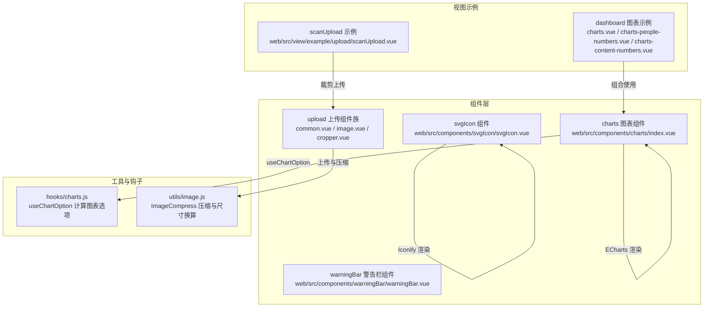
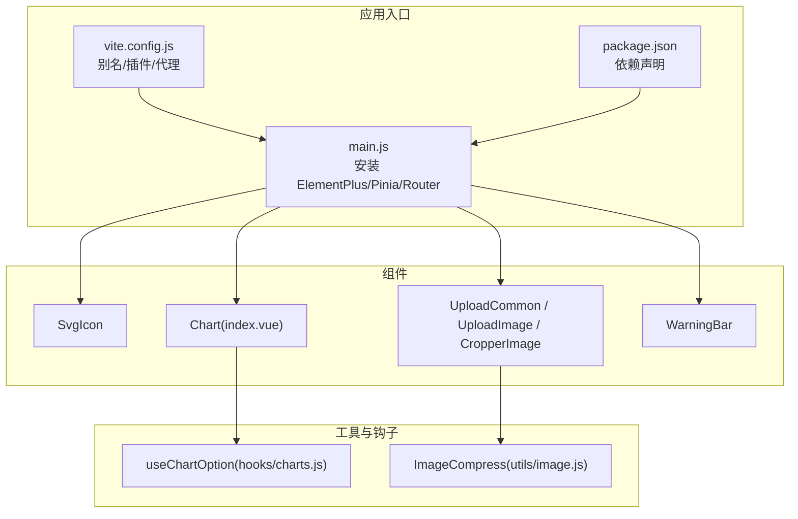
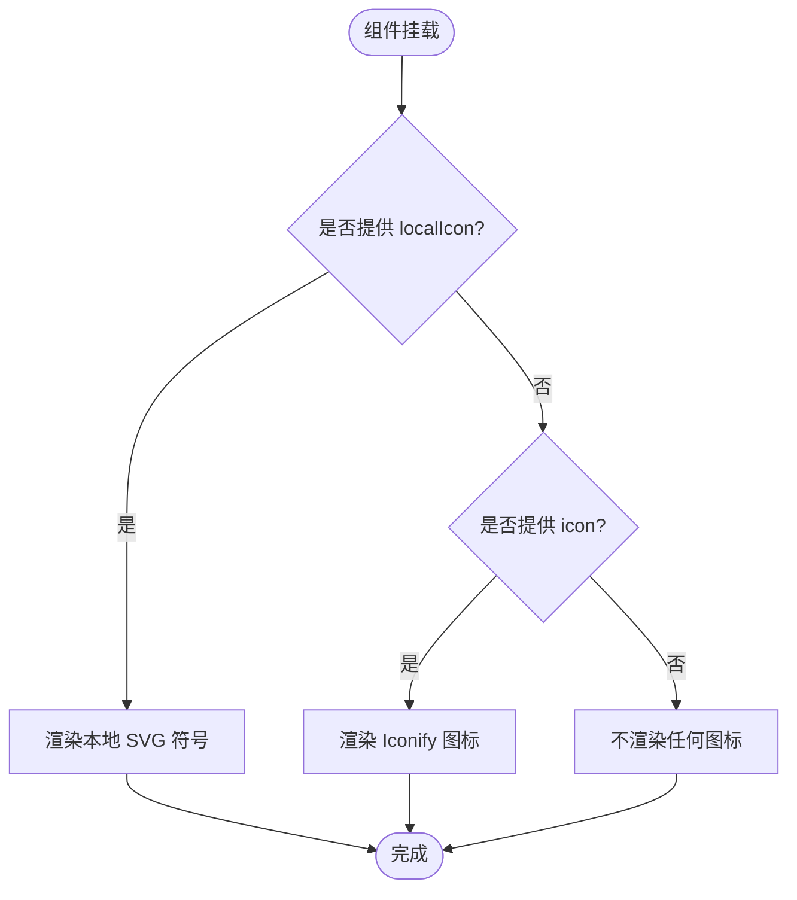
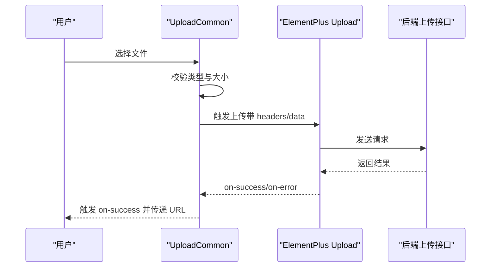
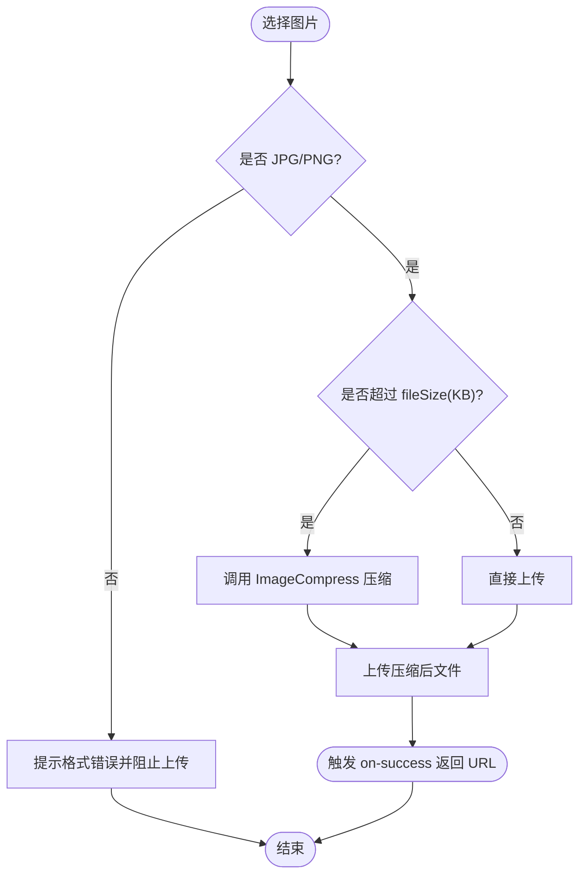
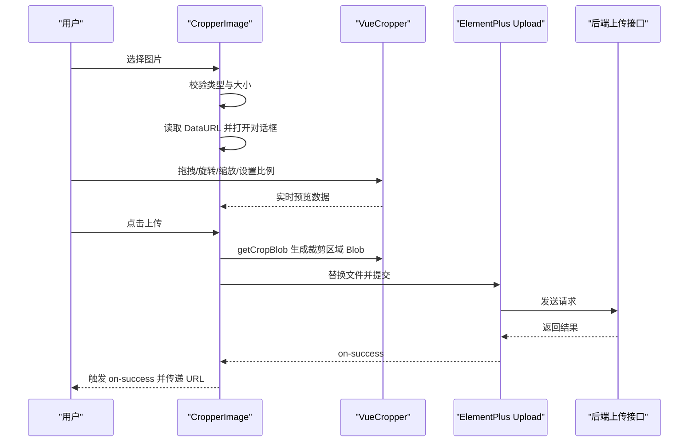
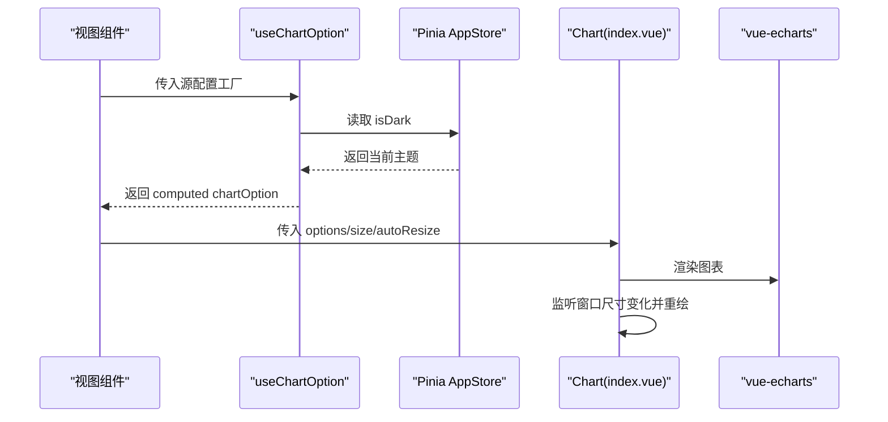
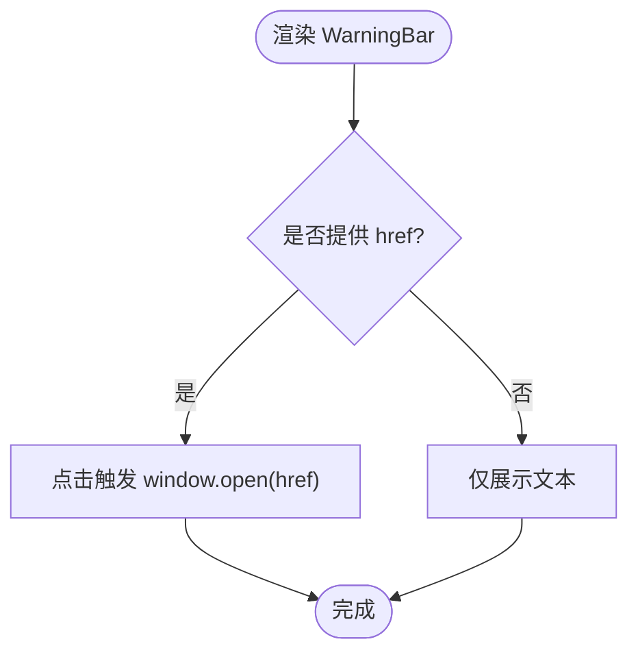
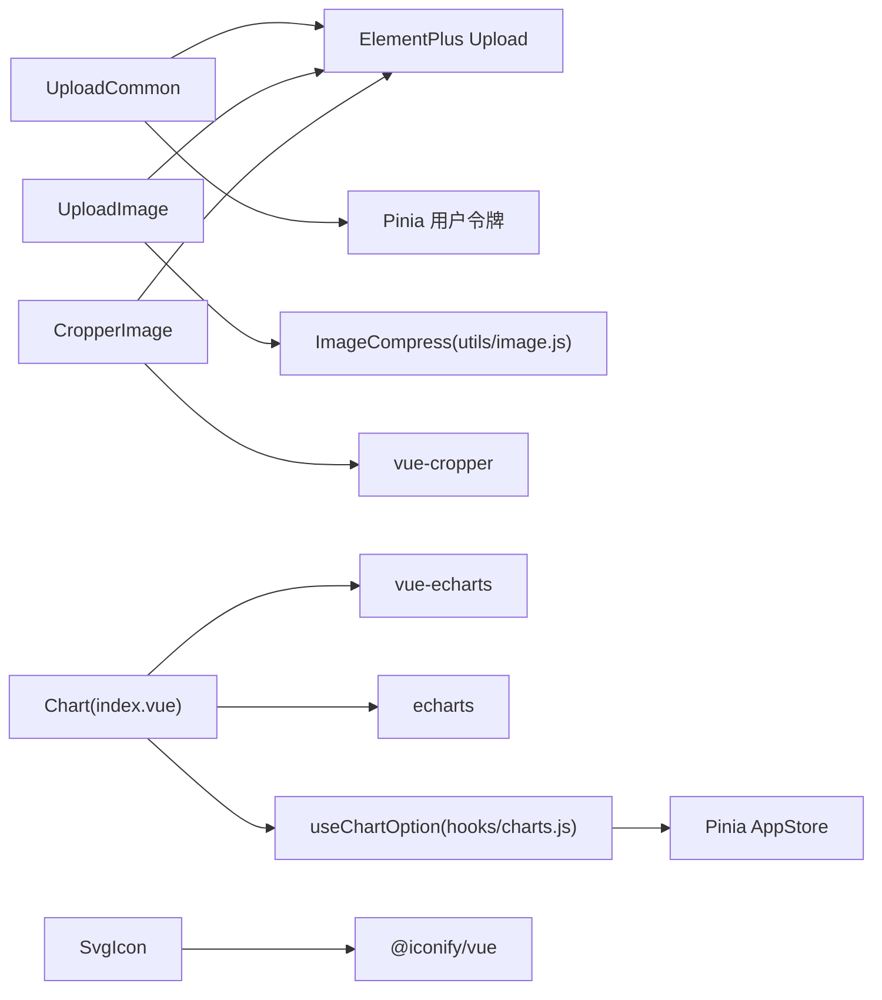

# 自定义组件

<cite>
**本文引用的文件**
- [web\src\components\svgIcon\svgIcon.vue](file://web\src\components\svgIcon\svgIcon.vue)
- [web\src\components\upload\common.vue](file://web\src\components\upload\common.vue)
- [web\src\components\upload\image.vue](file://web\src\components\upload\image.vue)
- [web\src\components\upload\cropper.vue](file://web\src\components\upload\cropper.vue)
- [web\src\components\charts\index.vue](file://web\src\components\charts\index.vue)
- [web\src\hooks\charts.js](file://web\src\hooks\charts.js)
- [web\src\utils\image.js](file://web\src\utils\image.js)
- [web\src\components\warningBar\warningBar.vue](file://web\src\components\warningBar\warningBar.vue)
- [web\src\view\dashboard\components\charts-people-numbers.vue](file://web\src\view\dashboard\components\charts-people-numbers.vue)
- [web\src\view\dashboard\components\charts-content-numbers.vue](file://web\src\view\dashboard\components\charts-content-numbers.vue)
- [web\src\view\dashboard\components\charts.vue](file://web\src\view\dashboard\components\charts.vue)
- [web\src\view\example\upload\scanUpload.vue](file://web\src\view\example\upload\scanUpload.vue)
- [web\src\main.js](file://web\src\main.js)
- [web\package.json](file://web\package.json)
- [web\vite.config.js](file://web\vite.config.js)
</cite>

## 目录
1. [简介](#简介)
2. [项目结构](#项目结构)
3. [核心组件](#核心组件)
4. [架构总览](#架构总览)
5. [详细组件分析](#详细组件分析)
6. [依赖分析](#依赖分析)
7. [性能考虑](#性能考虑)
8. [故障排除指南](#故障排除指南)
9. [结论](#结论)
10. [附录](#附录)

## 简介
本文件面向测试管理平台前端的自定义组件，系统性梳理并说明以下组件的实现原理、使用方法与最佳实践：
- SVG 图标组件：统一渲染本地 SVG 符号与在线 Iconify 图标，支持类名与内联样式的透传。
- 上传组件族：通用上传、图片压缩上传、图片裁剪上传，覆盖多场景文件上传需求。
- 图表组件：基于 ECharts 的封装，支持响应式尺寸与深色主题联动。
- 警告栏组件：用于展示提示信息，支持点击打开外部链接。

文档同时给出 props 属性、事件处理、插槽使用、样式定制、生命周期与状态管理策略，并提供开发规范与调试技巧及集成示例。

## 项目结构
自定义组件主要位于 web/src/components 下，配合 hooks 与 utils 完成能力复用与工具函数支持；视图层示例位于 web/src/view 下，便于对照使用。

**图表来源**
- [web\src\components\svgIcon\svgIcon.vue:1-45](file://web\src\components\svgIcon\svgIcon.vue#L1-L45)
- [web\src\components\upload\common.vue:1-91](file://web\src\components\upload\common.vue#L1-L91)
- [web\src\components\upload\image.vue:1-103](file://web\src\components\upload\image.vue#L1-L103)
- [web\src\components\upload\cropper.vue:1-238](file://web\src\components\upload\cropper.vue#L1-L238)
- [web\src\components\charts\index.vue:1-48](file://web\src\components\charts\index.vue#L1-L48)
- [web\src\hooks\charts.js:1-19](file://web\src\hooks\charts.js#L1-L19)
- [web\src\utils\image.js:1-127](file://web\src\utils\image.js#L1-L127)
- [web\src\view\dashboard\components\charts.vue:1-49](file://web\src\view\dashboard\components\charts.vue#L1-L49)
- [web\src\view\dashboard\components\charts-people-numbers.vue:1-60](file://web\src\view\dashboard\components\charts-people-numbers.vue#L1-L60)
- [web\src\view\dashboard\components\charts-content-numbers.vue:1-106](file://web\src\view\dashboard\components\charts-content-numbers.vue#L1-L106)
- [web\src\view\example\upload\scanUpload.vue:39-245](file://web\src\view\example\upload\scanUpload.vue#L39-L245)

**章节来源**
- [web\src\main.js:1-38](file://web\src\main.js#L1-L38)
- [web\package.json:1-88](file://web\package.json#L1-L88)
- [web\vite.config.js:1-119](file://web\vite.config.js#L1-L119)

## 核心组件
本节概览四个组件的功能定位与典型使用场景：
- SVG 图标组件：统一图标渲染，支持本地 SVG 符号与在线图标库，适合全局图标一致化。
- 上传组件族：覆盖通用上传、图片压缩与裁剪上传，满足不同文件类型与质量要求。
- 图表组件：封装 ECharts，提供自动尺寸适配与深色主题联动，便于快速构建可视化卡片。
- 警告栏组件：轻量提示展示，支持外链跳转，常用于页面顶部或卡片内提示。

**章节来源**
- [web\src\components\svgIcon\svgIcon.vue:16-23](file://web\src\components\svgIcon\svgIcon.vue#L16-L23)
- [web\src\components\upload\common.vue:35-42](file://web\src\components\upload\common.vue#L35-L42)
- [web\src\components\upload\image.vue:29-46](file://web\src\components\upload\image.vue#L29-L46)
- [web\src\components\upload\cropper.vue:99-104](file://web\src\components\upload\cropper.vue#L99-L104)
- [web\src\components\charts\index.vue:15-34](file://web\src\components\charts\index.vue#L15-L34)
- [web\src\hooks\charts.js:7-18](file://web\src\hooks\charts.js#L7-L18)
- [web\src\components\warningBar\warningBar.vue:17-26](file://web\src\components\warningBar\warningBar.vue#L17-L26)

## 架构总览
下图展示组件与外部依赖的关系：Element Plus 提供上传与消息等 UI 能力；@iconify/vue 提供在线图标渲染；vue-echarts 与 echarts 提供图表渲染；vue-cropper 提供图片裁剪能力；Pinia 与自定义 hooks 提供状态与主题联动。

**图表来源**
- [web\src\main.js:1-38](file://web\src\main.js#L1-L38)
- [web\vite.config.js:1-119](file://web\vite.config.js#L1-L119)
- [web\package.json:14-56](file://web\package.json#L14-L56)
- [web\src\components\svgIcon\svgIcon.vue:12-14](file://web\src\components\svgIcon\svgIcon.vue#L12-L14)
- [web\src\components\upload\common.vue:20-25](file://web\src\components\upload\common.vue#L20-L25)
- [web\src\components\upload\image.vue:17-22](file://web\src\components\upload\image.vue#L17-L22)
- [web\src\components\upload\cropper.vue:87-91](file://web\src\components\upload\cropper.vue#L87-L91)
- [web\src\components\charts\index.vue:11-13](file://web\src\components\charts\index.vue#L11-L13)
- [web\src\hooks\charts.js:4-6](file://web\src\hooks\charts.js#L4-L6)
- [web\src\utils\image.js:1-6](file://web\src\utils\image.js#L1-L6)

**章节来源**
- [web\src\main.js:29-36](file://web\src\main.js#L29-L36)
- [web\package.json:14-56](file://web\package.json#L14-L56)
- [web\vite.config.js:24-27](file://web\vite.config.js#L24-L27)

## 详细组件分析

### SVG 图标组件（SvgIcon）
- 功能概述
  - 支持两种图标来源：本地 SVG 符号（通过 symbol id）与在线 Iconify 图标（如“mdi:home”）。
  - 通过透传原生属性（class/style）实现样式定制。
- 关键实现点
  - 条件渲染：当提供本地符号时优先使用本地 SVG；否则使用 Iconify 组件。
  - 属性透传：使用 useAttrs 获取父级传入的 class/style 并绑定到渲染节点。
- Props
  - localIcon: 字符串，本地 SVG 符号 id。
  - icon: 字符串，Iconify 图标名称。
- 插槽与事件
  - 无插槽；通过属性透传实现样式定制。
- 使用示例
  - 本地图标与在线图标均可直接传入 class 进行尺寸与颜色控制。
- 设计模式与复用
  - 单一职责：仅负责图标渲染；通过属性透传实现样式解耦。
- 生命周期与状态
  - 无内部响应式状态；纯渲染组件。
- 样式定制
  - 通过 class/style 透传；也可结合主题变量或暗色模式切换。
- 调试技巧
  - 本地图标需确保已在构建阶段注入；可通过控制台查看可用符号列表。

**图表来源**
- [web\src\components\svgIcon\svgIcon.vue:1-10](file://web\src\components\svgIcon\svgIcon.vue#L1-L10)
- [web\src\components\svgIcon\svgIcon.vue:38-43](file://web\src\components\svgIcon\svgIcon.vue#L38-L43)

**章节来源**
- [web\src\components\svgIcon\svgIcon.vue:16-43](file://web\src\components\svgIcon\svgIcon.vue#L16-L43)

### 上传组件族

#### 通用上传（UploadCommon）
- 功能概述
  - 基于 Element Plus Upload 组件，支持多文件上传、前置校验、错误与成功回调。
  - 默认上传接口地址来自工具函数，携带 token 与附加参数 classId。
- Props
  - classId: 数字，默认 0，用于服务端分类标识。
- 事件
  - on-success: 上传成功时触发，返回文件 URL。
- 校验逻辑
  - 图片与视频类型判断；大小限制（图片 500KB，视频 5MB）。
- 错误处理
  - 失败时弹出消息提示，关闭加载状态。
- 使用示例
  - 在业务表单中引入，监听 on-success 获取文件 URL 并回填。

**图表来源**
- [web\src\components\upload\common.vue:3-15](file://web\src\components\upload\common.vue#L3-L15)
- [web\src\components\upload\common.vue:46-81](file://web\src\components\upload\common.vue#L46-L81)

**章节来源**
- [web\src\components\upload\common.vue:35-89](file://web\src\components\upload\common.vue#L35-L89)

#### 图片压缩上传（UploadImage）
- 功能概述
  - 仅允许 JPG/PNG；超阈值自动压缩，支持最大边长与目标文件大小控制。
- Props
  - imageUrl: 字符串，当前显示的图片 URL。
  - fileSize: 数字，KB，超过该值触发压缩。
  - maxWH: 数字，像素，图片最大边长。
  - classId: 数字，分类标识。
- 事件
  - on-success: 返回压缩后的文件 URL。
- 压缩流程
  - 读取文件 -> 判断类型 -> 超限则调用 ImageCompress 执行压缩 -> 返回新 File 对象。
- 使用示例
  - 适用于头像上传或对图片体积敏感的场景。

**图表来源**
- [web\src\components\upload\image.vue:52-74](file://web\src\components\upload\image.vue#L52-L74)
- [web\src\utils\image.js:8-44](file://web\src\utils\image.js#L8-L44)

**章节来源**
- [web\src\components\upload\image.vue:29-74](file://web\src\components\upload\image.vue#L29-L74)
- [web\src\utils\image.js:1-127](file://web\src\utils\image.js#L1-L127)

#### 图片裁剪上传（CropperImage）
- 功能概述
  - 基于 vue-cropper 提供拖拽、旋转、缩放、比例设置与实时预览；支持裁剪后上传。
- Props
  - classId: 数字，分类标识。
- 事件
  - on-success: 返回裁剪后文件 URL。
- 关键交互
  - 选择图片 -> 读取为 DataURL -> 打开裁剪对话框 -> 设置比例与工具 -> 裁剪生成 Blob -> 替换上传文件并提交。
- 使用示例
  - 适用于需要固定比例或精确裁剪的场景，如 Logo、封面图。

**图表来源**
- [web\src\components\upload\cropper.vue:166-229](file://web\src\components\upload\cropper.vue#L166-L229)
- [web\src\components\upload\cropper.vue:202-216](file://web\src\components\upload\cropper.vue#L202-L216)

**章节来源**
- [web\src\components\upload\cropper.vue:99-229](file://web\src\components\upload\cropper.vue#L99-L229)

### 图表组件（Chart）
- 功能概述
  - 封装 vue-echarts，提供自动尺寸适配与条件渲染，避免 SSR/首帧闪烁。
- Props
  - options: 对象，ECharts 配置项。
  - autoResize: 布尔，是否启用窗口尺寸变化监听。
  - width/height: 字符串，容器尺寸。
- 主题联动
  - 通过 hooks/charts.js 的 useChartOption 计算图表配置，根据深色/浅色模式动态调整颜色与样式。
- 使用示例
  - 在仪表板卡片中引入，传入 computed 的 chartOption 与高度。

**图表来源**
- [web\src\components\charts\index.vue:1-48](file://web\src\components\charts\index.vue#L1-L48)
- [web\src\hooks\charts.js:7-18](file://web\src\hooks\charts.js#L7-L18)
- [web\src\view\dashboard\components\charts-people-numbers.vue:42-60](file://web\src\view\dashboard\components\charts-people-numbers.vue#L42-L60)
- [web\src\view\dashboard\components\charts-content-numbers.vue:54-106](file://web\src\view\dashboard\components\charts-content-numbers.vue#L54-L106)

**章节来源**
- [web\src\components\charts\index.vue:15-44](file://web\src\components\charts\index.vue#L15-L44)
- [web\src\hooks\charts.js:7-18](file://web\src\hooks\charts.js#L7-L18)

### 警告栏组件（WarningBar）
- 功能概述
  - 轻量提示条，支持标题文本与可选外链跳转。
- Props
  - title: 字符串，提示文本。
  - href: 字符串，可选链接，提供时点击可打开。
- 事件
  - 点击：若提供 href，则在新窗口打开链接。
- 使用示例
  - 页面顶部或卡片内展示提示信息，引导用户前往帮助文档或公告页。

**图表来源**
- [web\src\components\warningBar\warningBar.vue:1-14](file://web\src\components\warningBar\warningBar.vue#L1-L14)
- [web\src\components\warningBar\warningBar.vue:28-32](file://web\src\components\warningBar\warningBar.vue#L28-L32)

**章节来源**
- [web\src\components\warningBar\warningBar.vue:17-32](file://web\src\components\warningBar\warningBar.vue#L17-L32)

## 依赖分析
- 组件间依赖
  - UploadCommon/UploadImage/CropperImage 依赖 Element Plus Upload 与 Pinia 用户令牌。
  - CropperImage 依赖 vue-cropper；UploadImage 依赖 utils/image.js 的 ImageCompress。
  - Chart 依赖 vue-echarts 与 echarts；useChartOption 依赖 Pinia AppStore。
  - SvgIcon 依赖 @iconify/vue。
- 外部依赖
  - package.json 中声明了上述依赖；vite.config.js 配置了别名与 SVG 自动导入插件。

**图表来源**
- [web\package.json:14-56](file://web\package.json#L14-L56)
- [web\vite.config.js:109-111](file://web\vite.config.js#L109-L111)
- [web\src\components\upload\image.vue:17-22](file://web\src\components\upload\image.vue#L17-L22)
- [web\src\components\upload\cropper.vue:87-91](file://web\src\components\upload\cropper.vue#L87-L91)
- [web\src\components\charts\index.vue:11-13](file://web\src\components\charts\index.vue#L11-L13)
- [web\src\hooks\charts.js:4-6](file://web\src\hooks\charts.js#L4-L6)
- [web\src\components\svgIcon\svgIcon.vue:12-14](file://web\src\components\svgIcon\svgIcon.vue#L12-L14)

**章节来源**
- [web\package.json:14-56](file://web\package.json#L14-L56)
- [web\vite.config.js:109-111](file://web\vite.config.js#L109-L111)

## 性能考虑
- 图标渲染
  - 本地 SVG 采用 symbol 方式，减少重复 SVG 片段；Iconify 图标按需加载，避免全量引入。
- 上传优化
  - 图片上传前先做类型与大小校验，避免无效请求；压缩上传仅在必要时触发，降低网络与存储压力。
- 图表渲染
  - Chart 通过条件渲染与窗口尺寸监听，避免不必要的重绘；useChartOption 计算属性缓存，减少重复计算。
- 资源加载
  - vite.config.js 启用 Terser 压缩与按需插件，减少包体与加载时间。

[本节为通用指导，无需特定文件引用]

## 故障排除指南
- 上传失败
  - 检查 headers 中 token 是否正确；确认 classId 参数是否符合后端预期。
  - 若为图片压缩上传，确认文件类型与大小阈值设置是否合理。
- 图片裁剪异常
  - 确认 vue-cropper 依赖已安装；检查 DataURL 读取与 Blob 生成流程。
- 图表不显示或尺寸异常
  - 确认容器尺寸设置与 autoResize；检查 useChartOption 返回的配置是否正确。
- 图标不显示
  - 本地图标需确保构建阶段已注入；在线图标需确认图标名称拼写与网络可达。

**章节来源**
- [web\src\components\upload\common.vue:83-89](file://web\src\components\upload\common.vue#L83-L89)
- [web\src\components\upload\image.vue:52-67](file://web\src\components\upload\image.vue#L52-L67)
- [web\src\components\upload\cropper.vue:166-184](file://web\src\components\upload\cropper.vue#L166-L184)
- [web\src\components\charts\index.vue:35-44](file://web\src\components\charts\index.vue#L35-L44)
- [web\src\components\svgIcon\svgIcon.vue:2-9](file://web\src\components\svgIcon\svgIcon.vue#L2-L9)

## 结论
本文件系统梳理了测试管理平台的 SVG 图标、上传组件族、图表组件与警告栏组件的实现与使用方法。通过属性透传、事件回调与 hooks 计算，组件具备良好的扩展性与复用性。结合本文提供的开发规范与调试技巧，可在实际业务中高效集成与迭代。

[本节为总结性内容，无需特定文件引用]

## 附录

### 组件开发规范
- Props 设计
  - 明确必填与可选字段，提供合理默认值；避免过度复杂嵌套。
- 事件命名
  - 采用 on-前缀，语义清晰，如 on-success。
- 插槽使用
  - 仅在必要时提供插槽，保持组件简洁；尽量通过 props 与事件替代插槽。
- 样式定制
  - 优先通过 class/style 透传；避免在组件内硬编码样式。
- 主题适配
  - 使用 hooks 计算主题相关样式，确保深色/浅色模式一致体验。

[本节为通用规范，无需特定文件引用]

### 调试技巧
- 使用浏览器开发者工具检查网络请求与响应，定位上传失败原因。
- 在控制台输出关键变量（如文件大小、类型、压缩结果），辅助定位问题。
- 对图表组件，打印 chartOption 与容器尺寸，确认渲染条件与尺寸监听生效。

[本节为通用技巧，无需特定文件引用]

### 集成示例索引
- 通用上传
  - 引入 UploadCommon，监听 on-success 获取 URL。
- 图片压缩上传
  - 引入 UploadImage，设置 fileSize 与 maxWH。
- 图片裁剪上传
  - 引入 CropperImage，配置 classId；在对话框中完成裁剪与上传。
- 图表组件
  - 在视图中引入 Chart，传入 useChartOption 返回的 chartOption 与高度。
- 警告栏组件
  - 引入 WarningBar，传入 title 与可选 href。

**章节来源**
- [web\src\view\dashboard\components\charts.vue:19-23](file://web\src\view\dashboard\components\charts.vue#L19-L23)
- [web\src\view\dashboard\components\charts-people-numbers.vue:1-60](file://web\src\view\dashboard\components\charts-people-numbers.vue#L1-L60)
- [web\src\view\dashboard\components\charts-content-numbers.vue:1-106](file://web\src\view\dashboard\components\charts-content-numbers.vue#L1-L106)
- [web\src\view\example\upload\scanUpload.vue:176-194](file://web\src\view\example\upload\scanUpload.vue#L176-L194)